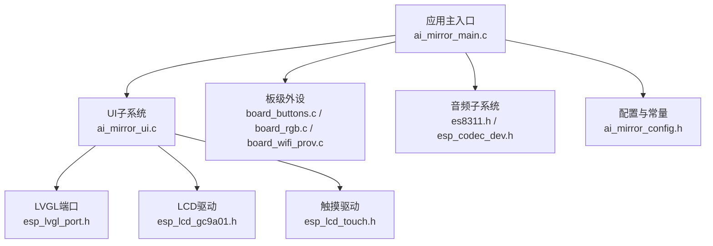
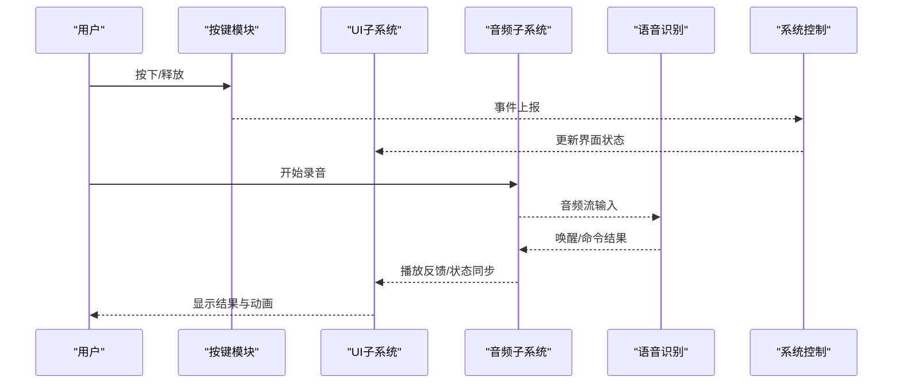
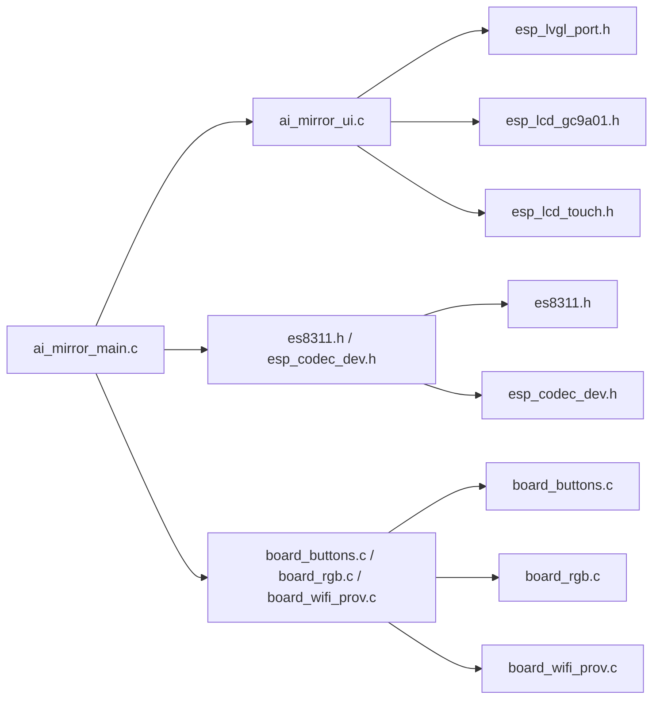

# API参考

<cite>
**本文引用的文件**   
- [ai_mirror_main.c](file://Firmware/esp32_ai_mirror/main/ai_mirror_main.c)
- [ai_mirror_ui.c](file://Firmware/esp32_ai_mirror/main/ai_mirror_ui.c)
- [board_buttons.c](file://Firmware/esp32_ai_mirror/main/board_buttons.c)
- [board_buttons.h](file://Firmware/esp32_ai_mirror/main/board_buttons.h)
- [board_rgb.c](file://Firmware/esp32_ai_mirror/main/board_rgb.c)
- [board_rgb.h](file://Firmware/esp32_ai_mirror/main/board_rgb.h)
- [board_wifi_prov.c](file://Firmware/esp32_ai_mirror/main/board_wifi_prov.c)
- [board_wifi_prov.h](file://Firmware/esp32_ai_mirror/main/board_wifi_prov.h)
- [ai_mirror_config.h](file://Firmware/esp32_ai_mirror/main/ai_mirror_config.h)
- [es8311.h](file://Firmware/esp32_ai_mirror/managed_components/espressif__es8311/include/es8311.h)
- [esp_codec_dev.h](file://Firmware/esp32_ai_mirror/managed_components/espressif__esp_codec_dev/include/esp_codec_dev.h)
- [esp_lvgl_port.h](file://Firmware/esp32_ai_mirror/managed_components/espressif__esp_lvgl_port/include/esp_lvgl_port.h)
- [esp_lcd_touch.h](file://Firmware/esp32_ai_mirror/managed_components/espressif__esp_lcd_touch/include/esp_lcd_touch.h)
- [esp_lcd_gc9a01.h](file://Firmware/esp32_ai_mirror/managed_components/espressif__esp_lcd_gc9a01/include/esp_lcd_gc9a01.h)
- [README.md](file://README.md)
</cite>

## 目录
1. [简介](#简介)
2. [项目结构](#项目结构)
3. [核心组件](#核心组件)
4. [架构总览](#架构总览)
5. [详细组件分析](#详细组件分析)
6. [依赖关系分析](#依赖关系分析)
7. [性能注意事项](#性能注意事项)
8. [故障排查指南](#故障排查指南)
9. [结论](#结论)
10. [附录](#附录)

## 简介
本API参考面向AI镜子项目的嵌入式固件，覆盖UI组件、音频处理、语音识别与系统控制等公共接口。文档以函数原型、参数说明、返回值定义为核心，辅以调用示例、错误处理模式、异步API使用方式与回调注册方法，并提供数据结构、枚举与常量说明、版本兼容性与迁移建议、性能优化与最佳实践。

## 项目结构
本项目基于ESP-IDF构建，核心应用位于main目录，硬件驱动与中间件通过managed_components引入，包括音频编解码、LCD显示、触摸输入与LVGL图形库等。关键入口为ai_mirror_main.c，UI逻辑在ai_mirror_ui.c中实现，板级外设（按键、RGB灯、WiFi配网）分别由对应模块提供统一接口。

图表来源
- [ai_mirror_main.c](file://Firmware/esp32_ai_mirror/main/ai_mirror_main.c)
- [ai_mirror_ui.c](file://Firmware/esp32_ai_mirror/main/ai_mirror_ui.c)
- [board_buttons.c](file://Firmware/esp32_ai_mirror/main/board_buttons.c)
- [board_rgb.c](file://Firmware/esp32_ai_mirror/main/board_rgb.c)
- [board_wifi_prov.c](file://Firmware/esp32_ai_mirror/main/board_wifi_prov.c)
- [esp_lvgl_port.h](file://Firmware/esp32_ai_mirror/managed_components/espressif__esp_lvgl_port/include/esp_lvgl_port.h)
- [esp_lcd_gc9a01.h](file://Firmware/esp32_ai_mirror/managed_components/espressif__esp_lcd_gc9a01/include/esp_lcd_gc9a01.h)
- [esp_lcd_touch.h](file://Firmware/esp32_ai_mirror/managed_components/espressif__esp_lcd_touch/include/esp_lcd_touch.h)
- [es8311.h](file://Firmware/esp32_ai_mirror/managed_components/espressif__es8311/include/es8311.h)
- [esp_codec_dev.h](file://Firmware/esp32_ai_mirror/managed_components/espressif__esp_codec_dev/include/esp_codec_dev.h)
- [ai_mirror_config.h](file://Firmware/esp32_ai_mirror/main/ai_mirror_config.h)

章节来源
- [README.md](file://README.md)

## 核心组件
- 应用主入口：负责初始化各子系统、创建任务与事件循环、协调UI与音频流程。
- UI子系统：封装LVGL界面生命周期、控件操作、触摸事件处理与刷新策略。
- 音频子系统：封装I2S/Codec设备初始化、录音与播放管线、音量与静音控制。
- 语音识别：集成唤醒词检测与命令识别，提供状态回调与结果上报。
- 系统控制：按键扫描、RGB指示灯、WiFi配网与网络状态管理。

章节来源
- [ai_mirror_main.c](file://Firmware/esp32_ai_mirror/main/ai_mirror_main.c)
- [ai_mirror_ui.c](file://Firmware/esp32_ai_mirror/main/ai_mirror_ui.c)
- [board_buttons.c](file://Firmware/esp32_ai_mirror/main/board_buttons.c)
- [board_rgb.c](file://Firmware/esp32_ai_mirror/main/board_rgb.c)
- [board_wifi_prov.c](file://Firmware/esp32_ai_mirror/main/board_wifi_prov.c)
- [es8311.h](file://Firmware/esp32_ai_mirror/managed_components/espressif__es8311/include/es8311.h)
- [esp_codec_dev.h](file://Firmware/esp32_ai_mirror/managed_components/espressif__esp_codec_dev/include/esp_codec_dev.h)

## 架构总览
下图展示从用户交互到音频与UI的端到端数据流，以及语音识别与系统控制的协作关系。

图表来源
- [board_buttons.c](file://Firmware/esp32_ai_mirror/main/board_buttons.c)
- [ai_mirror_ui.c](file://Firmware/esp32_ai_mirror/main/ai_mirror_ui.c)
- [es8311.h](file://Firmware/esp32_ai_mirror/managed_components/espressif__es8311/include/es8311.h)
- [esp_codec_dev.h](file://Firmware/esp32_ai_mirror/managed_components/espressif__esp_codec_dev/include/esp_codec_dev.h)

## 详细组件分析

### UI组件API
- 初始化与生命周期
  - 初始化LVGL与显示驱动，设置刷新周期与渲染线程。
  - 创建根容器与页面布局，绑定触摸事件回调。
- 控件操作
  - 文本标签更新、进度条设置、图像切换与按钮状态控制。
  - 页面导航与模态对话框显示/隐藏。
- 事件处理
  - 触摸坐标解析、长按/短按判定、滑动方向识别。
  - 事件分发至业务层，触发UI状态机更新。
- 刷新策略
  - 增量刷新与全屏刷新选择，避免频繁重绘导致卡顿。
  - 帧率限制与掉帧保护机制。

调用示例（路径引用）
- 初始化UI并绑定事件：[ai_mirror_ui.c](file://Firmware/esp32_ai_mirror/main/ai_mirror_ui.c)
- 更新文本与进度条：[ai_mirror_ui.c](file://Firmware/esp32_ai_mirror/main/ai_mirror_ui.c)
- 触摸回调处理：[ai_mirror_ui.c](file://Firmware/esp32_ai_mirror/main/ai_mirror_ui.c)

错误处理模式
- 初始化失败返回错误码，记录日志并回退到安全界面。
- 控件不存在时跳过更新并上报警告。
- 内存不足时降级刷新策略或提示资源紧张。

异步API与回调
- 页面加载采用异步任务，完成后通过回调通知UI线程。
- 图片解码与缩放任务化，避免阻塞主循环。

章节来源
- [ai_mirror_ui.c](file://Firmware/esp32_ai_mirror/main/ai_mirror_ui.c)
- [esp_lvgl_port.h](file://Firmware/esp32_ai_mirror/managed_components/espressif__esp_lvgl_port/include/esp_lvgl_port.h)
- [esp_lcd_gc9a01.h](file://Firmware/esp32_ai_mirror/managed_components/espressif__esp_lcd_gc9a01/include/esp_lcd_gc9a01.h)
- [esp_lcd_touch.h](file://Firmware/esp32_ai_mirror/managed_components/espressif__esp_lcd_touch/include/esp_lcd_touch.h)

### 音频处理API
- 设备初始化
  - 配置I2S与Codec芯片，设置采样率、位宽与通道数。
  - 启动音频时钟与DMA缓冲队列。
- 录音与播放
  - 开始/停止录音，读取PCM数据块；开始/停止播放，写入PCM数据块。
  - 支持环形缓冲区与背压控制，防止丢帧。
- 音量与静音
  - 获取/设置数字音量，切换静音状态，支持软音量与硬件音量联动。
- 音频路由
  - 选择输入源（麦克风/线路输入），输出目标（扬声器/耳机）。

调用示例（路径引用）
- 初始化音频链路：[es8311.h](file://Firmware/esp32_ai_mirror/managed_components/espressif__es8311/include/es8311.h), [esp_codec_dev.h](file://Firmware/esp32_ai_mirror/managed_components/espressif__esp_codec_dev/include/esp_codec_dev.h)
- 录音回调与播放回调：[esp_codec_dev.h](file://Firmware/esp32_ai_mirror/managed_components/espressif__esp_codec_dev/include/esp_codec_dev.h)

错误处理模式
- 设备打开失败返回错误码，重试与降级策略。
- 缓冲区溢出/下溢时丢弃部分数据并记录告警。
- 音量设置越界自动修正并返回成功。

异步API与回调
- 录音/播放采用回调驱动，回调中完成数据搬运。
- 状态变化（如设备断开）通过事件回调通知上层。

章节来源
- [es8311.h](file://Firmware/esp32_ai_mirror/managed_components/espressif__es8311/include/es8311.h)
- [esp_codec_dev.h](file://Firmware/esp32_ai_mirror/managed_components/espressif__esp_codec_dev/include/esp_codec_dev.h)

### 语音识别API
- 模型加载
  - 加载唤醒词与命令识别模型，校验模型完整性。
- 实时推理
  - 接收音频流，进行VAD与关键词检测，输出置信度与命中结果。
- 状态管理
  - 监听器状态（空闲、唤醒、识别中、结束），事件回调上报。
- 结果处理
  - 命令解析与动作映射，触发UI与系统控制。

调用示例（路径引用）
- 初始化识别引擎与回调注册：[ai_mirror_main.c](file://Firmware/esp32_ai_mirror/main/ai_mirror_main.c)
- 音频流接入与结果回调：[ai_mirror_main.c](file://Firmware/esp32_ai_mirror/main/ai_mirror_main.c)

错误处理模式
- 模型加载失败回退到默认模型或提示不可用。
- 推理超时或内存不足时暂停识别并恢复。
- 结果置信度低于阈值忽略并继续监听。

异步API与回调
- 识别过程后台运行，通过回调上报状态与结果。
- 支持动态切换模型与热词表。

章节来源
- [ai_mirror_main.c](file://Firmware/esp32_ai_mirror/main/ai_mirror_main.c)

### 系统控制API
- 按键扫描
  - 轮询或中断方式采集按键状态，去抖与长按判定。
  - 事件类型（短按、长按、双击）与键值映射。
- RGB指示灯
  - 设置颜色、亮度与闪烁模式，用于状态指示。
- WiFi配网
  - 启动配网流程，生成二维码或AP热点，回调连接状态。
  - 获取网络信息（SSID、IP、信号强度）。

调用示例（路径引用）
- 按键事件回调注册：[board_buttons.c](file://Firmware/esp32_ai_mirror/main/board_buttons.c), [board_buttons.h](file://Firmware/esp32_ai_mirror/main/board_buttons.h)
- RGB控制接口：[board_rgb.c](file://Firmware/esp32_ai_mirror/main/board_rgb.c), [board_rgb.h](file://Firmware/esp32_ai_mirror/main/board_rgb.h)
- WiFi配网流程：[board_wifi_prov.c](file://Firmware/esp32_ai_mirror/main/board_wifi_prov.c), [board_wifi_prov.h](file://Firmware/esp32_ai_mirror/main/board_wifi_prov.h)

错误处理模式
- 按键扫描失败返回错误码，启用备用轮询策略。
- RGB写入失败重试并降级为单色指示。
- WiFi配网超时或失败提示重新配网。

异步API与回调
- 配网状态通过回调上报，避免阻塞主循环。
- 按键事件通过事件队列分发，保证实时性。

章节来源
- [board_buttons.c](file://Firmware/esp32_ai_mirror/main/board_buttons.c)
- [board_buttons.h](file://Firmware/esp32_ai_mirror/main/board_buttons.h)
- [board_rgb.c](file://Firmware/esp32_ai_mirror/main/board_rgb.c)
- [board_rgb.h](file://Firmware/esp32_ai_mirror/main/board_rgb.h)
- [board_wifi_prov.c](file://Firmware/esp32_ai_mirror/main/board_wifi_prov.c)
- [board_wifi_prov.h](file://Firmware/esp32_ai_mirror/main/board_wifi_prov.h)

### 数据结构、枚举与常量
- 配置项
  - 音频参数（采样率、位宽、通道数）、UI刷新频率、按键去抖时间。
- 状态枚举
  - 音频状态（空闲、录音、播放、错误）、识别状态（监听、唤醒、识别中、结束）、WiFi状态（未连接、配网中、已连接）。
- 事件类型
  - 按键事件、触摸事件、音频事件、识别结果事件、网络事件。

章节来源
- [ai_mirror_config.h](file://Firmware/esp32_ai_mirror/main/ai_mirror_config.h)

## 依赖关系分析
- 应用主入口依赖UI、音频、系统控制模块，并通过事件总线协调。
- UI依赖LVGL端口、LCD驱动与触摸驱动。
- 音频依赖Codec驱动与I2S平台抽象。
- 语音识别依赖音频流输入与模型库。
- 系统控制依赖板级外设驱动与网络栈。

图表来源
- [ai_mirror_main.c](file://Firmware/esp32_ai_mirror/main/ai_mirror_main.c)
- [ai_mirror_ui.c](file://Firmware/esp32_ai_mirror/main/ai_mirror_ui.c)
- [board_buttons.c](file://Firmware/esp32_ai_mirror/main/board_buttons.c)
- [board_rgb.c](file://Firmware/esp32_ai_mirror/main/board_rgb.c)
- [board_wifi_prov.c](file://Firmware/esp32_ai_mirror/main/board_wifi_prov.c)
- [esp_lvgl_port.h](file://Firmware/esp32_ai_mirror/managed_components/espressif__esp_lvgl_port/include/esp_lvgl_port.h)
- [esp_lcd_gc9a01.h](file://Firmware/esp32_ai_mirror/managed_components/espressif__esp_lcd_gc9a01/include/esp_lcd_gc9a01.h)
- [esp_lcd_touch.h](file://Firmware/esp32_ai_mirror/managed_components/espressif__esp_lcd_touch/include/esp_lcd_touch.h)
- [es8311.h](file://Firmware/esp32_ai_mirror/managed_components/espressif__es8311/include/es8311.h)
- [esp_codec_dev.h](file://Firmware/esp32_ai_mirror/managed_components/espressif__esp_codec_dev/include/esp_codec_dev.h)

章节来源
- [ai_mirror_main.c](file://Firmware/esp32_ai_mirror/main/ai_mirror_main.c)

## 性能注意事项
- 音频流水线
  - 合理设置缓冲区大小与回调粒度，减少上下文切换开销。
  - 使用零拷贝或共享缓冲区降低内存占用。
- UI渲染
  - 启用增量刷新，避免全量重绘；限制动画帧率。
  - 预加载常用资源，减少运行时解码压力。
- 语音识别
  - 调整VAD阈值与窗口长度，平衡灵敏度与功耗。
  - 模型量化与缓存提升推理速度。
- 系统控制
  - 按键扫描使用中断+去抖算法，降低CPU占用。
  - WiFi配网异步化，避免阻塞主循环。

## 故障排查指南
- 常见问题
  - 音频无输出：检查Codec初始化、I2S配置与音量设置。
  - UI卡顿：查看刷新策略与资源加载是否阻塞。
  - 识别不灵敏：调整VAD阈值与模型参数。
  - 配网失败：确认热点/二维码生成与网络权限。
- 调试手段
  - 启用详细日志与性能计数器。
  - 使用断点与堆栈跟踪定位崩溃点。
  - 模拟输入（按键、触摸、音频）验证分支逻辑。

章节来源
- [ai_mirror_main.c](file://Firmware/esp32_ai_mirror/main/ai_mirror_main.c)
- [ai_mirror_ui.c](file://Firmware/esp32_ai_mirror/main/ai_mirror_ui.c)
- [board_buttons.c](file://Firmware/esp32_ai_mirror/main/board_buttons.c)
- [board_rgb.c](file://Firmware/esp32_ai_mirror/main/board_rgb.c)
- [board_wifi_prov.c](file://Firmware/esp32_ai_mirror/main/board_wifi_prov.c)

## 结论
本API参考覆盖了AI镜子项目的核心接口与调用模式，提供了清晰的职责划分与数据流向。通过模块化设计与异步回调机制，系统在资源受限环境下仍能保持良好响应性与稳定性。建议在实际集成中遵循错误处理与性能优化建议，确保用户体验与可靠性。

## 附录
- 版本兼容性与迁移
  - 保持接口向后兼容，新增字段采用可选参数。
  - 废弃接口保留兼容层，逐步引导迁移。
- 最佳实践
  - 统一错误码与日志格式，便于问题定位。
  - 资源申请与释放成对出现，避免泄漏。
  - 关键路径添加超时与重试机制。