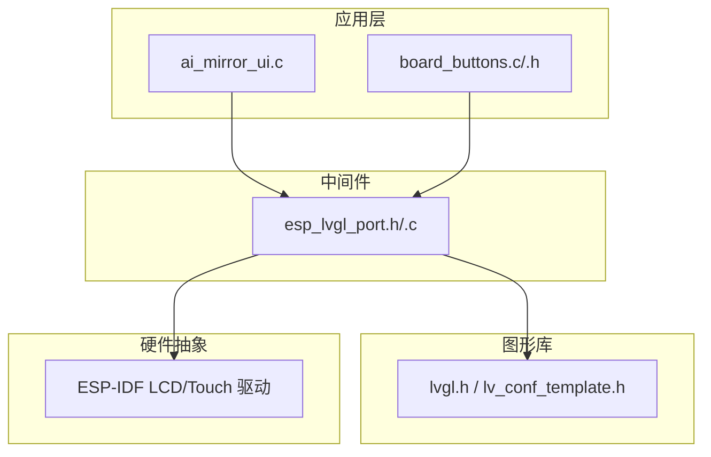
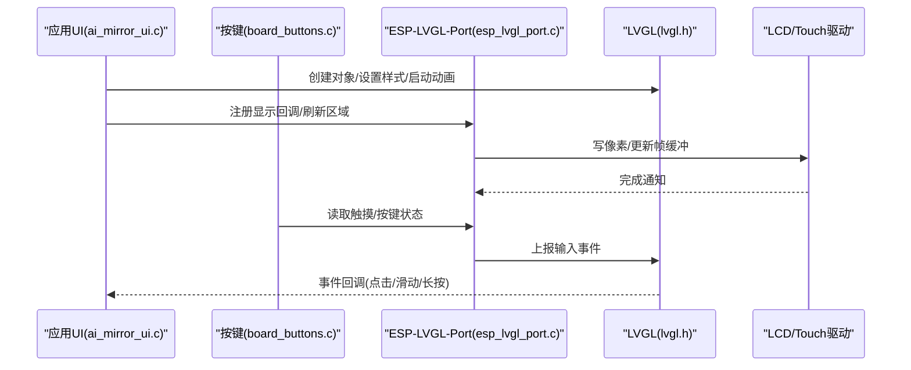
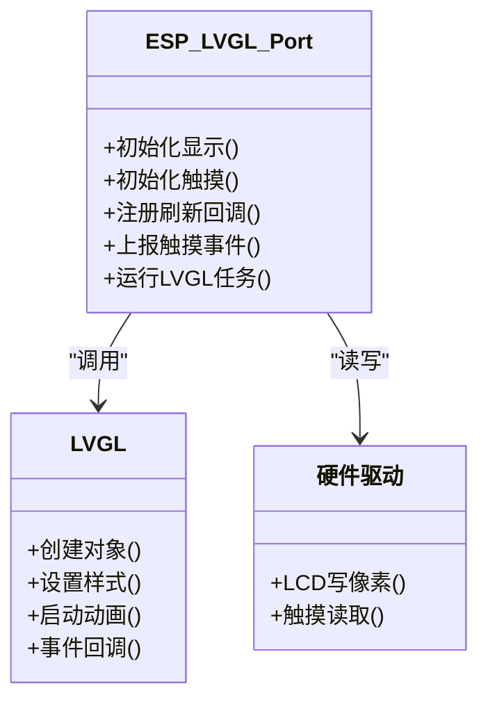
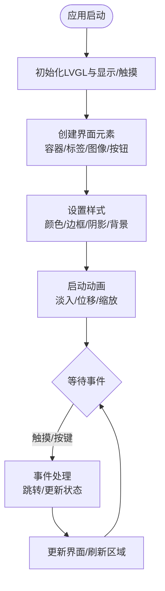
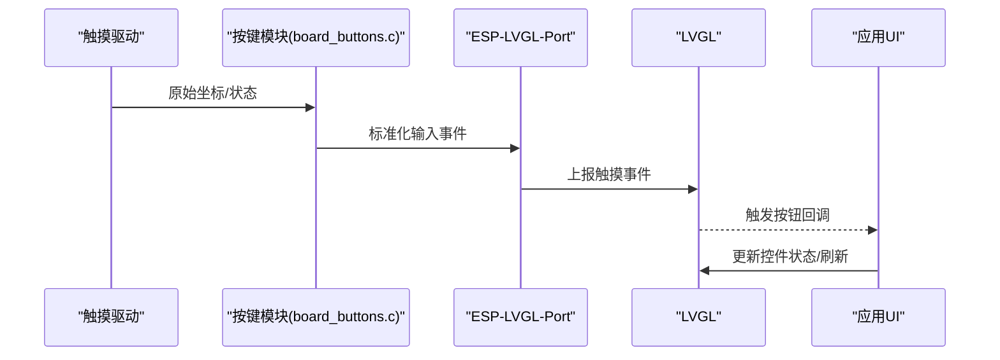
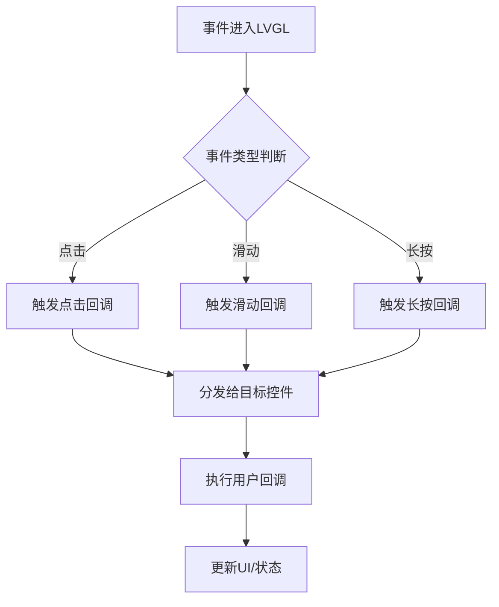
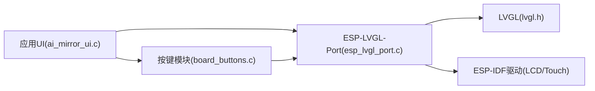

# UI接口API

<cite>
**本文引用的文件**   
- [ai_mirror_ui.c](file://Firmware/esp32_ai_mirror/main/ai_mirror_ui.c)
- [board_buttons.c](file://Firmware/esp32_ai_mirror/main/board_buttons.c)
- [board_buttons.h](file://Firmware/esp32_ai_mirror/main/board_buttons.h)
- [esp_lvgl_port.h](file://Firmware/esp32_ai_mirror/managed_components/espressif__esp_lvgl_port/include/esp_lvgl_port.h)
- [esp_lvgl_port.c](file://Firmware/esp32_ai_mirror/managed_components/espressif__esp_lvgl_port/esp_lvgl_port.c)
- [README.md](file://Firmware/esp32_ai_mirror/managed_components/espressif__esp_lvgl_port/README.md)
- [performance.md](file://Firmware/esp32_ai_mirror/managed_components/espressif__esp_lvgl_port/docs/performance.md)
- [lv_conf_template.h](file://Firmware/esp32_ai_mirror/managed_components/lvgl__lvgl/lv_conf_template.h)
- [lvgl.h](file://Firmware/esp32_ai_mirror/managed_components/lvgl__lvgl/lvgl.h)
- [CMakeLists.txt](file://Firmware/esp32_ai_mirror/main/CMakeLists.txt)
- [sdkconfig.defaults](file://Firmware/esp32_ai_mirror/sdkconfig.defaults)
</cite>

## 目录
1. [简介](#简介)
2. [项目结构](#项目结构)
3. [核心组件](#核心组件)
4. [架构总览](#架构总览)
5. [详细组件分析](#详细组件分析)
6. [依赖关系分析](#依赖关系分析)
7. [性能考虑](#性能考虑)
8. [故障排查指南](#故障排查指南)
9. [结论](#结论)
10. [附录](#附录)

## 简介
本文件面向ESP32 AI镜像项目的UI接口API，聚焦LVGL图形库与ESP-LVGL-Port的集成使用。内容涵盖：
- 屏幕显示、触摸输入、按钮事件处理等用户界面相关函数接口
- LVGL对象创建、样式设置、动画效果的调用方式
- 事件处理机制与回调函数的使用方法
- 内存管理与性能优化技巧
- 错误处理与调试方法

## 项目结构
本项目采用分层组织：应用层（main）负责UI业务逻辑与交互；组件层通过ESP-LVGL-Port桥接LVGL与ESP-IDF底层驱动（LCD、触摸、任务调度）。关键文件包括：
- 应用UI实现：ai_mirror_ui.c
- 板载按键抽象：board_buttons.c/.h
- ESP-LVGL-Port封装：esp_lvgl_port.h/.c 及文档
- LVGL配置模板与头文件：lv_conf_template.h、lvgl.h
- 构建与配置：CMakeLists.txt、sdkconfig.defaults

图表来源
- [ai_mirror_ui.c](file://Firmware/esp32_ai_mirror/main/ai_mirror_ui.c)
- [board_buttons.c](file://Firmware/esp32_ai_mirror/main/board_buttons.c)
- [esp_lvgl_port.h](file://Firmware/esp32_ai_mirror/managed_components/espressif__esp_lvgl_port/include/esp_lvgl_port.h)
- [esp_lvgl_port.c](file://Firmware/esp32_ai_mirror/managed_components/espressif__esp_lvgl_port/esp_lvgl_port.c)
- [lvgl.h](file://Firmware/esp32_ai_mirror/managed_components/lvgl__lvgl/lvgl.h)
- [lv_conf_template.h](file://Firmware/esp32_ai_mirror/managed_components/lvgl__lvgl/lv_conf_template.h)

章节来源
- [CMakeLists.txt](file://Firmware/esp32_ai_mirror/main/CMakeLists.txt)
- [sdkconfig.defaults](file://Firmware/esp32_ai_mirror/sdkconfig.defaults)

## 核心组件
- ai_mirror_ui.c：UI主入口与页面/控件初始化、刷新策略、动画与事件分发
- board_buttons.c/.h：板载按键映射、去抖、扫描与事件上报
- esp_lvgl_port：ESP-IDF与LVGL之间的端口适配（显示缓冲、刷新、触摸输入、任务调度）
- LVGL配置：分辨率、颜色深度、缓存、渲染后端选择、字体与图片支持等

章节来源
- [ai_mirror_ui.c](file://Firmware/esp32_ai_mirror/main/ai_mirror_ui.c)
- [board_buttons.c](file://Firmware/esp32_ai_mirror/main/board_buttons.c)
- [board_buttons.h](file://Firmware/esp32_ai_mirror/main/board_buttons.h)
- [esp_lvgl_port.h](file://Firmware/esp32_ai_mirror/managed_components/espressif__esp_lvgl_port/include/esp_lvgl_port.h)
- [esp_lvgl_port.c](file://Firmware/esp32_ai_mirror/managed_components/espressif__esp_lvgl_port/esp_lvgl_port.c)
- [lv_conf_template.h](file://Firmware/esp32_ai_mirror/managed_components/lvgl__lvgl/lv_conf_template.h)

## 架构总览
下图展示从应用UI到LVGL再到硬件驱动的调用链路与数据流。

图表来源
- [ai_mirror_ui.c](file://Firmware/esp32_ai_mirror/main/ai_mirror_ui.c)
- [board_buttons.c](file://Firmware/esp32_ai_mirror/main/board_buttons.c)
- [esp_lvgl_port.c](file://Firmware/esp32_ai_mirror/managed_components/espressif__esp_lvgl_port/esp_lvgl_port.c)
- [lvgl.h](file://Firmware/esp32_ai_mirror/managed_components/lvgl__lvgl/lvgl.h)

## 详细组件分析

### 组件A：ESP-LVGL-Port 集成与配置
- 作用：将ESP-IDF的LCD/Touch驱动与LVGL生命周期、刷新机制、输入事件对接
- 关键点：
  - 显示缓冲与刷新：半缓冲/全缓冲、脏矩形、刷新频率
  - 触摸输入：坐标转换、多点触控、去抖与过滤
  - 任务与调度：LVGL任务周期、优先级、CPU核绑定
  - 内存管理：显存分配、堆大小、图片缓存策略
- 常用接口（概念性说明）：
  - 初始化显示与触摸
  - 注册LVGL刷新回调
  - 上报触摸事件
  - 控制LVGL任务运行
- 配置项（参考模板与文档）：
  - 分辨率、颜色格式、旋转
  - 双缓冲/单缓冲、行缓冲大小
  - 触摸IC型号与I2C/SPI参数
  - 字体、图片解码器、动画加速

图表来源
- [esp_lvgl_port.h](file://Firmware/esp32_ai_mirror/managed_components/espressif__esp_lvgl_port/include/esp_lvgl_port.h)
- [esp_lvgl_port.c](file://Firmware/esp32_ai_mirror/managed_components/espressif__esp_lvgl_port/esp_lvgl_port.c)
- [lvgl.h](file://Firmware/esp32_ai_mirror/managed_components/lvgl__lvgl/lvgl.h)

章节来源
- [esp_lvgl_port.h](file://Firmware/esp32_ai_mirror/managed_components/espressif__esp_lvgl_port/include/esp_lvgl_port.h)
- [esp_lvgl_port.c](file://Firmware/esp32_ai_mirror/managed_components/espressif__esp_lvgl_port/esp_lvgl_port.c)
- [README.md](file://Firmware/esp32_ai_mirror/managed_components/espressif__esp_lvgl_port/README.md)
- [performance.md](file://Firmware/esp32_ai_mirror/managed_components/espressif__esp_lvgl_port/docs/performance.md)
- [lv_conf_template.h](file://Firmware/esp32_ai_mirror/managed_components/lvgl__lvgl/lv_conf_template.h)

### 组件B：UI主流程与界面元素
- 界面元素创建：容器、标签、图像、按钮、滑块等
- 样式设置：颜色、边框、阴影、渐变、背景图
- 动画效果：淡入淡出、位移、缩放、旋转、进度条动画
- 刷新策略：局部刷新、全屏刷新、滚动区域优化
- 示例调用路径（以路径代替代码片段）：
  - 创建对象与布局：[ai_mirror_ui.c](file://Firmware/esp32_ai_mirror/main/ai_mirror_ui.c)
  - 样式定义与复用：[ai_mirror_ui.c](file://Firmware/esp32_ai_mirror/main/ai_mirror_ui.c)
  - 动画启停与回调：[ai_mirror_ui.c](file://Firmware/esp32_ai_mirror/main/ai_mirror_ui.c)

图表来源
- [ai_mirror_ui.c](file://Firmware/esp32_ai_mirror/main/ai_mirror_ui.c)
- [lvgl.h](file://Firmware/esp32_ai_mirror/managed_components/lvgl__lvgl/lvgl.h)

章节来源
- [ai_mirror_ui.c](file://Firmware/esp32_ai_mirror/main/ai_mirror_ui.c)

### 组件C：触摸输入与按钮事件处理
- 触摸输入：坐标采集、多点触控、手势识别（点击、滑动、长按）
- 按钮事件：按下、释放、长按、重复触发
- 去抖与滤波：时间阈值、坐标漂移抑制
- 事件分发：LVGL事件模型、回调注册、上下文传递

图表来源
- [board_buttons.c](file://Firmware/esp32_ai_mirror/main/board_buttons.c)
- [board_buttons.h](file://Firmware/esp32_ai_mirror/main/board_buttons.h)
- [esp_lvgl_port.c](file://Firmware/esp32_ai_mirror/managed_components/espressif__esp_lvgl_port/esp_lvgl_port.c)
- [lvgl.h](file://Firmware/esp32_ai_mirror/managed_components/lvgl__lvgl/lvgl.h)

章节来源
- [board_buttons.c](file://Firmware/esp32_ai_mirror/main/board_buttons.c)
- [board_buttons.h](file://Firmware/esp32_ai_mirror/main/board_buttons.h)

### 组件D：事件处理机制与回调函数
- LVGL事件类型：点击、双击、长按、滑动、焦点变化、绘制前/后
- 回调注册：在控件上绑定事件处理器，传入上下文指针
- 事件传播：冒泡与捕获，父子节点间的事件转发
- 最佳实践：避免阻塞回调；使用队列或标志位异步处理耗时操作

图表来源
- [lvgl.h](file://Firmware/esp32_ai_mirror/managed_components/lvgl__lvgl/lvgl.h)
- [ai_mirror_ui.c](file://Firmware/esp32_ai_mirror/main/ai_mirror_ui.c)

章节来源
- [lvgl.h](file://Firmware/esp32_ai_mirror/managed_components/lvgl__lvgl/lvgl.h)
- [ai_mirror_ui.c](file://Firmware/esp32_ai_mirror/main/ai_mirror_ui.c)

## 依赖关系分析
- 应用层依赖ESP-LVGL-Port提供的显示与输入抽象
- ESP-LVGL-Port依赖LVGL API与ESP-IDF驱动
- LVGL配置影响内存占用、渲染性能与功能开关

图表来源
- [ai_mirror_ui.c](file://Firmware/esp32_ai_mirror/main/ai_mirror_ui.c)
- [board_buttons.c](file://Firmware/esp32_ai_mirror/main/board_buttons.c)
- [esp_lvgl_port.c](file://Firmware/esp32_ai_mirror/managed_components/espressif__esp_lvgl_port/esp_lvgl_port.c)
- [lvgl.h](file://Firmware/esp32_ai_mirror/managed_components/lvgl__lvgl/lvgl.h)

章节来源
- [CMakeLists.txt](file://Firmware/esp32_ai_mirror/main/CMakeLists.txt)
- [sdkconfig.defaults](file://Firmware/esp32_ai_mirror/sdkconfig.defaults)

## 性能考虑
- 显示缓冲策略：优先使用半缓冲+脏矩形刷新，减少带宽压力
- 动画与重绘：合并多次更新，避免频繁全屏刷新
- 图片与字体：按需加载、压缩格式、子集字体
- 任务与优先级：LVGL任务与音频/网络任务隔离，避免卡顿
- 内存管理：合理设置堆大小、禁用未用特性、控制图片缓存
- 参考文档：[performance.md](file://Firmware/esp32_ai_mirror/managed_components/espressif__esp_lvgl_port/docs/performance.md)

章节来源
- [performance.md](file://Firmware/esp32_ai_mirror/managed_components/espressif__esp_lvgl_port/docs/performance.md)
- [lv_conf_template.h](file://Firmware/esp32_ai_mirror/managed_components/lvgl__lvgl/lv_conf_template.h)

## 故障排查指南
- 常见问题
  - 屏幕花屏/闪烁：检查刷新回调、缓冲区大小、DMA配置
  - 触摸无响应：确认I2C/SPI通信、坐标转换、去抖阈值
  - 卡顿/掉帧：降低动画复杂度、减少重绘区域、优化事件回调
  - 内存不足：减小图片尺寸、关闭未用特性、调整堆大小
- 调试方法
  - 启用LVGL调试宏与日志级别
  - 使用ESP-LVGL-Port的性能统计接口
  - 分段打印关键路径耗时
  - 使用示波器/逻辑分析仪验证时序

章节来源
- [esp_lvgl_port.c](file://Firmware/esp32_ai_mirror/managed_components/espressif__esp_lvgl_port/esp_lvgl_port.c)
- [lv_conf_template.h](file://Firmware/esp32_ai_mirror/managed_components/lvgl__lvgl/lv_conf_template.h)

## 结论
通过ESP-LVGL-Port桥接LVGL与ESP-IDF，项目实现了高效的UI渲染与输入处理。遵循本文档的配置与实践建议，可在资源受限的嵌入式平台上获得流畅的用户体验。建议在开发中持续监控内存与性能指标，结合LVGL与ESP-LVGL-Port的文档进行调优。

## 附录
- 快速上手步骤（概念性）
  - 初始化ESP-LVGL-Port（显示与触摸）
  - 创建LVGL对象并设置样式
  - 注册事件回调与动画
  - 在主循环中运行LVGL任务
- 参考文件
  - [README.md](file://Firmware/esp32_ai_mirror/managed_components/espressif__esp_lvgl_port/README.md)
  - [lv_conf_template.h](file://Firmware/esp32_ai_mirror/managed_components/lvgl__lvgl/lv_conf_template.h)
  - [lvgl.h](file://Firmware/esp32_ai_mirror/managed_components/lvgl__lvgl/lvgl.h)