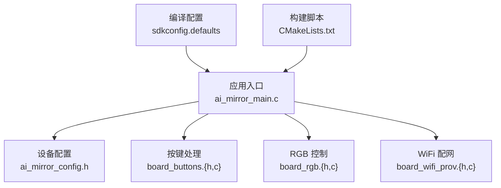
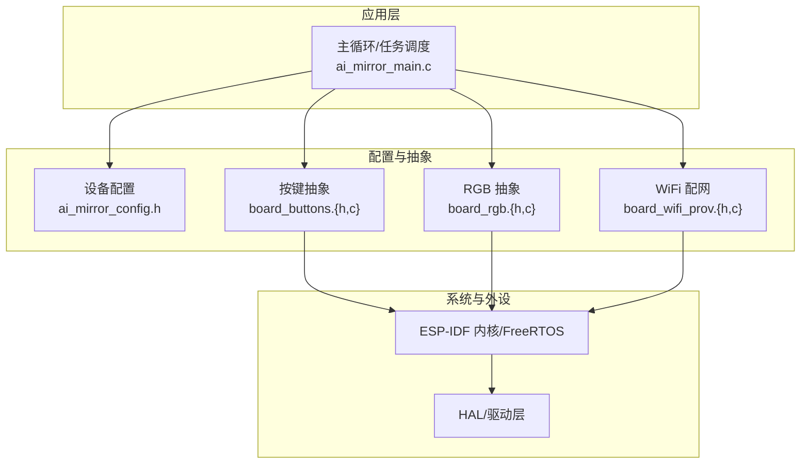
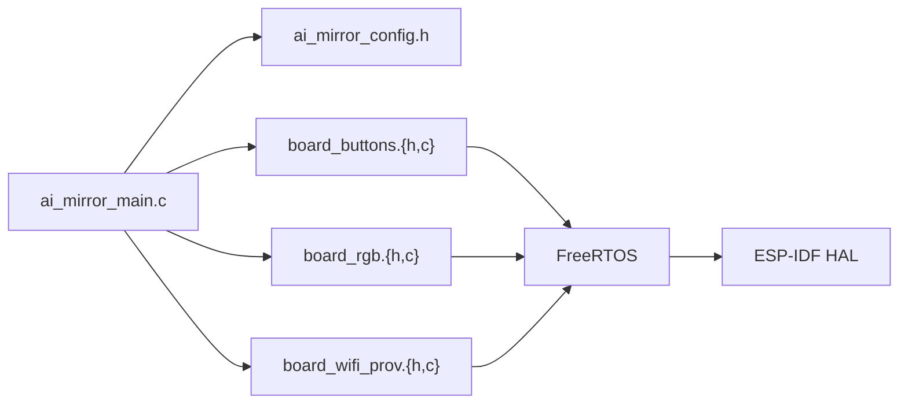

# 数据结构定义

<cite>
**本文引用的文件**   
- [ai_mirror_config.h](file://Firmware/esp32_ai_mirror/main/ai_mirror_config.h)
- [ai_mirror_main.c](file://Firmware/esp32_ai_mirror/main/ai_mirror_main.c)
- [board_buttons.h](file://Firmware/esp32_ai_mirror/main/board_buttons.h)
- [board_buttons.c](file://Firmware/esp32_ai_mirror/main/board_buttons.c)
- [board_rgb.h](file://Firmware/esp32_ai_mirror/main/board_rgb.h)
- [board_rgb.c](file://Firmware/esp32_ai_mirror/main/board_rgb.c)
- [board_wifi_prov.h](file://Firmware/esp32_ai_mirror/main/board_wifi_prov.h)
- [board_wifi_prov.c](file://Firmware/esp32_ai_mirror/main/board_wifi_prov.c)
- [sdkconfig.defaults](file://Firmware/esp32_ai_mirror/sdkconfig.defaults)
- [CMakeLists.txt](file://Firmware/esp32_ai_mirror/CMakeLists.txt)
</cite>

## 目录
1. [简介](#简介)
2. [项目结构](#项目结构)
3. [核心数据结构](#核心数据结构)
4. [架构总览](#架构总览)
5. [详细组件分析](#详细组件分析)
6. [依赖关系分析](#依赖关系分析)
7. [性能与内存布局](#性能与内存布局)
8. [序列化与反序列化](#序列化与反序列化)
9. [数据验证与完整性检查](#数据验证与完整性检查)
10. [版本兼容性与迁移指南](#版本兼容性与迁移指南)
11. [故障排查](#故障排查)
12. [结论](#结论)

## 简介
本文件聚焦于 esp32_ai_mirror 项目的数据结构定义，覆盖配置结构体、事件类型、状态枚举、消息格式等关键数据模型。文档从系统架构出发，逐步深入到各模块的数据结构与交互流程，并提供初始化方法、内存布局说明、序列化/反序列化策略、数据验证与完整性检查的最佳实践，以及版本兼容性与迁移建议，帮助开发者快速理解并安全扩展项目中的数据模型。

## 项目结构
本项目为 ESP-IDF 工程，核心业务逻辑位于 main 目录，包含设备配置、UI、按键、RGB 灯效、WiFi 配网等模块。配置文件通过 Kconfig/sdkconfig.defaults 管理编译期选项，构建脚本由 CMake 驱动。

图表来源
- [ai_mirror_main.c:1-200](file://Firmware/esp32_ai_mirror/main/ai_mirror_main.c#L1-L200)
- [ai_mirror_config.h:1-200](file://Firmware/esp32_ai_mirror/main/ai_mirror_config.h#L1-L200)
- [board_buttons.h:1-200](file://Firmware/esp32_ai_mirror/main/board_buttons.h#L1-L200)
- [board_rgb.h:1-200](file://Firmware/esp32_ai_mirror/main/board_rgb.h#L1-L200)
- [board_wifi_prov.h:1-200](file://Firmware/esp32_ai_mirror/main/board_wifi_prov.h#L1-L200)
- [sdkconfig.defaults:1-200](file://Firmware/esp32_ai_mirror/sdkconfig.defaults#L1-L200)
- [CMakeLists.txt:1-200](file://Firmware/esp32_ai_mirror/CMakeLists.txt#L1-L200)

章节来源
- [ai_mirror_main.c:1-200](file://Firmware/esp32_ai_mirror/main/ai_mirror_main.c#L1-L200)
- [sdkconfig.defaults:1-200](file://Firmware/esp32_ai_mirror/sdkconfig.defaults#L1-L200)
- [CMakeLists.txt:1-200](file://Firmware/esp32_ai_mirror/CMakeLists.txt#L1-L200)

## 核心数据结构
本节汇总项目中最重要的数据结构类别：配置结构体、事件类型、状态枚举、消息格式。由于代码以 C/ESP-IDF 为主，数据结构多为结构体与枚举，配合 Kconfig 的编译期配置项共同构成系统的“数据契约”。

- 配置结构体（示例类别）
  - 设备运行参数（如音频采样率、缓冲区大小、显示分辨率、网络超时等）
  - 硬件抽象参数（如 I2S、I2C、SPI 引脚映射、DMA 通道、中断优先级）
  - UI 主题与行为（如默认页面、动画时长、按键去抖时间）
  - WiFi 与配网（如 SSID 长度限制、密码策略、配网超时）
- 事件类型（示例类别）
  - 按键事件（按下、释放、长按、双击）
  - 传感器/音频事件（VAD 触发、语音识别结果、TTS 播放状态）
  - 网络事件（连接成功/失败、配网完成、OTA 更新状态）
  - UI 事件（页面切换、刷新、错误提示）
- 状态枚举（示例类别）
  - 设备状态（空闲、录音中、播放中、联网中、配网中、升级中）
  - 音频流状态（未初始化、准备、运行、暂停、停止、错误）
  - 网络状态（断开、连接中、已连接、认证失败、DHCP 失败）
- 消息格式（示例类别）
  - 内部任务间消息（事件类型 + 载荷指针/长度 + 源任务 ID）
  - 外部协议消息（JSON/二进制帧头 + 命令字 + 参数段 + 校验和）

注意：以上为通用分类与命名约定，具体字段与取值范围需结合各模块的头文件与实现进行确认。

章节来源
- [ai_mirror_config.h:1-200](file://Firmware/esp32_ai_mirror/main/ai_mirror_config.h#L1-L200)
- [board_buttons.h:1-200](file://Firmware/esp32_ai_mirror/main/board_buttons.h#L1-L200)
- [board_rgb.h:1-200](file://Firmware/esp32_ai_mirror/main/board_rgb.h#L1-L200)
- [board_wifi_prov.h:1-200](file://Firmware/esp32_ai_mirror/main/board_wifi_prov.h#L1-L200)

## 架构总览
下图展示主要模块之间的数据依赖与调用关系，突出数据结构在各模块间的传递路径。

图表来源
- [ai_mirror_main.c:1-200](file://Firmware/esp32_ai_mirror/main/ai_mirror_main.c#L1-L200)
- [ai_mirror_config.h:1-200](file://Firmware/esp32_ai_mirror/main/ai_mirror_config.h#L1-L200)
- [board_buttons.h:1-200](file://Firmware/esp32_ai_mirror/main/board_buttons.h#L1-L200)
- [board_rgb.h:1-200](file://Firmware/esp32_ai_mirror/main/board_rgb.h#L1-L200)
- [board_wifi_prov.h:1-200](file://Firmware/esp32_ai_mirror/main/board_wifi_prov.h#L1-L200)

## 详细组件分析

### 配置结构体（ai_mirror_config.h）
- 职责：集中管理设备运行参数、硬件抽象参数、UI 行为与网络策略等编译期或运行时可配置项。
- 典型字段类别
  - 音频相关：采样率、位宽、通道数、缓冲区大小、VAD 阈值
  - 显示相关：分辨率、像素格式、刷新频率、旋转角度
  - 网络相关：超时时间、重试次数、证书/密钥长度上限
  - 系统相关：任务栈大小、队列长度、日志级别
- 初始化方法
  - 编译期：通过 sdkconfig.defaults 与 Kconfig 生成 #define 常量
  - 运行时：提供 init/configure 函数加载默认值并根据环境变量或 NVS 覆盖
- 内存布局
  - 通常按字段自然对齐；建议将频繁访问字段分组以减少缓存抖动
  - 对大数组（如缓冲区）建议使用静态分配或预分配池，避免运行时碎片化
- 版本兼容性
  - 新增字段应置于末尾并保持向后兼容
  - 使用版本号字段与校验和确保配置一致性

章节来源
- [ai_mirror_config.h:1-200](file://Firmware/esp32_ai_mirror/main/ai_mirror_config.h#L1-L200)
- [sdkconfig.defaults:1-200](file://Firmware/esp32_ai_mirror/sdkconfig.defaults#L1-L200)

### 按键事件与状态（board_buttons.{h,c}）
- 职责：封装按键扫描、去抖、事件分发，向上层暴露统一的事件接口。
- 事件类型
  - 短按、长按、双击、连续按住
  - 组合键（多键同时按下）
- 状态枚举
  - 空闲、检测中、去抖中、触发、重复触发
- 数据结构
  - 事件包：事件类型、时间戳、按键 ID、重复计数
  - 配置：去抖时间、长按阈值、重复间隔
- 初始化方法
  - 配置 GPIO、定时器/中断、去抖算法参数
  - 注册回调或投递到消息队列
- 内存布局
  - 事件包建议紧凑排列，减少拷贝开销
  - 使用环形缓冲管理高频事件，避免阻塞

章节来源
- [board_buttons.h:1-200](file://Firmware/esp32_ai_mirror/main/board_buttons.h#L1-L200)
- [board_buttons.c:1-200](file://Firmware/esp32_ai_mirror/main/board_buttons.c#L1-L200)

### RGB 控制（board_rgb.{h,c}）
- 职责：控制 LED/RGB 灯效，提供亮度、颜色、动画模式等接口。
- 数据结构
  - 颜色：RGB 分量或 HSV/HSL 表示
  - 效果：渐变、呼吸、闪烁、彩虹等模式参数
  - 状态：当前模式、周期、相位、目标亮度
- 初始化方法
  - 配置 PWM/LED 控制器、DMA 通道、时钟源
  - 设置默认效果与亮度上限
- 内存布局
  - 效果参数表建议只读常量区，运行时仅维护状态机变量
  - 颜色转换表可预计算以减少 CPU 占用

章节来源
- [board_rgb.h:1-200](file://Firmware/esp32_ai_mirror/main/board_rgb.h#L1-L200)
- [board_rgb.c:1-200](file://Firmware/esp32_ai_mirror/main/board_rgb.c#L1-L200)

### WiFi 配网（board_wifi_prov.{h,c}）
- 职责：实现 WiFi 配网流程（如 SoftAP+HTTP/二维码），管理连接状态与错误恢复。
- 数据结构
  - 配网会话：SSID、密码、超时、重试次数、回调句柄
  - 状态：等待输入、连接中、认证成功、失败原因
- 事件类型
  - 配网开始、成功、失败、超时、取消
- 初始化方法
  - 创建 SoftAP、启动 HTTP/DNS 服务、绑定回调
  - 配置 TLS/证书（如需）
- 内存布局
  - 会话信息尽量小，敏感字段加密存储
  - 状态机变量独立于持久化数据，便于重启恢复

章节来源
- [board_wifi_prov.h:1-200](file://Firmware/esp32_ai_mirror/main/board_wifi_prov.h#L1-L200)
- [board_wifi_prov.c:1-200](file://Firmware/esp32_ai_mirror/main/board_wifi_prov.c#L1-L200)

### 主循环与任务调度（ai_mirror_main.c）
- 职责：初始化各模块、创建任务与队列、协调事件流转。
- 数据结构
  - 全局配置实例、事件队列、任务句柄
  - 状态标志位与统计计数器
- 初始化流程
  - 加载配置 → 初始化硬件 → 创建任务/队列 → 启动事件循环
- 内存布局
  - 全局配置单例，避免重复分配
  - 任务栈大小根据峰值使用量评估，预留余量

章节来源
- [ai_mirror_main.c:1-200](file://Firmware/esp32_ai_mirror/main/ai_mirror_main.c#L1-L200)

## 依赖关系分析
- 模块耦合
  - 主循环依赖配置、按键、RGB、WiFi 模块的初始化与事件接口
  - 按键与 RGB 通过 FreeRTOS 队列/信号量与主循环解耦
  - WiFi 配网与网络栈、TLS 库存在强依赖
- 外部依赖
  - ESP-IDF 内核（FreeRTOS、NVS、WIFI、I2S、SPI、I2C）
  - LVGL（若用于 UI）、ESP-SR/TTS（若用于语音）
- 潜在循环依赖
  - 应避免模块间直接互相包含头文件，改用前向声明与接口回调

图表来源
- [ai_mirror_main.c:1-200](file://Firmware/esp32_ai_mirror/main/ai_mirror_main.c#L1-L200)
- [board_buttons.h:1-200](file://Firmware/esp32_ai_mirror/main/board_buttons.h#L1-L200)
- [board_rgb.h:1-200](file://Firmware/esp32_ai_mirror/main/board_rgb.h#L1-L200)
- [board_wifi_prov.h:1-200](file://Firmware/esp32_ai_mirror/main/board_wifi_prov.h#L1-L200)

章节来源
- [CMakeLists.txt:1-200](file://Firmware/esp32_ai_mirror/CMakeLists.txt#L1-L200)

## 性能与内存布局
- 内存分配策略
  - 优先静态分配与池化分配，减少堆碎片
  - 对高频事件使用环形缓冲与零拷贝策略
- 对齐与填充
  - 结构体字段按 4/8 字节对齐，避免跨边界访问
  - 将热路径字段集中在结构体头部以提升缓存命中
- 并发与锁
  - 使用无锁队列或互斥保护临界区，降低上下文切换开销
- 功耗优化
  - 合理设置休眠与唤醒条件，避免忙轮询
  - 动态调节音频/显示刷新频率

[本节为通用指导，不直接分析具体文件]

## 序列化与反序列化
- 内部消息
  - 采用固定长度的二进制帧头 + 变长载荷，附带序列号与校验和
  - 反序列化时先校验长度与校验和，再解析字段
- 外部协议
  - JSON 文本：适合调试与跨平台，但体积较大
  - CBOR/MessagePack：适合嵌入式，体积小且支持二进制
- 版本兼容
  - 在帧头中包含协议版本，接收端根据版本选择解析器
  - 新增字段标记可选，旧版本忽略未知字段
- 校验与容错
  - CRC32/MD5 校验载荷完整性
  - 解析失败回退到默认值并记录错误码

[本节为通用指导，不直接分析具体文件]

## 数据验证与完整性检查
- 输入校验
  - 长度、范围、枚举合法性检查
  - 必填字段非空校验
- 一致性检查
  - 关联字段一致性（如时间戳顺序、状态与动作匹配）
  - 跨模块数据一致性（如配置与运行时参数）
- 错误处理
  - 返回明确错误码与诊断信息
  - 记录日志与统计指标，便于定位问题
- 单元测试
  - 针对解析器与校验逻辑编写用例，覆盖边界条件

[本节为通用指导，不直接分析具体文件]

## 版本兼容性与迁移指南
- 向后兼容
  - 新增字段追加到结构体末尾，保持偏移不变
  - 使用版本号与校验和判断配置有效性
- 向前兼容
  - 解析器支持多版本，未知字段跳过
  - 降级策略：当新版本不可用时回退到旧功能集
- 迁移步骤
  - 发布迁移脚本，自动转换旧配置到新格式
  - 提供回滚机制与备份恢复
- 测试验证
  - 回归测试覆盖新旧版本混合场景
  - 灰度发布与监控告警

[本节为通用指导，不直接分析具体文件]

## 故障排查
- 常见问题
  - 配置加载失败：检查 Kconfig/sdconfig 是否生效
  - 事件丢失：检查队列长度与生产者/消费者速率
  - 内存不足：检查栈大小与堆分配策略
  - 网络异常：检查证书、DNS、路由与防火墙
- 诊断工具
  - 启用详细日志与统计计数器
  - 使用 ESP-IDF 调试器抓取堆栈与内存快照
- 恢复策略
  - 自动重启与复位
  - 清除 NVS 中的异常配置并恢复默认

[本节为通用指导，不直接分析具体文件]

## 结论
通过对 esp32_ai_mirror 项目的数据结构定义进行系统化梳理，我们明确了配置、事件、状态与消息等核心数据模型的职责与交互方式。结合内存布局、序列化/反序列化策略与数据验证最佳实践，可为后续开发与迁移提供可靠依据。建议在扩展新特性时遵循版本兼容原则，完善测试与监控，确保系统稳定与可维护性。