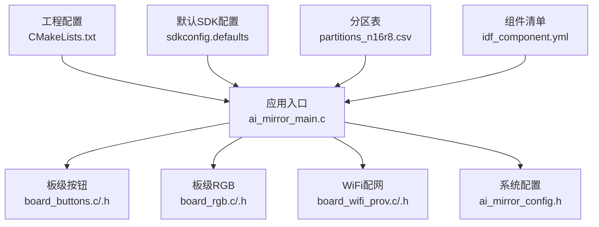
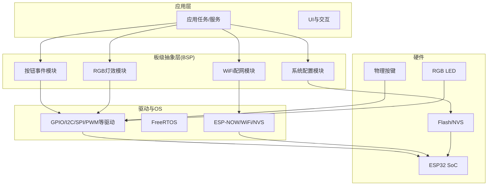
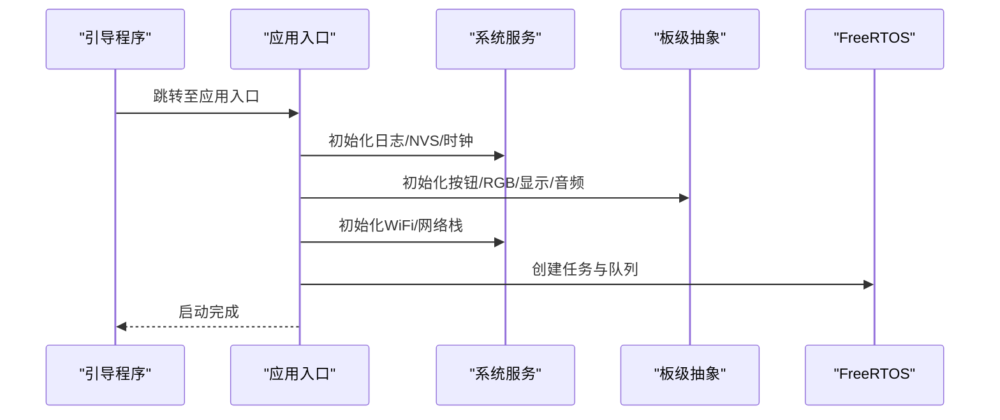
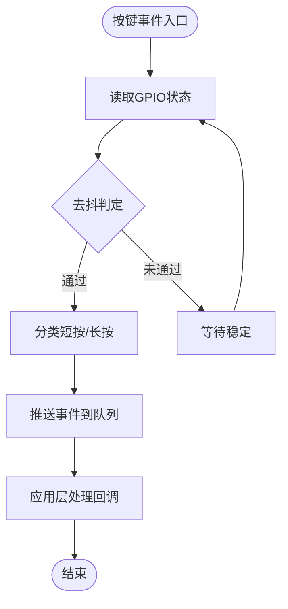
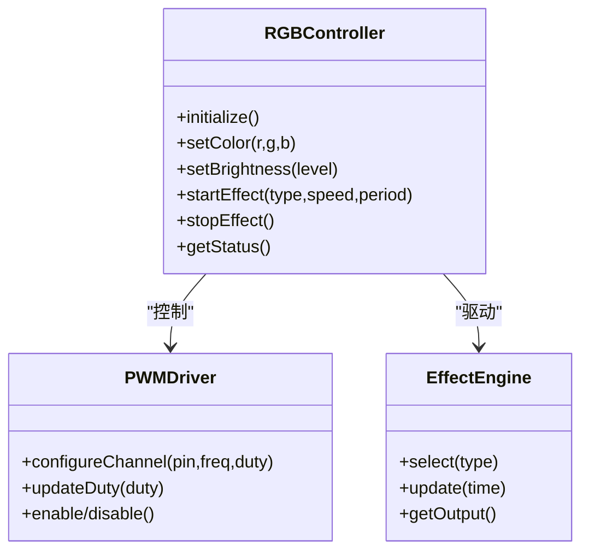
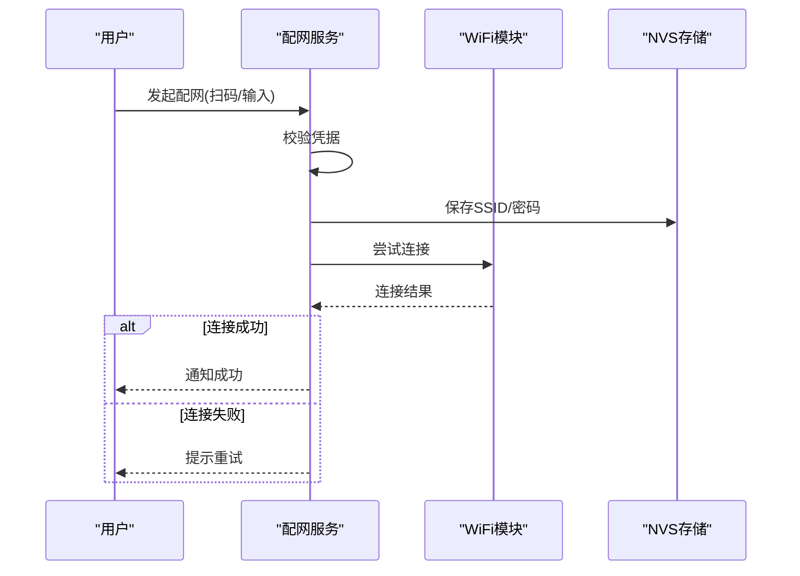
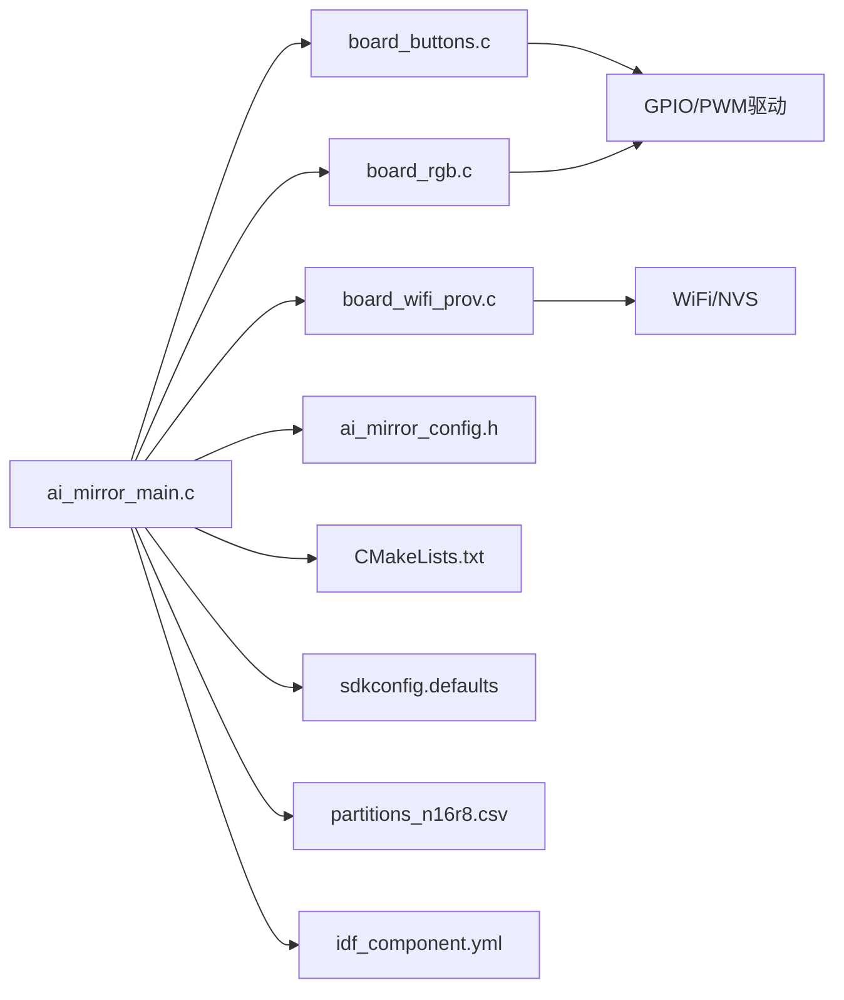

# 系统控制API

<cite>
**本文引用的文件**   
- [ai_mirror_main.c](file://Firmware/esp32_ai_mirror/main/ai_mirror_main.c)
- [board_buttons.c](file://Firmware/esp32_ai_mirror/main/board_buttons.c)
- [board_buttons.h](file://Firmware/esp32_ai_mirror/main/board_buttons.h)
- [board_rgb.c](file://Firmware/esp32_ai_mirror/main/board_rgb.c)
- [board_rgb.h](file://Firmware/esp32_ai_mirror/main/board_rgb.h)
- [board_wifi_prov.c](file://Firmware/esp32_ai_mirror/main/board_wifi_prov.c)
- [board_wifi_prov.h](file://Firmware/esp32_ai_mirror/main/board_wifi_prov.h)
- [ai_mirror_config.h](file://Firmware/esp32_ai_mirror/main/ai_mirror_config.h)
- [CMakeLists.txt](file://Firmware/esp32_ai_mirror/CMakeLists.txt)
- [sdkconfig.defaults](file://Firmware/esp32_ai_mirror/sdkconfig.defaults)
- [partitions_n16r8.csv](file://Firmware/esp32_ai_mirror/partitions_n16r8.csv)
- [idf_component.yml](file://Firmware/esp32_ai_mirror/main/idf_component.yml)
- [README.md](file://Firmware/esp32_ai_mirror/README.md)
</cite>

## 目录
1. [简介](#简介)
2. [项目结构](#项目结构)
3. [核心组件](#核心组件)
4. [架构总览](#架构总览)
5. [详细组件分析](#详细组件分析)
6. [依赖关系分析](#依赖关系分析)
7. [性能考虑](#性能考虑)
8. [故障排查指南](#故障排查指南)
9. [结论](#结论)
10. [附录](#附录)

## 简介
本文件面向ESP32 AI镜像项目的系统控制API，覆盖设备初始化、电源管理、WiFi配网、LED控制、按钮事件处理、RGB灯效控制、系统状态监控、日志记录与错误恢复、任务调度与内存管理、外设驱动调用以及系统配置与参数管理的最佳实践。文档以代码级为依据，提供清晰的接口说明、流程图与时序图，帮助开发者快速集成与扩展。

## 项目结构
本项目基于ESP-IDF构建，主程序位于main目录，包含板级抽象（按钮、RGB、WiFi配网）、应用入口与配置头文件；顶层包含CMake工程配置、分区表与默认SDK配置。组件通过idf_component.yml声明依赖，便于管理与升级。

图表来源 
- [ai_mirror_main.c](file://Firmware/esp32_ai_mirror/main/ai_mirror_main.c)
- [board_buttons.c](file://Firmware/esp32_ai_mirror/main/board_buttons.c)
- [board_rgb.c](file://Firmware/esp32_ai_mirror/main/board_rgb.c)
- [board_wifi_prov.c](file://Firmware/esp32_ai_mirror/main/board_wifi_prov.c)
- [ai_mirror_config.h](file://Firmware/esp32_ai_mirror/main/ai_mirror_config.h)
- [CMakeLists.txt](file://Firmware/esp32_ai_mirror/CMakeLists.txt)
- [sdkconfig.defaults](file://Firmware/esp32_ai_mirror/sdkconfig.defaults)
- [partitions_n16r8.csv](file://Firmware/esp32_ai_mirror/partitions_n16r8.csv)
- [idf_component.yml](file://Firmware/esp32_ai_mirror/main/idf_component.yml)

章节来源
- [README.md](file://Firmware/esp32_ai_mirror/README.md)
- [CMakeLists.txt](file://Firmware/esp32_ai_mirror/CMakeLists.txt)
- [sdkconfig.defaults](file://Firmware/esp32_ai_mirror/sdkconfig.defaults)
- [partitions_n16r8.csv](file://Firmware/esp32_ai_mirror/partitions_n16r8.csv)
- [idf_component.yml](file://Firmware/esp32_ai_mirror/main/idf_component.yml)

## 核心组件
- 设备初始化与启动流程：由应用入口统一编排，完成系统服务、外设、网络与应用任务的初始化。
- 板级按钮与事件：封装GPIO按键扫描、去抖、长按/短按识别，并通过回调或队列上报上层。
- RGB灯效控制：封装LED驱动与效果引擎，支持颜色设置、亮度调节、动态效果切换。
- WiFi配网：提供软AP+HTTP/二维码等配网方式，持久化网络凭据并自动重连。
- 系统配置与参数：集中管理编译期与运行期参数，支持OTA分区与存储读写。
- 任务与内存：基于FreeRTOS的任务创建、优先级与栈大小配置，结合ESP-IDF内存池与堆管理。
- 日志与诊断：分级日志输出、关键路径打印与错误码定义，便于定位问题。

章节来源
- [ai_mirror_main.c](file://Firmware/esp32_ai_mirror/main/ai_mirror_main.c)
- [board_buttons.c](file://Firmware/esp32_ai_mirror/main/board_buttons.c)
- [board_buttons.h](file://Firmware/esp32_ai_mirror/main/board_buttons.h)
- [board_rgb.c](file://Firmware/esp32_ai_mirror/main/board_rgb.c)
- [board_rgb.h](file://Firmware/esp32_ai_mirror/main/board_rgb.h)
- [board_wifi_prov.c](file://Firmware/esp32_ai_mirror/main/board_wifi_prov.c)
- [board_wifi_prov.h](file://Firmware/esp32_ai_mirror/main/board_wifi_prov.h)
- [ai_mirror_config.h](file://Firmware/esp32_ai_mirror/main/ai_mirror_config.h)

## 架构总览
系统采用分层架构：应用层（业务逻辑）— 板级抽象层（BSP）— 外设驱动层 — 操作系统与硬件。各层之间通过明确定义的接口交互，保证可移植性与可测试性。

图表来源 
- [ai_mirror_main.c](file://Firmware/esp32_ai_mirror/main/ai_mirror_main.c)
- [board_buttons.c](file://Firmware/esp32_ai_mirror/main/board_buttons.c)
- [board_rgb.c](file://Firmware/esp32_ai_mirror/main/board_rgb.c)
- [board_wifi_prov.c](file://Firmware/esp32_ai_mirror/main/board_wifi_prov.c)
- [ai_mirror_config.h](file://Firmware/esp32_ai_mirror/main/ai_mirror_config.h)

## 详细组件分析

### 设备初始化与系统启动
- 启动顺序：系统复位后进入引导程序，加载应用；应用入口负责初始化日志、NVS、WiFi、显示、音频、传感器等子系统，随后创建应用任务与定时器。
- 关键职责：
  - 初始化系统服务（日志、NVS、时间同步）。
  - 初始化外设（GPIO、I2C、SPI、PWM、ADC等）。
  - 初始化网络（WiFi STA/AP、配网服务）。
  - 初始化用户界面与交互（按钮、RGB、屏幕）。
  - 创建任务与事件循环，注册回调。
- 错误恢复：对关键初始化失败进行回退与降级策略，确保设备仍可进入安全模式或配网模式。

图表来源 
- [ai_mirror_main.c](file://Firmware/esp32_ai_mirror/main/ai_mirror_main.c)

章节来源
- [ai_mirror_main.c](file://Firmware/esp32_ai_mirror/main/ai_mirror_main.c)

### 按钮事件处理
- 功能概述：封装按键扫描、去抖、短按/长按识别，支持多键并发与事件分发。
- API要点：
  - 初始化：配置GPIO、中断或轮询模式、去抖阈值。
  - 事件回调：注册按键事件处理器，返回事件类型与时间戳。
  - 消抖与防抖：内部实现去抖算法，避免误触发。
  - 事件队列：将按键事件推送到应用层队列，解耦采集与处理。
- 使用建议：
  - 合理设置去抖时间与长按阈值。
  - 在高优先级任务中仅做轻量处理，复杂逻辑放入低优先级任务。
  - 注意按键复用与冲突处理。

图表来源 
- [board_buttons.c](file://Firmware/esp32_ai_mirror/main/board_buttons.c)
- [board_buttons.h](file://Firmware/esp32_ai_mirror/main/board_buttons.h)

章节来源
- [board_buttons.c](file://Firmware/esp32_ai_mirror/main/board_buttons.c)
- [board_buttons.h](file://Firmware/esp32_ai_mirror/main/board_buttons.h)

### RGB灯效控制
- 功能概述：封装RGB LED驱动与效果引擎，支持颜色设置、亮度调节、呼吸/跑马/彩虹等动态效果。
- API要点：
  - 初始化：配置PWM通道、引脚映射、最大亮度限制。
  - 颜色设置：设置R/G/B分量或HSV色彩空间。
  - 效果控制：选择效果类型、速度、周期、渐变曲线。
  - 状态查询：获取当前效果、亮度、闪烁状态。
- 性能优化：
  - 使用DMA或硬件PWM减少CPU占用。
  - 批量更新像素数据，降低总线开销。
  - 根据功耗限制动态调整亮度。

图表来源 
- [board_rgb.c](file://Firmware/esp32_ai_mirror/main/board_rgb.c)
- [board_rgb.h](file://Firmware/esp32_ai_mirror/main/board_rgb.h)

章节来源
- [board_rgb.c](file://Firmware/esp32_ai_mirror/main/board_rgb.c)
- [board_rgb.h](file://Firmware/esp32_ai_mirror/main/board_rgb.h)

### WiFi配网流程
- 功能概述：提供软AP+HTTP或二维码的配网方式，支持保存SSID/密码到NVS，断线自动重连。
- API要点：
  - 启动配网：创建热点或二维码，监听配网请求。
  - 接收凭据：校验并写入NVS。
  - 连接网络：尝试STA连接，失败回退到配网模式。
  - 状态上报：连接成功/失败、信号强度、IP地址。
- 错误恢复：
  - 超时重试与指数退避。
  - 凭证无效时提示重新配网。
  - 网络异常时进入低功耗待机。

图表来源 
- [board_wifi_prov.c](file://Firmware/esp32_ai_mirror/main/board_wifi_prov.c)
- [board_wifi_prov.h](file://Firmware/esp32_ai_mirror/main/board_wifi_prov.h)

章节来源
- [board_wifi_prov.c](file://Firmware/esp32_ai_mirror/main/board_wifi_prov.c)
- [board_wifi_prov.h](file://Firmware/esp32_ai_mirror/main/board_wifi_prov.h)

### 系统状态监控与日志记录
- 状态监控：暴露系统健康指标（CPU负载、内存使用、WiFi状态、电池电量等），供上层查询与告警。
- 日志记录：分级日志（调试/信息/警告/错误），支持环形缓冲与持久化，便于离线分析。
- 错误恢复：定义错误码与恢复策略，如重启特定模块、回滚配置、进入安全模式。

章节来源
- [ai_mirror_main.c](file://Firmware/esp32_ai_mirror/main/ai_mirror_main.c)
- [ai_mirror_config.h](file://Firmware/esp32_ai_mirror/main/ai_mirror_config.h)

### 任务调度与内存管理
- 任务调度：基于FreeRTOS创建任务，合理分配优先级与栈大小，避免优先级反转与死锁。
- 内存管理：使用ESP-IDF内存池与堆管理器，避免碎片化；对高频分配使用对象池。
- 资源保护：互斥量与信号量保护共享资源，临界区最小化。

章节来源
- [ai_mirror_main.c](file://Firmware/esp32_ai_mirror/main/ai_mirror_main.c)
- [sdkconfig.defaults](file://Firmware/esp32_ai_mirror/sdkconfig.defaults)

### 外设驱动调用
- GPIO：用于按键、LED、继电器控制。
- I2C/SPI：用于传感器、显示屏、音频编解码器。
- PWM：用于RGB灯效、电机控制。
- ADC：用于电量检测、温度采样。
- 最佳实践：
  - 驱动初始化失败时快速失败并上报。
  - 使用非阻塞IO与中断，提高响应性。
  - 对敏感外设增加看门狗与心跳检测。

章节来源
- [board_buttons.c](file://Firmware/esp32_ai_mirror/main/board_buttons.c)
- [board_rgb.c](file://Firmware/esp32_ai_mirror/main/board_rgb.c)

### 系统配置与参数管理
- 编译期配置：通过sdkconfig.defaults与Kconfig选项启用/禁用功能，裁剪体积。
- 运行期参数：通过NVS存储用户配置，支持热更新与版本兼容。
- 分区表：定义OTA、NVS、文件系统分区，确保升级与数据安全。

章节来源
- [sdkconfig.defaults](file://Firmware/esp32_ai_mirror/sdkconfig.defaults)
- [partitions_n16r8.csv](file://Firmware/esp32_ai_mirror/partitions_n16r8.csv)
- [ai_mirror_config.h](file://Firmware/esp32_ai_mirror/main/ai_mirror_config.h)

## 依赖关系分析
- 组件依赖：应用入口依赖BSP模块，BSP依赖底层驱动与OS。
- 外部依赖：ESP-IDF框架、LVGL、语音组件、LCD驱动等通过idf_component.yml管理。
- 潜在风险：循环依赖、版本不兼容、资源竞争。

图表来源 
- [ai_mirror_main.c](file://Firmware/esp32_ai_mirror/main/ai_mirror_main.c)
- [board_buttons.c](file://Firmware/esp32_ai_mirror/main/board_buttons.c)
- [board_rgb.c](file://Firmware/esp32_ai_mirror/main/board_rgb.c)
- [board_wifi_prov.c](file://Firmware/esp32_ai_mirror/main/board_wifi_prov.c)
- [ai_mirror_config.h](file://Firmware/esp32_ai_mirror/main/ai_mirror_config.h)
- [CMakeLists.txt](file://Firmware/esp32_ai_mirror/CMakeLists.txt)
- [sdkconfig.defaults](file://Firmware/esp32_ai_mirror/sdkconfig.defaults)
- [partitions_n16r8.csv](file://Firmware/esp32_ai_mirror/partitions_n16r8.csv)
- [idf_component.yml](file://Firmware/esp32_ai_mirror/main/idf_component.yml)

章节来源
- [idf_component.yml](file://Firmware/esp32_ai_mirror/main/idf_component.yml)
- [CMakeLists.txt](file://Firmware/esp32_ai_mirror/CMakeLists.txt)

## 性能考虑
- 任务设计：将耗时操作放入后台任务，UI与交互保持高响应。
- 内存优化：避免频繁malloc/free，使用对象池与静态缓冲区。
- 外设优化：使用DMA、中断与批处理减少CPU占用。
- 网络优化：连接重试与指数退避，缓存热点数据。
- 功耗优化：空闲时进入低功耗模式，按需唤醒。

## 故障排查指南
- 常见问题：
  - 按键无响应：检查GPIO配置、去抖阈值、中断使能。
  - RGB不亮：检查PWM通道、引脚映射、亮度限制。
  - WiFi无法配网：检查热点创建、DNS解析、NVS写入权限。
  - 系统崩溃：查看日志级别、堆栈信息、看门狗触发原因。
- 诊断步骤：
  - 提升日志级别，捕获关键路径。
  - 使用GDB或串口调试器定位崩溃点。
  - 逐步隔离模块，验证最小可用集。
- 恢复策略：
  - 重启失败模块，回滚配置。
  - 进入安全模式，保留现场数据。

章节来源
- [ai_mirror_main.c](file://Firmware/esp32_ai_mirror/main/ai_mirror_main.c)
- [board_buttons.c](file://Firmware/esp32_ai_mirror/main/board_buttons.c)
- [board_rgb.c](file://Firmware/esp32_ai_mirror/main/board_rgb.c)
- [board_wifi_prov.c](file://Firmware/esp32_ai_mirror/main/board_wifi_prov.c)

## 结论
本系统控制API围绕ESP32平台构建了完整的设备初始化、外设控制、网络配网与系统管理能力。通过分层架构与清晰接口，开发者可快速集成与扩展功能。遵循最佳实践与故障排查指南，可显著提升稳定性与可维护性。

## 附录
- 参考文件：
  - [README.md](file://Firmware/esp32_ai_mirror/README.md)
  - [CMakeLists.txt](file://Firmware/esp32_ai_mirror/CMakeLists.txt)
  - [sdkconfig.defaults](file://Firmware/esp32_ai_mirror/sdkconfig.defaults)
  - [partitions_n16r8.csv](file://Firmware/esp32_ai_mirror/partitions_n16r8.csv)
  - [idf_component.yml](file://Firmware/esp32_ai_mirror/main/idf_component.yml)
- 术语表：
  - BSP：板级支持包
  - NVS：非易失性存储
  - OTA：空中升级
  - PWM：脉冲宽度调制
  - FreeRTOS：实时操作系统