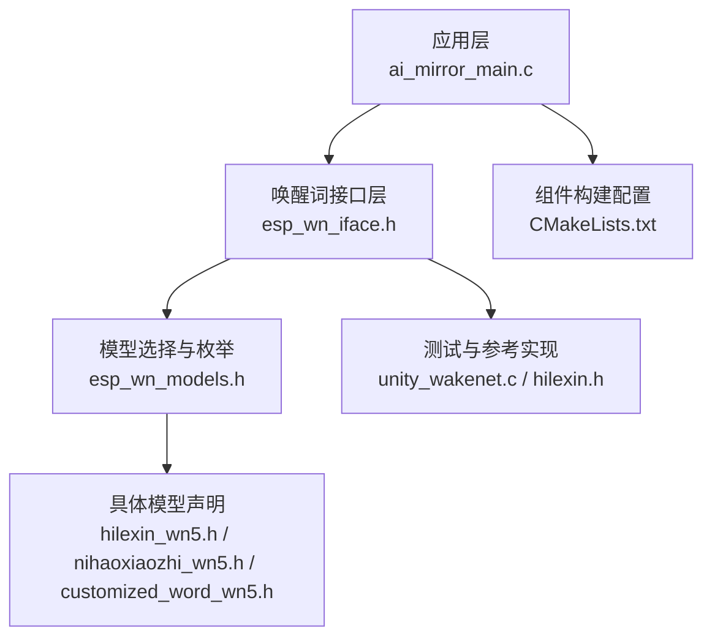
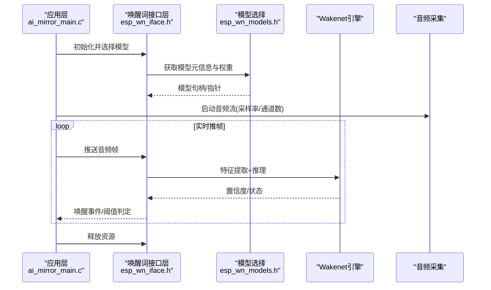
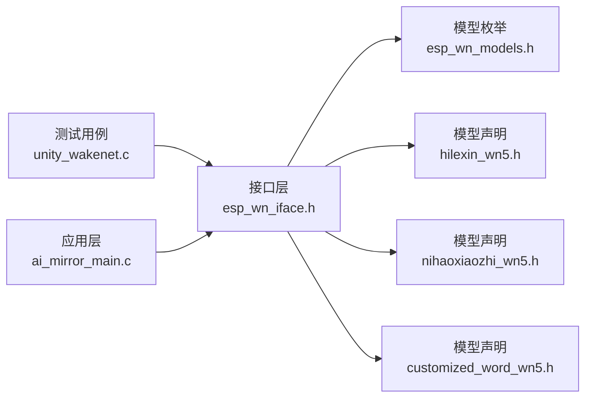

# 唤醒词检测API

<cite>
**本文引用的文件**   
- [esp_wn_iface.h](file://Firmware/esp32_ai_mirror/components/espressif__esp-sr/include/esp32/esp_wn_iface.h)
- [esp_wn_models.h](file://Firmware/esp32_ai_mirror/components/espressif__esp-sr/include/esp32/esp_wn_models.h)
- [hilexin_wn5.h](file://Firmware/esp32_ai_mirror/components/espressif__esp-sr/include/esp32/hilexin_wn5.h)
- [nihaoxiaozhi_wn5.h](file://Firmware/esp32_ai_mirror/components/espressif__esp-sr/include/esp32/nihaoxiaozhi_wn5.h)
- [customized_word_wn5.h](file://Firmware/esp32_ai_mirror/components/espressif__esp-sr/include/esp32/customized_word_wn5.h)
- [unity_wakenet.c](file://Firmware/esp32_ai_mirror/components/espressif__esp-sr/test/unity_wakenet.c)
- [hilexin.h](file://Firmware/esp32_ai_mirror/components/espressif__esp-sr/test/hilexin.h)
- [ai_mirror_main.c](file://Firmware/esp32_ai_mirror/main/ai_mirror_main.c)
- [CMakeLists.txt](file://Firmware/esp32_ai_mirror/components/espressif__esp-sr/CMakeLists.txt)
</cite>

## 目录
1. [简介](#简介)
2. [项目结构](#项目结构)
3. [核心组件](#核心组件)
4. [架构总览](#架构总览)
5. [详细组件分析](#详细组件分析)
6. [依赖关系分析](#依赖关系分析)
7. [性能与内存管理](#性能与内存管理)
8. [故障排查指南](#故障排查指南)
9. [结论](#结论)
10. [附录：集成示例与最佳实践](#附录集成示例与最佳实践)

## 简介
本文件面向在ESP-SR（Espressif Speech Recognition）库中集成“唤醒词检测”功能的开发者，系统性说明唤醒词检测API的接口函数、模型选择与配置、音频数据输入流程、唤醒结果处理策略，以及灵敏度调节、误报率优化和内存管理等关键技术点。文档同时覆盖多语言唤醒词支持与自定义唤醒词的添加方法，并提供完整的集成步骤与代码片段路径指引，帮助读者快速将唤醒功能落地到实际项目中。

## 项目结构
ESP-SR组件中与唤醒词检测相关的核心位置如下：
- 头文件与接口定义：include/esp32/esp_wn_iface.h、include/esp32/esp_wn_models.h
- 内置唤醒词模型声明：include/esp32/hilexin_wn5.h、include/esp32/nihaoxiaozhi_wn5.h、include/esp32/customized_word_wn5.h
- 测试用例与参考实现：test/unity_wakenet.c、test/hilexin.h
- 应用入口与集成示例：main/ai_mirror_main.c
- 组件构建配置：components/espressif__esp-sr/CMakeLists.txt

图表来源
- [ai_mirror_main.c](file://Firmware/esp32_ai_mirror/main/ai_mirror_main.c)
- [esp_wn_iface.h](file://Firmware/esp32_ai_mirror/components/espressif__esp-sr/include/esp32/esp_wn_iface.h)
- [esp_wn_models.h](file://Firmware/esp32_ai_mirror/components/espressif__esp-sr/include/esp32/esp_wn_models.h)
- [hilexin_wn5.h](file://Firmware/esp32_ai_mirror/components/espressif__esp-sr/include/esp32/hilexin_wn5.h)
- [nihaoxiaozhi_wn5.h](file://Firmware/esp32_ai_mirror/components/espressif__esp-sr/include/esp32/nihaoxiaozhi_wn5.h)
- [customized_word_wn5.h](file://Firmware/esp32_ai_mirror/components/espressif__esp-sr/include/esp32/customized_word_wn5.h)
- [unity_wakenet.c](file://Firmware/esp32_ai_mirror/components/espressif__esp-sr/test/unity_wakenet.c)
- [CMakeLists.txt](file://Firmware/esp32_ai_mirror/components/espressif__esp-sr/CMakeLists.txt)

章节来源
- [esp_wn_iface.h](file://Firmware/esp32_ai_mirror/components/espressif__esp-sr/include/esp32/esp_wn_iface.h)
- [esp_wn_models.h](file://Firmware/esp32_ai_mirror/components/espressif__esp-sr/include/esp32/esp_wn_models.h)
- [hilexin_wn5.h](file://Firmware/esp32_ai_mirror/components/espressif__esp-sr/include/esp32/hilexin_wn5.h)
- [nihaoxiaozhi_wn5.h](file://Firmware/esp32_ai_mirror/components/espressif__esp-sr/include/esp32/nihaoxiaozhi_wn5.h)
- [customized_word_wn5.h](file://Firmware/esp32_ai_mirror/components/espressif__esp-sr/include/esp32/customized_word_wn5.h)
- [unity_wakenet.c](file://Firmware/esp32_ai_mirror/components/espressif__esp-sr/test/unity_wakenet.c)
- [ai_mirror_main.c](file://Firmware/esp32_ai_mirror/main/ai_mirror_main.c)
- [CMakeLists.txt](file://Firmware/esp32_ai_mirror/components/espressif__esp-sr/CMakeLists.txt)

## 核心组件
- 唤醒词接口层（esp_wn_iface.h）
  - 提供统一的唤醒词引擎初始化、配置、推理与资源释放接口
  - 典型流程：创建实例 -> 设置模型与参数 -> 循环推帧 -> 处理唤醒事件 -> 释放资源
- 模型选择与枚举（esp_wn_models.h）
  - 定义支持的唤醒词模型枚举与模型元信息
  - 用于选择不同厂商或语言的唤醒词模型（如 hilexin、nihaoxiaozhi、xiaoaixiaoxue 等）
- 具体模型声明（hilexin_wn5.h、nihaoxiaozhi_wn5.h、customized_word_wn5.h）
  - 暴露各模型的权重与配置常量，供接口层加载
- 测试与参考实现（unity_wakenet.c、hilexin.h）
  - 展示如何调用接口完成初始化、推帧、结果判断与调试输出
- 应用集成（ai_mirror_main.c）
  - 在应用主循环中接入音频采集与唤醒检测，触发后续业务逻辑

章节来源
- [esp_wn_iface.h](file://Firmware/esp32_ai_mirror/components/espressif__esp-sr/include/esp32/esp_wn_iface.h)
- [esp_wn_models.h](file://Firmware/esp32_ai_mirror/components/espressif__esp-sr/include/esp32/esp_wn_models.h)
- [hilexin_wn5.h](file://Firmware/esp32_ai_mirror/components/espressif__esp-sr/include/esp32/hilexin_wn5.h)
- [nihaoxiaozhi_wn5.h](file://Firmware/esp32_ai_mirror/components/espressif__esp-sr/include/esp32/nihaoxiaozhi_wn5.h)
- [customized_word_wn5.h](file://Firmware/esp32_ai_mirror/components/espressif__esp-sr/include/esp32/customized_word_wn5.h)
- [unity_wakenet.c](file://Firmware/esp32_ai_mirror/components/espressif__esp-sr/test/unity_wakenet.c)
- [hilexin.h](file://Firmware/esp32_ai_mirror/components/espressif__esp-sr/test/hilexin.h)
- [ai_mirror_main.c](file://Firmware/esp32_ai_mirror/main/ai_mirror_main.c)

## 架构总览
唤醒词检测的整体调用链从应用层进入接口层，再根据选择的模型进行推理，最终返回唤醒事件。

图表来源
- [ai_mirror_main.c](file://Firmware/esp32_ai_mirror/main/ai_mirror_main.c)
- [esp_wn_iface.h](file://Firmware/esp32_ai_mirror/components/espressif__esp-sr/include/esp32/esp_wn_iface.h)
- [esp_wn_models.h](file://Firmware/esp32_ai_mirror/components/espressif__esp-sr/include/esp32/esp_wn_models.h)
- [unity_wakenet.c](file://Firmware/esp32_ai_mirror/components/espressif__esp-sr/test/unity_wakenet.c)

## 详细组件分析

### 唤醒词接口层（esp_wn_iface.h）
- 职责
  - 提供统一的API封装：创建/销毁实例、设置模型、配置参数、推帧推理、结果查询
- 关键流程
  - 初始化：传入模型类型与配置，分配内部缓冲区
  - 配置：设置采样率、帧长、窗口、VAD/AEC/NS等前处理开关（若启用）
  - 推帧：按固定帧长输入PCM数据，内部做特征提取与模型推理
  - 结果：返回唤醒事件、置信度、状态码；支持滑动窗口去抖
- 错误处理
  - 参数校验失败、内存不足、模型不匹配等错误码
  - 建议在上层记录日志并回退到安全状态

章节来源
- [esp_wn_iface.h](file://Firmware/esp32_ai_mirror/components/espressif__esp-sr/include/esp32/esp_wn_iface.h)

### 模型选择与枚举（esp_wn_models.h）
- 职责
  - 定义支持的唤醒词模型枚举（如 hilexin、nihaoxiaozhi、xiaoaixiaoxue 等）
  - 提供模型名称、版本、目标平台等信息
- 使用方式
  - 在初始化时通过枚举选择对应模型
  - 不同模型可能要求不同的采样率、帧长与内存占用

章节来源
- [esp_wn_models.h](file://Firmware/esp32_ai_mirror/components/espressif__esp-sr/include/esp32/esp_wn_models.h)

### 具体模型声明（hilexin_wn5.h、nihaoxiaozhi_wn5.h、customized_word_wn5.h）
- 职责
  - 暴露各模型的权重数组与配置常量
  - 为接口层提供可加载的模型数据
- 注意事项
  - 不同模型对内存与Flash占用不同
  - 自定义模型需遵循相同的数据结构与对齐要求

章节来源
- [hilexin_wn5.h](file://Firmware/esp32_ai_mirror/components/espressif__esp-sr/include/esp32/hilexin_wn5.h)
- [nihaoxiaozhi_wn5.h](file://Firmware/esp32_ai_mirror/components/espressif__esp-sr/include/esp32/nihaoxiaozhi_wn5.h)
- [customized_word_wn5.h](file://Firmware/esp32_ai_mirror/components/espressif__esp-sr/include/esp32/customized_word_wn5.h)

### 测试与参考实现（unity_wakenet.c、hilexin.h）
- 职责
  - 演示完整调用流程：初始化、配置、循环推帧、结果处理、资源释放
  - 提供调试打印与阈值调参示例
- 学习要点
  - 合理设置帧长与采样率
  - 阈值与滑动窗口的配合使用
  - 错误码的处理与重试机制

章节来源
- [unity_wakenet.c](file://Firmware/esp32_ai_mirror/components/espressif__esp-sr/test/unity_wakenet.c)
- [hilexin.h](file://Firmware/esp32_ai_mirror/components/espressif__esp-sr/test/hilexin.h)

### 应用集成（ai_mirror_main.c）
- 职责
  - 在主循环中协调音频采集与唤醒检测
  - 在检测到唤醒后触发后续语音识别或业务逻辑
- 关键点
  - 音频线程与唤醒线程的同步与缓冲管理
  - 唤醒后的状态机切换与资源清理

章节来源
- [ai_mirror_main.c](file://Firmware/esp32_ai_mirror/main/ai_mirror_main.c)

## 依赖关系分析
- 组件内依赖
  - 接口层依赖模型枚举与具体模型声明
  - 测试用例依赖接口层与具体模型
  - 应用层依赖接口层与音频子系统
- 外部依赖
  - ESP-IDF音频驱动（I2S/ADC）、DSP库（FFT/卷积等）
- 潜在风险
  - 模型与平台不匹配导致运行异常
  - 内存不足导致初始化失败或推理卡顿

图表来源
- [esp_wn_iface.h](file://Firmware/esp32_ai_mirror/components/espressif__esp-sr/include/esp32/esp_wn_iface.h)
- [esp_wn_models.h](file://Firmware/esp32_ai_mirror/components/espressif__esp-sr/include/esp32/esp_wn_models.h)
- [hilexin_wn5.h](file://Firmware/esp32_ai_mirror/components/espressif__esp-sr/include/esp32/hilexin_wn5.h)
- [nihaoxiaozhi_wn5.h](file://Firmware/esp32_ai_mirror/components/espressif__esp-sr/include/esp32/nihaoxiaozhi_wn5.h)
- [customized_word_wn5.h](file://Firmware/esp32_ai_mirror/components/espressif__esp-sr/include/esp32/customized_word_wn5.h)
- [unity_wakenet.c](file://Firmware/esp32_ai_mirror/components/espressif__esp-sr/test/unity_wakenet.c)
- [ai_mirror_main.c](file://Firmware/esp32_ai_mirror/main/ai_mirror_main.c)

章节来源
- [esp_wn_iface.h](file://Firmware/esp32_ai_mirror/components/espressif__esp-sr/include/esp32/esp_wn_iface.h)
- [esp_wn_models.h](file://Firmware/esp32_ai_mirror/components/espressif__esp-sr/include/esp32/esp_wn_models.h)
- [unity_wakenet.c](file://Firmware/esp32_ai_mirror/components/espressif__esp-sr/test/unity_wakenet.c)
- [ai_mirror_main.c](file://Firmware/esp32_ai_mirror/main/ai_mirror_main.c)

## 性能与内存管理
- 模型选择与性能
  - 不同模型在准确率、延迟与内存占用上存在差异
  - 小模型适合低资源设备，大模型适合更高精度需求
- 音频参数
  - 采样率与帧长影响吞吐与延迟，需与模型要求一致
  - 过短帧长会增加推理次数，过长则增加延迟
- 前处理模块
  - VAD/AEC/NS可提升鲁棒性，但会引入额外CPU开销
  - 建议在噪声环境开启VAD，回声场景开启AEC
- 内存管理
  - 避免频繁动态分配，尽量复用缓冲区
  - 注意堆栈大小与静态内存布局，防止溢出
- 功耗优化
  - 空闲时降低采样率或关闭非必要模块
  - 使用DMA传输减少CPU占用

[本节为通用指导，无需特定文件引用]

## 故障排查指南
- 常见问题
  - 初始化失败：检查模型枚举是否匹配、内存是否充足、参数是否合法
  - 无唤醒响应：检查音频链路是否正常、阈值是否过高、滑动窗口是否过严
  - 误报过多：适当提高阈值、调整滑动窗口长度、开启VAD/AEC
- 调试手段
  - 打印中间置信度与状态码，定位问题阶段
  - 使用测试用例对比行为，逐步缩小范围
- 恢复策略
  - 捕获错误码并回退到安全状态
  - 自动重试与降级策略（切换更小模型）

章节来源
- [unity_wakenet.c](file://Firmware/esp32_ai_mirror/components/espressif__esp-sr/test/unity_wakenet.c)
- [hilexin.h](file://Firmware/esp32_ai_mirror/components/espressif__esp-sr/test/hilexin.h)

## 结论
ESP-SR的唤醒词检测API提供了统一、可扩展的接口，便于在不同平台与模型间快速集成。通过合理选择模型、配置音频参数与前处理模块，并结合阈值与滑动窗口策略，可在保证低功耗的同时获得良好的唤醒体验。对于多语言与自定义唤醒词，可通过替换模型声明与权重实现灵活扩展。

[本节为总结性内容，无需特定文件引用]

## 附录：集成示例与最佳实践

### 集成步骤概览
- 选择模型：在模型枚举中选择目标唤醒词（如 hilexin、nihaoxiaozhi、xiaoaixiaoxue）
- 初始化接口：调用接口层初始化函数，传入模型与配置
- 配置音频：设置采样率、帧长、通道数，确保与模型一致
- 启动循环：在任务或线程中持续推帧并处理唤醒事件
- 资源释放：退出前释放所有资源，避免内存泄漏

章节来源
- [esp_wn_iface.h](file://Firmware/esp32_ai_mirror/components/espressif__esp-sr/include/esp32/esp_wn_iface.h)
- [esp_wn_models.h](file://Firmware/esp32_ai_mirror/components/espressif__esp-sr/include/esp32/esp_wn_models.h)
- [unity_wakenet.c](file://Firmware/esp32_ai_mirror/components/espressif__esp-sr/test/unity_wakenet.c)

### 代码示例路径（不含具体代码）
- 初始化与配置：参考测试用例中的初始化流程
- 推帧与结果处理：参考测试用例中的循环推帧与阈值判定
- 应用集成：参考应用主循环中对唤醒事件的响应与状态切换

章节来源
- [unity_wakenet.c](file://Firmware/esp32_ai_mirror/components/espressif__esp-sr/test/unity_wakenet.c)
- [ai_mirror_main.c](file://Firmware/esp32_ai_mirror/main/ai_mirror_main.c)

### 多语言唤醒词支持
- 内置模型涵盖中文与英文常见唤醒词
- 通过模型枚举切换不同语言模型即可
- 注意不同语言模型的音频参数与内存占用差异

章节来源
- [esp_wn_models.h](file://Firmware/esp32_ai_mirror/components/espressif__esp-sr/include/esp32/esp_wn_models.h)
- [hilexin_wn5.h](file://Firmware/esp32_ai_mirror/components/espressif__esp-sr/include/esp32/hilexin_wn5.h)
- [nihaoxiaozhi_wn5.h](file://Firmware/esp32_ai_mirror/components/espressif__esp-sr/include/esp32/nihaoxiaozhi_wn5.h)

### 自定义唤醒词添加方法
- 准备训练好的模型权重与配置文件
- 按照现有模型声明格式生成新的头文件
- 在模型枚举中添加新模型条目
- 在应用中通过枚举选择新模型进行初始化

章节来源
- [customized_word_wn5.h](file://Firmware/esp32_ai_mirror/components/espressif__esp-sr/include/esp32/customized_word_wn5.h)
- [esp_wn_models.h](file://Firmware/esp32_ai_mirror/components/espressif__esp-sr/include/esp32/esp_wn_models.h)

### 灵敏度调节与误报率优化
- 灵敏度调节
  - 调整阈值：提高阈值降低误报，降低阈值提高召回
  - 滑动窗口：增大窗口长度可降低瞬时波动带来的误判
- 误报率优化
  - 开启VAD：仅在检测到语音段时推理
  - 开启AEC/NS：抑制回声与背景噪声
  - 多模型融合：结合多个模型的结果进行投票

章节来源
- [unity_wakenet.c](file://Firmware/esp32_ai_mirror/components/espressif__esp-sr/test/unity_wakenet.c)
- [hilexin.h](file://Firmware/esp32_ai_mirror/components/espressif__esp-sr/test/hilexin.h)

### 构建与部署
- 组件构建：确保CMakeLists.txt中包含ESP-SR组件
- 分区表：为模型权重预留足够Flash空间
- 固件烧录：验证模型加载与运行时稳定性

章节来源
- [CMakeLists.txt](file://Firmware/esp32_ai_mirror/components/espressif__esp-sr/CMakeLists.txt)