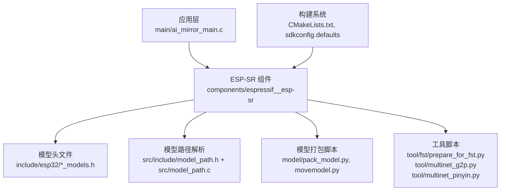
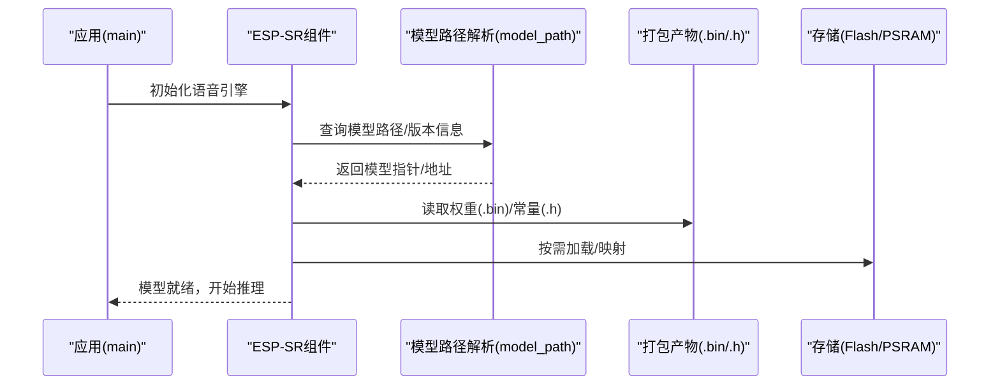
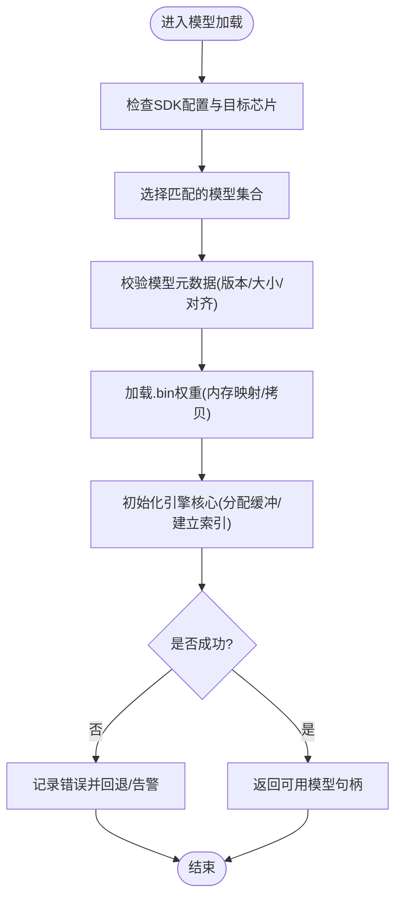
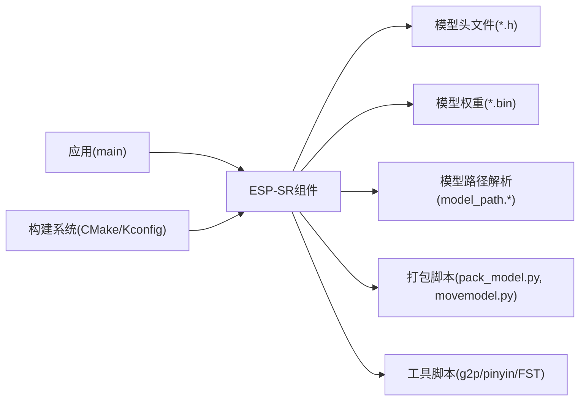

# 模型管理API

<cite>
**本文引用的文件**   
- [CMakeLists.txt](file://Firmware/esp32_ai_mirror/components/espressif__esp-sr/CMakeLists.txt)
- [Kconfig.projbuild](file://Firmware/esp32_ai_mirror/components/espressif__esp-sr/Kconfig.projbuild)
- [idf_component.yml](file://Firmware/esp32_ai_mirror/components/espressif__esp-sr/idf_component.yml)
- [README.md](file://Firmware/esp32_ai_mirror/components/espressif__esp-sr/README.md)
- [model_path.h](file://Firmware/esp32_ai_mirror/components/espressif__esp-sr/src/include/model_path.h)
- [model_path.c](file://Firmware/esp32_ai_mirror/components/espressif__esp-sr/src/model_path.c)
- [esp_mn_models.h](file://Firmware/esp32_ai_mirror/components/espressif__esp-sr/include/esp32/esp_mn_models.h)
- [esp_wn_models.h](file://Firmware/esp32_ai_mirror/components/espressif__esp-sr/include/esp32/esp_wn_models.h)
- [pack_model.py](file://Firmware/esp32_ai_mirror/components/espressif__esp-sr/model/pack_model.py)
- [movemodel.py](file://Firmware/esp32_ai_mirror/components/espressif__esp-sr/model/movemodel.py)
- [prepare_for_fst.py](file://Firmware/esp32_ai_mirror/components/espressif__esp-sr/tool/fst/prepare_for_fst.py)
- [multinet_g2p.py](file://Firmware/esp32_ai_mirror/components/espressif__esp-sr/tool/multinet_g2p.py)
- [multinet_pinyin.py](file://Firmware/esp32_ai_mirror/components/espressif__esp-sr/tool/multinet_pinyin.py)
- [CMakeLists.txt](file://Firmware/esp32_ai_mirror/main/CMakeLists.txt)
- [ai_mirror_main.c](file://Firmware/esp32_ai_mirror/main/ai_mirror_main.c)
- [sdkconfig.defaults](file://Firmware/esp32_ai_mirror/sdkconfig.defaults)
</cite>

## 目录
1. [简介](#简介)
2. [项目结构](#项目结构)
3. [核心组件](#核心组件)
4. [架构总览](#架构总览)
5. [详细组件分析](#详细组件分析)
6. [依赖关系分析](#依赖关系分析)
7. [性能考虑](#性能考虑)
8. [故障排查指南](#故障排查指南)
9. [结论](#结论)
10. [附录](#附录)

## 简介
本文件面向ESP-SR（Espressif Speech Recognition）在ESP32/S3平台上的“模型管理API”，系统性说明模型的加载、配置与管理接口，涵盖：
- 模型格式与存储位置（.bin权重与.h头文件中的常量）
- 编译期打包与部署流程
- 运行时加载与版本兼容性检查
- 自定义模型训练与集成指导
- 模型优化与内存使用策略

本指南既适合初次接触ESP-SR的开发者，也便于有经验的工程师快速定位关键路径与优化点。

## 项目结构
ESP-SR作为ESP-IDF组件被引入到项目中，模型相关代码主要分布在以下位置：
- 组件根目录：CMake构建、Kconfig配置、组件清单
- include/esp32：各模型头文件（如唤醒词、语音命令等）
- src/include：内部接口（如模型路径解析）
- model：模型打包脚本与示例模型组织
- tool：工具链脚本（G2P、拼音转换、FST准备等）

图表来源 
- [CMakeLists.txt](file://Firmware/esp32_ai_mirror/components/espressif__esp-sr/CMakeLists.txt)
- [model_path.h](file://Firmware/esp32_ai_mirror/components/espressif__esp-sr/src/include/model_path.h)
- [model_path.c](file://Firmware/esp32_ai_mirror/components/espressif__esp-sr/src/model_path.c)
- [esp_mn_models.h](file://Firmware/esp32_ai_mirror/components/espressif__esp-sr/include/esp32/esp_mn_models.h)
- [esp_wn_models.h](file://Firmware/esp32_ai_mirror/components/espressif__esp-sr/include/esp32/esp_wn_models.h)
- [pack_model.py](file://Firmware/esp32_ai_mirror/components/espressif__esp-sr/model/pack_model.py)
- [movemodel.py](file://Firmware/esp32_ai_mirror/components/espressif__esp-sr/model/movemodel.py)
- [prepare_for_fst.py](file://Firmware/esp32_ai_mirror/components/espressif__esp-sr/tool/fst/prepare_for_fst.py)
- [multinet_g2p.py](file://Firmware/esp32_ai_mirror/components/espressif__esp-sr/tool/multinet_g2p.py)
- [multinet_pinyin.py](file://Firmware/esp32_ai_mirror/components/espressif__esp-sr/tool/multinet_pinyin.py)
- [CMakeLists.txt](file://Firmware/esp32_ai_mirror/main/CMakeLists.txt)
- [ai_mirror_main.c](file://Firmware/esp32_ai_mirror/main/ai_mirror_main.c)
- [sdkconfig.defaults](file://Firmware/esp32_ai_mirror/sdkconfig.defaults)

章节来源
- [CMakeLists.txt](file://Firmware/esp32_ai_mirror/components/espressif__esp-sr/CMakeLists.txt)
- [idf_component.yml](file://Firmware/esp32_ai_mirror/components/espressif__esp-sr/idf_component.yml)
- [README.md](file://Firmware/esp32_ai_mirror/components/espressif__esp-sr/README.md)

## 核心组件
- 模型头文件（*.h）：定义模型元数据、常量与指针声明，供编译期链接与运行期引用
- 模型权重（*.bin）：二进制权重数据，通常由打包脚本生成并嵌入固件或存放于外部存储
- 模型路径解析（model_path.*）：提供统一的模型资源定位与加载入口
- 打包与移动脚本（pack_model.py, movemodel.py）：将原始模型转换为可嵌入的二进制并生成对应头文件
- 工具链脚本（multinet_g2p.py, multinet_pinyin.py, prepare_for_fst.py）：用于语音识别前处理与语法图构建

章节来源
- [esp_mn_models.h](file://Firmware/esp32_ai_mirror/components/espressif__esp-sr/include/esp32/esp_mn_models.h)
- [esp_wn_models.h](file://Firmware/esp32_ai_mirror/components/espressif__esp-sr/include/esp32/esp_wn_models.h)
- [model_path.h](file://Firmware/esp32_ai_mirror/components/espressif__esp-sr/src/include/model_path.h)
- [model_path.c](file://Firmware/esp32_ai_mirror/components/espressif__esp-sr/src/model_path.c)
- [pack_model.py](file://Firmware/esp32_ai_mirror/components/espressif__esp-sr/model/pack_model.py)
- [movemodel.py](file://Firmware/esp32_ai_mirror/components/espressif__esp-sr/model/movemodel.py)

## 架构总览
ESP-SR的模型管理遵循“编译期打包 + 运行期加载”的两阶段模式：
- 编译期：通过打包脚本将.bin权重与.h头文件生成，并由CMake将其嵌入固件或写入分区
- 运行期：应用调用模型路径解析接口，按目标设备与配置选择合适模型，完成初始化与推理

图表来源 
- [model_path.h](file://Firmware/esp32_ai_mirror/components/espressif__esp-sr/src/include/model_path.h)
- [model_path.c](file://Firmware/esp32_ai_mirror/components/espressif__esp-sr/src/model_path.c)
- [esp_mn_models.h](file://Firmware/esp32_ai_mirror/components/espressif__esp-sr/include/esp32/esp_mn_models.h)
- [esp_wn_models.h](file://Firmware/esp32_ai_mirror/components/espressif__esp-sr/include/esp32/esp_wn_models.h)
- [pack_model.py](file://Firmware/esp32_ai_mirror/components/espressif__esp-sr/model/pack_model.py)

## 详细组件分析

### 模型头文件与权重绑定（*.h 与 *.bin）
- 头文件作用：声明模型名称、大小、对齐方式、指针符号等，供链接器与运行时访问
- 权重文件作用：包含量化后的网络参数，体积大，常以二进制形式嵌入或外存加载
- 典型流程：
  - 使用打包脚本将训练输出转为.bin
  - 生成对应的.h头文件，导出符号名与尺寸
  - CMake将.bin嵌入固件或写入指定分区
  - 运行期通过头文件符号访问权重

章节来源
- [esp_mn_models.h](file://Firmware/esp32_ai_mirror/components/espressif__esp-sr/include/esp32/esp_mn_models.h)
- [esp_wn_models.h](file://Firmware/esp32_ai_mirror/components/espressif__esp-sr/include/esp32/esp_wn_models.h)
- [pack_model.py](file://Firmware/esp32_ai_mirror/components/espressif__esp-sr/model/pack_model.py)

### 模型路径解析与加载（model_path.*）
- 职责：统一抽象模型资源的查找与加载，屏蔽不同存储介质差异
- 关键点：
  - 根据目标芯片与配置选择模型实例
  - 校验模型元数据（版本、大小、对齐）
  - 返回可用于初始化的指针或句柄

图表来源 
- [model_path.h](file://Firmware/esp32_ai_mirror/components/espressif__esp-sr/src/include/model_path.h)
- [model_path.c](file://Firmware/esp32_ai_mirror/components/espressif__esp-sr/src/model_path.c)

章节来源
- [model_path.h](file://Firmware/esp32_ai_mirror/components/espressif__esp-sr/src/include/model_path.h)
- [model_path.c](file://Firmware/esp32_ai_mirror/components/espressif__esp-sr/src/model_path.c)

### 模型打包与移动（pack_model.py, movemodel.py）
- pack_model.py：将原始模型转换为嵌入式格式，生成.bin与.h，确保对齐与头部信息正确
- movemodel.py：辅助移动/重命名模型文件，适配不同目标与工程结构
- 建议：
  - 固定输入输出目录规范，避免路径漂移
  - 在CI中自动化执行打包，保证产物一致性

章节来源
- [pack_model.py](file://Firmware/esp32_ai_mirror/components/espressif__esp-sr/model/pack_model.py)
- [movemodel.py](file://Firmware/esp32_ai_mirror/components/espressif__esp-sr/model/movemodel.py)

### 语音识别工具链（multinet_g2p.py, multinet_pinyin.py, prepare_for_fst.py）
- multinet_g2p.py：文本转音素/拼音，为多语言识别做准备
- multinet_pinyin.py：拼音处理与规则转换
- prepare_for_fst.py：构建有限状态机（FST），提升指令识别效率
- 使用场景：自定义词汇表、方言扩展、领域术语增强

章节来源
- [multinet_g2p.py](file://Firmware/esp32_ai_mirror/components/espressif__esp-sr/tool/multinet_g2p.py)
- [multinet_pinyin.py](file://Firmware/esp32_ai_mirror/components/espressif__esp-sr/tool/multinet_pinyin.py)
- [prepare_for_fst.py](file://Firmware/esp32_ai_mirror/components/espressif__esp-sr/tool/fst/prepare_for_fst.py)

### 构建系统集成（CMake与Kconfig）
- CMakeLists.txt：注册ESP-SR组件、设置模型源与嵌入选项
- Kconfig.projbuild：暴露模型开关与默认选择项
- idf_component.yml：声明组件依赖与版本约束
- 建议：
  - 通过Kconfig控制启用/禁用特定模型，减少固件体积
  - 使用条件编译隔离不同芯片平台的模型路径

章节来源
- [CMakeLists.txt](file://Firmware/esp32_ai_mirror/components/espressif__esp-sr/CMakeLists.txt)
- [Kconfig.projbuild](file://Firmware/esp32_ai_mirror/components/espressif__esp-sr/Kconfig.projbuild)
- [idf_component.yml](file://Firmware/esp32_ai_mirror/components/espressif__esp-sr/idf_component.yml)

### 应用集成要点（main）
- ai_mirror_main.c：应用启动时初始化语音引擎与模型
- main/CMakeLists.txt：确保ESP-SR组件被正确包含
- 建议：
  - 在启动早期完成模型加载与自检
  - 对加载失败进行降级与重试策略

章节来源
- [ai_mirror_main.c](file://Firmware/esp32_ai_mirror/main/ai_mirror_main.c)
- [CMakeLists.txt](file://Firmware/esp32_ai_mirror/main/CMakeLists.txt)

## 依赖关系分析
ESP-SR组件依赖ESP-IDF基础库与音频栈，同时与打包脚本和工具链紧密耦合。下图展示关键依赖：

图表来源 
- [CMakeLists.txt](file://Firmware/esp32_ai_mirror/components/espressif__esp-sr/CMakeLists.txt)
- [model_path.h](file://Firmware/esp32_ai_mirror/components/espressif__esp-sr/src/include/model_path.h)
- [model_path.c](file://Firmware/esp32_ai_mirror/components/espressif__esp-sr/src/model_path.c)
- [esp_mn_models.h](file://Firmware/esp32_ai_mirror/components/espressif__esp-sr/include/esp32/esp_mn_models.h)
- [esp_wn_models.h](file://Firmware/esp32_ai_mirror/components/espressif__esp-sr/include/esp32/esp_wn_models.h)
- [pack_model.py](file://Firmware/esp32_ai_mirror/components/espressif__esp-sr/model/pack_model.py)
- [movemodel.py](file://Firmware/esp32_ai_mirror/components/espressif__esp-sr/model/movemodel.py)
- [prepare_for_fst.py](file://Firmware/esp32_ai_mirror/components/espressif__esp-sr/tool/fst/prepare_for_fst.py)
- [multinet_g2p.py](file://Firmware/esp32_ai_mirror/components/espressif__esp-sr/tool/multinet_g2p.py)
- [multinet_pinyin.py](file://Firmware/esp32_ai_mirror/components/espressif__esp-sr/tool/multinet_pinyin.py)

章节来源
- [idf_component.yml](file://Firmware/esp32_ai_mirror/components/espressif__esp-sr/idf_component.yml)
- [CMakeLists.txt](file://Firmware/esp32_ai_mirror/components/espressif__esp-sr/CMakeLists.txt)

## 性能考虑
- 量化与压缩
  - 优先使用Q8/INT8量化模型，显著降低内存占用与带宽
  - 结合打包脚本的对齐与压缩选项，减少Flash占用
- 内存布局
  - 将权重放置于IRAM/PSRAM需权衡速度与容量
  - 使用内存映射（MMAP）减少拷贝开销
- 动态加载
  - 按需加载模型，避免一次性载入全部权重
  - 对不常用功能模块延迟初始化
- 缓存与复用
  - 复用中间缓冲区，避免频繁分配
  - 合理设置帧长与批处理大小，平衡实时性与吞吐

[本节为通用性能建议，不直接分析具体文件]

## 故障排查指南
- 模型加载失败
  - 检查模型头文件与.bin是否匹配（大小、对齐、符号名）
  - 确认路径解析逻辑返回的地址有效且未越界
- 版本不兼容
  - 核对模型元数据版本与运行时期望版本
  - 在升级时保留旧模型并做灰度切换
- 构建问题
  - 确认CMake/Kconfig已启用所需模型
  - 检查打包脚本输出目录与路径一致
- 运行时崩溃
  - 检查内存不足（堆/栈/PSRAM）
  - 验证音频前端采样率、通道数与模型要求一致

章节来源
- [model_path.h](file://Firmware/esp32_ai_mirror/components/espressif__esp-sr/src/include/model_path.h)
- [model_path.c](file://Firmware/esp32_ai_mirror/components/espressif__esp-sr/src/model_path.c)
- [pack_model.py](file://Firmware/esp32_ai_mirror/components/espressif__esp-sr/model/pack_model.py)
- [CMakeLists.txt](file://Firmware/esp32_ai_mirror/components/espressif__esp-sr/CMakeLists.txt)

## 结论
ESP-SR的模型管理以“头文件+权重”为核心，配合打包脚本与路径解析实现跨平台、可配置的模型加载。通过合理的构建配置、版本管理与优化策略，可在资源受限的MCU上稳定高效地运行语音识别任务。建议在CI中固化打包与测试流程，持续监控内存与性能指标，保障产品迭代质量。

[本节为总结性内容，不直接分析具体文件]

## 附录
- 模型编译与部署流程（建议步骤）
  - 训练得到原始模型权重
  - 使用pack_model.py生成.bin与.h
  - 在CMake中嵌入或写入分区
  - 应用启动时调用模型路径解析接口完成加载
  - 运行期进行自检与降级策略
- 自定义模型集成
  - 使用multinet_g2p.py与multinet_pinyin.py准备词汇与音素
  - 使用prepare_for_fst.py构建FST以提升识别准确率
  - 更新Kconfig与CMake以启用新模型
- 版本管理与兼容性
  - 在模型头文件中维护版本号与元数据
  - 运行期进行版本校验，必要时回滚
- 优化技巧
  - 量化至Q8/INT8，减小体积与功耗
  - 合并小模型或延迟加载非关键模块
  - 调整音频前端参数匹配模型需求

[本节为补充说明，不直接分析具体文件]