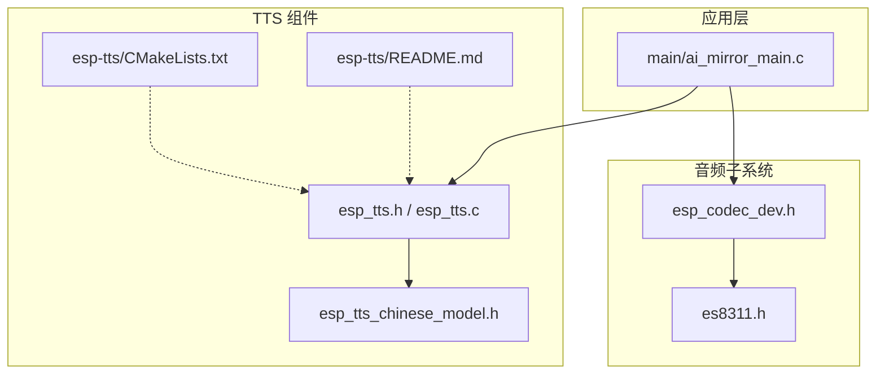
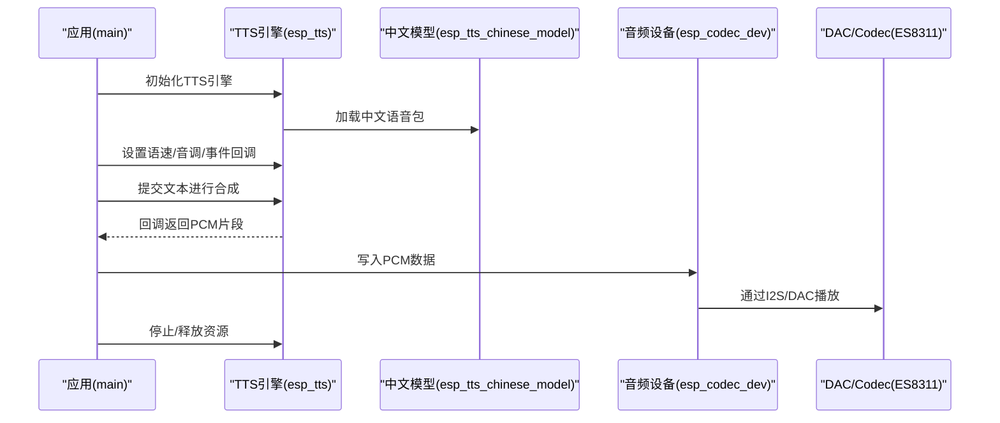
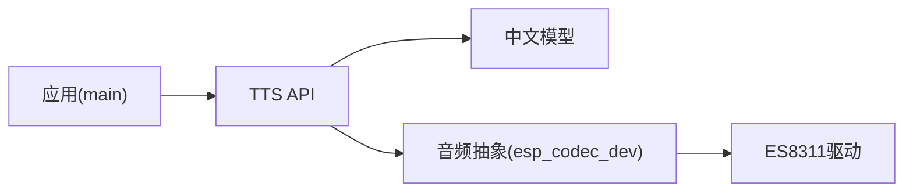

# 语音合成API

<cite>
**本文引用的文件**   
- [esp_tts.h](file://Firmware/esp32_ai_mirror/components/espressif__esp-sr/esp-tts/esp_tts_chinese/include/esp_tts.h)
- [esp_tts.c](file://Firmware/esp32_ai_mirror/components/espressif__esp-sr/esp-tts/esp_tts_chinese/src/esp_tts.c)
- [esp_tts_chinese_model.h](file://Firmware/esp32_ai_mirror/components/espressif__esp-sr/esp-tts/esp_tts_chinese/include/esp_tts_chinese_model.h)
- [CMakeLists.txt](file://Firmware/esp32_ai_mirror/components/espressif__esp-sr/esp-tts/CMakeLists.txt)
- [README.md](file://Firmware/esp32_ai_mirror/components/espressif__esp-sr/esp-tts/README.md)
- [ai_mirror_main.c](file://Firmware/esp32_ai_mirror/main/ai_mirror_main.c)
- [sdkconfig.defaults](file://Firmware/esp32_ai_mirror/sdkconfig.defaults)
- [es8311.h](file://Firmware/esp32_ai_mirror/managed_components/espressif__es8311/include/es8311.h)
- [esp_codec_dev.h](file://Firmware/esp32_ai_mirror/managed_components/espressif__esp_codec_dev/include/esp_codec_dev.h)
</cite>

## 目录
1. [简介](#简介)
2. [项目结构](#项目结构)
3. [核心组件](#核心组件)
4. [架构总览](#架构总览)
5. [详细组件分析](#详细组件分析)
6. [依赖关系分析](#依赖关系分析)
7. [性能与内存优化](#性能与内存优化)
8. [故障排查指南](#故障排查指南)
9. [结论](#结论)
10. [附录：示例与配置清单](#附录示例与配置清单)

## 简介
本文件面向在 ESP32/ESP32S3 等平台上使用 ESP-TTS（中文语音合成）的开发者，系统性说明 ESP-TTS 库的接口与用法，涵盖：
- 语音引擎初始化、文本转语音处理、音频播放控制
- 中文语音包使用方法（音色选择、语速调节）
- TTS 配置参数、内存管理与音频输出接口
- 多平台兼容性与性能优化技巧
- 完整示例流程（从文本到播放）

## 项目结构
ESP-TTS 位于 espressif__esp-sr 组件的 esp-tts 子模块中，包含头文件、源码、样本与 CMake 构建配置。应用层通过 main 工程集成并调用 TTS 接口，音频输出经 codec 驱动（如 ES8311）完成 DAC 播放。

图表来源
- [CMakeLists.txt](file://Firmware/esp32_ai_mirror/components/espressif__esp-sr/esp-tts/CMakeLists.txt)
- [README.md](file://Firmware/esp32_ai_mirror/components/espressif__esp-sr/esp-tts/README.md)
- [ai_mirror_main.c](file://Firmware/esp32_ai_mirror/main/ai_mirror_main.c)
- [esp_tts.h](file://Firmware/esp32_ai_mirror/components/espressif__esp-sr/esp-tts/esp_tts_chinese/include/esp_tts.h)
- [esp_tts.c](file://Firmware/esp32_ai_mirror/components/espressif__esp-sr/esp-tts/esp_tts_chinese/src/esp_tts.c)
- [esp_tts_chinese_model.h](file://Firmware/esp32_ai_mirror/components/espressif__esp-sr/esp-tts/esp_tts_chinese/include/esp_tts_chinese_model.h)
- [esp_codec_dev.h](file://Firmware/esp32_ai_mirror/managed_components/espressif__esp_codec_dev/include/esp_codec_dev.h)
- [es8311.h](file://Firmware/esp32_ai_mirror/managed_components/espressif__es8311/include/es8311.h)

章节来源
- [CMakeLists.txt](file://Firmware/esp32_ai_mirror/components/espressif__esp-sr/esp-tts/CMakeLists.txt)
- [README.md](file://Firmware/esp32_ai_mirror/components/espressif__esp-sr/esp-tts/README.md)

## 核心组件
- 语音合成 API（esp_tts）
  - 负责加载中文语音模型、分词与音素合成、PCM 数据流生成、语速/音调控制、事件回调等。
- 中文语音模型（esp_tts_chinese_model）
  - 提供不同目标平台的模型资源与选择接口，支持按芯片型号加载对应模型。
- 音频编解码抽象（esp_codec_dev）
  - 统一 I2S/Codec 驱动接口，屏蔽硬件差异，向上提供 PCM 写入与音量控制。
- 具体 Codec 驱动（ES8311）
  - 实现具体的音频硬件寄存器配置与数据通路。

章节来源
- [esp_tts.h](file://Firmware/esp32_ai_mirror/components/espressif__esp-sr/esp-tts/esp_tts_chinese/include/esp_tts.h)
- [esp_tts.c](file://Firmware/esp32_ai_mirror/components/espressif__esp-sr/esp-tts/esp_tts_chinese/src/esp_tts.c)
- [esp_tts_chinese_model.h](file://Firmware/esp32_ai_mirror/components/espressif__esp-sr/esp-tts/esp_tts_chinese/include/esp_tts_chinese_model.h)
- [esp_codec_dev.h](file://Firmware/esp32_ai_mirror/managed_components/espressif__esp_codec_dev/include/esp_codec_dev.h)
- [es8311.h](file://Firmware/esp32_ai_mirror/managed_components/espressif__es8311/include/es8311.h)

## 架构总览
下图展示从“文本输入”到“音频播放”的端到端流程，以及各模块间的职责边界。

图表来源
- [esp_tts.h](file://Firmware/esp32_ai_mirror/components/espressif__esp-sr/esp-tts/esp_tts_chinese/include/esp_tts.h)
- [esp_tts.c](file://Firmware/esp32_ai_mirror/components/espressif__esp-sr/esp-tts/esp_tts_chinese/src/esp_tts.c)
- [esp_tts_chinese_model.h](file://Firmware/esp32_ai_mirror/components/espressif__esp-sr/esp-tts/esp_tts_chinese/include/esp_tts_chinese_model.h)
- [esp_codec_dev.h](file://Firmware/esp32_ai_mirror/managed_components/espressif__esp_codec_dev/include/esp_codec_dev.h)
- [es8311.h](file://Firmware/esp32_ai_mirror/managed_components/espressif__es8311/include/es8311.h)

## 详细组件分析

### 语音合成 API（esp_tts）
- 功能要点
  - 引擎初始化：创建上下文、分配内部缓冲、绑定事件回调。
  - 文本转语音：将输入文本切分为可发音单元，调用模型生成 PCM 片段。
  - 播放控制：支持暂停、恢复、停止；可通过回调或阻塞方式获取 PCM。
  - 参数调节：语速、音调、音量（由上层 codec 控制）。
- 关键接口类别（概念性说明）
  - 初始化/销毁：创建与释放 TTS 实例。
  - 配置：设置采样率、声道数、缓冲区大小、事件回调函数指针。
  - 合成：提交文本，逐块回调 PCM 数据。
  - 控制：开始/暂停/恢复/停止。
- 错误码与状态
  - 常见错误包括：模型加载失败、内存不足、非法参数、音频设备不可用等。
- 线程与中断
  - 建议在独立任务中运行 TTS 合成与播放，避免阻塞主循环。
  - 回调中应避免长时间阻塞操作。

章节来源
- [esp_tts.h](file://Firmware/esp32_ai_mirror/components/espressif__esp-sr/esp-tts/esp_tts_chinese/include/esp_tts.h)
- [esp_tts.c](file://Firmware/esp32_ai_mirror/components/espressif__esp-sr/esp-tts/esp_tts_chinese/src/esp_tts.c)

### 中文语音模型（esp_tts_chinese_model）
- 功能要点
  - 按目标平台（esp32/esp32s2/esp32s3/esp32c3）选择合适模型资源。
  - 提供模型校验、加载与释放接口。
- 使用建议
  - 优先选择与当前芯片匹配的模型，以获得最佳性能与体积平衡。
  - 若需切换音色/口音，可在可用范围内选择不同模型文件。

章节来源
- [esp_tts_chinese_model.h](file://Firmware/esp32_ai_mirror/components/espressif__esp-sr/esp-tts/esp_tts_chinese/include/esp_tts_chinese_model.h)

### 音频输出（esp_codec_dev + ES8311）
- 功能要点
  - 通过 esp_codec_dev 抽象层统一 I2S/Codec 驱动，提供 PCM 写入、音量控制、采样率配置。
  - ES8311 作为具体 Codec 驱动，负责寄存器配置与数据通路。
- 使用建议
  - 确保 I2S 时钟与 TTS 输出采样率一致。
  - 合理设置 DMA 缓冲与队列长度，避免卡顿或溢出。

章节来源
- [esp_codec_dev.h](file://Firmware/esp32_ai_mirror/managed_components/espressif__esp_codec_dev/include/esp_codec_dev.h)
- [es8311.h](file://Firmware/esp32_ai_mirror/managed_components/espressif__es8311/include/es8311.h)

### 应用集成（main）
- 典型流程
  - 初始化系统外设（I2S/Codec），初始化 TTS 引擎，加载中文模型。
  - 在 UI/事件触发时，调用 TTS 合成接口，将回调中的 PCM 写入音频设备。
  - 结束时释放 TTS 与音频资源。
- 注意事项
  - 合理划分任务优先级，保证音频实时性。
  - 对长文本进行分段合成，避免单次占用过多内存。

章节来源
- [ai_mirror_main.c](file://Firmware/esp32_ai_mirror/main/ai_mirror_main.c)

## 依赖关系分析
- 组件耦合
  - 应用层依赖 TTS API 与音频抽象层。
  - TTS 依赖中文模型资源与底层音频输出。
- 外部依赖
  - ESP-IDF 基础库（FreeRTOS、I2S、SPIFFS/Flash 访问等）。
  - 音频驱动（esp_codec_dev 与具体 Codec）。
- 潜在环依赖
  - 通过分层接口（TTS/模型/codec）避免直接环依赖。

图表来源
- [CMakeLists.txt](file://Firmware/esp32_ai_mirror/components/espressif__esp-sr/esp-tts/CMakeLists.txt)
- [esp_tts.h](file://Firmware/esp32_ai_mirror/components/espressif__esp-sr/esp-tts/esp_tts_chinese/include/esp_tts.h)
- [esp_tts_chinese_model.h](file://Firmware/esp32_ai_mirror/components/espressif__esp-sr/esp-tts/esp_tts_chinese/include/esp_tts_chinese_model.h)
- [esp_codec_dev.h](file://Firmware/esp32_ai_mirror/managed_components/espressif__esp_codec_dev/include/esp_codec_dev.h)
- [es8311.h](file://Firmware/esp32_ai_mirror/managed_components/espressif__es8311/include/es8311.h)

章节来源
- [CMakeLists.txt](file://Firmware/esp32_ai_mirror/components/espressif__esp-sr/esp-tts/CMakeLists.txt)

## 性能与内存优化
- 模型与内存
  - 选择与目标芯片匹配的模型，减少 Flash 读取与拷贝开销。
  - 合理设置 TTS 内部缓冲与队列长度，避免频繁分配/释放。
- 合成与播放
  - 采用“合成-播放”流水线：边合成边播放，降低首帧延迟。
  - 长文本分段合成，控制单段大小，避免堆栈/堆溢出。
- 音频路径
  - 确保采样率、位深、通道数与硬件一致，避免重采样带来的 CPU 消耗。
  - 使用 DMA 传输与环形缓冲，提升吞吐稳定性。
- 功耗与并发
  - 空闲时关闭不必要的音频外设。
  - 将 TTS 合成与 UI/网络任务分离，避免互相阻塞。

[本节为通用指导，不直接分析具体文件]

## 故障排查指南
- 常见问题
  - 模型加载失败：检查模型路径、芯片匹配、Flash 分区与权限。
  - 无声音/杂音：确认 I2S 引脚、时钟、DMA 配置与音量设置。
  - 卡顿/断音：增大缓冲区、降低合成复杂度、提高音频任务优先级。
  - 内存不足：减小单次合成文本长度、复用缓冲区、释放未用资源。
- 定位方法
  - 打印关键阶段的状态码与耗时。
  - 使用 ESP-IDF 调试工具观察任务栈与内存使用。
  - 逐步隔离问题（先验证音频通路，再验证 TTS 合成）。

章节来源
- [sdkconfig.defaults](file://Firmware/esp32_ai_mirror/sdkconfig.defaults)

## 结论
ESP-TTS 提供了在 ESP32 系列上高效中文语音合成的能力。通过清晰的 API 分层、灵活的模型选择与统一的音频抽象，开发者可以便捷地实现“文本→语音→播放”的完整链路。结合合理的内存与任务设计，可在资源受限的嵌入式设备上获得稳定、低延迟的语音体验。

[本节为总结性内容，不直接分析具体文件]

## 附录：示例与配置清单

### 端到端示例流程（步骤化）
- 初始化音频
  - 配置 I2S 与 Codec（ES8311），设置采样率与音量。
- 初始化 TTS
  - 创建 TTS 实例，设置回调、缓冲区与事件处理。
- 加载中文模型
  - 根据目标芯片选择并加载对应模型资源。
- 合成与播放
  - 提交文本，接收回调中的 PCM 片段，持续写入音频设备。
- 结束与释放
  - 停止播放，释放 TTS 与音频资源。

章节来源
- [ai_mirror_main.c](file://Firmware/esp32_ai_mirror/main/ai_mirror_main.c)
- [esp_tts.h](file://Firmware/esp32_ai_mirror/components/espressif__esp-sr/esp-tts/esp_tts_chinese/include/esp_tts.h)
- [esp_tts_chinese_model.h](file://Firmware/esp32_ai_mirror/components/espressif__esp-sr/esp-tts/esp_tts_chinese/include/esp_tts_chinese_model.h)
- [esp_codec_dev.h](file://Firmware/esp32_ai_mirror/managed_components/espressif__esp_codec_dev/include/esp_codec_dev.h)
- [es8311.h](file://Firmware/esp32_ai_mirror/managed_components/espressif__es8311/include/es8311.h)

### TTS 配置参数参考
- 音频参数
  - 采样率、位深、声道数（需与硬件一致）
- 合成参数
  - 语速、音调、停顿控制（依接口定义）
- 缓冲与队列
  - 合成缓冲大小、音频队列长度（影响延迟与稳定性）
- 事件回调
  - 开始、进度、结束、错误等回调注册

章节来源
- [esp_tts.h](file://Firmware/esp32_ai_mirror/components/espressif__esp-sr/esp-tts/esp_tts_chinese/include/esp_tts.h)
- [esp_tts.c](file://Firmware/esp32_ai_mirror/components/espressif__esp-sr/esp-tts/esp_tts_chinese/src/esp_tts.c)

### 多平台兼容性
- 支持的芯片
  - ESP32、ESP32S2、ESP32S3、ESP32C3（以模型与驱动为准）
- 适配要点
  - 选择匹配的模型与音频驱动配置
  - 注意 Flash/PSRAM 容量与访问时序差异

章节来源
- [esp_tts_chinese_model.h](file://Firmware/esp32_ai_mirror/components/espressif__esp-sr/esp-tts/esp_tts_chinese/include/esp_tts_chinese_model.h)
- [CMakeLists.txt](file://Firmware/esp32_ai_mirror/components/espressif__esp-sr/esp-tts/CMakeLists.txt)

### 常用命令与构建
- 添加组件
  - 在工程 CMake 中添加 esp-tts 组件依赖
- 编译与烧录
  - 使用 ESP-IDF 工具链编译并下载到目标板
- 日志与调试
  - 启用必要日志级别，便于定位问题

章节来源
- [CMakeLists.txt](file://Firmware/esp32_ai_mirror/components/espressif__esp-sr/esp-tts/CMakeLists.txt)
- [README.md](file://Firmware/esp32_ai_mirror/components/espressif__esp-sr/esp-tts/README.md)