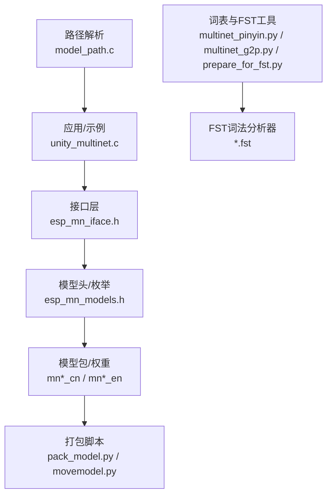
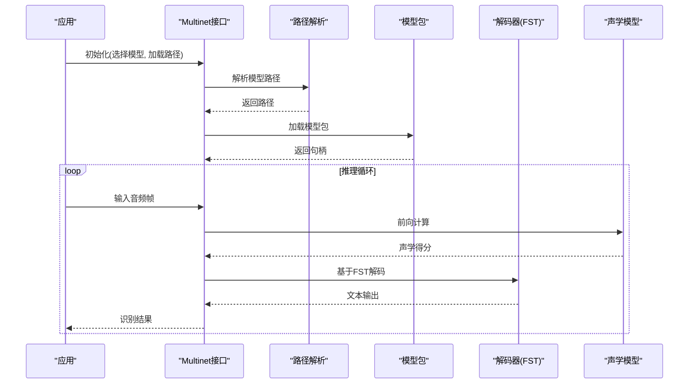
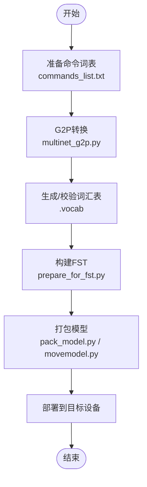
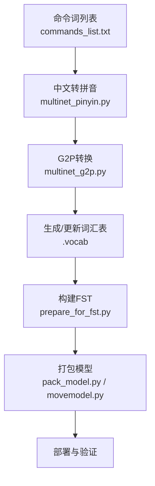
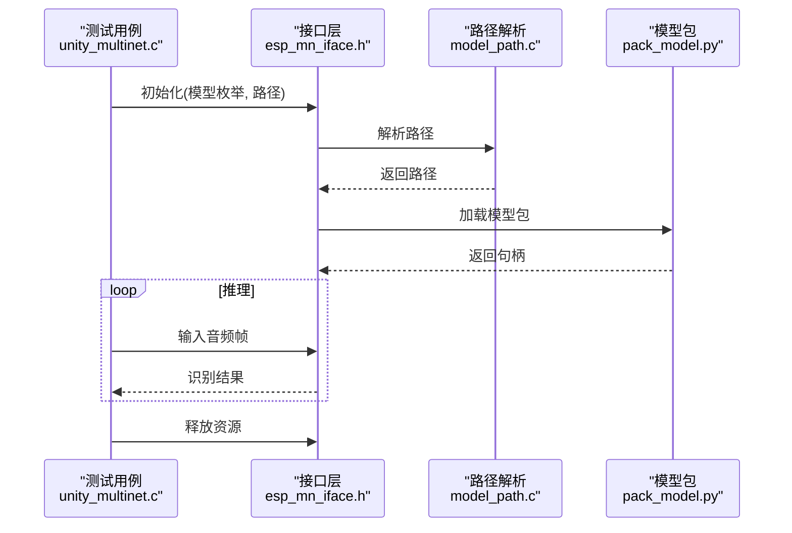
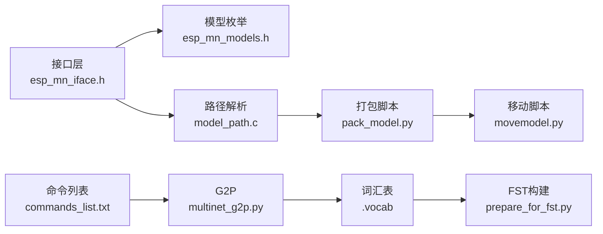

# Multinet模型配置

<cite>
**本文引用的文件**
- [README.md](file://Firmware/esp32_ai_mirror/components/espressif__esp-sr/README.md)
- [CMakeLists.txt](file://Firmware/esp32_ai_mirror/components/espressif__esp-sr/model/CMakeLists.txt)
- [movemodel.py](file://Firmware/esp32_ai_mirror/components/espressif__esp-sr/model/movemodel.py)
- [pack_model.py](file://Firmware/esp32_ai_mirror/components/espressif__esp-sr/model/pack_model.py)
- [multinet_pinyin.py](file://Firmware/esp32_ai_mirror/components/espressif__esp-sr/tool/multinet_pinyin.py)
- [multinet_g2p.py](file://Firmware/esp32_ai_mirror/components/espressif__esp-sr/tool/multinet_g2p.py)
- [prepare_for_fst.py](file://Firmware/esp32_ai_mirror/components/espressif__esp-sr/tool/fst/prepare_for_fst.py)
- [commands_list.txt](file://Firmware/esp32_ai_mirror/components/espressif__esp-sr/tool/fst/commands_list.txt)
- [requirements.txt](file://Firmware/esp32_ai_mirror/components/espressif__esp-sr/tool/fst/requirements.txt)
- [esp_mn_models.h](file://Firmware/esp32_ai_mirror/components/espressif__esp-sr/include/esp32/esp_mn_models.h)
- [esp_mn_iface.h](file://Firmware/esp32_ai_mirror/components/espressif__esp-sr/include/esp32/esp_mn_iface.h)
- [model_path.c](file://Firmware/esp32_ai_mirror/components/espressif__esp-sr/src/model_path.c)
- [unity_multinet.c](file://Firmware/esp32_ai_mirror/components/espressif__esp-sr/test/unity_multinet.c)
</cite>

## 目录
1. [简介](#简介)
2. [项目结构](#项目结构)
3. [核心组件](#核心组件)
4. [架构总览](#架构总览)
5. [详细组件分析](#详细组件分析)
6. [依赖关系分析](#依赖关系分析)
7. [性能考量](#性能考量)
8. [故障排查指南](#故障排查指南)
9. [结论](#结论)
10. [附录](#附录)

## 简介
本文件面向在 ESP-SR（Espressif Speech Recognition）中集成与部署 Multinet 模型的工程师，系统说明中文与英文 Multinet 模型的差异、模型文件结构与生成流程、自定义命令词汇表构建方法，以及部署与加载示例。文档同时给出不同模型版本的选型建议与性能对比要点，帮助读者在资源受限的嵌入式平台上做出合理选择。

## 项目结构
Multinet 相关代码与资源主要位于 esp-sr 组件内：
- 模型定义与头文件：include/esp32/esp_mn_models.h、esp_mn_iface.h
- 模型打包与移动脚本：model/movemodel.py、model/pack_model.py、model/CMakeLists.txt
- 工具链（拼音转换、G2P、FST 构建）：tool/multinet_pinyin.py、tool/multinet_g2p.py、tool/fst/*
- 测试与示例：test/unity_multinet.c
- 路径解析与运行时：src/model_path.c

图表来源
- [unity_multinet.c](file://Firmware/esp32_ai_mirror/components/espressif__esp-sr/test/unity_multinet.c)
- [esp_mn_iface.h](file://Firmware/esp32_ai_mirror/components/espressif__esp-sr/include/esp32/esp_mn_iface.h)
- [esp_mn_models.h](file://Firmware/esp32_ai_mirror/components/espressif__esp-sr/include/esp32/esp_mn_models.h)
- [pack_model.py](file://Firmware/esp32_ai_mirror/components/espressif__esp-sr/model/pack_model.py)
- [movemodel.py](file://Firmware/esp32_ai_mirror/components/espressif__esp-sr/model/movemodel.py)
- [multinet_pinyin.py](file://Firmware/esp32_ai_mirror/components/espressif__esp-sr/tool/multinet_pinyin.py)
- [multinet_g2p.py](file://Firmware/esp32_ai_mirror/components/espressif__esp-sr/tool/multinet_g2p.py)
- [prepare_for_fst.py](file://Firmware/esp32_ai_mirror/components/espressif__esp-sr/tool/fst/prepare_for_fst.py)
- [model_path.c](file://Firmware/esp32_ai_mirror/components/espressif__esp-sr/src/model_path.c)

章节来源
- [README.md](file://Firmware/esp32_ai_mirror/components/espressif__esp-sr/README.md)
- [CMakeLists.txt](file://Firmware/esp32_ai_mirror/components/espressif__esp-sr/model/CMakeLists.txt)

## 核心组件
- 接口与模型枚举
  - 接口层提供初始化、推理、释放等统一 API，屏蔽具体模型实现细节。
  - 模型枚举定义了可用的 Multinet 变体（含中英文及量化版本），便于按需选择。
- 模型打包与部署
  - 打包脚本将权重与元数据整合为可部署的二进制格式，并支持按目标平台裁剪。
  - 移动脚本用于将模型文件移动到固件镜像或分区中的指定位置。
- 工具链
  - 拼音转换与 G2P：将中文文本转换为音素序列，支撑中文语言建模。
  - FST 构建：基于命令词表生成词法分析器，决定解码图的结构与搜索空间。
- 路径解析
  - 运行时根据配置与目标平台解析模型路径，确保正确加载对应模型文件。

章节来源
- [esp_mn_iface.h](file://Firmware/esp32_ai_mirror/components/espressif__esp-sr/include/esp32/esp_mn_iface.h)
- [esp_mn_models.h](file://Firmware/esp32_ai_mirror/components/espressif__esp-sr/include/esp32/esp_mn_models.h)
- [pack_model.py](file://Firmware/esp32_ai_mirror/components/espressif__esp-sr/model/pack_model.py)
- [movemodel.py](file://Firmware/esp32_ai_mirror/components/espressif__esp-sr/model/movemodel.py)
- [model_path.c](file://Firmware/esp32_ai_mirror/components/espressif__esp-sr/src/model_path.c)

## 架构总览
Multinet 在 ESP-SR 中的整体工作流如下：
- 训练/准备阶段：使用中文/英文语料与命令词表，通过 G2P 和 FST 工具生成词法分析器与词汇表。
- 打包阶段：将声学模型权重与词典信息打包成目标平台可加载的格式。
- 运行阶段：应用调用接口初始化模型，输入音频特征，解码得到文本结果。

图表来源
- [unity_multinet.c](file://Firmware/esp32_ai_mirror/components/espressif__esp-sr/test/unity_multinet.c)
- [esp_mn_iface.h](file://Firmware/esp32_ai_mirror/components/espressif__esp-sr/include/esp32/esp_mn_iface.h)
- [model_path.c](file://Firmware/esp32_ai_mirror/components/espressif__esp-sr/src/model_path.c)
- [pack_model.py](file://Firmware/esp32_ai_mirror/components/espressif__esp-sr/model/pack_model.py)

## 详细组件分析

### 中文与英文 Multinet 模型差异
- 词汇表大小
  - 中文模型通常包含更多字符与音节组合，词汇表规模较大；英文模型以单词为主，词汇表相对较小但包含大量英文单词。
  - 量化版本（如 q8）会进一步压缩内存占用，但可能影响精度。
- 声学模型结构
  - 不同版本（如 mn3/mn4/mn5/mn6）在层数、卷积/全连接深度、特征维度等方面存在差异，越新版本通常精度更高但资源消耗更大。
  - 英文与中文模型在音素/子词单元映射上不同，导致网络输入特征与标签空间不一致。
- 语言模型配置
  - 中文依赖拼音到字/词的映射，需结合 G2P 与 FST 构建解码图。
  - 英文多采用单词级语言模型，FST 由命令词表直接生成。

章节来源
- [esp_mn_models.h](file://Firmware/esp32_ai_mirror/components/espressif__esp-sr/include/esp32/esp_mn_models.h)
- [multinet_pinyin.py](file://Firmware/esp32_ai_mirror/components/espressif__esp-sr/tool/multinet_pinyin.py)
- [multinet_g2p.py](file://Firmware/esp32_ai_mirror/components/espressif__esp-sr/tool/multinet_g2p.py)

### 模型文件结构与生成方法
- 模型包结构
  - 权重文件：声学模型参数（浮点或量化）。
  - 元数据：模型版本、语言类型、特征配置、标签映射等。
  - 词典：词汇表与音素/子词映射（.vocab 或等效结构）。
- .vocab 词汇表文件
  - 每行一个条目，包含 token 与可选权重/频率。
  - 中文场景下常包含拼音片段与汉字映射；英文场景多为单词 token。
- .fst 词法分析器文件
  - 描述命令词到符号序列的有向无环图，供解码时约束搜索空间。
  - 由命令列表经 G2P/FST 工具生成，保证与词汇表一致。

图表来源
- [commands_list.txt](file://Firmware/esp32_ai_mirror/components/espressif__esp-sr/tool/fst/commands_list.txt)
- [multinet_g2p.py](file://Firmware/esp32_ai_mirror/components/espressif__esp-sr/tool/multinet_g2p.py)
- [prepare_for_fst.py](file://Firmware/esp32_ai_mirror/components/espressif__esp-sr/tool/fst/prepare_for_fst.py)
- [pack_model.py](file://Firmware/esp32_ai_mirror/components/espressif__esp-sr/model/pack_model.py)
- [movemodel.py](file://Firmware/esp32_ai_mirror/components/espressif__esp-sr/model/movemodel.py)

章节来源
- [pack_model.py](file://Firmware/esp32_ai_mirror/components/espressif__esp-sr/model/pack_model.py)
- [movemodel.py](file://Firmware/esp32_ai_mirror/components/espressif__esp-sr/model/movemodel.py)
- [CMakeLists.txt](file://Firmware/esp32_ai_mirror/components/espressif__esp-sr/model/CMakeLists.txt)

### 自定义命令词汇表的构建流程
- 步骤概览
  - 准备命令列表：整理业务所需的命令词，写入 commands_list.txt。
  - 拼音转换（中文）：使用 multinet_pinyin.py 将中文命令转为拼音序列。
  - G2P 处理：通过 multinet_g2p.py 将拼音/文本转为音素或子词序列。
  - 构建 FST：利用 prepare_for_fst.py 生成 .fst 词法分析器。
  - 生成/更新词汇表：确保 .vocab 与 FST 一致，避免解码失败。
  - 模型编译与打包：执行 pack_model.py 与 movemodel.py 完成部署准备。
- 注意事项
  - 命令词去重、规范化（大小写、标点、空格）。
  - 中文多音字与专有名词需人工校对拼音。
  - 保持词汇表与 FST 同步更新，避免索引错位。

图表来源
- [commands_list.txt](file://Firmware/esp32_ai_mirror/components/espressif__esp-sr/tool/fst/commands_list.txt)
- [multinet_pinyin.py](file://Firmware/esp32_ai_mirror/components/espressif__esp-sr/tool/multinet_pinyin.py)
- [multinet_g2p.py](file://Firmware/esp32_ai_mirror/components/espressif__esp-sr/tool/multinet_g2p.py)
- [prepare_for_fst.py](file://Firmware/esp32_ai_mirror/components/espressif__esp-sr/tool/fst/prepare_for_fst.py)
- [pack_model.py](file://Firmware/esp32_ai_mirror/components/espressif__esp-sr/model/pack_model.py)
- [movemodel.py](file://Firmware/esp32_ai_mirror/components/espressif__esp-sr/model/movemodel.py)

章节来源
- [requirements.txt](file://Firmware/esp32_ai_mirror/components/espressif__esp-sr/tool/fst/requirements.txt)
- [multinet_pinyin.py](file://Firmware/esp32_ai_mirror/components/espressif__esp-sr/tool/multinet_pinyin.py)
- [multinet_g2p.py](file://Firmware/esp32_ai_mirror/components/espressif__esp-sr/tool/multinet_g2p.py)
- [prepare_for_fst.py](file://Firmware/esp32_ai_mirror/components/espressif__esp-sr/tool/fst/prepare_for_fst.py)

### 部署与加载示例
- 典型流程
  - 选择模型：根据语言与资源限制选择 mn*_cn 或 mn*_en（含量化版本）。
  - 初始化接口：调用接口函数传入模型路径与配置。
  - 运行推理：循环输入音频帧，获取识别结果。
  - 释放资源：任务结束后释放模型句柄。
- 参考示例
  - test/unity_multinet.c 展示了基本初始化与推理循环。
  - src/model_path.c 展示如何解析模型路径与定位文件。

图表来源
- [unity_multinet.c](file://Firmware/esp32_ai_mirror/components/espressif__esp-sr/test/unity_multinet.c)
- [esp_mn_iface.h](file://Firmware/esp32_ai_mirror/components/espressif__esp-sr/include/esp32/esp_mn_iface.h)
- [model_path.c](file://Firmware/esp32_ai_mirror/components/espressif__esp-sr/src/model_path.c)
- [pack_model.py](file://Firmware/esp32_ai_mirror/components/espressif__esp-sr/model/pack_model.py)

章节来源
- [unity_multinet.c](file://Firmware/esp32_ai_mirror/components/espressif__esp-sr/test/unity_multinet.c)
- [model_path.c](file://Firmware/esp32_ai_mirror/components/espressif__esp-sr/src/model_path.c)

## 依赖关系分析
- 组件耦合
  - 接口层对模型枚举与路径解析强依赖，对打包脚本弱依赖（仅在构建期）。
  - 工具链相互依赖：G2P 与 FST 构建顺序固定，词汇表需保持一致。
- 外部依赖
  - FST 构建脚本依赖 Python 环境与 requirements.txt 所列库。
  - 打包脚本依赖目标平台的二进制格式规范。

图表来源
- [esp_mn_iface.h](file://Firmware/esp32_ai_mirror/components/espressif__esp-sr/include/esp32/esp_mn_iface.h)
- [esp_mn_models.h](file://Firmware/esp32_ai_mirror/components/espressif__esp-sr/include/esp32/esp_mn_models.h)
- [model_path.c](file://Firmware/esp32_ai_mirror/components/espressif__esp-sr/src/model_path.c)
- [pack_model.py](file://Firmware/esp32_ai_mirror/components/espressif__esp-sr/model/pack_model.py)
- [movemodel.py](file://Firmware/esp32_ai_mirror/components/espressif__esp-sr/model/movemodel.py)
- [multinet_g2p.py](file://Firmware/esp32_ai_mirror/components/espressif__esp-sr/tool/multinet_g2p.py)
- [prepare_for_fst.py](file://Firmware/esp32_ai_mirror/components/espressif__esp-sr/tool/fst/prepare_for_fst.py)
- [commands_list.txt](file://Firmware/esp32_ai_mirror/components/espressif__esp-sr/tool/fst/commands_list.txt)

章节来源
- [requirements.txt](file://Firmware/esp32_ai_mirror/components/espressif__esp-sr/tool/fst/requirements.txt)

## 性能考量
- 模型版本选择
  - 低资源设备优先选择量化版本（q8），权衡精度与内存占用。
  - 高精度需求可选择较新版本（如 mn5/mn6），但需评估 CPU/Flash 预算。
- 语言差异
  - 中文模型因词汇表与 FST 复杂度较高，解码开销更大；英文模型相对轻量。
- 优化建议
  - 精简命令词表，减少 FST 节点数量。
  - 使用批处理与缓存策略降低重复计算。
  - 针对目标平台启用硬件加速（如 DSP/NPU，若可用）。

[本节为通用指导，不直接分析具体文件]

## 故障排查指南
- 常见问题
  - 路径解析失败：检查 model_path.c 的路径规则与配置文件。
  - 模型加载错误：确认 pack_model.py 生成的包格式与目标平台匹配。
  - 解码失败：核对 .vocab 与 .fst 的一致性，确保命令词已纳入词表。
  - 拼音错误：中文命令的多音字与专有名词需人工校对。
- 调试手段
  - 打印中间结果（G2P 输出、FST 状态、解码路径）。
  - 逐步缩小命令词集，定位问题词项。
  - 使用单元测试（unity_multinet.c）验证基础流程。

章节来源
- [model_path.c](file://Firmware/esp32_ai_mirror/components/espressif__esp-sr/src/model_path.c)
- [pack_model.py](file://Firmware/esp32_ai_mirror/components/espressif__esp-sr/model/pack_model.py)
- [unity_multinet.c](file://Firmware/esp32_ai_mirror/components/espressif__esp-sr/test/unity_multinet.c)

## 结论
Multinet 在 ESP-SR 中提供了灵活的中英双语语音识别能力。通过合理的模型选择、词表构建与部署流程，可在资源受限设备上实现稳定高效的识别效果。建议在生产环境中严格校验词表一致性，并结合业务需求进行性能调优。

[本节为总结性内容，不直接分析具体文件]

## 附录
- 关键文件清单
  - 接口与模型：esp_mn_iface.h、esp_mn_models.h
  - 打包与部署：pack_model.py、movemodel.py、CMakeLists.txt
  - 工具链：multinet_pinyin.py、multinet_g2p.py、prepare_for_fst.py、commands_list.txt、requirements.txt
  - 路径与示例：model_path.c、unity_multinet.c

[本节为索引性内容，不直接分析具体文件]