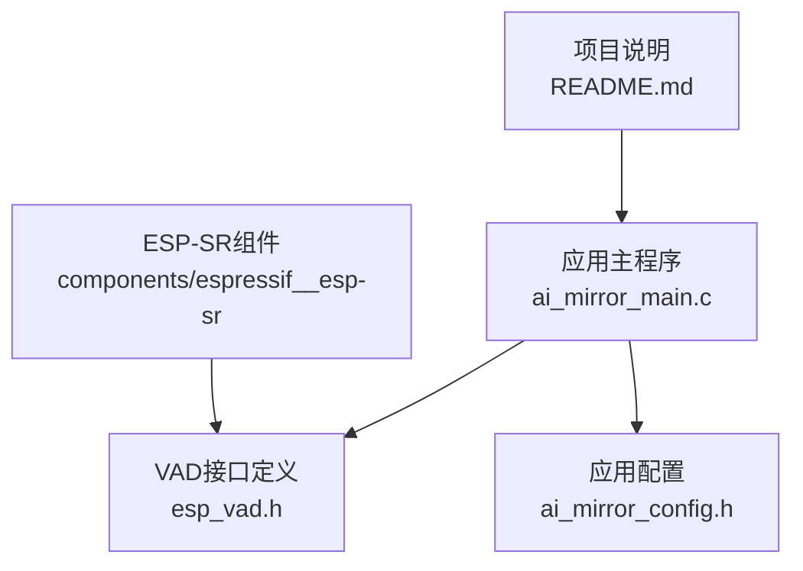
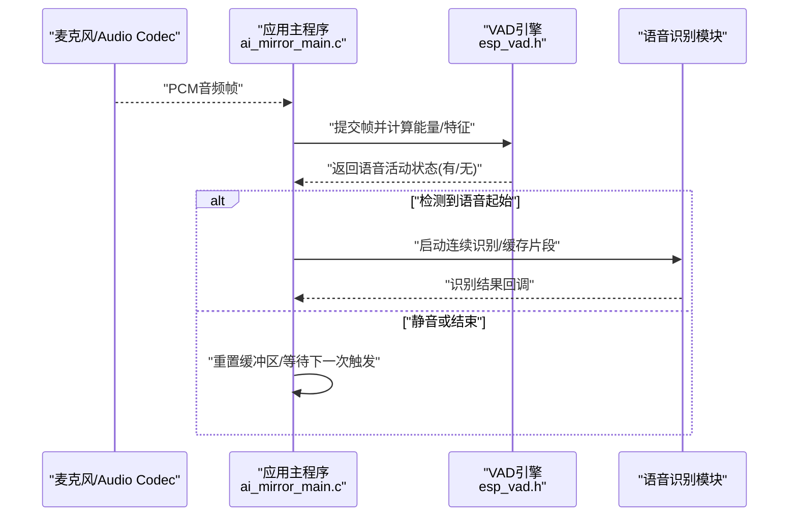
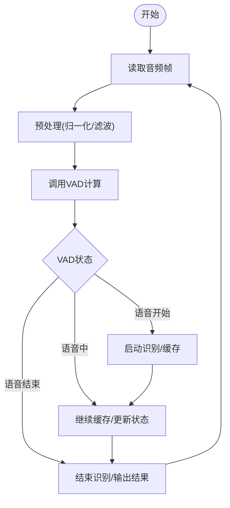
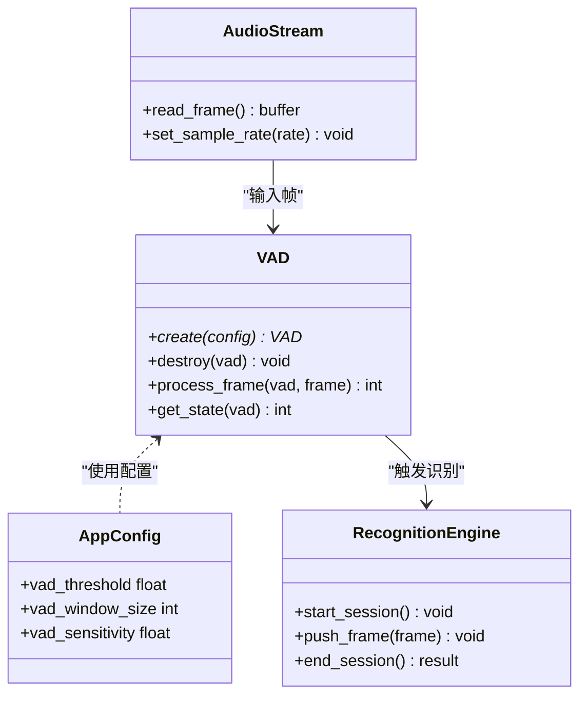
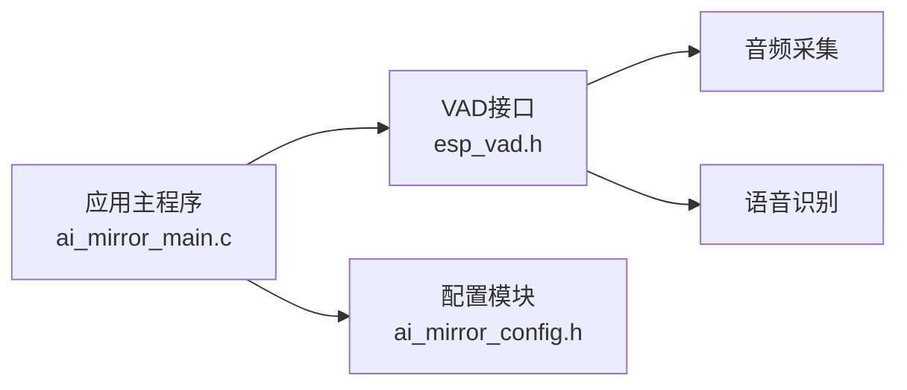

# VAD语音活动检测

<cite>
**本文引用的文件**   
- [esp_vad.h](file://Firmware/esp32_ai_mirror/components/espressif__esp-sr/include/esp_vad.h)
- [ai_mirror_main.c](file://Firmware/esp32_ai_mirror/main/ai_mirror_main.c)
- [ai_mirror_config.h](file://Firmware/esp32_ai_mirror/main/ai_mirror_config.h)
- [README.md](file://Firmware/esp32_ai_mirror/README.md)
</cite>

## 目录
1. [简介](#简介)
2. [项目结构](#项目结构)
3. [核心组件](#核心组件)
4. [架构总览](#架构总览)
5. [详细组件分析](#详细组件分析)
6. [依赖关系分析](#依赖关系分析)
7. [性能考虑](#性能考虑)
8. [故障排查指南](#故障排查指南)
9. [结论](#结论)
10. [附录：配置与使用示例路径](#附录配置与使用示例路径)

## 简介
本文件面向在ESP32 AI镜像项目中集成和使用VAD（Voice Activity Detection，语音活动检测）的开发者。内容涵盖VAD的工作原理（音频能量检测、静音段识别、语音起始点检测）、关键配置参数（阈值、窗口大小、灵敏度）、在实时语音识别流程中的集成方式（音频流预处理与触发机制），以及不同噪声环境下的调优策略与性能优化技巧。文档同时提供代码级参考路径，便于快速定位实现与配置位置。

## 项目结构
本项目基于ESP-IDF构建，VAD能力由espressif__esp-sr组件提供，并通过main应用层进行集成与调度。关键目录与职责如下：
- components/espressif__esp-sr：包含VAD接口定义与模型相关头文件，供上层调用。
- main：应用入口、系统初始化、音频采集与VAD触发逻辑所在。
- README：项目说明与总体介绍。

图表来源 
- [ai_mirror_main.c](file://Firmware/esp32_ai_mirror/main/ai_mirror_main.c)
- [esp_vad.h](file://Firmware/esp32_ai_mirror/components/espressif__esp-sr/include/esp_vad.h)
- [ai_mirror_config.h](file://Firmware/esp32_ai_mirror/main/ai_mirror_config.h)
- [README.md](file://Firmware/esp32_ai_mirror/README.md)

章节来源
- [README.md](file://Firmware/esp32_ai_mirror/README.md)

## 核心组件
- VAD接口与类型定义：位于esp_vad.h，提供VAD实例创建、配置、帧处理与状态查询等API。
- 应用集成：main/ai_mirror_main.c负责音频采集线程、VAD初始化与调用、触发后续识别流程。
- 配置管理：main/ai_mirror_config.h集中管理VAD阈值、窗口长度、灵敏度等可调参数。

章节来源
- [esp_vad.h](file://Firmware/esp32_ai_mirror/components/espressif__esp-sr/include/esp_vad.h)
- [ai_mirror_main.c](file://Firmware/esp32_ai_mirror/main/ai_mirror_main.c)
- [ai_mirror_config.h](file://Firmware/esp32_ai_mirror/main/ai_mirror_config.h)

## 架构总览
下图展示从音频采集到VAD判定再到语音识别触发的整体数据流与控制流。

图表来源 
- [ai_mirror_main.c](file://Firmware/esp32_ai_mirror/main/ai_mirror_main.c)
- [esp_vad.h](file://Firmware/esp32_ai_mirror/components/espressif__esp-sr/include/esp_vad.h)

## 详细组件分析

### VAD工作原理
- 音频能量检测：对每帧音频计算短时能量（如均方值或对数能量），作为语音存在性的基础指标。
- 静音段识别：通过滑动窗口统计能量分布，结合阈值判断静音/非静音区间，抑制背景噪声影响。
- 语音起始点检测：当能量超过阈值且持续一定帧数时，判定为语音起始；随后进入语音段跟踪，直至能量回落并满足结束条件。

该流程通常以固定帧长（如10–30ms）为单位处理，保证低延迟与稳定判定。

章节来源
- [esp_vad.h](file://Firmware/esp32_ai_mirror/components/espressif__esp-sr/include/esp_vad.h)

### 关键配置参数
- 阈值设置：控制能量判定的敏感度，过高易漏检，过低易误检。
- 窗口大小：决定静音/语音段的平滑程度，窗口越大越稳健但延迟越高。
- 灵敏度调节：综合阈值与窗口的折中参数，用于在不同噪声环境下平衡检出率与误报率。
- 帧长与采样率：需与音频采集一致，确保特征计算正确。

章节来源
- [ai_mirror_config.h](file://Firmware/esp32_ai_mirror/main/ai_mirror_config.h)
- [esp_vad.h](file://Firmware/esp32_ai_mirror/components/espressif__esp-sr/include/esp_vad.h)

### 实时集成与触发机制
- 音频流预处理：采集PCM后，按帧切分并进行必要的归一化/滤波，再送入VAD。
- 触发机制：VAD输出“语音开始”事件后，应用侧启动缓冲收集与识别任务；“语音结束”事件触发识别收尾与结果回调。
- 资源管理：合理分配帧缓冲与队列，避免阻塞音频采集线程。

图表来源 
- [ai_mirror_main.c](file://Firmware/esp32_ai_mirror/main/ai_mirror_main.c)
- [esp_vad.h](file://Firmware/esp32_ai_mirror/components/espressif__esp-sr/include/esp_vad.h)

章节来源
- [ai_mirror_main.c](file://Firmware/esp32_ai_mirror/main/ai_mirror_main.c)

### 类图（接口与数据结构示意）
以下类图抽象了VAD接口与应用集成的主要元素（仅示意，具体字段与方法以实际头文件为准）。

图表来源 
- [esp_vad.h](file://Firmware/esp32_ai_mirror/components/espressif__esp-sr/include/esp_vad.h)
- [ai_mirror_config.h](file://Firmware/esp32_ai_mirror/main/ai_mirror_config.h)
- [ai_mirror_main.c](file://Firmware/esp32_ai_mirror/main/ai_mirror_main.c)

## 依赖关系分析
- 应用层依赖VAD接口进行语音活动判定，依赖配置模块获取阈值与窗口参数。
- VAD依赖底层音频采集提供的帧数据，并与识别模块协作完成端到端流程。
- 组件间耦合度适中：通过接口解耦，便于替换VAD实现或调整识别后端。

图表来源 
- [ai_mirror_main.c](file://Firmware/esp32_ai_mirror/main/ai_mirror_main.c)
- [esp_vad.h](file://Firmware/esp32_ai_mirror/components/espressif__esp-sr/include/esp_vad.h)
- [ai_mirror_config.h](file://Firmware/esp32_ai_mirror/main/ai_mirror_config.h)

章节来源
- [ai_mirror_main.c](file://Firmware/esp32_ai_mirror/main/ai_mirror_main.c)
- [esp_vad.h](file://Firmware/esp32_ai_mirror/components/espressif__esp-sr/include/esp_vad.h)
- [ai_mirror_config.h](file://Firmware/esp32_ai_mirror/main/ai_mirror_config.h)

## 性能考虑
- 帧长与采样率选择：较短帧降低延迟但增加计算开销；需在实时性与准确性之间权衡。
- 阈值自适应：根据环境噪声动态调整阈值，减少误检与漏检。
- 窗口平滑：适当增大窗口可提升鲁棒性，但会增加响应时间。
- 内存与队列：合理设计帧缓冲与队列长度，避免溢出或阻塞。
- 功耗优化：在无语音时降低CPU占用（如休眠或降频），提高续航。

[本节为通用指导，不直接分析具体文件]

## 故障排查指南
- 无法检测到语音：检查阈值是否过高、窗口是否过大、音频增益是否不足。
- 频繁误触发：降低灵敏度、提高阈值、增强前端降噪。
- 识别中断：确认VAD结束条件与识别会话生命周期是否匹配。
- 资源不足：监控内存与队列使用情况，必要时减小帧长或批量处理。

章节来源
- [ai_mirror_main.c](file://Firmware/esp32_ai_mirror/main/ai_mirror_main.c)
- [esp_vad.h](file://Firmware/esp32_ai_mirror/components/espressif__esp-sr/include/esp_vad.h)
- [ai_mirror_config.h](file://Firmware/esp32_ai_mirror/main/ai_mirror_config.h)

## 结论
VAD在ESP32 AI镜像项目中承担关键的语音活动判定角色，通过合理的能量检测、静音段识别与起始点检测算法，结合灵活的阈值与窗口配置，能够在多种噪声环境下稳定工作。将VAD无缝集成到实时语音识别流程中，可实现低功耗、低延迟的语音交互体验。建议在实际部署中依据环境噪声特性进行参数调优，并结合前端降噪与AGC进一步提升鲁棒性。

[本节为总结，不直接分析具体文件]

## 附录：配置与使用示例路径
- VAD接口与类型定义：esp_vad.h
- 应用集成与触发逻辑：ai_mirror_main.c
- VAD配置参数（阈值、窗口、灵敏度）：ai_mirror_config.h
- 项目说明与总体介绍：README.md

章节来源
- [esp_vad.h](file://Firmware/esp32_ai_mirror/components/espressif__esp-sr/include/esp_vad.h)
- [ai_mirror_main.c](file://Firmware/esp32_ai_mirror/main/ai_mirror_main.c)
- [ai_mirror_config.h](file://Firmware/esp32_ai_mirror/main/ai_mirror_config.h)
- [README.md](file://Firmware/esp32_ai_mirror/README.md)