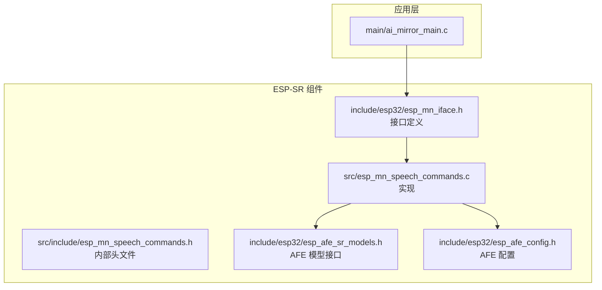
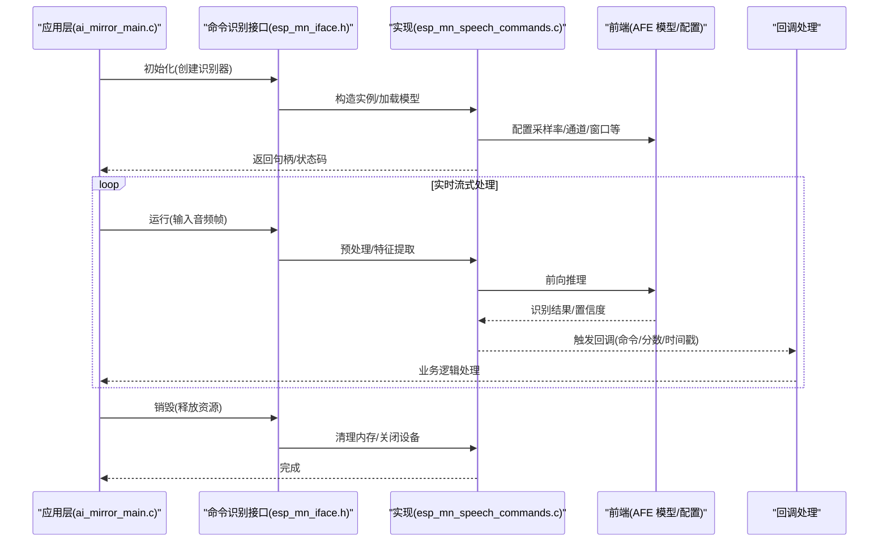
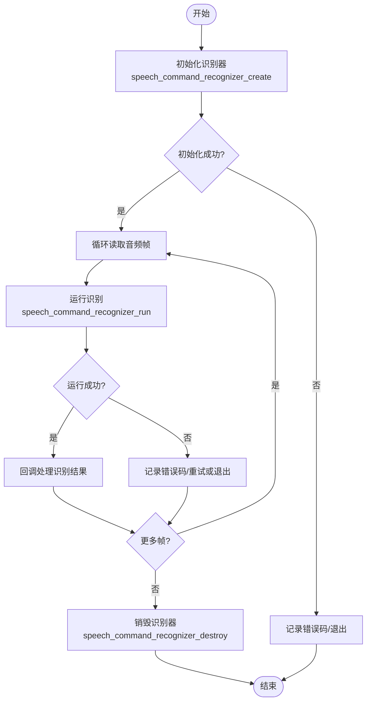
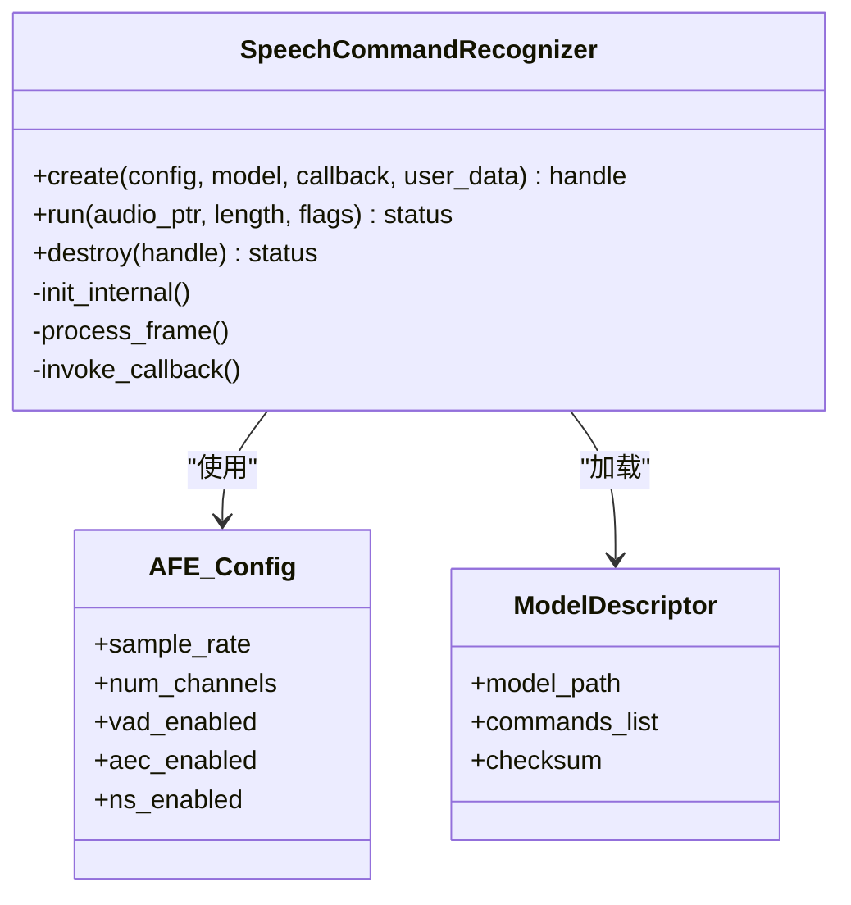
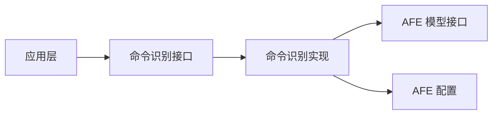

# 识别接口函数

<cite>
**本文引用的文件**   
- [esp_mn_iface.h](file://Firmware/esp32_ai_mirror/components/espressif__esp-sr/include/esp32/esp_mn_iface.h)
- [esp_mn_speech_commands.c](file://Firmware/esp32_ai_mirror/components/espressif__esp-sr/src/esp_mn_speech_commands.c)
- [esp_mn_speech_commands.h](file://Firmware/esp32_ai_mirror/components/espressif__esp-sr/src/include/esp_mn_speech_commands.h)
- [esp_afe_sr_models.h](file://Firmware/esp32_ai_mirror/components/espressif__esp-sr/include/esp32/esp_afe_sr_models.h)
- [esp_afe_config.h](file://Firmware/esp32_ai_mirror/components/espressif__esp-sr/include/esp32/esp_afe_config.h)
- [ai_mirror_main.c](file://Firmware/esp32_ai_mirror/main/ai_mirror_main.c)
</cite>

## 目录
1. [简介](#简介)
2. [项目结构](#项目结构)
3. [核心组件](#核心组件)
4. [架构总览](#架构总览)
5. [详细组件分析](#详细组件分析)
6. [依赖关系分析](#依赖关系分析)
7. [性能考量](#性能考量)
8. [故障排查指南](#故障排查指南)
9. [结论](#结论)
10. [附录](#附录)

## 简介
本文件面向在 ESP-SR（Espressif Speech Recognition）框架下使用语音命令识别的开发者，聚焦于“语音命令识别”接口的核心 API 与调用流程。文档围绕以下目标展开：
- 详细说明初始化、运行与销毁三类关键函数的职责、参数含义与返回值约定
- 解释音频数据格式、采样率配置与识别结果回调处理机制
- 提供从模型初始化到识别结果获取的完整调用示例（以步骤化说明为主）
- 梳理错误码与异常处理策略
- 给出多线程环境下的注意事项与性能优化建议

## 项目结构
本项目基于 ESP-IDF 工程组织，语音识别相关代码主要位于 esp-sr 组件中，应用层通过 main 模块集成并使用该能力。

图表来源
- [ai_mirror_main.c:1-200](file://Firmware/esp32_ai_mirror/main/ai_mirror_main.c#L1-L200)
- [esp_mn_iface.h:1-200](file://Firmware/esp32_ai_mirror/components/espressif__esp-sr/include/esp32/esp_mn_iface.h#L1-L200)
- [esp_mn_speech_commands.c:1-200](file://Firmware/esp32_ai_mirror/components/espressif__esp-sr/src/esp_mn_speech_commands.c#L1-L200)
- [esp_mn_speech_commands.h:1-200](file://Firmware/esp32_ai_mirror/components/espressif__esp-sr/src/include/esp_mn_speech_commands.h#L1-L200)
- [esp_afe_sr_models.h:1-200](file://Firmware/esp32_ai_mirror/components/espressif__esp-sr/include/esp32/esp_afe_sr_models.h#L1-L200)
- [esp_afe_config.h:1-200](file://Firmware/esp32_ai_mirror/components/espressif__esp-sr/include/esp32/esp_afe_config.h#L1-L200)

章节来源
- [ai_mirror_main.c:1-200](file://Firmware/esp32_ai_mirror/main/ai_mirror_main.c#L1-L200)
- [esp_mn_iface.h:1-200](file://Firmware/esp32_ai_mirror/components/espressif__esp-sr/include/esp32/esp_mn_iface.h#L1-L200)
- [esp_mn_speech_commands.c:1-200](file://Firmware/esp32_ai_mirror/components/espressif__esp-sr/src/esp_mn_speech_commands.c#L1-L200)
- [esp_mn_speech_commands.h:1-200](file://Firmware/esp32_ai_mirror/components/espressif__esp-sr/src/include/esp_mn_speech_commands.h#L1-L200)
- [esp_afe_sr_models.h:1-200](file://Firmware/esp32_ai_mirror/components/espressif__esp-sr/include/esp32/esp_afe_sr_models.h#L1-L200)
- [esp_afe_config.h:1-200](file://Firmware/esp32_ai_mirror/components/espressif__esp-sr/include/esp32/esp_afe_config.h#L1-L200)

## 核心组件
本节聚焦“语音命令识别”的核心 API 族，包括：
- 初始化类：用于创建并配置识别引擎实例（对应命名风格为 speech_command_recognizer_create）
- 运行类：用于输入音频帧并触发识别（对应命名风格为 speech_command_recognizer_run）
- 销毁类：用于释放资源（对应命名风格为 speech_command_recognizer_destroy）

这些函数通常由 esp-sr 组件暴露，并在应用层按生命周期管理。

章节来源
- [esp_mn_iface.h:1-200](file://Firmware/esp32_ai_mirror/components/espressif__esp-sr/include/esp32/esp_mn_iface.h#L1-L200)
- [esp_mn_speech_commands.c:1-200](file://Firmware/esp32_ai_mirror/components/espressif__esp-sr/src/esp_mn_speech_commands.c#L1-L200)
- [esp_mn_speech_commands.h:1-200](file://Firmware/esp32_ai_mirror/components/espressif__esp-sr/src/include/esp_mn_speech_commands.h#L1-L200)

## 架构总览
下图展示了从应用层到 AFE（Audio Front End）与识别模型的调用路径，以及识别结果的回调返回方式。

图表来源
- [ai_mirror_main.c:1-200](file://Firmware/esp32_ai_mirror/main/ai_mirror_main.c#L1-L200)
- [esp_mn_iface.h:1-200](file://Firmware/esp32_ai_mirror/components/espressif__esp-sr/include/esp32/esp_mn_iface.h#L1-L200)
- [esp_mn_speech_commands.c:1-200](file://Firmware/esp32_ai_mirror/components/espressif__esp-sr/src/esp_mn_speech_commands.c#L1-L200)
- [esp_afe_sr_models.h:1-200](file://Firmware/esp32_ai_mirror/components/espressif__esp-sr/include/esp32/esp_afe_sr_models.h#L1-L200)
- [esp_afe_config.h:1-200](file://Firmware/esp32_ai_mirror/components/espressif__esp-sr/include/esp32/esp_afe_config.h#L1-L200)

## 详细组件分析

### 初始化函数（speech_command_recognizer_create）
- 职责
  - 分配并初始化识别引擎上下文
  - 加载指定命令集与模型权重
  - 配置 AFE 参数（采样率、通道数、窗口长度、VAD/AEC/NS 等）
- 关键参数
  - 模型/命令集描述符或路径
  - AFE 配置结构体（采样率、麦克风通道、增益、降噪/回声消除开关等）
  - 回调函数指针（用于上报识别结果）
  - 用户私有数据指针（透传到回调）
- 返回值
  - 成功：返回非空句柄
  - 失败：返回 NULL 或错误码（需结合具体实现检查）
- 典型错误
  - 模型加载失败（路径不存在/校验失败）
  - 内存不足
  - 参数非法（如采样率不匹配、通道数为 0）
- 线程安全
  - 建议在单线程内完成初始化；若多线程，需在创建阶段加锁保护共享配置

章节来源
- [esp_mn_iface.h:1-200](file://Firmware/esp32_ai_mirror/components/espressif__esp-sr/include/esp32/esp_mn_iface.h#L1-L200)
- [esp_mn_speech_commands.c:1-200](file://Firmware/esp32_ai_mirror/components/espressif__esp-sr/src/esp_mn_speech_commands.c#L1-L200)
- [esp_afe_config.h:1-200](file://Firmware/esp32_ai_mirror/components/espressif__esp-sr/include/esp32/esp_afe_config.h#L1-L200)

### 运行函数（speech_command_recognizer_run）
- 职责
  - 接收音频帧（PCM 或其他格式），进行预处理与特征提取
  - 驱动识别模型推理，更新内部状态机
  - 当满足判定条件时，触发回调上报识别结果
- 关键参数
  - 音频数据指针与长度（字节数）
  - 采样率（应与初始化一致）
  - 可选标志位（如是否最后一帧、是否静音段等）
- 回调处理
  - 回调参数通常包含：命令索引/文本、置信度分数、时间戳、事件类型
  - 回调应在轻量线程或 ISR 外执行，避免阻塞音频采集
- 返回值
  - 成功：返回 0 或状态码
  - 失败：负值错误码（如输入长度不足、采样率不一致、内部状态非法）
- 典型错误
  - 输入缓冲区过小或越界
  - 采样率与初始化不一致
  - 未正确设置回调导致结果丢失

章节来源
- [esp_mn_iface.h:1-200](file://Firmware/esp32_ai_mirror/components/espressif__esp-sr/include/esp32/esp_mn_iface.h#L1-L200)
- [esp_mn_speech_commands.c:1-200](file://Firmware/esp32_ai_mirror/components/espressif__esp-sr/src/esp_mn_speech_commands.c#L1-L200)

### 销毁函数（speech_command_recognizer_destroy）
- 职责
  - 释放识别引擎占用的内存与句柄
  - 关闭 AFE 资源（I2S/ADC 等）
  - 重置内部状态机
- 关键参数
  - 识别器句柄
- 返回值
  - 成功：返回 0 或状态码
  - 失败：负值错误码（如句柄无效）
- 注意事项
  - 确保所有运行任务已停止后再销毁
  - 避免重复销毁同一句柄

章节来源
- [esp_mn_iface.h:1-200](file://Firmware/esp32_ai_mirror/components/espressif__esp-sr/include/esp32/esp_mn_iface.h#L1-L200)
- [esp_mn_speech_commands.c:1-200](file://Firmware/esp32_ai_mirror/components/espressif__esp-sr/src/esp_mn_speech_commands.c#L1-L200)

### 调用流程（从初始化到识别结果）

图表来源
- [ai_mirror_main.c:1-200](file://Firmware/esp32_ai_mirror/main/ai_mirror_main.c#L1-L200)
- [esp_mn_speech_commands.c:1-200](file://Firmware/esp32_ai_mirror/components/espressif__esp-sr/src/esp_mn_speech_commands.c#L1-L200)

章节来源
- [ai_mirror_main.c:1-200](file://Firmware/esp32_ai_mirror/main/ai_mirror_main.c#L1-L200)
- [esp_mn_speech_commands.c:1-200](file://Firmware/esp32_ai_mirror/components/espressif__esp-sr/src/esp_mn_speech_commands.c#L1-L200)

### 面向对象视角（类图）

图表来源
- [esp_mn_iface.h:1-200](file://Firmware/esp32_ai_mirror/components/espressif__esp-sr/include/esp32/esp_mn_iface.h#L1-L200)
- [esp_afe_config.h:1-200](file://Firmware/esp32_ai_mirror/components/espressif__esp-sr/include/esp32/esp_afe_config.h#L1-L200)

章节来源
- [esp_mn_iface.h:1-200](file://Firmware/esp32_ai_mirror/components/espressif__esp-sr/include/esp32/esp_mn_iface.h#L1-L200)
- [esp_afe_config.h:1-200](file://Firmware/esp32_ai_mirror/components/espressif__esp-sr/include/esp32/esp_afe_config.h#L1-L200)

## 依赖关系分析
- 应用层依赖 esp-sr 的命令识别接口
- 命令识别实现依赖 AFE 模型与配置
- 回调机制将识别结果回传至应用层进行处理

图表来源
- [ai_mirror_main.c:1-200](file://Firmware/esp32_ai_mirror/main/ai_mirror_main.c#L1-L200)
- [esp_mn_iface.h:1-200](file://Firmware/esp32_ai_mirror/components/espressif__esp-sr/include/esp32/esp_mn_iface.h#L1-L200)
- [esp_mn_speech_commands.c:1-200](file://Firmware/esp32_ai_mirror/components/espressif__esp-sr/src/esp_mn_speech_commands.c#L1-L200)
- [esp_afe_sr_models.h:1-200](file://Firmware/esp32_ai_mirror/components/espressif__esp-sr/include/esp32/esp_afe_sr_models.h#L1-L200)
- [esp_afe_config.h:1-200](file://Firmware/esp32_ai_mirror/components/espressif__esp-sr/include/esp32/esp_afe_config.h#L1-L200)

章节来源
- [esp_mn_speech_commands.c:1-200](file://Firmware/esp32_ai_mirror/components/espressif__esp-sr/src/esp_mn_speech_commands.c#L1-L200)
- [esp_afe_sr_models.h:1-200](file://Firmware/esp32_ai_mirror/components/espressif__esp-sr/include/esp32/esp_afe_sr_models.h#L1-L200)
- [esp_afe_config.h:1-200](file://Firmware/esp32_ai_mirror/components/espressif__esp-sr/include/esp32/esp_afe_config.h#L1-L200)

## 性能考量
- 音频帧大小与延迟
  - 合理选择帧长（如 10–20ms）以平衡延迟与稳定性
  - 避免过短帧导致频繁调用开销，过长帧增加端到端延迟
- 采样率与通道数
  - 保持与初始化一致，避免重采样带来的额外 CPU 消耗
  - 单通道通常足够，多通道需评估算力与功耗
- VAD/AEC/NS 开关
  - 根据场景开启必要的前端处理，减少误唤醒与噪声干扰
- 回调处理
  - 回调中避免阻塞操作（如网络 I/O、复杂计算），必要时入队异步处理
- 内存与缓存
  - 复用音频缓冲，减少频繁分配
  - 预加载模型与命令表，降低运行时开销
- 多线程
  - 音频采集线程与识别线程解耦，使用无锁队列或环形缓冲
  - 对共享配置加锁，避免竞态条件

[本节为通用指导，无需特定文件引用]

## 故障排查指南
- 初始化失败
  - 检查模型路径与权限
  - 确认 AFE 配置合法（采样率、通道数、增益范围）
  - 查看返回的错误码定位原因
- 运行失败
  - 核对输入音频长度与采样率
  - 检查回调是否被正确注册
  - 观察是否有越界访问或未初始化变量
- 识别结果异常
  - 调整阈值与滑动窗口参数
  - 检查环境噪声与回声，适当开启 NS/AEC
  - 验证命令集是否与模型匹配
- 资源泄漏
  - 确保在所有退出路径上调用销毁函数
  - 避免重复销毁或悬空指针

章节来源
- [esp_mn_speech_commands.c:1-200](file://Firmware/esp32_ai_mirror/components/espressif__esp-sr/src/esp_mn_speech_commands.c#L1-L200)
- [esp_mn_speech_commands.h:1-200](file://Firmware/esp32_ai_mirror/components/espressif__esp-sr/src/include/esp_mn_speech_commands.h#L1-L200)

## 结论
通过对 esp-sr 命令识别接口的系统梳理，明确了初始化、运行与销毁三类核心函数的职责与使用要点。结合 AFE 配置与回调机制，可实现稳定高效的语音命令识别。实际工程中应重视参数一致性、错误码处理与线程安全，以获得更好的性能与鲁棒性。

[本节为总结性内容，无需特定文件引用]

## 附录
- 常见参数对照
  - 采样率：通常为 16kHz（需与模型一致）
  - 通道数：单通道（mono）
  - 帧长：10–20ms 常用
  - 回调事件：命令命中、置信度、时间戳
- 参考路径
  - 接口定义：esp_mn_iface.h
  - 实现细节：esp_mn_speech_commands.c
  - 内部头文件：esp_mn_speech_commands.h
  - AFE 模型接口：esp_afe_sr_models.h
  - AFE 配置：esp_afe_config.h
  - 应用集成：ai_mirror_main.c

[本节为补充信息，无需特定文件引用]