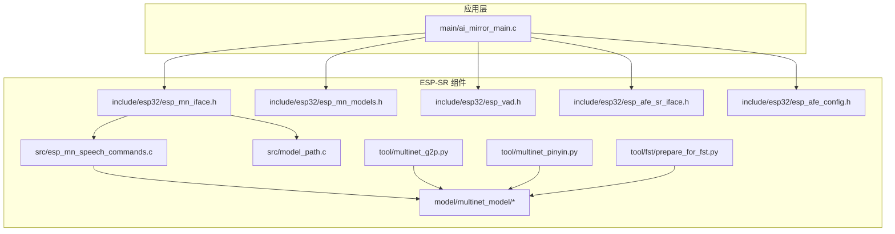
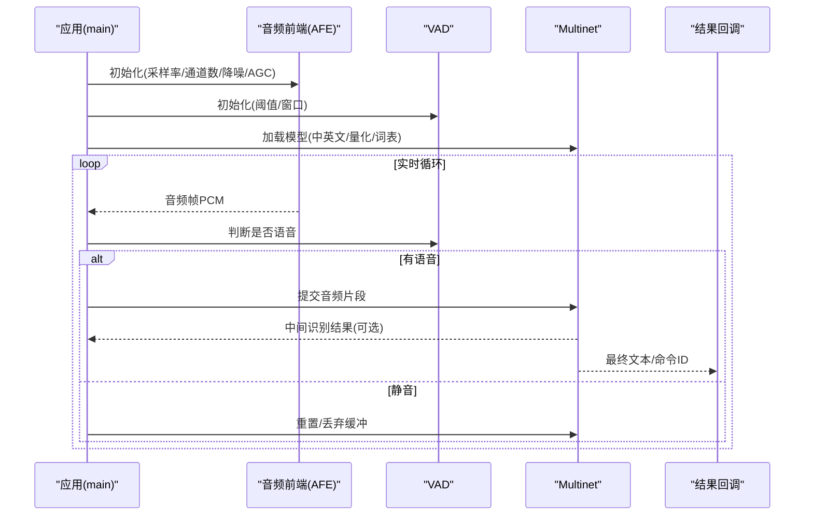
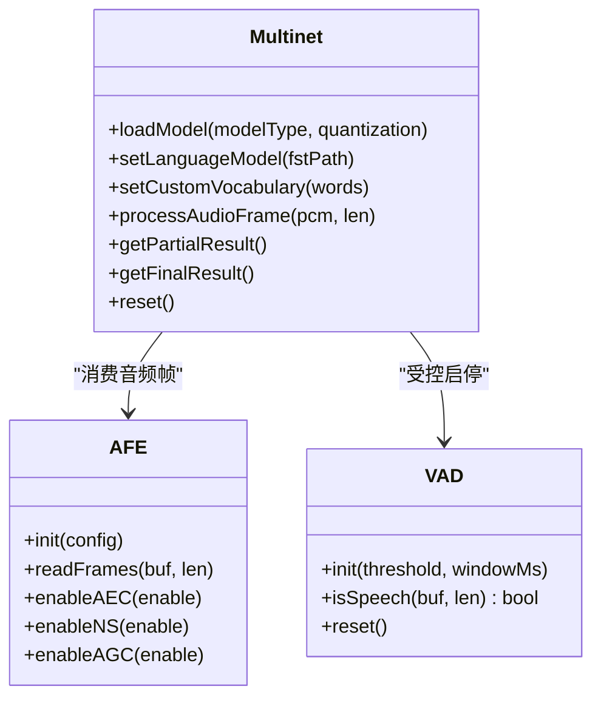
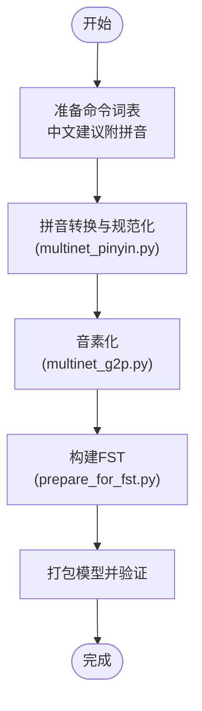
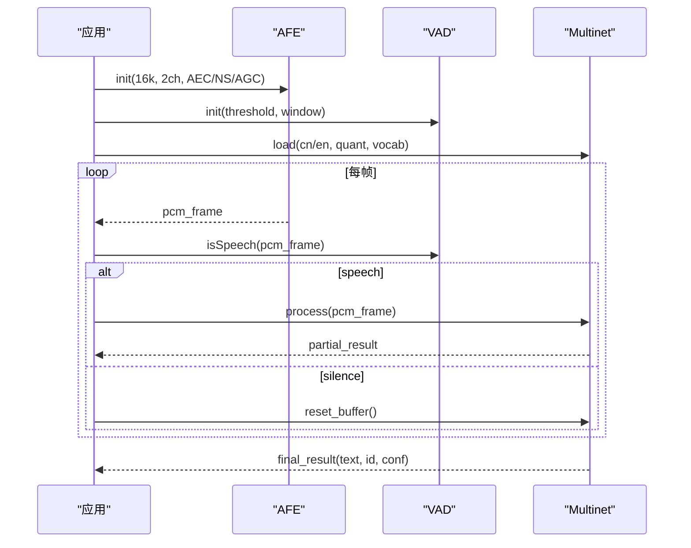
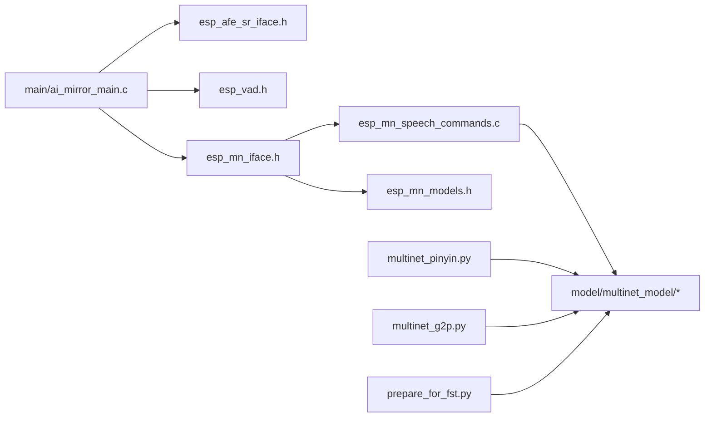

# 语音命令识别API

<cite>
**本文档引用的文件**   
- [esp_mn_iface.h](file://Firmware/esp32_ai_mirror/components/espressif__esp-sr/include/esp32/esp_mn_iface.h)
- [esp_mn_models.h](file://Firmware/esp32_ai_mirror/components/espressif__esp-sr/include/esp32/esp_mn_models.h)
- [esp_vad.h](file://Firmware/esp32_ai_mirror/components/espressif__esp-sr/include/esp32/esp_vad.h)
- [esp_afe_sr_iface.h](file://Firmware/esp32_ai_mirror/components/espressif__esp-sr/include/esp32/esp_afe_sr_iface.h)
- [esp_afe_config.h](file://Firmware/esp32_ai_mirror/components/espressif__esp-sr/include/esp32/esp_afe_config.h)
- [esp_mn_speech_commands.c](file://Firmware/esp32_ai_mirror/components/espressif__esp-sr/src/esp_mn_speech_commands.c)
- [model_path.c](file://Firmware/esp32_ai_mirror/components/espressif__esp-sr/src/model_path.c)
- [multinet_model.py](file://Firmware/esp32_ai_mirror/components/espressif__esp-sr/tool/multinet_g2p.py)
- [multinet_pinyin.py](file://Firmware/esp32_ai_mirror/components/espressif__esp-sr/tool/multinet_pinyin.py)
- [prepare_for_fst.py](file://Firmware/esp32_ai_mirror/components/espressif__esp-sr/tool/fst/prepare_for_fst.py)
- [CMakeLists.txt](file://Firmware/esp32_ai_mirror/components/espressif__esp-sr/CMakeLists.txt)
- [Kconfig.projbuild](file://Firmware/esp32_ai_mirror/components/espressif__esp-sr/Kconfig.projbuild)
- [ai_mirror_main.c](file://Firmware/esp32_ai_mirror/main/ai_mirror_main.c)
- [sdkconfig.defaults](file://Firmware/esp32_ai_mirror/sdkconfig.defaults)
</cite>

## 目录
1. [简介](#简介)
2. [项目结构](#项目结构)
3. [核心组件](#核心组件)
4. [架构总览](#架构总览)
5. [详细组件分析](#详细组件分析)
6. [依赖关系分析](#依赖关系分析)
7. [性能考量](#性能考量)
8. [故障排查指南](#故障排查指南)
9. [结论](#结论)
10. [附录](#附录)

## 简介
本文件面向使用 ESP-SR 的 Multinet 模型进行语音命令识别的开发者，提供完整的 API 文档与实现指南。内容涵盖：
- Multinet 模型的初始化、VAD（语音活动检测）配置、音频流处理与识别结果解析
- 中文与英文命令识别的配置差异
- 自定义词汇表构建方法（含拼音转换与 FST 构建）
- 声学模型选择、语言模型配置与识别精度优化策略
- 实时语音识别完整流程示例（音频采集、预处理、识别、回调）
- 多麦克风阵列支持与噪声环境下的优化策略

## 项目结构
ESP-SR 组件提供了 Multinet 命令识别所需的核心接口、模型与工具链，应用层通过 main 工程集成并驱动识别流程。关键目录与职责如下：
- include/esp32: 暴露给应用的 C 头文件，包含 Multinet、VAD、AFE（音频前端）等接口定义
- src: 核心实现，如命令列表管理、模型路径解析等
- model: 预训练 Multinet 模型包（中英文不同版本），以及打包脚本
- tool: 词汇表构建与 G2P/拼音转换、FST 生成工具
- main: 应用入口，负责初始化 AFE、Multinet、VAD，并驱动实时识别循环

图表来源
- [ai_mirror_main.c](file://Firmware/esp32_ai_mirror/main/ai_mirror_main.c)
- [esp_mn_iface.h](file://Firmware/esp32_ai_mirror/components/espressif__esp-sr/include/esp32/esp_mn_iface.h)
- [esp_mn_models.h](file://Firmware/esp32_ai_mirror/components/espressif__esp-sr/include/esp32/esp_mn_models.h)
- [esp_vad.h](file://Firmware/esp32_ai_mirror/components/espressif__esp-sr/include/esp32/esp_vad.h)
- [esp_afe_sr_iface.h](file://Firmware/esp32_ai_mirror/components/espressif__esp-sr/include/esp32/esp_afe_sr_iface.h)
- [esp_afe_config.h](file://Firmware/esp32_ai_mirror/components/espressif__esp-sr/include/esp32/esp_afe_config.h)
- [esp_mn_speech_commands.c](file://Firmware/esp32_ai_mirror/components/espressif__esp-sr/src/esp_mn_speech_commands.c)
- [model_path.c](file://Firmware/esp32_ai_mirror/components/espressif__esp-sr/src/model_path.c)
- [multinet_g2p.py](file://Firmware/esp32_ai_mirror/components/espressif__esp-sr/tool/multinet_g2p.py)
- [multinet_pinyin.py](file://Firmware/esp32_ai_mirror/components/espressif__esp-sr/tool/multinet_pinyin.py)
- [prepare_for_fst.py](file://Firmware/esp32_ai_mirror/components/espressif__esp-sr/tool/fst/prepare_for_fst.py)

章节来源
- [CMakeLists.txt](file://Firmware/esp32_ai_mirror/components/espressif__esp-sr/CMakeLists.txt)
- [Kconfig.projbuild](file://Firmware/esp32_ai_mirror/components/espressif__esp-sr/Kconfig.projbuild)
- [sdkconfig.defaults](file://Firmware/esp32_ai_mirror/sdkconfig.defaults)

## 核心组件
- Multinet 接口层（esp_mn_iface.h）
  - 提供模型加载、配置、推理与结果解析的统一 API
  - 支持中英文模型切换、热词/自定义词表注入、增量识别与分段输出
- 模型清单（esp_mn_models.h）
  - 声明可用的 Multinet 模型标识与元数据（语言、量化格式、内存占用等）
- VAD（esp_vad.h）
  - 语音活动检测，用于静音段裁剪、唤醒触发与资源节省
- 音频前端（esp_afe_sr_iface.h, esp_afe_config.h）
  - 统一 AEC/NS/AGC/beamforming 等前处理接口与配置结构
  - 支持单麦与多麦阵列（例如 2/4 麦）
- 命令管理与路径（esp_mn_speech_commands.c, model_path.c）
  - 命令集管理、模型路径解析、编译期/运行期模型选择

章节来源
- [esp_mn_iface.h](file://Firmware/esp32_ai_mirror/components/espressif__esp-sr/include/esp32/esp_mn_iface.h)
- [esp_mn_models.h](file://Firmware/esp32_ai_mirror/components/espressif__esp-sr/include/esp32/esp_mn_models.h)
- [esp_vad.h](file://Firmware/esp32_ai_mirror/components/espressif__esp-sr/include/esp32/esp_vad.h)
- [esp_afe_sr_iface.h](file://Firmware/esp32_ai_mirror/components/espressif__esp-sr/include/esp32/esp_afe_sr_iface.h)
- [esp_afe_config.h](file://Firmware/esp32_ai_mirror/components/espressif__esp-sr/include/esp32/esp_afe_config.h)
- [esp_mn_speech_commands.c](file://Firmware/esp32_ai_mirror/components/espressif__esp-sr/src/esp_mn_speech_commands.c)
- [model_path.c](file://Firmware/esp32_ai_mirror/components/espressif__esp-sr/src/model_path.c)

## 架构总览
下图展示了从音频采集到识别结果回调的端到端流程，包括 AFE 前处理、VAD 控制、Multinet 推理与结果解析。

图表来源
- [ai_mirror_main.c](file://Firmware/esp32_ai_mirror/main/ai_mirror_main.c)
- [esp_afe_sr_iface.h](file://Firmware/esp32_ai_mirror/components/espressif__esp-sr/include/esp32/esp_afe_sr_iface.h)
- [esp_vad.h](file://Firmware/esp32_ai_mirror/components/espressif__esp-sr/include/esp32/esp_vad.h)
- [esp_mn_iface.h](file://Firmware/esp32_ai_mirror/components/espressif__esp-sr/include/esp32/esp_mn_iface.h)

## 详细组件分析

### Multinet 模型接口与生命周期
- 初始化与加载
  - 选择模型类型（中文/英文）、量化格式（如 q8/q16）、内存布局
  - 加载模型权重与语言模型（FST/词典）
  - 设置识别模式（离线/在线、增量/整句）
- 音频输入与推理
  - 将 PCM 帧按固定步长送入模型
  - 内部特征提取（MFCC/滤波器组）与解码
- 结果解析
  - 返回文本、命令 ID、置信度、时间戳
  - 支持部分结果回调与最终结果回调

图表来源
- [esp_mn_iface.h](file://Firmware/esp32_ai_mirror/components/espressif__esp-sr/include/esp32/esp_mn_iface.h)
- [esp_afe_sr_iface.h](file://Firmware/esp32_ai_mirror/components/espressif__esp-sr/include/esp32/esp_afe_sr_iface.h)
- [esp_vad.h](file://Firmware/esp32_ai_mirror/components/espressif__esp-sr/include/esp32/esp_vad.h)

章节来源
- [esp_mn_iface.h](file://Firmware/esp32_ai_mirror/components/espressif__esp-sr/include/esp32/esp_mn_iface.h)
- [esp_mn_models.h](file://Firmware/esp32_ai_mirror/components/espressif__esp-sr/include/esp32/esp_mn_models.h)

### VAD 配置与语音活动检测
- 参数要点
  - 阈值（能量/谱熵/深度模型）
  - 窗口长度（ms）
  - 滞后与去抖（避免抖动触发）
- 工作模式
  - 连续检测：每帧判定
  - 事件检测：语音开始/结束事件
- 与 Multinet 协作
  - 仅在检测到语音时喂入模型，降低功耗与误识
  - 语音结束时触发最终结果回调

章节来源
- [esp_vad.h](file://Firmware/esp32_ai_mirror/components/espressif__esp-sr/include/esp32/esp_vad.h)

### 音频前端（AFE）与多麦克风阵列
- 功能模块
  - AEC（回声消除）
  - NS（噪声抑制）
  - AGC（自动增益）
  - Beamforming（波束成形，多麦）
- 配置项
  - 采样率（通常 16kHz）
  - 通道数（1/2/4）
  - 各模块开关与强度
- 多麦阵列
  - 2 麦/4 麦线性或环形阵列
  - 指向性增强与远场拾音

章节来源
- [esp_afe_sr_iface.h](file://Firmware/esp32_ai_mirror/components/espressif__esp-sr/include/esp32/esp_afe_sr_iface.h)
- [esp_afe_config.h](file://Firmware/esp32_ai_mirror/components/espressif__esp-sr/include/esp32/esp_afe_config.h)

### 中文与英文命令识别配置差异
- 模型选择
  - 中文模型：mn*_cn（如 mn4_cn、mn5q8_cn、mn6_cn）
  - 英文模型：mn*_en（如 mn5q8_en、mn6_en）
- 语言模型
  - 中文：基于拼音/字符的 FST，需 G2P 与拼音映射
  - 英文：基于单词/子词的 FST
- 词表构建
  - 中文：建议以“词语+拼音”形式构建，便于分词与纠错
  - 英文：直接以单词或子词为单位

章节来源
- [esp_mn_models.h](file://Firmware/esp32_ai_mirror/components/espressif__esp-sr/include/esp32/esp_mn_models.h)
- [multinet_pinyin.py](file://Firmware/esp32_ai_mirror/components/espressif__esp-sr/tool/multinet_pinyin.py)
- [multinet_g2p.py](file://Firmware/esp32_ai_mirror/components/espressif__esp-sr/tool/multinet_g2p.py)
- [prepare_for_fst.py](file://Firmware/esp32_ai_mirror/components/espressif__esp-sr/tool/fst/prepare_for_fst.py)

### 自定义词汇表构建方法
- 步骤概览
  - 准备命令词表（中文建议附带拼音）
  - 使用 multinet_pinyin.py 进行拼音转换与规范化
  - 使用 multinet_g2p.py 生成音素序列
  - 使用 prepare_for_fst.py 构建 FST（语言模型）
  - 打包模型并烧录
- 注意事项
  - 同音词消歧（结合上下文与权重）
  - 专有名词与缩写处理
  - 词频与权重调优以提升准确率

图表来源
- [multinet_pinyin.py](file://Firmware/esp32_ai_mirror/components/espressif__esp-sr/tool/multinet_pinyin.py)
- [multinet_g2p.py](file://Firmware/esp32_ai_mirror/components/espressif__esp-sr/tool/multinet_g2p.py)
- [prepare_for_fst.py](file://Firmware/esp32_ai_mirror/components/espressif__esp-sr/tool/fst/prepare_for_fst.py)

章节来源
- [multinet_pinyin.py](file://Firmware/esp32_ai_mirror/components/espressif__esp-sr/tool/multinet_pinyin.py)
- [multinet_g2p.py](file://Firmware/esp32_ai_mirror/components/espressif__esp-sr/tool/multinet_g2p.py)
- [prepare_for_fst.py](file://Firmware/esp32_ai_mirror/components/espressif__esp-sr/tool/fst/prepare_for_fst.py)

### 实时语音识别完整实现示例
- 流程说明
  - 初始化 AFE（采样率、通道数、降噪、AGC）
  - 初始化 VAD（阈值、窗口）
  - 加载 Multinet 模型（中英文、量化、词表）
  - 主循环：读取音频帧 → VAD 判定 → 送入 Multinet → 回调结果
- 关键点
  - 音频帧大小与步长匹配模型期望
  - VAD 事件驱动减少无效推理
  - 增量识别与最终结果分离处理

图表来源
- [ai_mirror_main.c](file://Firmware/esp32_ai_mirror/main/ai_mirror_main.c)
- [esp_afe_sr_iface.h](file://Firmware/esp32_ai_mirror/components/espressif__esp-sr/include/esp32/esp_afe_sr_iface.h)
- [esp_vad.h](file://Firmware/esp32_ai_mirror/components/espressif__esp-sr/include/esp32/esp_vad.h)
- [esp_mn_iface.h](file://Firmware/esp32_ai_mirror/components/espressif__esp-sr/include/esp32/esp_mn_iface.h)

章节来源
- [ai_mirror_main.c](file://Firmware/esp32_ai_mirror/main/ai_mirror_main.c)

### 声学模型选择与语言模型配置
- 声学模型
  - 根据设备资源选择量化等级（q8 更省内存，q16 更高精度）
  - 根据场景选择模型版本（mn4/mn5/mn6，越大越准但更耗资源）
- 语言模型
  - 中文：拼音→音素→FST；英文：词/子词→FST
  - 词表规模与权重影响速度与准确率
- 配置项
  - 解码器搜索宽度、超时、回退策略

章节来源
- [esp_mn_models.h](file://Firmware/esp32_ai_mirror/components/espressif__esp-sr/include/esp32/esp_mn_models.h)
- [prepare_for_fst.py](file://Firmware/esp32_ai_mirror/components/espressif__esp-sr/tool/fst/prepare_for_fst.py)

### 识别精度优化技术指南
- 音频质量
  - 合理设置 AEC/NS/AGC，避免削峰与底噪过大
  - 多麦阵列提升远场拾音与抗噪能力
- 模型与词表
  - 精简且高频优先的词表
  - 同音词消歧与上下文约束
- 运行时
  - 动态调整 VAD 阈值与环境自适应
  - 增量识别与滑动窗口平滑

章节来源
- [esp_afe_sr_iface.h](file://Firmware/esp32_ai_mirror/components/espressif__esp-sr/include/esp32/esp_afe_sr_iface.h)
- [esp_vad.h](file://Firmware/esp32_ai_mirror/components/espressif__esp-sr/include/esp32/esp_vad.h)
- [esp_mn_models.h](file://Firmware/esp32_ai_mirror/components/espressif__esp-sr/include/esp32/esp_mn_models.h)

## 依赖关系分析
- 组件耦合
  - 应用依赖 AFE/VAD/Multinet 接口
  - Multinet 依赖模型包与语言模型（FST）
  - 工具链依赖 Python 环境与依赖库
- 外部依赖
  - IDF 组件系统（CMake/Kconfig）
  - 音频驱动（I2S/Codec）

图表来源
- [ai_mirror_main.c](file://Firmware/esp32_ai_mirror/main/ai_mirror_main.c)
- [esp_afe_sr_iface.h](file://Firmware/esp32_ai_mirror/components/espressif__esp-sr/include/esp32/esp_afe_sr_iface.h)
- [esp_vad.h](file://Firmware/esp32_ai_mirror/components/espressif__esp-sr/include/esp32/esp_vad.h)
- [esp_mn_iface.h](file://Firmware/esp32_ai_mirror/components/espressif__esp-sr/include/esp32/esp_mn_iface.h)
- [esp_mn_speech_commands.c](file://Firmware/esp32_ai_mirror/components/espressif__esp-sr/src/esp_mn_speech_commands.c)
- [esp_mn_models.h](file://Firmware/esp32_ai_mirror/components/espressif__esp-sr/include/esp32/esp_mn_models.h)
- [multinet_pinyin.py](file://Firmware/esp32_ai_mirror/components/espressif__esp-sr/tool/multinet_pinyin.py)
- [multinet_g2p.py](file://Firmware/esp32_ai_mirror/components/espressif__esp-sr/tool/multinet_g2p.py)
- [prepare_for_fst.py](file://Firmware/esp32_ai_mirror/components/espressif__esp-sr/tool/fst/prepare_for_fst.py)

章节来源
- [CMakeLists.txt](file://Firmware/esp32_ai_mirror/components/espressif__esp-sr/CMakeLists.txt)
- [Kconfig.projbuild](file://Firmware/esp32_ai_mirror/components/espressif__esp-sr/Kconfig.projbuild)

## 性能考量
- 内存与算力
  - 量化等级（q8 vs q16）对内存与精度的权衡
  - 模型版本（mn4/mn5/mn6）随复杂度提升
- 实时性
  - 帧大小与步长匹配，避免阻塞
  - VAD 事件驱动减少无效推理
- 音频前处理
  - AEC/NS/AGC 参数调优，避免过度处理导致失真
- 多麦阵列
  - 波束成形提升信噪比，但增加计算量

[本节为通用指导，不直接分析具体文件]

## 故障排查指南
- 常见问题
  - 无法加载模型：检查模型路径与权限
  - 识别结果为空：检查 VAD 阈值与音频输入
  - 中文识别错误率高：检查拼音映射与 FST 构建
  - 延迟过高：检查帧大小、模型量化与 CPU 负载
- 调试建议
  - 打印 AFE 状态与 VAD 事件
  - 保存原始音频与中间特征进行离线分析
  - 逐步关闭 AEC/NS/AGC 定位问题

章节来源
- [model_path.c](file://Firmware/esp32_ai_mirror/components/espressif__esp-sr/src/model_path.c)
- [esp_mn_speech_commands.c](file://Firmware/esp32_ai_mirror/components/espressif__esp-sr/src/esp_mn_speech_commands.c)

## 结论
本指南围绕 ESP-SR 的 Multinet 模型，系统化阐述了从接口调用、VAD 配置、音频前处理到识别结果解析的全流程，并结合中文与英文的差异给出了词表构建与精度优化方案。通过合理的模型选择、参数调优与多麦阵列支持，可在资源受限设备上实现稳定高效的实时语音命令识别。

[本节为总结性内容，不直接分析具体文件]

## 附录
- 参考文件
  - 接口与模型定义：esp_mn_iface.h、esp_mn_models.h、esp_vad.h、esp_afe_sr_iface.h、esp_afe_config.h
  - 核心实现：esp_mn_speech_commands.c、model_path.c
  - 工具链：multinet_pinyin.py、multinet_g2p.py、prepare_for_fst.py
  - 应用入口：ai_mirror_main.c
  - 构建配置：CMakeLists.txt、Kconfig.projbuild、sdkconfig.defaults

[本节为索引性内容，不直接分析具体文件]