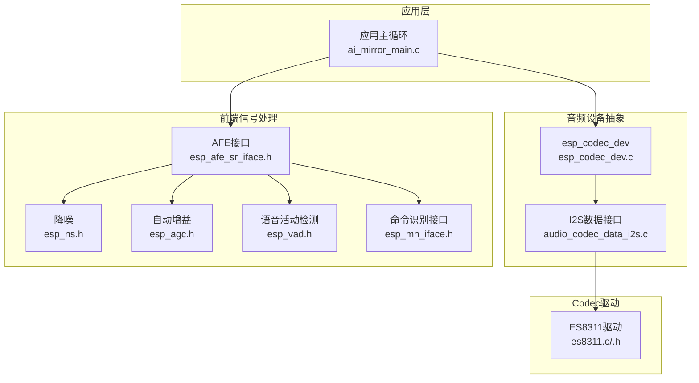
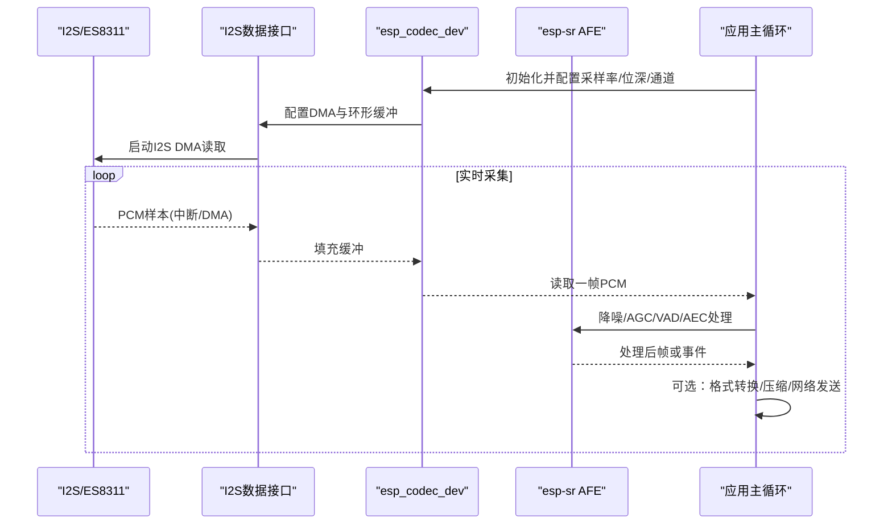
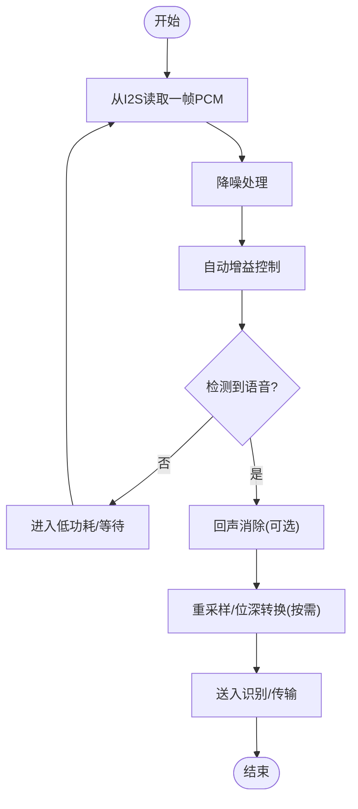
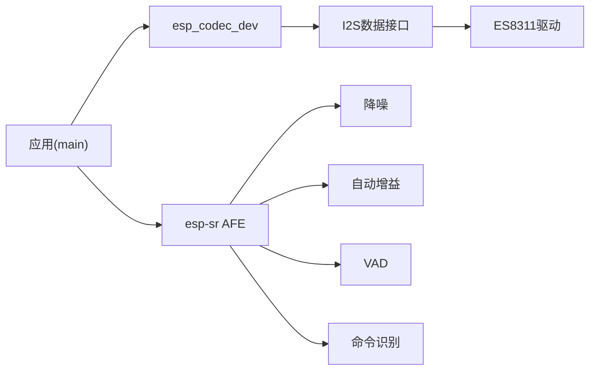

# 音频流处理

<cite>
**本文引用的文件**   
- [ai_mirror_main.c](file://Firmware/esp32_ai_mirror/main/ai_mirror_main.c)
- [ai_mirror_config.h](file://Firmware/esp32_ai_mirror/main/ai_mirror_config.h)
- [es8311.c](file://Firmware/esp32_ai_mirror/managed_components/espressif__es8311/es8311.c)
- [es8311.h](file://Firmware/esp32_ai_mirror/managed_components/espressif__es8311/include/es8311.h)
- [audio_codec_data_i2s.c](file://Firmware/esp32_ai_mirror/managed_components/espressif__esp_codec_dev/platform/audio_codec_data_i2s.c)
- [esp_codec_dev.c](file://Firmware/esp32_ai_mirror/managed_components/espressif__esp_codec_dev/esp_codec_dev.c)
- [esp_afe_sr_iface.h](file://Firmware/esp32_ai_mirror/components/espressif__esp-sr/include/esp_afe_sr_iface.h)
- [esp_afe_config.h](file://Firmware/esp32_ai_mirror/components/espressif__esp-sr/include/esp_afe_config.h)
- [esp_ns.h](file://Firmware/esp32_ai_mirror/components/espressif__esp-sr/include/esp_ns.h)
- [esp_agc.h](file://Firmware/esp32_ai_mirror/components/espressif__esp-sr/include/esp_agc.h)
- [esp_vad.h](file://Firmware/esp32_ai_mirror/components/espressif__esp-sr/include/esp_vad.h)
- [esp_mn_iface.h](file://Firmware/esp32_ai_mirror/components/espressif__esp-sr/include/esp_mn_iface.h)
- [esp_mn_models.h](file://Firmware/esp32_ai_mirror/components/espressif__esp-sr/include/esp_mn_models.h)
- [CMakeLists.txt](file://Firmware/esp32_ai_mirror/CMakeLists.txt)
- [sdkconfig.defaults](file://Firmware/esp32_ai_mirror/sdkconfig.defaults)
</cite>

## 目录
1. [简介](#简介)
2. [项目结构](#项目结构)
3. [核心组件](#核心组件)
4. [架构总览](#架构总览)
5. [详细组件分析](#详细组件分析)
6. [依赖关系分析](#依赖关系分析)
7. [性能考量](#性能考量)
8. [故障排查指南](#故障排查指南)
9. [结论](#结论)
10. [附录：完整示例与最佳实践](#附录完整示例与最佳实践)

## 简介
本文件面向ESP32 AI镜像项目的音频子系统，系统性阐述实时音频采集、I2S接口配置、缓冲管理与数据传输机制，以及预处理（降噪、自动增益控制、语音活动检测）与多麦克风阵列同步和波束成形。文档同时给出内存管理、缓冲区大小选择与延迟优化的最佳实践，并提供可落地的代码组织与调用流程指引。

## 项目结构
本项目采用分层设计：硬件抽象层（I2S与Codec驱动）、音频编解码设备抽象（esp_codec_dev）、前端信号处理（esp-sr AFE）、应用主循环（main）。关键路径如下：
- I2S数据通路：由esp_codec_dev的I2S数据接口实现，向上暴露统一API。
- Codec驱动：ES8311通过I2C寄存器配置采样率、位深、通道等参数。
- 前端处理：esp-sr提供降噪、AGC、VAD、AEC及多麦克风模型接口。
- 应用入口：main负责初始化各模块、调度任务与数据流。

图表来源
- [ai_mirror_main.c](file://Firmware/esp32_ai_mirror/main/ai_mirror_main.c)
- [esp_codec_dev.c](file://Firmware/esp32_ai_mirror/managed_components/espressif__esp_codec_dev/esp_codec_dev.c)
- [audio_codec_data_i2s.c](file://Firmware/esp32_ai_mirror/managed_components/espressif__esp_codec_dev/platform/audio_codec_data_i2s.c)
- [es8311.c](file://Firmware/esp32_ai_mirror/managed_components/espressif__es8311/es8311.c)
- [esp_afe_sr_iface.h](file://Firmware/esp32_ai_mirror/components/espressif__esp-sr/include/esp_afe_sr_iface.h)
- [esp_ns.h](file://Firmware/esp32_ai_mirror/components/espressif__esp-sr/include/esp_ns.h)
- [esp_agc.h](file://Firmware/esp32_ai_mirror/components/espressif__esp-sr/include/esp_agc.h)
- [esp_vad.h](file://Firmware/esp32_ai_mirror/components/espressif__esp-sr/include/esp_vad.h)
- [esp_mn_iface.h](file://Firmware/esp32_ai_mirror/components/espressif__esp-sr/include/esp_mn_iface.h)

章节来源
- [CMakeLists.txt](file://Firmware/esp32_ai_mirror/CMakeLists.txt)
- [sdkconfig.defaults](file://Firmware/esp32_ai_mirror/sdkconfig.defaults)

## 核心组件
- I2S数据接口与缓冲：通过esp_codec_dev的I2S数据接口完成DMA传输与环形缓冲，屏蔽底层中断细节，提供读/写API。
- Codec配置：ES8311驱动负责I2C寄存器编程，设置采样率、位深度、通道数、输入源与音量等。
- 前端信号处理：esp-sr AFE提供降噪、AGC、VAD、AEC与多麦克风模型，支持单/多通道输入与输出格式转换。
- 应用集成：main中初始化并协调上述模块，形成“采集→预处理→识别/传输”的流水线。

章节来源
- [audio_codec_data_i2s.c](file://Firmware/esp32_ai_mirror/managed_components/espressif__esp_codec_dev/platform/audio_codec_data_i2s.c)
- [es8311.c](file://Firmware/esp32_ai_mirror/managed_components/espressif__es8311/es8311.c)
- [esp_codec_dev.c](file://Firmware/esp32_ai_mirror/managed_components/espressif__esp_codec_dev/esp_codec_dev.c)
- [esp_afe_sr_iface.h](file://Firmware/esp32_ai_mirror/components/espressif__esp-sr/include/esp_afe_sr_iface.h)

## 架构总览
下图展示从I2S到应用层的端到端数据流，包括预处理与识别链路。

图表来源
- [audio_codec_data_i2s.c](file://Firmware/esp32_ai_mirror/managed_components/espressif__esp_codec_dev/platform/audio_codec_data_i2s.c)
- [esp_codec_dev.c](file://Firmware/esp32_ai_mirror/managed_components/espressif__esp_codec_dev/esp_codec_dev.c)
- [esp_afe_sr_iface.h](file://Firmware/esp32_ai_mirror/components/espressif__esp-sr/include/esp_afe_sr_iface.h)

## 详细组件分析

### I2S与ES8311配置（采样率、位深、通道）
- 采样率：通常设置为16kHz用于语音识别；可通过SDK配置项或运行时API调整。
- 位深度：常用16bit；需与AFE期望输入一致。
- 通道数：单麦为1ch，多麦阵列可为2ch及以上；需与AFE模型匹配。
- 输入源：选择MIC或LINE IN；ES8311内部PGA与滤波器需合理配置。
- 时钟与相位：I2S的BCLK/LRCK/MCLK需与Codec对齐，避免抖动与错位。

章节来源
- [es8311.c](file://Firmware/esp32_ai_mirror/managed_components/espressif__es8311/es8311.c)
- [es8311.h](file://Firmware/esp32_ai_mirror/managed_components/espressif__es8311/include/es8311.h)
- [sdkconfig.defaults](file://Firmware/esp32_ai_mirror/sdkconfig.defaults)

### 缓冲管理与数据传输
- 环形缓冲：I2S数据接口使用DMA+环形缓冲，降低CPU占用与丢帧风险。
- 帧大小：建议按20ms~40ms为一帧（16kHz/16bit单声道约320~640字节），兼顾延迟与处理开销。
- 背压策略：当上层处理慢于采集时，丢弃旧帧或暂停采集，避免溢出。
- 零拷贝：尽量在AFE与识别之间传递指针，减少内存复制。

章节来源
- [audio_codec_data_i2s.c](file://Firmware/esp32_ai_mirror/managed_components/espressif__esp_codec_dev/platform/audio_codec_data_i2s.c)
- [esp_codec_dev.c](file://Firmware/esp32_ai_mirror/managed_components/espressif__esp_codec_dev/esp_codec_dev.c)

### 音频预处理流程（降噪、增益、格式转换）
- 降噪（NS）：抑制稳态噪声，提升信噪比。
- 自动增益（AGC）：动态调整增益，保持语音幅度稳定。
- 语音活动检测（VAD）：快速判断是否有人声，触发后续识别。
- 回声消除（AEC）：在有播放场景下消除扬声器回声。
- 格式转换：将不同采样率/位深/通道数转换为AFE期望格式。

图表来源
- [esp_ns.h](file://Firmware/esp32_ai_mirror/components/espressif__esp-sr/include/esp_ns.h)
- [esp_agc.h](file://Firmware/esp32_ai_mirror/components/espressif__esp-sr/include/esp_agc.h)
- [esp_vad.h](file://Firmware/esp32_ai_mirror/components/espressif__esp-sr/include/esp_vad.h)
- [esp_afe_sr_iface.h](file://Firmware/esp32_ai_mirror/components/espressif__esp-sr/include/esp_afe_sr_iface.h)

章节来源
- [esp_ns.h](file://Firmware/esp32_ai_mirror/components/espressif__esp-sr/include/esp_ns.h)
- [esp_agc.h](file://Firmware/esp32_ai_mirror/components/espressif__esp-sr/include/esp_agc.h)
- [esp_vad.h](file://Firmware/esp32_ai_mirror/components/espressif__esp-sr/include/esp_vad.h)
- [esp_afe_sr_iface.h](file://Firmware/esp32_ai_mirror/components/espressif__esp-sr/include/esp_afe_sr_iface.h)

### 多麦克风阵列同步与波束成形
- 同步采集：确保各Mic通道时钟同源、相位一致，避免时间漂移。
- 通道映射：明确每通道对应物理Mic位置，便于算法权重计算。
- 波束成形：根据麦克风几何布局估计声源方向，增强目标方向信号。
- 模型选择：使用esp-sr的多麦克风模型与接口进行联合处理。

章节来源
- [esp_afe_sr_iface.h](file://Firmware/esp32_ai_mirror/components/espressif__esp-sr/include/esp_afe_sr_iface.h)
- [esp_afe_config.h](file://Firmware/esp32_ai_mirror/components/espressif__esp-sr/include/esp_afe_config.h)

### 识别与命令解析
- 命令识别接口：通过esp_mn_iface加载模型并执行推理。
- 模型管理：使用esp_mn_models管理模型生命周期与内存。
- 输出处理：将识别结果映射到业务动作（如控制UI、网络指令）。

章节来源
- [esp_mn_iface.h](file://Firmware/esp32_ai_mirror/components/espressif__esp-sr/include/esp_mn_iface.h)
- [esp_mn_models.h](file://Firmware/esp32_ai_mirror/components/espressif__esp-sr/include/esp_mn_models.h)

## 依赖关系分析
- 应用层依赖esp_codec_dev与esp-sr AFE。
- esp_codec_dev依赖I2S数据接口与具体Codec驱动（ES8311）。
- AFE依赖NS/AGC/VAD等子模块与多麦克风模型。

图表来源
- [ai_mirror_main.c](file://Firmware/esp32_ai_mirror/main/ai_mirror_main.c)
- [esp_codec_dev.c](file://Firmware/esp32_ai_mirror/managed_components/espressif__esp_codec_dev/esp_codec_dev.c)
- [audio_codec_data_i2s.c](file://Firmware/esp32_ai_mirror/managed_components/espressif__esp_codec_dev/platform/audio_codec_data_i2s.c)
- [es8311.c](file://Firmware/esp32_ai_mirror/managed_components/espressif__es8311/es8311.c)
- [esp_afe_sr_iface.h](file://Firmware/esp32_ai_mirror/components/espressif__esp-sr/include/esp_afe_sr_iface.h)

章节来源
- [CMakeLists.txt](file://Firmware/esp32_ai_mirror/CMakeLists.txt)

## 性能考量
- 内存管理
  - 预分配固定大小的环形缓冲，避免频繁malloc/free。
  - 使用双缓冲或乒乓缓冲降低抖动。
  - 释放不用的模型或关闭未使用的预处理模块以节省RAM。
- 缓冲区大小
  - 单帧20~40ms平衡延迟与稳定性；大缓冲降低CPU峰值但增加延迟。
  - 多通道时注意每通道独立缓冲与对齐。
- 延迟优化
  - 最小化数据复制，优先指针传递。
  - 将耗时操作（如FFT/滤波）放在独立任务，避免阻塞采集。
  - 合理设置I2S DMA长度与中断优先级。
- 功耗与热
  - 无语音时进入低功耗模式，周期性唤醒。
  - 限制DSP运算强度，必要时降采样率。

[本节为通用指导，无需特定文件引用]

## 故障排查指南
- 无声或杂音
  - 检查I2S时钟与相位、ES8311输入源与增益。
  - 确认采样率/位深/通道数与AFE一致。
- 卡顿或断音
  - 增大I2S缓冲或降低处理复杂度。
  - 检查任务优先级与CPU占用。
- 识别率低
  - 开启VAD与降噪，确保环境噪声可控。
  - 校准多麦克风阵列几何与相位。
- 内存不足
  - 减少模型数量或切换量化模型。
  - 合并缓冲与复用内存池。

章节来源
- [es8311.c](file://Firmware/esp32_ai_mirror/managed_components/espressif__es8311/es8311.c)
- [audio_codec_data_i2s.c](file://Firmware/esp32_ai_mirror/managed_components/espressif__esp_codec_dev/platform/audio_codec_data_i2s.c)
- [esp_afe_sr_iface.h](file://Firmware/esp32_ai_mirror/components/espressif__esp-sr/include/esp_afe_sr_iface.h)

## 结论
本项目通过esp_codec_dev与esp-sr AFE构建了完整的音频采集与处理链路。I2S与ES8311负责稳定的数据采集，AFE提供降噪、AGC、VAD与多麦克风处理能力，结合合理的缓冲与任务调度，可实现低延迟、高鲁棒的语音交互体验。实际部署中应依据硬件与环境调优参数，并在内存与延迟间取得平衡。

[本节为总结性内容，无需特定文件引用]

## 附录：完整示例与最佳实践
- 初始化顺序
  - 先初始化I2S与ES8311，再初始化esp_codec_dev，最后初始化AFE与识别模型。
- 典型调用序列
  - 配置采样率/位深/通道 → 启动DMA → 循环读取帧 → 预处理 → 识别/传输。
- 参数建议
  - 采样率16kHz，位深16bit，单麦1ch或多麦2ch以上。
  - 帧长20~40ms，缓冲至少2~3倍帧长。
- 调试技巧
  - 打印I2S回调计数与缓冲水位，定位瓶颈。
  - 使用VAD事件统计说话时长与误检率。
- 安全与健壮性
  - 对空指针与越界访问做防护。
  - 异常恢复：重试、降级与回退策略。

章节来源
- [ai_mirror_main.c](file://Firmware/esp32_ai_mirror/main/ai_mirror_main.c)
- [esp_codec_dev.c](file://Firmware/esp32_ai_mirror/managed_components/espressif__esp_codec_dev/esp_codec_dev.c)
- [audio_codec_data_i2s.c](file://Firmware/esp32_ai_mirror/managed_components/espressif__esp_codec_dev/platform/audio_codec_data_i2s.c)
- [es8311.c](file://Firmware/esp32_ai_mirror/managed_components/espressif__es8311/es8311.c)
- [esp_afe_sr_iface.h](file://Firmware/esp32_ai_mirror/components/espressif__esp-sr/include/esp_afe_sr_iface.h)
- [esp_mn_iface.h](file://Firmware/esp32_ai_mirror/components/espressif__esp-sr/include/esp_mn_iface.h)