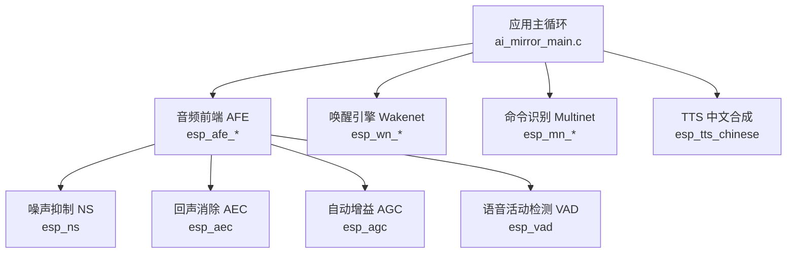
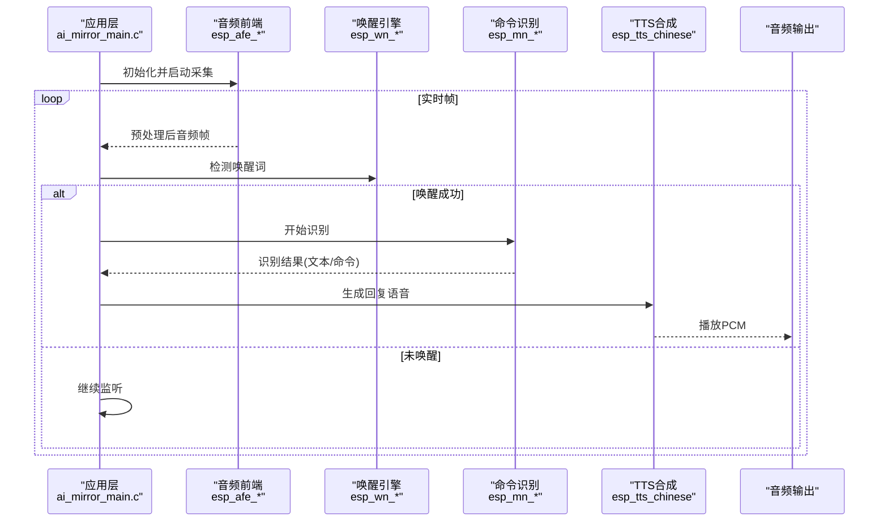
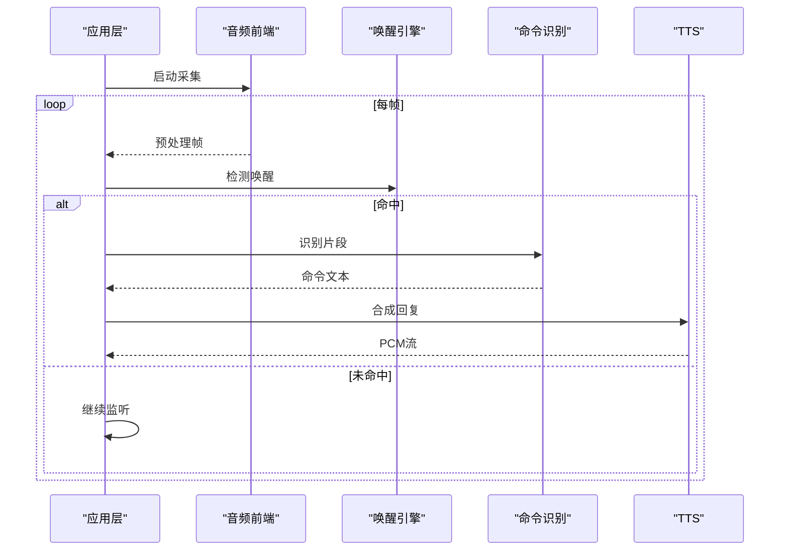
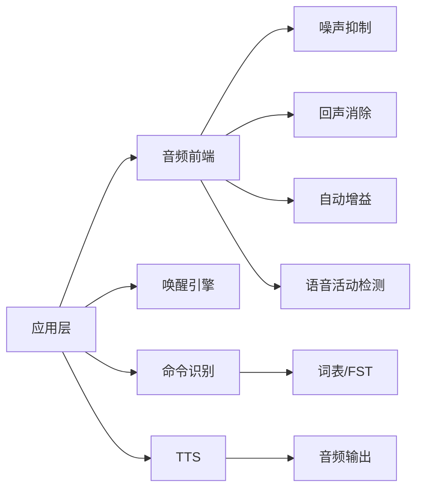

# 语音识别API

<cite>
**本文档引用的文件**   
- [esp_afe_sr_iface.h](file://Firmware/esp32_ai_mirror/components/espressif__esp-sr/include/esp32s3/esp_afe_sr_iface.h)
- [esp_afe_config.h](file://Firmware/esp32_ai_mirror/components/espressif__esp-sr/include/esp32s3/esp_afe_config.h)
- [esp_mn_iface.h](file://Firmware/esp32_ai_mirror/components/espressif__esp-sr/include/esp32s3/esp_mn_iface.h)
- [esp_wn_iface.h](file://Firmware/esp32_ai_mirror/components/espressif__esp-sr/include/esp32s3/esp_wn_iface.h)
- [esp_ns.h](file://Firmware/esp32_ai_mirror/components/espressif__esp-sr/include/esp32s3/esp_ns.h)
- [esp_aec.h](file://Firmware/esp32_ai_mirror/components/espressif__esp-sr/include/esp32s3/esp_aec.h)
- [esp_agc.h](file://Firmware/esp32_ai_mirror/components/espressif__esp-sr/include/esp32s3/esp_agc.h)
- [esp_vad.h](file://Firmware/esp32_ai_mirror/components/espressif__esp-sr/include/esp32s3/esp_vad.h)
- [esp_mn_speech_commands.c](file://Firmware/esp32_ai_mirror/components/espressif__esp-sr/src/esp_mn_speech_commands.c)
- [ai_mirror_main.c](file://Firmware/esp32_ai_mirror/main/ai_mirror_main.c)
- [esp_tts_chinese.h](file://Firmware/esp32_ai_mirror/components/espressif__esp-sr/esp-tts/esp_tts_chinese/include/esp_tts_chinese.h)
- [README.md](file://Firmware/esp32_ai_mirror/README.md)
</cite>

## 目录
1. [简介](#简介)
2. [项目结构](#项目结构)
3. [核心组件](#核心组件)
4. [架构总览](#架构总览)
5. [详细组件分析](#详细组件分析)
6. [依赖关系分析](#依赖关系分析)
7. [性能考虑](#性能考虑)
8. [故障排查指南](#故障排查指南)
9. [结论](#结论)
10. [附录](#附录)

## 简介
本文件面向ESP-SR（Espressif Speech Recognition）在ESP32/S3平台上的语音识别与合成能力，系统性梳理唤醒词检测、语音命令识别、语音合成等关键功能，并给出模型加载、配置参数、结果处理、多语言支持与自定义词汇表的使用方法。同时覆盖语音预处理（噪声抑制、回声消除、自动增益控制、语音活动检测）的API调用要点，以及TTS配置与播放控制的实践建议，最后提供识别精度优化与性能调优技巧。

## 项目结构
本项目以ESP-IDF工程为基础，核心语音能力由components/espressif__esp-sr组件提供，应用入口位于main/ai_mirror_main.c。ESP-SR包含音频前端（AFE）、唤醒引擎（Wakenet）、多语言命令识别（Multinet）与TTS（esp-tts）等模块。

图表来源
- [ai_mirror_main.c](file://Firmware/esp32_ai_mirror/main/ai_mirror_main.c)
- [esp_afe_config.h](file://Firmware/esp32_ai_mirror/components/espressif__esp-sr/include/esp32s3/esp_afe_config.h)
- [esp_wn_iface.h](file://Firmware/esp32_ai_mirror/components/espressif__esp-sr/include/esp32s3/esp_wn_iface.h)
- [esp_mn_iface.h](file://Firmware/esp32_ai_mirror/components/espressif__esp-sr/include/esp32s3/esp_mn_iface.h)
- [esp_ns.h](file://Firmware/esp32_ai_mirror/components/espressif__esp-sr/include/esp32s3/esp_ns.h)
- [esp_aec.h](file://Firmware/esp32_ai_mirror/components/espressif__esp-sr/include/esp32s3/esp_aec.h)
- [esp_agc.h](file://Firmware/esp32_ai_mirror/components/espressif__esp-sr/include/esp32s3/esp_agc.h)
- [esp_vad.h](file://Firmware/esp32_ai_mirror/components/espressif__esp-sr/include/esp32s3/esp_vad.h)

章节来源
- [README.md](file://Firmware/esp32_ai_mirror/README.md)
- [ai_mirror_main.c](file://Firmware/esp32_ai_mirror/main/ai_mirror_main.c)

## 核心组件
- 音频前端（AFE）：统一封装麦克风采集、降噪、回声消除、AGC、VAD等前处理，输出标准化音频流供识别引擎使用。
- 唤醒引擎（Wakenet）：低功耗关键词检测，支持内置与自定义唤醒词模型。
- 命令识别（Multinet）：轻量级离线语音命令识别，支持中英文及自定义词表。
- TTS（esp-tts_chinese）：嵌入式中文语音合成，支持流式播放与参数配置。

章节来源
- [esp_afe_config.h](file://Firmware/esp32_ai_mirror/components/espressif__esp-sr/include/esp32s3/esp_afe_config.h)
- [esp_wn_iface.h](file://Firmware/esp32_ai_mirror/components/espressif__esp-sr/include/esp32s3/esp_wn_iface.h)
- [esp_mn_iface.h](file://Firmware/esp32_ai_mirror/components/espressif__esp-sr/include/esp32s3/esp_mn_iface.h)
- [esp_tts_chinese.h](file://Firmware/esp32_ai_mirror/components/espressif__esp-sr/esp-tts/esp_tts_chinese/include/esp_tts_chinese.h)

## 架构总览
下图展示从音频采集到识别与合成的整体数据流与控制流。

图表来源
- [ai_mirror_main.c](file://Firmware/esp32_ai_mirror/main/ai_mirror_main.c)
- [esp_afe_config.h](file://Firmware/esp32_ai_mirror/components/espressif__esp-sr/include/esp32s3/esp_afe_config.h)
- [esp_wn_iface.h](file://Firmware/esp32_ai_mirror/components/espressif__esp-sr/include/esp32s3/esp_wn_iface.h)
- [esp_mn_iface.h](file://Firmware/esp32_ai_mirror/components/espressif__esp-sr/include/esp32s3/esp_mn_iface.h)
- [esp_tts_chinese.h](file://Firmware/esp32_ai_mirror/components/espressif__esp-sr/esp-tts/esp_tts_chinese/include/esp_tts_chinese.h)

## 详细组件分析

### 音频前端（AFE）与预处理
- 作用：对原始MIC数据进行降噪、回声消除、自动增益、VAD等处理，输出稳定采样率与位深的音频帧。
- 关键接口与配置：
  - 通过配置结构体选择模型、通道数、采样率、缓冲区大小、是否启用AEC/NS/AGC/VAD等。
  - 典型流程：创建实例→设置配置→启动→周期性获取帧→释放资源。
- 与外部集成：通常对接I2S驱动或板级音频编解码器，将处理后的PCM送入唤醒/识别引擎。

章节来源
- [esp_afe_config.h](file://Firmware/esp32_ai_mirror/components/espressif__esp-sr/include/esp32s3/esp_afe_config.h)
- [esp_ns.h](file://Firmware/esp32_ai_mirror/components/espressif__esp-sr/include/esp32s3/esp_ns.h)
- [esp_aec.h](file://Firmware/esp32_ai_mirror/components/espressif__esp-sr/include/esp32s3/esp_aec.h)
- [esp_agc.h](file://Firmware/esp32_ai_mirror/components/espressif__esp-sr/include/esp32s3/esp_agc.h)
- [esp_vad.h](file://Firmware/esp32_ai_mirror/components/espressif__esp-sr/include/esp32s3/esp_vad.h)

### 唤醒引擎（Wakenet）
- 作用：低功耗持续监听，检测到唤醒词后触发后续识别流程。
- 关键接口与配置：
  - 选择唤醒模型（内置或自定义），设置阈值、滑动窗口、置信度判定策略。
  - 典型流程：初始化模型→循环输入音频帧→返回命中事件与置信度。
- 多语言与自定义：支持不同语言的唤醒词模型；可通过工具链打包自定义唤醒词模型并替换。

章节来源
- [esp_wn_iface.h](file://Firmware/esp32_ai_mirror/components/espressif__esp-sr/include/esp32s3/esp_wn_iface.h)

### 命令识别（Multinet）
- 作用：离线识别短语音命令，支持中英文与自定义词表。
- 关键接口与配置：
  - 选择语言模型（如中文/英文），加载词表（FST/字典），设置采样率、帧长、VAD门限等。
  - 典型流程：初始化→输入音频片段→解析结果（文本/命令ID）→后处理（去重、纠错）。
- 多语言与自定义词表：
  - 切换语言模型即可支持不同语言。
  - 通过工具生成词表与FST，替换默认词表实现领域定制。

章节来源
- [esp_mn_iface.h](file://Firmware/esp32_ai_mirror/components/espressif__esp-sr/include/esp32s3/esp_mn_iface.h)
- [esp_mn_speech_commands.c](file://Firmware/esp32_ai_mirror/components/espressif__esp-sr/src/esp_mn_speech_commands.c)

### 语音合成（TTS esp-tts_chinese）
- 作用：将文本转换为语音，支持流式播放与参数调节（语速、音量、音调等）。
- 关键接口与配置：
  - 初始化TTS引擎→设置参数→逐句或流式合成→输出PCM→通过DAC/I2S播放。
  - 可配置缓存大小、编码格式、播放队列等。
- 播放控制：支持暂停、恢复、停止、音量调节、播放进度回调等。

章节来源
- [esp_tts_chinese.h](file://Firmware/esp32_ai_mirror/components/espressif__esp-sr/esp-tts/esp_tts_chinese/include/esp_tts_chinese.h)

### 识别流程时序（端到端）

图表来源
- [ai_mirror_main.c](file://Firmware/esp32_ai_mirror/main/ai_mirror_main.c)
- [esp_afe_config.h](file://Firmware/esp32_ai_mirror/components/espressif__esp-sr/include/esp32s3/esp_afe_config.h)
- [esp_wn_iface.h](file://Firmware/esp32_ai_mirror/components/espressif__esp-sr/include/esp32s3/esp_wn_iface.h)
- [esp_mn_iface.h](file://Firmware/esp32_ai_mirror/components/espressif__esp-sr/include/esp32s3/esp_mn_iface.h)
- [esp_tts_chinese.h](file://Firmware/esp32_ai_mirror/components/espressif__esp-sr/esp-tts/esp_tts_chinese/include/esp_tts_chinese.h)

## 依赖关系分析
- 应用层依赖AFE进行音频采集与前处理，依赖Wakenet进行唤醒，依赖Multinet进行命令识别，依赖TTS进行语音合成。
- AFE内部依赖NS/AEC/AGC/VAD等子模块。
- Multinet依赖语言模型与词表资源（FST/字典）。
- TTS依赖内置中文语音库与音频输出驱动。

图表来源
- [ai_mirror_main.c](file://Firmware/esp32_ai_mirror/main/ai_mirror_main.c)
- [esp_afe_config.h](file://Firmware/esp32_ai_mirror/components/espressif__esp-sr/include/esp32s3/esp_afe_config.h)
- [esp_wn_iface.h](file://Firmware/esp32_ai_mirror/components/espressif__esp-sr/include/esp32s3/esp_wn_iface.h)
- [esp_mn_iface.h](file://Firmware/esp32_ai_mirror/components/espressif__esp-sr/include/esp32s3/esp_mn_iface.h)
- [esp_tts_chinese.h](file://Firmware/esp32_ai_mirror/components/espressif__esp-sr/esp-tts/esp_tts_chinese/include/esp_tts_chinese.h)

## 性能考虑
- 采样率与帧长：根据设备CPU与内存预算选择合适的采样率与帧长，平衡时延与功耗。
- 前处理开关：在安静环境可关闭AEC/NS以降低CPU占用；嘈杂环境开启以提升鲁棒性。
- 模型选择：优先使用量化模型（如q8）降低内存与计算开销。
- 资源管理：避免频繁分配/释放内存，复用缓冲与对象。
- 任务调度：将音频采集、识别、TTS分任务执行，避免阻塞。
- 硬件加速：利用ESP32-S3的DSP/向量指令加速矩阵运算与FFT。

[本节为通用指导，不直接分析具体文件]

## 故障排查指南
- 无唤醒响应：检查唤醒阈值、滑动窗口长度、音频质量与环境噪声；确认模型与采样率匹配。
- 识别错误率高：检查词表是否覆盖常用表达；调整VAD门限与静音检测；确保音频链路无削波。
- 回声/啸叫：确认AEC参考信号接入正确；调整AEC参数（步长、延迟估计）；改善声学布局。
- 卡顿/延迟：检查任务优先级与中断屏蔽；减少不必要的日志打印；优化缓冲区大小。
- TTS无声：确认音频输出路径（I2S/DAC）配置正确；检查PCM格式与采样率；增大播放缓冲。

章节来源
- [esp_ns.h](file://Firmware/esp32_ai_mirror/components/espressif__esp-sr/include/esp32s3/esp_ns.h)
- [esp_aec.h](file://Firmware/esp32_ai_mirror/components/espressif__esp-sr/include/esp32s3/esp_aec.h)
- [esp_agc.h](file://Firmware/esp32_ai_mirror/components/espressif__esp-sr/include/esp32s3/esp_agc.h)
- [esp_vad.h](file://Firmware/esp32_ai_mirror/components/espressif__esp-sr/include/esp32s3/esp_vad.h)
- [esp_mn_speech_commands.c](file://Firmware/esp32_ai_mirror/components/espressif__esp-sr/src/esp_mn_speech_commands.c)

## 结论
ESP-SR在ESP32/S3平台上提供了完整的离线语音能力栈，涵盖音频前端、唤醒、命令识别与TTS。通过合理配置AFE与模型、优化前处理参数与资源管理，可在低功耗设备上实现高鲁棒性的语音交互体验。结合多语言支持与自定义词表，可满足多样化场景需求。

[本节为总结，不直接分析具体文件]

## 附录

### API调用示例（步骤说明）
- 唤醒词检测
  - 初始化唤醒模型与参数
  - 循环读取音频帧并检测
  - 命中后进入识别阶段
- 语音命令识别
  - 初始化Multinet与词表
  - 收集有效语音片段（VAD）
  - 解析识别结果并进行业务逻辑处理
- 语音合成与播放
  - 初始化TTS与音频输出
  - 设置语速/音量等参数
  - 流式合成并播放PCM

章节来源
- [esp_wn_iface.h](file://Firmware/esp32_ai_mirror/components/espressif__esp-sr/include/esp32s3/esp_wn_iface.h)
- [esp_mn_iface.h](file://Firmware/esp32_ai_mirror/components/espressif__esp-sr/include/esp32s3/esp_mn_iface.h)
- [esp_tts_chinese.h](file://Firmware/esp32_ai_mirror/components/espressif__esp-sr/esp-tts/esp_tts_chinese/include/esp_tts_chinese.h)

### 多语言支持与自定义词汇表
- 多语言：切换Multinet语言模型即可支持不同语言识别。
- 自定义词表：使用工具生成词表与FST，替换默认资源；确保发音与拼写一致。
- 评估与迭代：基于真实场景数据评估准确率，持续优化词表与模型。

章节来源
- [esp_mn_iface.h](file://Firmware/esp32_ai_mirror/components/espressif__esp-sr/include/esp32s3/esp_mn_iface.h)
- [esp_mn_speech_commands.c](file://Firmware/esp32_ai_mirror/components/espressif__esp-sr/src/esp_mn_speech_commands.c)

### 识别精度优化与性能调优清单
- 精度优化
  - 提升录音质量（距离、角度、防遮挡）
  - 调整VAD与静音检测阈值
  - 扩展与规范化词表
  - 使用更合适的模型版本（精度/速度权衡）
- 性能调优
  - 量化模型与内存复用
  - 合理任务划分与优先级
  - 关闭非必要前处理模块
  - 使用硬件加速与DMA传输

[本节为通用指导，不直接分析具体文件]