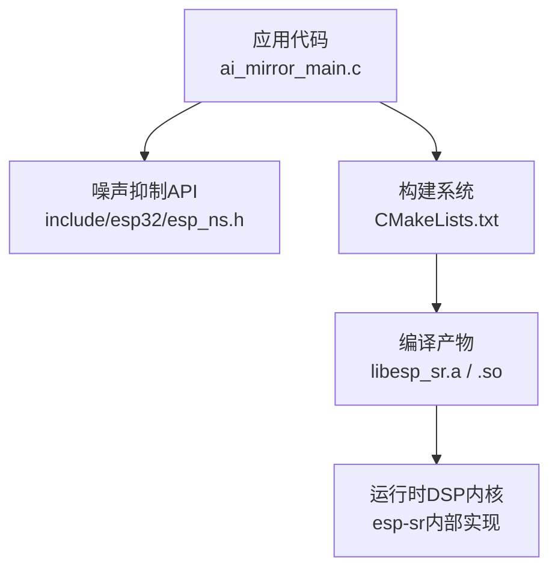
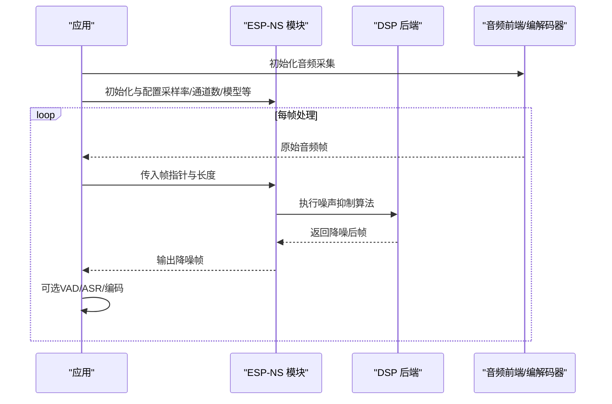
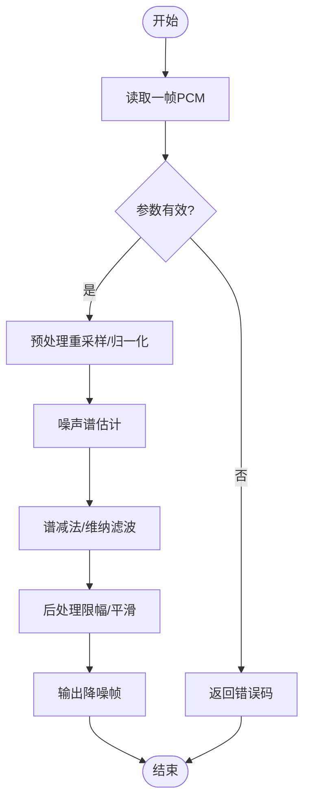
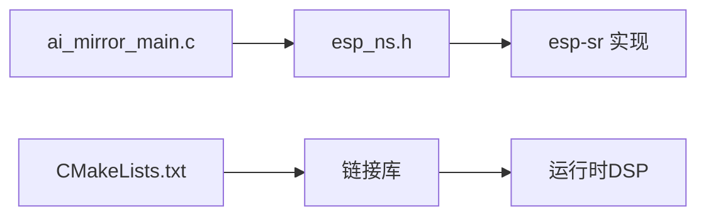

# 噪声抑制API

<cite>
**本文引用的文件**   
- [esp_ns.h](file://Firmware/esp32_ai_mirror/components/espressif__esp-sr/include/esp32/esp_ns.h)
- [esp_ns.h (ESP32-S3)](file://Firmware/esp32_ai_mirror/components/espressif__esp-sr/include/esp32s3/esp_ns.h)
- [README.md（esp-sr）](file://Firmware/esp32_ai_mirror/components/espressif__esp-sr/README.md)
- [CMakeLists.txt（esp-sr）](file://Firmware/esp32_ai_mirror/components/espressif__esp-sr/CMakeLists.txt)
- [ai_mirror_main.c](file://Firmware/esp32_ai_mirror/main/ai_mirror_main.c)
- [sdkconfig.defaults](file://Firmware/esp32_ai_mirror/sdkconfig.defaults)
</cite>

## 目录
1. [简介](#简介)
2. [项目结构](#项目结构)
3. [核心组件](#核心组件)
4. [架构总览](#架构总览)
5. [详细组件分析](#详细组件分析)
6. [依赖关系分析](#依赖关系分析)
7. [性能考虑](#性能考虑)
8. [故障排查指南](#故障排查指南)
9. [结论](#结论)
10. [附录](#附录)

## 简介
本文件面向在 ESP-IDF 项目中集成与使用 ESP-NS（Noise Suppression，噪声抑制）的开发者，系统性说明 ESP-NS 库的 API、初始化流程、配置项、处理管线以及参数调优方法。文档同时给出在不同环境下的配置示例、性能优化建议与常见问题解决方案，帮助快速实现有效的背景噪声消除。

## 项目结构
ESP-NS 作为 esp-sr 组件的一部分，提供跨平台（ESP32/ESP32-S3）的头文件接口，并在构建系统中由 CMake 管理。应用层通过包含对应头文件并调用 API 完成噪声抑制功能的启用与数据流处理。

图表来源 
- [CMakeLists.txt（esp-sr）](file://Firmware/esp32_ai_mirror/components/espressif__esp-sr/CMakeLists.txt)
- [esp_ns.h](file://Firmware/esp32_ai_mirror/components/espressif__esp-sr/include/esp32/esp_ns.h)
- [ai_mirror_main.c](file://Firmware/esp32_ai_mirror/main/ai_mirror_main.c)

章节来源
- [CMakeLists.txt（esp-sr）](file://Firmware/esp32_ai_mirror/components/espressif__esp-sr/CMakeLists.txt)
- [README.md（esp-sr）](file://Firmware/esp32_ai_mirror/components/espressif__esp-sr/README.md)

## 核心组件
- 噪声抑制模块（ESP-NS）：提供统一的初始化、配置与帧级处理接口，支持单声道/多通道输入，输出降噪后的音频帧。
- 头文件抽象：为不同目标芯片（如 ESP32、ESP32-S3）提供一致的 API 定义，屏蔽底层差异。
- 构建集成：通过 CMake 将 esp-sr 组件纳入工程，确保链接正确的 DSP 后端。

章节来源
- [esp_ns.h](file://Firmware/esp32_ai_mirror/components/espressif__esp-sr/include/esp32/esp_ns.h)
- [esp_ns.h (ESP32-S3)](file://Firmware/esp32_ai_mirror/components/espressif__esp-sr/include/esp32s3/esp_ns.h)
- [CMakeLists.txt（esp-sr）](file://Firmware/esp32_ai_mirror/components/espressif__esp-sr/CMakeLists.txt)

## 架构总览
下图展示了从应用到 DSP 后端的整体数据流与控制流。应用侧负责采集音频帧、调用 ESP-NS 接口进行降噪，并将结果送入后续语音识别或编码链路。

图表来源 
- [esp_ns.h](file://Firmware/esp32_ai_mirror/components/espressif__esp-sr/include/esp32/esp_ns.h)
- [esp_ns.h (ESP32-S3)](file://Firmware/esp32_ai_mirror/components/espressif__esp-sr/include/esp32s3/esp_ns.h)

## 详细组件分析

### 初始化与生命周期
- 创建实例：分配并初始化噪声抑制上下文，设置采样率、通道数、帧长等关键参数。
- 加载模型：根据目标平台选择合适模型权重，完成内存映射或加载。
- 运行与销毁：在音频循环中持续调用处理函数；任务结束时释放资源。

要点
- 初始化失败通常由参数不合法、内存不足或模型加载失败引起。
- 建议在音频子系统启动前完成 NS 初始化，避免运行时切换参数导致不稳定。

章节来源
- [esp_ns.h](file://Firmware/esp32_ai_mirror/components/espressif__esp-sr/include/esp32/esp_ns.h)
- [esp_ns.h (ESP32-S3)](file://Firmware/esp32_ai_mirror/components/espressif__esp-sr/include/esp32s3/esp_ns.h)

### 配置项与参数
常见可配置项包括：
- 采样率：需与音频采集一致（如 16kHz）。
- 通道数：单通道或双通道（影响模型与计算量）。
- 帧长：决定时域/频域处理的粒度，需与上游缓冲对齐。
- 模型类型：针对场景优化的噪声抑制模型（如通用、强噪声、低延迟）。
- 增益/阈值：控制抑制强度与语音保留度。

调优建议
- 先固定采样率与帧长，再调整抑制强度，观察信噪比与语音失真平衡。
- 在强噪声环境下优先选择“强噪声”模型；对实时性敏感场景选择“低延迟”模型。

章节来源
- [esp_ns.h](file://Firmware/esp32_ai_mirror/components/espressif__esp-sr/include/esp32/esp_ns.h)
- [esp_ns.h (ESP32-S3)](file://Firmware/esp32_ai_mirror/components/espressif__esp-sr/include/esp32s3/esp_ns.h)

### 处理流程（帧级）
典型处理步骤：
1. 接收一帧 PCM 数据（通常为 int16 或 float）。
2. 调用 NS 处理函数，传入输入/输出缓冲区与帧长度。
3. 内部进行频谱估计、噪声谱更新与滤波。
4. 返回降噪后的音频帧，供下游 VAD/ASR/编码使用。

图表来源 
- [esp_ns.h](file://Firmware/esp32_ai_mirror/components/espressif__esp-sr/include/esp32/esp_ns.h)

章节来源
- [esp_ns.h](file://Firmware/esp32_ai_mirror/components/espressif__esp-sr/include/esp32/esp_ns.h)

### 与音频前端的集成
- 采集端：I2S/ADC 驱动按固定帧长推送数据到应用。
- 处理端：应用将帧交给 ESP-NS 处理，必要时与 AGC/VAD 串联。
- 输出端：将降噪后的帧送入 ASR 或编码器（如 Opus/AAC）。

章节来源
- [ai_mirror_main.c](file://Firmware/esp32_ai_mirror/main/ai_mirror_main.c)

## 依赖关系分析
- 头文件依赖：应用包含 esp_ns.h，编译器解析 API 声明。
- 构建依赖：CMakeLists.txt 将 esp-sr 组件加入工程，链接静态库或动态库。
- 运行时依赖：DSP 后端与内存分配器、音频子系统。

图表来源 
- [CMakeLists.txt（esp-sr）](file://Firmware/esp32_ai_mirror/components/espressif__esp-sr/CMakeLists.txt)
- [esp_ns.h](file://Firmware/esp32_ai_mirror/components/espressif__esp-sr/include/esp32/esp_ns.h)
- [ai_mirror_main.c](file://Firmware/esp32_ai_mirror/main/ai_mirror_main.c)

章节来源
- [CMakeLists.txt（esp-sr）](file://Firmware/esp32_ai_mirror/components/espressif__esp-sr/CMakeLists.txt)

## 性能考虑
- 帧长与延迟：更短帧降低延迟但增加开销；更长帧提升稳定性但增大延迟。
- 模型选择：强噪声模型精度更高但计算量大；低延迟模型适合实时交互。
- 内存占用：模型权重与中间缓存大小受通道数与帧长影响。
- CPU 占用：开启多通道或高精度模型会显著增加 CPU 负载，需评估设备能力。
- 流水线并行：将采集、降噪、VAD/ASR 分线程或任务处理，减少阻塞。

[本节为通用指导，无需特定文件引用]

## 故障排查指南
常见问题与定位思路：
- 初始化失败
  - 检查采样率、通道数、帧长是否合法且与采集一致。
  - 确认模型路径与权限，内存是否充足。
- 无声或严重失真
  - 降低抑制强度，避免过度衰减语音。
  - 检查输入数据格式（位宽、端序）与缓冲区对齐。
- 高 CPU/卡顿
  - 降低模型复杂度或通道数。
  - 优化帧长与任务调度，避免频繁内存分配。
- 环境适配差
  - 更换更适合当前环境的模型。
  - 结合 VAD 与 AGC 形成完整前端链路。

章节来源
- [esp_ns.h](file://Firmware/esp32_ai_mirror/components/espressif__esp-sr/include/esp32/esp_ns.h)
- [esp_ns.h (ESP32-S3)](file://Firmware/esp32_ai_mirror/components/espressif__esp-sr/include/esp32s3/esp_ns.h)

## 结论
ESP-NS 提供了稳定、易用的噪声抑制 API，适用于多种 ESP 平台与音频场景。通过合理配置采样率、通道数、帧长与模型类型，并结合 VAD/AGC 等前端模块，可在不同环境中实现高质量的背景噪声消除。实际部署时应关注性能与延迟的平衡，依据场景选择合适模型与参数。

[本节为总结性内容，无需特定文件引用]

## 附录

### 不同环境下的配置示例（概念性）
- 室内会议（中等噪声）
  - 采样率：16kHz；通道数：1；帧长：256~512；模型：通用型；抑制强度：中等。
- 户外交通（强噪声）
  - 采样率：16kHz；通道数：1；帧长：512；模型：强噪声型；抑制强度：较高。
- 实时对话（低延迟）
  - 采样率：16kHz；通道数：1；帧长：128~256；模型：低延迟型；抑制强度：适中。

[本节为概念性示例，无需特定文件引用]

### 与构建系统的集成要点
- 在 CMake 中添加 esp-sr 组件依赖，确保链接正确。
- 在 sdkconfig 中启用必要的音频与 DSP 选项（如 I2S、VFS、FreeRTOS 任务栈）。

章节来源
- [CMakeLists.txt（esp-sr）](file://Firmware/esp32_ai_mirror/components/espressif__esp-sr/CMakeLists.txt)
- [sdkconfig.defaults](file://Firmware/esp32_ai_mirror/sdkconfig.defaults)