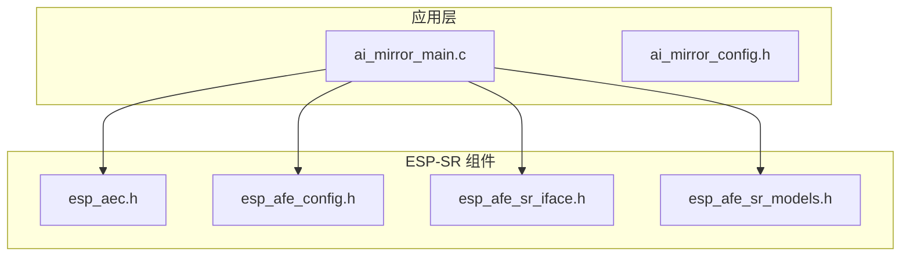
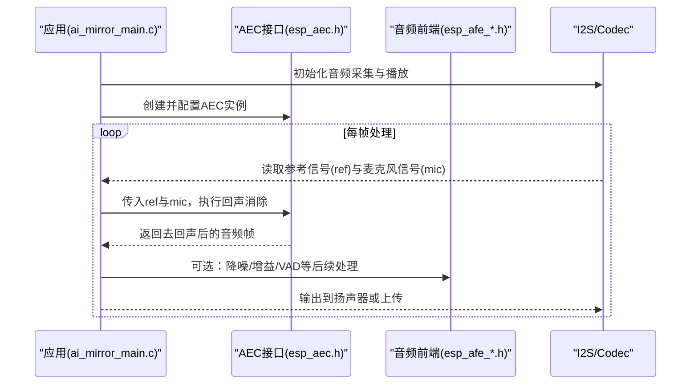
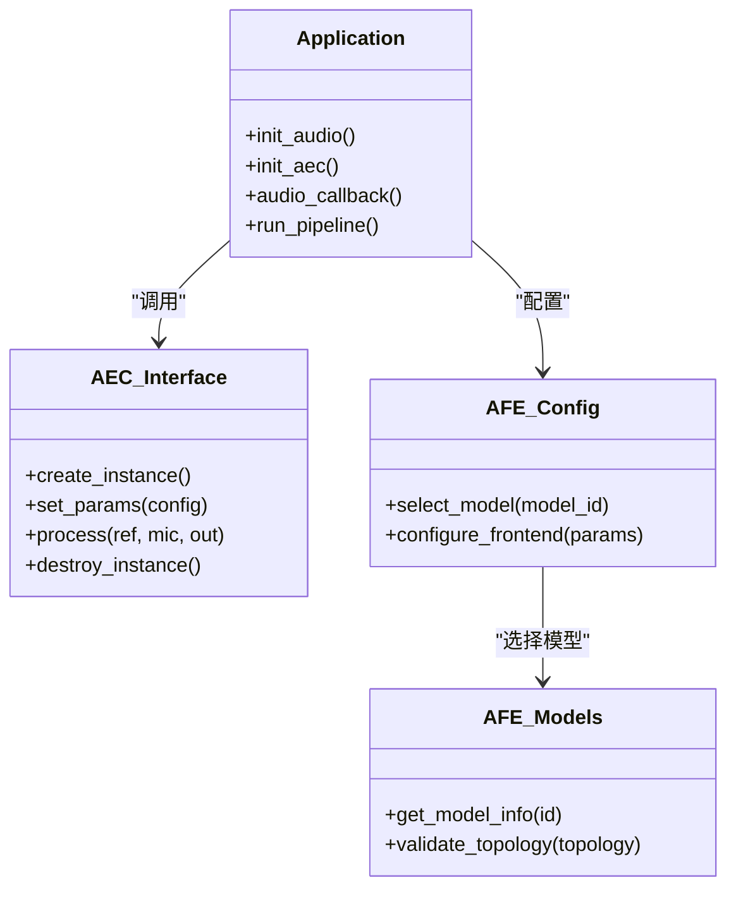
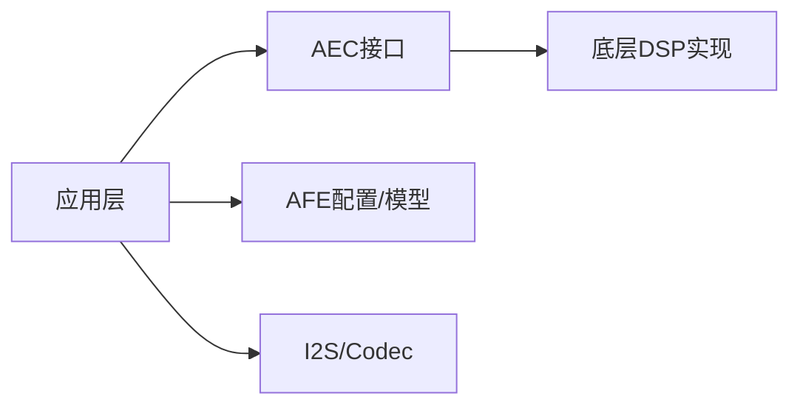
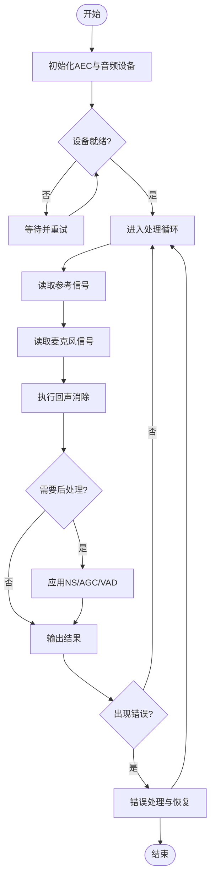

# 回声消除API

<cite>
**本文引用的文件**   
- [esp_aec.h](file://Firmware/esp32_ai_mirror/components/espressif__esp-sr/include/esp32/esp_aec.h)
- [esp_aec.h (ESP32S3)](file://Firmware/esp32_ai_mirror/components/espressif__esp-sr/include/esp32s3/esp_aec.h)
- [esp_afe_config.h](file://Firmware/esp32_ai_mirror/components/espressif__esp-sr/include/esp32/esp_afe_config.h)
- [esp_afe_sr_iface.h](file://Firmware/esp32_ai_mirror/components/espressif__esp-sr/include/esp32/esp_afe_sr_iface.h)
- [esp_afe_sr_models.h](file://Firmware/esp32_ai_mirror/components/espressif__esp-sr/include/esp32/esp_afe_sr_models.h)
- [ai_mirror_main.c](file://Firmware/esp32_ai_mirror/main/ai_mirror_main.c)
- [ai_mirror_config.h](file://Firmware/esp32_ai_mirror/main/ai_mirror_config.h)
</cite>

## 目录
1. [简介](#简介)
2. [项目结构](#项目结构)
3. [核心组件](#核心组件)
4. [架构总览](#架构总览)
5. [详细组件分析](#详细组件分析)
6. [依赖关系分析](#依赖关系分析)
7. [性能考虑](#性能考虑)
8. [故障排除指南](#故障排除指南)
9. [结论](#结论)
10. [附录](#附录)

## 简介
本文件面向需要在 ESP32/ESP32-S3 平台上集成与使用 ESP-AEC（声学回声消除）的工程师，提供基于 esp-sr 组件的 AEC API 文档、配置方法、处理流程、参数调优策略以及单/双麦克风系统的实践示例。内容涵盖：
- AEC 接口函数与数据结构说明
- 回声消除算法工作原理与关键参数
- 典型调用序列与数据流
- 复杂声学环境下的优化策略
- 常见问题定位与排障建议

## 项目结构
本项目在 components/espressif__esp-sr 中提供 esp-sr 语音识别与前端处理库，其中 esp_aec.h 定义 AEC 对外接口；esp_afe_config.h 与 esp_afe_sr_iface.h 提供音频前端（AFE）与回声消除模型选择接口；应用层 main/ai_mirror_main.c 负责初始化与运行 AEC 管线。

图表来源
- [ai_mirror_main.c](file://Firmware/esp32_ai_mirror/main/ai_mirror_main.c)
- [ai_mirror_config.h](file://Firmware/esp32_ai_mirror/main/ai_mirror_config.h)
- [esp_aec.h](file://Firmware/esp32_ai_mirror/components/espressif__esp-sr/include/esp32/esp_aec.h)
- [esp_afe_config.h](file://Firmware/esp32_ai_mirror/components/espressif__esp-sr/include/esp32/esp_afe_config.h)
- [esp_afe_sr_iface.h](file://Firmware/esp32_ai_mirror/components/espressif__esp-sr/include/esp32/esp_afe_sr_iface.h)
- [esp_afe_sr_models.h](file://Firmware/esp32_ai_mirror/components/espressif__esp-sr/include/esp32/esp_afe_sr_models.h)

章节来源
- [ai_mirror_main.c](file://Firmware/esp32_ai_mirror/main/ai_mirror_main.c)
- [ai_mirror_config.h](file://Firmware/esp32_ai_mirror/main/ai_mirror_config.h)
- [esp_aec.h](file://Firmware/esp32_ai_mirror/components/espressif__esp-sr/include/esp32/esp_aec.h)
- [esp_afe_config.h](file://Firmware/esp32_ai_mirror/components/espressif__esp-sr/include/esp32/esp_afe_config.h)
- [esp_afe_sr_iface.h](file://Firmware/esp32_ai_mirror/components/espressif__esp-sr/include/esp32/esp_afe_sr_iface.h)
- [esp_afe_sr_models.h](file://Firmware/esp32_ai_mirror/components/espressif__esp-sr/include/esp32/esp_afe_sr_models.h)

## 核心组件
- AEC 接口层（esp_aec.h）
  - 提供创建/销毁 AEC 实例、设置参数、执行回声消除的核心函数族。
  - 典型能力包括：初始化 AEC、设置参考信号通道、输入采样率/位深、帧长、滤波器长度、收敛控制等。
- 音频前端与模型（esp_afe_config.h / esp_afe_sr_iface.h / esp_afe_sr_models.h）
  - 提供 AEC/AEC+NS/AGC/VAD 等前端的统一接口与模型枚举，便于按硬件与场景选择合适的前端组合。
- 应用集成（ai_mirror_main.c / ai_mirror_config.h）
  - 负责 AEC 实例生命周期管理、与 I2S/编解码器对接、数据流水线组织与错误处理。

章节来源
- [esp_aec.h](file://Firmware/esp32_ai_mirror/components/espressif__esp-sr/include/esp32/esp_aec.h)
- [esp_afe_config.h](file://Firmware/esp32_ai_mirror/components/espressif__esp-sr/include/esp32/esp_afe_config.h)
- [esp_afe_sr_iface.h](file://Firmware/esp32_ai_mirror/components/espressif__esp-sr/include/esp32/esp_afe_sr_iface.h)
- [esp_afe_sr_models.h](file://Firmware/esp32_ai_mirror/components/espressif__esp-sr/include/esp32/esp_afe_sr_models.h)
- [ai_mirror_main.c](file://Firmware/esp32_ai_mirror/main/ai_mirror_main.c)
- [ai_mirror_config.h](file://Firmware/esp32_ai_mirror/main/ai_mirror_config.h)

## 架构总览
AEC 在 ESP-SR 中的典型调用序列如下：应用初始化 AEC 实例并配置参数，随后在音频回调或任务循环中持续送入参考信号与麦克风信号，得到去回声后的输出。

图表来源
- [ai_mirror_main.c](file://Firmware/esp32_ai_mirror/main/ai_mirror_main.c)
- [esp_aec.h](file://Firmware/esp32_ai_mirror/components/espressif__esp-sr/include/esp32/esp_aec.h)
- [esp_afe_config.h](file://Firmware/esp32_ai_mirror/components/espressif__esp-sr/include/esp32/esp_afe_config.h)
- [esp_afe_sr_iface.h](file://Firmware/esp32_ai_mirror/components/espressif__esp-sr/include/esp32/esp_afe_sr_iface.h)

## 详细组件分析

### AEC 接口与数据结构（esp_aec.h）
- 职责
  - 定义 AEC 实例句柄、配置结构体、核心 API（创建/释放/配置/处理）。
- 关键概念
  - 参考信号通道：用于传入扬声器播放的参考音频，供自适应滤波估计声路径。
  - 输入/输出格式：采样率、位宽、通道数、帧长需与硬件一致。
  - 滤波器长度与步长：影响收敛速度与计算量，需权衡延迟与性能。
- 典型流程
  - 创建实例 → 设置参数（采样率、帧长、滤波器长度、收敛阈值等）→ 进入处理循环 → 逐帧调用回声消除 → 异常时释放资源。

章节来源
- [esp_aec.h](file://Firmware/esp32_ai_mirror/components/espressif__esp-sr/include/esp32/esp_aec.h)

### 音频前端与模型（esp_afe_config.h / esp_afe_sr_iface.h / esp_afe_sr_models.h）
- 职责
  - 提供统一的 AFE 接口，支持 AEC、NS（噪声抑制）、AGC（自动增益）、VAD（语音活动检测）的组合与切换。
  - 通过模型枚举选择不同硬件平台与场景的预置配置。
- 关键点
  - 根据目标芯片（ESP32/ESP32-S3）与麦克风拓扑（单麦/双麦）选择对应模型。
  - 可结合 NS/AGC/VAD 形成完整前端链路，提升鲁棒性。

章节来源
- [esp_afe_config.h](file://Firmware/esp32_ai_mirror/components/espressif__esp-sr/include/esp32/esp_afe_config.h)
- [esp_afe_sr_iface.h](file://Firmware/esp32_ai_mirror/components/espressif__esp-sr/include/esp32/esp_afe_sr_iface.h)
- [esp_afe_sr_models.h](file://Firmware/esp32_ai_mirror/components/espressif__esp-sr/include/esp32/esp_afe_sr_models.h)

### 应用集成（ai_mirror_main.c / ai_mirror_config.h）
- 职责
  - 初始化 AEC 与 AFE，建立音频数据通路，组织处理循环。
  - 处理边界条件（如缓冲区不足、设备未就绪）与错误恢复。
- 关键点
  - 确保参考信号与麦克风信号的同步与时序对齐。
  - 合理设置帧长与缓冲策略，避免溢出或欠载。

章节来源
- [ai_mirror_main.c](file://Firmware/esp32_ai_mirror/main/ai_mirror_main.c)
- [ai_mirror_config.h](file://Firmware/esp32_ai_mirror/main/ai_mirror_config.h)

### 类图（代码级关系示意）

图表来源
- [esp_aec.h](file://Firmware/esp32_ai_mirror/components/espressif__esp-sr/include/esp32/esp_aec.h)
- [esp_afe_config.h](file://Firmware/esp32_ai_mirror/components/espressif__esp-sr/include/esp32/esp_afe_config.h)
- [esp_afe_sr_models.h](file://Firmware/esp32_ai_mirror/components/espressif__esp-sr/include/esp32/esp_afe_sr_models.h)
- [ai_mirror_main.c](file://Firmware/esp32_ai_mirror/main/ai_mirror_main.c)

## 依赖关系分析
- 模块耦合
  - 应用层依赖 AEC 接口与 AFE 配置；AEC 内部依赖底层 DSP 实现（由 esp-sr 提供）。
- 外部依赖
  - I2S/Codec 驱动、内存分配、实时调度（FreeRTOS 或裸机循环）。
- 潜在风险
  - 参考信号与麦克风信号不同步会导致 AEC 无法收敛。
  - 不匹配的采样率/帧长会引发数据错位与失真。

图表来源
- [ai_mirror_main.c](file://Firmware/esp32_ai_mirror/main/ai_mirror_main.c)
- [esp_aec.h](file://Firmware/esp32_ai_mirror/components/espressif__esp-sr/include/esp32/esp_aec.h)
- [esp_afe_config.h](file://Firmware/esp32_ai_mirror/components/espressif__esp-sr/include/esp32/esp_afe_config.h)

章节来源
- [ai_mirror_main.c](file://Firmware/esp32_ai_mirror/main/ai_mirror_main.c)
- [esp_aec.h](file://Firmware/esp32_ai_mirror/components/espressif__esp-sr/include/esp32/esp_aec.h)
- [esp_afe_config.h](file://Firmware/esp32_ai_mirror/components/espressif__esp-sr/include/esp32/esp_afe_config.h)

## 性能考虑
- 滤波器长度与收敛速度
  - 较长滤波器能更好建模复杂房间反射，但增加计算量与启动延迟；较短滤波器收敛快但可能不足以覆盖长混响。
- 帧长与延迟
  - 较小帧长降低端到端延迟，但会增加 CPU 开销与抖动风险；需在延迟与稳定性间折衷。
- 采样率与位深
  - 高采样率/高位深提高音质但增大带宽与算力需求；通常 16kHz/16bit 是常见平衡点。
- 内存与缓存
  - 合理分配环形缓冲，避免频繁 malloc/free；利用 DMA 与中断最小化拷贝。
- 多核与任务划分
  - 将音频采集、AEC、后处理分配到不同任务/核心，减少阻塞与抖动。

[本节为通用指导，无需特定文件引用]

## 故障排除指南
- 现象：回声未消除或残留明显
  - 检查参考信号是否真实来自扬声器播放且无额外处理（如压缩/限幅）。
  - 确认参考信号与麦克风信号时间对齐（I2S 时钟、DMA 顺序、缓冲偏移）。
  - 调整滤波器长度与收敛阈值，观察初始阶段是否稳定。
- 现象：语音被误抑制或失真
  - 检查 AGC 增益是否过高导致削波；适当降低增益或启用限幅。
  - 若开启 NS/VAD，调整其灵敏度以避免误判。
- 现象：CPU 占用过高或卡顿
  - 减小帧长或降低采样率；关闭不必要的后处理模块。
  - 检查内存碎片与堆大小，必要时扩大堆或使用静态缓冲。
- 现象：启动慢或收敛不稳定
  - 延长预热时间，确保参考信号在前几秒内保持稳定。
  - 针对大房间或强混响环境，适当增加滤波器长度与训练时长。

章节来源
- [esp_aec.h](file://Firmware/esp32_ai_mirror/components/espressif__esp-sr/include/esp32/esp_aec.h)
- [esp_afe_config.h](file://Firmware/esp32_ai_mirror/components/espressif__esp-sr/include/esp32/esp_afe_config.h)
- [ai_mirror_main.c](file://Firmware/esp32_ai_mirror/main/ai_mirror_main.c)

## 结论
ESP-AEC 在 esp-sr 中提供了完整的 AEC 接口与前端模型选择能力。通过正确配置参考信号、采样率、帧长与滤波器长度，并结合 NS/AGC/VAD 等模块，可在单/双麦克风系统中获得稳定的回声消除效果。实际部署中应重视时序对齐、内存与算力规划，以及复杂声学环境的参数调优。

[本节为总结性内容，无需特定文件引用]

## 附录

### 工作原理与参数调优要点
- 工作原理
  - AEC 通过自适应滤波器估计扬声器到麦克风的声路径，从麦克风信号中减去估计的回声分量，从而得到近端语音。
- 关键参数
  - 采样率、帧长、滤波器长度、收敛阈值、步长、泄漏因子等。
- 调优建议
  - 小房间/低混响：较短滤波器、较快收敛。
  - 大房间/强混响：较长滤波器、更长训练时间。
  - 动态环境：适度放宽收敛阈值，增强鲁棒性。

[本节为概念性说明，无需特定文件引用]

### 单麦克风系统配置示例（步骤）
- 硬件与驱动
  - 配置 I2S 单路麦克风采集与扬声器播放，确保时钟同步。
- AEC 初始化
  - 创建 AEC 实例，设置采样率、帧长、滤波器长度等。
- 数据处理
  - 在回调中依次送入参考信号与麦克风信号，获取去回声输出。
- 后处理
  - 可选加入 NS/AGC/VAD，提升语音质量与识别率。

[本节为流程性说明，无需特定文件引用]

### 双麦克风系统配置示例（步骤）
- 硬件与驱动
  - 配置两路麦克风采集，保持相位一致与采样同步。
- AEC 初始化
  - 创建 AEC 实例，设置多通道参数与参考信号源。
- 数据处理
  - 对每个麦克风通道分别进行回声消除，或采用联合处理策略。
- 后处理
  - 结合波束形成或空间滤波进一步提升信噪比。

[本节为流程性说明，无需特定文件引用]

### 复杂声学环境优化策略
- 分阶段训练
  - 启动阶段快速收敛，运行阶段缓慢更新以稳定性能。
- 环境自适应
  - 监测残余回声能量，动态调整滤波器长度与步长。
- 多场景模型
  - 针对不同房间尺寸与混响特性选择预置模型或在线微调。

[本节为策略性说明，无需特定文件引用]

### 流程图（AEC 处理主循环）

图表来源
- [ai_mirror_main.c](file://Firmware/esp32_ai_mirror/main/ai_mirror_main.c)
- [esp_aec.h](file://Firmware/esp32_ai_mirror/components/espressif__esp-sr/include/esp32/esp_aec.h)