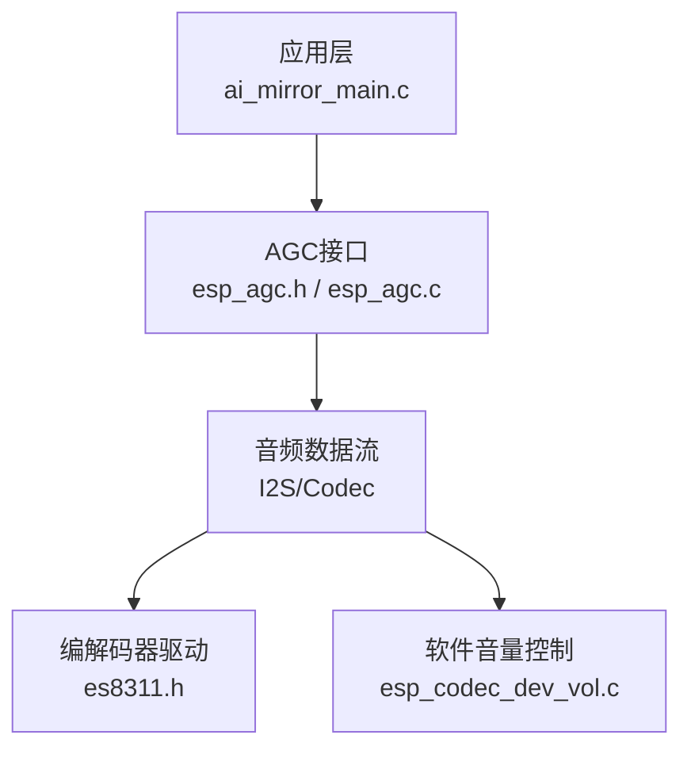
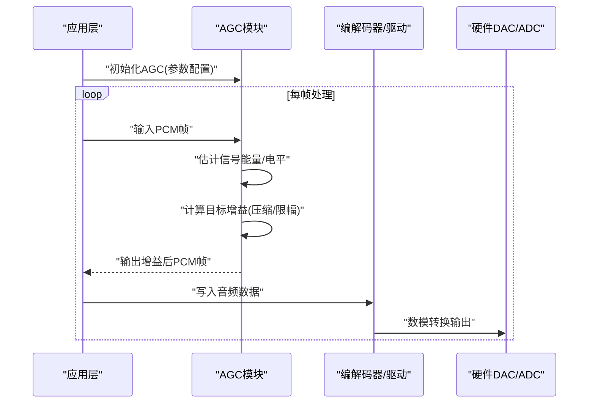
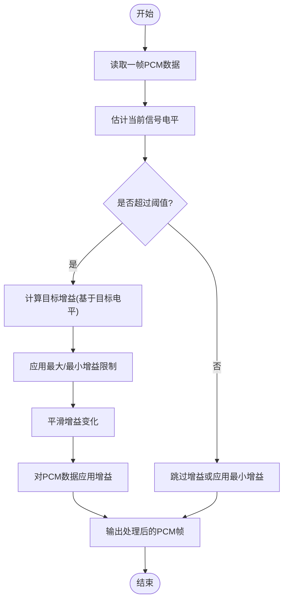
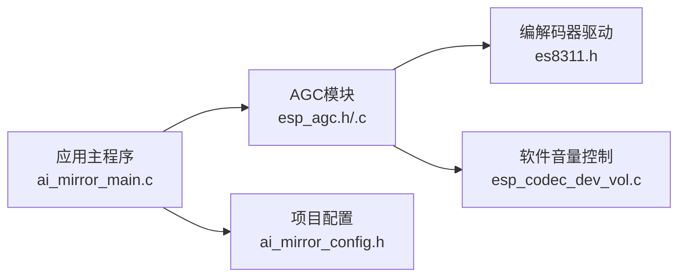

# 自动增益控制API

<cite>
**本文档引用的文件**   
- [esp_agc.h](file://Firmware/esp32_ai_mirror/components/espressif__esp-sr/include/esp32/esp_agc.h)
- [esp_agc.c](file://Firmware/esp32_ai_mirror/components/espressif__esp-sr/src/esp_agc.c)
- [ai_mirror_main.c](file://Firmware/esp32_ai_mirror/main/ai_mirror_main.c)
- [ai_mirror_config.h](file://Firmware/esp32_ai_mirror/main/ai_mirror_config.h)
- [es8311.h](file://Firmware/esp32_ai_mirror/managed_components/espressif__es8311/include/es8311.h)
- [esp_codec_dev_vol.c](file://Firmware/esp32_ai_mirror/managed_components/espressif__esp_codec_dev/esp_codec_dev_vol.c)
</cite>

## 目录
1. [简介](#简介)
2. [项目结构](#项目结构)
3. [核心组件](#核心组件)
4. [架构总览](#架构总览)
5. [详细组件分析](#详细组件分析)
6. [依赖关系分析](#依赖关系分析)
7. [性能考虑](#性能考虑)
8. [故障排查指南](#故障排查指南)
9. [结论](#结论)
10. [附录](#附录)

## 简介
本文件面向在ESP32平台上使用ESP-AGC（Automatic Gain Control，自动增益控制）的开发者，系统性地说明ESP-AGC库的接口函数、参数配置与使用方法，解释自动增益控制的原理与参数调节策略，并提供不同音量场景下的增益控制示例思路，帮助实现稳定的音频输出电平。文档同时给出实时增益调整的最佳实践与性能注意事项，便于在实际工程中快速落地。

## 项目结构
本项目中与自动增益控制相关的代码主要位于以下位置：
- ESP-SR 组件中的 AGC 头文件与实现：用于定义并实现自动增益控制算法与API
- 主应用入口与配置：用于初始化音频链路、加载AGC配置、集成到I2S/编解码器流程
- 编解码器驱动与音量控制：用于硬件层面的音量设置与软件音量叠加

图表来源
- [ai_mirror_main.c](file://Firmware/esp32_ai_mirror/main/ai_mirror_main.c)
- [esp_agc.h](file://Firmware/esp32_ai_mirror/components/espressif__esp-sr/include/esp32/esp_agc.h)
- [esp_agc.c](file://Firmware/esp32_ai_mirror/components/espressif__esp-sr/src/esp_agc.c)
- [es8311.h](file://Firmware/esp32_ai_mirror/managed_components/espressif__es8311/include/es8311.h)
- [esp_codec_dev_vol.c](file://Firmware/esp32_ai_mirror/managed_components/espressif__esp_codec_dev/esp_codec_dev_vol.c)

章节来源
- [ai_mirror_main.c](file://Firmware/esp32_ai_mirror/main/ai_mirror_main.c)
- [ai_mirror_config.h](file://Firmware/esp32_ai_mirror/main/ai_mirror_config.h)
- [esp_agc.h](file://Firmware/esp32_ai_mirror/components/espressif__esp-sr/include/esp32/esp_agc.h)
- [esp_agc.c](file://Firmware/esp32_ai_mirror/components/espressif__esp-sr/src/esp_agc.c)
- [es8311.h](file://Firmware/esp32_ai_mirror/managed_components/espressif__es8311/include/es8311.h)
- [esp_codec_dev_vol.c](file://Firmware/esp32_ai_mirror/managed_components/espressif__esp_codec_dev/esp_codec_dev_vol.c)

## 核心组件
- AGC 接口与数据结构：提供创建、配置、处理、销毁等生命周期管理函数，以及关键参数（目标电平、压缩比、最大增益、平滑系数等）的设置方法
- 音频数据流集成：在I2S或编解码器数据路径中插入AGC处理块，对每帧PCM数据进行实时增益控制
- 音量控制：结合硬件音量（如ES8311寄存器）与软件音量（数字增益），实现稳定且无削波的输出电平

章节来源
- [esp_agc.h](file://Firmware/esp32_ai_mirror/components/espressif__esp-sr/include/esp32/esp_agc.h)
- [esp_agc.c](file://Firmware/esp32_ai_mirror/components/espressif__esp-sr/src/esp_agc.c)
- [es8311.h](file://Firmware/esp32_ai_mirror/managed_components/espressif__es8311/include/es8311.h)
- [esp_codec_dev_vol.c](file://Firmware/esp32_ai_mirror/managed_components/espressif__esp_codec_dev/esp_codec_dev_vol.c)

## 架构总览
下图展示了AGC在音频链路中的位置与调用顺序：从输入PCM帧进入，经AGC模块计算并应用增益，再输出至编解码器或后续DSP模块。

图表来源
- [esp_agc.h](file://Firmware/esp32_ai_mirror/components/espressif__esp-sr/include/esp32/esp_agc.h)
- [esp_agc.c](file://Firmware/esp32_ai_mirror/components/espressif__esp-sr/src/esp_agc.c)
- [es8311.h](file://Firmware/esp32_ai_mirror/managed_components/espressif__es8311/include/es8311.h)

## 详细组件分析

### AGC 接口与数据结构
- 生命周期管理
  - 创建实例：分配内存、初始化内部状态机与滤波器
  - 配置参数：设置目标电平、压缩比、最大增益、最小增益、平滑时间常数、阈值等
  - 处理回调：逐帧调用，输入PCM缓冲，返回增益后的PCM缓冲
  - 销毁实例：释放资源、重置状态
- 关键参数说明
  - 目标电平：期望输出的平均幅度，决定AGC的基准
  - 压缩比：强信号时的衰减比例，避免削波
  - 最大/最小增益：限制增益范围，防止过度放大噪声
  - 平滑系数：控制增益变化的速度，避免突变
  - 阈值：低于该阈值的信号被视为静音，抑制底噪
- 典型用法
  - 初始化时根据采样率、位宽、通道数配置缓冲区
  - 在音频任务中按帧调用处理函数
  - 动态调整参数以适配不同环境（安静房间 vs 嘈杂环境）

章节来源
- [esp_agc.h](file://Firmware/esp32_ai_mirror/components/espressif__esp-sr/include/esp32/esp_agc.h)
- [esp_agc.c](file://Firmware/esp32_ai_mirror/components/espressif__esp-sr/src/esp_agc.c)

### 音频链路集成
- I2S/编解码器路径
  - 在I2S接收中断或DMA回调中获取PCM帧
  - 将帧送入AGC处理函数
  - 将结果写入发送缓冲区或直接交给编解码器
- 同步与延迟
  - 确保AGC处理与I2S时钟同步，避免丢帧或抖动
  - 合理设置缓冲区大小，平衡延迟与稳定性

章节来源
- [ai_mirror_main.c](file://Firmware/esp32_ai_mirror/main/ai_mirror_main.c)
- [es8311.h](file://Firmware/esp32_ai_mirror/managed_components/espressif__es8311/include/es8311.h)

### 音量控制与AGC协同
- 硬件音量（ES8311）
  - 通过寄存器设置模拟增益/衰减，适合大范围调节
  - 注意量化步长与动态范围
- 软件音量（数字增益）
  - 在数字域进行乘法缩放，适合精细调节
  - 需避免溢出与削波
- 协同策略
  - 先使用AGC稳定信号电平，再用软件音量微调
  - 硬件音量作为粗调，软件音量作为细调

章节来源
- [es8311.h](file://Firmware/esp32_ai_mirror/managed_components/espressif__es8311/include/es8311.h)
- [esp_codec_dev_vol.c](file://Firmware/esp32_ai_mirror/managed_components/espressif__esp_codec_dev/esp_codec_dev_vol.c)

### 自动增益控制算法流程图
下图展示AGC的核心处理逻辑：估计当前信号电平，与目标电平比较，计算所需增益，应用平滑与限幅，最终输出增益后的数据。

图表来源
- [esp_agc.c](file://Firmware/esp32_ai_mirror/components/espressif__esp-sr/src/esp_agc.c)

## 依赖关系分析
AGC模块依赖音频数据流与编解码器驱动，同时受系统配置影响。下图展示主要依赖关系：

图表来源
- [ai_mirror_main.c](file://Firmware/esp32_ai_mirror/main/ai_mirror_main.c)
- [esp_agc.h](file://Firmware/esp32_ai_mirror/components/espressif__esp-sr/include/esp32/esp_agc.h)
- [esp_agc.c](file://Firmware/esp32_ai_mirror/components/espressif__esp-sr/src/esp_agc.c)
- [es8311.h](file://Firmware/esp32_ai_mirror/managed_components/espressif__es8311/include/es8311.h)
- [esp_codec_dev_vol.c](file://Firmware/esp32_ai_mirror/managed_components/espressif__esp_codec_dev/esp_codec_dev_vol.c)
- [ai_mirror_config.h](file://Firmware/esp32_ai_mirror/main/ai_mirror_config.h)

章节来源
- [ai_mirror_main.c](file://Firmware/esp32_ai_mirror/main/ai_mirror_main.c)
- [ai_mirror_config.h](file://Firmware/esp32_ai_mirror/main/ai_mirror_config.h)
- [esp_agc.h](file://Firmware/esp32_ai_mirror/components/espressif__esp-sr/include/esp32/esp_agc.h)
- [esp_agc.c](file://Firmware/esp32_ai_mirror/components/espressif__esp-sr/src/esp_agc.c)
- [es8311.h](file://Firmware/esp32_ai_mirror/managed_components/espressif__es8311/include/es8311.h)
- [esp_codec_dev_vol.c](file://Firmware/esp32_ai_mirror/managed_components/espressif__esp_codec_dev/esp_codec_dev_vol.c)

## 性能考虑
- 计算复杂度
  - AGC每帧需进行电平估计、增益计算与数据缩放，复杂度与帧长线性相关
  - 建议优化平滑滤波器的实现，减少浮点运算
- 内存占用
  - 内部状态缓存与滤波器历史需要合理分配，避免频繁malloc/free
- 实时性
  - 确保AGC处理在中断或高优先级任务中完成，避免阻塞
  - 使用双缓冲或环形缓冲降低延迟
- 功耗
  - 在低功率模式下可降低采样率或帧长，减少CPU负载
- 数值精度
  - 固定点实现可提升效率，但需注意溢出保护与量化误差

[本节为通用指导，不直接分析具体文件]

## 故障排查指南
- 声音过小或过大
  - 检查目标电平与最大增益设置是否合理
  - 确认硬件音量未处于极端位置
- 声音断续或爆音
  - 检查缓冲区大小与同步机制
  - 确认AGC平滑系数过慢导致响应滞后
- 底噪明显
  - 提高静音阈值，启用噪声抑制
  - 调整最小增益，避免放大背景噪声
- 动态范围不足
  - 增大压缩比，限制强信号峰值
  - 结合硬件音量与软件音量协同调节

章节来源
- [esp_agc.c](file://Firmware/esp32_ai_mirror/components/espressif__esp-sr/src/esp_agc.c)
- [es8311.h](file://Firmware/esp32_ai_mirror/managed_components/espressif__es8311/include/es8311.h)
- [esp_codec_dev_vol.c](file://Firmware/esp32_ai_mirror/managed_components/espressif__esp_codec_dev/esp_codec_dev_vol.c)

## 结论
ESP-AGC库提供了完整的自动增益控制能力，适用于ESP32平台的音频前端处理。通过合理配置目标电平、压缩比、增益范围与平滑参数，并结合硬件与软件音量控制，可实现稳定、自然的音频输出。在实际工程中，应关注实时性、内存与功耗的平衡，并根据应用场景动态调整参数以获得最佳听感。

[本节为总结性内容，不直接分析具体文件]

## 附录
- 不同音量场景的参数建议
  - 安静环境：较低目标电平、较小最大增益、较高静音阈值
  - 嘈杂环境：适中目标电平、较大压缩比、适度平滑系数
  - 远场拾音：较高最大增益、较慢平滑系数、增强噪声抑制
- 调试技巧
  - 记录每帧增益值与信号电平，绘制曲线观察动态范围
  - 使用示波器或频谱仪验证输出波形与频谱特性
- 参考实现
  - 查看主应用中AGC初始化与调用位置，理解数据流集成方式

[本节为补充信息，不直接分析具体文件]