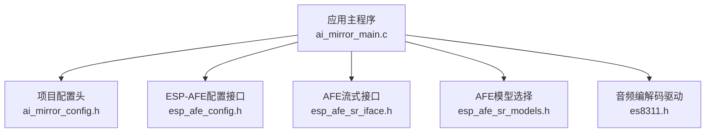
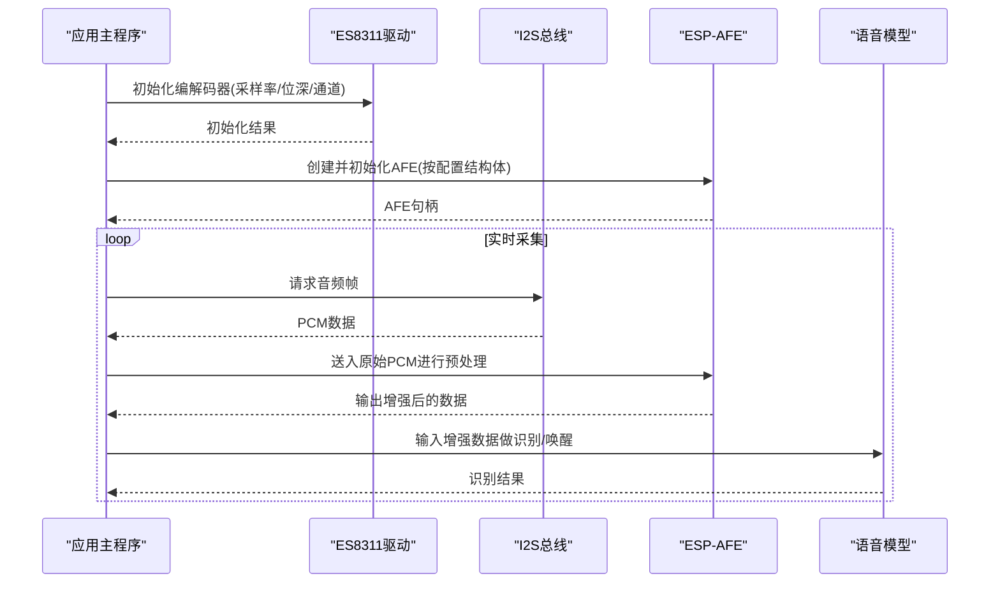
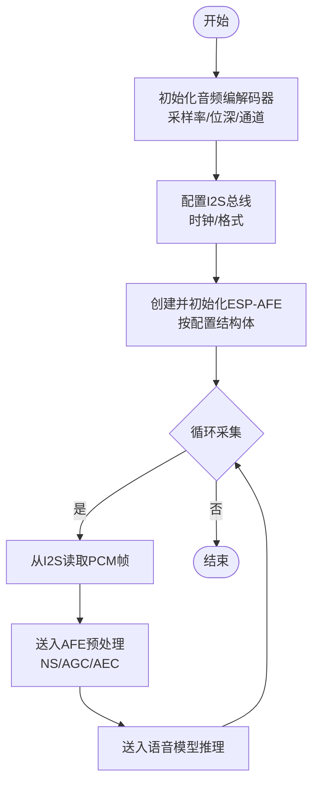
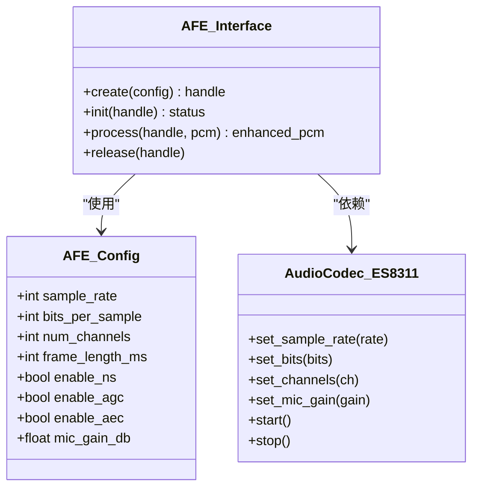
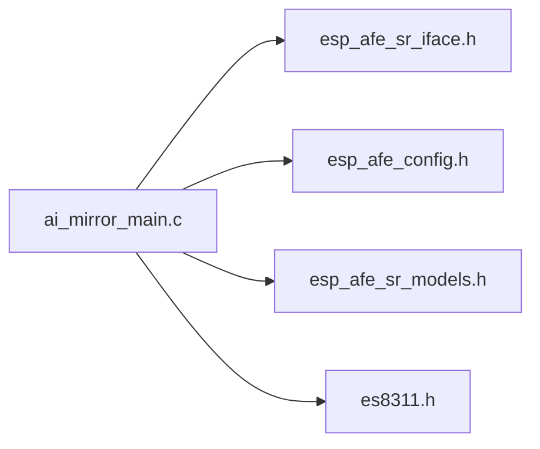

# 音频前端配置

<cite>
**本文引用的文件**   
- [esp_afe_config.h](file://Firmware/esp32_ai_mirror/components/espressif__esp-sr/include/esp32/esp_afe_config.h)
- [esp_afe_sr_iface.h](file://Firmware/esp32_ai_mirror/components/espressif__esp-sr/include/esp32/esp_afe_sr_iface.h)
- [esp_afe_sr_models.h](file://Firmware/esp32_ai_mirror/components/espressif__esp-sr/include/esp32/esp_afe_sr_models.h)
- [ai_mirror_main.c](file://Firmware/esp32_ai_mirror/main/ai_mirror_main.c)
- [ai_mirror_config.h](file://Firmware/esp32_ai_mirror/main/ai_mirror_config.h)
- [es8311.h](file://Firmware/esp32_ai_mirror/managed_components/espressif__es8311/include/es8311.h)
- [audio_front_end.rst](file://Firmware/esp32_ai_mirror/components/espressif__esp-sr/docs/en/audio_front_end/audio_front_end.rst)
</cite>

## 目录
1. [简介](#简介)
2. [项目结构](#项目结构)
3. [核心组件](#核心组件)
4. [架构总览](#架构总览)
5. [详细组件分析](#详细组件分析)
6. [依赖关系分析](#依赖关系分析)
7. [性能考虑](#性能考虑)
8. [故障排查指南](#故障排查指南)
9. [结论](#结论)
10. [附录](#附录)

## 简介
本文件面向ESP-AFE（Audio Front End）在ESP-SR中的使用，聚焦“音频前端配置”。内容涵盖：
- 配置结构体与关键参数（采样率、位深度、通道数等）
- 单麦克风与多麦克风阵列的配置差异（布局、增益、降噪/回声消除开关）
- 不同硬件平台（如ES8311编解码器、I2S接口）的适配要点
- 典型应用场景的最佳实践配置建议
- 完整可运行的配置示例路径（以源码引用形式给出）

## 项目结构
本项目中，ESP-AFE相关头文件位于ESP-SR组件的include目录；应用层入口在main目录；音频编解码驱动位于managed_components下的es8311组件。文档将围绕这些位置展开。

图表来源
- [ai_mirror_main.c](file://Firmware/esp32_ai_mirror/main/ai_mirror_main.c)
- [ai_mirror_config.h](file://Firmware/esp32_ai_mirror/main/ai_mirror_config.h)
- [esp_afe_config.h](file://Firmware/esp32_ai_mirror/components/espressif__esp-sr/include/esp32/esp_afe_config.h)
- [esp_afe_sr_iface.h](file://Firmware/esp32_ai_mirror/components/espressif__esp-sr/include/esp32/esp_afe_sr_iface.h)
- [esp_afe_sr_models.h](file://Firmware/esp32_ai_mirror/components/espressif__esp-sr/include/esp32/esp_afe_sr_models.h)
- [es8311.h](file://Firmware/esp32_ai_mirror/managed_components/espressif__es8311/include/es8311.h)

章节来源
- [esp_afe_config.h](file://Firmware/esp32_ai_mirror/components/espressif__esp-sr/include/esp32/esp_afe_config.h)
- [esp_afe_sr_iface.h](file://Firmware/esp32_ai_mirror/components/espressif__esp-sr/include/esp32/esp_afe_sr_iface.h)
- [esp_afe_sr_models.h](file://Firmware/esp32_ai_mirror/components/espressif__esp-sr/include/esp32/esp_afe_sr_models.h)
- [ai_mirror_main.c](file://Firmware/esp32_ai_mirror/main/ai_mirror_main.c)
- [ai_mirror_config.h](file://Firmware/esp32_ai_mirror/main/ai_mirror_config.h)
- [es8311.h](file://Firmware/esp32_ai_mirror/managed_components/espressif__es8311/include/es8311.h)

## 核心组件
- ESP-AFE配置结构体与枚举：定义采样率、位深度、通道数、帧长、窗口类型、噪声抑制/回声消除开关、AGC等。
- AFE流式接口：提供创建、初始化、获取数据、释放等生命周期管理。
- AFE模型选择：根据场景（唤醒、命令识别、远场语音）选择对应模型与参数集。
- 音频驱动（ES8311）：负责I2S与ADC/DAC配置、增益、静音控制等。

章节来源
- [esp_afe_config.h](file://Firmware/esp32_ai_mirror/components/espressif__esp-sr/include/esp32/esp_afe_config.h)
- [esp_afe_sr_iface.h](file://Firmware/esp32_ai_mirror/components/espressif__esp-sr/include/esp32/esp_afe_sr_iface.h)
- [esp_afe_sr_models.h](file://Firmware/esp32_ai_mirror/components/espressif__esp-sr/include/esp32/esp_afe_sr_models.h)
- [es8311.h](file://Firmware/esp32_ai_mirror/managed_components/espressif__es8311/include/es8311.h)

## 架构总览
下图展示从应用到音频采集、AFE处理、模型推理的整体流程。

图表来源
- [ai_mirror_main.c](file://Firmware/esp32_ai_mirror/main/ai_mirror_main.c)
- [es8311.h](file://Firmware/esp32_ai_mirror/managed_components/espressif__es8311/include/es8311.h)
- [esp_afe_sr_iface.h](file://Firmware/esp32_ai_mirror/components/espressif__esp-sr/include/esp32/esp_afe_sr_iface.h)
- [esp_afe_sr_models.h](file://Firmware/esp32_ai_mirror/components/espressif__esp-sr/include/esp32/esp_afe_sr_models.h)

## 详细组件分析

### ESP-AFE配置结构体与关键参数
- 采样率：需与I2S/编解码器一致，常见为16kHz或8kHz。
- 位深度：通常16-bit；与I2S和后续DSP保持一致。
- 通道数：单麦=1，双麦/四麦阵列=2/4；影响AEC/NS/波束成形等能力。
- 帧长与窗口：决定FFT粒度与延迟；常用20ms/10ms。
- 功能开关：噪声抑制(NS)、自动增益控制(AGC)、回声消除(AEC)。
- 模型与模式：区分唤醒、命令识别、连续识别等。

章节来源
- [esp_afe_config.h](file://Firmware/esp32_ai_mirror/components/espressif__esp-sr/include/esp32/esp_afe_config.h)
- [esp_afe_sr_iface.h](file://Firmware/esp32_ai_mirror/components/espressif__esp-sr/include/esp32/esp_afe_sr_iface.h)
- [esp_afe_sr_models.h](file://Firmware/esp32_ai_mirror/components/espressif__esp-sr/include/esp32/esp_afe_sr_models.h)

### 单麦克风与多麦克风阵列配置
- 单麦克风
  - 通道数=1，启用NS/AGC即可满足一般近场需求。
  - 无需AEC（除非有内置扬声器且存在串扰）。
- 多麦克风阵列
  - 通道数=2/4，启用NS、AGC，必要时开启AEC。
  - 需设置麦克风布局参数（间距、方位），用于波束成形与声源定位。
  - 各通道增益可独立设置，以补偿硬件差异。

章节来源
- [esp_afe_config.h](file://Firmware/esp32_ai_mirror/components/espressif__esp-sr/include/esp32/esp_afe_config.h)
- [esp_afe_sr_iface.h](file://Firmware/esp32_ai_mirror/components/espressif__esp-sr/include/esp32/esp_afe_sr_iface.h)

### 音频驱动与I2S配置（以ES8311为例）
- 采样率/位深/通道：与AFE配置严格对齐。
- 增益：MIC PGA增益、线路输入增益需合理设置，避免削波。
- 时钟：MCLK/BCLK/LRCK与MCU I2S匹配。
- 电源与时序：确保上电顺序与复位时序正确。

章节来源
- [es8311.h](file://Firmware/esp32_ai_mirror/managed_components/espressif__es8311/include/es8311.h)
- [ai_mirror_main.c](file://Firmware/esp32_ai_mirror/main/ai_mirror_main.c)

### 配置流程图（端到端）

图表来源
- [ai_mirror_main.c](file://Firmware/esp32_ai_mirror/main/ai_mirror_main.c)
- [esp_afe_sr_iface.h](file://Firmware/esp32_ai_mirror/components/espressif__esp-sr/include/esp32/esp_afe_sr_iface.h)
- [es8311.h](file://Firmware/esp32_ai_mirror/managed_components/espressif__es8311/include/es8311.h)

### 类图（概念映射）

图表来源
- [esp_afe_config.h](file://Firmware/esp32_ai_mirror/components/espressif__esp-sr/include/esp32/esp_afe_config.h)
- [esp_afe_sr_iface.h](file://Firmware/esp32_ai_mirror/components/espressif__esp-sr/include/esp32/esp_afe_sr_iface.h)
- [es8311.h](file://Firmware/esp32_ai_mirror/managed_components/espressif__es8311/include/es8311.h)

## 依赖关系分析
- 应用层通过ai_mirror_main.c组织初始化流程，调用ESP-AFE接口与音频驱动。
- ESP-AFE依赖配置结构体与模型选择，二者由esp_afe_config.h与esp_afe_sr_models.h定义。
- 音频驱动es8311.h提供底层I2S/ADC配置，必须与AFE参数一致。

图表来源
- [ai_mirror_main.c](file://Firmware/esp32_ai_mirror/main/ai_mirror_main.c)
- [esp_afe_sr_iface.h](file://Firmware/esp32_ai_mirror/components/espressif__esp-sr/include/esp32/esp_afe_sr_iface.h)
- [esp_afe_config.h](file://Firmware/esp32_ai_mirror/components/espressif__esp-sr/include/esp32/esp_afe_config.h)
- [esp_afe_sr_models.h](file://Firmware/esp32_ai_mirror/components/espressif__esp-sr/include/esp32/esp_afe_sr_models.h)
- [es8311.h](file://Firmware/esp32_ai_mirror/managed_components/espressif__es8311/include/es8311.h)

章节来源
- [ai_mirror_main.c](file://Firmware/esp32_ai_mirror/main/ai_mirror_main.c)
- [esp_afe_sr_iface.h](file://Firmware/esp32_ai_mirror/components/espressif__esp-sr/include/esp32/esp_afe_sr_iface.h)
- [esp_afe_config.h](file://Firmware/esp32_ai_mirror/components/espressif__esp-sr/include/esp32/esp_afe_config.h)
- [esp_afe_sr_models.h](file://Firmware/esp32_ai_mirror/components/espressif__esp-sr/include/esp32/esp_afe_sr_models.h)
- [es8311.h](file://Firmware/esp32_ai_mirror/managed_components/espressif__es8311/include/es8311.h)

## 性能考虑
- 采样率与帧长：16kHz+20ms是平衡精度与延迟的常用组合；低延迟可用10ms。
- 位深度：16-bit保证动态范围，避免过高的量化噪声。
- 通道数：多通道提升NS/AEC效果，但增加CPU与内存占用。
- 功能开关：NS/AGC/AEC按需开启，避免不必要的计算开销。
- 内存与缓存：合理分配缓冲区，减少拷贝与碎片化。

[本节为通用指导，不直接分析具体文件]

## 故障排查指南
- 无声音/无声
  - 检查I2S时钟与编解码器配置是否一致。
  - 确认MIC增益未设置为最小或静音。
- 声音失真/削波
  - 降低MIC PGA增益或调整输入电平。
  - 检查AGC是否过强导致峰值压缩。
- 回声/啸叫
  - 开启AEC并确保参考声道正确接入。
  - 调整扬声器与麦克风距离与指向。
- 识别率低
  - 验证采样率、位深、通道数与模型要求一致。
  - 优化NS/AGC参数，避免过度抑制。

章节来源
- [esp_afe_config.h](file://Firmware/esp32_ai_mirror/components/espressif__esp-sr/include/esp32/esp_afe_config.h)
- [esp_afe_sr_iface.h](file://Firmware/esp32_ai_mirror/components/espressif__esp-sr/include/esp32/esp_afe_sr_iface.h)
- [es8311.h](file://Firmware/esp32_ai_mirror/managed_components/espressif__es8311/include/es8311.h)
- [ai_mirror_main.c](file://Firmware/esp32_ai_mirror/main/ai_mirror_main.c)

## 结论
ESP-AFE的配置关键在于“参数一致性”与“场景适配”。采样率、位深、通道数必须在驱动、I2S与AFE间保持一致；根据单麦/多麦场景选择合适的NS/AGC/AEC与增益策略；结合硬件平台特性（如ES8311）调优以获得最佳识别体验。

[本节为总结性内容，不直接分析具体文件]

## 附录

### 配置示例与参考
- 单麦克风近场语音识别
  - 采样率：16kHz；位深：16bit；通道：1；帧长：20ms；开启NS/AGC；关闭AEC。
  - 参考实现路径：[ai_mirror_main.c](file://Firmware/esp32_ai_mirror/main/ai_mirror_main.c)
- 双麦克风阵列远场语音识别
  - 采样率：16kHz；位深：16bit；通道：2；帧长：20ms；开启NS/AGC/AEC；设置麦克风间距与方位。
  - 参考实现路径：[esp_afe_sr_models.h](file://Firmware/esp32_ai_mirror/components/espressif__esp-sr/include/esp32/esp_afe_sr_models.h)
- 低功耗唤醒
  - 采样率：8kHz或16kHz；位深：16bit；通道：1或2；帧长：10~20ms；仅开启NS/AGC。
  - 参考实现路径：[esp_afe_sr_models.h](file://Firmware/esp32_ai_mirror/components/espressif__esp-sr/include/esp32/esp_afe_sr_models.h)

章节来源
- [ai_mirror_main.c](file://Firmware/esp32_ai_mirror/main/ai_mirror_main.c)
- [esp_afe_sr_models.h](file://Firmware/esp32_ai_mirror/components/espressif__esp-sr/include/esp32/esp_afe_sr_models.h)
- [esp_afe_config.h](file://Firmware/esp32_ai_mirror/components/espressif__esp-sr/include/esp32/esp_afe_config.h)
- [esp_afe_sr_iface.h](file://Firmware/esp32_ai_mirror/components/espressif__esp-sr/include/esp32/esp_afe_sr_iface.h)
- [es8311.h](file://Firmware/esp32_ai_mirror/managed_components/espressif__es8311/include/es8311.h)

### 官方文档参考
- ESP-SR音频前端文档（英文）
  - 参考路径：[audio_front_end.rst](file://Firmware/esp32_ai_mirror/components/espressif__esp-sr/docs/en/audio_front_end/audio_front_end.rst)

章节来源
- [audio_front_end.rst](file://Firmware/esp32_ai_mirror/components/espressif__esp-sr/docs/en/audio_front_end/audio_front_end.rst)