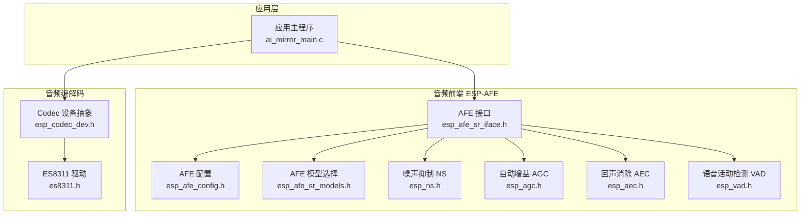
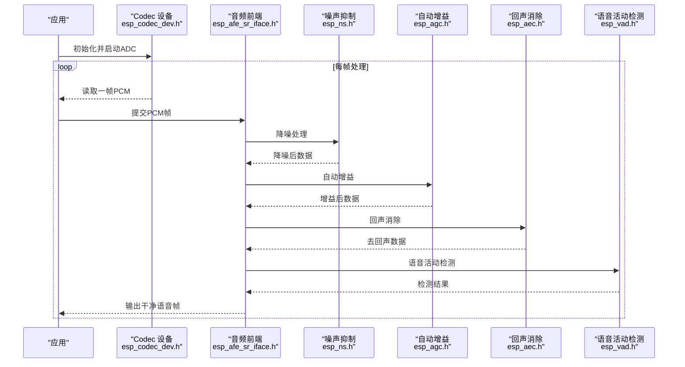
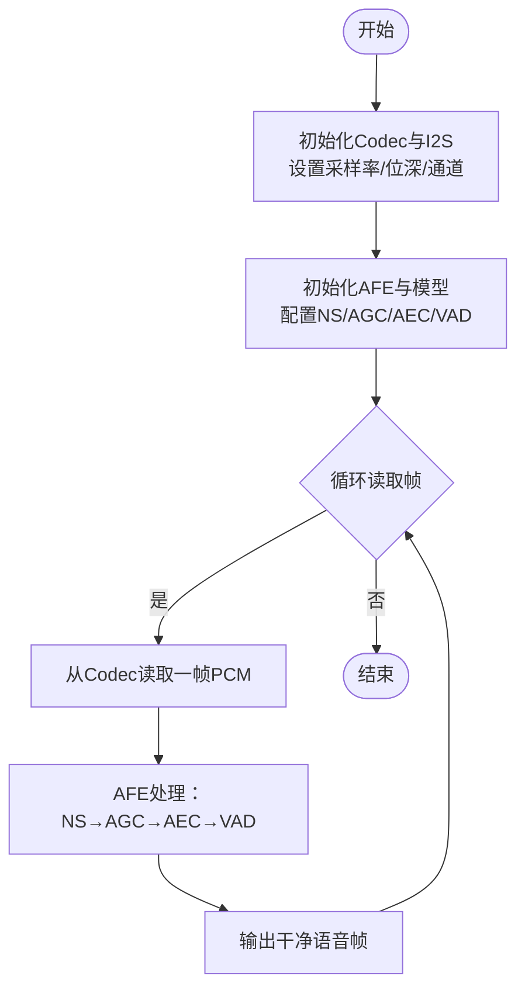
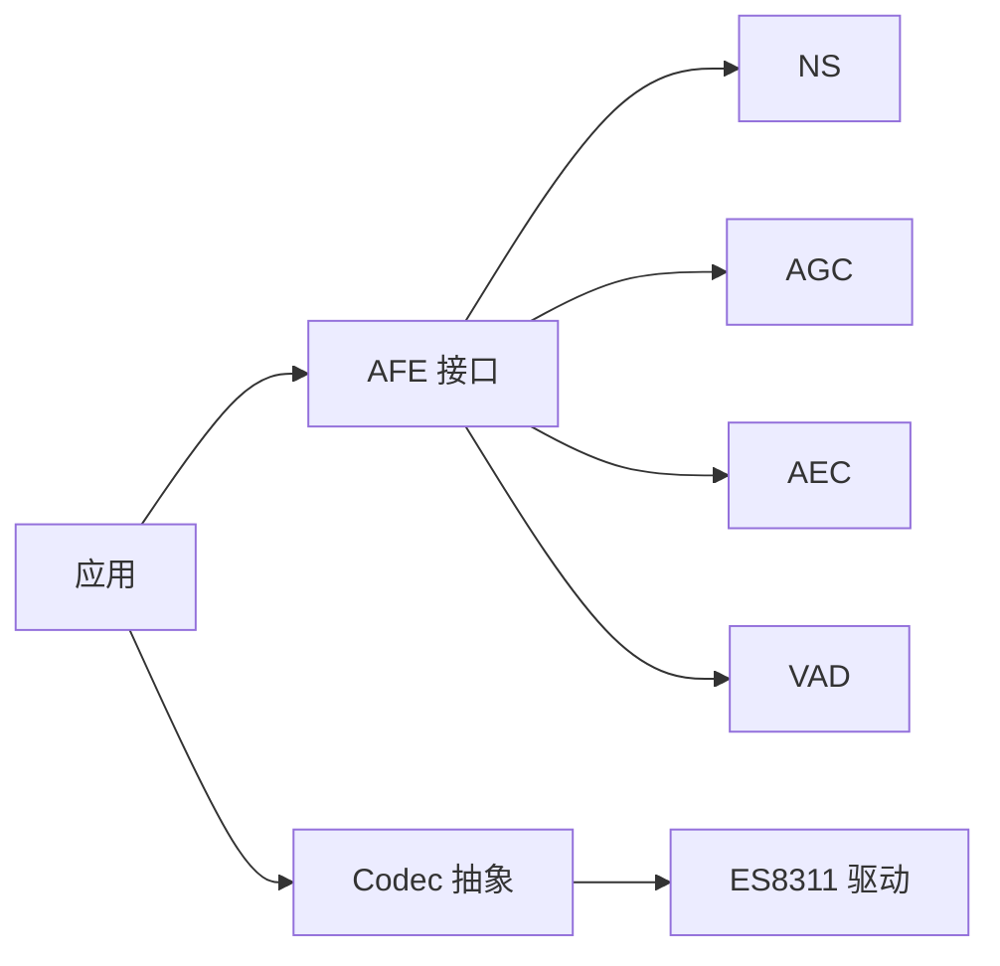

# 音频处理API

<cite>
**本文引用的文件**   
- [esp_afe_config.h](file://Firmware/esp32_ai_mirror/components/espressif__esp-sr/include/esp32s3/esp_afe_config.h)
- [esp_afe_sr_iface.h](file://Firmware/esp32_ai_mirror/components/espressif__esp-sr/include/esp32s3/esp_afe_sr_iface.h)
- [esp_ns.h](file://Firmware/esp32_ai_mirror/components/espressif__esp-sr/include/esp32s3/esp_ns.h)
- [esp_agc.h](file://Firmware/esp32_ai_mirror/components/espressif__esp-sr/include/esp32s3/esp_agc.h)
- [esp_aec.h](file://Firmware/esp32_ai_mirror/components/espressif__esp-sr/include/esp32s3/esp_aec.h)
- [esp_vad.h](file://Firmware/esp32_ai_mirror/components/espressif__esp-sr/include/esp32s3/esp_vad.h)
- [esp_afe_sr_models.h](file://Firmware/esp32_ai_mirror/components/espressif__esp-sr/include/esp32s3/esp_afe_sr_models.h)
- [esp_mn_iface.h](file://Firmware/esp32_ai_mirror/components/espressif__esp-sr/include/esp32/esp_mn_iface.h)
- [ai_mirror_main.c](file://Firmware/esp32_ai_mirror/main/ai_mirror_main.c)
- [es8311.h](file://Firmware/esp32_ai_mirror/managed_components/espressif__es8311/include/es8311.h)
- [esp_codec_dev.h](file://Firmware/esp32_ai_mirror/managed_components/espressif__esp_codec_dev/include/esp_codec_dev.h)
</cite>

## 目录
1. [简介](#简介)
2. [项目结构](#项目结构)
3. [核心组件](#核心组件)
4. [架构总览](#架构总览)
5. [详细组件分析](#详细组件分析)
6. [依赖关系分析](#依赖关系分析)
7. [性能考虑](#性能考虑)
8. [故障排查指南](#故障排查指南)
9. [结论](#结论)
10. [附录](#附录)

## 简介
本文件面向ESP-AFE（Audio Front End）音频前端库的API使用与集成，覆盖噪声抑制(NS)、自动增益控制(AGC)、回声消除(AEC)、语音活动检测(VAD)等关键能力。文档重点说明：
- ESP-AFE接口函数与配置参数的使用方法
- 采样率、位深度、通道数等音频参数设置
- 单麦克风与多麦克风阵列的差异与配置要点
- 高质量音频采集与预处理的完整流程示例
- 不同硬件平台的适配方法与性能调优策略

## 项目结构
本项目在ESP-IDF框架下组织，ESP-AFE相关头文件位于components/espressif__esp-sr/include目录下，按目标平台分别提供esp32与esp32s3两套接口定义；音频编解码驱动位于managed_components下的es8311与esp_codec_dev组件中；应用入口位于main目录。

图表来源
- [esp_afe_sr_iface.h](file://Firmware/esp32_ai_mirror/components/espressif__esp-sr/include/esp32s3/esp_afe_sr_iface.h)
- [esp_afe_config.h](file://Firmware/esp32_ai_mirror/components/espressif__esp-sr/include/esp32s3/esp_afe_config.h)
- [esp_afe_sr_models.h](file://Firmware/esp32_ai_mirror/components/espressif__esp-sr/include/esp32s3/esp_afe_sr_models.h)
- [esp_ns.h](file://Firmware/esp32_ai_mirror/components/espressif__esp-sr/include/esp32s3/esp_ns.h)
- [esp_agc.h](file://Firmware/esp32_ai_mirror/components/espressif__esp-sr/include/esp32s3/esp_agc.h)
- [esp_aec.h](file://Firmware/esp32_ai_mirror/components/espressif__esp-sr/include/esp32s3/esp_aec.h)
- [esp_vad.h](file://Firmware/esp32_ai_mirror/components/espressif__esp-sr/include/esp32s3/esp_vad.h)
- [esp_codec_dev.h](file://Firmware/esp32_ai_mirror/managed_components/espressif__esp_codec_dev/include/esp_codec_dev.h)
- [es8311.h](file://Firmware/esp32_ai_mirror/managed_components/espressif__es8311/include/es8311.h)
- [ai_mirror_main.c](file://Firmware/esp32_ai_mirror/main/ai_mirror_main.c)

章节来源
- [ai_mirror_main.c](file://Firmware/esp32_ai_mirror/main/ai_mirror_main.c)
- [esp_afe_sr_iface.h](file://Firmware/esp32_ai_mirror/components/espressif__esp-sr/include/esp32s3/esp_afe_sr_iface.h)
- [esp_afe_config.h](file://Firmware/esp32_ai_mirror/components/espressif__esp-sr/include/esp32s3/esp_afe_config.h)
- [esp_codec_dev.h](file://Firmware/esp32_ai_mirror/managed_components/espressif__esp_codec_dev/include/esp_codec_dev.h)
- [es8311.h](file://Firmware/esp32_ai_mirror/managed_components/espressif__es8311/include/es8311.h)

## 核心组件
- AFE 接口与配置
  - esp_afe_sr_iface.h：定义音频前端统一接口，包括初始化、数据帧处理、资源释放等生命周期方法。
  - esp_afe_config.h：集中管理音频前端的配置项，如采样率、位深、通道数、算法模块开关、缓冲区大小等。
  - esp_afe_sr_models.h：提供不同场景的模型选择与切换接口，便于根据硬件与需求选择最优实现。
- 音频处理模块
  - esp_ns.h：噪声抑制接口，用于降低环境噪声对语音的影响。
  - esp_agc.h：自动增益控制接口，动态调整输入音量，避免削波或过低电平。
  - esp_aec.h：回声消除接口，消除扬声器播放信号对麦克风的回声干扰。
  - esp_vad.h：语音活动检测接口，快速判断是否有人声，减少后续处理开销。
- 音频编解码
  - esp_codec_dev.h：统一的音频设备抽象层，屏蔽底层I2S/Codec差异。
  - es8311.h：具体Codec芯片驱动，负责ADC/DAC、时钟、增益等寄存器配置。

章节来源
- [esp_afe_sr_iface.h](file://Firmware/esp32_ai_mirror/components/espressif__esp-sr/include/esp32s3/esp_afe_sr_iface.h)
- [esp_afe_config.h](file://Firmware/esp32_ai_mirror/components/espressif__esp-sr/include/esp32s3/esp_afe_config.h)
- [esp_afe_sr_models.h](file://Firmware/esp32_ai_mirror/components/espressif__esp-sr/include/esp32s3/esp_afe_sr_models.h)
- [esp_ns.h](file://Firmware/esp32_ai_mirror/components/espressif__esp-sr/include/esp32s3/esp_ns.h)
- [esp_agc.h](file://Firmware/esp32_ai_mirror/components/espressif__esp-sr/include/esp32s3/esp_agc.h)
- [esp_aec.h](file://Firmware/esp32_ai_mirror/components/espressif__esp-sr/include/esp32s3/esp_aec.h)
- [esp_vad.h](file://Firmware/esp32_ai_mirror/components/espressif__esp-sr/include/esp32s3/esp_vad.h)
- [esp_codec_dev.h](file://Firmware/esp32_ai_mirror/managed_components/espressif__esp_codec_dev/include/esp_codec_dev.h)
- [es8311.h](file://Firmware/esp32_ai_mirror/managed_components/espressif__es8311/include/es8311.h)

## 架构总览
ESP-AFE作为音频前端管线，将底层音频采集与上层语音识别解耦。典型数据流如下：
- 应用通过esp_codec_dev从I2S读取PCM帧
- 将PCM帧送入AFE进行NS、AGC、AEC、VAD等处理
- 输出干净语音帧供上层ASR/WakeNet等模块使用

图表来源
- [esp_afe_sr_iface.h](file://Firmware/esp32_ai_mirror/components/espressif__esp-sr/include/esp32s3/esp_afe_sr_iface.h)
- [esp_ns.h](file://Firmware/esp32_ai_mirror/components/espressif__esp-sr/include/esp32s3/esp_ns.h)
- [esp_agc.h](file://Firmware/esp32_ai_mirror/components/espressif__esp-sr/include/esp32s3/esp_agc.h)
- [esp_aec.h](file://Firmware/esp32_ai_mirror/components/espressif__esp-sr/include/esp32s3/esp_aec.h)
- [esp_vad.h](file://Firmware/esp32_ai_mirror/components/espressif__esp-sr/include/esp32s3/esp_vad.h)
- [esp_codec_dev.h](file://Firmware/esp32_ai_mirror/managed_components/espressif__esp_codec_dev/include/esp_codec_dev.h)

## 详细组件分析

### AFE 接口与配置
- 初始化与生命周期
  - 通过接口创建AFE实例，传入配置结构与模型选择
  - 开始处理循环，逐帧调用处理函数
  - 结束时释放资源
- 配置参数要点
  - 采样率：通常16kHz，需与Codec一致
  - 位深度：16bit常见，保证精度与内存平衡
  - 通道数：单麦为1，多麦阵列可为2/4/更多
  - 缓冲区：根据帧长与延迟要求设置
  - 算法开关：按需启用NS/AGC/AEC/VAD
- 模型选择
  - 依据硬件平台与场景选择对应模型，确保最佳性能与效果

章节来源
- [esp_afe_sr_iface.h](file://Firmware/esp32_ai_mirror/components/espressif__esp-sr/include/esp32s3/esp_afe_sr_iface.h)
- [esp_afe_config.h](file://Firmware/esp32_ai_mirror/components/espressif__esp-sr/include/esp32s3/esp_afe_config.h)
- [esp_afe_sr_models.h](file://Firmware/esp32_ai_mirror/components/espressif__esp-sr/include/esp32s3/esp_afe_sr_models.h)

### 噪声抑制 NS
- 功能：抑制背景噪声，提升信噪比
- 适用场景：室内会议、车载、户外等复杂声学环境
- 配置建议：根据噪声类型与强度调节阈值与平滑参数

章节来源
- [esp_ns.h](file://Firmware/esp32_ai_mirror/components/espressif__esp-sr/include/esp32s3/esp_ns.h)

### 自动增益控制 AGC
- 功能：动态调整输入增益，保持语音电平稳定
- 适用场景：远场拾音、音量波动大的环境
- 配置建议：限制最大增益与压缩比，避免放大噪声

章节来源
- [esp_agc.h](file://Firmware/esp32_ai_mirror/components/espressif__esp-sr/include/esp32s3/esp_agc.h)

### 回声消除 AEC
- 功能：消除扬声器播放信号对麦克风的回声
- 适用场景：智能音箱、车载通话等全双工场景
- 配置建议：合理设置参考通道与延迟补偿

章节来源
- [esp_aec.h](file://Firmware/esp32_ai_mirror/components/espressif__esp-sr/include/esp32s3/esp_aec.h)

### 语音活动检测 VAD
- 功能：快速判断是否有人声，降低无效数据处理
- 适用场景：低功耗监听、唤醒词前置过滤
- 配置建议：权衡误检与漏检，结合上下文使用

章节来源
- [esp_vad.h](file://Firmware/esp32_ai_mirror/components/espressif__esp-sr/include/esp32s3/esp_vad.h)

### 音频编解码与硬件适配
- esp_codec_dev：统一抽象ADC/DAC、I2S、时钟、增益等
- es8311：具体Codec驱动，负责寄存器配置与数据通路
- 适配要点：
  - 采样率与位深需与AFE一致
  - I2S格式与时序匹配
  - 多通道映射到AFE期望的通道顺序

章节来源
- [esp_codec_dev.h](file://Firmware/esp32_ai_mirror/managed_components/espressif__esp_codec_dev/include/esp_codec_dev.h)
- [es8311.h](file://Firmware/esp32_ai_mirror/managed_components/espressif__es8311/include/es8311.h)

### 单麦克风与多麦克风阵列配置差异
- 单麦克风
  - 通道数为1
  - 主要依赖NS/AGC/VAD提升质量
  - 配置简单，资源占用低
- 多麦克风阵列
  - 通道数≥2，支持波束形成与空间滤波
  - 可开启AEC，利用参考通道消除回声
  - 需要更精细的通道对齐与延迟校准

章节来源
- [esp_afe_config.h](file://Firmware/esp32_ai_mirror/components/espressif__esp-sr/include/esp32s3/esp_afe_config.h)
- [esp_afe_sr_iface.h](file://Firmware/esp32_ai_mirror/components/espressif__esp-sr/include/esp32s3/esp_afe_sr_iface.h)

### 音频预处理完整示例流程
以下流程图展示从硬件采集到前端处理的端到端步骤，适用于单麦与多麦场景：

[本图为概念性流程图，不直接映射具体源码文件]

## 依赖关系分析
ESP-AFE与Codec驱动之间存在清晰的依赖边界：
- 应用层依赖AFE接口
- AFE依赖各算法模块（NS/AGC/AEC/VAD）
- 应用层依赖Codec抽象层
- Codec抽象层依赖具体驱动（如es8311）

图表来源
- [esp_afe_sr_iface.h](file://Firmware/esp32_ai_mirror/components/espressif__esp-sr/include/esp32s3/esp_afe_sr_iface.h)
- [esp_ns.h](file://Firmware/esp32_ai_mirror/components/espressif__esp-sr/include/esp32s3/esp_ns.h)
- [esp_agc.h](file://Firmware/esp32_ai_mirror/components/espressif__esp-sr/include/esp32s3/esp_agc.h)
- [esp_aec.h](file://Firmware/esp32_ai_mirror/components/espressif__esp-sr/include/esp32s3/esp_aec.h)
- [esp_vad.h](file://Firmware/esp32_ai_mirror/components/espressif__esp-sr/include/esp32s3/esp_vad.h)
- [esp_codec_dev.h](file://Firmware/esp32_ai_mirror/managed_components/espressif__esp_codec_dev/include/esp_codec_dev.h)
- [es8311.h](file://Firmware/esp32_ai_mirror/managed_components/espressif__es8311/include/es8311.h)

章节来源
- [esp_afe_sr_iface.h](file://Firmware/esp32_ai_mirror/components/espressif__esp-sr/include/esp32s3/esp_afe_sr_iface.h)
- [esp_codec_dev.h](file://Firmware/esp32_ai_mirror/managed_components/espressif__esp_codec_dev/include/esp_codec_dev.h)

## 性能考虑
- 采样率与位深：16kHz/16bit在精度与资源间取得平衡
- 通道数：多麦增加计算与内存开销，需评估CPU与RAM
- 算法开关：仅启用必要模块，减少延迟与功耗
- 缓冲区大小：增大可降低丢帧风险但增加延迟
- 硬件平台：ESP32-S3具备更高算力与DSP加速，适合复杂算法

章节来源
- [esp_afe_config.h](file://Firmware/esp32_ai_mirror/components/espressif__esp-sr/include/esp32s3/esp_afe_config.h)
- [esp_afe_sr_models.h](file://Firmware/esp32_ai_mirror/components/espressif__esp-sr/include/esp32s3/esp_afe_sr_models.h)

## 故障排查指南
- 无声音或声音异常
  - 检查Codec初始化与I2S配置是否正确
  - 确认采样率、位深、通道数与AFE一致
- 回声未消除
  - 检查AEC参考通道连接与延迟设置
  - 验证扬声器与麦克风距离与指向
- 噪声抑制过度或不足
  - 调整NS阈值与平滑参数
  - 观察环境噪声频谱变化
- 自动增益不稳定
  - 限制最大增益与压缩比
  - 检查输入信号电平范围
- VAD误检或漏检
  - 调整灵敏度与窗口长度
  - 结合上下文逻辑过滤

章节来源
- [esp_codec_dev.h](file://Firmware/esp32_ai_mirror/managed_components/espressif__esp_codec_dev/include/esp_codec_dev.h)
- [es8311.h](file://Firmware/esp32_ai_mirror/managed_components/espressif__es8311/include/es8311.h)
- [esp_ns.h](file://Firmware/esp32_ai_mirror/components/espressif__esp-sr/include/esp32s3/esp_ns.h)
- [esp_agc.h](file://Firmware/esp32_ai_mirror/components/espressif__esp-sr/include/esp32s3/esp_agc.h)
- [esp_aec.h](file://Firmware/esp32_ai_mirror/components/espressif__esp-sr/include/esp32s3/esp_aec.h)
- [esp_vad.h](file://Firmware/esp32_ai_mirror/components/espressif__esp-sr/include/esp32s3/esp_vad.h)

## 结论
ESP-AFE提供了完整的音频前端处理能力，涵盖NS、AGC、AEC、VAD等关键模块。通过合理的配置与硬件适配，可在不同平台上实现高质量的音频采集与处理。建议根据应用场景选择合适的模型与参数，并进行充分的测试与调优。

## 附录
- 常用配置参数速查
  - 采样率：16kHz
  - 位深度：16bit
  - 通道数：单麦1，多麦2/4
  - 缓冲区：根据帧长与延迟设定
  - 算法开关：按需启用
- 平台适配要点
  - ESP32：基础能力，适合轻量场景
  - ESP32-S3：更强算力，适合复杂算法与多麦阵列

章节来源
- [esp_afe_config.h](file://Firmware/esp32_ai_mirror/components/espressif__esp-sr/include/esp32s3/esp_afe_config.h)
- [esp_afe_sr_models.h](file://Firmware/esp32_ai_mirror/components/espressif__esp-sr/include/esp32s3/esp_afe_sr_models.h)