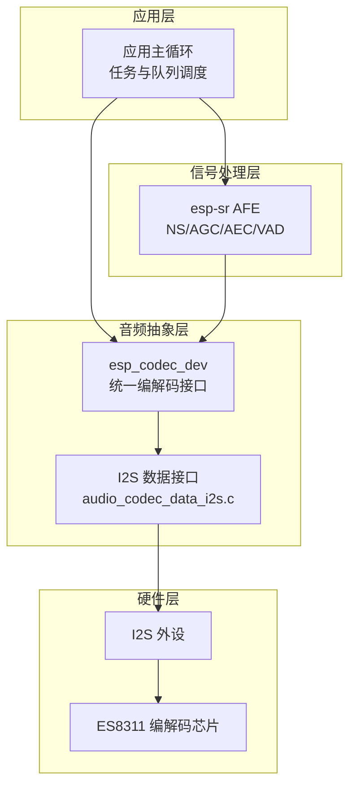
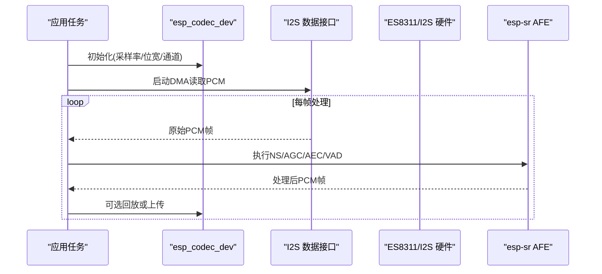
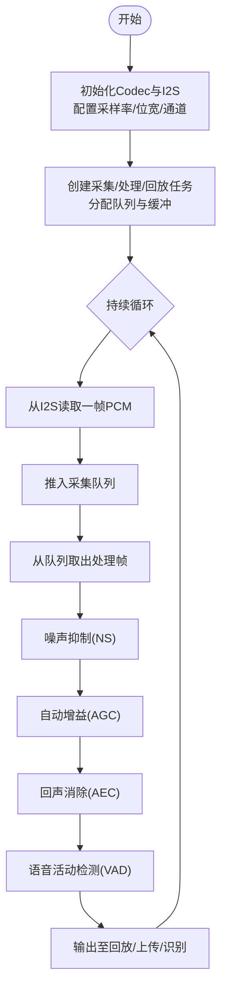
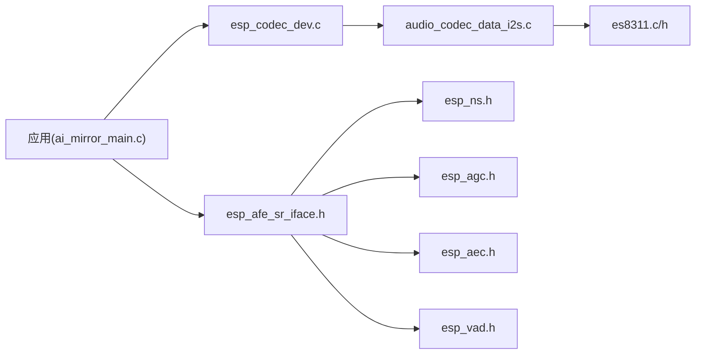

# 音频处理流水线

<cite>
**本文引用的文件**   
- [ai_mirror_main.c](file://Firmware/esp32_ai_mirror/main/ai_mirror_main.c)
- [ai_mirror_config.h](file://Firmware/esp32_ai_mirror/main/ai_mirror_config.h)
- [es8311.c](file://Firmware/esp32_ai_mirror/managed_components/espressif__es8311/es8311.c)
- [es8311.h](file://Firmware/esp32_ai_mirror/managed_components/espressif__es8311/include/es8311.h)
- [audio_codec_data_i2s.c](file://Firmware/esp32_ai_mirror/managed_components/espressif__esp_codec_dev/platform/audio_codec_data_i2s.c)
- [esp_codec_dev.c](file://Firmware/esp32_ai_mirror/managed_components/espressif__esp_codec_dev/esp_codec_dev.c)
- [esp_afe_sr_iface.h](file://Firmware/esp32_ai_mirror/components/espressif__esp-sr/include/esp_afe_sr_iface.h)
- [esp_ns.h](file://Firmware/esp32_ai_mirror/components/espressif__esp-sr/include/esp_ns.h)
- [esp_agc.h](file://Firmware/esp32_ai_mirror/components/espressif__esp-sr/include/esp_agc.h)
- [esp_aec.h](file://Firmware/esp32_ai_mirror/components/espressif__esp-sr/include/esp_aec.h)
- [esp_vad.h](file://Firmware/esp32_ai_mirror/components/espressif__esp-sr/include/esp_vad.h)
- [README.md](file://Firmware/esp32_ai_mirror/README.md)
</cite>

## 目录
1. [简介](#简介)
2. [项目结构](#项目结构)
3. [核心组件](#核心组件)
4. [架构总览](#架构总览)
5. [详细组件分析](#详细组件分析)
6. [依赖关系分析](#依赖关系分析)
7. [性能考量](#性能考量)
8. [故障排查指南](#故障排查指南)
9. [结论](#结论)
10. [附录](#附录)

## 简介
本文件面向ESP32平台的音频处理流水线，系统化阐述从采集到处理的完整数据流与模块串联方式，覆盖缓冲管理、线程同步、实时性策略，并给出集成噪声抑制（NS）、自动增益控制（AGC）、回声消除（AEC）等功能的实现示例。文档同时提供性能监控与调试技巧，帮助在资源受限的嵌入式环境中稳定运行高吞吐、低延迟的音频链路。

## 项目结构
本项目基于ESP-IDF构建，音频子系统由以下关键部分组成：
- 应用入口与任务编排：main 应用负责初始化硬件、创建任务与队列、调度音频采集与处理流程。
- 编解码器驱动：通过 esp_codec_dev 抽象层与 I2S 数据接口对接 ES8311 音频编解码芯片。
- 前端信号处理：esp-sr 提供的 AFE（Audio Front End）能力，包括 NS、AGC、AEC、VAD 等模块接口。
- 配置与常量：采样率、缓冲区大小、I2S 引脚、处理帧长等参数集中管理。

图表来源
- [ai_mirror_main.c](file://Firmware/esp32_ai_mirror/main/ai_mirror_main.c)
- [esp_codec_dev.c](file://Firmware/esp32_ai_mirror/managed_components/espressif__esp_codec_dev/esp_codec_dev.c)
- [audio_codec_data_i2s.c](file://Firmware/esp32_ai_mirror/managed_components/espressif__esp_codec_dev/platform/audio_codec_data_i2s.c)
- [es8311.c](file://Firmware/esp32_ai_mirror/managed_components/espressif__es8311/es8311.c)
- [esp_afe_sr_iface.h](file://Firmware/esp32_ai_mirror/components/espressif__esp-sr/include/esp_afe_sr_iface.h)

章节来源
- [README.md](file://Firmware/esp32_ai_mirror/README.md)
- [ai_mirror_main.c](file://Firmware/esp32_ai_mirror/main/ai_mirror_main.c)
- [ai_mirror_config.h](file://Firmware/esp32_ai_mirror/main/ai_mirror_config.h)

## 核心组件
- 音频采集与播放（Codec + I2S）
  - 通过 esp_codec_dev 统一接口初始化 ADC/DAC、设置采样率、位宽、通道数，使用 I2S 数据接口完成 DMA 传输。
  - ES8311 作为编解码芯片，提供模拟前端与数字接口，需正确配置寄存器与时钟。
- 前端信号处理（AFE）
  - 使用 esp-sr 的 AFE 接口进行 NS、AGC、AEC、VAD 等处理，通常以固定帧长（如 10ms/20ms）为单位处理 PCM 数据。
- 任务与队列
  - 采集任务负责从 I2S 读取原始 PCM，放入队列；处理任务从队列取帧，依次执行 NS→AGC→AEC→VAD，输出结果供上层使用。
- 配置管理
  - 采样率、帧长、缓冲区大小、I2S 引脚、处理模式等集中在配置文件，便于在不同板级间复用。

章节来源
- [esp_codec_dev.c](file://Firmware/esp32_ai_mirror/managed_components/espressif__esp_codec_dev/esp_codec_dev.c)
- [audio_codec_data_i2s.c](file://Firmware/esp32_ai_mirror/managed_components/espressif__esp_codec_dev/platform/audio_codec_data_i2s.c)
- [es8311.c](file://Firmware/esp32_ai_mirror/managed_components/espressif__es8311/es8311.c)
- [es8311.h](file://Firmware/esp32_ai_mirror/managed_components/espressif__es8311/include/es8311.h)
- [esp_afe_sr_iface.h](file://Firmware/esp32_ai_mirror/components/espressif__esp-sr/include/esp_afe_sr_iface.h)
- [ai_mirror_config.h](file://Firmware/esp32_ai_mirror/main/ai_mirror_config.h)

## 架构总览
下图展示音频数据从采集到处理的端到端流程，以及各模块之间的调用关系与数据流向。

图表来源
- [ai_mirror_main.c](file://Firmware/esp32_ai_mirror/main/ai_mirror_main.c)
- [esp_codec_dev.c](file://Firmware/esp32_ai_mirror/managed_components/espressif__esp_codec_dev/esp_codec_dev.c)
- [audio_codec_data_i2s.c](file://Firmware/esp32_ai_mirror/managed_components/espressif__esp_codec_dev/platform/audio_codec_data_i2s.c)
- [esp_afe_sr_iface.h](file://Firmware/esp32_ai_mirror/components/espressif__esp-sr/include/esp_afe_sr_iface.h)

## 详细组件分析

### 音频采集与播放（Codec + I2S）
- 初始化流程
  - 配置 esp_codec_dev 的采样率、位宽、通道数，选择 I2S 数据接口。
  - 配置 ES8311 的时钟、输入/输出路径、音量等寄存器。
- 数据通路
  - I2S DMA 将 ES8311 的 PCM 数据搬运到内存，应用层按帧切分后送入 AFE。
  - 回放路径相反，将处理后的 PCM 写回 I2S 并通过 ES8311 输出。
- 关键点
  - 确保 I2S 时钟与 ES8311 一致，避免数据错位或溢出。
  - 合理设置 DMA 缓冲区大小，平衡延迟与稳定性。

章节来源
- [esp_codec_dev.c](file://Firmware/esp32_ai_mirror/managed_components/espressif__esp_codec_dev/esp_codec_dev.c)
- [audio_codec_data_i2s.c](file://Firmware/esp32_ai_mirror/managed_components/espressif__esp_codec_dev/platform/audio_codec_data_i2s.c)
- [es8311.c](file://Firmware/esp32_ai_mirror/managed_components/espressif__es8311/es8311.c)
- [es8311.h](file://Firmware/esp32_ai_mirror/managed_components/espressif__es8311/include/es8311.h)

### 前端信号处理（AFE：NS/AGC/AEC/VAD）
- 模块职责
  - 噪声抑制（NS）：降低背景噪声，提升信噪比。
  - 自动增益控制（AGC）：动态调整增益，保持语音幅度稳定。
  - 回声消除（AEC）：消除扬声器回声，适用于免提场景。
  - 语音活动检测（VAD）：判断是否有人声，用于节能与触发后续识别。
- 处理顺序建议
  - 典型顺序：NS → AGC → AEC → VAD。可根据具体场景调整，例如先做 AEC 再 AGC。
- 帧处理
  - 以固定帧长（如 10ms/20ms）为单位，对每帧 PCM 依次调用各模块 API。
  - 注意模块状态初始化与上下文维护（如 AEC 的参考信号）。

章节来源
- [esp_afe_sr_iface.h](file://Firmware/esp32_ai_mirror/components/espressif__esp-sr/include/esp_afe_sr_iface.h)
- [esp_ns.h](file://Firmware/esp32_ai_mirror/components/espressif__esp-sr/include/esp_ns.h)
- [esp_agc.h](file://Firmware/esp32_ai_mirror/components/espressif__esp-sr/include/esp_agc.h)
- [esp_aec.h](file://Firmware/esp32_ai_mirror/components/espressif__esp-sr/include/esp_aec.h)
- [esp_vad.h](file://Firmware/esp32_ai_mirror/components/espressif__esp-sr/include/esp_vad.h)

### 任务与队列（缓冲管理与线程同步）
- 任务划分
  - 采集任务：从 I2S 读取 PCM 帧，推入队列。
  - 处理任务：从队列取帧，执行 AFE 处理，输出结果。
  - 可选回放/上传任务：消费处理后的 PCM 进行播放或网络发送。
- 缓冲策略
  - 使用环形缓冲或双缓冲减少拷贝，保证实时性。
  - 队列长度与帧大小需匹配系统负载，避免阻塞或丢帧。
- 同步机制
  - 使用互斥锁保护共享状态（如 AEC 参考信号指针）。
  - 条件变量或事件组协调任务启停与状态切换。

章节来源
- [ai_mirror_main.c](file://Firmware/esp32_ai_mirror/main/ai_mirror_main.c)
- [ai_mirror_config.h](file://Firmware/esp32_ai_mirror/main/ai_mirror_config.h)

### 完整流水线实现示例（概念流程）
下图展示一个典型的音频处理流水线序列，包含采集、处理与输出的关键步骤。

[此图为概念流程图，不直接映射具体源码文件]

## 依赖关系分析
- 应用层依赖 esp_codec_dev 统一接口，屏蔽底层 I2S 与编解码芯片差异。
- esp_codec_dev 依赖 audio_codec_data_i2s 实现数据通路，最终访问 I2S 外设与 ES8311。
- AFE 模块通过 esp-sr 接口与上层解耦，可独立配置与替换。
- 配置头文件集中管理参数，降低耦合度。

图表来源
- [ai_mirror_main.c](file://Firmware/esp32_ai_mirror/main/ai_mirror_main.c)
- [esp_codec_dev.c](file://Firmware/esp32_ai_mirror/managed_components/espressif__esp_codec_dev/esp_codec_dev.c)
- [audio_codec_data_i2s.c](file://Firmware/esp32_ai_mirror/managed_components/espressif__esp_codec_dev/platform/audio_codec_data_i2s.c)
- [es8311.c](file://Firmware/esp32_ai_mirror/managed_components/espressif__es8311/es8311.c)
- [es8311.h](file://Firmware/esp32_ai_mirror/managed_components/espressif__es8311/include/es8311.h)
- [esp_afe_sr_iface.h](file://Firmware/esp32_ai_mirror/components/espressif__esp-sr/include/esp_afe_sr_iface.h)
- [esp_ns.h](file://Firmware/esp32_ai_mirror/components/espressif__esp-sr/include/esp_ns.h)
- [esp_agc.h](file://Firmware/esp32_ai_mirror/components/espressif__esp-sr/include/esp_agc.h)
- [esp_aec.h](file://Firmware/esp32_ai_mirror/components/espressif__esp-sr/include/esp_aec.h)
- [esp_vad.h](file://Firmware/esp32_ai_mirror/components/espressif__esp-sr/include/esp_vad.h)

章节来源
- [ai_mirror_main.c](file://Firmware/esp32_ai_mirror/main/ai_mirror_main.c)
- [esp_codec_dev.c](file://Firmware/esp32_ai_mirror/managed_components/espressif__esp_codec_dev/esp_codec_dev.c)
- [audio_codec_data_i2s.c](file://Firmware/esp32_ai_mirror/managed_components/espressif__esp_codec_dev/platform/audio_codec_data_i2s.c)
- [es8311.c](file://Firmware/esp32_ai_mirror/managed_components/espressif__es8311/es8311.c)
- [es8311.h](file://Firmware/esp32_ai_mirror/managed_components/espressif__es8311/include/es8311.h)
- [esp_afe_sr_iface.h](file://Firmware/esp32_ai_mirror/components/espressif__esp-sr/include/esp_afe_sr_iface.h)
- [esp_ns.h](file://Firmware/esp32_ai_mirror/components/espressif__esp-sr/include/esp_ns.h)
- [esp_agc.h](file://Firmware/esp32_ai_mirror/components/espressif__esp-sr/include/esp_agc.h)
- [esp_aec.h](file://Firmware/esp32_ai_mirror/components/espressif__esp-sr/include/esp_aec.h)
- [esp_vad.h](file://Firmware/esp32_ai_mirror/components/espressif__esp-sr/include/esp_vad.h)

## 性能考量
- 帧长与延迟
  - 较小帧长（如 10ms）降低端到端延迟，但增加 CPU 开销；较大帧长（如 20ms）降低开销但增加延迟。
- 缓冲区设计
  - 环形缓冲减少拷贝，双缓冲避免读写冲突；队列长度需根据任务耗时与中断频率调优。
- 实时性保障
  - 采集与处理任务优先级分离，避免高优先级任务被低优先级阻塞。
  - 临界区最小化，避免在中断上下文中执行复杂逻辑。
- 功耗优化
  - 在无语音时通过 VAD 关闭非必要处理模块，降低功耗。
- 内存占用
  - 控制 PCM 缓冲与 AFE 内部状态内存，避免碎片化与溢出。

[本节为通用指导，不直接分析具体文件]

## 故障排查指南
- 常见问题
  - 声音断续或爆音：检查 I2S DMA 缓冲区不足或队列长度过小导致丢帧。
  - 回声未消除：确认 AEC 参考信号路径正确，且 AEC 模块已初始化并更新状态。
  - 噪声过大：调整 NS 参数，检查麦克风增益与前置放大电路。
  - 音量不稳定：检查 AGC 收敛速度与目标电平设置。
- 调试技巧
  - 打印任务耗时与队列水位，定位瓶颈。
  - 使用示波器或逻辑分析仪观察 I2S 时钟与数据对齐。
  - 分段禁用 AFE 模块，逐步定位问题模块。
- 日志与指标
  - 记录每帧处理时间、丢帧计数、VAD 触发次数，辅助性能评估。

章节来源
- [ai_mirror_main.c](file://Firmware/esp32_ai_mirror/main/ai_mirror_main.c)
- [audio_codec_data_i2s.c](file://Firmware/esp32_ai_mirror/managed_components/espressif__esp_codec_dev/platform/audio_codec_data_i2s.c)
- [esp_afe_sr_iface.h](file://Firmware/esp32_ai_mirror/components/espressif__esp-sr/include/esp_afe_sr_iface.h)

## 结论
本流水线以 esp_codec_dev 与 I2S 为基础，结合 esp-sr 的 AFE 能力，构建了从采集到处理的完整音频链路。通过合理的任务划分、缓冲设计与同步策略，可在 ESP32 平台上实现低延迟、高稳定的实时音频处理。实际部署时需根据硬件特性与应用需求调优帧长、缓冲区与 AFE 参数，并结合性能监控与调试手段持续优化。

[本节为总结，不直接分析具体文件]

## 附录
- 推荐参数起点
  - 采样率：16kHz（语音常用）
  - 位宽：16bit
  - 通道：单声道（采集）/立体声（回放）
  - 帧长：10ms 或 20ms
  - 队列长度：根据任务耗时与中断频率设定
- 扩展方向
  - 多麦克风阵列与波束成形
  - 在线学习自适应 AEC/NS
  - 低功耗模式与唤醒词联动

[本节为补充信息，不直接分析具体文件]