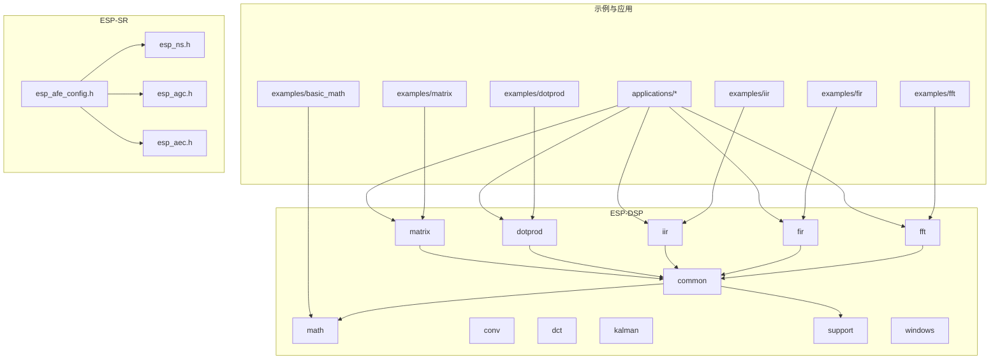
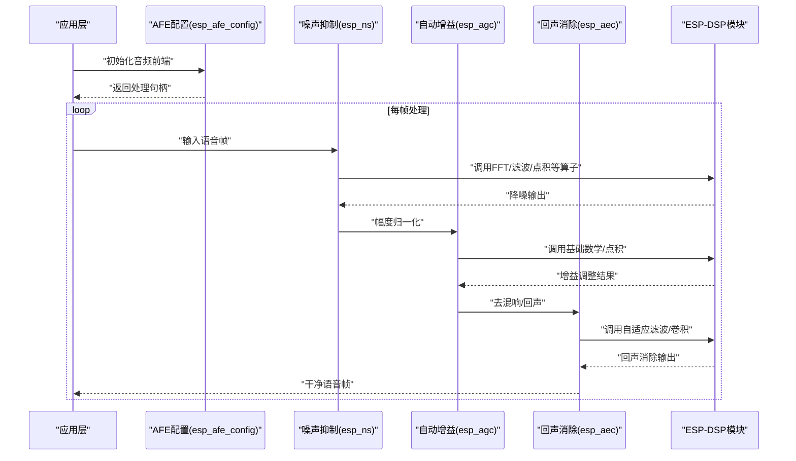
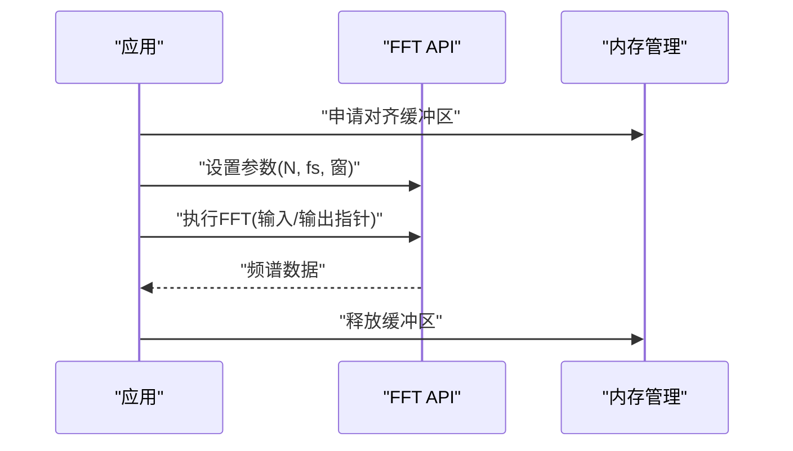
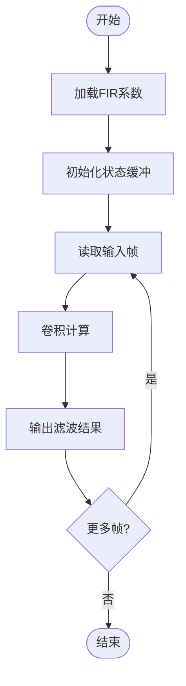
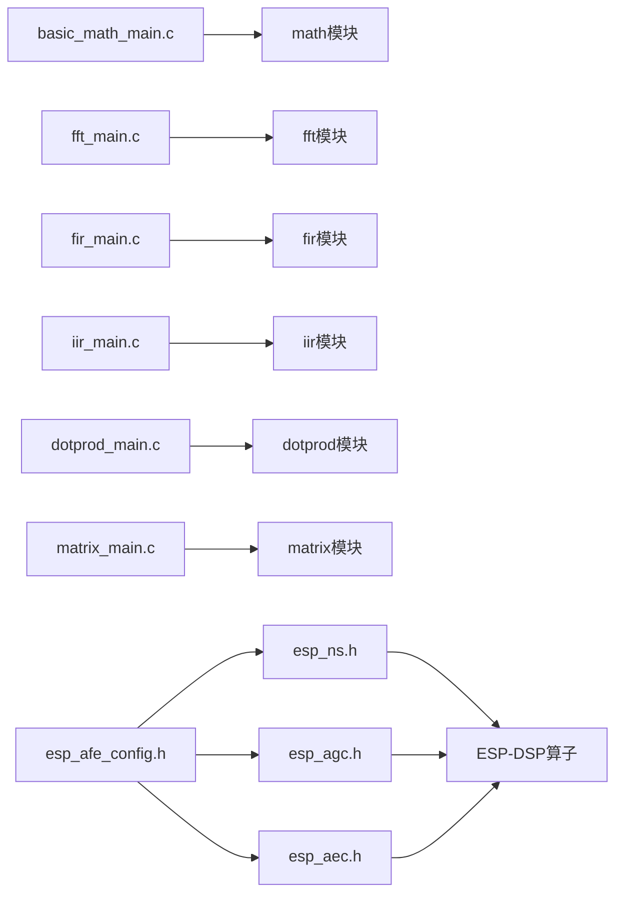

# 数字信号处理API

<cite>
**本文档引用的文件**
- [README.md](file://Firmware/esp32_ai_mirror/components/espressif__esp-dsp/README.md)
- [CMakeLists.txt](file://Firmware/esp32_ai_mirror/components/espressif__esp-dsp/CMakeLists.txt)
- [fft.h](file://Firmware/esp32_ai_mirror/components/espressif__esp-dsp/modules/fft/include/esp_dsp_fft.h)
- [fir.h](file://Firmware/esp32_ai_mirror/components/espressif__esp-dsp/modules/fir/include/esp_dsp_fir.h)
- [iir.h](file://Firmware/esp32_ai_mirror/components/espressif__esp-dsp/modules/iir/include/esp_dsp_iir.h)
- [dotprod.h](file://Firmware/esp32_ai_mirror/components/espressif__esp-dsp/modules/dotprod/include/esp_dsp_dotprod.h)
- [matrix.h](file://Firmware/esp32_ai_mirror/components/espressif__esp-dsp/modules/matrix/include/esp_dsp_matrix.h)
- [basic_math_main.c](file://Firmware/esp32_ai_mirror/components/espressif__esp-dsp/examples/basic_math/main/basic_math_main.c)
- [fft_main.c](file://Firmware/esp32_ai_mirror/components/espressif__esp-dsp/examples/fft/main/fft_main.c)
- [fir_main.c](file://Firmware/esp32_ai_mirror/components/espressif__esp-dsp/examples/fir/main/fir_main.c)
- [iir_main.c](file://Firmware/esp32_ai_mirror/components/espressif__esp-dsp/examples/iir/main/iir_main.c)
- [dotprod_main.c](file://Firmware/esp32_ai_mirror/components/espressif__esp-dsp/examples/dotprod/main/dotprod_main.c)
- [matrix_main.c](file://Firmware/esp32_ai_mirror/components/espressif__esp-dsp/examples/matrix/main/matrix_main.c)
- [esp_afe_config.h](file://Firmware/esp32_ai_mirror/components/espressif__esp-sr/include/esp_afe_config.h)
- [esp_ns.h](file://Firmware/esp32_ai_mirror/components/espressif__esp-sr/include/esp_ns.h)
- [esp_agc.h](file://Firmware/esp32_ai_mirror/components/espressif__esp-sr/include/esp_agc.h)
- [esp_aec.h](file://Firmware/esp32_ai_mirror/components/espressif__esp-sr/include/esp_aec.h)
</cite>

## 目录
1. [简介](#简介)
2. [项目结构](#项目结构)
3. [核心组件](#核心组件)
4. [架构总览](#架构总览)
5. [详细组件分析](#详细组件分析)
6. [依赖关系分析](#依赖关系分析)
7. [性能考虑](#性能考虑)
8. [故障排查指南](#故障排查指南)
9. [结论](#结论)
10. [附录](#附录)

## 简介
本文件面向在ESP平台上进行数字信号处理的工程师，系统性梳理ESP-DSP库的核心功能模块与API，包括FFT变换、滤波器设计（FIR/IIR）、矩阵运算、点积运算等。文档同时结合ESP-SR的音频前端能力，给出噪声抑制、回声消除、自动增益控制等音频增强场景的实践方法，并总结实时音频处理的最佳实践、内存管理策略以及SIMD指令优化与硬件加速的使用要点。文末提供常见DSP算法的代码示例路径，便于快速上手与二次开发。

## 项目结构
ESP-DSP以模块化方式组织，按功能划分为common、math、conv、dct、dotprod、fft、fir、iir、kalman、matrix、support、windows等子模块；examples提供各模块的最小可运行示例；applications包含基于特定板卡的演示应用。ESP-SR则提供语音识别相关的前端处理（如NS、AGC、AEC）与模型接口。

图表来源
- [CMakeLists.txt](file://Firmware/esp32_ai_mirror/components/espressif__esp-dsp/CMakeLists.txt)
- [README.md](file://Firmware/esp32_ai_mirror/components/espressif__esp-dsp/README.md)

章节来源
- [README.md](file://Firmware/esp32_ai_mirror/components/espressif__esp-dsp/README.md)
- [CMakeLists.txt](file://Firmware/esp32_ai_mirror/components/espressif__esp-dsp/CMakeLists.txt)

## 核心组件
- FFT变换：支持复数/实数序列的快速傅里叶变换，常用于频谱分析、滤波、卷积等。
- FIR/IIR滤波器：提供有限脉冲响应与无限脉冲响应滤波实现，适用于低通、高通、带通、带阻等频域整形。
- 点积运算：向量内积计算，广泛用于能量估计、匹配滤波、相关性分析等。
- 矩阵运算：基础矩阵加减乘及标量操作，支撑线性系统建模与求解。
- 数学与窗口函数：基本算术、平方根、窗函数生成等，为FFT前处理与后处理提供支持。
- 支持工具：内存管理、视图、SNR/SFDR测量等辅助模块。

章节来源
- [README.md](file://Firmware/esp32_ai_mirror/components/espressif__esp-dsp/README.md)

## 架构总览
ESP-DSP采用“模块头文件 + 多后端实现”的架构：公共头文件定义统一API，具体实现按数据类型（float/fixed）与目标平台（SIMD/NEON/MSE）选择最优路径。ESP-SR在前端链路中调用这些基础DSP算子，组合成完整的语音处理流水线。

图表来源
- [esp_afe_config.h](file://Firmware/esp32_ai_mirror/components/espressif__esp-sr/include/esp_afe_config.h)
- [esp_ns.h](file://Firmware/esp32_ai_mirror/components/espressif__esp-sr/include/esp_ns.h)
- [esp_agc.h](file://Firmware/esp32_ai_mirror/components/espressif__esp-sr/include/esp_agc.h)
- [esp_aec.h](file://Firmware/esp32_ai_mirror/components/espressif__esp-sr/include/esp_aec.h)

## 详细组件分析

### FFT变换
- 功能要点：复数FFT、实数FFT、窗函数预处理、功率谱计算。
- 典型用法：对音频分帧加窗后进行FFT，得到频谱用于后续滤波或特征提取。
- 参数配置：点数N、采样率fs、窗类型、是否原位计算、缓冲区对齐要求。
- 性能优化：优先使用固定点数（如128/256/512），利用SIMD/NEON路径；合理分配对齐内存；避免频繁重分配。
- 错误处理：检查N是否为2的幂；确保输入/输出缓冲区大小与对齐满足要求。

章节来源
- [fft.h](file://Firmware/esp32_ai_mirror/components/espressif__esp-dsp/modules/fft/include/esp_dsp_fft.h)
- [fft_main.c](file://Firmware/esp32_ai_mirror/components/espressif__esp-dsp/examples/fft/main/fft_main.c)

#### FFT调用时序

图表来源
- [fft_main.c](file://Firmware/esp32_ai_mirror/components/espressif__esp-dsp/examples/fft/main/fft_main.c)

### FIR滤波器
- 功能要点：FIR滤波、多速率重采样（可选）、系数加载与更新。
- 典型用法：低通抗混叠、高通去直流、带通语音频段增强。
- 参数配置：阶数M、系数数组、输入步长、输出步长、状态缓冲。
- 性能优化：系数对齐、批量处理、使用定点实现降低浮点开销。
- 错误处理：验证系数长度与输入长度一致性；状态缓冲清零。

章节来源
- [fir.h](file://Firmware/esp32_ai_mirror/components/espressif__esp-dsp/modules/fir/include/esp_dsp_fir.h)
- [fir_main.c](file://Firmware/esp32_ai_mirror/components/espressif__esp-dsp/examples/fir/main/fir_main.c)

#### FIR滤波流程

图表来源
- [fir_main.c](file://Firmware/esp32_ai_mirror/components/espressif__esp-dsp/examples/fir/main/fir_main.c)

### IIR滤波器
- 功能要点：二阶节（Biquad）级联、传递函数系数配置、稳定性检查。
- 典型用法：均衡器、陷波滤波、语音频段塑形。
- 参数配置：各节a/b系数、级联数量、状态变量初始化。
- 性能优化：逐节处理减少中间缓存；必要时使用定点实现。
- 错误处理：检查极点位置保证稳定；状态变量初始化为零。

章节来源
- [iir.h](file://Firmware/esp32_ai_mirror/components/espressif__esp-dsp/modules/iir/include/esp_dsp_iir.h)
- [iir_main.c](file://Firmware/esp32_ai_mirror/components/espressif__esp-dsp/examples/iir/main/iir_main.c)

### 点积运算
- 功能要点：向量内积、加权内积、累积求和。
- 典型用法：能量估计、匹配滤波、相关性计算。
- 参数配置：向量长度、数据类型（float/fixed）、累加精度。
- 性能优化：使用SIMD并行累加；避免分支；对齐内存访问。
- 错误处理：长度校验；指针非空检查。

章节来源
- [dotprod.h](file://Firmware/esp32_ai_mirror/components/espressif__esp-dsp/modules/dotprod/include/esp_dsp_dotprod.h)
- [dotprod_main.c](file://Firmware/esp32_ai_mirror/components/espressif__esp-dsp/examples/dotprod/main/dotprod_main.c)

### 矩阵运算
- 功能要点：矩阵加减、乘法、标量乘加、转置等。
- 典型用法：线性方程组求解、状态空间模型、协方差矩阵计算。
- 参数配置：行列数、步长、数据类型、工作区大小。
- 性能优化：分块矩阵乘法；利用SIMD；避免临时对象。
- 错误处理：维度一致性检查；工作区容量校验。

章节来源
- [matrix.h](file://Firmware/esp32_ai_mirror/components/espressif__esp-dsp/modules/matrix/include/esp_dsp_matrix.h)
- [matrix_main.c](file://Firmware/esp32_ai_mirror/components/espressif__esp-dsp/examples/matrix/main/matrix_main.c)

### 基础数学与窗口函数
- 功能要点：加减乘除、平方根、绝对值、指数/对数近似、窗函数生成（汉明、汉宁、布莱克曼等）。
- 典型用法：FFT前加窗、幅度/相位计算、动态范围压缩。
- 性能优化：查表法替代复杂函数；向量化循环。
- 错误处理：输入范围检查；溢出保护。

章节来源
- [basic_math_main.c](file://Firmware/esp32_ai_mirror/components/espressif__esp-dsp/examples/basic_math/main/basic_math_main.c)

## 依赖关系分析
ESP-DSP模块之间通过公共头文件解耦，示例程序直接依赖对应模块头文件；ESP-SR在前端链路中组合多个DSP算子形成完整处理链。

图表来源
- [basic_math_main.c](file://Firmware/esp32_ai_mirror/components/espressif__esp-dsp/examples/basic_math/main/basic_math_main.c)
- [fft_main.c](file://Firmware/esp32_ai_mirror/components/espressif__esp-dsp/examples/fft/main/fft_main.c)
- [fir_main.c](file://Firmware/esp32_ai_mirror/components/espressif__esp-dsp/examples/fir/main/fir_main.c)
- [iir_main.c](file://Firmware/esp32_ai_mirror/components/espressif__esp-dsp/examples/iir/main/iir_main.c)
- [dotprod_main.c](file://Firmware/esp32_ai_mirror/components/espressif__esp-dsp/examples/dotprod/main/dotprod_main.c)
- [matrix_main.c](file://Firmware/esp32_ai_mirror/components/espressif__esp-dsp/examples/matrix/main/matrix_main.c)
- [esp_afe_config.h](file://Firmware/esp32_ai_mirror/components/espressif__esp-sr/include/esp_afe_config.h)
- [esp_ns.h](file://Firmware/esp32_ai_mirror/components/espressif__esp-sr/include/esp_ns.h)
- [esp_agc.h](file://Firmware/esp32_ai_mirror/components/espressif__esp-sr/include/esp_agc.h)
- [esp_aec.h](file://Firmware/esp32_ai_mirror/components/espressif__esp-sr/include/esp_aec.h)

章节来源
- [CMakeLists.txt](file://Firmware/esp32_ai_mirror/components/espressif__esp-dsp/CMakeLists.txt)

## 性能考虑
- SIMD与硬件加速：优先启用目标平台的SIMD/NEON/MSE路径，确保数据对齐与编译器优化开关正确。
- 内存管理：预分配对齐缓冲区，复用状态变量，避免运行时频繁malloc/free。
- 批处理：将小帧合并为大块处理，提高吞吐并降低调度开销。
- 数值精度：在满足质量前提下使用定点实现以降低CPU占用。
- 缓存友好：顺序访问、减少跨页跳转、避免不必要的拷贝。
- 实时性：限制每帧最大处理时间，使用环形缓冲与双缓冲策略。

[本节为通用指导，不直接分析具体文件]

## 故障排查指南
- FFT异常：检查点数是否为2的幂；确认输入/输出缓冲区大小与对齐；验证窗函数长度与帧长一致。
- 滤波器不稳定：IIR需检查极点位置；FIR需确认系数长度与状态缓冲初始化。
- 点积溢出：累加精度不足时改用更高精度累加器；检查输入范围。
- 矩阵运算失败：核对行列数与步长；确保工作区足够。
- 实时卡顿：降低帧长或模块复杂度；增加批处理；关闭非必要日志。

章节来源
- [fft_main.c](file://Firmware/esp32_ai_mirror/components/espressif__esp-dsp/examples/fft/main/fft_main.c)
- [fir_main.c](file://Firmware/esp32_ai_mirror/components/espressif__esp-dsp/examples/fir/main/fir_main.c)
- [iir_main.c](file://Firmware/esp32_ai_mirror/components/espressif__esp-dsp/examples/iir/main/iir_main.c)
- [dotprod_main.c](file://Firmware/esp32_ai_mirror/components/espressif__esp-dsp/examples/dotprod/main/dotprod_main.c)
- [matrix_main.c](file://Firmware/esp32_ai_mirror/components/espressif__esp-dsp/examples/matrix/main/matrix_main.c)

## 结论
ESP-DSP提供了完备的DSP基础算子与示例，结合ESP-SR的音频前端能力，可在ESP平台上高效实现噪声抑制、回声消除、音频增强等应用。通过合理的参数配置、内存管理与SIMD优化，能够在资源受限的嵌入式设备上达到实时性与音质的平衡。建议从示例入手，逐步扩展至自定义处理链，并结合实际场景进行调参与评测。

[本节为总结性内容，不直接分析具体文件]

## 附录
- 代码示例路径（常见DSP算法）
  - FFT：[fft_main.c](file://Firmware/esp32_ai_mirror/components/espressif__esp-dsp/examples/fft/main/fft_main.c)
  - FIR：[fir_main.c](file://Firmware/esp32_ai_mirror/components/espressif__esp-dsp/examples/fir/main/fir_main.c)
  - IIR：[iir_main.c](file://Firmware/esp32_ai_mirror/components/espressif__esp-dsp/examples/iir/main/iir_main.c)
  - 点积：[dotprod_main.c](file://Firmware/esp32_ai_mirror/components/espressif__esp-dsp/examples/dotprod/main/dotprod_main.c)
  - 矩阵：[matrix_main.c](file://Firmware/esp32_ai_mirror/components/espressif__esp-dsp/examples/matrix/main/matrix_main.c)
  - 基础数学：[basic_math_main.c](file://Firmware/esp32_ai_mirror/components/espressif__esp-dsp/examples/basic_math/main/basic_math_main.c)
- 音频前端集成参考
  - AFE配置：[esp_afe_config.h](file://Firmware/esp32_ai_mirror/components/espressif__esp-sr/include/esp_afe_config.h)
  - 噪声抑制：[esp_ns.h](file://Firmware/esp32_ai_mirror/components/espressif__esp-sr/include/esp_ns.h)
  - 自动增益：[esp_agc.h](file://Firmware/esp32_ai_mirror/components/espressif__esp-sr/include/esp_agc.h)
  - 回声消除：[esp_aec.h](file://Firmware/esp32_ai_mirror/components/espressif__esp-sr/include/esp_aec.h)

[本节为参考信息，不直接分析具体文件]