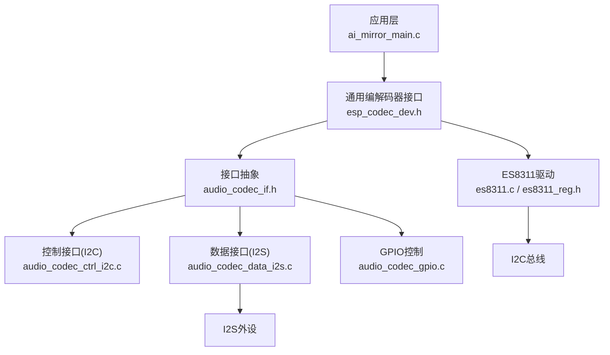
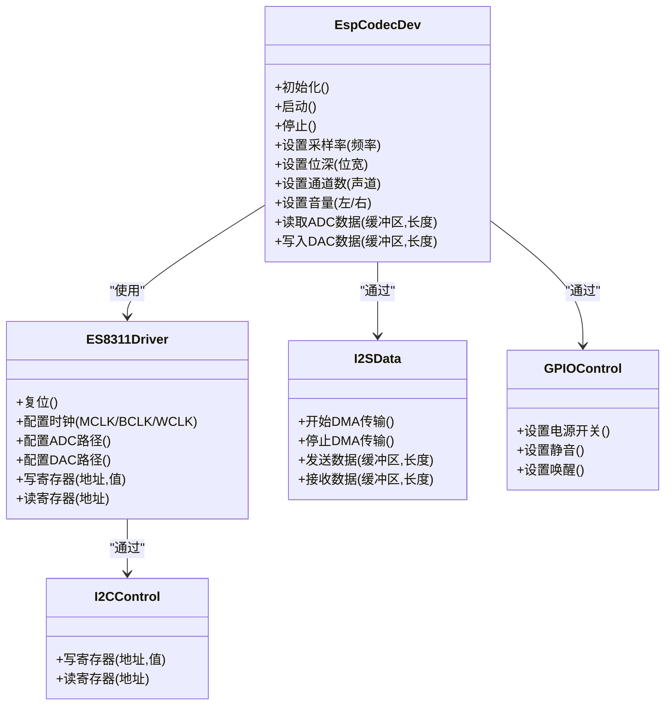
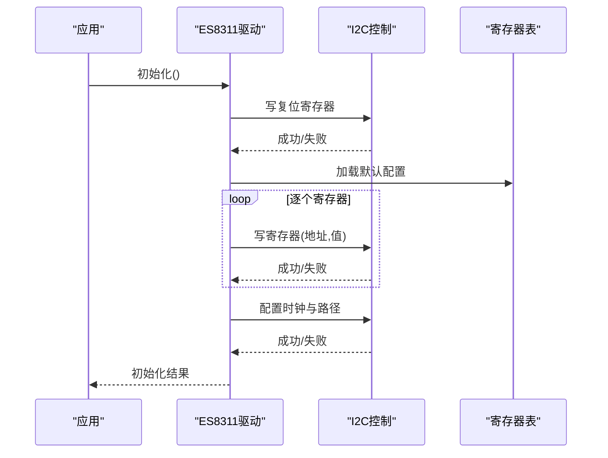
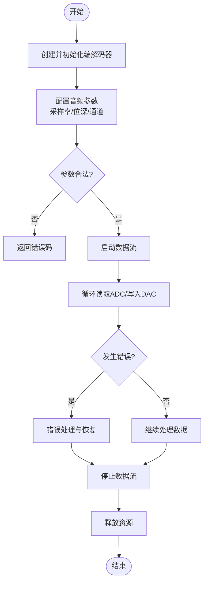
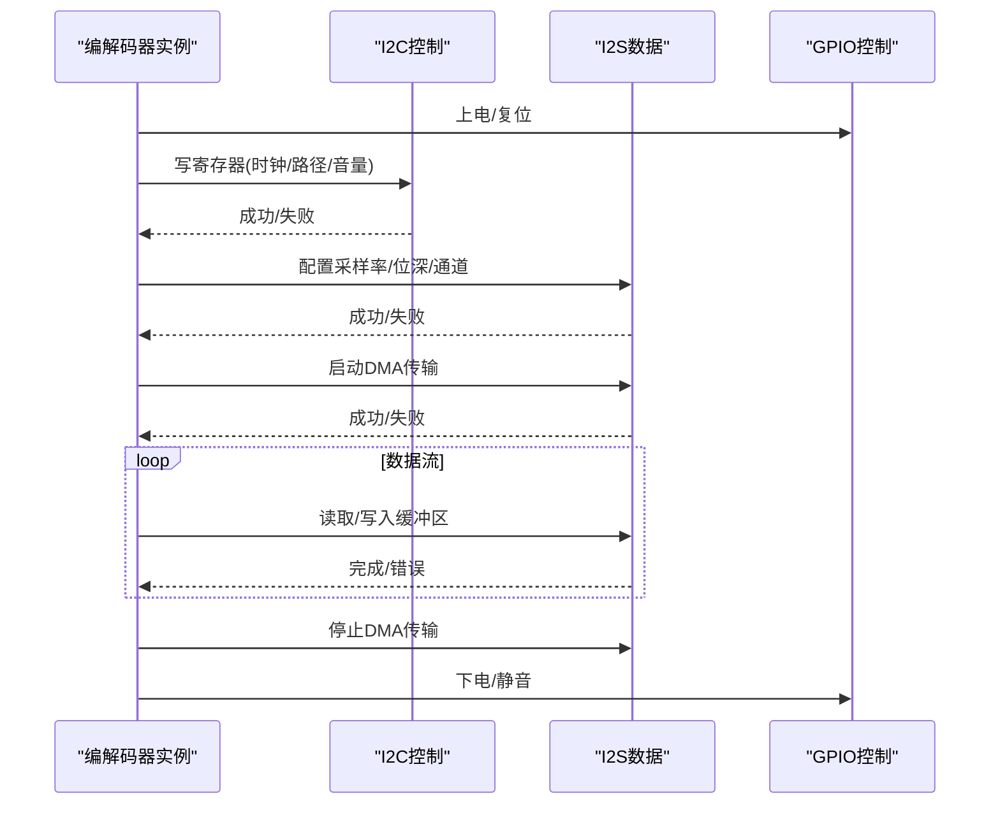
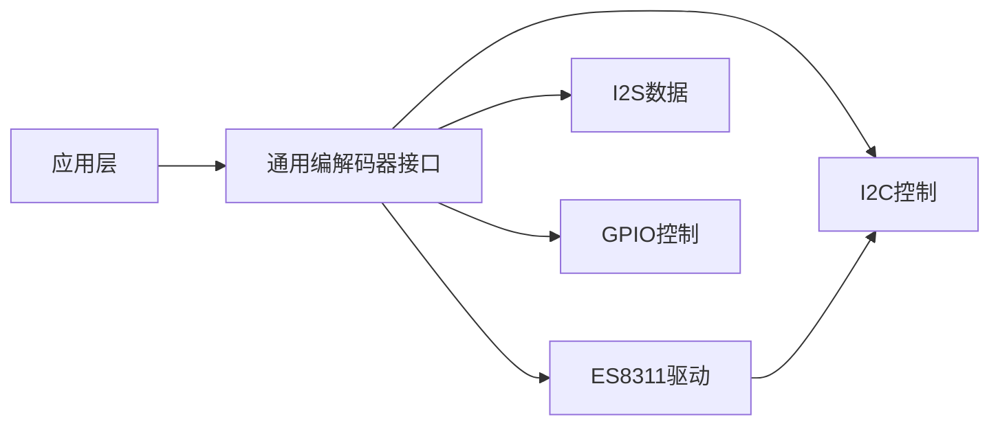

# 编解码器API

<cite>
**本文引用的文件**   
- [es8311.h](file://managed_components/espressif__es8311/include/es8311.h)
- [es8311.c](file://managed_components/espressif__es8311/es8311.c)
- [es8311_reg.h](file://managed_components/espressif__es8311/priv_include/es8311_reg.h)
- [esp_codec_dev.h](file://managed_components/espressif__esp_codec_dev/include/esp_codec_dev.h)
- [esp_codec_dev_defaults.h](file://managed_components/espressif__esp_codec_dev/include/esp_codec_dev_defaults.h)
- [esp_codec_dev_types.h](file://managed_components/espressif__esp_codec_dev/include/esp_codec_dev_types.h)
- [audio_codec_if.h](file://managed_components/espressif__esp_codec_dev/interface/audio_codec_if.h)
- [audio_codec_ctrl_i2c.c](file://managed_components/espressif__esp_codec_dev/platform/audio_codec_ctrl_i2c.c)
- [audio_codec_data_i2s.c](file://managed_components/espressif__esp_codec_dev/platform/audio_codec_data_i2s.c)
- [audio_codec_gpio.c](file://managed_components/espressif__esp_codec_dev/platform/audio_codec_gpio.c)
- [esp_codec_dev_vol.c](file://managed_components/espressif__esp_codec_dev/esp_codec_dev_vol.c)
- [codec_dev_mirror.c](file://managed_components/espressif__esp_codec_dev/codec_dev_mirror.c)
- [ai_mirror_main.c](file://Firmware/esp32_ai_mirror/main/ai_mirror_main.c)
</cite>

## 目录
1. [简介](#简介)
2. [项目结构](#项目结构)
3. [核心组件](#核心组件)
4. [架构总览](#架构总览)
5. [详细组件分析](#详细组件分析)
6. [依赖关系分析](#依赖关系分析)
7. [性能考虑](#性能考虑)
8. [故障排查指南](#故障排查指南)
9. [结论](#结论)
10. [附录](#附录)

## 简介
本文件面向ESP32平台上的音频编解码器开发，重点围绕ES8311音频编解码器的配置接口与ESP_CODEC_DEV库的通用编解码器接口展开。内容涵盖I2C通信、寄存器配置、音频参数设置（采样率、位宽、通道数）、ADC/DAC初始化、音量控制、数据流处理等。同时提供错误处理机制、调试方法，以及适配不同音频设备与扩展新编解码器的步骤说明。文档力求在保持技术深度的同时，对非专业读者也具备可读性。

## 项目结构
本项目采用分层设计：
- 应用层：main入口与业务逻辑，负责调用编解码器API进行初始化与数据流控制。
- 通用编解码器抽象层（ESP_CODEC_DEV）：定义统一的编解码器接口，屏蔽底层硬件差异，提供I2C/SPI控制、I2S数据通路、GPIO控制、音量控制等能力。
- 具体编解码器驱动层（ES8311等）：实现特定芯片的寄存器配置、电源管理、时钟配置等。
- 平台驱动层：I2C控制器、I2S控制器、GPIO等底层驱动。

图表来源
- [ai_mirror_main.c](file://Firmware/esp32_ai_mirror/main/ai_mirror_main.c)
- [esp_codec_dev.h](file://managed_components/espressif__esp_codec_dev/include/esp_codec_dev.h)
- [audio_codec_if.h](file://managed_components/espressif__esp_codec_dev/interface/audio_codec_if.h)
- [audio_codec_ctrl_i2c.c](file://managed_components/espressif__esp_codec_dev/platform/audio_codec_ctrl_i2c.c)
- [audio_codec_data_i2s.c](file://managed_components/espressif__esp_codec_dev/platform/audio_codec_data_i2s.c)
- [audio_codec_gpio.c](file://managed_components/espressif__esp_codec_dev/platform/audio_codec_gpio.c)
- [es8311.c](file://managed_components/espressif__es8311/es8311.c)
- [es8311_reg.h](file://managed_components/espressif__es8311/priv_include/es8311_reg.h)

章节来源
- [ai_mirror_main.c](file://Firmware/esp32_ai_mirror/main/ai_mirror_main.c)
- [esp_codec_dev.h](file://managed_components/espressif__esp_codec_dev/include/esp_codec_dev.h)
- [audio_codec_if.h](file://managed_components/espressif__esp_codec_dev/interface/audio_codec_if.h)

## 核心组件
- ES8311驱动
  - 职责：通过I2C访问ES8311寄存器，完成复位、时钟配置、ADC/DAC路径选择、音量设置、MCLK/BCLK/WCLK配置等。
  - 关键文件：es8311.h、es8311.c、es8311_reg.h。
- ESP_CODEC_DEV通用接口
  - 职责：统一封装编解码器操作，包括初始化、启动/停止、采样率/位深/通道配置、音量控制、数据读写等。
  - 关键文件：esp_codec_dev.h、esp_codec_dev_defaults.h、esp_codec_dev_types.h、esp_codec_dev_vol.c、codec_dev_mirror.c。
- 平台接口
  - 控制接口：I2C/SPI，用于寄存器读写。
  - 数据接口：I2S，用于PCM数据流传输。
  - GPIO接口：用于电源、静音、唤醒等控制。
  - 关键文件：audio_codec_ctrl_i2c.c、audio_codec_data_i2s.c、audio_codec_gpio.c。

章节来源
- [es8311.h](file://managed_components/espressif__es8311/include/es8311.h)
- [es8311.c](file://managed_components/espressif__es8311/es8311.c)
- [es8311_reg.h](file://managed_components/espressif__es8311/priv_include/es8311_reg.h)
- [esp_codec_dev.h](file://managed_components/espressif__esp_codec_dev/include/esp_codec_dev.h)
- [esp_codec_dev_defaults.h](file://managed_components/espressif__esp_codec_dev/include/esp_codec_dev_defaults.h)
- [esp_codec_dev_types.h](file://managed_components/espressif__esp_codec_dev/include/esp_codec_dev_types.h)
- [esp_codec_dev_vol.c](file://managed_components/espressif__esp_codec_dev/esp_codec_dev_vol.c)
- [codec_dev_mirror.c](file://managed_components/espressif__esp_codec_dev/codec_dev_mirror.c)
- [audio_codec_ctrl_i2c.c](file://managed_components/espressif__esp_codec_dev/platform/audio_codec_ctrl_i2c.c)
- [audio_codec_data_i2s.c](file://managed_components/espressif__esp_codec_dev/platform/audio_codec_data_i2s.c)
- [audio_codec_gpio.c](file://managed_components/espressif__esp_codec_dev/platform/audio_codec_gpio.c)

## 架构总览
ESP_CODEC_DEV通过接口抽象将上层应用与底层硬件解耦。ES8311作为具体编解码器实现，遵循通用接口规范；I2C/I2S/GPIO等平台驱动被封装为控制与数据接口，供上层调用。

图表来源
- [esp_codec_dev.h](file://managed_components/espressif__esp_codec_dev/include/esp_codec_dev.h)
- [es8311.c](file://managed_components/espressif__es8311/es8311.c)
- [audio_codec_ctrl_i2c.c](file://managed_components/espressif__esp_codec_dev/platform/audio_codec_ctrl_i2c.c)
- [audio_codec_data_i2s.c](file://managed_components/espressif__esp_codec_dev/platform/audio_codec_data_i2s.c)
- [audio_codec_gpio.c](file://managed_components/espressif__esp_codec_dev/platform/audio_codec_gpio.c)

## 详细组件分析

### ES8311编解码器驱动
- I2C通信
  - 通过I2C控制接口对ES8311寄存器进行读写，确保地址与数据格式符合芯片手册。
  - 典型流程：构建命令帧、调用I2C写、校验返回状态。
- 寄存器配置
  - 常用寄存器类别：电源管理、时钟配置、ADC/DAC路径、音量控制、数字接口（BCLK/WCLK/LRCK）。
  - 建议按顺序：先电源与时钟，再路径与音量，最后启用数据流。
- 音频参数设置
  - 采样率：根据MCLK与分频系数计算，保证BCLK/WCLK满足ES8311要求。
  - 位深：支持16/24/32位，需与I2S配置一致。
  - 通道数：单声道/立体声，注意ADC/DAC路径与I2S通道映射。
- 初始化流程
  - 复位芯片、配置时钟、选择输入输出路径、设置音量、使能ADC/DAC。
- 错误处理
  - I2C读写失败时重试与上报错误码；时钟未锁定或路径未就绪时回退到安全配置。

图表来源
- [es8311.c](file://managed_components/espressif__es8311/es8311.c)
- [es8311_reg.h](file://managed_components/espressif__es8311/priv_include/es8311_reg.h)
- [audio_codec_ctrl_i2c.c](file://managed_components/espressif__esp_codec_dev/platform/audio_codec_ctrl_i2c.c)

章节来源
- [es8311.c](file://managed_components/espressif__es8311/es8311.c)
- [es8311_reg.h](file://managed_components/espressif__es8311/priv_include/es8311_reg.h)

### ESP_CODEC_DEV通用编解码器接口
- 初始化与生命周期
  - 创建编解码器实例、绑定控制与数据接口、分配资源、上电复位。
- 音频参数配置
  - 采样率、位深、通道数的设置与验证；必要时重新配置I2S与ES8311时钟。
- ADC/DAC数据流
  - 启动/停止DMA传输；环形缓冲与中断回调处理；丢包检测与恢复。
- 音量控制
  - 硬件音量（寄存器）与软件音量（DSP增益）结合；左右声道独立控制。
- 错误处理与诊断
  - 统一错误码；日志级别；超时与重试策略；状态机切换。

图表来源
- [esp_codec_dev.h](file://managed_components/espressif__esp_codec_dev/include/esp_codec_dev.h)
- [esp_codec_dev_defaults.h](file://managed_components/espressif__esp_codec_dev/include/esp_codec_dev_defaults.h)
- [esp_codec_dev_vol.c](file://managed_components/espressif__esp_codec_dev/esp_codec_dev_vol.c)
- [codec_dev_mirror.c](file://managed_components/espressif__esp_codec_dev/codec_dev_mirror.c)

章节来源
- [esp_codec_dev.h](file://managed_components/espressif__esp_codec_dev/include/esp_codec_dev.h)
- [esp_codec_dev_defaults.h](file://managed_components/espressif__esp_codec_dev/include/esp_codec_dev_defaults.h)
- [esp_codec_dev_vol.c](file://managed_components/espressif__esp_codec_dev/esp_codec_dev_vol.c)
- [codec_dev_mirror.c](file://managed_components/espressif__esp_codec_dev/codec_dev_mirror.c)

### 平台接口（I2C/I2S/GPIO）
- I2C控制接口
  - 提供寄存器读写函数；支持多设备地址与速率配置；错误重试与超时。
- I2S数据接口
  - 配置MCLK/BCLK/WCLK与DMA；支持半双工/全双工；缓冲管理与溢出保护。
- GPIO控制接口
  - 电源开关、静音、唤醒引脚控制；延迟与去抖处理。

图表来源
- [audio_codec_ctrl_i2c.c](file://managed_components/espressif__esp_codec_dev/platform/audio_codec_ctrl_i2c.c)
- [audio_codec_data_i2s.c](file://managed_components/espressif__esp_codec_dev/platform/audio_codec_data_i2s.c)
- [audio_codec_gpio.c](file://managed_components/espressif__esp_codec_dev/platform/audio_codec_gpio.c)

章节来源
- [audio_codec_ctrl_i2c.c](file://managed_components/espressif__esp_codec_dev/platform/audio_codec_ctrl_i2c.c)
- [audio_codec_data_i2s.c](file://managed_components/espressif__esp_codec_dev/platform/audio_codec_data_i2s.c)
- [audio_codec_gpio.c](file://managed_components/espressif__esp_codec_dev/platform/audio_codec_gpio.c)

### 应用层集成示例（AI Mirror）
- 初始化流程
  - 配置I2C与I2S参数；创建ES8311实例；调用通用接口初始化与启动。
- 音频参数设置
  - 设置采样率（如16kHz/48kHz）、位深（16bit）、通道数（立体声）。
- 数据流处理
  - 启动ADC读取与DAC写入；处理环形缓冲；异常时回退与恢复。
- 音量控制
  - 动态调整硬件音量与软件增益；避免削波与爆音。

章节来源
- [ai_mirror_main.c](file://Firmware/esp32_ai_mirror/main/ai_mirror_main.c)

## 依赖关系分析
- 组件耦合
  - 应用层仅依赖通用编解码器接口，不直接访问I2C/I2S/GPIO。
  - ES8311驱动依赖I2C控制接口；通用接口依赖数据与GPIO接口。
- 外部依赖
  - ESP-IDF的I2C与I2S驱动；内存与任务调度。
- 潜在循环依赖
  - 通过接口抽象避免循环；各层单向依赖。

图表来源
- [esp_codec_dev.h](file://managed_components/espressif__esp_codec_dev/include/esp_codec_dev.h)
- [es8311.c](file://managed_components/espressif__es8311/es8311.c)
- [audio_codec_ctrl_i2c.c](file://managed_components/espressif__esp_codec_dev/platform/audio_codec_ctrl_i2c.c)
- [audio_codec_data_i2s.c](file://managed_components/espressif__esp_codec_dev/platform/audio_codec_data_i2s.c)
- [audio_codec_gpio.c](file://managed_components/espressif__esp_codec_dev/platform/audio_codec_gpio.c)

章节来源
- [esp_codec_dev.h](file://managed_components/espressif__esp_codec_dev/include/esp_codec_dev.h)
- [es8311.c](file://managed_components/espressif__es8311/es8311.c)

## 性能考虑
- I2C带宽与延迟
  - 批量寄存器配置时使用连续写；减少频繁小写操作。
- I2S DMA与缓冲
  - 合理设置缓冲区大小，降低CPU占用；避免溢出与欠载。
- 时钟与同步
  - MCLK/BCLK/WCLK比例正确；避免时钟抖动导致失真。
- 音量与动态范围
  - 硬件音量优先，软件增益辅助；避免过度放大引入噪声。
- 功耗管理
  - 空闲时关闭不必要模块；按需唤醒与休眠。

[本节为通用指导，不涉及具体文件分析]

## 故障排查指南
- I2C通信失败
  - 检查地址与速率；确认上拉电阻与布线；增加重试与超时。
- 无声音或杂音
  - 验证ADC/DAC路径与音量；检查BCLK/WCLK极性；确认I2S格式。
- 采样率异常
  - 核对MCLK分频；检查ES8311时钟寄存器；确认I2S采样率匹配。
- 数据丢包
  - 增大I2S缓冲；优化数据处理线程优先级；监控DMA状态。
- 调试方法
  - 启用日志级别；抓取I2C与I2S波形；逐步回退配置定位问题。

章节来源
- [audio_codec_ctrl_i2c.c](file://managed_components/espressif__esp_codec_dev/platform/audio_codec_ctrl_i2c.c)
- [audio_codec_data_i2s.c](file://managed_components/espressif__esp_codec_dev/platform/audio_codec_data_i2s.c)
- [es8311.c](file://managed_components/espressif__es8311/es8311.c)

## 结论
通过ESP_CODECDEV的统一接口与ES8311的具体实现，可在ESP32平台上高效地集成音频编解码功能。合理的I2C/I2S/GPIO配置与错误处理机制是稳定运行的关键。遵循本文档的流程与最佳实践，可快速完成音频设备的适配与扩展。

[本节为总结，不涉及具体文件分析]

## 附录
- 适配不同音频设备
  - 实现新的编解码器驱动，遵循通用接口；注册控制与数据接口；提供默认配置表。
- 扩展新编解码器步骤
  - 定义寄存器映射；实现复位与时钟配置；实现路径与音量设置；编写测试用例。
- 参考示例
  - 查看现有驱动（如ES8311、ES8374等）的实现方式；对照接口规范进行移植。

[本节为概念性内容，不涉及具体文件分析]