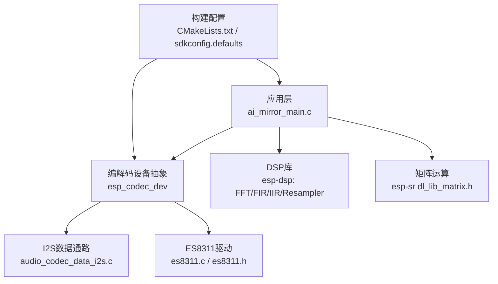
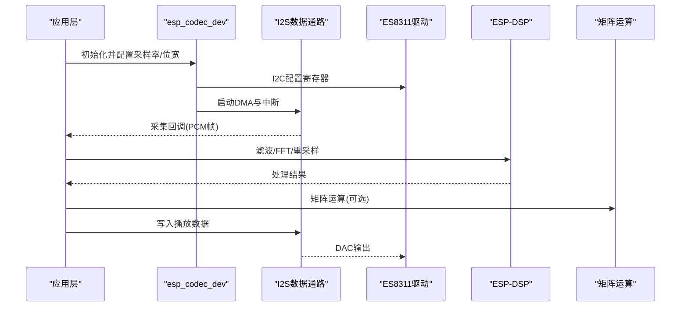
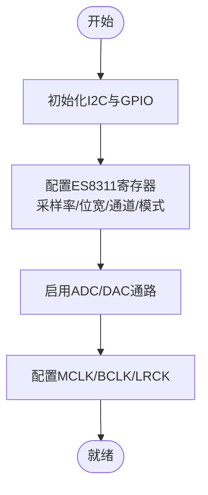
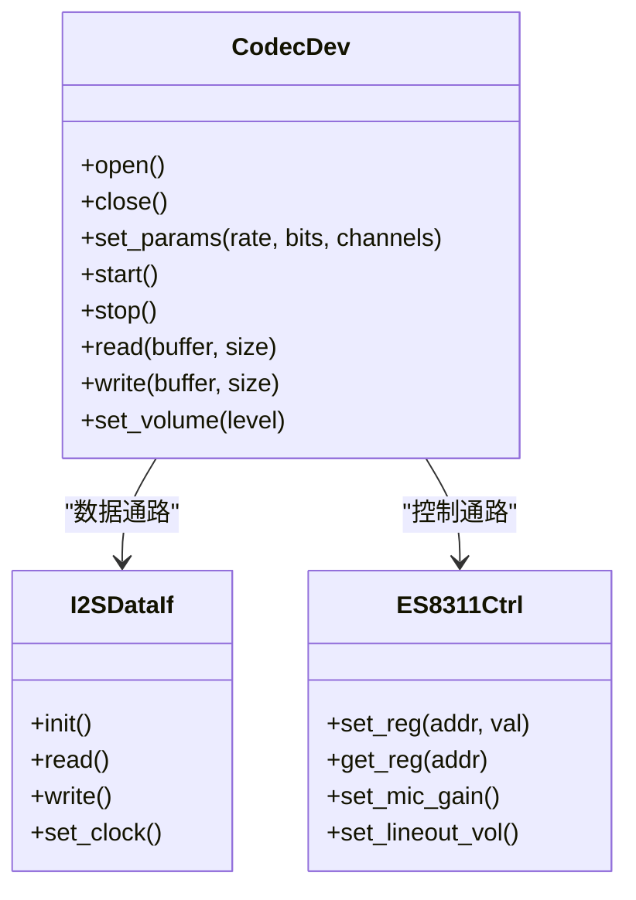
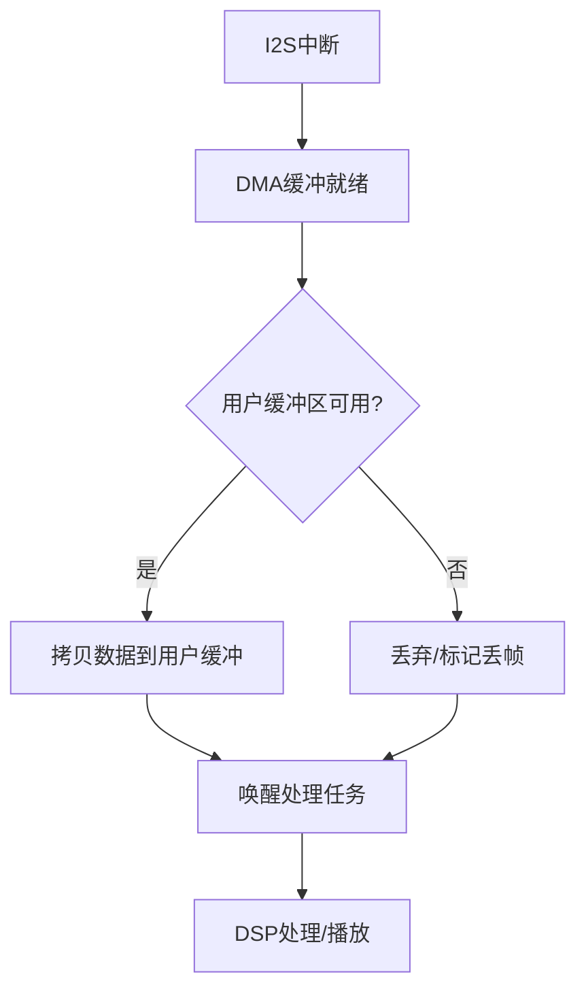
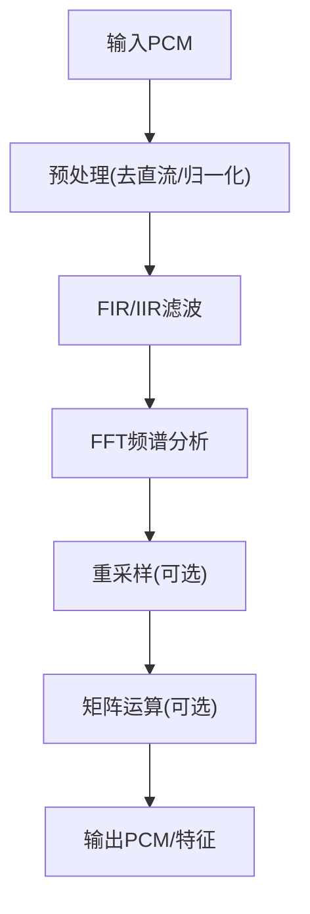
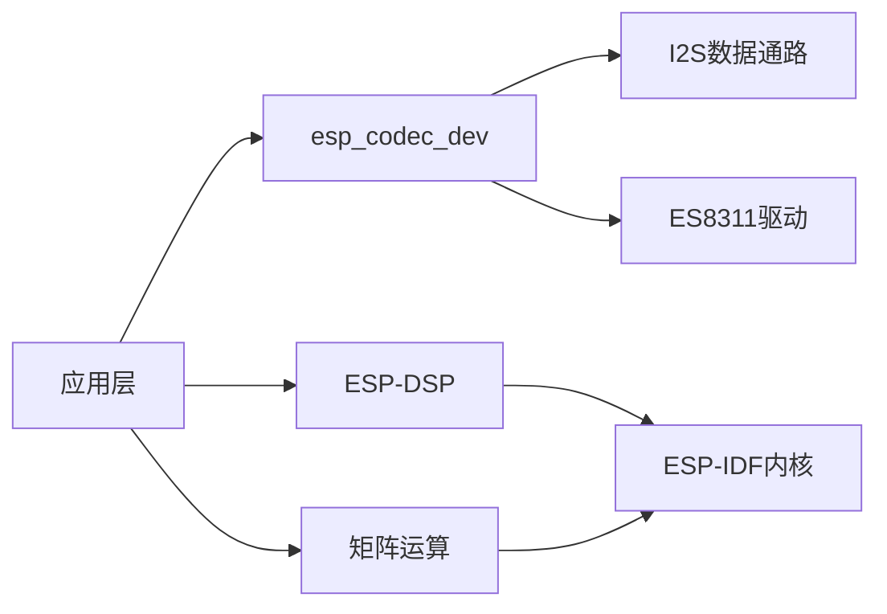

# 音频处理API

<cite>
**本文档引用的文件**   
- [ai_mirror_main.c](file://Firmware/esp32_ai_mirror/main/ai_mirror_main.c)
- [es8311.h](file://Firmware/esp32_ai_mirror/managed_components/espressif__es8311/include/es8311.h)
- [es8311.c](file://Firmware/esp32_ai_mirror/managed_components/espressif__es8311/es8311.c)
- [esp_codec_dev.h](file://Firmware/esp32_ai_mirror/managed_components/espressif__esp_codec_dev/include/esp_codec_dev.h)
- [esp_codec_dev_vol.h](file://Firmware/esp32_ai_mirror/managed_components/espressif__esp_codec_dev/include/esp_codec_dev_vol.h)
- [audio_codec_data_i2s.c](file://Firmware/esp32_ai_mirror/managed_components/espressif__esp_codec_dev/platform/audio_codec_data_i2s.c)
- [audio_codec_sw_vol.c](file://Firmware/esp32_ai_mirror/managed_components/espressif__esp_codec_dev/audio_codec_sw_vol.c)
- [dl_lib_matrix.h](file://Firmware/esp32_ai_mirror/components/espressif__esp-sr/include/esp32/dl_lib_matrix.h)
- [fft.h](file://Firmware/esp32_ai_mirror/managed_components/espressif__esp-dsp/modules/fft/include/fft.h)
- [fir.h](file://Firmware/esp32_ai_mirror/managed_components/espressif__esp-dsp/modules/fir/include/fir.h)
- [iir.h](file://Firmware/esp32_ai_mirror/managed_components/espressif__esp-dsp/modules/iir/include/iir.h)
- [resampler.h](file://Firmware/esp32_ai_mirror/managed_components/espressif__esp-dsp/modules/fir/resampler/resampler.h)
- [CMakeLists.txt](file://Firmware/esp32_ai_mirror/CMakeLists.txt)
- [sdkconfig.defaults](file://Firmware/esp32_ai_mirror/sdkconfig.defaults)
</cite>

## 目录
1. [简介](#简介)
2. [项目结构](#项目结构)
3. [核心组件](#核心组件)
4. [架构总览](#架构总览)
5. [详细组件分析](#详细组件分析)
6. [依赖关系分析](#依赖关系分析)
7. [性能考虑](#性能考虑)
8. [故障排查指南](#故障排查指南)
9. [结论](#结论)
10. [附录](#附录)

## 简介
本文件面向ESP32平台的音频处理应用，系统性梳理音频采集、播放与处理的API与实现要点。重点覆盖：
- ES8311编解码器的配置与使用（I2S数据通路、音量控制）
- ESP-DSP数字信号处理库的FFT、滤波器、矩阵运算等能力
- 音频流处理、缓冲区管理、音量控制的API示例
- 音频格式转换与采样率调整的实现方法
- 多线程音频处理与实时性保证策略
- 音频质量优化与延迟控制技巧

## 项目结构
本项目基于ESP-IDF构建，音频相关代码主要分布在以下位置：
- 主程序入口与系统初始化：main/ai_mirror_main.c
- I2S编解码驱动与设备抽象：managed_components/espressif__esp_codec_dev
- ES8311具体驱动：managed_components/espressif__es8311
- 数字信号处理库：components/espressif__esp-sr（含矩阵接口）、managed_components/espressif__esp-dsp（FFT/FIR/IIR/重采样）
- 构建与配置：CMakeLists.txt、sdkconfig.defaults

图表来源
- [ai_mirror_main.c](file://Firmware/esp32_ai_mirror/main/ai_mirror_main.c)
- [esp_codec_dev.h](file://Firmware/esp32_ai_mirror/managed_components/espressif__esp_codec_dev/include/esp_codec_dev.h)
- [audio_codec_data_i2s.c](file://Firmware/esp32_ai_mirror/managed_components/espressif__esp_codec_dev/platform/audio_codec_data_i2s.c)
- [es8311.h](file://Firmware/esp32_ai_mirror/managed_components/espressif__es8311/include/es8311.h)
- [es8311.c](file://Firmware/esp32_ai_mirror/managed_components/espressif__es8311/es8311.c)
- [dl_lib_matrix.h](file://Firmware/esp32_ai_mirror/components/espressif__esp-sr/include/esp32/dl_lib_matrix.h)
- [fft.h](file://Firmware/esp32_ai_mirror/managed_components/espressif__esp-dsp/modules/fft/include/fft.h)
- [fir.h](file://Firmware/esp32_ai_mirror/managed_components/espressif__esp-dsp/modules/fir/include/fir.h)
- [iir.h](file://Firmware/esp32_ai_mirror/managed_components/espressif__esp-dsp/modules/iir/include/iir.h)
- [resampler.h](file://Firmware/esp32_ai_mirror/managed_components/espressif__esp-dsp/modules/fir/resampler/resampler.h)
- [CMakeLists.txt](file://Firmware/esp32_ai_mirror/CMakeLists.txt)
- [sdkconfig.defaults](file://Firmware/esp32_ai_mirror/sdkconfig.defaults)

章节来源
- [CMakeLists.txt](file://Firmware/esp32_ai_mirror/CMakeLists.txt)
- [sdkconfig.defaults](file://Firmware/esp32_ai_mirror/sdkconfig.defaults)

## 核心组件
- 编解码设备抽象（esp_codec_dev）
  - 提供统一的音频设备接口，屏蔽底层I2S与具体Codec差异
  - 支持ADC采集、DAC播放、音量控制、时钟配置等
- ES8311驱动
  - 通过I2C配置寄存器，设置采样率、位宽、工作模式、音量等
  - 与esp_codec_dev协同完成数据通路建立
- I2S数据通路
  - 负责DMA缓冲、中断回调、数据搬运
  - 与CPU任务协作，实现低延迟音频流
- DSP处理模块（esp-dsp）
  - FFT频谱分析、FIR/IIR滤波、重采样、基础数学运算
- 矩阵运算（esp-sr dl_lib_matrix）
  - 提供高效矩阵乘加、转置、缩放等操作，用于前端处理或模型推理

章节来源
- [esp_codec_dev.h](file://Firmware/esp32_ai_mirror/managed_components/espressif__esp_codec_dev/include/esp_codec_dev.h)
- [es8311.h](file://Firmware/esp32_ai_mirror/managed_components/espressif__es8311/include/es8311.h)
- [es8311.c](file://Firmware/esp32_ai_mirror/managed_components/espressif__es8311/es8311.c)
- [audio_codec_data_i2s.c](file://Firmware/esp32_ai_mirror/managed_components/espressif__esp_codec_dev/platform/audio_codec_data_i2s.c)
- [dl_lib_matrix.h](file://Firmware/esp32_ai_mirror/components/espressif__esp-sr/include/esp32/dl_lib_matrix.h)
- [fft.h](file://Firmware/esp32_ai_mirror/managed_components/espressif__esp-dsp/modules/fft/include/fft.h)
- [fir.h](file://Firmware/esp32_ai_mirror/managed_components/espressif__esp-dsp/modules/fir/include/fir.h)
- [iir.h](file://Firmware/esp32_ai_mirror/managed_components/espressif__esp-dsp/modules/iir/include/iir.h)
- [resampler.h](file://Firmware/esp32_ai_mirror/managed_components/espressif__esp-dsp/modules/fir/resampler/resampler.h)

## 架构总览
下图展示从音频输入到输出及DSP处理的整体数据流与控制流。

图表来源
- [esp_codec_dev.h](file://Firmware/esp32_ai_mirror/managed_components/espressif__esp_codec_dev/include/esp_codec_dev.h)
- [audio_codec_data_i2s.c](file://Firmware/esp32_ai_mirror/managed_components/espressif__esp_codec_dev/platform/audio_codec_data_i2s.c)
- [es8311.c](file://Firmware/esp32_ai_mirror/managed_components/espressif__es8311/es8311.c)
- [fft.h](file://Firmware/esp32_ai_mirror/managed_components/espressif__esp-dsp/modules/fft/include/fft.h)
- [fir.h](file://Firmware/esp32_ai_mirror/managed_components/espressif__esp-dsp/modules/fir/include/fir.h)
- [iir.h](file://Firmware/esp32_ai_mirror/managed_components/espressif__esp-dsp/modules/iir/include/iir.h)
- [resampler.h](file://Firmware/esp32_ai_mirror/managed_components/espressif__esp-dsp/modules/fir/resampler/resampler.h)
- [dl_lib_matrix.h](file://Firmware/esp32_ai_mirror/components/espressif__esp-sr/include/esp32/dl_lib_matrix.h)

## 详细组件分析

### ES8311编解码器配置与使用
- 功能要点
  - I2C寄存器配置：采样率、位宽、通道数、工作模式、AGC/噪声抑制（若支持）
  - 音量控制：硬件音量与软件音量双路径
  - 时钟与MCLK/BCLK/LRCK配置，确保与I2S同步
- 典型流程
  - 初始化I2C总线与GPIO
  - 调用驱动函数设置采样率、位深、通道
  - 启用ADC/DAC与耳机/线路输出
  - 与esp_codec_dev集成，完成数据通路建立

图表来源
- [es8311.h](file://Firmware/esp32_ai_mirror/managed_components/espressif__es8311/include/es8311.h)
- [es8311.c](file://Firmware/esp32_ai_mirror/managed_components/espressif__es8311/es8311.c)

章节来源
- [es8311.h](file://Firmware/esp32_ai_mirror/managed_components/espressif__es8311/include/es8311.h)
- [es8311.c](file://Firmware/esp32_ai_mirror/managed_components/espressif__es8311/es8311.c)

### esp_codec_dev编解码设备抽象
- 功能要点
  - 统一API：打开/关闭设备、设置参数、读写数据、音量控制
  - 平台适配：I2S数据通路、GPIO控制、OS资源管理
  - 多设备支持：麦克风、扬声器、耳机、线路输出
- 关键接口类别
  - 设备生命周期：初始化、配置、启动、停止、释放
  - 数据IO：读取PCM帧、写入PCM帧
  - 音量控制：硬件音量（寄存器）与软件音量（增益）

图表来源
- [esp_codec_dev.h](file://Firmware/esp32_ai_mirror/managed_components/espressif__esp_codec_dev/include/esp_codec_dev.h)
- [audio_codec_data_i2s.c](file://Firmware/esp32_ai_mirror/managed_components/espressif__esp_codec_dev/platform/audio_codec_data_i2s.c)
- [es8311.c](file://Firmware/esp32_ai_mirror/managed_components/espressif__es8311/es8311.c)

章节来源
- [esp_codec_dev.h](file://Firmware/esp32_ai_mirror/managed_components/espressif__esp_codec_dev/include/esp_codec_dev.h)
- [audio_codec_data_i2s.c](file://Firmware/esp32_ai_mirror/managed_components/espressif__esp_codec_dev/platform/audio_codec_data_i2s.c)

### I2S数据通路与缓冲区管理
- 功能要点
  - DMA环形缓冲：降低CPU占用，提升吞吐
  - 中断回调：在数据到达时触发，将数据拷贝至用户缓冲区
  - 背压与丢帧策略：当处理线程阻塞时的保护机制
- 设计建议
  - 合理设置缓冲区大小以平衡延迟与稳定性
  - 使用双缓冲或三缓冲避免竞态条件
  - 监控CPU负载与丢帧率，动态调整参数

图表来源
- [audio_codec_data_i2s.c](file://Firmware/esp32_ai_mirror/managed_components/espressif__esp_codec_dev/platform/audio_codec_data_i2s.c)

章节来源
- [audio_codec_data_i2s.c](file://Firmware/esp32_ai_mirror/managed_components/espressif__esp_codec_dev/platform/audio_codec_data_i2s.c)

### 音量控制（硬件与软件）
- 硬件音量
  - 通过ES8311寄存器直接调节输出增益
  - 响应快、无额外CPU开销
- 软件音量
  - 对PCM数据进行乘法缩放
  - 灵活但增加CPU负载
- 推荐策略
  - 优先使用硬件音量进行粗调
  - 软件音量用于精细调节或动态效果

章节来源
- [esp_codec_dev_vol.h](file://Firmware/esp32_ai_mirror/managed_components/espressif__esp_codec_dev/include/esp_codec_dev_vol.h)
- [audio_codec_sw_vol.c](file://Firmware/esp32_ai_mirror/managed_components/espressif__esp_codec_dev/audio_codec_sw_vol.c)

### ESP-DSP数字信号处理
- FFT频谱分析
  - 适用于频谱显示、语音识别前端特征提取
  - 注意窗函数选择与重叠策略
- FIR/IIR滤波器
  - FIR线性相位、IIR计算效率高
  - 根据应用场景选择合适阶数与系数
- 重采样
  - 改变采样率以匹配不同处理模块或网络传输
  - 注意抗混叠与音质保持
- 矩阵运算
  - 用于多通道处理、变换、模型推理前置步骤

图表来源
- [fft.h](file://Firmware/esp32_ai_mirror/managed_components/espressif__esp-dsp/modules/fft/include/fft.h)
- [fir.h](file://Firmware/esp32_ai_mirror/managed_components/espressif__esp-dsp/modules/fir/include/fir.h)
- [iir.h](file://Firmware/esp32_ai_mirror/managed_components/espressif__esp-dsp/modules/iir/include/iir.h)
- [resampler.h](file://Firmware/esp32_ai_mirror/managed_components/espressif__esp-dsp/modules/fir/resampler/resampler.h)
- [dl_lib_matrix.h](file://Firmware/esp32_ai_mirror/components/espressif__esp-sr/include/esp32/dl_lib_matrix.h)

章节来源
- [fft.h](file://Firmware/esp32_ai_mirror/managed_components/espressif__esp-dsp/modules/fft/include/fft.h)
- [fir.h](file://Firmware/esp32_ai_mirror/managed_components/espressif__esp-dsp/modules/fir/include/fir.h)
- [iir.h](file://Firmware/esp32_ai_mirror/managed_components/espressif__esp-dsp/modules/iir/include/iir.h)
- [resampler.h](file://Firmware/esp32_ai_mirror/managed_components/espressif__esp-dsp/modules/fir/resampler/resampler.h)
- [dl_lib_matrix.h](file://Firmware/esp32_ai_mirror/components/espressif__esp-sr/include/esp32/dl_lib_matrix.h)

### 音频流处理与缓冲区管理示例
- 采集流程
  - 初始化编解码设备与I2S
  - 注册回调函数，周期性读取PCM帧
  - 送入DSP模块进行处理
- 播放流程
  - 准备PCM数据（来自文件或网络）
  - 通过I2S写入，确保时序与同步
- 缓冲区管理
  - 使用队列或环形缓冲解耦采集与处理
  - 监控水位，避免溢出或欠载

章节来源
- [esp_codec_dev.h](file://Firmware/esp32_ai_mirror/managed_components/espressif__esp_codec_dev/include/esp_codec_dev.h)
- [audio_codec_data_i2s.c](file://Firmware/esp32_ai_mirror/managed_components/espressif__esp_codec_dev/platform/audio_codec_data_i2s.c)

### 音频格式转换与采样率调整
- 格式转换
  - PCM位深转换（16bit/24bit/32bit）
  - 声道数转换（单声道/立体声）
- 采样率调整
  - 使用重采样模块进行上采样或下采样
  - 注意抗混叠滤波器与插值算法

章节来源
- [resampler.h](file://Firmware/esp32_ai_mirror/managed_components/espressif__esp-dsp/modules/fir/resampler/resampler.h)

### 多线程音频处理与实时性保证
- 线程划分
  - 采集线程：高优先级，仅做数据搬运
  - 处理线程：执行DSP算法，可稍低优先级
  - 播放线程：稳定输出，避免卡顿
- 同步机制
  - 使用互斥量、信号量、队列协调线程间数据交换
- 实时性保障
  - 固定时间片处理，避免长耗时操作
  - 预分配内存，减少运行时分配

章节来源
- [audio_codec_data_i2s.c](file://Firmware/esp32_ai_mirror/managed_components/espressif__esp_codec_dev/platform/audio_codec_data_i2s.c)

### 音频质量优化与延迟控制技巧
- 质量优化
  - 选择合适的滤波器与窗函数
  - 避免过度压缩与量化噪声
- 延迟控制
  - 减小缓冲区大小以降低端到端延迟
  - 优化DSP算法复杂度，避免阻塞
- 功耗与性能平衡
  - 动态调整采样率与处理强度
  - 利用ESP32的CPU频率与电源管理

章节来源
- [sdkconfig.defaults](file://Firmware/esp32_ai_mirror/sdkconfig.defaults)

## 依赖关系分析
- 组件耦合
  - 应用层依赖esp_codec_dev抽象，间接依赖I2S与ES8311
  - DSP模块独立于编解码层，通过标准PCM接口交互
- 外部依赖
  - ESP-IDF内核与外设驱动
  - ESP-DSP与ESP-SR库
- 潜在循环依赖
  - 通过分层接口避免，确保单向依赖

图表来源
- [esp_codec_dev.h](file://Firmware/esp32_ai_mirror/managed_components/espressif__esp_codec_dev/include/esp_codec_dev.h)
- [audio_codec_data_i2s.c](file://Firmware/esp32_ai_mirror/managed_components/espressif__esp_codec_dev/platform/audio_codec_data_i2s.c)
- [es8311.c](file://Firmware/esp32_ai_mirror/managed_components/espressif__es8311/es8311.c)
- [fft.h](file://Firmware/esp32_ai_mirror/managed_components/espressif__esp-dsp/modules/fft/include/fft.h)
- [dl_lib_matrix.h](file://Firmware/esp32_ai_mirror/components/espressif__esp-sr/include/esp32/dl_lib_matrix.h)

章节来源
- [CMakeLists.txt](file://Firmware/esp32_ai_mirror/CMakeLists.txt)

## 性能考虑
- 缓冲区大小与延迟权衡
  - 较小缓冲降低延迟但增加中断频率
  - 较大缓冲提高稳定性但增加延迟
- CPU利用率优化
  - 使用SIMD指令（如适用）
  - 避免频繁内存分配
- 功耗管理
  - 动态调整采样率与处理强度
  - 利用空闲周期进行后台任务

[本节为通用指导，无需特定文件引用]

## 故障排查指南
- 常见问题
  - 无声或杂音：检查I2S时钟配置与ES8311寄存器设置
  - 卡顿或爆音：检查缓冲区大小与处理线程负载
  - 采样率异常：确认MCLK/BCLK/LRCK配置
- 调试手段
  - 使用串口打印关键状态
  - 逻辑分析仪抓取I2S波形
  - 监控CPU负载与丢帧率

章节来源
- [es8311.c](file://Firmware/esp32_ai_mirror/managed_components/espressif__es8311/es8311.c)
- [audio_codec_data_i2s.c](file://Firmware/esp32_ai_mirror/managed_components/espressif__esp_codec_dev/platform/audio_codec_data_i2s.c)

## 结论
本项目基于ESP-IDF构建了完整的音频处理链路，涵盖编解码、DSP处理与多线程调度。通过合理的架构设计与参数调优，可实现低延迟、高质量的音频采集与播放。建议在开发中重点关注缓冲区管理、实时性保障与功耗优化，以获得最佳用户体验。

[本节为总结性内容，无需特定文件引用]

## 附录
- 参考文档
  - ESP-IDF官方文档
  - ESP-DSP与ESP-SR库说明
- 常用命令
  - 构建与烧录：idf.py build flash monitor
  - 查看日志：串口终端工具

[本节为补充信息，无需特定文件引用]