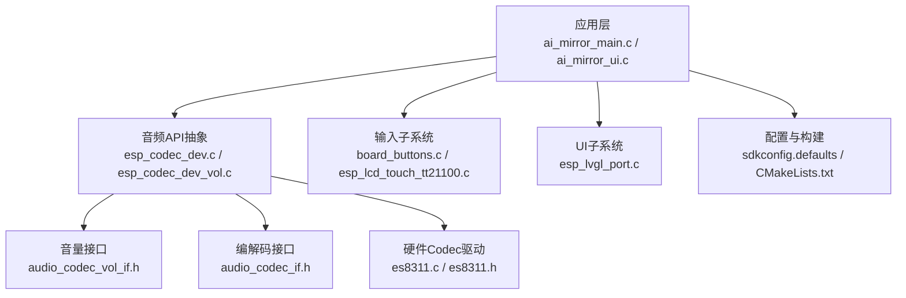
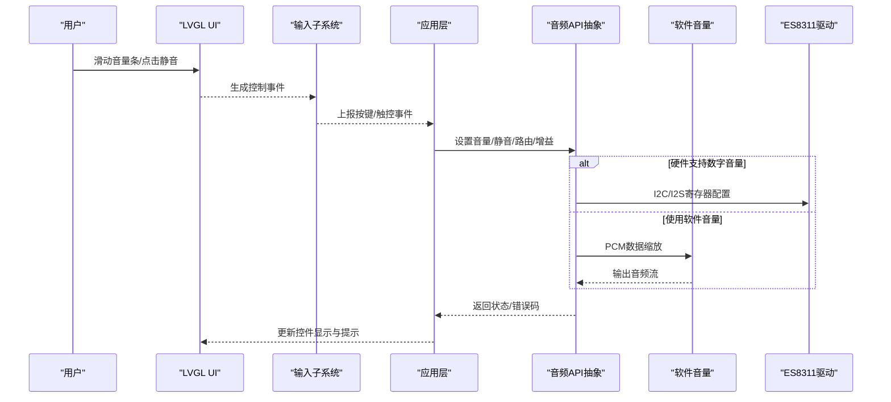
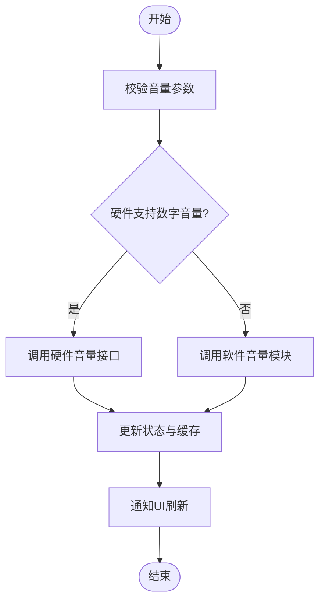
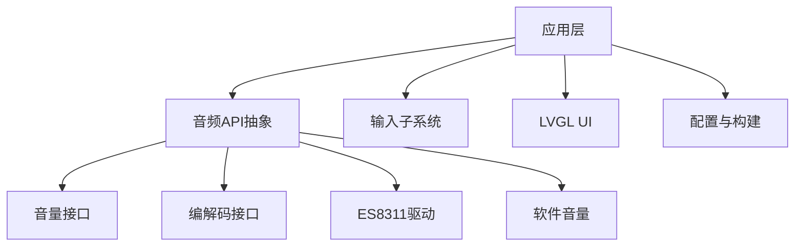

# 音频控制API

<cite>
**本文引用的文件**   
- [ai_mirror_main.c](file://Firmware/esp32_ai_mirror/main/ai_mirror_main.c)
- [ai_mirror_ui.c](file://Firmware/esp32_ai_mirror/main/ai_mirror_ui.c)
- [board_buttons.c](file://Firmware/esp32_ai_mirror/main/board_buttons.c)
- [board_buttons.h](file://Firmware/esp32_ai_mirror/main/board_buttons.h)
- [es8311.c](file://Firmware/esp32_ai_mirror/managed_components/espressif__es8311/es8311.c)
- [es8311.h](file://Firmware/esp32_ai_mirror/managed_components/espressif__es8311/include/es8311.h)
- [esp_codec_dev.c](file://Firmware/esp32_ai_mirror/managed_components/espressif__esp_codec_dev/esp_codec_dev.c)
- [esp_codec_dev_vol.c](file://Firmware/esp32_ai_mirror/managed_components/espressif__esp_codec_dev/esp_codec_dev_vol.c)
- [audio_codec_sw_vol.c](file://Firmware/esp32_ai_mirror/managed_components/espressif__esp_codec_dev/audio_codec_sw_vol.c)
- [audio_codec_sw_vol.h](file://Firmware/esp32_ai_mirror/managed_components/espressif__esp_codec_dev/audio_codec_sw_vol.h)
- [esp_lvgl_port.c](file://Firmware/esp32_ai_mirror/managed_components/espressif__esp_lvgl_port/esp_lvgl_port.c)
- [esp_lcd_touch_tt21100.c](file://Firmware/esp32_ai_mirror/managed_components/espressif__esp_lcd_touch_tt21100/esp_lcd_touch_tt21100.c)
- [esp_codec_dev_types.h](file://Firmware/esp32_ai_mirror/managed_components/espressif__esp_codec_dev/include/esp_codec_dev_types.h)
- [audio_codec_if.h](file://Firmware/esp32_ai_mirror/managed_components/espressif__esp_codec_dev/interface/audio_codec_if.h)
- [audio_codec_vol_if.h](file://Firmware/esp32_ai_mirror/managed_components/espressif__esp_codec_dev/interface/audio_codec_vol_if.h)
- [sdkconfig.defaults](file://Firmware/esp32_ai_mirror/sdkconfig.defaults)
- [CMakeLists.txt](file://Firmware/esp32_ai_mirror/CMakeLists.txt)
</cite>

## 目录
1. [简介](#简介)
2. [项目结构](#项目结构)
3. [核心组件](#核心组件)
4. [架构总览](#架构总览)
5. [详细组件分析](#详细组件分析)
6. [依赖关系分析](#依赖关系分析)
7. [性能考虑](#性能考虑)
8. [故障排查指南](#故障排查指南)
9. [结论](#结论)
10. [附录](#附录)

## 简介
本文件面向ESP32 AI Mirror项目的音频控制API，系统性说明音量控制、静音切换、音频路由、增益调节、动态范围控制、音频效果处理、用户交互（按键与触摸）、状态管理与事件通知、权限与安全、界面集成示例以及响应性与反馈优化。文档基于代码库中的音频编解码驱动、LVGL UI框架、触控与按钮输入等模块进行梳理，帮助开发者快速集成并扩展音频控制能力。

## 项目结构
本项目采用分层模块化设计：
- 应用层：主程序入口与UI逻辑，负责业务编排与用户交互。
- 音频子系统：通过ESP Codec Dev抽象层统一调用具体Codec（如ES8311），提供音量、静音、路由、增益、AGC/NS/AEC等能力。
- 输入子系统：板载按键与触控（TT21100）采集用户操作，转换为音频控制事件。
- UI子系统：LVGL端口适配，渲染音量条、静音图标、路由选择等控件，并提供事件回调。
- 配置与构建：SDK配置项与CMake清单管理组件依赖与编译选项。

图表来源
- [ai_mirror_main.c](file://Firmware/esp32_ai_mirror/main/ai_mirror_main.c)
- [ai_mirror_ui.c](file://Firmware/esp32_ai_mirror/main/ai_mirror_ui.c)
- [esp_codec_dev.c](file://Firmware/esp32_ai_mirror/managed_components/espressif__esp_codec_dev/esp_codec_dev.c)
- [esp_codec_dev_vol.c](file://Firmware/esp32_ai_mirror/managed_components/espressif__esp_codec_dev/esp_codec_dev_vol.c)
- [es8311.c](file://Firmware/esp32_ai_mirror/managed_components/espressif__es8311/es8311.c)
- [esp_lvgl_port.c](file://Firmware/esp32_ai_mirror/managed_components/espressif__esp_lvgl_port/esp_lvgl_port.c)
- [esp_lcd_touch_tt21100.c](file://Firmware/esp32_ai_mirror/managed_components/espressif__esp_lcd_touch_tt21100/esp_lcd_touch_tt21100.c)
- [sdkconfig.defaults](file://Firmware/esp32_ai_mirror/sdkconfig.defaults)
- [CMakeLists.txt](file://Firmware/esp32_ai_mirror/CMakeLists.txt)

章节来源
- [ai_mirror_main.c](file://Firmware/esp32_ai_mirror/main/ai_mirror_main.c)
- [ai_mirror_ui.c](file://Firmware/esp32_ai_mirror/main/ai_mirror_ui.c)
- [sdkconfig.defaults](file://Firmware/esp32_ai_mirror/sdkconfig.defaults)
- [CMakeLists.txt](file://Firmware/esp32_ai_mirror/CMakeLists.txt)

## 核心组件
- 音频API抽象层
  - 统一封装音量、静音、路由、增益、AGC/NS/AEC等能力，屏蔽底层Codec差异。
  - 关键文件：esp_codec_dev.c、esp_codec_dev_vol.c、audio_codec_vol_if.h、audio_codec_if.h、esp_codec_dev_types.h。
- 硬件Codec驱动
  - ES8311为常用音频编解码器，提供I2S数据通道与寄存器级控制。
  - 关键文件：es8311.c、es8311.h。
- 软件音量实现
  - 当硬件不支持数字音量时，可通过软件音量模块对PCM数据进行缩放。
  - 关键文件：audio_codec_sw_vol.c、audio_codec_sw_vol.h。
- 输入子系统
  - 板载按键与触控芯片（TT21100）将物理操作转为事件，驱动音频控制。
  - 关键文件：board_buttons.c、esp_lcd_touch_tt21100.c。
- UI子系统
  - LVGL端口适配用于渲染控件与处理用户交互。
  - 关键文件：esp_lvgl_port.c。

章节来源
- [esp_codec_dev.c](file://Firmware/esp32_ai_mirror/managed_components/espressif__esp_codec_dev/esp_codec_dev.c)
- [esp_codec_dev_vol.c](file://Firmware/esp32_ai_mirror/managed_components/espressif__esp_codec_dev/esp_codec_dev_vol.c)
- [audio_codec_vol_if.h](file://Firmware/esp32_ai_mirror/managed_components/espressif__esp_codec_dev/interface/audio_codec_vol_if.h)
- [audio_codec_if.h](file://Firmware/esp32_ai_mirror/managed_components/espressif__esp_codec_dev/interface/audio_codec_if.h)
- [esp_codec_dev_types.h](file://Firmware/esp32_ai_mirror/managed_components/espressif__esp_codec_dev/include/esp_codec_dev_types.h)
- [es8311.c](file://Firmware/esp32_ai_mirror/managed_components/espressif__es8311/es8311.c)
- [es8311.h](file://Firmware/esp32_ai_mirror/managed_components/espressif__es8311/include/es8311.h)
- [audio_codec_sw_vol.c](file://Firmware/esp32_ai_mirror/managed_components/espressif__esp_codec_dev/audio_codec_sw_vol.c)
- [audio_codec_sw_vol.h](file://Firmware/esp32_ai_mirror/managed_components/espressif__esp_codec_dev/audio_codec_sw_vol.h)
- [board_buttons.c](file://Firmware/esp32_ai_mirror/main/board_buttons.c)
- [esp_lcd_touch_tt21100.c](file://Firmware/esp32_ai_mirror/managed_components/espressif__esp_lcd_touch_tt21100/esp_lcd_touch_tt21100.c)
- [esp_lvgl_port.c](file://Firmware/esp32_ai_mirror/managed_components/espressif__esp_lvgl_port/esp_lvgl_port.c)

## 架构总览
音频控制从UI或系统事件出发，经输入子系统转化为控制指令，由应用层调用音频API抽象层，最终下发至Codec驱动执行。软件音量作为可选路径在硬件不支持时启用。

图表来源
- [esp_lvgl_port.c](file://Firmware/esp32_ai_mirror/managed_components/espressif__esp_lvgl_port/esp_lvgl_port.c)
- [esp_lcd_touch_tt21100.c](file://Firmware/esp32_ai_mirror/managed_components/espressif__esp_lcd_touch_tt21100/esp_lcd_touch_tt21100.c)
- [board_buttons.c](file://Firmware/esp32_ai_mirror/main/board_buttons.c)
- [esp_codec_dev.c](file://Firmware/esp32_ai_mirror/managed_components/espressif__esp_codec_dev/esp_codec_dev.c)
- [esp_codec_dev_vol.c](file://Firmware/esp32_ai_mirror/managed_components/espressif__esp_codec_dev/esp_codec_dev_vol.c)
- [audio_codec_sw_vol.c](file://Firmware/esp32_ai_mirror/managed_components/espressif__esp_codec_dev/audio_codec_sw_vol.c)
- [es8311.c](file://Firmware/esp32_ai_mirror/managed_components/espressif__es8311/es8311.c)

## 详细组件分析

### 音量控制API
- 功能要点
  - 设置/获取音量值，支持硬件数字音量与软件音量双路径。
  - 音量步进与边界保护，避免溢出与失真。
- 关键接口与类型
  - 音量接口定义位于audio_codec_vol_if.h，包含设置与查询方法。
  - 类型定义在esp_codec_dev_types.h中，涵盖音量单位、范围与枚举。
  - 实现集中在esp_codec_dev_vol.c与audio_codec_sw_vol.c。
- 典型流程
  - UI触发事件→应用层校验参数→调用API设置音量→根据硬件能力选择路径→返回结果并刷新UI。

图表来源
- [audio_codec_vol_if.h](file://Firmware/esp32_ai_mirror/managed_components/espressif__esp_codec_dev/interface/audio_codec_vol_if.h)
- [esp_codec_dev_vol.c](file://Firmware/esp32_ai_mirror/managed_components/espressif__esp_codec_dev/esp_codec_dev_vol.c)
- [audio_codec_sw_vol.c](file://Firmware/esp32_ai_mirror/managed_components/espressif__esp_codec_dev/audio_codec_sw_vol.c)
- [esp_codec_dev_types.h](file://Firmware/esp32_ai_mirror/managed_components/espressif__esp_codec_dev/include/esp_codec_dev_types.h)

章节来源
- [audio_codec_vol_if.h](file://Firmware/esp32_ai_mirror/managed_components/espressif__esp_codec_dev/interface/audio_codec_vol_if.h)
- [esp_codec_dev_vol.c](file://Firmware/esp32_ai_mirror/managed_components/espressif__esp_codec_dev/esp_codec_dev_vol.c)
- [audio_codec_sw_vol.c](file://Firmware/esp32_ai_mirror/managed_components/espressif__esp_codec_dev/audio_codec_sw_vol.c)
- [esp_codec_dev_types.h](file://Firmware/esp32_ai_mirror/managed_components/espressif__esp_codec_dev/include/esp_codec_dev_types.h)

### 静音切换API
- 功能要点
  - 快速静音/取消静音，常用于通话或播放场景的瞬时控制。
  - 可与音量联动，确保静音状态下不产生意外输出。
- 实现位置
  - 通过音频API抽象层统一暴露，底层由Codec驱动或软件音量模块实现。

章节来源
- [esp_codec_dev.c](file://Firmware/esp32_ai_mirror/managed_components/espressif__esp_codec_dev/esp_codec_dev.c)
- [es8311.c](file://Firmware/esp32_ai_mirror/managed_components/espressif__es8311/es8311.c)
- [audio_codec_sw_vol.c](file://Firmware/esp32_ai_mirror/managed_components/espressif__esp_codec_dev/audio_codec_sw_vol.c)

### 音频路由API
- 功能要点
  - 选择音频输入/输出路径（如MIC到ADC、SPK到DAC、耳机插孔检测切换）。
  - 支持动态切换，适应不同外设组合。
- 关键接口
  - 路由控制通过audio_codec_if.h定义的接口进行，结合esp_codec_dev.c进行调度。

章节来源
- [audio_codec_if.h](file://Firmware/esp32_ai_mirror/managed_components/espressif__esp_codec_dev/interface/audio_codec_if.h)
- [esp_codec_dev.c](file://Firmware/esp32_ai_mirror/managed_components/espressif__esp_codec_dev/esp_codec_dev.c)
- [es8311.c](file://Firmware/esp32_ai_mirror/managed_components/espressif__es8311/es8311.c)

### 音频增益调节
- 功能要点
  - 输入增益（麦克风前置放大）与输出增益（功放前级）可调。
  - 与动态范围控制配合，提升信噪比与听感。
- 实现位置
  - 通过音频API抽象层暴露，底层由Codec寄存器或软件算法实现。

章节来源
- [esp_codec_dev.c](file://Firmware/esp32_ai_mirror/managed_components/espressif__esp_codec_dev/esp_codec_dev.c)
- [es8311.c](file://Firmware/esp32_ai_mirror/managed_components/espressif__es8311/es8311.c)

### 动态范围控制（AGC/NS/AEC）
- 功能要点
  - AGC自动增益控制稳定音量；NS降噪抑制背景噪声；AEC回声消除改善通话质量。
  - 这些能力通常由ESP-SR或DSP库提供，并通过音频API接入。
- 集成方式
  - 在音频链路中插入相应模块，按帧处理数据流。

章节来源
- [esp_codec_dev.c](file://Firmware/esp32_ai_mirror/managed_components/espressif__esp_codec_dev/esp_codec_dev.c)
- [audio_codec_if.h](file://Firmware/esp32_ai_mirror/managed_components/espressif__esp_codec_dev/interface/audio_codec_if.h)

### 音频效果处理
- 功能要点
  - 均衡器、混响、压缩等效果可串接于音频链路。
  - 通过DSP库（如esp-dsp）与音频API协同实现。
- 实现建议
  - 以模块化的方式插入处理链，按需开关与参数调整。

章节来源
- [esp_codec_dev.c](file://Firmware/esp32_ai_mirror/managed_components/espressif__esp_codec_dev/esp_codec_dev.c)
- [audio_codec_if.h](file://Firmware/esp32_ai_mirror/managed_components/espressif__esp_codec_dev/interface/audio_codec_if.h)

### 用户交互：按键与触摸控制
- 按键控制
  - 板载按键事件经board_buttons.c上报，映射为音量加减、静音切换等动作。
- 触摸控制
  - TT21100触控芯片提供多点触控，LVGL事件回调驱动音频控制。
- 事件处理
  - 输入子系统与UI子系统协作，保证低延迟与一致性。

章节来源
- [board_buttons.c](file://Firmware/esp32_ai_mirror/main/board_buttons.c)
- [esp_lcd_touch_tt21100.c](file://Firmware/esp32_ai_mirror/managed_components/espressif__esp_lcd_touch_tt21100/esp_lcd_touch_tt21100.c)
- [esp_lvgl_port.c](file://Firmware/esp32_ai_mirror/managed_components/espressif__esp_lvgl_port/esp_lvgl_port.c)

### 音频状态管理与事件通知
- 状态管理
  - 维护当前音量、静音、路由、增益等状态，缓存于应用层或API层。
- 事件通知
  - 通过回调或消息队列通知UI与上层应用，实现实时反馈。
- 可靠性
  - 状态变更需原子化与幂等处理，避免竞态条件。

章节来源
- [ai_mirror_main.c](file://Firmware/esp32_ai_mirror/main/ai_mirror_main.c)
- [ai_mirror_ui.c](file://Firmware/esp32_ai_mirror/main/ai_mirror_ui.c)
- [esp_codec_dev.c](file://Firmware/esp32_ai_mirror/managed_components/espressif__esp_codec_dev/esp_codec_dev.c)

### 权限管理与安全考虑
- 权限模型
  - 区分系统级与应用级音频控制权限，防止越权修改。
- 安全策略
  - 限制敏感操作（如关闭所有输出）仅允许受信任上下文调用。
  - 输入参数校验与边界检查，避免非法值导致崩溃或失真。
- 审计与日志
  - 记录关键控制操作，便于问题定位与合规审计。

章节来源
- [sdkconfig.defaults](file://Firmware/esp32_ai_mirror/sdkconfig.defaults)
- [CMakeLists.txt](file://Firmware/esp32_ai_mirror/CMakeLists.txt)

### 控制界面集成示例
- 界面元素
  - 音量滑块、静音按钮、路由选择器、增益旋钮等。
- 交互流程
  - 用户操作→LVGL事件→输入子系统→应用层→音频API→状态回写→UI刷新。
- 示例步骤
  - 初始化LVGL与触控/按键驱动。
  - 创建控件并绑定回调。
  - 在回调中调用音频API设置参数。
  - 监听状态变化并更新控件显示。

章节来源
- [esp_lvgl_port.c](file://Firmware/esp32_ai_mirror/managed_components/espressif__esp_lvgl_port/esp_lvgl_port.c)
- [ai_mirror_ui.c](file://Firmware/esp32_ai_mirror/main/ai_mirror_ui.c)
- [board_buttons.c](file://Firmware/esp32_ai_mirror/main/board_buttons.c)
- [esp_lcd_touch_tt21100.c](file://Firmware/esp32_ai_mirror/managed_components/espressif__esp_lcd_touch_tt21100/esp_lcd_touch_tt21100.c)

### 响应性优化与用户反馈
- 响应性优化
  - 使用事件驱动与异步处理，减少阻塞。
  - 批量更新UI，降低刷新开销。
- 用户反馈
  - 即时视觉反馈（滑块移动、图标切换）与触觉反馈（震动）。
  - 声音提示（短促提示音）增强确认感。

章节来源
- [esp_lvgl_port.c](file://Firmware/esp32_ai_mirror/managed_components/espressif__esp_lvgl_port/esp_lvgl_port.c)
- [ai_mirror_ui.c](file://Firmware/esp32_ai_mirror/main/ai_mirror_ui.c)

## 依赖关系分析
音频控制涉及多层依赖：
- 应用层依赖音频API抽象层。
- 音频API依赖具体Codec驱动与可选的软件音量模块。
- 输入与UI子系统为应用层提供事件与展示能力。
- 配置与构建系统管理组件与编译选项。

图表来源
- [esp_codec_dev.c](file://Firmware/esp32_ai_mirror/managed_components/espressif__esp_codec_dev/esp_codec_dev.c)
- [audio_codec_vol_if.h](file://Firmware/esp32_ai_mirror/managed_components/espressif__esp_codec_dev/interface/audio_codec_vol_if.h)
- [audio_codec_if.h](file://Firmware/esp32_ai_mirror/managed_components/espressif__esp_codec_dev/interface/audio_codec_if.h)
- [es8311.c](file://Firmware/esp32_ai_mirror/managed_components/espressif__es8311/es8311.c)
- [audio_codec_sw_vol.c](file://Firmware/esp32_ai_mirror/managed_components/espressif__esp_codec_dev/audio_codec_sw_vol.c)
- [board_buttons.c](file://Firmware/esp32_ai_mirror/main/board_buttons.c)
- [esp_lvgl_port.c](file://Firmware/esp32_ai_mirror/managed_components/espressif__esp_lvgl_port/esp_lvgl_port.c)
- [sdkconfig.defaults](file://Firmware/esp32_ai_mirror/sdkconfig.defaults)
- [CMakeLists.txt](file://Firmware/esp32_ai_mirror/CMakeLists.txt)

章节来源
- [esp_codec_dev.c](file://Firmware/esp32_ai_mirror/managed_components/espressif__esp_codec_dev/esp_codec_dev.c)
- [audio_codec_vol_if.h](file://Firmware/esp32_ai_mirror/managed_components/espressif__esp_codec_dev/interface/audio_codec_vol_if.h)
- [audio_codec_if.h](file://Firmware/esp32_ai_mirror/managed_components/espressif__esp_codec_dev/interface/audio_codec_if.h)
- [es8311.c](file://Firmware/esp32_ai_mirror/managed_components/espressif__es8311/es8311.c)
- [audio_codec_sw_vol.c](file://Firmware/esp32_ai_mirror/managed_components/espressif__esp_codec_dev/audio_codec_sw_vol.c)
- [board_buttons.c](file://Firmware/esp32_ai_mirror/main/board_buttons.c)
- [esp_lvgl_port.c](file://Firmware/esp32_ai_mirror/managed_components/espressif__esp_lvgl_port/esp_lvgl_port.c)
- [sdkconfig.defaults](file://Firmware/esp32_ai_mirror/sdkconfig.defaults)
- [CMakeLists.txt](file://Firmware/esp32_ai_mirror/CMakeLists.txt)

## 性能考虑
- 路径选择
  - 优先使用硬件数字音量，避免软件音量带来的CPU占用与音质损失。
- 数据处理
  - 合理设置缓冲区大小与采样率，平衡延迟与稳定性。
- UI刷新
  - 节流与批处理UI更新，避免频繁重绘。
- 资源管理
  - 及时释放音频资源，避免内存泄漏与句柄耗尽。

[本节为通用指导，无需特定文件引用]

## 故障排查指南
- 常见问题
  - 音量无变化：检查硬件音量是否启用、参数范围是否正确、路径是否被其他模块占用。
  - 静音无效：确认静音标志位与底层寄存器配置一致。
  - 路由异常：验证输入输出路径配置与外设连接。
- 调试手段
  - 启用日志与状态打印，追踪API调用链。
  - 使用示波器或逻辑分析仪观察I2S与I2C信号。
- 恢复策略
  - 重置音频子系统状态，重新初始化Codec。

章节来源
- [esp_codec_dev.c](file://Firmware/esp32_ai_mirror/managed_components/espressif__esp_codec_dev/esp_codec_dev.c)
- [es8311.c](file://Firmware/esp32_ai_mirror/managed_components/espressif__es8311/es8311.c)
- [audio_codec_sw_vol.c](file://Firmware/esp32_ai_mirror/managed_components/espressif__esp_codec_dev/audio_codec_sw_vol.c)

## 结论
本音频控制API通过统一的抽象层整合硬件与软件能力，提供完善的音量、静音、路由、增益与效果处理能力。结合按键与触摸输入、LVGL界面与状态事件机制，可实现高效、直观且可靠的音频控制体验。建议在开发中遵循权限与安全策略，注重性能优化与用户体验反馈。

[本节为总结性内容，无需特定文件引用]

## 附录
- 术语表
  - 音量：音频信号的强度控制。
  - 静音：临时关闭音频输出。
  - 路由：音频输入/输出路径的选择。
  - 增益：信号放大倍数。
  - AGC/NS/AEC：自动增益控制/降噪/回声消除。
- 参考文件
  - 音频API与类型定义：esp_codec_dev.c、esp_codec_dev_vol.c、audio_codec_vol_if.h、audio_codec_if.h、esp_codec_dev_types.h。
  - 硬件驱动：es8311.c、es8311.h。
  - 软件音量：audio_codec_sw_vol.c、audio_codec_sw_vol.h。
  - 输入与UI：board_buttons.c、esp_lcd_touch_tt21100.c、esp_lvgl_port.c。
  - 配置与构建：sdkconfig.defaults、CMakeLists.txt。

章节来源
- [esp_codec_dev.c](file://Firmware/esp32_ai_mirror/managed_components/espressif__esp_codec_dev/esp_codec_dev.c)
- [esp_codec_dev_vol.c](file://Firmware/esp32_ai_mirror/managed_components/espressif__esp_codec_dev/esp_codec_dev_vol.c)
- [audio_codec_vol_if.h](file://Firmware/esp32_ai_mirror/managed_components/espressif__esp_codec_dev/interface/audio_codec_vol_if.h)
- [audio_codec_if.h](file://Firmware/esp32_ai_mirror/managed_components/espressif__esp_codec_dev/interface/audio_codec_if.h)
- [esp_codec_dev_types.h](file://Firmware/esp32_ai_mirror/managed_components/espressif__esp_codec_dev/include/esp_codec_dev_types.h)
- [es8311.c](file://Firmware/esp32_ai_mirror/managed_components/espressif__es8311/es8311.c)
- [es8311.h](file://Firmware/esp32_ai_mirror/managed_components/espressif__es8311/include/es8311.h)
- [audio_codec_sw_vol.c](file://Firmware/esp32_ai_mirror/managed_components/espressif__esp_codec_dev/audio_codec_sw_vol.c)
- [audio_codec_sw_vol.h](file://Firmware/esp32_ai_mirror/managed_components/espressif__esp_codec_dev/audio_codec_sw_vol.h)
- [board_buttons.c](file://Firmware/esp32_ai_mirror/main/board_buttons.c)
- [esp_lcd_touch_tt21100.c](file://Firmware/esp32_ai_mirror/managed_components/espressif__esp_lcd_touch_tt21100/esp_lcd_touch_tt21100.c)
- [esp_lvgl_port.c](file://Firmware/esp32_ai_mirror/managed_components/espressif__esp_lvgl_port/esp_lvgl_port.c)
- [sdkconfig.defaults](file://Firmware/esp32_ai_mirror/sdkconfig.defaults)
- [CMakeLists.txt](file://Firmware/esp32_ai_mirror/CMakeLists.txt)