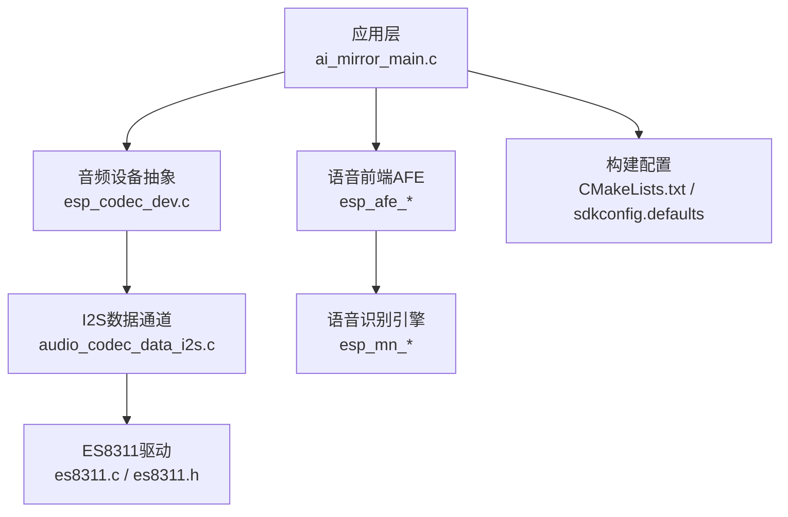
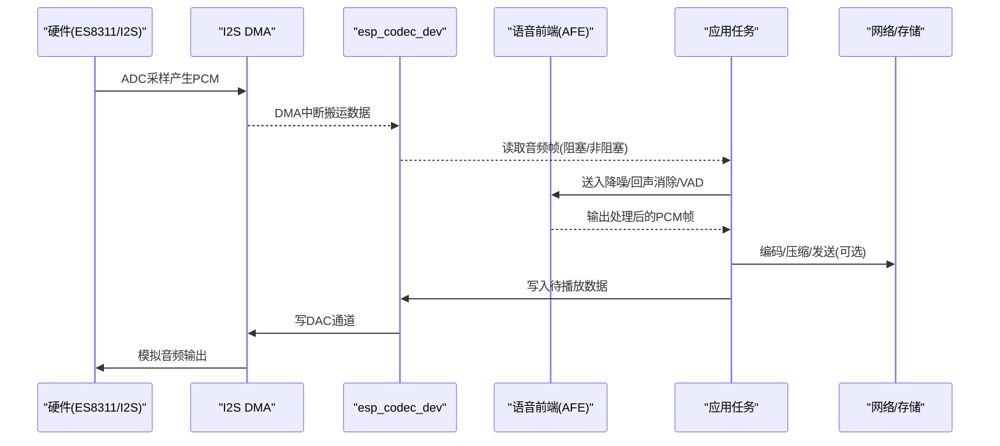
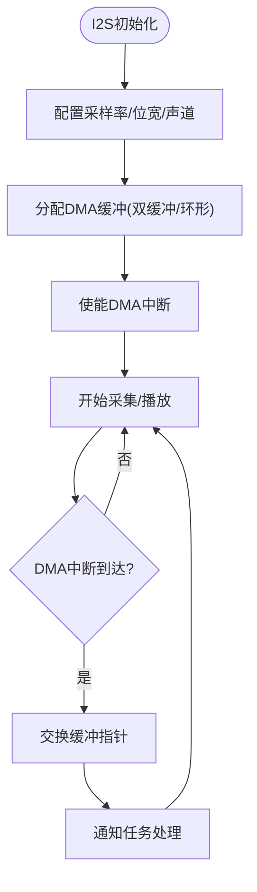
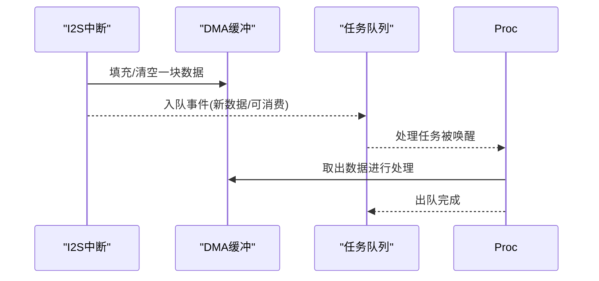
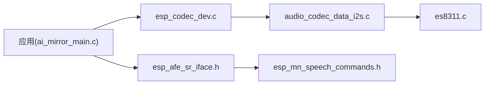

# 音频流处理API

<cite>
**本文引用的文件**   
- [ai_mirror_main.c](file://Firmware/esp32_ai_mirror/main/ai_mirror_main.c)
- [CMakeLists.txt](file://Firmware/esp32_ai_mirror/main/CMakeLists.txt)
- [es8311.h](file://Firmware/esp32_ai_mirror/managed_components/espressif__es8311/include/es8311.h)
- [es8311.c](file://Firmware/esp32_ai_mirror/managed_components/espressif__es8311/es8311.c)
- [audio_codec_data_i2s.c](file://Firmware/esp32_ai_mirror/managed_components/espressif__esp_codec_dev/platform/audio_codec_data_i2s.c)
- [esp_codec_dev.c](file://Firmware/esp32_ai_mirror/managed_components/espressif__esp_codec_dev/esp_codec_dev.c)
- [esp_codec_dev_defaults.h](file://Firmware/esp32_ai_mirror/managed_components/espressif__esp_codec_dev/include/esp_codec_dev_defaults.h)
- [esp_codec_dev_types.h](file://Firmware/esp32_ai_mirror/managed_components/espressif__esp_codec_dev/include/esp_codec_dev_types.h)
- [audio_codec_if.h](file://Firmware/esp32_ai_mirror/managed_components/espressif__esp_codec_dev/interface/audio_codec_if.h)
- [audio_codec_data_if.h](file://Firmware/esp32_ai_mirror/managed_components/espressif__esp_codec_dev/interface/audio_codec_data_if.h)
- [esp_afe_sr_iface.h](file://Firmware/esp32_ai_mirror/components/espressif__esp-sr/include/esp_afe_sr_iface.h)
- [esp_afe_config.h](file://Firmware/esp32_ai_mirror/components/espressif__esp-sr/include/esp_afe_config.h)
- [esp_mn_speech_commands.h](file://Firmware/esp32_ai_mirror/components/espressif__esp-sr/src/include/esp_mn_speech_commands.h)
- [esp_process_sdkconfig.c](file://Firmware/esp32_ai_mirror/components/espressif__esp-sr/src/esp_process_sdkconfig.c)
- [sdkconfig.defaults](file://Firmware/esp32_ai_mirror/sdkconfig.defaults)
</cite>

## 目录
1. [简介](#简介)
2. [项目结构](#项目结构)
3. [核心组件](#核心组件)
4. [架构总览](#架构总览)
5. [详细组件分析](#详细组件分析)
6. [依赖关系分析](#依赖关系分析)
7. [性能考虑](#性能考虑)
8. [故障排查指南](#故障排查指南)
9. [结论](#结论)
10. [附录](#附录)

## 简介
本文件面向ESP32平台的音频流处理API，围绕I2S接口、DMA缓冲、中断与数据同步、多线程处理、格式转换与压缩、错误恢复与异常处理、录制与播放示例、延迟优化与性能调优等主题进行系统化说明。文档以仓库中的ESP-IDF工程为基础，结合es8311编解码器驱动、esp_codec_dev框架以及esp-sr语音前端（AFE）模块，给出端到端的音频采集、处理与回放路径。

## 项目结构
该工程采用分层组织：
- 应用层：main目录下为应用入口与业务逻辑，负责初始化各子系统并编排音频流任务。
- 硬件抽象层：通过esp_codec_dev提供统一的音频设备抽象，屏蔽I2S、ADC/DAC差异。
- 编解码器驱动：es8311作为具体Codec驱动，实现寄存器配置与数据通路控制。
- 语音前端：esp-sr提供降噪、回声消除、VAD、唤醒词识别等能力，并以AFE接口接入。
- 构建与配置：CMakeLists与sdkconfig.defaults管理组件依赖与编译选项。

图表来源 
- [ai_mirror_main.c](file://Firmware/esp32_ai_mirror/main/ai_mirror_main.c)
- [esp_codec_dev.c](file://Firmware/esp32_ai_mirror/managed_components/espressif__esp_codec_dev/esp_codec_dev.c)
- [audio_codec_data_i2s.c](file://Firmware/esp32_ai_mirror/managed_components/espressif__esp_codec_dev/platform/audio_codec_data_i2s.c)
- [es8311.c](file://Firmware/esp32_ai_mirror/managed_components/espressif__es8311/es8311.c)
- [es8311.h](file://Firmware/esp32_ai_mirror/managed_components/espressif__es8311/include/es8311.h)
- [esp_afe_sr_iface.h](file://Firmware/esp32_ai_mirror/components/espressif__esp-sr/include/esp_afe_sr_iface.h)
- [esp_mn_speech_commands.h](file://Firmware/esp32_ai_mirror/components/espressif__esp-sr/src/include/esp_mn_speech_commands.h)
- [CMakeLists.txt](file://Firmware/esp32_ai_mirror/main/CMakeLists.txt)
- [sdkconfig.defaults](file://Firmware/esp32_ai_mirror/sdkconfig.defaults)

章节来源
- [CMakeLists.txt](file://Firmware/esp32_ai_mirror/main/CMakeLists.txt)
- [sdkconfig.defaults](file://Firmware/esp32_ai_mirror/sdkconfig.defaults)

## 核心组件
- 音频设备抽象（esp_codec_dev）
  - 统一接口：打开/关闭、设置采样率/位宽/声道数、读写数据、音量控制、事件回调。
  - 关键类型：设备描述、参数结构体、事件枚举等。
- I2S数据通道（audio_codec_data_i2s）
  - 基于ESP-IDF I2S外设，使用DMA双缓冲或环形缓冲，降低CPU占用。
  - 中断触发数据搬运，保证实时性。
- ES8311编解码器驱动
  - 通过I2C/SPI配置寄存器，启用ADC/DAC、Mixer、AGC、HP/LP滤波等。
- 语音前端（esp-sr AFE）
  - 提供降噪、回声消除、VAD、唤醒词检测等算法管线，输出标准化PCM帧。
- 应用主循环（ai_mirror_main）
  - 初始化显示、网络、音频、AFE；创建任务队列；编排录制/播放/识别流程。

章节来源
- [esp_codec_dev.c](file://Firmware/esp32_ai_mirror/managed_components/espressif__esp_codec_dev/esp_codec_dev.c)
- [esp_codec_dev_types.h](file://Firmware/esp32_ai_mirror/managed_components/espressif__esp_codec_dev/include/esp_codec_dev_types.h)
- [audio_codec_data_i2s.c](file://Firmware/esp32_ai_mirror/managed_components/espressif__esp_codec_dev/platform/audio_codec_data_i2s.c)
- [es8311.c](file://Firmware/esp32_ai_mirror/managed_components/espressif__es8311/es8311.c)
- [es8311.h](file://Firmware/esp32_ai_mirror/managed_components/espressif__es8311/include/es8311.h)
- [esp_afe_sr_iface.h](file://Firmware/esp32_ai_mirror/components/espressif__esp-sr/include/esp_afe_sr_iface.h)
- [esp_mn_speech_commands.h](file://Firmware/esp32_ai_mirror/components/espressif__esp-sr/src/include/esp_mn_speech_commands.h)
- [ai_mirror_main.c](file://Firmware/esp32_ai_mirror/main/ai_mirror_main.c)

## 架构总览
下图展示从麦克风到扬声器/网络的完整音频流路径，包含采集、预处理、传输与回放的关键节点。

图表来源 
- [audio_codec_data_i2s.c](file://Firmware/esp32_ai_mirror/managed_components/espressif__esp_codec_dev/platform/audio_codec_data_i2s.c)
- [esp_codec_dev.c](file://Firmware/esp32_ai_mirror/managed_components/espressif__esp_codec_dev/esp_codec_dev.c)
- [es8311.c](file://Firmware/esp32_ai_mirror/managed_components/espressif__es8311/es8311.c)
- [esp_afe_sr_iface.h](file://Firmware/esp32_ai_mirror/components/espressif__esp-sr/include/esp_afe_sr_iface.h)

## 详细组件分析

### I2S与DMA缓冲区管理
- 设计要点
  - 使用双缓冲或环形缓冲，避免数据竞争与丢帧。
  - 中断服务程序仅做最小化数据搬运，将处理交给低优先级任务。
  - 合理设置块大小与采样率，平衡延迟与CPU占用。
- 关键流程
  - 初始化I2S时钟、引脚、DMA通道。
  - 配置DMA长度与回调，启动采集/播放。
  - 在回调中切换读/写指针，通知上层任务取/放数据。

章节来源
- [audio_codec_data_i2s.c](file://Firmware/esp32_ai_mirror/managed_components/espressif__esp_codec_dev/platform/audio_codec_data_i2s.c)

### 中断处理与数据同步
- 中断职责
  - 完成一次DMA搬运后触发中断，更新缓冲状态。
  - 记录时间戳或序列号，便于对齐多通道或后续处理。
- 同步策略
  - 生产者-消费者模型：采集任务生产帧，处理任务消费帧。
  - 使用队列/信号量协调，避免忙等与死锁。
  - 对临界区加锁保护共享变量。

章节来源
- [audio_codec_data_i2s.c](file://Firmware/esp32_ai_mirror/managed_components/espressif__esp_codec_dev/platform/audio_codec_data_i2s.c)

### 音频格式转换与压缩
- 格式转换
  - 位宽转换：16bit/24bit/32bit互转，注意端序与符号扩展。
  - 重采样：不同采样率之间的线性插值或高质量算法。
  - 声道变换：单声道/立体声混音或分离。
- 压缩编码
  - 常用格式：PCM（无损）、OPUS/MP3/AAC（有损）。
  - 选择依据：带宽、延迟、兼容性、算力。
- 流水线建议
  - 采集→降噪/回声消除→重采样→编码→网络/存储。
  - 播放路径相反，解码→重采样→DAC。

章节来源
- [esp_codec_dev_types.h](file://Firmware/esp32_ai_mirror/managed_components/espressif__esp_codec_dev/include/esp_codec_dev_types.h)
- [esp_codec_dev_defaults.h](file://Firmware/esp32_ai_mirror/managed_components/espressif__esp_codec_dev/include/esp_codec_dev_defaults.h)

### 多线程处理与实时性
- 线程划分
  - 采集线程：I2S DMA回调+缓冲管理。
  - 处理线程：AFE算法、格式转换、编码。
  - 播放线程：解码+DAC输出。
  - 网络线程：收发数据包。
- 实时保障
  - 高优先级采集/播放线程，低优先级处理线程。
  - 固定周期调度，避免抖动。
  - 内存预分配，减少运行时分配开销。

章节来源
- [ai_mirror_main.c](file://Firmware/esp32_ai_mirror/main/ai_mirror_main.c)

### 错误恢复与异常处理
- 常见异常
  - I2S DMA溢出/下溢、Codec通信失败、网络丢包、内存不足。
- 恢复策略
  - 自动重试与降级（如降低采样率/码率）。
  - 缓冲水位监控，动态调整处理速率。
  - 日志与告警，便于定位问题。

章节来源
- [esp_codec_dev.c](file://Firmware/esp32_ai_mirror/managed_components/espressif__esp_codec_dev/esp_codec_dev.c)
- [audio_codec_if.h](file://Firmware/esp32_ai_mirror/managed_components/espressif__esp_codec_dev/interface/audio_codec_if.h)

### 完整的录制与播放示例
- 录制流程
  - 初始化Codec与I2S，启动采集。
  - 循环读取PCM帧，送入AFE与编码器，写入文件或网络。
- 播放流程
  - 初始化Codec与I2S，启动播放。
  - 从文件或网络读取压缩数据，解码后写入DAC。
- 注意事项
  - 确保缓冲足够大，避免卡顿。
  - 合理设置超时与重试。
  - 在异常时优雅退出并释放资源。

章节来源
- [ai_mirror_main.c](file://Firmware/esp32_ai_mirror/main/ai_mirror_main.c)
- [es8311.c](file://Firmware/esp32_ai_mirror/managed_components/espressif__es8311/es8311.c)
- [audio_codec_data_i2s.c](file://Firmware/esp32_ai_mirror/managed_components/espressif__esp_codec_dev/platform/audio_codec_data_i2s.c)

## 依赖关系分析
- 组件耦合
  - 应用依赖esp_codec_dev统一接口，解耦具体Codec实现。
  - esp_codec_dev依赖I2S数据通道与OS抽象。
  - AFE与SR引擎通过标准接口接入，便于替换算法。
- 外部依赖
  - ESP-IDF I2S与DMA库。
  - 编解码库（如OPUS/MP3/AAC）。
  - 网络栈（Wi-Fi/以太网）。

图表来源 
- [ai_mirror_main.c](file://Firmware/esp32_ai_mirror/main/ai_mirror_main.c)
- [esp_codec_dev.c](file://Firmware/esp32_ai_mirror/managed_components/espressif__esp_codec_dev/esp_codec_dev.c)
- [audio_codec_data_i2s.c](file://Firmware/esp32_ai_mirror/managed_components/espressif__esp_codec_dev/platform/audio_codec_data_i2s.c)
- [es8311.c](file://Firmware/esp32_ai_mirror/managed_components/espressif__es8311/es8311.c)
- [esp_afe_sr_iface.h](file://Firmware/esp32_ai_mirror/components/espressif__esp-sr/include/esp_afe_sr_iface.h)
- [esp_mn_speech_commands.h](file://Firmware/esp32_ai_mirror/components/espressif__esp-sr/src/include/esp_mn_speech_commands.h)

章节来源
- [esp_process_sdkconfig.c](file://Firmware/esp32_ai_mirror/components/espressif__esp-sr/src/esp_process_sdkconfig.c)
- [sdkconfig.defaults](file://Firmware/esp32_ai_mirror/sdkconfig.defaults)

## 性能考虑
- 延迟优化
  - 减小I2S块大小以降低端到端延迟。
  - 使用零拷贝或最小拷贝路径，避免多余内存操作。
  - 合理设置AFE处理窗口，平衡质量与延迟。
- 吞吐优化
  - 批量处理数据，减少函数调用与上下文切换。
  - 使用SIMD或DSP库加速计算密集型操作。
  - 预分配内存池，避免运行时分配。
- 功耗优化
  - 空闲时降低采样率或关闭非必要模块。
  - 动态调节CPU频率与外设时钟。

[本节为通用指导，不直接分析具体文件]

## 故障排查指南
- 常见问题
  - 无声音：检查Codec初始化、I2S引脚与时钟、DMA是否启动。
  - 爆音/杂音：缓冲不足、采样率不匹配、增益过高。
  - 识别失败：噪声过大、回声未消除、VAD阈值不当。
- 诊断步骤
  - 查看日志与事件回调返回值。
  - 使用示波器/逻辑分析仪验证I2S波形。
  - 逐步禁用算法模块定位瓶颈。
- 恢复措施
  - 重启音频链路，重新初始化Codec。
  - 动态降级参数（采样率/码率/缓冲区大小）。

章节来源
- [esp_codec_dev.c](file://Firmware/esp32_ai_mirror/managed_components/espressif__esp_codec_dev/esp_codec_dev.c)
- [audio_codec_if.h](file://Firmware/esp32_ai_mirror/managed_components/espressif__esp_codec_dev/interface/audio_codec_if.h)

## 结论
本方案基于ESP-IDF与esp_codec_dev框架，结合es8311驱动与esp-sr AFE，构建了稳定高效的音频流处理系统。通过I2S+DMA、中断与队列协同、多线程流水线、格式转换与压缩、错误恢复机制，实现了低延迟、高可靠的采集与播放能力。实际部署中需根据硬件与应用场景调优参数，确保音质、延迟与功耗的平衡。

[本节为总结，不直接分析具体文件]

## 附录
- 配置建议
  - 采样率：16k/48k按需选择，语音优先16k。
  - 位宽：16bit通用，24bit用于高保真。
  - 缓冲：至少2~4个块大小，避免欠载/过载。
- 参考接口
  - 设备控制：打开/关闭、参数设置、音量。
  - 数据读写：阻塞/非阻塞模式，事件回调。
  - AFE接口：降噪、回声消除、VAD、唤醒词。

章节来源
- [esp_codec_dev_defaults.h](file://Firmware/esp32_ai_mirror/managed_components/espressif__esp_codec_dev/include/esp_codec_dev_defaults.h)
- [audio_codec_data_if.h](file://Firmware/esp32_ai_mirror/managed_components/espressif__esp_codec_dev/interface/audio_codec_data_if.h)
- [esp_afe_config.h](file://Firmware/esp32_ai_mirror/components/espressif__esp-sr/include/esp_afe_config.h)