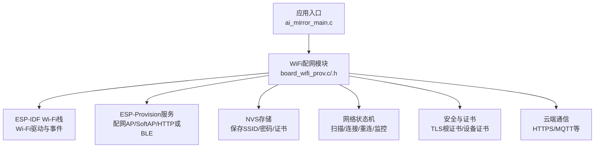
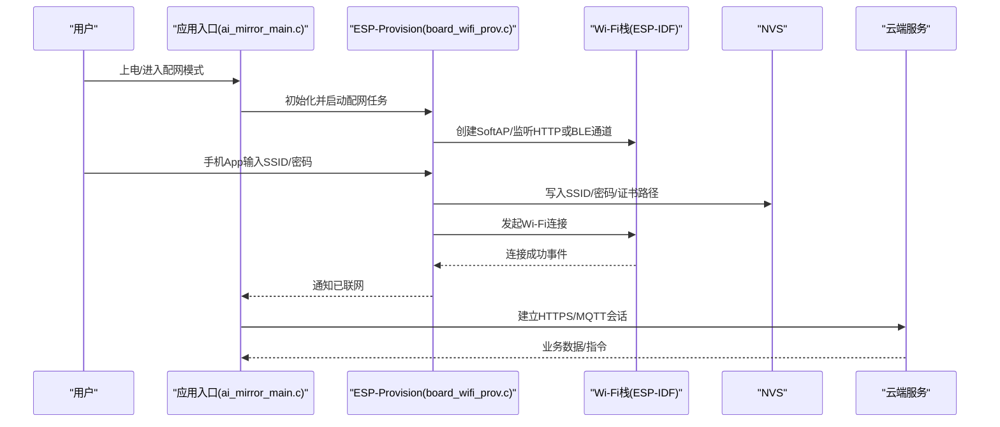
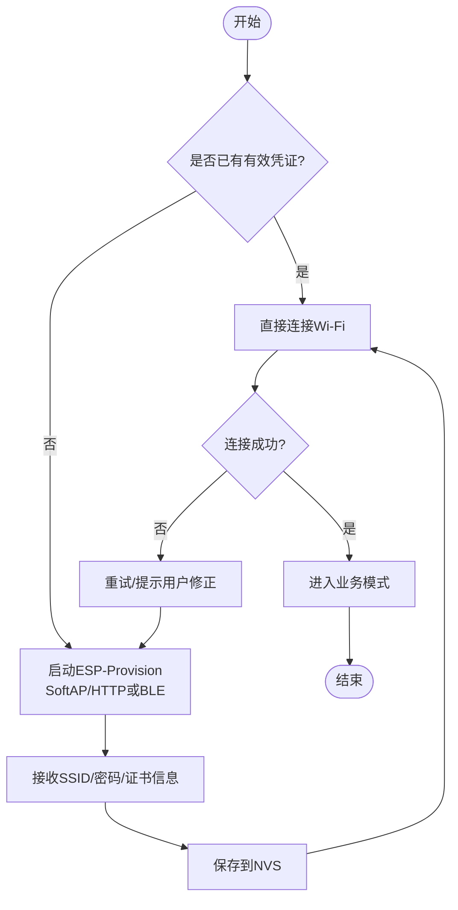
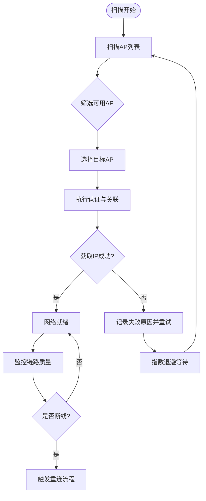
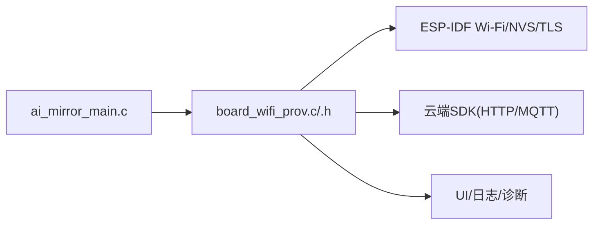

# WiFi连接

<cite>
**本文引用的文件**   
- [Firmware/esp32_ai_mirror/main/board_wifi_prov.c](file://Firmware/esp32_ai_mirror/main/board_wifi_prov.c)
- [Firmware/esp32_ai_mirror/main/board_wifi_prov.h](file://Firmware/esp32_ai_mirror/main/board_wifi_prov.h)
- [Firmware/esp32_ai_mirror/main/ai_mirror_main.c](file://Firmware/esp32_ai_mirror/main/ai_mirror_main.c)
- [Firmware/esp32_ai_mirror/WiFi配网功能计划书.md](file://Firmware/esp32_ai_mirror/WiFi配网功能计划书.md)
</cite>

## 目录
1. [简介](#简介)
2. [项目结构](#项目结构)
3. [核心组件](#核心组件)
4. [架构总览](#架构总览)
5. [详细组件分析](#详细组件分析)
6. [依赖关系分析](#依赖关系分析)
7. [性能与功耗优化](#性能与功耗优化)
8. [故障排除指南](#故障排除指南)
9. [结论](#结论)
10. [附录](#附录)

## 简介
本文件面向AI镜子的WiFi连接能力，系统性阐述ESP-Provision配网方案、WiFi扫描与连接建立、断线重连与网络状态监控、安全连接与证书管理、云端通信协议与数据格式、网络诊断工具与排障方法，以及性能与功耗优化策略。文档兼顾工程实现细节与用户体验优化，帮助开发者快速理解并扩展该模块。

## 项目结构
与WiFi连接相关的关键代码位于固件工程的main目录下，其中board_wifi_prov.*负责ESP-Provision配网流程封装与事件处理；ai_mirror_main.c作为应用入口，初始化各子系统并协调配网任务；“WiFi配网功能计划书”提供产品级需求与设计说明。

图表来源
- [Firmware/esp32_ai_mirror/main/ai_mirror_main.c](file://Firmware/esp32_ai_mirror/main/ai_mirror_main.c)
- [Firmware/esp32_ai_mirror/main/board_wifi_prov.c](file://Firmware/esp32_ai_mirror/main/board_wifi_prov.c)
- [Firmware/esp32_ai_mirror/main/board_wifi_prov.h](file://Firmware/esp32_ai_mirror/main/board_wifi_prov.h)
- [Firmware/esp32_ai_mirror/WiFi配网功能计划书.md](file://Firmware/esp32_ai_mirror/WiFi配网功能计划书.md)

章节来源
- [Firmware/esp32_ai_mirror/main/board_wifi_prov.c](file://Firmware/esp32_ai_mirror/main/board_wifi_prov.c)
- [Firmware/esp32_ai_mirror/main/board_wifi_prov.h](file://Firmware/esp32_ai_mirror/main/board_wifi_prov.h)
- [Firmware/esp32_ai_mirror/main/ai_mirror_main.c](file://Firmware/esp32_ai_mirror/main/ai_mirror_main.c)
- [Firmware/esp32_ai_mirror/WiFi配网功能计划书.md](file://Firmware/esp32_ai_mirror/WiFi配网功能计划书.md)

## 核心组件
- 应用入口与任务编排：负责系统初始化、事件注册、配网任务启动与生命周期管理。
- ESP-Provision配网模块：封装配网流程（SoftAP/HTTP/BLE）、用户交互提示、凭证下发与持久化。
- Wi-Fi管理与状态机：负责扫描、连接、断开、重连、信号质量监控与事件上报。
- 安全与证书管理：加载根证书、设备证书与私钥，配置TLS参数。
- 云端通信层：基于HTTPS/MQTT等协议与云端交互，支持心跳、消息队列与错误重试。
- 诊断与日志：采集RSSI、连接状态、重连次数、握手失败原因等，便于定位问题。

章节来源
- [Firmware/esp32_ai_mirror/main/board_wifi_prov.c](file://Firmware/esp32_ai_mirror/main/board_wifi_prov.c)
- [Firmware/esp32_ai_mirror/main/board_wifi_prov.h](file://Firmware/esp32_ai_mirror/main/board_wifi_prov.h)
- [Firmware/esp32_ai_mirror/main/ai_mirror_main.c](file://Firmware/esp32_ai_mirror/main/ai_mirror_main.c)

## 架构总览
整体采用分层设计：应用层通过统一接口调用WiFi与配网能力；中间层封装ESP-Provision与Wi-Fi事件；底层由ESP-IDF Wi-Fi栈与NVS存储提供支撑。

图表来源
- [Firmware/esp32_ai_mirror/main/ai_mirror_main.c](file://Firmware/esp32_ai_mirror/main/ai_mirror_main.c)
- [Firmware/esp32_ai_mirror/main/board_wifi_prov.c](file://Firmware/esp32_ai_mirror/main/board_wifi_prov.c)
- [Firmware/esp32_ai_mirror/main/board_wifi_prov.h](file://Firmware/esp32_ai_mirror/main/board_wifi_prov.h)

## 详细组件分析

### ESP-Provision配网流程与用户体验优化
- 流程要点
  - 启动SoftAP或启用BLE通道，生成临时热点或二维码。
  - 接收手机端下发的SSID、密码及可选的服务器地址、证书指纹等。
  - 校验并持久化到NVS，随后切换至Station模式进行连接。
  - 连接成功后关闭临时通道，返回正常业务运行。
- 用户体验优化
  - 明确的状态指示（LED/屏幕提示）与倒计时反馈。
  - 失败时给出可操作建议（如检查密码、路由器频段、距离）。
  - 支持多SSID记忆与自动回退到上次可用网络。
  - 支持一键恢复出厂设置以清除旧凭证。

图表来源
- [Firmware/esp32_ai_mirror/main/board_wifi_prov.c](file://Firmware/esp32_ai_mirror/main/board_wifi_prov.c)
- [Firmware/esp32_ai_mirror/main/board_wifi_prov.h](file://Firmware/esp32_ai_mirror/main/board_wifi_prov.h)

章节来源
- [Firmware/esp32_ai_mirror/main/board_wifi_prov.c](file://Firmware/esp32_ai_mirror/main/board_wifi_prov.c)
- [Firmware/esp32_ai_mirror/main/board_wifi_prov.h](file://Firmware/esp32_ai_mirror/main/board_wifi_prov.h)
- [Firmware/esp32_ai_mirror/WiFi配网功能计划书.md](file://Firmware/esp32_ai_mirror/WiFi配网功能计划书.md)

### WiFi扫描、连接建立与断线重连
- 扫描机制
  - 周期性或按需扫描周边AP，过滤不可用频段与弱信号。
  - 缓存最近可用AP列表，加速重连选择。
- 连接建立
  - 优先尝试上次成功连接的BSSID/SSID，提升成功率。
  - 根据信道与加密方式动态选择最优AP。
- 断线重连
  - 监听Wi-Fi事件，捕获断开原因（认证失败、超时、信号丢失等）。
  - 指数退避+最大重试次数，避免频繁重连导致功耗飙升。
  - 支持手动触发重新配网与网络切换。

图表来源
- [Firmware/esp32_ai_mirror/main/board_wifi_prov.c](file://Firmware/esp32_ai_mirror/main/board_wifi_prov.c)
- [Firmware/esp32_ai_mirror/main/board_wifi_prov.h](file://Firmware/esp32_ai_mirror/main/board_wifi_prov.h)

章节来源
- [Firmware/esp32_ai_mirror/main/board_wifi_prov.c](file://Firmware/esp32_ai_mirror/main/board_wifi_prov.c)
- [Firmware/esp32_ai_mirror/main/board_wifi_prov.h](file://Firmware/esp32_ai_mirror/main/board_wifi_prov.h)

### 网络状态监控与事件上报
- 监控指标
  - RSSI、信噪比、丢包率、往返时延、重连次数、握手失败原因码。
- 事件上报
  - 连接成功/失败、断线原因、网络切换、证书校验失败等。
- 可视化与日志
  - 在UI显示当前网络状态与信号强度。
  - 输出结构化日志便于远程诊断。

章节来源
- [Firmware/esp32_ai_mirror/main/board_wifi_prov.c](file://Firmware/esp32_ai_mirror/main/board_wifi_prov.c)
- [Firmware/esp32_ai_mirror/main/board_wifi_prov.h](file://Firmware/esp32_ai_mirror/main/board_wifi_prov.h)

### 安全连接配置与证书管理
- 证书类型
  - 根证书用于验证服务端身份。
  - 设备证书与私钥用于双向认证（可选）。
- 存储位置
  - 证书与私钥存放于NVS或SPIFFS分区，按路径引用。
- 配置项
  - TLS版本、加密套件、证书指纹校验、CA更新机制。
- 安全实践
  - 最小权限原则，仅加载必要证书。
  - 定期更新根证书，防范过期风险。

章节来源
- [Firmware/esp32_ai_mirror/main/board_wifi_prov.c](file://Firmware/esp32_ai_mirror/main/board_wifi_prov.c)
- [Firmware/esp32_ai_mirror/main/board_wifi_prov.h](file://Firmware/esp32_ai_mirror/main/board_wifi_prov.h)

### 与云端服务的通信协议与数据传输格式
- 传输协议
  - HTTPS REST API或MQTT over TLS，依据云端能力选择。
- 数据格式
  - JSON为主，包含设备ID、时间戳、业务载荷与签名。
- 可靠性
  - 心跳保活、消息确认、失败重试与幂等性设计。
- 安全
  - 端到端TLS、请求签名、防重放攻击。

章节来源
- [Firmware/esp32_ai_mirror/main/board_wifi_prov.c](file://Firmware/esp32_ai_mirror/main/board_wifi_prov.c)
- [Firmware/esp32_ai_mirror/main/board_wifi_prov.h](file://Firmware/esp32_ai_mirror/main/board_wifi_prov.h)

### 网络诊断工具与故障排除
- 内置诊断
  - 打印Wi-Fi事件、DHCP结果、TLS握手详情、HTTP/MQTT状态码。
  - 导出最近一次配网与连接日志。
- 常见故障
  - 无法扫描到AP：检查频段、信道、路由器设置。
  - 认证失败：核对SSID/密码、WPA2/WPA3兼容性。
  - DHCP超时：路由器DHCP池耗尽或分配异常。
  - TLS握手失败：证书不匹配或根证书过期。
- 修复步骤
  - 重启设备、重置网络、更新证书、更换路由器或信道。

章节来源
- [Firmware/esp32_ai_mirror/main/board_wifi_prov.c](file://Firmware/esp32_ai_mirror/main/board_wifi_prov.c)
- [Firmware/esp32_ai_mirror/main/board_wifi_prov.h](file://Firmware/esp32_ai_mirror/main/board_wifi_prov.h)

## 依赖关系分析
- 外部依赖
  - ESP-IDF Wi-Fi与事件框架、NVS存储、TLS库、HTTP/MQTT客户端。
- 内部耦合
  - ai_mirror_main.c负责初始化与任务调度，board_wifi_prov.c封装配网与网络状态机。
- 潜在循环依赖
  - 通过头文件抽象与回调机制解耦，避免直接循环引用。

图表来源
- [Firmware/esp32_ai_mirror/main/ai_mirror_main.c](file://Firmware/esp32_ai_mirror/main/ai_mirror_main.c)
- [Firmware/esp32_ai_mirror/main/board_wifi_prov.c](file://Firmware/esp32_ai_mirror/main/board_wifi_prov.c)
- [Firmware/esp32_ai_mirror/main/board_wifi_prov.h](file://Firmware/esp32_ai_mirror/main/board_wifi_prov.h)

章节来源
- [Firmware/esp32_ai_mirror/main/ai_mirror_main.c](file://Firmware/esp32_ai_mirror/main/ai_mirror_main.c)
- [Firmware/esp32_ai_mirror/main/board_wifi_prov.c](file://Firmware/esp32_ai_mirror/main/board_wifi_prov.c)
- [Firmware/esp32_ai_mirror/main/board_wifi_prov.h](file://Firmware/esp32_ai_mirror/main/board_wifi_prov.h)

## 性能与功耗优化
- 扫描与连接
  - 限制扫描频率，使用缓存AP列表减少空扫。
  - 优先尝试已知BSSID，缩短关联时间。
- 重连策略
  - 指数退避与最大重试上限，避免风暴式重连。
  - 区分瞬时抖动与真实断线，降低误判。
- 功耗管理
  - 空闲时降低扫描周期，必要时进入低功耗模式。
  - 合理设置Wi-Fi休眠与唤醒阈值。
- 内存与CPU
  - 复用缓冲区，减少动态分配。
  - 关键路径异步化，避免阻塞主循环。

[本节为通用指导，无需特定文件引用]

## 故障排除指南
- 快速自检
  - 确认路由器开启2.4GHz/5GHz且未隐藏SSID。
  - 检查设备指示灯与屏幕提示是否正常。
- 日志收集
  - 导出最近一次配网与连接日志，关注错误码与原因。
- 常见问题定位
  - 认证失败：核对密码与加密方式。
  - DHCP失败：检查路由器DHCP池与租期。
  - TLS失败：校验证书链与时间同步。
- 恢复手段
  - 重置网络、更新固件与证书、更换路由器或信道。

章节来源
- [Firmware/esp32_ai_mirror/main/board_wifi_prov.c](file://Firmware/esp32_ai_mirror/main/board_wifi_prov.c)
- [Firmware/esp32_ai_mirror/main/board_wifi_prov.h](file://Firmware/esp32_ai_mirror/main/board_wifi_prov.h)

## 结论
本方案以ESP-Provision为核心，结合稳健的Wi-Fi管理与安全证书体系，实现了可靠的WiFi配网与连接管理。通过完善的监控、诊断与优化策略，确保用户体验与系统稳定性。后续可根据云端能力进一步扩展协议与功能。

[本节为总结性内容，无需特定文件引用]

## 附录
- 术语
  - ESP-Provision：乐鑫提供的设备配网框架，支持SoftAP/HTTP/BLE等多种方式。
  - RSSI：接收信号强度指示，衡量Wi-Fi信号强弱。
  - NVS：非易失性存储，用于保存SSID、密码与证书路径等配置。
- 参考
  - “WiFi配网功能计划书”提供产品需求与设计要点，可作为扩展依据。

章节来源
- [Firmware/esp32_ai_mirror/WiFi配网功能计划书.md](file://Firmware/esp32_ai_mirror/WiFi配网功能计划书.md)