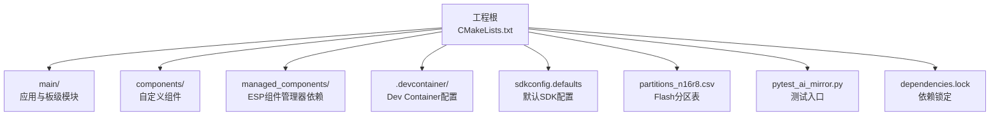
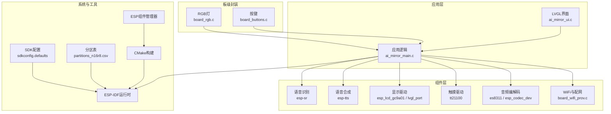
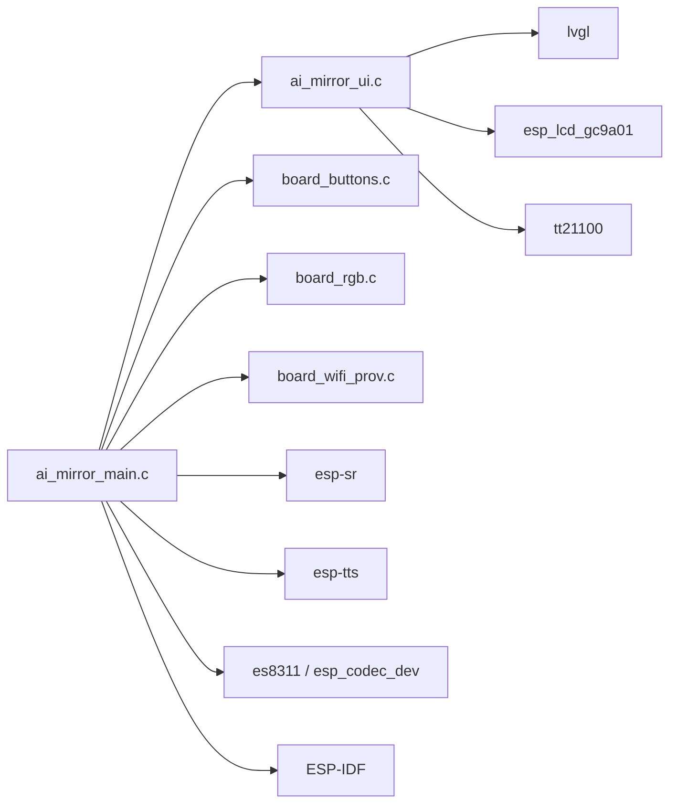

# 开发指南

<cite>
**本文档引用的文件**   
- [CMakeLists.txt](file://Firmware/esp32_ai_mirror/CMakeLists.txt)
- [sdkconfig.defaults](file://Firmware/esp32_ai_mirror/sdkconfig.defaults)
- [pytest_ai_mirror.py](file://Firmware/esp32_ai_mirror/pytest_ai_mirror.py)
- [devcontainer.json](file://Firmware/esp32_ai_mirror/.devcontainer/devcontainer.json)
- [Dockerfile](file://Firmware/esp32_ai_mirror/.devcontainer/Dockerfile)
- [main/CMakeLists.txt](file://Firmware/esp32_ai_mirror/main/CMakeLists.txt)
- [idf_component.yml](file://Firmware/esp32_ai_mirror/main/idf_component.yml)
- [ai_mirror_main.c](file://Firmware/esp32_ai_mirror/main/ai_mirror_main.c)
- [ai_mirror_ui.c](file://Firmware/esp32_ai_mirror/main/ai_mirror_ui.c)
- [board_buttons.c](file://Firmware/esp32_ai_mirror/main/board_buttons.c)
- [board_rgb.c](file://Firmware/esp32_ai_mirror/main/board_rgb.c)
- [board_wifi_prov.c](file://Firmware/esp32_ai_mirror/main/board_wifi_prov.c)
- [dependencies.lock](file://Firmware/esp32_ai_mirror/dependencies.lock)
- [partitions_n16r8.csv](file://Firmware/esp32_ai_mirror/partitions_n16r8.csv)
- [README.md](file://Firmware/esp32_ai_mirror/README.md)
</cite>

## 目录
1. [简介](#简介)
2. [项目结构](#项目结构)
3. [核心组件](#核心组件)
4. [架构总览](#架构总览)
5. [详细组件分析](#详细组件分析)
6. [依赖分析](#依赖分析)
7. [性能考量](#性能考量)
8. [故障排查指南](#故障排查指南)
9. [结论](#结论)
10. [附录](#附录)

## 简介
本指南面向AI镜子（ESP32-S3）项目的开发者，覆盖从环境搭建、构建系统配置、组件与依赖管理，到VS Code远程开发、单元测试与自动化测试、代码审查与版本控制规范、性能分析与内存泄漏检测，以及常见问题解决方案与最佳实践。目标是帮助团队快速上手并高效迭代，确保代码质量与可维护性。

## 项目结构
本项目基于ESP-IDF框架，采用CMake作为构建系统，使用ESP Component Manager进行组件管理。关键目录与职责如下：
- Firmware/esp32_ai_mirror: ESP32应用工程根目录
  - main/: 应用主逻辑与板级驱动封装
  - components/: 第三方或内部组件（如语音识别、TTS、LCD驱动等）
  - managed_components/: 通过ESP Component Manager自动管理的依赖
  - .devcontainer/: VS Code Dev Container配置，支持容器化远程开发
  - CMakeLists.txt: 顶层CMake配置，定义目标、分区表、SDK配置等
  - sdkconfig.defaults: 默认SDK配置项
  - pytest_ai_mirror.py: 基于pytest的测试入口
  - dependencies.lock: 组件依赖锁定文件，保证构建可重复
  - partitions_n16r8.csv: Flash分区表定义

图表来源
- [CMakeLists.txt](file://Firmware/esp32_ai_mirror/CMakeLists.txt)
- [main/CMakeLists.txt](file://Firmware/esp32_ai_mirror/main/CMakeLists.txt)
- [sdkconfig.defaults](file://Firmware/esp32_ai_mirror/sdkconfig.defaults)
- [pytest_ai_mirror.py](file://Firmware/esp32_ai_mirror/pytest_ai_mirror.py)
- [devcontainer.json](file://Firmware/esp32_ai_mirror/.devcontainer/devcontainer.json)
- [Dockerfile](file://Firmware/esp32_ai_mirror/.devcontainer/Dockerfile)
- [dependencies.lock](file://Firmware/esp32_ai_mirror/dependencies.lock)
- [partitions_n16r8.csv](file://Firmware/esp32_ai_mirror/partitions_n16r8.csv)

章节来源
- [CMakeLists.txt](file://Firmware/esp32_ai_mirror/CMakeLists.txt)
- [main/CMakeLists.txt](file://Firmware/esp32_ai_mirror/main/CMakeLists.txt)
- [sdkconfig.defaults](file://Firmware/esp32_ai_mirror/sdkconfig.defaults)
- [pytest_ai_mirror.py](file://Firmware/esp32_ai_mirror/pytest_ai_mirror.py)
- [devcontainer.json](file://Firmware/esp32_ai_mirror/.devcontainer/devcontainer.json)
- [Dockerfile](file://Firmware/esp32_ai_mirror/.devcontainer/Dockerfile)
- [dependencies.lock](file://Firmware/esp32_ai_mirror/dependencies.lock)
- [partitions_n16r8.csv](file://Firmware/esp32_ai_mirror/partitions_n16r8.csv)

## 核心组件
- 应用主循环与初始化
  - ai_mirror_main.c: 系统初始化、任务调度、外设启动、事件处理入口
  - ai_mirror_ui.c: LVGL界面初始化、页面切换、交互事件处理
- 板级驱动封装
  - board_buttons.c: 按键扫描与去抖、事件上报
  - board_rgb.c: RGB灯控制、状态指示
  - board_wifi_prov.c: WiFi配网流程、热点创建、Web服务器或mDNS服务
- 构建与配置
  - main/CMakeLists.txt: 应用组件CMake规则，链接库、源文件、编译选项
  - idf_component.yml: 组件元数据与依赖声明
  - sdkconfig.defaults: 默认SDK配置（如WiFi、LVGL、音频、日志级别等）
  - partitions_n16r8.csv: Flash分区（OTA、NVS、文件系统、模型等）
- 测试与CI
  - pytest_ai_mirror.py: pytest入口，集成ESP-IDF测试框架
  - dependencies.lock: 锁定组件版本，保证可重复构建

章节来源
- [ai_mirror_main.c](file://Firmware/esp32_ai_mirror/main/ai_mirror_main.c)
- [ai_mirror_ui.c](file://Firmware/esp32_ai_mirror/main/ai_mirror_ui.c)
- [board_buttons.c](file://Firmware/esp32_ai_mirror/main/board_buttons.c)
- [board_rgb.c](file://Firmware/esp32_ai_mirror/main/board_rgb.c)
- [board_wifi_prov.c](file://Firmware/esp32_ai_mirror/main/board_wifi_prov.c)
- [main/CMakeLists.txt](file://Firmware/esp32_ai_mirror/main/CMakeLists.txt)
- [idf_component.yml](file://Firmware/esp32_ai_mirror/main/idf_component.yml)
- [sdkconfig.defaults](file://Firmware/esp32_ai_mirror/sdkconfig.defaults)
- [partitions_n16r8.csv](file://Firmware/esp32_ai_mirror/partitions_n16r8.csv)
- [pytest_ai_mirror.py](file://Firmware/esp32_ai_mirror/pytest_ai_mirror.py)
- [dependencies.lock](file://Firmware/esp32_ai_mirror/dependencies.lock)

## 架构总览
整体架构围绕ESP-IDF运行时，分层组织：
- 硬件抽象层（HAL/板级封装）：按键、RGB、I2S/Audio、LCD/Touch
- 中间件与组件：LVGL图形库、语音识别（esp-sr）、TTS、网络栈、WiFi配网
- 应用层：UI界面、业务逻辑、事件分发、任务调度
- 构建与依赖：CMake + ESP Component Manager，分区表与SDK配置

图表来源
- [ai_mirror_main.c](file://Firmware/esp32_ai_mirror/main/ai_mirror_main.c)
- [ai_mirror_ui.c](file://Firmware/esp32_ai_mirror/main/ai_mirror_ui.c)
- [board_buttons.c](file://Firmware/esp32_ai_mirror/main/board_buttons.c)
- [board_rgb.c](file://Firmware/esp32_ai_mirror/main/board_rgb.c)
- [board_wifi_prov.c](file://Firmware/esp32_ai_mirror/main/board_wifi_prov.c)
- [partitions_n16r8.csv](file://Firmware/esp32_ai_mirror/partitions_n16r8.csv)
- [sdkconfig.defaults](file://Firmware/esp32_ai_mirror/sdkconfig.defaults)

## 详细组件分析

### 构建系统与CMake配置
- 顶层CMakeLists.txt负责：
  - 设置ESP-IDF路径与工具链
  - 定义应用目标、包含路径、链接库
  - 引入分区表与SDK配置
  - 启用组件管理与依赖解析
- main/CMakeLists.txt负责：
  - 列出应用源文件
  - 指定组件依赖（如LVGL、esp-sr、音频驱动）
  - 配置编译选项（优化等级、调试符号、宏定义）
- 建议：
  - 将平台相关宏集中管理，避免散落在源文件中
  - 使用target_compile_options精准控制编译行为
  - 通过idf_component.yml声明组件依赖，便于复用与升级

章节来源
- [CMakeLists.txt](file://Firmware/esp32_ai_mirror/CMakeLists.txt)
- [main/CMakeLists.txt](file://Firmware/esp32_ai_mirror/main/CMakeLists.txt)
- [idf_component.yml](file://Firmware/esp32_ai_mirror/main/idf_component.yml)

### 组件管理与依赖处理
- 使用ESP Component Manager（idf_component_manager）管理第三方组件
- dependencies.lock用于锁定组件版本，确保构建可重复
- 常见操作：
  - 添加依赖：在idf_component.yml中声明，运行idf.py build以拉取与解析
  - 更新依赖：清理build目录后重新构建，或手动更新lock文件
  - 本地组件：将组件放入components目录，并在CMakeLists.txt中注册
- 注意事项：
  - 避免循环依赖
  - 对大型组件（如LVGL、esp-sr）按需裁剪功能以减少体积

章节来源
- [dependencies.lock](file://Firmware/esp32_ai_mirror/dependencies.lock)
- [idf_component.yml](file://Firmware/esp32_ai_mirror/main/idf_component.yml)

### VS Code开发与远程支持
- .devcontainer提供容器化开发环境：
  - Dockerfile定义基础镜像与ESP-IDF工具链
  - devcontainer.json配置VS Code扩展、终端、调试器
- 推荐工作流：
  - 安装VS Code与Remote-Containers扩展
  - 打开工程根目录，选择“Reopen in Container”
  - 在容器内执行idf.py命令进行构建与烧录
- 调试：
  - 使用OpenOCD或ESP-Prog进行JTAG调试
  - 配置launch.json以附加到设备或模拟器

章节来源
- [devcontainer.json](file://Firmware/esp32_ai_mirror/.devcontainer/devcontainer.json)
- [Dockerfile](file://Firmware/esp32_ai_mirror/.devcontainer/Dockerfile)

### 单元测试与自动化测试
- pytest_ai_mirror.py作为测试入口，集成ESP-IDF测试框架
- 测试策略：
  - 单元测试：针对算法与数据处理模块，使用Unity或自定义断言
  - 集成测试：验证外设初始化、通信协议、UI交互
  - 回归测试：每次提交前运行全量测试套件
- CI集成：
  - 在GitHub Actions或GitLab CI中构建与运行测试
  - 生成测试报告并归档

章节来源
- [pytest_ai_mirror.py](file://Firmware/esp32_ai_mirror/pytest_ai_mirror.py)

### 代码审查标准与版本控制规范
- 代码风格：
  - 遵循ESP-IDF编码规范，使用clang-format统一格式
  - 函数与变量命名清晰，注释完整
- 提交规范：
  - 使用语义化提交信息（feat、fix、docs、refactor等）
  - 小步提交，保持变更可追溯
- 审查清单：
  - 功能正确性、边界条件、错误处理
  - 性能影响、内存占用、线程安全
  - 文档更新、测试覆盖

### 性能分析与内存泄漏检测
- 性能分析：
  - 使用ESP-IDF内置的性能计数器与日志
  - 结合perf工具或第三方Profiler分析CPU与内存使用
- 内存泄漏检测：
  - 启用堆统计与崩溃回溯
  - 使用memprof或Valgrind（主机端）辅助定位
- 优化建议：
  - 减少动态分配，使用静态缓冲区
  - 合理设置任务优先级与队列长度
  - 避免阻塞式I/O，采用异步回调

## 依赖分析
依赖关系图展示各组件之间的耦合与调用方向，有助于识别潜在瓶颈与改进点。

图表来源
- [ai_mirror_main.c](file://Firmware/esp32_ai_mirror/main/ai_mirror_main.c)
- [ai_mirror_ui.c](file://Firmware/esp32_ai_mirror/main/ai_mirror_ui.c)
- [board_buttons.c](file://Firmware/esp32_ai_mirror/main/board_buttons.c)
- [board_rgb.c](file://Firmware/esp32_ai_mirror/main/board_rgb.c)
- [board_wifi_prov.c](file://Firmware/esp32_ai_mirror/main/board_wifi_prov.c)

章节来源
- [ai_mirror_main.c](file://Firmware/esp32_ai_mirror/main/ai_mirror_main.c)
- [ai_mirror_ui.c](file://Firmware/esp32_ai_mirror/main/ai_mirror_ui.c)
- [board_buttons.c](file://Firmware/esp32_ai_mirror/main/board_buttons.c)
- [board_rgb.c](file://Firmware/esp32_ai_mirror/main/board_rgb.c)
- [board_wifi_prov.c](file://Firmware/esp32_ai_mirror/main/board_wifi_prov.c)

## 性能考量
- 构建优化：
  - 使用Release模式编译，开启-Os或-O2优化
  - 禁用不必要的调试信息与日志
- 运行时优化：
  - 合理划分任务，避免高优先级任务阻塞
  - 使用环形缓冲区与零拷贝技术减少内存移动
  - 对热点路径进行SIMD或汇编优化
- 资源管理：
  - 监控堆与栈使用，避免溢出
  - 定期清理临时对象与缓存

## 故障排查指南
- 构建失败：
  - 检查ESP-IDF路径与工具链版本
  - 清理build目录后重试
  - 查看dependencies.lock是否过期
- 运行异常：
  - 启用更详细的日志级别
  - 使用GDB或OpenOCD进行断点调试
  - 检查分区表与固件大小是否匹配
- 外设问题：
  - 验证引脚配置与I2C/SPI时序
  - 使用逻辑分析仪抓取信号波形
- 常见问题：
  - WiFi连接失败：检查SSID/密码与路由器兼容性
  - 音频无输出：确认I2S配置与Codec驱动初始化
  - 显示黑屏：检查LCD初始化序列与背光控制

## 结论
本指南提供了AI镜子项目的完整开发流程与实践建议。通过规范的构建系统、组件管理、远程开发与测试流程，团队可以高效协作并持续交付高质量产品。建议在迭代过程中不断优化性能与稳定性，并完善文档与知识库。

## 附录
- 参考文档：
  - ESP-IDF官方文档
  - LVGL用户指南
  - ESP-SR与ESP-TTS文档
- 常用命令：
  - idf.py build: 构建工程
  - idf.py flash: 烧录固件
  - idf.py monitor: 串口监视
  - pytest: 运行测试套件