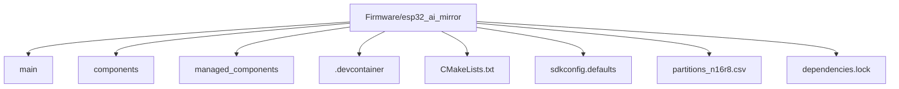
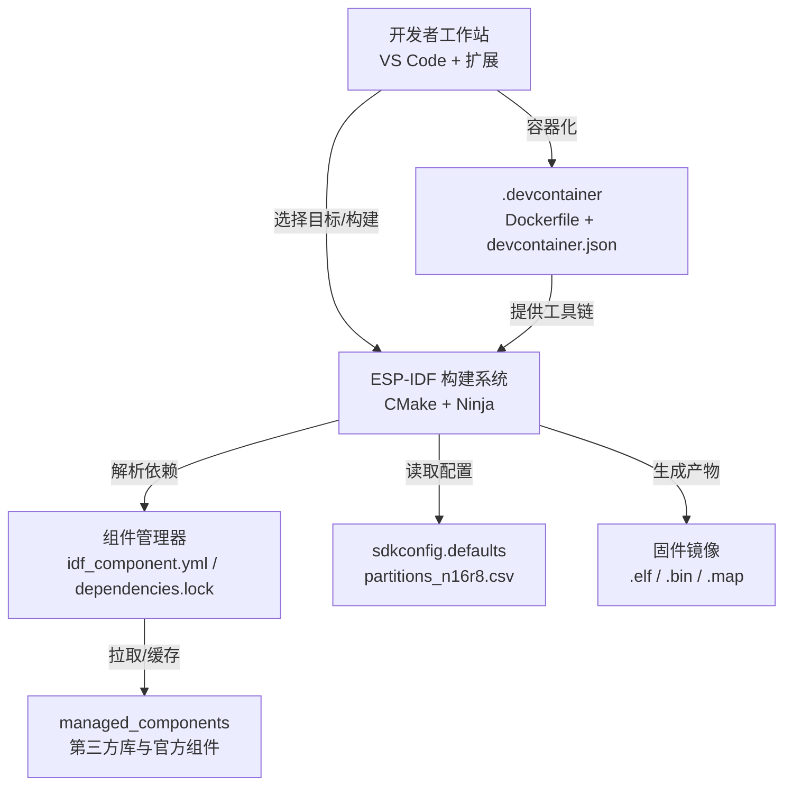
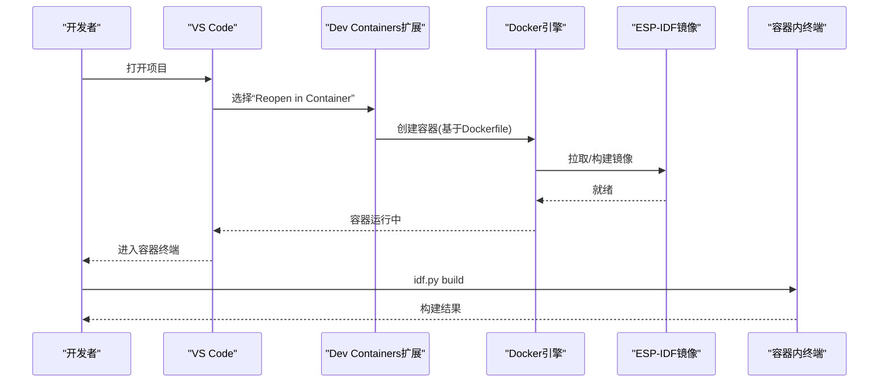
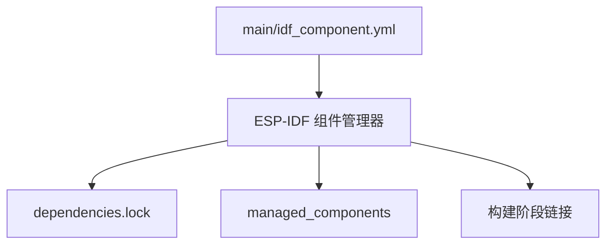
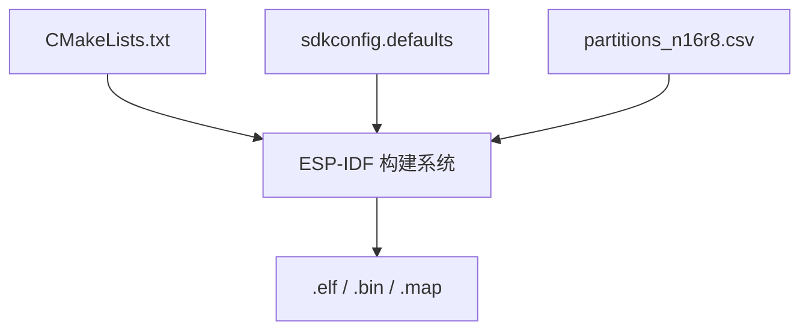
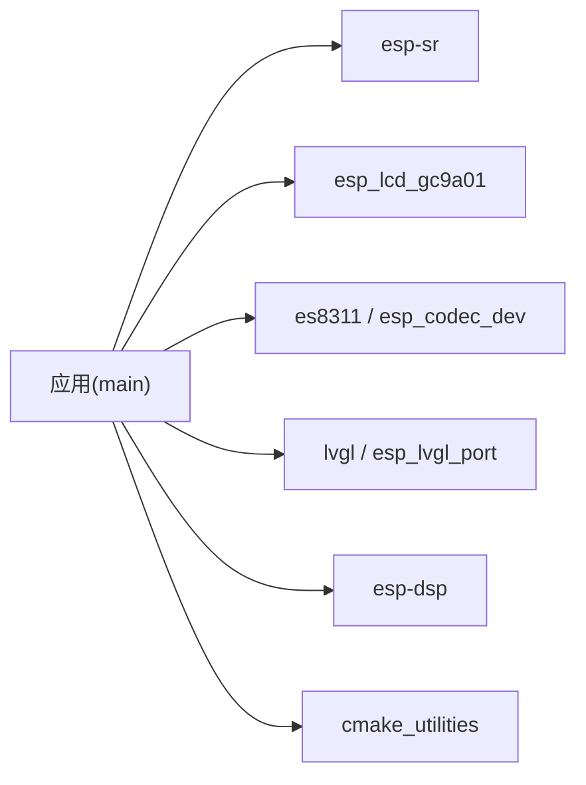

# 开发环境搭建

<cite>
**本文引用的文件**   
- [Firmware/esp32_ai_mirror/.devcontainer/Dockerfile](file://Firmware/esp32_ai_mirror/.devcontainer/Dockerfile)
- [Firmware/esp32_ai_mirror/.devcontainer/devcontainer.json](file://Firmware/esp32_ai_mirror/.devcontainer/devcontainer.json)
- [Firmware/esp32_ai_mirror/CMakeLists.txt](file://Firmware/esp32_ai_mirror/CMakeLists.txt)
- [Firmware/esp32_ai_mirror/main/CMakeLists.txt](file://Firmware/esp32_ai_mirror/main/CMakeLists.txt)
- [Firmware/esp32_ai_mirror/main/idf_component.yml](file://Firmware/esp32_ai_mirror/main/idf_component.yml)
- [Firmware/esp32_ai_mirror/sdkconfig.defaults](file://Firmware/esp32_ai_mirror/sdkconfig.defaults)
- [Firmware/esp32_ai_mirror/partitions_n16r8.csv](file://Firmware/esp32_ai_mirror/partitions_n16r8.csv)
- [Firmware/esp32_ai_mirror/dependencies.lock](file://Firmware/esp32_ai_mirror/dependencies.lock)
- [Firmware/esp32_ai_mirror/README.md](file://Firmware/esp32_ai_mirror/README.md)
</cite>

## 目录
1. [简介](#简介)
2. [项目结构](#项目结构)
3. [核心组件](#核心组件)
4. [架构总览](#架构总览)
5. [详细组件分析](#详细组件分析)
6. [依赖分析](#依赖分析)
7. [性能考虑](#性能考虑)
8. [故障排查指南](#故障排查指南)
9. [结论](#结论)
10. [附录](#附录)

## 简介
本指南面向AI镜子项目的开发者，提供从零开始搭建ESP-IDF开发环境的完整步骤。内容涵盖：
- ESP-IDF工具链安装与配置（Windows、macOS、Linux）
- Docker容器化开发环境设置（基于项目内置devcontainer）
- VS Code扩展插件安装与配置（C/C++、PlatformIO等）
- 项目依赖管理（ESP-IDF组件系统与第三方库集成）
- 常见环境问题排查与解决方案

## 项目结构
本项目采用ESP-IDF标准工程结构，关键目录与文件如下：
- Firmware/esp32_ai_mirror：固件工程根目录
  - main：应用主逻辑与板级驱动
  - components：本地组件（如语音识别、LCD驱动等）
  - managed_components：通过ESP-IDF组件管理器自动拉取的第三方组件
  - .devcontainer：Docker容器化开发配置
  - CMakeLists.txt、sdkconfig.defaults、partitions_n16r8.csv：构建与分区表配置
  - dependencies.lock：组件版本锁定文件

**图表来源** 
- [Firmware/esp32_ai_mirror/CMakeLists.txt](file://Firmware/esp32_ai_mirror/CMakeLists.txt)
- [Firmware/esp32_ai_mirror/main/CMakeLists.txt](file://Firmware/esp32_ai_mirror/main/CMakeLists.txt)
- [Firmware/esp32_ai_mirror/.devcontainer/devcontainer.json](file://Firmware/esp32_ai_mirror/.devcontainer/devcontainer.json)

**章节来源**
- [Firmware/esp32_ai_mirror/CMakeLists.txt](file://Firmware/esp32_ai_mirror/CMakeLists.txt)
- [Firmware/esp32_ai_mirror/main/CMakeLists.txt](file://Firmware/esp32_ai_mirror/main/CMakeLists.txt)
- [Firmware/esp32_ai_mirror/.devcontainer/devcontainer.json](file://Firmware/esp32_ai_mirror/.devcontainer/devcontainer.json)

## 核心组件
- ESP-IDF工具链与构建系统：负责编译、链接、生成固件镜像
- 组件系统（idf_component.yml、managed_components）：声明并管理第三方库与官方组件
- 构建配置（sdkconfig.defaults、partitions_n16r8.csv）：芯片外设、内存布局与分区策略
- 容器化开发（.devcontainer）：统一开发环境与依赖，避免平台差异

**章节来源**
- [Firmware/esp32_ai_mirror/main/idf_component.yml](file://Firmware/esp32_ai_mirror/main/idf_component.yml)
- [Firmware/esp32_ai_mirror/sdkconfig.defaults](file://Firmware/esp32_ai_mirror/sdkconfig.defaults)
- [Firmware/esp32_ai_mirror/partitions_n16r8.csv](file://Firmware/esp32_ai_mirror/partitions_n16r8.csv)

## 架构总览
下图展示了从源码到可烧录镜像的构建流程，以及容器化环境的作用点。

**图表来源** 
- [Firmware/esp32_ai_mirror/.devcontainer/Dockerfile](file://Firmware/esp32_ai_mirror/.devcontainer/Dockerfile)
- [Firmware/esp32_ai_mirror/.devcontainer/devcontainer.json](file://Firmware/esp32_ai_mirror/.devcontainer/devcontainer.json)
- [Firmware/esp32_ai_mirror/main/idf_component.yml](file://Firmware/esp32_ai_mirror/main/idf_component.yml)
- [Firmware/esp32_ai_mirror/dependencies.lock](file://Firmware/esp32_ai_mirror/dependencies.lock)
- [Firmware/esp32_ai_mirror/sdkconfig.defaults](file://Firmware/esp32_ai_mirror/sdkconfig.defaults)
- [Firmware/esp32_ai_mirror/partitions_n16r8.csv](file://Firmware/esp32_ai_mirror/partitions_n16r8.csv)

## 详细组件分析

### ESP-IDF 工具链安装与配置（跨平台）
- Windows
  - 下载并安装ESP-IDF（推荐与项目SDK版本一致），安装时勾选串口驱动与Python环境
  - 使用“ESP-IDF Command Prompt”或PowerShell初始化环境变量
  - 验证工具链：命令行执行idf.py --version
- macOS
  - 推荐使用Homebrew安装ESP-IDF或使用官方安装包
  - 在终端执行export.sh初始化环境
  - 验证工具链：idf.py --version
- Linux
  - 安装依赖包后运行install.sh脚本
  - 执行export.sh初始化环境
  - 验证工具链：idf.py --version

提示：若使用Docker容器化方案，可跳过本地工具链安装，直接进入下一节。

**章节来源**
- [Firmware/esp32_ai_mirror/README.md](file://Firmware/esp32_ai_mirror/README.md)

### Docker 容器化开发环境（推荐）
- 前置条件
  - 安装Docker Desktop（Windows/macOS）或Docker Engine（Linux）
  - 安装VS Code及“Dev Containers”扩展
- 启动容器
  - 打开项目根目录，VS Code右下角选择“Reopen in Container”
  - 首次构建会拉取基础镜像并安装ESP-IDF工具链与依赖
- 常用命令
  - 在容器内终端执行：idf.py set-target esp32s3（根据硬件选择目标）
  - 构建：idf.py build
  - 清理：idf.py fullclean
- 注意事项
  - 确保Docker服务已启动且具备足够磁盘空间
  - 网络代理环境下需配置Docker代理以拉取组件

**图表来源** 
- [Firmware/esp32_ai_mirror/.devcontainer/Dockerfile](file://Firmware/esp32_ai_mirror/.devcontainer/Dockerfile)
- [Firmware/esp32_ai_mirror/.devcontainer/devcontainer.json](file://Firmware/esp32_ai_mirror/.devcontainer/devcontainer.json)

**章节来源**
- [Firmware/esp32_ai_mirror/.devcontainer/Dockerfile](file://Firmware/esp32_ai_mirror/.devcontainer/Dockerfile)
- [Firmware/esp32_ai_mirror/.devcontainer/devcontainer.json](file://Firmware/esp32_ai_mirror/.devcontainer/devcontainer.json)

### VS Code 扩展插件安装与配置
- 必需扩展
  - C/C++（Microsoft）：语法高亮、智能补全、调试支持
  - PlatformIO IDE（可选）：简化ESP32开发体验（非必须，可与ESP-IDF并行使用）
  - Dev Containers（用于容器化开发）
- 配置建议
  - 在.vscode/settings.json中指定C/C++路径与编译器
  - 若使用PlatformIO，需在平台设置中选择ESP32目标与端口
  - 启用“保存时格式化”和“代码检查”提升一致性

**章节来源**
- [Firmware/esp32_ai_mirror/README.md](file://Firmware/esp32_ai_mirror/README.md)

### 项目依赖管理与组件系统
- 组件声明
  - 在main/idf_component.yml中声明所需组件与版本范围
  - 使用idf.py add <component>添加新依赖
- 依赖锁定
  - dependencies.lock记录精确版本，保证团队一致性
  - 更新依赖：idf.py update
- 组件位置
  - components：本地自定义组件
  - managed_components：由ESP-IDF组件管理器自动拉取

**图表来源** 
- [Firmware/esp32_ai_mirror/main/idf_component.yml](file://Firmware/esp32_ai_mirror/main/idf_component.yml)
- [Firmware/esp32_ai_mirror/dependencies.lock](file://Firmware/esp32_ai_mirror/dependencies.lock)

**章节来源**
- [Firmware/esp32_ai_mirror/main/idf_component.yml](file://Firmware/esp32_ai_mirror/main/idf_component.yml)
- [Firmware/esp32_ai_mirror/dependencies.lock](file://Firmware/esp32_ai_mirror/dependencies.lock)

### 构建与分区配置
- CMakeLists.txt
  - 定义项目目标、源文件集合与组件依赖
- sdkconfig.defaults
  - 全局默认配置项（如WiFi、蓝牙、日志级别等）
- partitions_n16r8.csv
  - Flash分区表，定义OTA、NVS、文件系统分区大小与地址

**图表来源** 
- [Firmware/esp32_ai_mirror/CMakeLists.txt](file://Firmware/esp32_ai_mirror/CMakeLists.txt)
- [Firmware/esp32_ai_mirror/sdkconfig.defaults](file://Firmware/esp32_ai_mirror/sdkconfig.defaults)
- [Firmware/esp32_ai_mirror/partitions_n16r8.csv](file://Firmware/esp32_ai_mirror/partitions_n16r8.csv)

**章节来源**
- [Firmware/esp32_ai_mirror/CMakeLists.txt](file://Firmware/esp32_ai_mirror/CMakeLists.txt)
- [Firmware/esp32_ai_mirror/sdkconfig.defaults](file://Firmware/esp32_ai_mirror/sdkconfig.defaults)
- [Firmware/esp32_ai_mirror/partitions_n16r8.csv](file://Firmware/esp32_ai_mirror/partitions_n16r8.csv)

## 依赖分析
- 直接依赖
  - ESP-IDF框架与工具链
  - 语音处理组件（esp-sr）、LCD驱动（esp_lcd_gc9a01）、音频编解码（es8311、esp_codec_dev）
  - LVGL图形库与端口适配（esp_lvgl_port）
- 间接依赖
  - DSP数学库（esp-dsp）、通用CMake工具（cmake_utilities）
- 版本锁定
  - dependencies.lock确保团队成员使用相同组件版本，避免构建不一致

**图表来源** 
- [Firmware/esp32_ai_mirror/main/idf_component.yml](file://Firmware/esp32_ai_mirror/main/idf_component.yml)
- [Firmware/esp32_ai_mirror/dependencies.lock](file://Firmware/esp32_ai_mirror/dependencies.lock)

**章节来源**
- [Firmware/esp32_ai_mirror/main/idf_component.yml](file://Firmware/esp32_ai_mirror/main/idf_component.yml)
- [Firmware/esp32_ai_mirror/dependencies.lock](file://Firmware/esp32_ai_mirror/dependencies.lock)

## 性能考虑
- 构建优化
  - 使用增量构建与并行编译（Ninja默认启用）
  - 合理裁剪组件与功能以减少Flash占用
- 运行时优化
  - 调整日志级别降低开销
  - 合理划分任务与中断优先级，避免阻塞

[本节为通用指导，不直接分析具体文件]

## 故障排查指南
- 无法连接串口
  - 检查设备管理器/系统偏好设置中的端口号
  - 确认USB线供电与驱动正常
- 构建失败（找不到组件）
  - 执行idf.py update重新拉取依赖
  - 检查网络代理与ESP-IDF组件服务器可达性
- 容器内构建缓慢
  - 配置Docker镜像加速与本地缓存
  - 增加Docker资源分配（CPU/内存）
- 分区错误
  - 核对partitions_n16r8.csv与实际Flash容量匹配
  - 使用idf.py partition-table查看当前分区布局

**章节来源**
- [Firmware/esp32_ai_mirror/partitions_n16r8.csv](file://Firmware/esp32_ai_mirror/partitions_n16r8.csv)
- [Firmware/esp32_ai_mirror/dependencies.lock](file://Firmware/esp32_ai_mirror/dependencies.lock)

## 结论
通过本指南，您可以在Windows、macOS与Linux平台上快速搭建AI镜子项目的ESP-IDF开发环境。推荐使用Docker容器化方案以获得一致的开发体验；结合VS Code与必要扩展提升编码效率；利用ESP-IDF组件系统与依赖锁定确保团队协作稳定可靠。遇到问题时，参考故障排查部分逐步定位解决。

[本节为总结性内容，不直接分析具体文件]

## 附录
- 常用命令速查
  - 设置目标：idf.py set-target esp32s3
  - 构建：idf.py build
  - 清理：idf.py fullclean
  - 更新依赖：idf.py update
  - 查看分区：idf.py partition-table
- 参考文档
  - ESP-IDF官方文档
  - 项目README与示例说明

[本节为补充信息，不直接分析具体文件]