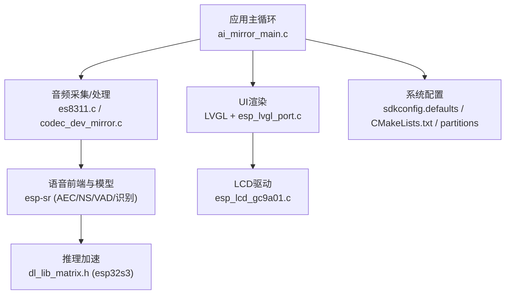
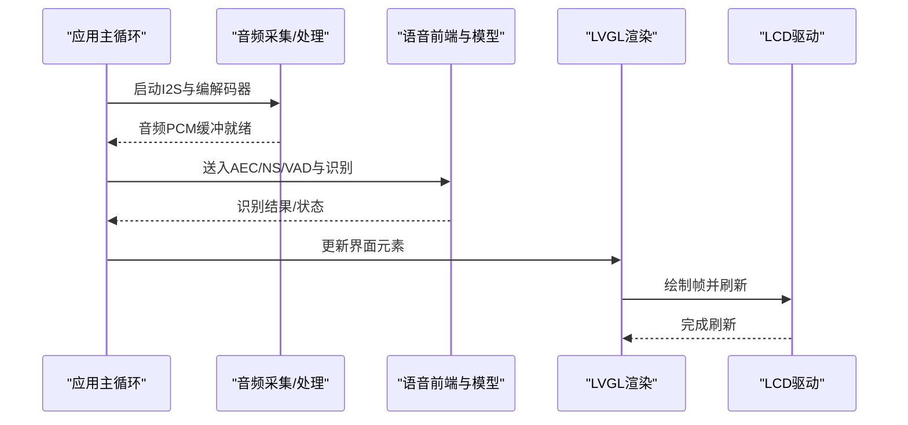
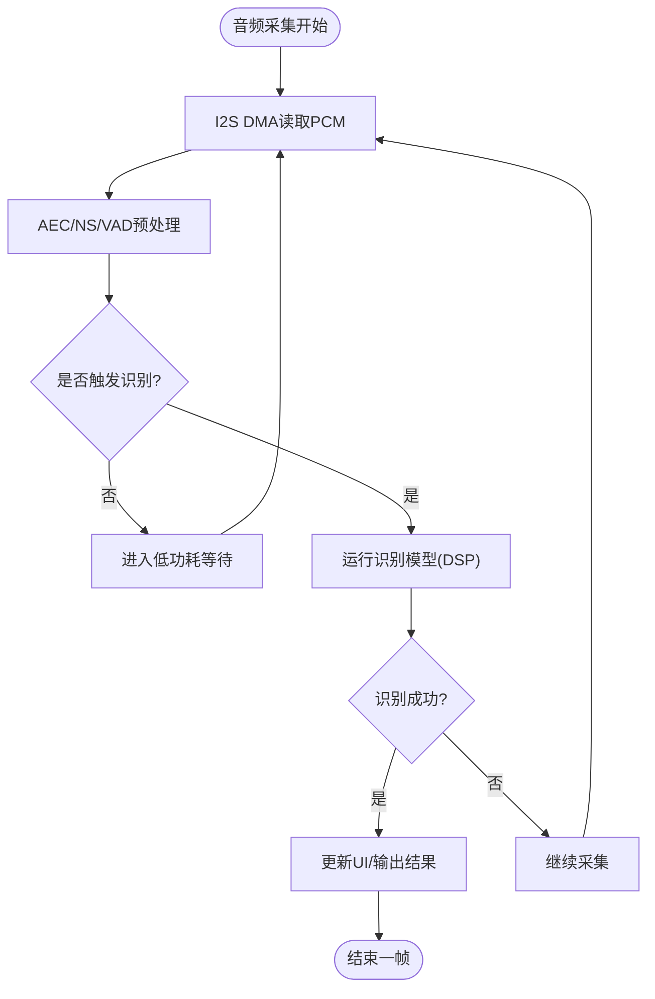
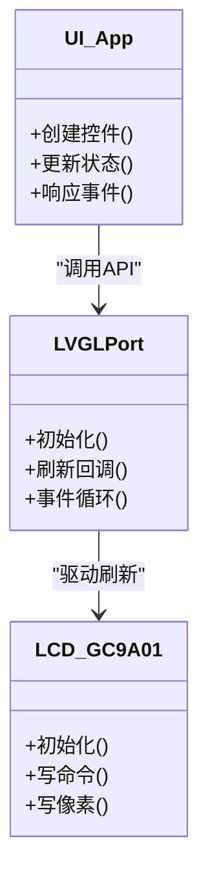
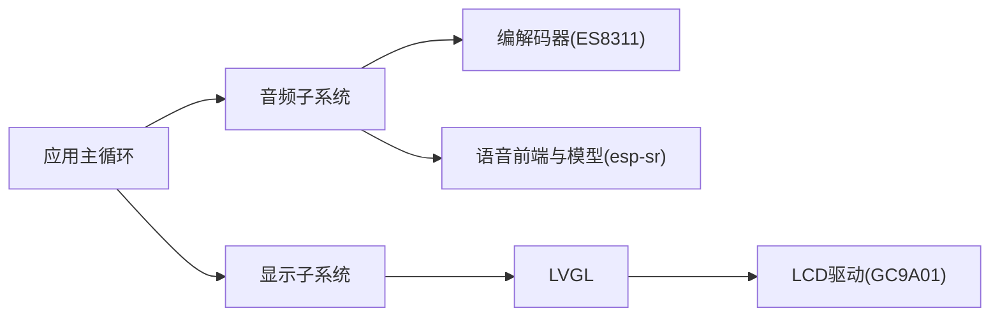

# 性能优化

<cite>
**本文引用的文件**   
- [ai_mirror_main.c](file://Firmware/esp32_ai_mirror/main/ai_mirror_main.c)
- [ai_mirror_config.h](file://Firmware/esp32_ai_mirror/main/ai_mirror_config.h)
- [CMakeLists.txt](file://Firmware/esp32_ai_mirror/CMakeLists.txt)
- [sdkconfig.defaults](file://Firmware/esp32_ai_mirror/sdkconfig.defaults)
- [partitions_n16r8.csv](file://Firmware/esp32_ai_mirror/partitions_n16r8.csv)
- [esp_lvgl_port.c](file://Firmware/esp32_ai_mirror/managed_components/espressif__esp_lvgl_port/esp_lvgl_port.c)
- [esp_lcd_gc9a01.c](file://Firmware/esp32_ai_mirror/managed_components/espressif__esp_lcd_gc9a01/esp_lcd_gc9a01.c)
- [es8311.c](file://Firmware/esp32_ai_mirror/managed_components/espressif__es8311/es8311.c)
- [codec_dev_mirror.c](file://Firmware/esp32_ai_mirror/managed_components/espressif__esp_codec_dev/codec_dev_mirror.c)
- [esp_afe_sr_1mic.ref](file://Firmware/esp32_ai_mirror/components/espressif__esp-sr/src/esp_afe_sr_1mic.ref)
- [dl_lib_matrix.h](file://Firmware/esp32_ai_mirror/components/espressif__esp-sr/include/esp32s3/dl_lib_matrix.h)
- [esp_process_sdkconfig.c](file://Firmware/esp32_ai_mirror/components/espressif__esp-sr/src/esp_process_sdkconfig.c)
</cite>

## 目录
1. [简介](#简介)
2. [项目结构](#项目结构)
3. [核心组件](#核心组件)
4. [架构总览](#架构总览)
5. [详细组件分析](#详细组件分析)
6. [依赖关系分析](#依赖关系分析)
7. [性能考量](#性能考量)
8. [故障排查指南](#故障排查指南)
9. [结论](#结论)
10. [附录](#附录)

## 简介
本指南面向ESP32-S3平台的AI镜子项目，聚焦于系统级与模块级的性能优化。内容涵盖：
- ESP32-S3芯片特性与优化要点（CPU、内存、外设、缓存）
- 内存使用优化（堆栈管理、内存池、对象复用）
- CPU性能调优与实时性保障（任务调度、中断优先级、DMA/I2S、双核协同）
- 音频处理算法优化（AEC/NS/VAD、DSP库高效用法）
- 显示渲染优化与帧率提升（LVGL、LCD驱动、刷新策略）
- 功耗优化与电池续航延长（电源域、时钟、休眠唤醒）
- 性能监控与分析工具（FreeRTOS统计、ESP-IDF工具链、日志采样）

## 项目结构
本项目基于ESP-IDF构建，主程序位于main目录，音频与显示通过组件集成，语音识别与TTS由esp-sr提供，UI框架为LVGL并通过esp_lvgl_port适配。关键路径如下：
- 应用入口与任务编排：main/ai_mirror_main.c
- 配置项与编译选项：sdkconfig.defaults、CMakeLists.txt、partitions_n16r8.csv
- 音频链路：es8311（编解码器）、esp_codec_dev（统一接口）、esp-sr（前端与模型）
- 显示链路：GC9A01 LCD驱动 + LVGL + esp_lvgl_port
- 推理加速：DL库矩阵运算（esp32s3专用头）

图表来源
- [ai_mirror_main.c](file://Firmware/esp32_ai_mirror/main/ai_mirror_main.c)
- [es8311.c](file://Firmware/esp32_ai_mirror/managed_components/espressif__es8311/es8311.c)
- [codec_dev_mirror.c](file://Firmware/esp32_ai_mirror/managed_components/espressif__esp_codec_dev/codec_dev_mirror.c)
- [esp_lvgl_port.c](file://Firmware/esp32_ai_mirror/managed_components/espressif__esp_lvgl_port/esp_lvgl_port.c)
- [esp_lcd_gc9a01.c](file://Firmware/esp32_ai_mirror/managed_components/espressif__esp_lcd_gc9a01/esp_lcd_gc9a01.c)
- [dl_lib_matrix.h](file://Firmware/esp32_ai_mirror/components/espressif__esp-sr/include/esp32s3/dl_lib_matrix.h)

章节来源
- [CMakeLists.txt](file://Firmware/esp32_ai_mirror/CMakeLists.txt)
- [sdkconfig.defaults](file://Firmware/esp32_ai_mirror/sdkconfig.defaults)
- [partitions_n16r8.csv](file://Firmware/esp32_ai_mirror/partitions_n16r8.csv)

## 核心组件
- 应用主循环与任务管理：负责音频、显示、网络等任务的创建与协调，决定CPU占用与实时性。
- 音频子系统：I2S采集、编解码器控制、降噪/回声消除/静音检测、ASR/TTS流程。
- 显示子系统：LVGL事件循环、缓冲区管理、LCD刷新策略与帧率控制。
- 推理与DSP：esp-sr前端管线与量化模型，esp32s3专用DL库矩阵运算。
- 系统配置：SDK选项、分区表、组件链接与优化开关。

章节来源
- [ai_mirror_main.c](file://Firmware/esp32_ai_mirror/main/ai_mirror_main.c)
- [ai_mirror_config.h](file://Firmware/esp32_ai_mirror/main/ai_mirror_config.h)
- [esp_process_sdkconfig.c](file://Firmware/esp32_ai_mirror/components/espressif__esp-sr/src/esp_process_sdkconfig.c)

## 架构总览
下图展示从音频输入到语音识别、UI渲染的端到端数据流，以及各模块间的依赖关系。

图表来源
- [ai_mirror_main.c](file://Firmware/esp32_ai_mirror/main/ai_mirror_main.c)
- [es8311.c](file://Firmware/esp32_ai_mirror/managed_components/espressif__es8311/es8311.c)
- [codec_dev_mirror.c](file://Firmware/esp32_ai_mirror/managed_components/espressif__esp_codec_dev/codec_dev_mirror.c)
- [esp_lvgl_port.c](file://Firmware/esp32_ai_mirror/managed_components/espressif__esp_lvgl_port/esp_lvgl_port.c)
- [esp_lcd_gc9a01.c](file://Firmware/esp32_ai_mirror/managed_components/espressif__esp_lcd_gc9a01/esp_lcd_gc9a01.c)

## 详细组件分析

### 音频处理与DSP优化
- 采集与传输
  - 使用I2S DMA批量传输，减少CPU中断开销；合理设置块大小以平衡时延与吞吐。
  - 编解码器（ES8311）初始化参数需匹配采样率、位宽与通道数，避免重采样带来的额外计算。
- 前端处理
  - AEC/NS/VAD按场景启用，避免全链路开启导致CPU峰值过高；在安静环境可关闭VAD或降低阈值。
  - 利用esp-sr提供的量化模型与队列机制，减少拷贝与对齐开销。
- DSP库使用
  - 优先选择固定点实现与esp32s3优化版本；矩阵运算尽量连续内存访问，避免跨页分配。
  - 对热点函数进行内联与循环展开，结合编译器优化等级（-O2/-Os）权衡体积与速度。

图表来源
- [es8311.c](file://Firmware/esp32_ai_mirror/managed_components/espressif__es8311/es8311.c)
- [codec_dev_mirror.c](file://Firmware/esp32_ai_mirror/managed_components/espressif__esp_codec_dev/codec_dev_mirror.c)
- [esp_afe_sr_1mic.ref](file://Firmware/esp32_ai_mirror/components/espressif__esp-sr/src/esp_afe_sr_1mic.ref)
- [dl_lib_matrix.h](file://Firmware/esp32_ai_mirror/components/espressif__esp-sr/include/esp32s3/dl_lib_matrix.h)

章节来源
- [es8311.c](file://Firmware/esp32_ai_mirror/managed_components/espressif__es8311/es8311.c)
- [codec_dev_mirror.c](file://Firmware/esp32_ai_mirror/managed_components/espressif__esp_codec_dev/codec_dev_mirror.c)
- [esp_afe_sr_1mic.ref](file://Firmware/esp32_ai_mirror/components/espressif__esp-sr/src/esp_afe_sr_1mic.ref)
- [dl_lib_matrix.h](file://Firmware/esp32_ai_mirror/components/espressif__esp-sr/include/esp32s3/dl_lib_matrix.h)

### 显示渲染与帧率优化
- LVGL配置
  - 调整刷新周期与双缓冲策略，确保每帧绘制时间小于目标帧间隔；必要时启用部分刷新。
  - 将静态资源放入Flash，动态纹理使用PSRAM（若可用），减少内部RAM压力。
- LCD驱动
  - GC9A01初始化时序与命令批处理，减少SPI/I2C调用次数；使用DMA传输像素数据。
  - 根据屏幕分辨率与颜色深度选择合适的像素格式，避免逐像素转换。
- 渲染技巧
  - 合并绘制区域，减少重绘范围；隐藏不可见控件，降低布局计算量。
  - 使用预合成图像与矢量字体按需加载，避免频繁解码。

图表来源
- [esp_lvgl_port.c](file://Firmware/esp32_ai_mirror/managed_components/espressif__esp_lvgl_port/esp_lvgl_port.c)
- [esp_lcd_gc9a01.c](file://Firmware/esp32_ai_mirror/managed_components/espressif__esp_lcd_gc9a01/esp_lcd_gc9a01.c)

章节来源
- [esp_lvgl_port.c](file://Firmware/esp32_ai_mirror/managed_components/espressif__esp_lvgl_port/esp_lvgl_port.c)
- [esp_lcd_gc9a01.c](file://Firmware/esp32_ai_mirror/managed_components/espressif__esp_lcd_gc9a01/esp_lcd_gc9a01.c)

### 内存管理与堆栈优化
- 堆栈与任务
  - 为音频、显示、网络任务分别设置合适的栈大小，避免溢出；使用FreeRTOS栈高水位检查定位瓶颈。
  - 将大对象（如音频缓冲、图像缓存）放置于外部PSRAM（若启用），释放内部RAM用于热点路径。
- 内存池与对象复用
  - 针对高频小对象（如帧、包）使用内存池，减少malloc/free抖动；统一分配器便于统计与调试。
  - 重用缓冲区与句柄，避免重复分配；采用环形缓冲降低拷贝成本。
- 编译与链接
  - 合理裁剪组件与功能宏，减小代码段与数据段；启用压缩镜像与只读数据优化。

章节来源
- [ai_mirror_main.c](file://Firmware/esp32_ai_mirror/main/ai_mirror_main.c)
- [ai_mirror_config.h](file://Firmware/esp32_ai_mirror/main/ai_mirror_config.h)
- [sdkconfig.defaults](file://Firmware/esp32_ai_mirror/sdkconfig.defaults)

### CPU性能调优与实时性保证
- 双核与任务绑定
  - 将CPU密集型任务（如DSP、渲染）绑定至Core 1，I/O与中断相关任务绑定至Core 0，降低争用。
  - 使用抢占式优先级区分实时路径（音频、按键）与非实时路径（网络请求）。
- 中断与DMA
  - 最小化中断服务程序逻辑，将数据处理移至任务；I2S/SPI使用DMA批量传输。
- 定时器与看门狗
  - 使用高精度定时器校准帧周期；启用看门狗防止死锁，合理设置超时阈值。

章节来源
- [ai_mirror_main.c](file://Firmware/esp32_ai_mirror/main/ai_mirror_main.c)
- [esp_process_sdkconfig.c](file://Firmware/esp32_ai_mirror/components/espressif__esp-sr/src/esp_process_sdkconfig.c)

### 功耗优化与电池续航延长
- 电源与时钟
  - 在非活跃阶段降低CPU频率与关闭未使用外设；启用深度睡眠与轻睡眠模式。
  - 合理配置I2S、SPI、Wi-Fi的时钟分频与使能时机，避免空闲耗电。
- 工作模式切换
  - 无语音活动时进入低功耗监听（仅VAD/Wake Word）；有活动再唤醒主链路。
  - 屏幕亮度自适应与自动休眠，减少显示功耗。
- 电池管理
  - 监测电量与温度，动态调整任务频率与DSP精度；限制峰值电流以避免掉电复位。

章节来源
- [sdkconfig.defaults](file://Firmware/esp32_ai_mirror/sdkconfig.defaults)
- [partitions_n16r8.csv](file://Firmware/esp32_ai_mirror/partitions_n16r8.csv)

### 性能监控与分析工具
- FreeRTOS统计
  - 启用任务统计与堆高水位，定期打印各任务CPU占用与栈使用情况。
- ESP-IDF工具
  - 使用perfmon、heap trace、flash map分析运行时与镜像大小；结合JTAG进行断点与波形抓取。
- 日志与采样
  - 分级日志与采样开关，生产环境关闭冗余日志；关键路径打点记录耗时。

章节来源
- [ai_mirror_main.c](file://Firmware/esp32_ai_mirror/main/ai_mirror_main.c)
- [sdkconfig.defaults](file://Firmware/esp32_ai_mirror/sdkconfig.defaults)

## 依赖关系分析
- 组件耦合
  - 应用主循环依赖音频与显示组件；音频链路依赖编解码器与esp-sr；显示链路依赖LVGL与LCD驱动。
- 外部依赖
  - ESP-IDF内核、FreeRTOS、ESP-SR、LVGL、LCD驱动均为强依赖；需保持版本兼容。
- 潜在环路
  - 避免UI与音频任务直接互相调用，通过消息队列或事件总线解耦。

图表来源
- [ai_mirror_main.c](file://Firmware/esp32_ai_mirror/main/ai_mirror_main.c)
- [es8311.c](file://Firmware/esp32_ai_mirror/managed_components/espressif__es8311/es8311.c)
- [codec_dev_mirror.c](file://Firmware/esp32_ai_mirror/managed_components/espressif__esp_codec_dev/codec_dev_mirror.c)
- [esp_lvgl_port.c](file://Firmware/esp32_ai_mirror/managed_components/espressif__esp_lvgl_port/esp_lvgl_port.c)
- [esp_lcd_gc9a01.c](file://Firmware/esp32_ai_mirror/managed_components/espressif__esp_lcd_gc9a01/esp_lcd_gc9a01.c)

章节来源
- [CMakeLists.txt](file://Firmware/esp32_ai_mirror/CMakeLists.txt)
- [sdkconfig.defaults](file://Firmware/esp32_ai_mirror/sdkconfig.defaults)

## 性能考量
- 音频链路
  - 降低采样率与位深可减少带宽与计算量；在安静环境关闭VAD/AEC以降低CPU峰值。
  - 使用固定点DSP与量化模型，避免浮点运算；批量处理与零拷贝策略提升吞吐。
- 显示链路
  - 减少重绘区域与刷新频率；静态资源驻留Flash，动态资源按需加载。
  - 使用DMA与批处理命令，降低SPI/I2C开销；合理设置LVGL刷新周期。
- 内存与存储
  - 分区表优化，预留足够PSRAM与SPIFFS空间；避免频繁写入Flash。
- 实时性
  - 关键路径使用高优先级任务与中断；避免阻塞调用与长临界区。

[本节为通用指导，不直接分析具体文件]

## 故障排查指南
- 常见问题
  - 音频卡顿：检查I2S DMA块大小与缓冲区不足；确认AEC/NS参数是否过激。
  - 显示撕裂：调整LVGL刷新策略与LCD驱动时序；确保帧间同步。
  - 内存泄漏：启用堆跟踪与对象计数；定位未释放的句柄与缓存。
  - 功耗异常：检查外设未关闭与休眠唤醒逻辑；验证电池管理策略。
- 诊断步骤
  - 逐步禁用模块（如先关闭VAD/AEC）观察性能变化；使用perfmon定位热点函数。
  - 通过日志与采样确定瓶颈位置；必要时使用JTAG抓取寄存器与内存状态。

章节来源
- [ai_mirror_main.c](file://Firmware/esp32_ai_mirror/main/ai_mirror_main.c)
- [sdkconfig.defaults](file://Firmware/esp32_ai_mirror/sdkconfig.defaults)

## 结论
通过对ESP32-S3平台的多维度优化（音频、显示、内存、CPU、功耗），可在有限资源下实现稳定流畅的AI镜子体验。建议在生产环境中持续监控与迭代，结合用户场景动态调整参数，达到性能与功耗的最佳平衡。

[本节为总结性内容，不直接分析具体文件]

## 附录
- 参考配置
  - SDK选项：查看sdkconfig.defaults中的关键宏与默认值。
  - 分区表：根据镜像大小与数据需求调整partitions_n16r8.csv。
- 常用命令
  - 构建与烧录：使用ESP-IDF工具链进行编译、擦除与下载。
  - 分析与调试：启用FreeRTOS统计、堆跟踪与日志采样。

章节来源
- [sdkconfig.defaults](file://Firmware/esp32_ai_mirror/sdkconfig.defaults)
- [partitions_n16r8.csv](file://Firmware/esp32_ai_mirror/partitions_n16r8.csv)