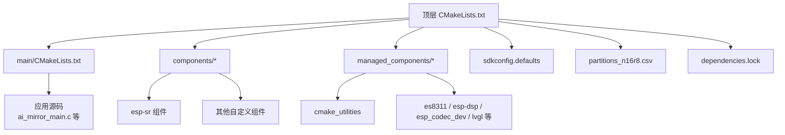
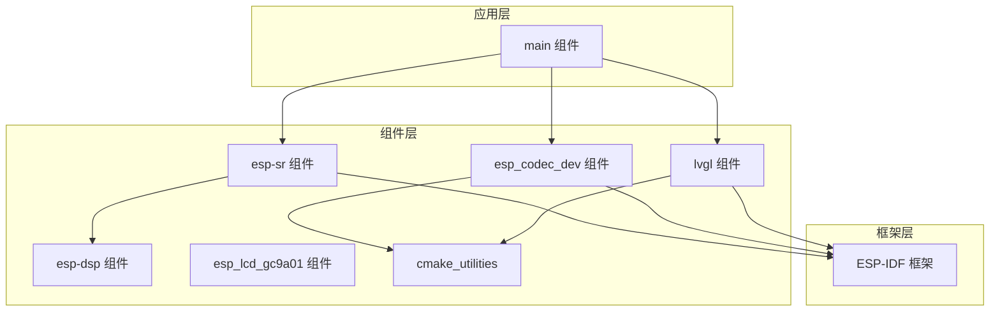
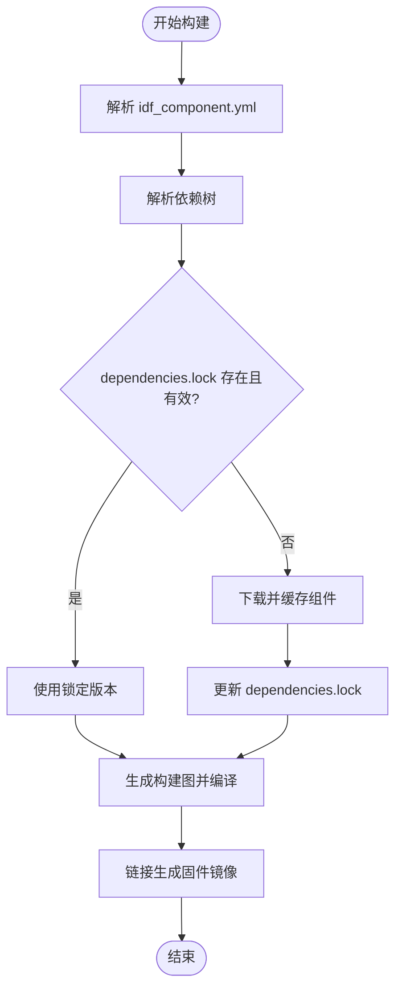

# 构建系统

<cite>
**本文引用的文件**   
- [CMakeLists.txt](file://Firmware/esp32_ai_mirror/CMakeLists.txt)
- [main/CMakeLists.txt](file://Firmware/esp32_ai_mirror/main/CMakeLists.txt)
- [idf_component.yml](file://Firmware/esp32_ai_mirror/main/idf_component.yml)
- [sdkconfig.defaults](file://Firmware/esp32_ai_mirror/sdkconfig.defaults)
- [partitions_n16r8.csv](file://Firmware/esp32_ai_mirror/partitions_n16r8.csv)
- [dependencies.lock](file://Firmware/esp32_ai_mirror/dependencies.lock)
- [components/espressif__esp-sr/CMakeLists.txt](file://Firmware/esp32_ai_mirror/components/espressif__esp-sr/CMakeLists.txt)
- [components/espressif__esp-sr/component.mk](file://Firmware/esp32_ai_mirror/components/espressif__esp-sr/component.mk)
- [components/espressif__esp-sr/idf_component.yml](file://Firmware/esp32_ai_mirror/components/espressif__esp-sr/idf_component.yml)
- [components/espressif__esp-sr/model/CMakeLists.txt](file://Firmware/esp32_ai_mirror/components/espressif__esp-sr/model/CMakeLists.txt)
- [managed_components/espressif__cmake_utilities/CMakeLists.txt](file://Firmware/esp32_ai_mirror/managed_components/espressif__cmake_utilities/CMakeLists.txt)
- [managed_components/espressif__es8311/CMakeLists.txt](file://Firmware/esp32_ai_mirror/managed_components/espressif__es8311/CMakeLists.txt)
- [managed_components/espressif__esp-dsp/CMakeLists.txt](file://Firmware/esp32_ai_mirror/managed_components/espressif__esp-dsp/CMakeLists.txt)
- [managed_components/espressif__esp_codec_dev/CMakeLists.txt](file://Firmware/esp32_ai_mirror/managed_components/espressif__esp_codec_dev/CMakeLists.txt)
- [managed_components/lvgl__lvgl/CMakeLists.txt](file://Firmware/esp32_ai_mirror/managed_components/lvgl__lvgl/CMakeLists.txt)
</cite>

## 目录
1. [简介](#简介)
2. [项目结构](#项目结构)
3. [核心组件](#核心组件)
4. [架构总览](#架构总览)
5. [详细组件分析](#详细组件分析)
6. [依赖分析](#依赖分析)
7. [性能考虑](#性能考虑)
8. [故障排查指南](#故障排查指南)
9. [结论](#结论)
10. [附录](#附录)

## 简介
本文件面向AI镜子项目的构建系统，系统性说明基于ESP-IDF与CMake的构建配置、组件化架构、依赖管理与版本控制策略、目标平台编译差异、构建优化选项以及自动化构建流程定制方法。文档力求兼顾工程实践与可维护性，帮助开发者快速理解并扩展该项目的构建体系。

## 项目结构
本项目采用ESP-IDF标准工程布局：
- 顶层CMakeLists.txt定义项目级构建入口与全局设置
- main为应用主模块，包含业务逻辑与板级适配
- components存放第三方或自研组件（如语音识别、音频编解码、显示驱动等）
- managed_components由ESP-IDF Component Manager自动管理的外部依赖
- sdkconfig.defaults提供默认配置项
- partitions_n16r8.csv定义Flash分区表
- dependencies.lock锁定依赖版本，确保可重复构建

图表来源
- [CMakeLists.txt](file://Firmware/esp32_ai_mirror/CMakeLists.txt)
- [main/CMakeLists.txt](file://Firmware/esp32_ai_mirror/main/CMakeLists.txt)
- [sdkconfig.defaults](file://Firmware/esp32_ai_mirror/sdkconfig.defaults)
- [partitions_n16r8.csv](file://Firmware/esp32_ai_mirror/partitions_n16r8.csv)
- [dependencies.lock](file://Firmware/esp32_ai_mirror/dependencies.lock)

章节来源
- [CMakeLists.txt](file://Firmware/esp32_ai_mirror/CMakeLists.txt)
- [main/CMakeLists.txt](file://Firmware/esp32_ai_mirror/main/CMakeLists.txt)
- [sdkconfig.defaults](file://Firmware/esp32_ai_mirror/sdkconfig.defaults)
- [partitions_n16r8.csv](file://Firmware/esp32_ai_mirror/partitions_n16r8.csv)
- [dependencies.lock](file://Firmware/esp32_ai_mirror/dependencies.lock)

## 核心组件
- 顶层CMakeLists.txt：初始化ESP-IDF工程、设置目标芯片、包含子目录、生成固件镜像与分区表、可选压缩OTA与单bin输出。
- main/CMakeLists.txt：声明应用组件名称、源文件、头文件路径、依赖组件、链接库与编译选项。
- idf_component.yml：声明应用对组件的依赖及版本约束，供Component Manager解析。
- sdkconfig.defaults：集中管理Kconfig配置项，便于多目标共享默认值。
- partitions_n16r8.csv：定义NVS、OTA、文件系统、模型数据等分区布局。
- dependencies.lock：记录已解析的依赖树与版本，保证CI与本地一致。

章节来源
- [CMakeLists.txt](file://Firmware/esp32_ai_mirror/CMakeLists.txt)
- [main/CMakeLists.txt](file://Firmware/esp32_ai_mirror/main/CMakeLists.txt)
- [idf_component.yml](file://Firmware/esp32_ai_mirror/main/idf_component.yml)
- [sdkconfig.defaults](file://Firmware/esp32_ai_mirror/sdkconfig.defaults)
- [partitions_n16r8.csv](file://Firmware/esp32_ai_mirror/partitions_n16r8.csv)
- [dependencies.lock](file://Firmware/esp32_ai_mirror/dependencies.lock)

## 架构总览
ESP-IDF组件系统与CMake协同工作，形成“应用层(main) + 组件层(components/managed_components) + 框架层(ESP-IDF)”的分层架构。构建时，CMake根据各组件的CMakeLists.txt与Kconfig生成编译单元，最终链接为可执行镜像。

图表来源
- [main/CMakeLists.txt](file://Firmware/esp32_ai_mirror/main/CMakeLists.txt)
- [components/espressif__esp-sr/CMakeLists.txt](file://Firmware/esp32_ai_mirror/components/espressif__esp-sr/CMakeLists.txt)
- [managed_components/espressif__esp-dsp/CMakeLists.txt](file://Firmware/esp32_ai_mirror/managed_components/espressif__esp-dsp/CMakeLists.txt)
- [managed_components/espressif__esp_codec_dev/CMakeLists.txt](file://Firmware/esp32_ai_mirror/managed_components/espressif__esp_codec_dev/CMakeLists.txt)
- [managed_components/lvgl__lvgl/CMakeLists.txt](file://Firmware/esp32_ai_mirror/managed_components/lvgl__lvgl/CMakeLists.txt)
- [managed_components/espressif__cmake_utilities/CMakeLists.txt](file://Firmware/esp32_ai_mirror/managed_components/espressif__cmake_utilities/CMakeLists.txt)

## 详细组件分析

### 顶层CMakeLists.txt（项目入口）
- 初始化ESP-IDF工程环境，设置目标芯片与工具链
- 包含main与components子目录，启用组件发现机制
- 配置分区表与二进制产物（app.bin、bootloader、partition-table）
- 可选集成压缩OTA与单bin打包脚本

章节来源
- [CMakeLists.txt](file://Firmware/esp32_ai_mirror/CMakeLists.txt)

### main组件（应用主体）
- 通过CMakeLists.txt声明组件名、源文件、头文件路径
- 使用idf_component_register注册依赖组件（如esp-sr、lvgl、codec_dev等）
- 设置编译选项（优化等级、宏定义、警告级别）
- 链接必要的库（如freertos、esp_http_client、nvs_flash等）

章节来源
- [main/CMakeLists.txt](file://Firmware/esp32_ai_mirror/main/CMakeLists.txt)
- [idf_component.yml](file://Firmware/esp32_ai_mirror/main/idf_component.yml)

### esp-sr组件（语音识别）
- CMakeLists.txt定义组件源文件、头文件、依赖与目标平台条件编译
- component.mk兼容旧版构建系统（若启用）
- model/CMakeLists.txt负责将语音模型打包为只读数据段，供运行时加载
- idf_component.yml声明版本与依赖，便于Component Manager管理

章节来源
- [components/espressif__esp-sr/CMakeLists.txt](file://Firmware/esp32_ai_mirror/components/espressif__esp-sr/CMakeLists.txt)
- [components/espressif__esp-sr/component.mk](file://Firmware/esp32_ai_mirror/components/espressif__esp-sr/component.mk)
- [components/espressif__esp-sr/model/CMakeLists.txt](file://Firmware/esp32_ai_mirror/components/espressif__esp-sr/model/CMakeLists.txt)
- [components/espressif__esp-sr/idf_component.yml](file://Firmware/esp32_ai_mirror/components/espressif__esp-sr/idf_component.yml)

### 外部依赖组件（managed_components）
- cmake_utilities：提供通用CMake函数（如压缩OTA、重链接器、包管理）
- es8311：音频编解码器驱动，暴露I2C/SPI接口抽象
- esp-dsp：数字信号处理库，支持FFT、矩阵运算等
- esp_codec_dev：音频设备抽象层，统一不同Codec的API
- lvgl：图形界面库，配合LVGL Port进行屏幕驱动适配

章节来源
- [managed_components/espressif__cmake_utilities/CMakeLists.txt](file://Firmware/esp32_ai_mirror/managed_components/espressif__cmake_utilities/CMakeLists.txt)
- [managed_components/espressif__es8311/CMakeLists.txt](file://Firmware/esp32_ai_mirror/managed_components/espressif__es8311/CMakeLists.txt)
- [managed_components/espressif__esp-dsp/CMakeLists.txt](file://Firmware/esp32_ai_mirror/managed_components/espressif__esp-dsp/CMakeLists.txt)
- [managed_components/espressif__esp_codec_dev/CMakeLists.txt](file://Firmware/esp32_ai_mirror/managed_components/espressif__esp_codec_dev/CMakeLists.txt)
- [managed_components/lvgl__lvgl/CMakeLists.txt](file://Firmware/esp32_ai_mirror/managed_components/lvgl__lvgl/CMakeLists.txt)

### 构建产物与分区
- 分区表文件定义NVS、OTA、SPIFFS/LittleFS、模型数据等分区大小与偏移
- 构建系统根据分区表生成partition-table.bin并烧录至指定地址
- 可通过修改分区表调整资源占用与功能开关

章节来源
- [partitions_n16r8.csv](file://Firmware/esp32_ai_mirror/partitions_n16r8.csv)

## 依赖分析
依赖管理遵循ESP-IDF Component Manager规范：
- idf_component.yml声明直接依赖与版本范围
- 运行idf.py build时解析依赖树并下载至managed_components
- dependencies.lock固化依赖版本，确保跨环境一致性
- 更新依赖需显式调用命令并检查锁文件变更

图表来源
- [idf_component.yml](file://Firmware/esp32_ai_mirror/main/idf_component.yml)
- [dependencies.lock](file://Firmware/esp32_ai_mirror/dependencies.lock)

章节来源
- [idf_component.yml](file://Firmware/esp32_ai_mirror/main/idf_component.yml)
- [dependencies.lock](file://Firmware/esp32_ai_mirror/dependencies.lock)

## 性能考虑
- 优化等级：在main/CMakeLists.txt中设置CMAKE_C_FLAGS_RELEASE与CMAKE_CXX_FLAGS_RELEASE，推荐-Os或-O2平衡体积与速度
- 链接优化：启用LTO（Link Time Optimization）可减少冗余代码，但会增加构建时间
- 内存分配：合理划分PSRAM与IRAM，避免热点代码放入慢速存储
- 模型加载：将语音模型置于Flash只读区，减少运行时拷贝
- 并行编译：利用make/jinja多线程加速，结合ccache提升增量构建速度

[本节为通用指导，不直接分析具体文件]

## 故障排查指南
- 依赖冲突：检查idf_component.yml版本约束与dependencies.lock是否一致，必要时清理build目录后重试
- 分区不足：确认partitions_n16r8.csv分区大小与实际固件+模型体积匹配
- 编译错误：查看SDKCONFIG相关宏定义是否在sdkconfig.defaults中正确设置
- 链接失败：检查组件间头文件路径与库依赖是否正确声明
- OTA问题：验证压缩OTA脚本参数与分区布局是否兼容

章节来源
- [sdkconfig.defaults](file://Firmware/esp32_ai_mirror/sdkconfig.defaults)
- [partitions_n16r8.csv](file://Firmware/esp32_ai_mirror/partitions_n16r8.csv)
- [dependencies.lock](file://Firmware/esp32_ai_mirror/dependencies.lock)

## 结论
本项目的构建系统以ESP-IDF与CMake为核心，通过组件化架构实现高内聚、低耦合的代码组织。借助Component Manager与依赖锁定机制，确保了构建的可重复性与可移植性。通过合理的优化策略与分区规划，可在资源受限的嵌入式平台上获得良好的性能表现。建议持续完善组件文档与构建脚本，以提升团队协作效率与交付质量。

[本节为总结性内容，不直接分析具体文件]

## 附录

### ESP-IDF组件系统架构与自定义组件开发
- 组件目录结构：每个组件应包含CMakeLists.txt、include/、src/、README.md等
- 组件注册：使用idf_component_register声明源文件、头文件、依赖与导出符号
- Kconfig配置：通过Kconfig.projbuild暴露可配置项，便于用户按需裁剪功能
- 版本管理：在idf_component.yml中声明版本号与依赖范围，提交到仓库以便复用

章节来源
- [components/espressif__esp-sr/CMakeLists.txt](file://Firmware/esp32_ai_mirror/components/espressif__esp-sr/CMakeLists.txt)
- [components/espressif__esp-sr/idf_component.yml](file://Firmware/esp32_ai_mirror/components/espressif__esp-sr/idf_component.yml)

### 依赖管理与版本控制策略
- 使用idf_component.yml声明依赖，避免硬编码路径
- 提交dependencies.lock到版本库，确保CI与本地构建一致
- 定期更新依赖并审查变更日志，防止引入破坏性更新
- 对于私有组件，建议使用内部仓库或私有Component Server

章节来源
- [idf_component.yml](file://Firmware/esp32_ai_mirror/main/idf_component.yml)
- [dependencies.lock](file://Firmware/esp32_ai_mirror/dependencies.lock)

### 构建优化选项与目标平台编译配置
- 目标芯片：在顶层CMakeLists.txt中设置TARGET，区分ESP32/ESP32S3等
- 编译器标志：针对不同平台设置特定优化与特性开关
- 分区表：为不同硬件准备多个分区表文件，按目标选择
- 环境变量：通过IDF_PATH、CCACHE_ENABLE等环境变量控制构建行为

章节来源
- [CMakeLists.txt](file://Firmware/esp32_ai_mirror/CMakeLists.txt)
- [partitions_n16r8.csv](file://Firmware/esp32_ai_mirror/partitions_n16r8.csv)

### 构建脚本定制与自动化构建流程
- 本地脚本：封装常用命令（clean、build、flash、monitor），提升开发效率
- CI流水线：在GitHub Actions/GitLab CI中集成构建、测试与发布步骤
- 缓存策略：启用ccache与组件缓存，缩短构建时间
- 产物归档：上传固件、日志与分析报告，便于追溯与审计

[本节为通用指导，不直接分析具体文件]