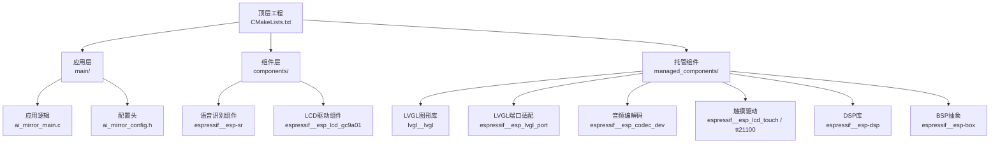
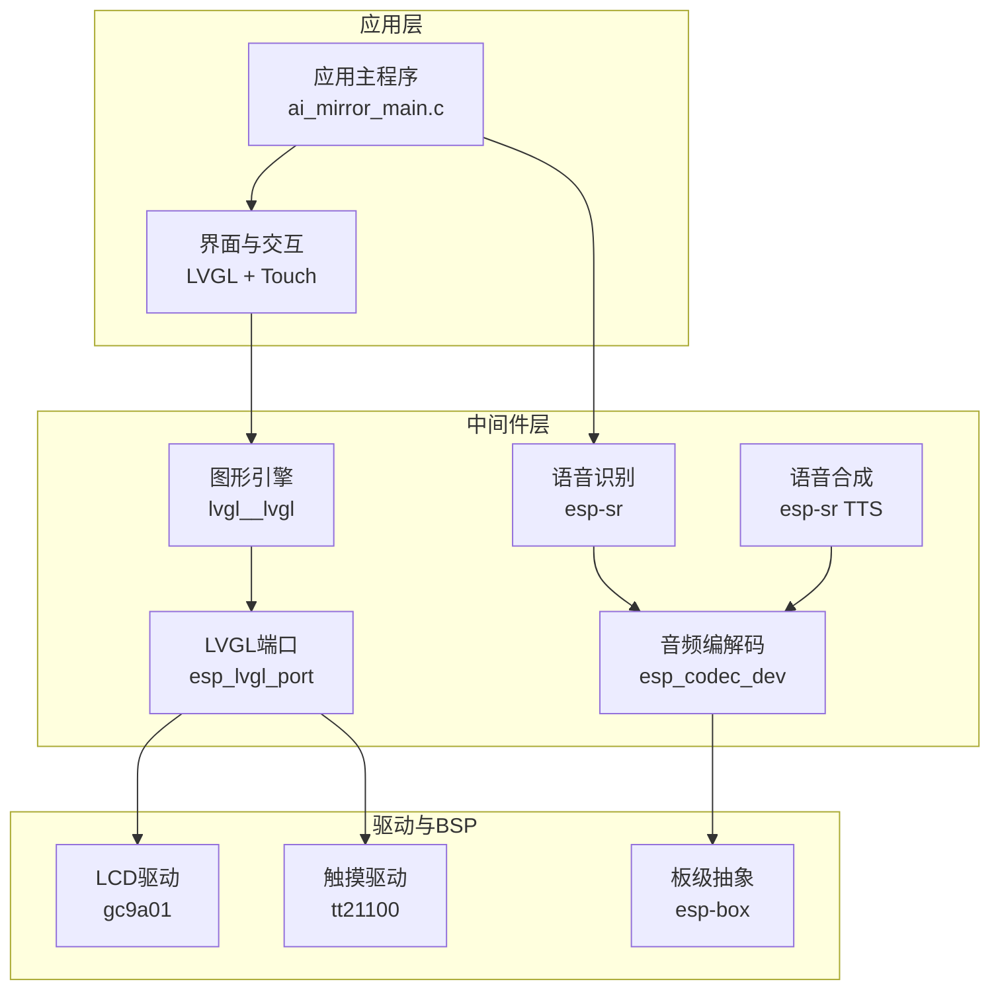
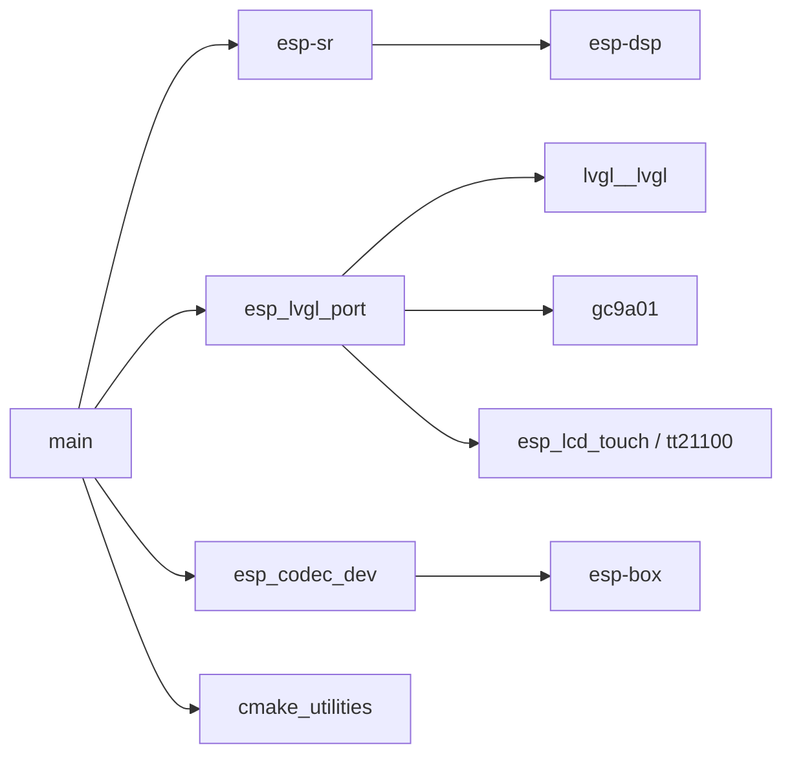

# 组件开发

<cite>
**本文引用的文件**   
- [CMakeLists.txt](file://Firmware/esp32_ai_mirror/CMakeLists.txt)
- [idf_component.yml](file://Firmware/esp32_ai_mirror/main/idf_component.yml)
- [ai_mirror_main.c](file://Firmware/esp32_ai_mirror/main/ai_mirror_main.c)
- [ai_mirror_config.h](file://Firmware/esp32_ai_mirror/main/ai_mirror_config.h)
- [CMakeLists.txt](file://Firmware/esp32_ai_mirror/components/espressif__esp-sr/CMakeLists.txt)
- [idf_component.yml](file://Firmware/esp32_ai_mirror/components/espressif__esp-sr/idf_component.yml)
- [CMakeLists.txt](file://Firmware/esp32_ai_mirror/components/espressif__esp_lcd_gc9a01/CMakeLists.txt)
- [idf_component.yml](file://Firmware/esp32_ai_mirror/components/espressif__esp_lcd_gc9a01/idf_component.yml)
- [CMakeLists.txt](file://Firmware/esp32_ai_mirror/managed_components/espressif__cmake_utilities/CMakeLists.txt)
- [idf_component.yml](file://Firmware/esp32_ai_mirror/managed_components/espressif__cmake_utilities/idf_component.yml)
- [CMakeLists.txt](file://Firmware/esp32_ai_mirror/managed_components/espressif__es8311/CMakeLists.txt)
- [idf_component.yml](file://Firmware/esp32_ai_mirror/managed_components/espressif__es8311/idf_component.yml)
- [CMakeLists.txt](file://Firmware/esp32_ai_mirror/managed_components/espressif__esp-box/CMakeLists.txt)
- [idf_component.yml](file://Firmware/esp32_ai_mirror/managed_components/espressif__esp-box/idf_component.yml)
- [CMakeLists.txt](file://Firmware/esp32_ai_mirror/managed_components/espressif__esp-dsp/CMakeLists.txt)
- [idf_component.yml](file://Firmware/esp32_ai_mirror/managed_components/espressif__esp-dsp/idf_component.yml)
- [CMakeLists.txt](file://Firmware/esp32_ai_mirror/managed_components/espressif__esp_codec_dev/CMakeLists.txt)
- [idf_component.yml](file://Firmware/esp32_ai_mirror/managed_components/espressif__esp_codec_dev/idf_component.yml)
- [CMakeLists.txt](file://Firmware/esp32_ai_mirror/managed_components/espressif__esp_lcd_touch/CMakeLists.txt)
- [idf_component.yml](file://Firmware/esp32_ai_mirror/managed_components/espressif__esp_lcd_touch/idf_component.yml)
- [CMakeLists.txt](file://Firmware/esp32_ai_mirror/managed_components/espressif__esp_lcd_touch_tt21100/CMakeLists.txt)
- [idf_component.yml](file://Firmware/esp32_ai_mirror/managed_components/espressif__esp_lcd_touch_tt21100/idf_component.yml)
- [CMakeLists.txt](file://Firmware/esp32_ai_mirror/managed_components/espressif__esp_lvgl_port/CMakeLists.txt)
- [idf_component.yml](file://Firmware/esp32_ai_mirror/managed_components/espressif__esp_lvgl_port/idf_component.yml)
- [CMakeLists.txt](file://Firmware/esp32_ai_mirror/managed_components/lvgl__lvgl/CMakeLists.txt)
- [idf_component.yml](file://Firmware/esp32_ai_mirror/managed_components/lvgl__lvgl/idf_component.yml)
- [pytest_ai_mirror.py](file://Firmware/esp32_ai_mirror/pytest_ai_mirror.py)
- [sdkconfig.defaults](file://Firmware/esp32_ai_mirror/sdkconfig.defaults)
</cite>

## 目录
1. [简介](#简介)
2. [项目结构](#项目结构)
3. [核心组件](#核心组件)
4. [架构总览](#架构总览)
5. [详细组件分析](#详细组件分析)
6. [依赖分析](#依赖分析)
7. [性能考虑](#性能考虑)
8. [故障排查指南](#故障排查指南)
9. [结论](#结论)
10. [附录](#附录)

## 简介
本指南面向AI镜子项目的ESP-IDF组件开发，系统阐述组件架构、组件间通信机制、自定义组件创建流程与标准目录结构、接口设计与API文档规范、依赖管理与版本兼容、测试与验证最佳实践、第三方组件集成与包管理策略，以及组件发布与维护流程。内容基于仓库中的实际组件组织与配置进行归纳，帮助读者从零到一构建可维护、可复用的组件体系。

## 项目结构
本项目采用ESP-IDF标准工程结构，核心代码位于main目录，业务与外设驱动以components或managed_components形式组织：
- main：应用入口、UI、板级初始化、WiFi配网等
- components：本地或官方组件（如esp-sr、esp_lcd_gc9a01）
- managed_components：通过idf_component_manager自动拉取的第三方组件（如LVGL、Codec Dev、Touch、BSP等）
- CMakeLists.txt：顶层构建脚本，声明组件与链接关系
- sdkconfig.defaults：默认配置项，用于Kconfig编译期裁剪
- pytest_ai_mirror.py：自动化测试用例入口

图表来源
- [CMakeLists.txt](file://Firmware/esp32_ai_mirror/CMakeLists.txt)
- [idf_component.yml](file://Firmware/esp32_ai_mirror/main/idf_component.yml)
- [idf_component.yml](file://Firmware/esp32_ai_mirror/components/espressif__esp-sr/idf_component.yml)
- [idf_component.yml](file://Firmware/esp32_ai_mirror/components/espressif__esp_lcd_gc9a01/idf_component.yml)
- [idf_component.yml](file://Firmware/esp32_ai_mirror/managed_components/espressif__esp_lvgl_port/idf_component.yml)
- [idf_component.yml](file://Firmware/esp32_ai_mirror/managed_components/lvgl__lvgl/idf_component.yml)
- [idf_component.yml](file://Firmware/esp32_ai_mirror/managed_components/espressif__esp_codec_dev/idf_component.yml)
- [idf_component.yml](file://Firmware/esp32_ai_mirror/managed_components/espressif__esp_lcd_touch/idf_component.yml)
- [idf_component.yml](file://Firmware/esp32_ai_mirror/managed_components/espressif__esp_lcd_touch_tt21100/idf_component.yml)
- [idf_component.yml](file://Firmware/esp32_ai_mirror/managed_components/espressif__esp-dsp/idf_component.yml)
- [idf_component.yml](file://Firmware/esp32_ai_mirror/managed_components/espressif__esp-box/idf_component.yml)

章节来源
- [CMakeLists.txt](file://Firmware/esp32_ai_mirror/CMakeLists.txt)
- [idf_component.yml](file://Firmware/esp32_ai_mirror/main/idf_component.yml)

## 核心组件
- 应用主循环与任务编排：由main入口负责初始化各子系统并调度任务，典型包括显示、音频、网络与交互。
- 语音识别与TTS：esp-sr提供唤醒、命令识别与TTS能力，需配合音频采集与播放链路。
- 显示与触控：GC9A01 LCD驱动与LVGL图形栈，结合触摸控制器实现交互。
- 音频编解码：esp_codec_dev统一I2S/ADC/DAC控制，屏蔽底层差异。
- BSP与工具链：esp-box提供板级抽象，cmake_utilities提供构建辅助脚本。

章节来源
- [ai_mirror_main.c](file://Firmware/esp32_ai_mirror/main/ai_mirror_main.c)
- [idf_component.yml](file://Firmware/esp32_ai_mirror/main/idf_component.yml)

## 架构总览
下图展示从应用到硬件的调用层次与数据流向，体现组件间的职责边界与通信方式（函数调用、回调、队列、事件）。

图表来源
- [ai_mirror_main.c](file://Firmware/esp32_ai_mirror/main/ai_mirror_main.c)
- [idf_component.yml](file://Firmware/esp32_ai_mirror/components/espressif__esp-sr/idf_component.yml)
- [idf_component.yml](file://Firmware/esp32_ai_mirror/managed_components/espressif__esp_codec_dev/idf_component.yml)
- [idf_component.yml](file://Firmware/esp32_ai_mirror/managed_components/espressif__esp_lvgl_port/idf_component.yml)
- [idf_component.yml](file://Firmware/esp32_ai_mirror/managed_components/lvgl__lvgl/idf_component.yml)
- [idf_component.yml](file://Firmware/esp32_ai_mirror/components/espressif__esp_lcd_gc9a01/idf_component.yml)
- [idf_component.yml](file://Firmware/esp32_ai_mirror/managed_components/espressif__esp_lcd_touch_tt21100/idf_component.yml)
- [idf_component.yml](file://Firmware/esp32_ai_mirror/managed_components/espressif__esp-box/idf_component.yml)

## 详细组件分析

### 应用主程序与任务编排
- 职责：初始化系统时钟、外设、网络、显示、音频；创建任务与队列；处理用户交互与状态机。
- 关键点：合理划分任务粒度，避免阻塞；使用事件/队列解耦模块；错误回退与日志上报。

章节来源
- [ai_mirror_main.c](file://Firmware/esp32_ai_mirror/main/ai_mirror_main.c)

### 语音识别组件（esp-sr）
- 职责：提供唤醒词检测、语音命令识别、TTS播放；封装模型加载与推理流程。
- 接口设计：建议暴露统一的初始化、启动、停止、结果回调接口；对模型路径与采样率进行参数化。
- 依赖：音频采集（I2S/ADC）、内存与DSP加速。

章节来源
- [CMakeLists.txt](file://Firmware/esp32_ai_mirror/components/espressif__esp-sr/CMakeLists.txt)
- [idf_component.yml](file://Firmware/esp32_ai_mirror/components/espressif__esp-sr/idf_component.yml)

### 显示与触控（GC9A01 + LVGL + Touch）
- 职责：LCD初始化、帧缓冲管理、LVGL刷新、触摸事件上报。
- 接口设计：显式分离“显示驱动”和“图形渲染”，通过LVGL端口适配I2S/SPI总线；触摸驱动提供坐标回调。
- 依赖：SPI/I2C总线、DMA、LVGL配置与字体资源。

章节来源
- [CMakeLists.txt](file://Firmware/esp32_ai_mirror/components/espressif__esp_lcd_gc9a01/CMakeLists.txt)
- [idf_component.yml](file://Firmware/esp32_ai_mirror/components/espressif__esp_lcd_gc9a01/idf_component.yml)
- [idf_component.yml](file://Firmware/esp32_ai_mirror/managed_components/espressif__esp_lvgl_port/idf_component.yml)
- [idf_component.yml](file://Firmware/esp32_ai_mirror/managed_components/lvgl__lvgl/idf_component.yml)
- [idf_component.yml](file://Firmware/esp32_ai_mirror/managed_components/espressif__esp_lcd_touch/idf_component.yml)
- [idf_component.yml](file://Firmware/esp32_ai_mirror/managed_components/espressif__esp_lcd_touch_tt21100/idf_component.yml)

### 音频编解码（esp_codec_dev）
- 职责：统一I2S/ADC/DAC控制，音量调节、采样率切换、静音控制。
- 接口设计：抽象设备句柄与操作集，支持多设备并行与动态切换。
- 依赖：I2C寄存器访问、时钟配置、电源管理。

章节来源
- [CMakeLists.txt](file://Firmware/esp32_ai_mirror/managed_components/espressif__esp_codec_dev/CMakeLists.txt)
- [idf_component.yml](file://Firmware/esp32_ai_mirror/managed_components/espressif__esp_codec_dev/idf_component.yml)

### BSP与构建工具（esp-box、cmake_utilities）
- 职责：板级引脚映射、外设初始化模板、构建脚本增强（压缩OTA、单bin生成、重定位器）。
- 接口设计：提供高层API隐藏硬件差异，便于跨板移植。

章节来源
- [CMakeLists.txt](file://Firmware/esp32_ai_mirror/managed_components/espressif__esp-box/CMakeLists.txt)
- [idf_component.yml](file://Firmware/esp32_ai_mirror/managed_components/espressif__esp-box/idf_component.yml)
- [CMakeLists.txt](file://Firmware/esp32_ai_mirror/managed_components/espressif__cmake_utilities/CMakeLists.txt)
- [idf_component.yml](file://Firmware/esp32_ai_mirror/managed_components/espressif__cmake_utilities/idf_component.yml)

### 组件间通信机制
- 函数调用：同步调用适用于轻量、非阻塞场景。
- 回调与事件：异步通知，适合传感器中断、音频流、UI事件。
- 队列与消息：线程安全的数据交换，适合生产者-消费者模式（如音频帧、识别结果）。
- 共享内存与锁：高性能路径下谨慎使用，注意一致性。

章节来源
- [ai_mirror_main.c](file://Firmware/esp32_ai_mirror/main/ai_mirror_main.c)

### 自定义组件创建流程与标准目录结构
- 目录结构建议：
  - include：对外公开头文件
  - src：实现文件
  - CMakeLists.txt：组件构建规则
  - idf_component.yml：组件元数据与依赖声明
  - README.md：使用说明与示例
  - test：单元测试与集成测试
- 步骤：
  1) 定义清晰的API头文件与数据结构
  2) 编写CMakeLists.txt，指定源文件与包含路径
  3) 在idf_component.yml中声明名称、版本、依赖、目标平台
  4) 在主工程CMakeLists.txt中添加组件或将其放入components目录
  5) 编写测试用例，覆盖正常与异常路径
  6) 输出文档与示例，确保可复用

章节来源
- [CMakeLists.txt](file://Firmware/esp32_ai_mirror/components/espressif__esp-sr/CMakeLists.txt)
- [idf_component.yml](file://Firmware/esp32_ai_mirror/components/espressif__esp-sr/idf_component.yml)

### 接口设计与API文档规范
- 命名约定：前缀唯一、动词+名词、返回值明确
- 错误码：集中定义，区分致命与非致命错误
- 生命周期：init/open、configure、start/stop、read/write、deinit/close
- 线程安全：明确是否可并发调用，必要时加锁
- 文档：每个API附带参数说明、返回值、使用示例、注意事项

章节来源
- [idf_component.yml](file://Firmware/esp32_ai_mirror/components/espressif__esp-sr/idf_component.yml)

### 依赖管理与版本兼容性
- 使用idf_component.yml声明依赖与版本范围，锁定关键组件版本
- 使用dependencies.lock固化构建产物，保证CI与生产一致
- 针对目标芯片（如ESP32-S3）做条件编译与特性开关
- 定期更新依赖，评估破坏性变更与迁移成本

章节来源
- [idf_component.yml](file://Firmware/esp32_ai_mirror/main/idf_component.yml)
- [sdkconfig.defaults](file://Firmware/esp32_ai_mirror/sdkconfig.defaults)

### 组件测试与验证最佳实践
- 单元测试：隔离外部依赖，模拟I/O与时间
- 集成测试：端到端流程，覆盖音频链路、显示刷新、网络交互
- 自动化：pytest框架驱动，结合串口日志与屏幕截图断言
- 覆盖率：统计关键路径与边界条件

章节来源
- [pytest_ai_mirror.py](file://Firmware/esp32_ai_mirror/pytest_ai_mirror.py)

### 第三方组件集成与包管理策略
- 优先使用idf_component_manager拉取官方与社区组件
- 在main/idf_component.yml中声明依赖，避免重复声明
- 对不稳定的上游组件设置版本上限，必要时fork并维护分支
- 利用cmake_utilities简化构建与打包流程

章节来源
- [idf_component.yml](file://Firmware/esp32_ai_mirror/main/idf_component.yml)
- [idf_component.yml](file://Firmware/esp32_ai_mirror/managed_components/espressif__cmake_utilities/idf_component.yml)

### 组件发布与维护流程规范
- 版本管理：语义化版本（主.次.修订），变更记录清晰
- 标签与发布：Git标签对应发布版本，附二进制与文档
- 持续集成：构建、测试、静态检查、文档生成
- 回滚策略：保持向后兼容，提供迁移指南

章节来源
- [idf_component.yml](file://Firmware/esp32_ai_mirror/components/espressif__esp-sr/idf_component.yml)

## 依赖分析
下图展示主要组件之间的依赖关系，有助于理解构建顺序与冲突点。

图表来源
- [idf_component.yml](file://Firmware/esp32_ai_mirror/main/idf_component.yml)
- [idf_component.yml](file://Firmware/esp32_ai_mirror/components/espressif__esp-sr/idf_component.yml)
- [idf_component.yml](file://Firmware/esp32_ai_mirror/managed_components/espressif__esp_lvgl_port/idf_component.yml)
- [idf_component.yml](file://Firmware/esp32_ai_mirror/managed_components/lvgl__lvgl/idf_component.yml)
- [idf_component.yml](file://Firmware/esp32_ai_mirror/components/espressif__esp_lcd_gc9a01/idf_component.yml)
- [idf_component.yml](file://Firmware/esp32_ai_mirror/managed_components/espressif__esp_codec_dev/idf_component.yml)
- [idf_component.yml](file://Firmware/esp32_ai_mirror/managed_components/espressif__esp-dsp/idf_component.yml)
- [idf_component.yml](file://Firmware/esp32_ai_mirror/managed_components/espressif__esp-box/idf_component.yml)
- [idf_component.yml](file://Firmware/esp32_ai_mirror/managed_components/espressif__cmake_utilities/idf_component.yml)

章节来源
- [idf_component.yml](file://Firmware/esp32_ai_mirror/main/idf_component.yml)

## 性能考虑
- 音频链路：降低延迟与抖动，合理分配缓冲区大小与优先级
- 显示刷新：批量绘制、双缓冲、减少频繁刷新区域
- 内存管理：避免碎片化，预分配关键对象
- 计算卸载：利用DSP与硬件加速，减少CPU占用
- 功耗优化：按需唤醒外设，关闭未使用模块

[本节为通用指导，不直接分析具体文件]

## 故障排查指南
- 构建问题：检查idf_component.yml依赖版本与目标平台限制，确认CMakeLists.txt源文件列表
- 运行时崩溃：查看任务堆栈、日志级别、内存使用；使用relinker定位符号
- 音频异常：校验I2S配置、采样率、位宽；检查codec设备初始化顺序
- 显示异常：确认SPI时序、CS/DC/RST引脚、LVGL刷新频率
- 触摸异常：校准参数、中断触发条件、坐标转换

章节来源
- [pytest_ai_mirror.py](file://Firmware/esp32_ai_mirror/pytest_ai_mirror.py)
- [sdkconfig.defaults](file://Firmware/esp32_ai_mirror/sdkconfig.defaults)

## 结论
通过规范的组件架构与接口设计、严格的依赖管理与版本控制、完善的测试与文档，AI镜子项目能够在复杂的多模块协作中保持稳定与可演进。遵循本指南的流程与实践，将显著提升组件质量与团队协作效率。

[本节为总结，不直接分析具体文件]

## 附录
- 常用命令：
  - 拉取与更新组件：idf.py build / idf.py menuconfig
  - 运行测试：pytest -v pytest_ai_mirror.py
  - 清理构建：idf.py fullclean
- 参考文件：
  - 顶层构建脚本：CMakeLists.txt
  - 应用入口：ai_mirror_main.c
  - 默认配置：sdkconfig.defaults
  - 测试脚本：pytest_ai_mirror.py

章节来源
- [CMakeLists.txt](file://Firmware/esp32_ai_mirror/CMakeLists.txt)
- [ai_mirror_main.c](file://Firmware/esp32_ai_mirror/main/ai_mirror_main.c)
- [sdkconfig.defaults](file://Firmware/esp32_ai_mirror/sdkconfig.defaults)
- [pytest_ai_mirror.py](file://Firmware/esp32_ai_mirror/pytest_ai_mirror.py)