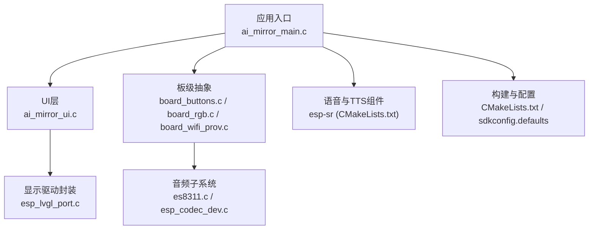
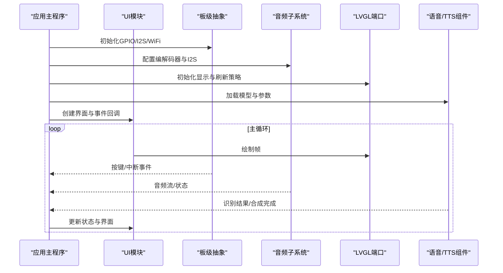
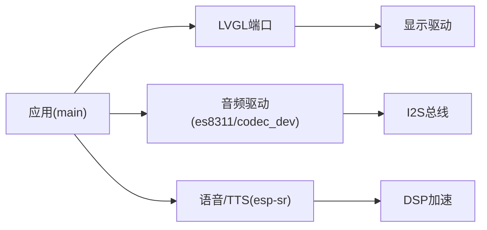

# 编码规范

<cite>
**本文引用的文件**   
- [README.md](file://README.md)
- [CMakeLists.txt](file://Firmware/esp32_ai_mirror/CMakeLists.txt)
- [sdkconfig.defaults](file://Firmware/esp32_ai_mirror/sdkconfig.defaults)
- [ai_mirror_main.c](file://Firmware/esp32_ai_mirror/main/ai_mirror_main.c)
- [ai_mirror_ui.c](file://Firmware/esp32_ai_mirror/main/ai_mirror_ui.c)
- [board_buttons.c](file://Firmware/esp32_ai_mirror/main/board_buttons.c)
- [board_buttons.h](file://Firmware/esp32_ai_mirror/main/board_buttons.h)
- [board_rgb.c](file://Firmware/esp32_ai_mirror/main/board_rgb.c)
- [board_rgb.h](file://Firmware/esp32_ai_mirror/main/board_rgb.h)
- [board_wifi_prov.c](file://Firmware/esp32_ai_mirror/main/board_wifi_prov.c)
- [board_wifi_prov.h](file://Firmware/esp32_ai_mirror/main/board_wifi_prov.h)
- [idf_component.yml](file://Firmware/esp32_ai_mirror/main/idf_component.yml)
- [CMakeLists.txt](file://Firmware/esp32_ai_mirror/components/espressif__esp-sr/CMakeLists.txt)
- [CMakeLists.txt](file://Firmware/esp32_ai_mirror/components/espressif__esp-sr/esp-tts/CMakeLists.txt)
- [CMakeLists.txt](file://Firmware/esp32_ai_mirror/components/espressif__esp-sr/model/CMakeLists.txt)
- [es8311.c](file://Firmware/esp32_ai_mirror/managed_components/espressif__es8311/es8311.c)
- [esp_codec_dev.c](file://Firmware/esp32_ai_mirror/managed_components/espressif__esp_codec_dev/esp_codec_dev.c)
- [esp_lvgl_port.c](file://Firmware/esp32_ai_mirror/managed_components/espressif__esp_lvgl_port/esp_lvgl_port.c)
- [lv_conf_template.h](file://Firmware/esp32_ai_mirror/managed_components/lvgl__lvgl/lv_conf_template.h)
- [pre-commit-config.yaml](file://Firmware/esp32_ai_mirror/.pre-commit-config.yaml)
- [.clang-format](file://Firmware/esp32_ai_mirror/.clang-format)
</cite>

## 目录
1. [简介](#简介)
2. [项目结构](#项目结构)
3. [核心组件](#核心组件)
4. [架构总览](#架构总览)
5. [详细组件分析](#详细组件分析)
6. [依赖关系分析](#依赖关系分析)
7. [性能考虑](#性能考虑)
8. [故障排查指南](#故障排查指南)
9. [结论](#结论)
10. [附录](#附录)

## 简介
本指南面向AI镜子项目的嵌入式C语言开发，结合ESP-IDF框架与LVGL、音频编解码、语音识别等组件，制定统一的编码规范与最佳实践。内容涵盖：
- C语言代码风格约定（命名、注释、文件组织）
- ESP-IDF使用规范与内存管理最佳实践
- 错误处理与日志记录标准方法
- 代码审查检查清单与质量保证流程
- 性能优化技巧与嵌入式特殊考虑
- 代码格式化工具配置与使用方法

## 项目结构
本项目采用ESP-IDF工程结构，应用逻辑位于main目录，第三方组件通过components与managed_components引入，构建系统由CMake驱动，配置通过sdkconfig.defaults集中管理。

图表来源
- [ai_mirror_main.c](file://Firmware/esp32_ai_mirror/main/ai_mirror_main.c)
- [ai_mirror_ui.c](file://Firmware/esp32_ai_mirror/main/ai_mirror_ui.c)
- [board_buttons.c](file://Firmware/esp32_ai_mirror/main/board_buttons.c)
- [board_rgb.c](file://Firmware/esp32_ai_mirror/main/board_rgb.c)
- [board_wifi_prov.c](file://Firmware/esp32_ai_mirror/main/board_wifi_prov.c)
- [esp_lvgl_port.c](file://Firmware/esp32_ai_mirror/managed_components/espressif__esp_lvgl_port/esp_lvgl_port.c)
- [es8311.c](file://Firmware/esp32_ai_mirror/managed_components/espressif__es8311/es8311.c)
- [esp_codec_dev.c](file://Firmware/esp32_ai_mirror/managed_components/espressif__esp_codec_dev/esp_codec_dev.c)
- [CMakeLists.txt](file://Firmware/esp32_ai_mirror/CMakeLists.txt)
- [sdkconfig.defaults](file://Firmware/esp32_ai_mirror/sdkconfig.defaults)

章节来源
- [CMakeLists.txt](file://Firmware/esp32_ai_mirror/CMakeLists.txt)
- [sdkconfig.defaults](file://Firmware/esp32_ai_mirror/sdkconfig.defaults)
- [idf_component.yml](file://Firmware/esp32_ai_mirror/main/idf_component.yml)

## 核心组件
- 应用主循环与任务编排：在应用入口中初始化系统、外设、网络与UI，并启动关键任务。
- UI渲染与交互：基于LVGL的端口封装，负责界面绘制与事件分发。
- 板级抽象：按键、RGB指示灯、WiFi配网等硬件相关逻辑。
- 音频子系统：I2S与编解码器驱动，提供录音与播放能力。
- 语音与TTS：集成esp-sr与TTS库，实现唤醒、命令识别与语音合成。

章节来源
- [ai_mirror_main.c](file://Firmware/esp32_ai_mirror/main/ai_mirror_main.c)
- [ai_mirror_ui.c](file://Firmware/esp32_ai_mirror/main/ai_mirror_ui.c)
- [board_buttons.c](file://Firmware/esp32_ai_mirror/main/board_buttons.c)
- [board_rgb.c](file://Firmware/esp32_ai_mirror/main/board_rgb.c)
- [board_wifi_prov.c](file://Firmware/esp32_ai_mirror/main/board_wifi_prov.c)
- [es8311.c](file://Firmware/esp32_ai_mirror/managed_components/espressif__es8311/es8311.c)
- [esp_codec_dev.c](file://Firmware/esp32_ai_mirror/managed_components/espressif__esp_codec_dev/esp_codec_dev.c)
- [CMakeLists.txt](file://Firmware/esp32_ai_mirror/components/espressif__esp-sr/CMakeLists.txt)
- [CMakeLists.txt](file://Firmware/esp32_ai_mirror/components/espressif__esp-sr/esp-tts/CMakeLists.txt)
- [CMakeLists.txt](file://Firmware/esp32_ai_mirror/components/espressif__esp-sr/model/CMakeLists.txt)

## 架构总览
下图展示从应用入口到各子系统的调用关系与数据流向，强调任务间通信、资源分配与错误回传路径。

图表来源
- [ai_mirror_main.c](file://Firmware/esp32_ai_mirror/main/ai_mirror_main.c)
- [ai_mirror_ui.c](file://Firmware/esp32_ai_mirror/main/ai_mirror_ui.c)
- [board_buttons.c](file://Firmware/esp32_ai_mirror/main/board_buttons.c)
- [board_rgb.c](file://Firmware/esp32_ai_mirror/main/board_rgb.c)
- [board_wifi_prov.c](file://Firmware/esp32_ai_mirror/main/board_wifi_prov.c)
- [esp_lvgl_port.c](file://Firmware/esp32_ai_mirror/managed_components/espressif__esp_lvgl_port/esp_lvgl_port.c)
- [es8311.c](file://Firmware/esp32_ai_mirror/managed_components/espressif__es8311/es8311.c)
- [esp_codec_dev.c](file://Firmware/esp32_ai_mirror/managed_components/espressif__esp_codec_dev/esp_codec_dev.c)
- [CMakeLists.txt](file://Firmware/esp32_ai_mirror/components/espressif__esp-sr/CMakeLists.txt)

## 详细组件分析

### 应用主程序与任务编排
- 职责：系统初始化、任务创建、事件调度、资源生命周期管理。
- 关键点：
  - 按顺序初始化底层驱动（GPIO、I2S、SPI、I2C）、网络栈、文件系统与UI。
  - 为音频采集、UI渲染、网络请求与语音处理分别创建独立任务，避免阻塞。
  - 使用队列或事件组进行任务间通信，确保线程安全。
  - 统一错误码与日志前缀，便于定位问题。

章节来源
- [ai_mirror_main.c](file://Firmware/esp32_ai_mirror/main/ai_mirror_main.c)

### UI模块（LVGL集成）
- 职责：界面布局、控件管理、事件处理与刷新策略。
- 关键点：
  - 通过LVGL端口封装适配ESP-IDF显示驱动与刷新机制。
  - 控制刷新频率与缓冲区大小，平衡流畅度与内存占用。
  - 将用户输入事件映射为业务动作，避免在UI线程执行耗时操作。

章节来源
- [ai_mirror_ui.c](file://Firmware/esp32_ai_mirror/main/ai_mirror_ui.c)
- [esp_lvgl_port.c](file://Firmware/esp32_ai_mirror/managed_components/espressif__esp_lvgl_port/esp_lvgl_port.c)
- [lv_conf_template.h](file://Firmware/esp32_ai_mirror/managed_components/lvgl__lvgl/lv_conf_template.h)

### 板级抽象（按键、RGB、WiFi配网）
- 职责：屏蔽硬件差异，提供稳定接口供上层调用。
- 关键点：
  - 按键去抖与中断处理，避免误触发。
  - RGB指示状态机，清晰表达设备运行模式。
  - WiFi配网流程标准化，包含超时与重试策略。

章节来源
- [board_buttons.c](file://Firmware/esp32_ai_mirror/main/board_buttons.c)
- [board_buttons.h](file://Firmware/esp32_ai_mirror/main/board_buttons.h)
- [board_rgb.c](file://Firmware/esp32_ai_mirror/main/board_rgb.c)
- [board_rgb.h](file://Firmware/esp32_ai_mirror/main/board_rgb.h)
- [board_wifi_prov.c](file://Firmware/esp32_ai_mirror/main/board_wifi_prov.c)
- [board_wifi_prov.h](file://Firmware/esp32_ai_mirror/main/board_wifi_prov.h)

### 音频子系统（I2S与编解码器）
- 职责：音频数据采集与播放，编解码器配置与状态管理。
- 关键点：
  - I2S时钟与DMA配置需匹配采样率与位宽。
  - 编解码器寄存器访问需加锁，避免并发冲突。
  - 音频缓冲采用环形队列，减少拷贝与延迟。

章节来源
- [es8311.c](file://Firmware/esp32_ai_mirror/managed_components/espressif__es8311/es8311.c)
- [esp_codec_dev.c](file://Firmware/esp32_ai_mirror/managed_components/espressif__esp_codec_dev/esp_codec_dev.c)

### 语音与TTS组件（esp-sr与TTS）
- 职责：唤醒检测、命令识别、语音合成。
- 关键点：
  - 模型加载与内存对齐，确保DSP加速可用。
  - 音频预处理（降噪、VAD）与特征提取流水线化。
  - TTS输出与音频播放同步，避免卡顿与丢帧。

章节来源
- [CMakeLists.txt](file://Firmware/esp32_ai_mirror/components/espressif__esp-sr/CMakeLists.txt)
- [CMakeLists.txt](file://Firmware/esp32_ai_mirror/components/espressif__esp-sr/esp-tts/CMakeLists.txt)
- [CMakeLists.txt](file://Firmware/esp32_ai_mirror/components/espressif__esp-sr/model/CMakeLists.txt)

## 依赖关系分析
- 构建依赖：CMakeLists.txt定义目标与组件链接，sdkconfig.defaults提供编译选项。
- 组件依赖：应用依赖LVGL端口、音频驱动、语音与TTS组件；这些组件又依赖ESP-IDF基础库。
- 运行时依赖：任务间通过队列/事件组通信，共享资源通过互斥量保护。

图表来源
- [CMakeLists.txt](file://Firmware/esp32_ai_mirror/CMakeLists.txt)
- [sdkconfig.defaults](file://Firmware/esp32_ai_mirror/sdkconfig.defaults)
- [idf_component.yml](file://Firmware/esp32_ai_mirror/main/idf_component.yml)

章节来源
- [CMakeLists.txt](file://Firmware/esp32_ai_mirror/CMakeLists.txt)
- [sdkconfig.defaults](file://Firmware/esp32_ai_mirror/sdkconfig.defaults)
- [idf_component.yml](file://Firmware/esp32_ai_mirror/main/idf_component.yml)

## 性能考虑
- 内存管理
  - 优先使用静态分配与池化分配，减少碎片。
  - 动态分配后必须校验返回值，失败时回滚并释放已分配资源。
  - 避免在高频路径中进行malloc/free，改用预分配缓冲。
- 任务与中断
  - 中断服务程序保持简短，仅做最小化处理并投递到任务。
  - 任务优先级合理设置，避免高优先级任务长时间阻塞低优先级任务。
- 显示与音频
  - 调整LVGL刷新策略与缓冲区大小，降低CPU占用。
  - I2S DMA链式传输，减少CPU参与；音频缓冲采用双缓冲或三缓冲。
- 算法与数据
  - 使用定点数替代浮点运算，充分利用DSP指令集。
  - 批量处理与流水线化，提高吞吐并降低延迟。

[本节为通用指导，不直接分析具体文件]

## 故障排查指南
- 日志记录
  - 统一日志级别（调试、信息、警告、错误），生产环境关闭调试日志。
  - 为每个模块添加前缀与上下文信息，便于快速定位。
- 错误处理
  - 所有API返回错误码，调用方检查并处理异常分支。
  - 资源初始化失败时，清理已分配资源并返回明确错误。
- 常见问题
  - 内存泄漏：使用工具检测堆使用与分配热点。
  - 死锁：检查互斥量获取顺序，避免嵌套锁定。
  - 音频卡顿：检查I2S配置与缓冲区大小，确认DMA链完整性。
  - UI无响应：确认LVGL刷新周期与事件处理是否阻塞。

章节来源
- [ai_mirror_main.c](file://Firmware/esp32_ai_mirror/main/ai_mirror_main.c)
- [esp_codec_dev.c](file://Firmware/esp32_ai_mirror/managed_components/espressif__esp_codec_dev/esp_codec_dev.c)
- [esp_lvgl_port.c](file://Firmware/esp32_ai_mirror/managed_components/espressif__esp_lvgl_port/esp_lvgl_port.c)

## 结论
本规范围绕ESP-IDF嵌入式开发特点，结合AI镜子的多子系统特性，明确了C语言风格、内存管理、错误处理与性能优化的实践要点。遵循本规范可提升代码一致性、可维护性与运行稳定性，建议在团队内推广并纳入代码审查流程。

[本节为总结性内容，不直接分析具体文件]

## 附录

### C语言代码风格约定
- 命名规范
  - 变量与函数使用小写+下划线，类型名使用大驼峰。
  - 宏常量全大写+下划线，枚举值全大写。
  - 文件名与模块名保持一致，头文件后缀.h，源文件后缀.c。
- 注释标准
  - 公共API需提供函数说明、参数含义与返回值描述。
  - 复杂逻辑行内注释解释意图，而非重复代码。
  - 模块级注释说明职责、依赖与注意事项。
- 文件组织结构
  - 每个模块一个头文件与源文件，公共接口集中在头文件。
  - 私有函数声明在源文件顶部，避免暴露内部实现。
  - 配置项集中管理，避免硬编码。

[本节为通用指导，不直接分析具体文件]

### ESP-IDF使用规范
- 组件管理
  - 使用idf_component.yml声明依赖，避免版本冲突。
  - 通过CMakeLists.txt组织目标与链接顺序。
- 配置管理
  - 使用sdkconfig.defaults提供默认配置，覆盖特定目标配置。
  - 敏感配置通过Kconfig或环境变量注入。
- 任务与同步
  - 使用FreeRTOS API创建任务与同步原语。
  - 队列长度与优先级需根据实际负载评估。

章节来源
- [idf_component.yml](file://Firmware/esp32_ai_mirror/main/idf_component.yml)
- [CMakeLists.txt](file://Firmware/esp32_ai_mirror/CMakeLists.txt)
- [sdkconfig.defaults](file://Firmware/esp32_ai_mirror/sdkconfig.defaults)

### 内存管理最佳实践
- 分配策略
  - 优先静态分配，其次池化分配，最后动态分配。
  - 对关键数据结构使用对齐属性，提升访问效率。
- 生命周期
  - 明确资源创建与销毁时机，避免悬空指针。
  - 使用RAII思想在C中模拟，封装分配与释放。
- 监控与诊断
  - 启用堆统计与溢出检测，定期分析内存使用趋势。
  - 在关键路径插入断言，捕获非法状态。

[本节为通用指导，不直接分析具体文件]

### 错误处理与日志记录标准
- 错误码设计
  - 定义统一错误码范围，区分模块与错误类型。
  - 错误码包含成功、失败与细分原因。
- 日志分级
  - 调试日志用于开发阶段，生产环境禁用。
  - 错误日志包含时间戳、模块名与上下文。
- 异常恢复
  - 可恢复错误尝试降级或重试，不可恢复错误上报并复位。
  - 资源清理必须在错误路径中执行。

[本节为通用指导，不直接分析具体文件]

### 代码审查检查清单
- 功能正确性
  - 边界条件与异常路径是否覆盖。
  - 并发场景下的竞态条件与死锁风险。
- 性能与资源
  - 是否存在不必要的动态分配与拷贝。
  - 高频路径是否优化，缓存友好性如何。
- 可读性与维护性
  - 命名是否清晰，注释是否充分。
  - 模块职责是否单一，耦合度是否合理。
- 安全性
  - 输入验证与越界检查是否完备。
  - 敏感信息是否泄露或明文存储。

[本节为通用指导，不直接分析具体文件]

### 质量保证流程
- 静态检查
  - 使用Clang-Tidy与Cppcheck进行代码扫描。
  - 配置规则集与忽略列表，逐步修复问题。
- 单元测试
  - 针对核心算法与模块编写测试用例。
  - 覆盖率指标达到阈值，持续集成自动化。
- 集成测试
  - 端到端流程验证，包括音频、UI与网络。
  - 压力测试与稳定性测试，模拟真实场景。

[本节为通用指导，不直接分析具体文件]

### 性能优化技巧与嵌入式特殊考虑
- 编译器优化
  - 启用-O2或-Os优化，结合LTO减少符号开销。
  - 使用内联函数与属性提示优化热点路径。
- 硬件利用
  - 充分利用ESP32的DSP与加密引擎。
  - 外设DMA与中断协同，降低CPU负载。
- 功耗管理
  - 空闲时进入低功耗模式，按需唤醒。
  - 外设按需开关，避免无效功耗。

[本节为通用指导，不直接分析具体文件]

### 代码格式化工具配置与使用
- Clang-Format
  - 在项目根目录放置.clang-format配置文件。
  - 配置编辑器或IDE集成，保存时自动格式化。
- Pre-commit钩子
  - 使用.pre-commit-config.yaml统一管理钩子。
  - 提交前执行格式检查与静态扫描，阻止不规范代码。
- 持续集成
  - 在CI流水线中执行格式化与检查，确保一致性。
  - 生成报告并通知开发者修复问题。

章节来源
- [.clang-format](file://Firmware/esp32_ai_mirror/.clang-format)
- [pre-commit-config.yaml](file://Firmware/esp32_ai_mirror/.pre-commit-config.yaml)