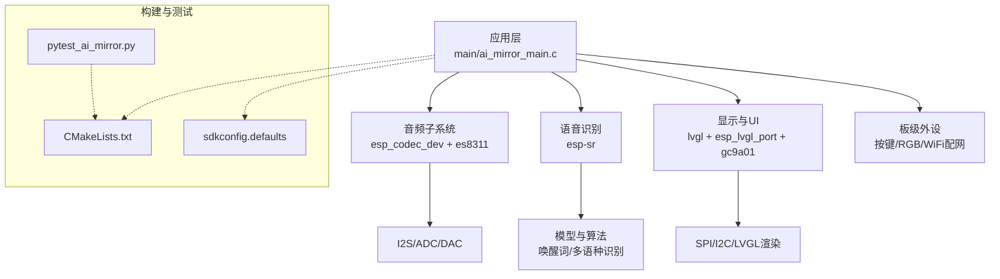
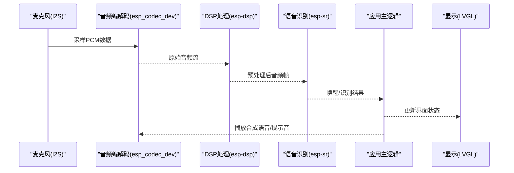
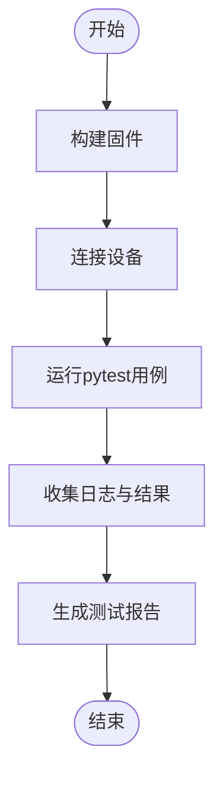
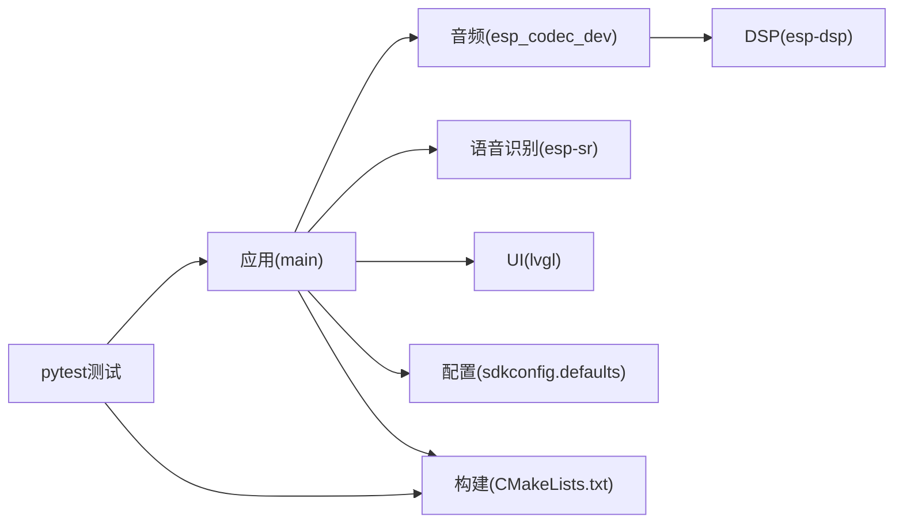

# 调试与测试

<cite>
**本文引用的文件**   
- [README.md](file://Firmware/esp32_ai_mirror/README.md)
- [CMakeLists.txt](file://Firmware/esp32_ai_mirror/CMakeLists.txt)
- [sdkconfig.defaults](file://Firmware/esp32_ai_mirror/sdkconfig.defaults)
- [pytest_ai_mirror.py](file://Firmware/esp32_ai_mirror/pytest_ai_mirror.py)
- [ai_mirror_main.c](file://Firmware/esp32_ai_mirror/main/ai_mirror_main.c)
- [ai_mirror_config.h](file://Firmware/esp32_ai_mirror/main/ai_mirror_config.h)
- [idf_component.yml](file://Firmware/esp32_ai_mirror/main/idf_component.yml)
- [esp-sr CMakeLists.txt](file://Firmware/esp32_ai_mirror/components/espressif__esp-sr/CMakeLists.txt)
- [esp-sr README.md](file://Firmware/esp32_ai_mirror/components/espressif__esp-sr/README.md)
- [esp_codec_dev CMakeLists.txt](file://Firmware/esp32_ai_mirror/managed_components/espressif__esp_codec_dev/CMakeLists.txt)
- [esp-dsp README.md](file://Firmware/esp32_ai_mirror/managed_components/espressif__esp-dsp/README.md)
- [lvgl README.md](file://Firmware/esp32_ai_mirror/managed_components/lvgl__lvgl/README.md)
- [cmake_utilities pytest](file://Firmware/esp32_ai_mirror/managed_components/espressif__cmake_utilities/test_apps/pytest_cmake_utilities.py)
- [codec_dev_test pytest](file://Firmware/esp32_ai_mirror/managed_components/espressif__esp_codec_dev/test_apps/codec_dev_test/pytest_esp_codec_dev_test.py)
</cite>

## 目录
1. [简介](#简介)
2. [项目结构](#项目结构)
3. [核心组件](#核心组件)
4. [架构总览](#架构总览)
5. [详细组件分析](#详细组件分析)
6. [依赖关系分析](#依赖关系分析)
7. [性能考虑](#性能考虑)
8. [故障排查指南](#故障排查指南)
9. [结论](#结论)
10. [附录](#附录)

## 简介
本指南面向AI镜子项目的开发与维护人员，聚焦于调试与测试实践。内容涵盖：
- GDB硬件调试与软件断点配置、ESP-IDF内置调试工具与日志系统使用
- 单元测试框架与pytest自动化流程
- 音频处理模块专项测试方法与语音识别功能验证手段
- 性能分析与内存泄漏检测工具使用方法
- 常见问题定位技巧与排障流程

目标是帮助读者快速搭建可重复的调试环境，系统化地验证音频链路、语音识别与UI交互，并高效定位问题。

## 项目结构
本项目基于ESP-IDF构建，核心固件位于Firmware/esp32_ai_mirror目录，包含应用主程序、组件与第三方库集成。关键目录与职责：
- main：应用入口、UI、板级驱动（按键、RGB、WiFi配网）等
- components：esp-sr（语音识别）、esp_lcd_gc9a01（LCD驱动）等
- managed_components：ESP官方组件与第三方库（esp_codec_dev、esp-dsp、lvgl等）
- 构建与测试：CMakeLists、sdkconfig、pytest脚本

图表来源
- [CMakeLists.txt](file://Firmware/esp32_ai_mirror/CMakeLists.txt)
- [sdkconfig.defaults](file://Firmware/esp32_ai_mirror/sdkconfig.defaults)
- [pytest_ai_mirror.py](file://Firmware/esp32_ai_mirror/pytest_ai_mirror.py)
- [ai_mirror_main.c](file://Firmware/esp32_ai_mirror/main/ai_mirror_main.c)

章节来源
- [README.md](file://Firmware/esp32_ai_mirror/README.md)
- [CMakeLists.txt](file://Firmware/esp32_ai_mirror/CMakeLists.txt)
- [sdkconfig.defaults](file://Firmware/esp32_ai_mirror/sdkconfig.defaults)

## 核心组件
- 应用主循环与任务调度：在应用入口中初始化各子系统，创建音频采集、语音识别、UI刷新等任务或线程，协调数据流与控制流。
- 音频子系统：通过esp_codec_dev抽象I2S/Codec，实现录音与播放；结合esp-dsp进行降噪、回声消除、AGC等处理。
- 语音识别：集成esp-sr，加载唤醒词与命令识别模型，提供实时流式识别接口。
- UI与显示：LVGL驱动屏幕，配合触摸输入完成交互。
- 构建与配置：CMake与Kconfig管理编译选项、分区表、组件依赖；pytest用于端到端与单元自动化测试。

章节来源
- [ai_mirror_main.c](file://Firmware/esp32_ai_mirror/main/ai_mirror_main.c)
- [idf_component.yml](file://Firmware/esp32_ai_mirror/main/idf_component.yml)
- [esp-sr CMakeLists.txt](file://Firmware/esp32_ai_mirror/components/espressif__esp-sr/CMakeLists.txt)
- [esp_codec_dev CMakeLists.txt](file://Firmware/esp32_ai_mirror/managed_components/espressif__esp_codec_dev/CMakeLists.txt)
- [esp-dsp README.md](file://Firmware/esp32_ai_mirror/managed_components/espressif__esp-dsp/README.md)
- [lvgl README.md](file://Firmware/esp32_ai_mirror/managed_components/lvgl__lvgl/README.md)

## 架构总览
下图展示从麦克风采集到语音识别、再到UI反馈的整体数据流与模块交互。

图表来源
- [ai_mirror_main.c](file://Firmware/esp32_ai_mirror/main/ai_mirror_main.c)
- [esp_codec_dev CMakeLists.txt](file://Firmware/esp32_ai_mirror/managed_components/espressif__esp_codec_dev/CMakeLists.txt)
- [esp-dsp README.md](file://Firmware/esp32_ai_mirror/managed_components/espressif__esp-dsp/README.md)
- [esp-sr CMakeLists.txt](file://Firmware/esp32_ai_mirror/components/espressif__esp-sr/CMakeLists.txt)
- [lvgl README.md](file://Firmware/esp32_ai_mirror/managed_components/lvgl__lvgl/README.md)

## 详细组件分析

### GDB调试器配置与使用（硬件调试与软件断点）
- 硬件调试准备
  - 确保开发板通过USB或JTAG连接至主机，安装对应驱动与OpenOCD/J-Link工具链。
  - 在ESP-IDF中启用调试符号（默认debug build），确认分区表与固件路径正确。
- 启动GDB会话
  - 使用idf.py flash monitor进入监控模式，另开终端启动gdb-multiarch或espressif提供的gdb。
  - 连接目标设备，设置远程调试端口，加载符号文件。
- 断点与单步
  - 软件断点：在应用入口、音频回调、识别结果回调处设置断点，观察参数与状态。
  - 硬件断点：对热点函数或中断服务程序使用硬件断点，避免影响时序。
- 常用命令
  - 查看寄存器、堆栈、内存；打印变量；查看任务列表与优先级；跟踪异常与崩溃地址。
- 日志辅助
  - 调整日志级别，捕获关键路径输出，结合断点定位问题。

章节来源
- [sdkconfig.defaults](file://Firmware/esp32_ai_mirror/sdkconfig.defaults)
- [CMakeLists.txt](file://Firmware/esp32_ai_mirror/CMakeLists.txt)

### ESP-IDF内置调试工具与日志系统
- 日志系统
  - 使用ESP_LOGx宏输出不同级别日志，合理划分模块与标签，便于过滤与追踪。
  - 动态调整日志级别，生产环境降低开销，调试时提高详细度。
- 崩溃与回溯
  - 启用异常回溯，获取崩溃时的调用栈，定位非法访问或溢出。
- 性能与资源
  - 使用内置计数器与统计接口，观察CPU占用、内存分配与任务切换。
- 与GDB联动
  - 在日志关键位置打断点，结合堆栈与变量检查，快速缩小问题范围。

章节来源
- [sdkconfig.defaults](file://Firmware/esp32_ai_mirror/sdkconfig.defaults)
- [ai_mirror_main.c](file://Firmware/esp32_ai_mirror/main/ai_mirror_main.c)

### 单元测试框架与pytest自动化测试流程
- 测试框架选择
  - Python pytest作为统一编排器，结合ESP-IDF的测试组件与示例脚本。
- 项目内pytest脚本
  - 根目录pytest_ai_mirror.py定义用例集合、设备连接、烧录与运行流程。
- 参考示例
  - cmake_utilities与esp_codec_dev的test_apps提供了pytest模板，可直接复用。
- 典型流程
  - 构建固件 -> 连接设备 -> 执行测试用例 -> 收集日志与结果 -> 生成报告。

图表来源
- [pytest_ai_mirror.py](file://Firmware/esp32_ai_mirror/pytest_ai_mirror.py)
- [cmake_utilities pytest](file://Firmware/esp32_ai_mirror/managed_components/espressif__cmake_utilities/test_apps/pytest_cmake_utilities.py)
- [codec_dev_test pytest](file://Firmware/esp32_ai_mirror/managed_components/espressif__esp_codec_dev/test_apps/codec_dev_test/pytest_esp_codec_dev_test.py)

章节来源
- [pytest_ai_mirror.py](file://Firmware/esp32_ai_mirror/pytest_ai_mirror.py)
- [cmake_utilities pytest](file://Firmware/esp32_ai_mirror/managed_components/espressif__cmake_utilities/test_apps/pytest_cmake_utilities.py)
- [codec_dev_test pytest](file://Firmware/esp32_ai_mirror/managed_components/espressif__esp_codec_dev/test_apps/codec_dev_test/pytest_esp_codec_dev_test.py)

### 音频处理模块专项测试方法
- 测试目标
  - 验证I2S链路、Codec初始化、音量控制、采样率与位深配置、噪声抑制与回声消除效果。
- 测试方法
  - 环路测试：录制与回放同一信号，测量延迟与失真。
  - 信号注入：通过外部音频源注入标准信号，评估频响与底噪。
  - 压力测试：长时间连续采集与处理，观察内存与CPU稳定性。
- 指标与工具
  - 使用频谱分析、THD+N测量、信噪比评估；结合日志记录关键参数变化。

章节来源
- [esp_codec_dev CMakeLists.txt](file://Firmware/esp32_ai_mirror/managed_components/espressif__esp_codec_dev/CMakeLists.txt)
- [esp-dsp README.md](file://Firmware/esp32_ai_mirror/managed_components/espressif__esp-dsp/README.md)

### 语音识别功能的验证手段
- 验证目标
  - 唤醒词检测准确率、命令识别鲁棒性、抗噪能力、响应延迟。
- 验证方法
  - 离线数据集回放：使用标准语料库批量测试，统计准确率与误报率。
  - 在线场景模拟：在不同环境噪声下测试唤醒与识别成功率。
  - 模型切换与加载：验证多模型共存与热切换的正确性。
- 指标与工具
  - 混淆矩阵、ROC曲线、延迟分布；结合日志与GDB断点定位瓶颈。

章节来源
- [esp-sr CMakeLists.txt](file://Firmware/esp32_ai_mirror/components/espressif__esp-sr/CMakeLists.txt)
- [esp-sr README.md](file://Firmware/esp32_ai_mirror/components/espressif__esp-sr/README.md)

### UI与交互测试要点
- 验证目标
  - LVGL渲染性能、触摸事件响应、界面状态同步。
- 测试方法
  - 自动化UI脚本驱动点击与滑动，校验界面更新与事件处理。
  - 性能监控：帧率、内存占用、渲染耗时。

章节来源
- [lvgl README.md](file://Firmware/esp32_ai_mirror/managed_components/lvgl__lvgl/README.md)

## 依赖关系分析
- 组件依赖
  - 应用依赖esp_codec_dev、esp-sr、lvgl等组件，通过CMake与idf_component.yml声明。
- 构建依赖
  - sdkconfig.defaults控制编译选项与特性开关，影响调试与性能。
- 测试依赖
  - pytest脚本依赖ESP-IDF工具链与设备连接，引用测试组件示例。

图表来源
- [idf_component.yml](file://Firmware/esp32_ai_mirror/main/idf_component.yml)
- [CMakeLists.txt](file://Firmware/esp32_ai_mirror/CMakeLists.txt)
- [sdkconfig.defaults](file://Firmware/esp32_ai_mirror/sdkconfig.defaults)
- [pytest_ai_mirror.py](file://Firmware/esp32_ai_mirror/pytest_ai_mirror.py)

章节来源
- [idf_component.yml](file://Firmware/esp32_ai_mirror/main/idf_component.yml)
- [CMakeLists.txt](file://Firmware/esp32_ai_mirror/CMakeLists.txt)
- [sdkconfig.defaults](file://Firmware/esp32_ai_mirror/sdkconfig.defaults)

## 性能考虑
- 音频链路优化
  - 合理设置缓冲区大小与采样率，减少拷贝与延迟；启用必要的DSP处理但避免过度计算。
- 内存管理
  - 避免频繁动态分配，使用对象池与静态缓冲；监控堆碎片与峰值占用。
- CPU与任务调度
  - 将耗时任务下沉至独立任务，使用队列与事件机制解耦；避免阻塞调用。
- 可视化与监控
  - 使用ESP-IDF统计接口与日志标记关键路径耗时，结合GDB与性能分析工具定位热点。

[本节为通用指导，不直接分析具体文件]

## 故障排查指南
- 常见现象
  - 无法录音或播放、识别无响应、界面卡顿、重启或看门狗触发。
- 定位步骤
  - 检查日志级别与模块标签，确认关键路径输出；使用GDB断点验证初始化顺序与参数。
  - 隔离问题：关闭非必要功能，逐步恢复以缩小范围。
  - 资源检查：内存、任务栈、I2S/中断冲突；查看异常回溯与崩溃地址。
- 实用技巧
  - 使用最小化固件复现问题；添加临时日志与计数器；利用pytest自动化回归验证修复。

章节来源
- [sdkconfig.defaults](file://Firmware/esp32_ai_mirror/sdkconfig.defaults)
- [ai_mirror_main.c](file://Firmware/esp32_ai_mirror/main/ai_mirror_main.c)

## 结论
通过系统化的GDB调试、ESP-IDF日志与测试框架，结合音频与语音识别的专项验证方法，能够高效定位问题并保证质量。建议在日常开发中建立可重复的测试流水线，持续监控性能与稳定性，持续提升产品可靠性。

[本节为总结性内容，不直接分析具体文件]

## 附录
- 参考文档与示例
  - esp-sr组件文档与示例：用于理解语音识别接口与模型管理。
  - esp_codec_dev测试应用：学习音频链路测试与pytest编排。
  - lvgl文档与示例：了解UI渲染与事件处理最佳实践。

章节来源
- [esp-sr README.md](file://Firmware/esp32_ai_mirror/components/espressif__esp-sr/README.md)
- [codec_dev_test pytest](file://Firmware/esp32_ai_mirror/managed_components/espressif__esp_codec_dev/test_apps/codec_dev_test/pytest_esp_codec_dev_test.py)
- [lvgl README.md](file://Firmware/esp32_ai_mirror/managed_components/lvgl__lvgl/README.md)