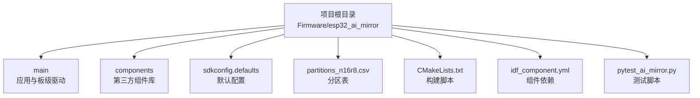
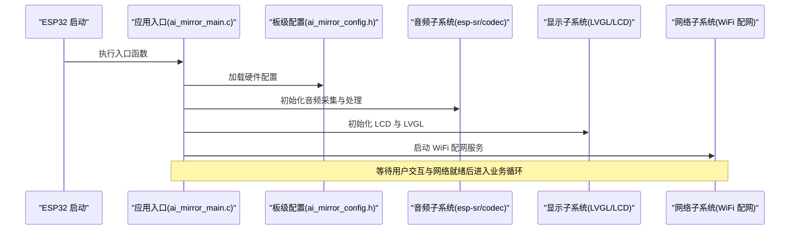
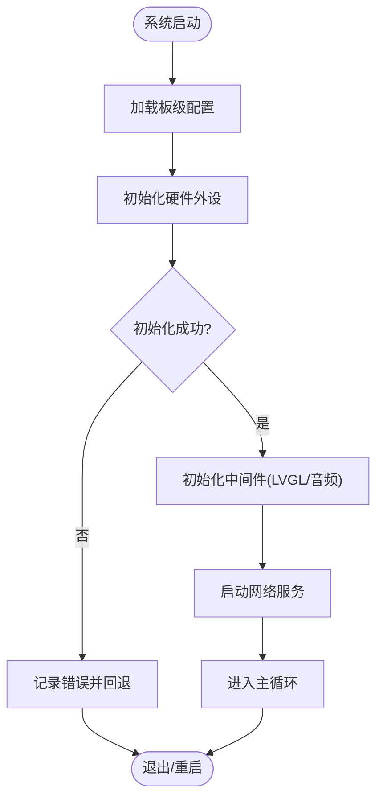
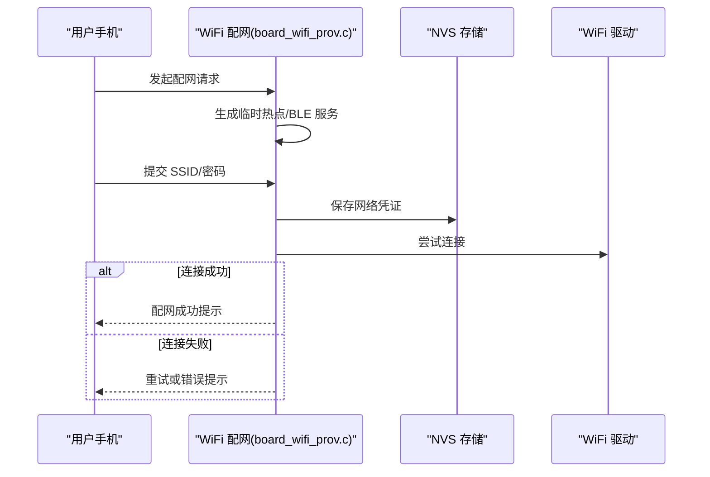
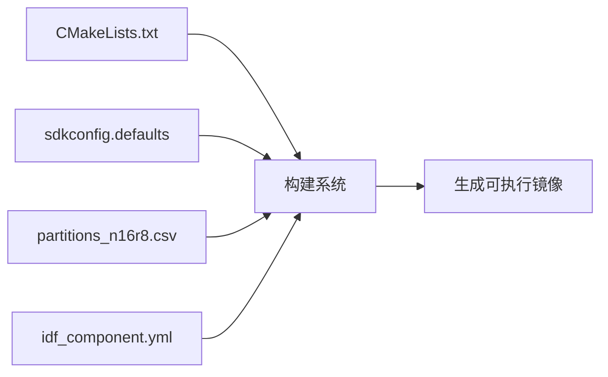
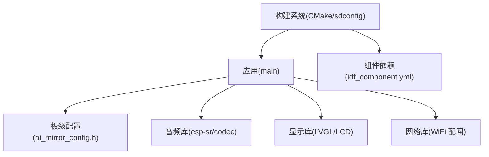

# 快速开始

<cite>
**本文引用的文件**   
- [README.md](file://Firmware/esp32_ai_mirror/README.md)
- [CMakeLists.txt](file://Firmware/esp32_ai_mirror/CMakeLists.txt)
- [sdkconfig.defaults](file://Firmware/esp32_ai_mirror/sdkconfig.defaults)
- [partitions_n16r8.csv](file://Firmware/esp32_ai_mirror/partitions_n16r8.csv)
- [idf_component.yml](file://Firmware/esp32_ai_mirror/main/idf_component.yml)
- [ai_mirror_main.c](file://Firmware/esp32_ai_mirror/main/ai_mirror_main.c)
- [ai_mirror_config.h](file://Firmware/esp32_ai_mirror/main/ai_mirror_config.h)
- [board_wifi_prov.c](file://Firmware/esp32_ai_mirror/main/board_wifi_prov.c)
- [pytest_ai_mirror.py](file://Firmware/esp32_ai_mirror/pytest_ai_mirror.py)
</cite>

## 目录
1. [简介](#简介)
2. [项目结构](#项目结构)
3. [核心组件](#核心组件)
4. [架构总览](#架构总览)
5. [详细组件分析](#详细组件分析)
6. [依赖关系分析](#依赖关系分析)
7. [性能注意事项](#性能注意事项)
8. [故障排除指南](#故障排除指南)
9. [结论](#结论)
10. [附录](#附录)

## 简介
本快速开始指南面向首次接触 AI 镜子项目的开发者，目标是帮助你在最短时间内完成开发环境搭建、编译与烧录，并让设备成功初始化运行。你将学到：
- 如何安装 ESP-IDF 工具链与必要依赖
- 如何克隆仓库、配置编译环境与首次构建
- 如何将固件烧录到设备并完成基础初始化
- 常见问题定位与解决思路

## 项目结构
本项目基于 ESP-IDF 框架，位于 Firmware/esp32_ai_mirror 目录下。关键目录与文件说明如下：
- main：应用主逻辑与板级驱动（按键、RGB、WiFi 配网等）
- components：第三方或厂商组件（如 esp-sr、LCD 驱动、LVGL 等）
- sdkconfig.defaults：默认编译配置
- partitions_n16r8.csv：分区表定义
- CMakeLists.txt：顶层构建脚本
- idf_component.yml：组件依赖声明
- pytest_ai_mirror.py：测试脚本入口

**图表来源** 
- [CMakeLists.txt](file://Firmware/esp32_ai_mirror/CMakeLists.txt)
- [sdkconfig.defaults](file://Firmware/esp32_ai_mirror/sdkconfig.defaults)
- [partitions_n16r8.csv](file://Firmware/esp32_ai_mirror/partitions_n16r8.csv)
- [idf_component.yml](file://Firmware/esp32_ai_mirror/main/idf_component.yml)

**章节来源**
- [CMakeLists.txt](file://Firmware/esp32_ai_mirror/CMakeLists.txt)
- [sdkconfig.defaults](file://Firmware/esp32_ai_mirror/sdkconfig.defaults)
- [partitions_n16r8.csv](file://Firmware/esp32_ai_mirror/partitions_n16r8.csv)
- [idf_component.yml](file://Firmware/esp32_ai_mirror/main/idf_component.yml)

## 核心组件
- 应用入口与初始化：main/ai_mirror_main.c 负责系统启动后的核心初始化流程，包括外设、显示、音频、网络等模块的初始化与任务调度。
- 板级配置：main/ai_mirror_config.h 集中定义硬件相关参数（引脚、分辨率、音频参数等），便于适配不同硬件。
- WiFi 配网：main/board_wifi_prov.c 提供基于软 AP 或 BLE 的配网能力，用于首次联网设置。
- 组件依赖：main/idf_component.yml 声明了 esp-sr、LVGL、LCD 驱动、编解码器等依赖，确保构建时自动拉取与管理。

**章节来源**
- [ai_mirror_main.c](file://Firmware/esp32_ai_mirror/main/ai_mirror_main.c)
- [ai_mirror_config.h](file://Firmware/esp32_ai_mirror/main/ai_mirror_config.h)
- [board_wifi_prov.c](file://Firmware/esp32_ai_mirror/main/board_wifi_prov.c)
- [idf_component.yml](file://Firmware/esp32_ai_mirror/main/idf_component.yml)

## 架构总览
下图展示了从应用入口到各子系统的关键调用关系，帮助你理解首次上电后的初始化顺序。

**图表来源** 
- [ai_mirror_main.c](file://Firmware/esp32_ai_mirror/main/ai_mirror_main.c)
- [ai_mirror_config.h](file://Firmware/esp32_ai_mirror/main/ai_mirror_config.h)
- [board_wifi_prov.c](file://Firmware/esp32_ai_mirror/main/board_wifi_prov.c)

## 详细组件分析

### 应用入口与初始化流程
- 入口职责：解析配置、初始化外设、创建任务与事件队列、启动 UI 与网络服务。
- 初始化顺序：先底层硬件（I2S、SPI、GPIO），再中间件（LVGL、音频），最后上层功能（WiFi 配网、业务逻辑）。
- 错误处理：对关键初始化步骤进行返回值检查，失败时打印日志并回退到安全状态。

**图表来源** 
- [ai_mirror_main.c](file://Firmware/esp32_ai_mirror/main/ai_mirror_main.c)
- [ai_mirror_config.h](file://Firmware/esp32_ai_mirror/main/ai_mirror_config.h)

**章节来源**
- [ai_mirror_main.c](file://Firmware/esp32_ai_mirror/main/ai_mirror_main.c)
- [ai_mirror_config.h](file://Firmware/esp32_ai_mirror/main/ai_mirror_config.h)

### WiFi 配网流程
- 触发方式：首次上电或重置后进入配网模式。
- 流程要点：创建软 AP/BLE 服务 -> 接收手机配网信息 -> 保存至 NVS -> 连接目标 WiFi -> 退出配网模式。
- 异常处理：超时重试、凭证校验失败提示、NVS 写入失败恢复。

**图表来源** 
- [board_wifi_prov.c](file://Firmware/esp32_ai_mirror/main/board_wifi_prov.c)

**章节来源**
- [board_wifi_prov.c](file://Firmware/esp32_ai_mirror/main/board_wifi_prov.c)

### 构建系统与配置
- 构建脚本：CMakeLists.txt 定义工程结构与组件集成。
- 默认配置：sdkconfig.defaults 提供默认 Kconfig 选项，覆盖常见硬件与功能开关。
- 分区表：partitions_n16r8.csv 定义 OTA、文件系统、参数区等分区布局。
- 组件依赖：idf_component.yml 声明 esp-sr、LVGL、LCD 驱动等依赖，支持自动下载与版本锁定。

**图表来源** 
- [CMakeLists.txt](file://Firmware/esp32_ai_mirror/CMakeLists.txt)
- [sdkconfig.defaults](file://Firmware/esp32_ai_mirror/sdkconfig.defaults)
- [partitions_n16r8.csv](file://Firmware/esp32_ai_mirror/partitions_n16r8.csv)
- [idf_component.yml](file://Firmware/esp32_ai_mirror/main/idf_component.yml)

**章节来源**
- [CMakeLists.txt](file://Firmware/esp32_ai_mirror/CMakeLists.txt)
- [sdkconfig.defaults](file://Firmware/esp32_ai_mirror/sdkconfig.defaults)
- [partitions_n16r8.csv](file://Firmware/esp32_ai_mirror/partitions_n16r8.csv)
- [idf_component.yml](file://Firmware/esp32_ai_mirror/main/idf_component.yml)

## 依赖关系分析
- 外部依赖：ESP-IDF 工具链、Python 环境、Git；组件依赖通过 idf_component.yml 管理。
- 内部耦合：应用层依赖板级配置与中间件（LVGL、音频、网络），各子系统相对独立，便于替换与扩展。
- 潜在风险：组件版本不匹配可能导致编译失败；分区表与实际 Flash 容量不一致会导致运行异常。

**图表来源** 
- [idf_component.yml](file://Firmware/esp32_ai_mirror/main/idf_component.yml)
- [CMakeLists.txt](file://Firmware/esp32_ai_mirror/CMakeLists.txt)
- [sdkconfig.defaults](file://Firmware/esp32_ai_mirror/sdkconfig.defaults)

**章节来源**
- [idf_component.yml](file://Firmware/esp32_ai_mirror/main/idf_component.yml)
- [CMakeLists.txt](file://Firmware/esp32_ai_mirror/CMakeLists.txt)
- [sdkconfig.defaults](file://Firmware/esp32_ai_mirror/sdkconfig.defaults)

## 性能注意事项
- 内存使用：LVGL 与音频缓冲占用较大，需根据实际 Flash/RAM 调整缓冲区大小。
- CPU 负载：语音识别与 UI 渲染并行时需合理分配任务优先级，避免卡顿。
- I/O 瓶颈：SPI LCD 与 I2S 音频同时工作时注意 DMA 与中断配置，减少阻塞。

[本节为通用指导，无需特定文件引用]

## 故障排除指南
- 无法编译
  - 检查 ESP-IDF 版本与项目要求是否一致
  - 确认 Python 与 pip 可用，且已安装依赖
  - 清理 build 目录后重新构建
- 无法烧录
  - 确认串口端口与波特率正确
  - 检查 USB 线质量与供电是否充足
  - 按住 BOOT 键再复位进入下载模式
- 无法联网
  - 检查 WiFi 名称与密码是否正确
  - 查看路由器是否开启 2.4GHz 频段
  - 重置 NVS 并重新配网
- 显示异常
  - 检查 SPI 引脚与屏幕驱动配置
  - 确认 LVGL 刷新频率与缓冲区大小
- 音频无声或杂音
  - 检查 I2S 引脚与采样率配置
  - 确认音量与静音寄存器设置

**章节来源**
- [pytest_ai_mirror.py](file://Firmware/esp32_ai_mirror/pytest_ai_mirror.py)

## 结论
通过以上步骤，你应能完成 AI 镜子项目的开发环境搭建、首次构建与烧录，并理解系统初始化与配网流程。若遇到问题，可参考故障排除指南逐步定位。建议后续深入阅读 main 目录下的源码与配置文件，以便定制功能与优化性能。

[本节为总结性内容，无需特定文件引用]

## 附录

### 环境准备清单
- 操作系统：Windows/macOS/Linux
- ESP-IDF：按官方文档安装对应版本
- Python：3.8+，pip 可用
- Git：用于克隆仓库与子模块更新
- 串口工具：ESPTOOL 或 IDE 内置工具

### 克隆与初始化命令
- 克隆仓库
  - git clone <仓库地址>
  - cd Firmware/esp32_ai_mirror
- 初始化子模块与依赖
  - git submodule update --init --recursive
  - idf.py set-target <目标芯片>
  - idf.py menuconfig（按需修改配置）
  - idf.py build

### 首次构建与烧录
- 构建
  - idf.py build
- 烧录
  - idf.py -p <端口> flash
- 监视输出
  - idf.py -p <端口> monitor

### 常用配置项
- 目标芯片：在 menuconfig 中设置 target
- 分区表：选择 partitions_n16r8.csv 对应的布局
- 组件版本：通过 idf_component.yml 锁定依赖版本

### 验证运行
- 观察串口日志，确认各子系统初始化成功
- 使用手机配网，验证网络连接
- 检查屏幕显示与音频输出是否正常

**章节来源**
- [README.md](file://Firmware/esp32_ai_mirror/README.md)
- [pytest_ai_mirror.py](file://Firmware/esp32_ai_mirror/pytest_ai_mirror.py)