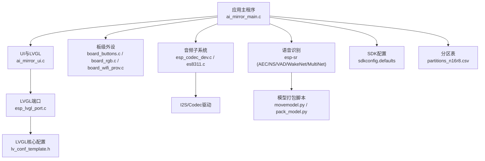
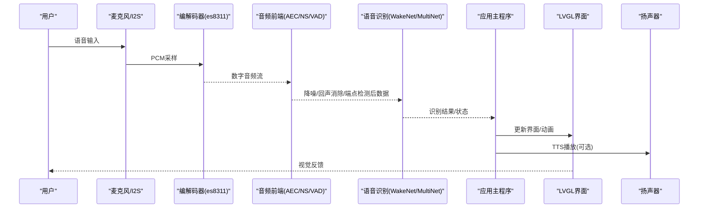
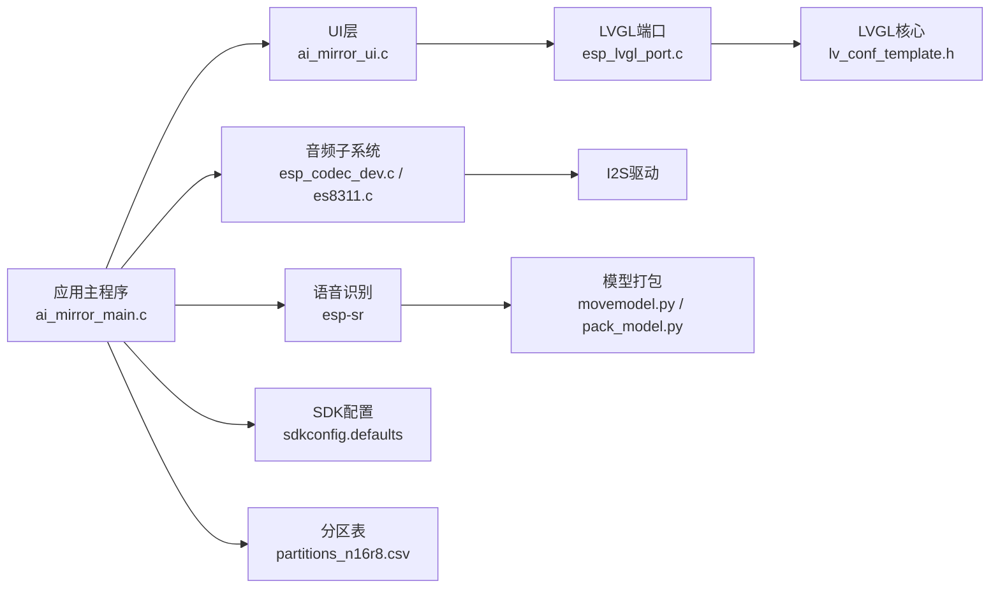

# 性能问题排除

<cite>
**本文引用的文件**   
- [ai_mirror_main.c](file://Firmware/esp32_ai_mirror/main/ai_mirror_main.c)
- [ai_mirror_ui.c](file://Firmware/esp32_ai_mirror/main/ai_mirror_ui.c)
- [board_buttons.c](file://Firmware/esp32_ai_mirror/main/board_buttons.c)
- [board_rgb.c](file://Firmware/esp32_ai_mirror/main/board_rgb.c)
- [board_wifi_prov.c](file://Firmware/esp32_ai_mirror/main/board_wifi_prov.c)
- [CMakeLists.txt](file://Firmware/esp32_ai_mirror/main/CMakeLists.txt)
- [Kconfig.projbuild](file://Firmware/esp32_ai_mirror/main/Kconfig.projbuild)
- [sdkconfig.defaults](file://Firmware/esp32_ai_mirror/sdkconfig.defaults)
- [partitions_n16r8.csv](file://Firmware/esp32_ai_mirror/partitions_n16r8.csv)
- [README.md](file://Firmware/esp32_ai_mirror/README.md)
- [idf_component.yml](file://Firmware/esp32_ai_mirror/main/idf_component.yml)
- [esp_lvgl_port.c](file://Firmware/esp32_ai_mirror/managed_components/espressif__esp_lvgl_port/esp_lvgl_port.c)
- [performance.md](file://Firmware/esp32_ai_mirror/managed_components/espressif__esp_lvgl_port/docs/performance.md)
- [lv_conf_template.h](file://Firmware/esp32_ai_mirror/managed_components/lvgl__lvgl/lv_conf_template.h)
- [esp_codec_dev.c](file://Firmware/esp32_ai_mirror/managed_components/espressif__esp_codec_dev/esp_codec_dev.c)
- [es8311.c](file://Firmware/esp32_ai_mirror/managed_components/espressif__es8311/es8311.c)
- [esp_afe_sr_1mic.ref](file://Firmware/esp32_ai_mirror/components/espressif__esp-sr/src/esp_afe_sr_1mic.ref)
- [movemodel.py](file://Firmware/esp32_ai_mirror/components/espressif__esp-sr/model/movemodel.py)
- [pack_model.py](file://Firmware/esp32_ai_mirror/components/espressif__esp-sr/model/pack_model.py)
- [pytest_ai_mirror.py](file://Firmware/esp32_ai_mirror/pytest_ai_mirror.py)
</cite>

## 目录
1. [简介](#简介)
2. [项目结构](#项目结构)
3. [核心组件](#核心组件)
4. [架构总览](#架构总览)
5. [详细组件分析](#详细组件分析)
6. [依赖关系分析](#依赖关系分析)
7. [性能考量与优化策略](#性能考量与优化策略)
8. [故障排查指南](#故障排查指南)
9. [结论](#结论)
10. [附录](#附录)

## 简介
本指南面向AI镜子（ESP32-S3）项目的性能问题诊断与优化，覆盖CPU占用率高、内存不足、渲染卡顿、响应延迟等典型症状。内容涵盖：
- ESP32-S3资源监控工具使用与指标采集
- 性能分析器配置与热点代码定位技巧
- LVGL界面渲染优化
- 语音识别算法调优与音频处理流水线优化
- 系统级问题：内存泄漏、任务优先级冲突、中断处理延迟
- 性能基准测试方法与监控指标收集

## 项目结构
本项目基于ESP-IDF构建，主应用位于main目录，LVGL与音频编解码通过组件集成，ESP-SR提供语音识别能力，模型打包脚本位于components/espressif__esp-sr/model。关键入口与配置文件包括：
- 应用主循环与任务初始化：ai_mirror_main.c
- UI层与LVGL集成：ai_mirror_ui.c
- 板级外设驱动：board_buttons.c、board_rgb.c、board_wifi_prov.c
- 组件清单与依赖：idf_component.yml
- SDK默认配置：sdkconfig.defaults
- 分区表：partitions_n16r8.csv
- LVGL端口与性能文档：esp_lvgl_port.c、performance.md、lv_conf_template.h
- 音频子系统：esp_codec_dev.c、es8311.c
- 语音前端参考：esp_afe_sr_1mic.ref
- 模型打包：movemodel.py、pack_model.py
- 自动化测试：pytest_ai_mirror.py

图表来源
- [ai_mirror_main.c](file://Firmware/esp32_ai_mirror/main/ai_mirror_main.c)
- [ai_mirror_ui.c](file://Firmware/esp32_ai_mirror/main/ai_mirror_ui.c)
- [esp_lvgl_port.c](file://Firmware/esp32_ai_mirror/managed_components/espressif__esp_lvgl_port/esp_lvgl_port.c)
- [lv_conf_template.h](file://Firmware/esp32_ai_mirror/managed_components/lvgl__lvgl/lv_conf_template.h)
- [esp_codec_dev.c](file://Firmware/esp32_ai_mirror/managed_components/espressif__esp_codec_dev/esp_codec_dev.c)
- [es8311.c](file://Firmware/esp32_ai_mirror/managed_components/espressif__es8311/es8311.c)
- [movemodel.py](file://Firmware/esp32_ai_mirror/components/espressif__esp-sr/model/movemodel.py)
- [pack_model.py](file://Firmware/esp32_ai_mirror/components/espressif__esp-sr/model/pack_model.py)
- [sdkconfig.defaults](file://Firmware/esp32_ai_mirror/sdkconfig.defaults)
- [partitions_n16r8.csv](file://Firmware/esp32_ai_mirror/partitions_n16r8.csv)

章节来源
- [README.md](file://Firmware/esp32_ai_mirror/README.md)
- [idf_component.yml](file://Firmware/esp32_ai_mirror/main/idf_component.yml)
- [sdkconfig.defaults](file://Firmware/esp32_ai_mirror/sdkconfig.defaults)
- [partitions_n16r8.csv](file://Firmware/esp32_ai_mirror/partitions_n16r8.csv)

## 核心组件
- 应用主程序：负责任务创建、事件分发、模块初始化与生命周期管理。
- UI与LVGL：负责界面绘制、事件处理与帧率控制。
- 音频子系统：I2S与编解码器驱动，音频缓冲与流式处理。
- 语音识别：前端处理（AEC/NS/VAD）、唤醒与命令识别（WakeNet/MultiNet）。
- 板级外设：按键、RGB灯、WiFi配网等。

章节来源
- [ai_mirror_main.c](file://Firmware/esp32_ai_mirror/main/ai_mirror_main.c)
- [ai_mirror_ui.c](file://Firmware/esp32_ai_mirror/main/ai_mirror_ui.c)
- [board_buttons.c](file://Firmware/esp32_ai_mirror/main/board_buttons.c)
- [board_rgb.c](file://Firmware/esp32_ai_mirror/main/board_rgb.c)
- [board_wifi_prov.c](file://Firmware/esp32_ai_mirror/main/board_wifi_prov.c)

## 架构总览
下图展示从输入到输出的完整数据流与关键组件交互，突出可能产生性能瓶颈的环节。

图表来源
- [esp_codec_dev.c](file://Firmware/esp32_ai_mirror/managed_components/espressif__esp_codec_dev/esp_codec_dev.c)
- [es8311.c](file://Firmware/esp32_ai_mirror/managed_components/espressif__es8311/es8311.c)
- [esp_afe_sr_1mic.ref](file://Firmware/esp32_ai_mirror/components/espressif__esp-sr/src/esp_afe_sr_1mic.ref)
- [ai_mirror_main.c](file://Firmware/esp32_ai_mirror/main/ai_mirror_main.c)
- [ai_mirror_ui.c](file://Firmware/esp32_ai_mirror/main/ai_mirror_ui.c)

## 详细组件分析

### 应用主程序与任务调度
- 关注点：任务创建顺序、优先级分配、队列长度、阻塞调用位置。
- 常见问题：高优先级任务抢占导致低优先级任务饥饿；长耗时同步调用阻塞UI或音频线程；事件队列溢出。
- 建议：
  - 将音频采集与处理置于较高优先级且固定栈大小，避免频繁动态分配。
  - UI刷新采用增量更新与批处理，减少重绘频率。
  - 使用非阻塞API与超时机制，避免死锁与长时间等待。

章节来源
- [ai_mirror_main.c](file://Firmware/esp32_ai_mirror/main/ai_mirror_main.c)
- [CMakeLists.txt](file://Firmware/esp32_ai_mirror/main/CMakeLists.txt)
- [Kconfig.projbuild](file://Firmware/esp32_ai_mirror/main/Kconfig.projbuild)

### LVGL界面渲染优化
- 关注点：帧率、重绘区域、图层缓存、字体与图片压缩、动画复杂度。
- 常见问题：全屏重绘、复杂动画、未启用双缓冲、字体过大导致内存碎片。
- 建议：
  - 启用双缓冲与部分刷新，限制重绘区域。
  - 使用压缩图片与精简字体，减少RAM占用。
  - 降低动画帧数与透明度混合开销。
  - 利用esp_lvgl_port的性能文档进行参数调优。

章节来源
- [ai_mirror_ui.c](file://Firmware/esp32_ai_mirror/main/ai_mirror_ui.c)
- [esp_lvgl_port.c](file://Firmware/esp32_ai_mirror/managed_components/espressif__esp_lvgl_port/esp_lvgl_port.c)
- [performance.md](file://Firmware/esp32_ai_mirror/managed_components/espressif__esp_lvgl_port/docs/performance.md)
- [lv_conf_template.h](file://Firmware/esp32_ai_mirror/managed_components/lvgl__lvgl/lv_conf_template.h)

### 音频处理流水线优化
- 关注点：I2S缓冲区大小、采样率、通道数、DSP管线延迟、编解码器配置。
- 常见问题：缓冲区过小导致丢帧；过大的DSP处理链增加CPU负载；编解码器初始化耗时过长。
- 建议：
  - 合理设置I2S缓冲区与DMA长度，平衡延迟与稳定性。
  - 按需启用AEC/NS/VAD，避免全链路开启造成过载。
  - 使用定点运算与SIMD指令（如ESP-DSP）加速计算。
  - 对es8311进行寄存器级优化，减少不必要的配置切换。

章节来源
- [esp_codec_dev.c](file://Firmware/esp32_ai_mirror/managed_components/espressif__esp_codec_dev/esp_codec_dev.c)
- [es8311.c](file://Firmware/esp32_ai_mirror/managed_components/espressif__es8311/es8311.c)
- [esp_afe_sr_1mic.ref](file://Firmware/esp32_ai_mirror/components/espressif__esp-sr/src/esp_afe_sr_1mic.ref)

### 语音识别算法调优
- 关注点：模型选择（Q8量化/浮点）、特征提取参数、VAD阈值、MultiNet词表规模。
- 常见问题：模型过大导致加载慢与内存紧张；VAD误触发导致频繁唤醒；词表过大影响推理速度。
- 建议：
  - 优先选用Q8量化模型，平衡精度与性能。
  - 调整VAD阈值与静音检测窗口，减少无效唤醒。
  - 裁剪MultiNet词表，仅保留常用命令。
  - 使用movemodel.py与pack_model.py优化模型布局与存储。

章节来源
- [movemodel.py](file://Firmware/esp32_ai_mirror/components/espressif__esp-sr/model/movemodel.py)
- [pack_model.py](file://Firmware/esp32_ai_mirror/components/espressif__esp-sr/model/pack_model.py)
- [esp_afe_sr_1mic.ref](file://Firmware/esp32_ai_mirror/components/espressif__esp-sr/src/esp_afe_sr_1mic.ref)

### 板级外设与中断处理
- 关注点：按键扫描频率、RGB更新周期、WiFi配网任务优先级。
- 常见问题：中断服务程序过长阻塞其他中断；高频轮询占用CPU；WiFi握手阶段阻塞主循环。
- 建议：
  - 将按键扫描放入定时器中断或低优先级任务，避免阻塞。
  - RGB更新采用批量写入与颜色插值，减少I/O次数。
  - WiFi配网异步化，避免阻塞关键路径。

章节来源
- [board_buttons.c](file://Firmware/esp32_ai_mirror/main/board_buttons.c)
- [board_rgb.c](file://Firmware/esp32_ai_mirror/main/board_rgb.c)
- [board_wifi_prov.c](file://Firmware/esp32_ai_mirror/main/board_wifi_prov.c)

## 依赖关系分析
下图展示主要组件间的依赖关系，帮助识别潜在耦合与性能热点。

图表来源
- [ai_mirror_main.c](file://Firmware/esp32_ai_mirror/main/ai_mirror_main.c)
- [ai_mirror_ui.c](file://Firmware/esp32_ai_mirror/main/ai_mirror_ui.c)
- [esp_lvgl_port.c](file://Firmware/esp32_ai_mirror/managed_components/espressif__esp_lvgl_port/esp_lvgl_port.c)
- [lv_conf_template.h](file://Firmware/esp32_ai_mirror/managed_components/lvgl__lvgl/lv_conf_template.h)
- [esp_codec_dev.c](file://Firmware/esp32_ai_mirror/managed_components/espressif__esp_codec_dev/esp_codec_dev.c)
- [es8311.c](file://Firmware/esp32_ai_mirror/managed_components/espressif__es8311/es8311.c)
- [movemodel.py](file://Firmware/esp32_ai_mirror/components/espressif__esp-sr/model/movemodel.py)
- [pack_model.py](file://Firmware/esp32_ai_mirror/components/espressif__esp-sr/model/pack_model.py)
- [sdkconfig.defaults](file://Firmware/esp32_ai_mirror/sdkconfig.defaults)
- [partitions_n16r8.csv](file://Firmware/esp32_ai_mirror/partitions_n16r8.csv)

章节来源
- [idf_component.yml](file://Firmware/esp32_ai_mirror/main/idf_component.yml)

## 性能考量与优化策略

### CPU占用率高
- 诊断方法：
  - 使用ESP-IDF性能分析器（perfmon）统计函数耗时与调用频次。
  - 观察FreeRTOS任务CPU占用率，定位长期占用CPU的任务。
- 优化策略：
  - 将密集计算移至协处理器或使用ESP-DSP库。
  - 减少动态内存分配，复用缓冲区与对象。
  - 合并I/O操作，降低系统调用开销。

章节来源
- [sdkconfig.defaults](file://Firmware/esp32_ai_mirror/sdkconfig.defaults)

### 内存不足
- 诊断方法：
  - 检查堆碎片与最小剩余堆大小，定位频繁分配/释放的代码段。
  - 使用内存分析工具（如heap_trace）追踪分配来源。
- 优化策略：
  - 增大PSRAM容量或优化分区表，确保足够可用空间。
  - 使用静态数组替代动态分配，减少碎片。
  - 压缩图片与字体，降低RAM占用。

章节来源
- [partitions_n16r8.csv](file://Firmware/esp32_ai_mirror/partitions_n16r8.csv)

### 渲染卡顿
- 诊断方法：
  - 使用LVGL内置性能计数器统计帧率与重绘时间。
  - 分析重绘区域大小与复杂度。
- 优化策略：
  - 启用双缓冲与部分刷新，限制重绘范围。
  - 简化动画与透明效果，减少混合计算。
  - 预渲染静态背景，避免重复绘制。

章节来源
- [performance.md](file://Firmware/esp32_ai_mirror/managed_components/espressif__esp_lvgl_port/docs/performance.md)
- [lv_conf_template.h](file://Firmware/esp32_ai_mirror/managed_components/lvgl__lvgl/lv_conf_template.h)

### 响应延迟
- 诊断方法：
  - 测量从输入到输出的端到端延迟，定位瓶颈阶段。
  - 检查任务优先级与队列长度是否合理。
- 优化策略：
  - 提升音频与识别任务优先级，确保实时性。
  - 使用环形缓冲区与零拷贝技术减少数据搬运。
  - 异步处理网络请求，避免阻塞主循环。

章节来源
- [ai_mirror_main.c](file://Firmware/esp32_ai_mirror/main/ai_mirror_main.c)

### 内存泄漏
- 诊断方法：
  - 使用heap_trace记录分配与释放，对比前后差异。
  - 检查指针生命周期与释放时机。
- 优化策略：
  - 统一内存管理接口，确保成对分配与释放。
  - 使用RAII风格封装，自动释放资源。
  - 定期清理临时对象与缓存。

章节来源
- [sdkconfig.defaults](file://Firmware/esp32_ai_mirror/sdkconfig.defaults)

### 任务优先级冲突
- 诊断方法：
  - 使用FreeRTOS任务列表查看优先级与运行状态。
  - 分析互斥锁与信号量使用是否存在优先级反转。
- 优化策略：
  - 重新设计任务优先级层次，避免高优先级长时间持有锁。
  - 使用优先级继承机制解决反转问题。
  - 拆分大任务为小任务，提高并发度。

章节来源
- [CMakeLists.txt](file://Firmware/esp32_ai_mirror/main/CMakeLists.txt)

### 中断处理延迟
- 诊断方法：
  - 使用示波器或逻辑分析仪测量中断响应时间。
  - 检查中断服务程序中的耗时操作。
- 优化策略：
  - 将耗时操作移至任务中，中断仅做标志位设置。
  - 禁用不必要的外设中断，减少上下文切换。
  - 使用硬件定时器与DMA卸载CPU负担。

章节来源
- [board_buttons.c](file://Firmware/esp32_ai_mirror/main/board_buttons.c)
- [board_rgb.c](file://Firmware/esp32_ai_mirror/main/board_rgb.c)

## 故障排查指南

### 性能基准测试
- 方法：
  - 定义标准测试用例，覆盖UI渲染、音频处理、语音识别等场景。
  - 使用pytest_ai_mirror.py执行自动化测试，收集指标。
- 指标：
  - 帧率、CPU占用率、内存峰值、端到端延迟、错误率。

章节来源
- [pytest_ai_mirror.py](file://Firmware/esp32_ai_mirror/pytest_ai_mirror.py)

### 监控指标收集
- 方法：
  - 启用ESP-IDF日志与性能计数器，输出关键指标。
  - 通过串口或网络上报运行时状态。
- 指标：
  - 任务CPU占用、堆使用、队列长度、中断计数。

章节来源
- [sdkconfig.defaults](file://Firmware/esp32_ai_mirror/sdkconfig.defaults)

### 热点代码定位
- 方法：
  - 使用perfmon统计函数耗时，生成火焰图。
  - 结合LLDB调试器断点与变量监视。
- 技巧：
  - 聚焦高频调用与长耗时函数。
  - 分析调用栈与参数变化趋势。

章节来源
- [sdkconfig.defaults](file://Firmware/esp32_ai_mirror/sdkconfig.defaults)

## 结论
通过对AI镜子项目的系统分析与优化策略总结，可有效解决CPU占用率高、内存不足、渲染卡顿、响应延迟等性能问题。关键在于合理配置资源、优化数据流、精简算法与界面，并建立完善的监控与测试体系。持续迭代与回归测试是保障性能稳定的重要手段。

## 附录

### ESP32-S3资源监控工具使用
- 工具：ESP-IDF perfmon、heap_trace、log analyser。
- 步骤：
  - 在sdkconfig.defaults中启用相应选项。
  - 编译并运行，收集日志与统计数据。
  - 使用可视化工具分析结果。

章节来源
- [sdkconfig.defaults](file://Firmware/esp32_ai_mirror/sdkconfig.defaults)

### 性能分析器配置
- 配置项：
  - 启用性能计数器与任务统计。
  - 设置采样间隔与输出格式。
- 输出：
  - CSV或JSON格式报告，便于进一步分析。

章节来源
- [sdkconfig.defaults](file://Firmware/esp32_ai_mirror/sdkconfig.defaults)

### LVGL界面渲染优化最佳实践
- 实践：
  - 使用LVGL性能文档指导参数调优。
  - 定期审查UI复杂度与资源占用。
- 工具：
  - LVGL内置性能计数器与外部分析工具。

章节来源
- [performance.md](file://Firmware/esp32_ai_mirror/managed_components/espressif__esp_lvgl_port/docs/performance.md)
- [lv_conf_template.h](file://Firmware/esp32_ai_mirror/managed_components/lvgl__lvgl/lv_conf_template.h)

### 语音识别算法调优指南
- 指南：
  - 选择合适的模型与量化方式。
  - 调整VAD阈值与特征参数。
- 工具：
  - movemodel.py与pack_model.py优化模型。

章节来源
- [movemodel.py](file://Firmware/esp32_ai_mirror/components/espressif__esp-sr/model/movemodel.py)
- [pack_model.py](file://Firmware/esp32_ai_mirror/components/espressif__esp-sr/model/pack_model.py)

### 音频处理流水线优化方案
- 方案：
  - 优化I2S缓冲区与DSP管线。
  - 精简编解码器配置。
- 工具：
  - esp_codec_dev与es8311驱动。

章节来源
- [esp_codec_dev.c](file://Firmware/esp32_ai_mirror/managed_components/espressif__esp_codec_dev/esp_codec_dev.c)
- [es8311.c](file://Firmware/esp32_ai_mirror/managed_components/espressif__es8311/es8311.c)