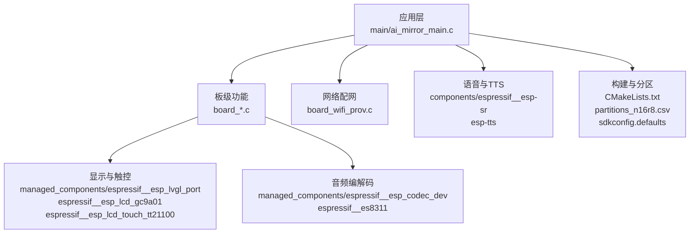
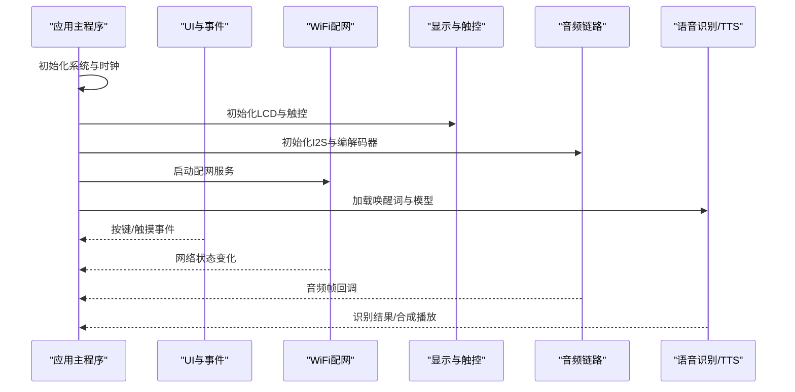
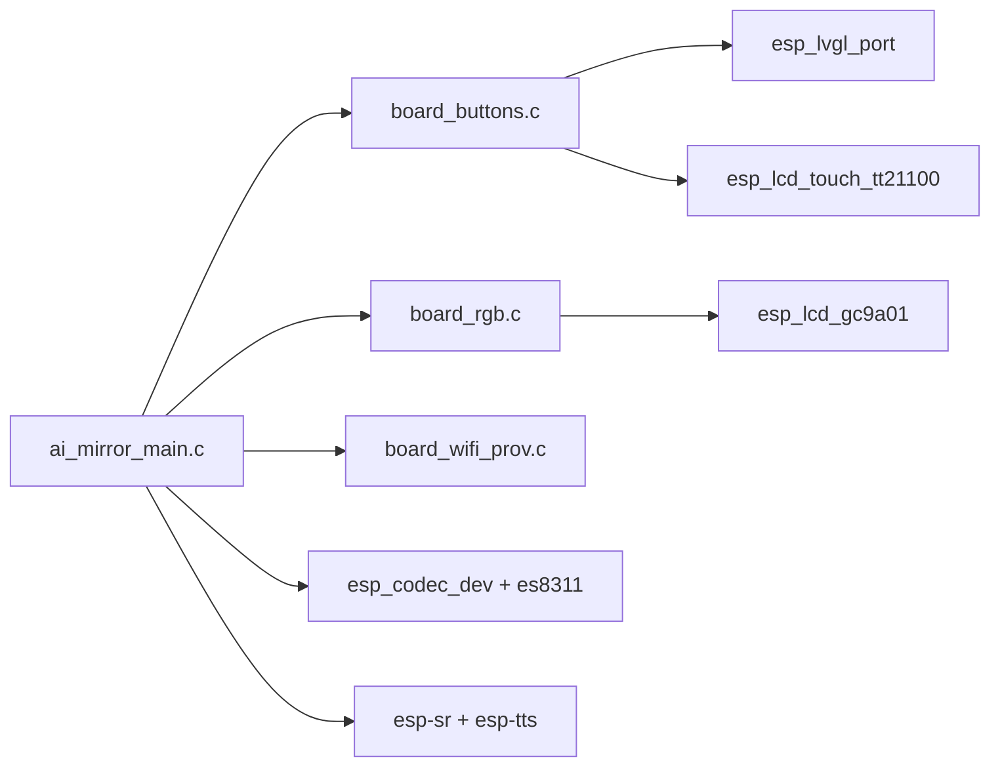

# 故障排除

<cite>
**本文引用的文件**   
- [README.md](file://README.md)
- [Firmware/esp32_ai_mirror/main/ai_mirror_main.c](file://Firmware/esp32_ai_mirror/main/ai_mirror_main.c)
- [Firmware/esp32_ai_mirror/main/ai_mirror_config.h](file://Firmware/esp32_ai_mirror/main/ai_mirror_config.h)
- [Firmware/esp32_ai_mirror/main/board_wifi_prov.c](file://Firmware/esp32_ai_mirror/main/board_wifi_prov.c)
- [Firmware/esp32_ai_mirror/main/board_buttons.c](file://Firmware/esp32_ai_mirror/main/board_buttons.c)
- [Firmware/esp32_ai_mirror/main/board_rgb.c](file://Firmware/esp32_ai_mirror/main/board_rgb.c)
- [Firmware/esp32_ai_mirror/CMakeLists.txt](file://Firmware/esp32_ai_mirror/CMakeLists.txt)
- [Firmware/esp32_ai_mirror/partitions_n16r8.csv](file://Firmware/esp32_ai_mirror/partitions_n16r8.csv)
- [Firmware/esp32_ai_mirror/sdkconfig.defaults](file://Firmware/esp32_ai_mirror/sdkconfig.defaults)
- [Firmware/esp32_ai_mirror/pytest_ai_mirror.py](file://Firmware/esp32_ai_mirror/pytest_ai_mirror.py)
</cite>

## 目录
1. [简介](#简介)
2. [项目结构](#项目结构)
3. [核心组件](#核心组件)
4. [架构总览](#架构总览)
5. [详细组件分析](#详细组件分析)
6. [依赖关系分析](#依赖关系分析)
7. [性能注意事项](#性能注意事项)
8. [故障排除指南](#故障排除指南)
9. [结论](#结论)
10. [附录](#附录)

## 简介
本指南面向AI镜子项目的硬件、软件与配置问题，提供系统化的诊断方法与解决步骤。内容涵盖：
- 常见问题分类与定位思路
- 日志分析方法与调试工具使用
- 编译错误、运行时异常、网络连接问题的解决方案
- 硬件测试方法与替换部件确认流程
- 社区支持渠道与问题报告模板
- 持续更新的常见问题解答（FAQ）

## 项目结构
本项目基于ESP-IDF构建，固件位于Firmware/esp32_ai_mirror目录，包含主程序、板级驱动、网络配网、显示与音频相关组件等。关键目录与职责如下：
- main：应用入口、UI、按键、RGB、WiFi配网等
- components：语音识别、TTS、LCD驱动等第三方或内部组件
- managed_components：ESP官方组件（LVGL、Codec、Touch、Display等）
- 构建与分区：CMakeLists.txt、partitions_n16r8.csv、sdkconfig.defaults

**图表来源** 
- [Firmware/esp32_ai_mirror/main/ai_mirror_main.c](file://Firmware/esp32_ai_mirror/main/ai_mirror_main.c)
- [Firmware/esp32_ai_mirror/main/board_wifi_prov.c](file://Firmware/esp32_ai_mirror/main/board_wifi_prov.c)
- [Firmware/esp32_ai_mirror/CMakeLists.txt](file://Firmware/esp32_ai_mirror/CMakeLists.txt)
- [Firmware/esp32_ai_mirror/partitions_n16r8.csv](file://Firmware/esp32_ai_mirror/partitions_n16r8.csv)
- [Firmware/esp32_ai_mirror/sdkconfig.defaults](file://Firmware/esp32_ai_mirror/sdkconfig.defaults)

**章节来源**
- [README.md](file://README.md)
- [Firmware/esp32_ai_mirror/CMakeLists.txt](file://Firmware/esp32_ai_mirror/CMakeLists.txt)
- [Firmware/esp32_ai_mirror/partitions_n16r8.csv](file://Firmware/esp32_ai_mirror/partitions_n16r8.csv)
- [Firmware/esp32_ai_mirror/sdkconfig.defaults](file://Firmware/esp32_ai_mirror/sdkconfig.defaults)

## 核心组件
- 应用主循环与任务调度：负责初始化各子系统、启动任务、处理事件
- 板级功能：按键扫描、RGB指示灯控制、WiFi配网流程
- 显示与触控：LVGL图形框架、GC9A01 LCD驱动、TT21100触控驱动
- 音频链路：I2S与ES8311编解码器、降噪/回声消除、唤醒词与语音识别
- 构建与分区：CMake工程、Flash分区表、默认SDK配置

**章节来源**
- [Firmware/esp32_ai_mirror/main/ai_mirror_main.c](file://Firmware/esp32_ai_mirror/main/ai_mirror_main.c)
- [Firmware/esp32_ai_mirror/main/board_buttons.c](file://Firmware/esp32_ai_mirror/main/board_buttons.c)
- [Firmware/esp32_ai_mirror/main/board_rgb.c](file://Firmware/esp32_ai_mirror/main/board_rgb.c)
- [Firmware/esp32_ai_mirror/main/board_wifi_prov.c](file://Firmware/esp32_ai_mirror/main/board_wifi_prov.c)

## 架构总览
下图展示从应用到外设的调用链路与数据流，便于定位问题边界与依赖关系。

**图表来源** 
- [Firmware/esp32_ai_mirror/main/ai_mirror_main.c](file://Firmware/esp32_ai_mirror/main/ai_mirror_main.c)
- [Firmware/esp32_ai_mirror/main/board_wifi_prov.c](file://Firmware/esp32_ai_mirror/main/board_wifi_prov.c)

## 详细组件分析

### 应用主程序与任务管理
- 负责系统初始化顺序、任务创建与优先级分配
- 常见故障点：任务堆栈不足、初始化顺序错误、资源竞争
- 建议：检查任务创建返回值、增加日志输出、分离耗时操作

**章节来源**
- [Firmware/esp32_ai_mirror/main/ai_mirror_main.c](file://Firmware/esp32_ai_mirror/main/ai_mirror_main.c)

### 按键与输入
- 按键扫描与去抖、事件分发
- 常见故障点：GPIO配置错误、中断未启用、轮询频率不当
- 建议：验证引脚映射、开启中断、调整采样周期

**章节来源**
- [Firmware/esp32_ai_mirror/main/board_buttons.c](file://Firmware/esp32_ai_mirror/main/board_buttons.c)

### RGB指示灯
- 状态指示与动画效果
- 常见故障点：PWM通道冲突、亮度设置异常
- 建议：检查LED控制器初始化、限制最大占空比

**章节来源**
- [Firmware/esp32_ai_mirror/main/board_rgb.c](file://Firmware/esp32_ai_mirror/main/board_rgb.c)

### WiFi配网
- 软AP/STA模式切换、二维码配网、连接重试
- 常见故障点：SSID/密码错误、DNS解析失败、证书校验失败
- 建议：打印网络事件、启用超时与重试、检查路由器设置

**章节来源**
- [Firmware/esp32_ai_mirror/main/board_wifi_prov.c](file://Firmware/esp32_ai_mirror/main/board_wifi_prov.c)

### 构建与分区
- CMake工程组织、组件依赖、分区表定义
- 常见故障点：分区大小不足、组件版本不兼容、编译选项错误
- 建议：核对分区表、锁定组件版本、清理重建

**章节来源**
- [Firmware/esp32_ai_mirror/CMakeLists.txt](file://Firmware/esp32_ai_mirror/CMakeLists.txt)
- [Firmware/esp32_ai_mirror/partitions_n16r8.csv](file://Firmware/esp32_ai_mirror/partitions_n16r8.csv)

### SDK配置
- 默认配置项、功能开关、性能调优参数
- 常见故障点：内存配置过小、日志级别过高导致溢出
- 建议：按目标设备调整内存与队列长度、降低日志级别

**章节来源**
- [Firmware/esp32_ai_mirror/sdkconfig.defaults](file://Firmware/esp32_ai_mirror/sdkconfig.defaults)

## 依赖关系分析
- 应用层依赖板级驱动与网络模块
- 显示与触控依赖LVGL与具体LCD/触控驱动
- 音频链路依赖I2S与编解码器驱动
- 语音识别与TTS依赖模型与算法库

**图表来源** 
- [Firmware/esp32_ai_mirror/main/ai_mirror_main.c](file://Firmware/esp32_ai_mirror/main/ai_mirror_main.c)
- [Firmware/esp32_ai_mirror/main/board_buttons.c](file://Firmware/esp32_ai_mirror/main/board_buttons.c)
- [Firmware/esp32_ai_mirror/main/board_rgb.c](file://Firmware/esp32_ai_mirror/main/board_rgb.c)
- [Firmware/esp32_ai_mirror/main/board_wifi_prov.c](file://Firmware/esp32_ai_mirror/main/board_wifi_prov.c)

**章节来源**
- [Firmware/esp32_ai_mirror/main/ai_mirror_main.c](file://Firmware/esp32_ai_mirror/main/ai_mirror_main.c)

## 性能注意事项
- 任务优先级与调度：避免高优先级任务阻塞低优先级任务
- 内存使用：监控堆与栈使用，防止碎片化与溢出
- I/O吞吐：合理设置缓冲区大小与DMA传输
- 显示刷新：减少重绘区域，使用双缓冲
- 音频延迟：优化I2S与编解码器参数，降低处理时延

[本节为通用指导，无需特定文件引用]

## 故障排除指南

### 一、硬件问题排查
- 现象
  - 屏幕无显示或花屏
  - 触控无响应或漂移
  - 扬声器无声或杂音
  - 按键无反应或误触发
- 诊断步骤
  - 检查电源与电压稳定性，测量关键节点
  - 确认I2C/SPI/I2S总线信号质量（时钟、数据、片选）
  - 更换已知良好的显示屏、触控IC、音频codec模组
  - 使用万用表与示波器验证引脚连通性与波形
- 替换部件确认流程
  - 记录原部件型号与引脚定义
  - 安装新部件后重新编译并烧录
  - 逐步验证显示、触控、音频功能
  - 对比日志与波形差异，定位差异点

**章节来源**
- [Firmware/esp32_ai_mirror/main/board_rgb.c](file://Firmware/esp32_ai_mirror/main/board_rgb.c)
- [Firmware/esp32_ai_mirror/main/board_buttons.c](file://Firmware/esp32_ai_mirror/main/board_buttons.c)

### 二、软件问题排查
- 现象
  - 应用崩溃或重启
  - UI卡顿或掉帧
  - 音频断断续续或爆音
  - 语音识别不准确
- 诊断步骤
  - 启用更详细的日志级别，捕获崩溃前后上下文
  - 检查任务堆栈使用与内存占用
  - 隔离问题模块（如关闭非必要功能）
  - 使用单元测试与回归测试验证修复
- 常见原因
  - 指针越界、空指针解引用
  - 死锁与资源竞争
  - 缓冲区溢出与内存泄漏
  - 第三方库版本不兼容

**章节来源**
- [Firmware/esp32_ai_mirror/main/ai_mirror_main.c](file://Firmware/esp32_ai_mirror/main/ai_mirror_main.c)

### 三、配置问题排查
- 现象
  - 编译失败或链接错误
  - 运行时报错“分区不足”或“模型加载失败”
  - WiFi无法连接或频繁断开
- 诊断步骤
  - 核对CMakeLists与组件依赖版本
  - 检查分区表与实际镜像大小匹配
  - 调整sdkconfig中的内存与队列参数
  - 验证网络配置与证书设置
- 常见原因
  - 分区表定义错误
  - 组件版本冲突
  - 配置项缺失或值非法

**章节来源**
- [Firmware/esp32_ai_mirror/CMakeLists.txt](file://Firmware/esp32_ai_mirror/CMakeLists.txt)
- [Firmware/esp32_ai_mirror/partitions_n16r8.csv](file://Firmware/esp32_ai_mirror/partitions_n16r8.csv)
- [Firmware/esp32_ai_mirror/sdkconfig.defaults](file://Firmware/esp32_ai_mirror/sdkconfig.defaults)

### 四、日志分析方法
- 启用串口日志，设置合适级别（信息、警告、错误）
- 在关键路径添加时间戳与模块标识
- 使用条件编译开关控制日志输出量
- 保存崩溃前后的日志片段用于分析

**章节来源**
- [Firmware/esp32_ai_mirror/main/ai_mirror_main.c](file://Firmware/esp32_ai_mirror/main/ai_mirror_main.c)

### 五、调试工具使用
- ESP-IDF监视器：实时查看串口日志与崩溃回溯
- 逻辑分析仪：抓取I2C/SPI/I2S时序
- 内存分析工具：检测堆栈使用与泄漏
- 单元测试框架：自动化验证模块行为

**章节来源**
- [Firmware/esp32_ai_mirror/pytest_ai_mirror.py](file://Firmware/esp32_ai_mirror/pytest_ai_mirror.py)

### 六、性能瓶颈定位
- 使用性能计数器统计CPU与内存占用
- 分析任务切换与中断延迟
- 优化I/O路径（DMA、缓冲区大小）
- 减少不必要的计算与拷贝

**章节来源**
- [Firmware/esp32_ai_mirror/main/ai_mirror_main.c](file://Firmware/esp32_ai_mirror/main/ai_mirror_main.c)

### 七、编译错误解决方案
- 现象
  - 找不到头文件或库
  - 链接阶段符号重复或缺失
  - 编译器警告升级为错误
- 解决步骤
  - 清理构建目录并重新下载依赖
  - 核对组件版本与CMake配置
  - 检查include路径与库搜索路径
  - 禁用或降级有问题的组件

**章节来源**
- [Firmware/esp32_ai_mirror/CMakeLists.txt](file://Firmware/esp32_ai_mirror/CMakeLists.txt)

### 八、运行时异常解决方案
- 现象
  - 看门狗复位
  - 任务崩溃或卡死
  - 外设初始化失败
- 解决步骤
  - 启用看门狗与异常回溯
  - 增加超时与重试机制
  - 逐步初始化外设并检查返回值
  - 隔离问题模块进行最小化复现

**章节来源**
- [Firmware/esp32_ai_mirror/main/ai_mirror_main.c](file://Firmware/esp32_ai_mirror/main/ai_mirror_main.c)

### 九、网络连接问题解决方案
- 现象
  - 无法获取IP地址
  - DNS解析失败
  - HTTPS请求证书校验失败
- 解决步骤
  - 检查路由器DHCP与防火墙设置
  - 配置正确的DNS服务器
  - 更新根证书或禁用校验（仅测试环境）
  - 增加连接超时与重试策略

**章节来源**
- [Firmware/esp32_ai_mirror/main/board_wifi_prov.c](file://Firmware/esp32_ai_mirror/main/board_wifi_prov.c)

### 十、硬件测试方法与替换部件确认流程
- 测试方法
  - 使用标准测试用例验证显示、触控、音频
  - 通过外部信号源注入音频与视频数据
  - 模拟网络环境测试连接稳定性
- 替换流程
  - 记录原部件规格与引脚定义
  - 安装新部件后逐项验证功能
  - 对比日志与性能指标
  - 回滚至稳定版本以确认问题

**章节来源**
- [Firmware/esp32_ai_mirror/main/board_buttons.c](file://Firmware/esp32_ai_mirror/main/board_buttons.c)
- [Firmware/esp32_ai_mirror/main/board_rgb.c](file://Firmware/esp32_ai_mirror/main/board_rgb.c)

### 十一、社区支持与问题报告模板
- 支持渠道
  - 项目仓库Issues区
  - 开发者论坛与群组
  - 官方文档与示例代码
- 问题报告模板
  - 设备型号与固件版本
  - 复现步骤与期望行为
  - 日志片段与崩溃回溯
  - 硬件照片与接线图
  - 已尝试的解决方法

[本节为通用指导，无需特定文件引用]

### 十二、常见问题解答（FAQ）
- Q：屏幕不亮怎么办？
  - A：检查背光供电与SPI时序，确认LCD驱动初始化成功
- Q：触控无响应？
  - A：验证I2C通信与触控IC寄存器配置，检查中断引脚
- Q：扬声器无声？
  - A：确认I2S时钟与数据线，检查音频编解码器音量与静音位
- Q：WiFi配网失败？
  - A：检查SSID/密码、路由器兼容性，启用软AP模式手动配网
- Q：语音识别不准？
  - A：调整麦克风增益与环境噪声抑制，更新唤醒词模型

[本节为通用指导，无需特定文件引用]

## 结论
通过系统化的问题分类、日志分析与调试工具使用，可以快速定位并解决AI镜子项目的硬件、软件与配置问题。建议建立标准化的测试与报告流程，持续更新FAQ与解决方案，提升团队效率与用户体验。

[本节为总结性内容，无需特定文件引用]

## 附录
- 参考文档与示例
  - ESP-IDF官方文档
  - LVGL与Codec组件说明
  - 项目README与示例代码

[本节为补充信息，无需特定文件引用]