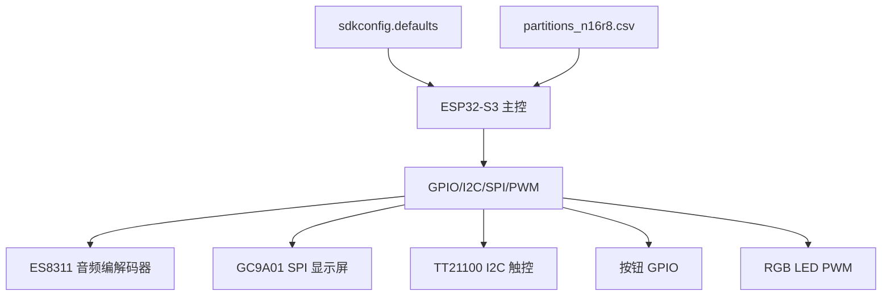
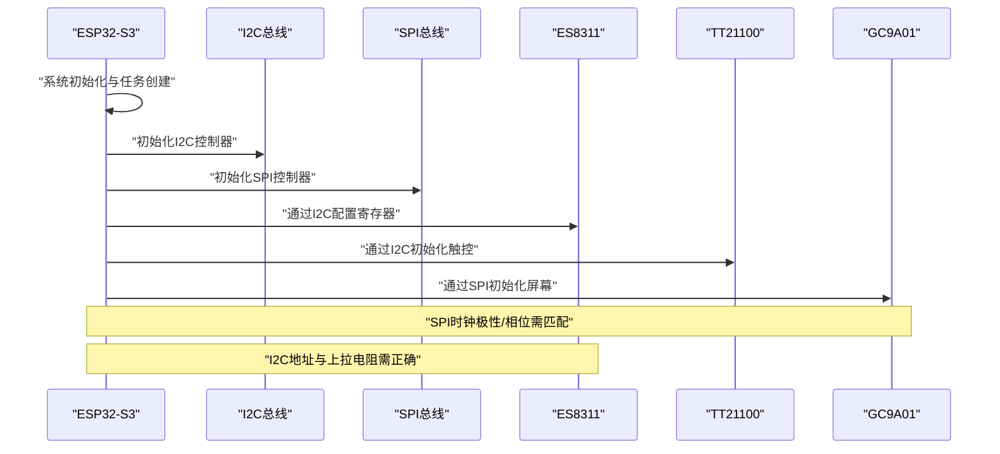
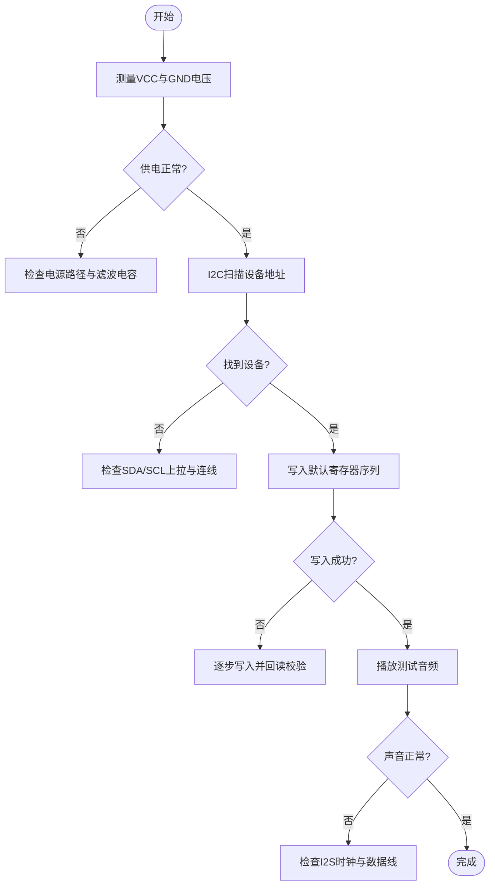
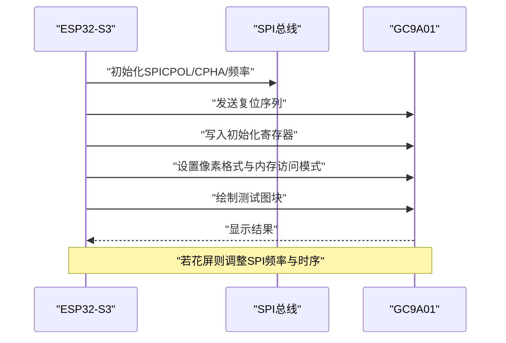
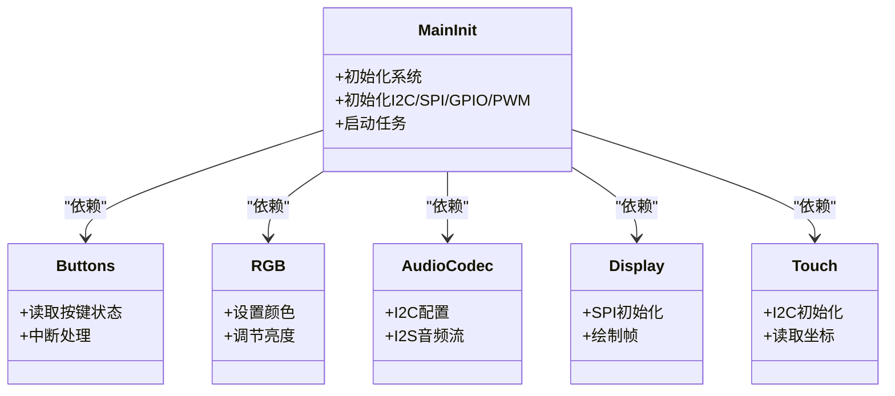

# 硬件故障排除

<cite>
**本文引用的文件**   
- [README.md](file://README.md)
- [Firmware/esp32_ai_mirror/main/ai_mirror_main.c](file://Firmware/esp32_ai_mirror/main/ai_mirror_main.c)
- [Firmware/esp32_ai_mirror/main/board_buttons.c](file://Firmware/esp32_ai_mirror/main/board_buttons.c)
- [Firmware/esp32_ai_mirror/main/board_buttons.h](file://Firmware/esp32_ai_mirror/main/board_buttons.h)
- [Firmware/esp32_ai_mirror/main/board_rgb.c](file://Firmware/esp32_ai_mirror/main/board_rgb.c)
- [Firmware/esp32_ai_mirror/main/board_rgb.h](file://Firmware/esp32_ai_mirror/main/board_rgb.h)
- [Firmware/esp32_ai_mirror/components/espressif__es8311/es8311.c](file://Firmware/esp32_ai_mirror/components/espressif__es8311/es8311.c)
- [Firmware/esp32_ai_mirror/components/espressif__es8311/include/es8311.h](file://Firmware/esp32_ai_mirror/components/espressif__es8311/include/es8311.h)
- [Firmware/esp32_ai_mirror/components/espressif__esp_codec_dev/esp_codec_dev.c](file://Firmware/esp32_ai_mirror/components/espressif__esp_codec_dev/esp_codec_dev.c)
- [Firmware/esp32_ai_mirror/components/espressif__esp_codec_dev/platform/audio_codec_ctrl_i2c.c](file://Firmware/esp32_ai_mirror/components/espressif__esp_codec_dev/platform/audio_codec_ctrl_i2c.c)
- [Firmware/esp32_ai_mirror/components/espressif__esp_lcd_gc9a01/esp_lcd_gc9a01.c](file://Firmware/esp32_ai_mirror/components/espressif__esp_lcd_gc9a01/esp_lcd_gc9a01.c)
- [Firmware/esp32_ai_mirror/components/espressif__esp_lcd_touch_tt21100/esp_lcd_touch_tt21100.c](file://Firmware/esp32_ai_mirror/components/espressif__esp_lcd_touch_tt21100/esp_lcd_touch_tt21100.c)
- [Firmware/esp32_ai_mirror/sdkconfig.defaults](file://Firmware/esp32_ai_mirror/sdkconfig.defaults)
- [Firmware/esp32_ai_mirror/partitions_n16r8.csv](file://Firmware/esp32_ai_mirror/partitions_n16r8.csv)
</cite>

## 目录
1. [简介](#简介)
2. [项目结构](#项目结构)
3. [核心组件](#核心组件)
4. [架构总览](#架构总览)
5. [详细组件分析](#详细组件分析)
6. [依赖关系分析](#依赖关系分析)
7. [性能与稳定性考量](#性能与稳定性考量)
8. [故障排除指南](#故障排除指南)
9. [结论](#结论)
10. [附录](#附录)

## 简介
本指南面向AI镜子项目的硬件故障排查，聚焦ESP32-S3开发板、显示屏（SPI）、音频编解码器（I2C）、按钮与RGB指示灯等关键硬件。内容涵盖电源问题检测、I2C通信故障、SPI显示异常、音频设备连接异常的诊断步骤，以及万用表、示波器等工具的使用方法与替换部件确认流程。同时提供常见兼容性问题的定位与解决方案，帮助快速恢复系统稳定运行。

## 项目结构
本项目基于ESP-IDF构建，主程序位于main目录，外设驱动通过components引入：
- 主控与系统初始化：ai_mirror_main.c
- 板级输入与指示：board_buttons.c/h、board_rgb.c/h
- 音频编解码：es8311驱动与esp_codec_dev框架
- 显示与触控：gc9a01屏驱动与tt21100触控驱动
- 配置与分区：sdkconfig.defaults、partitions_n16r8.csv

图表来源 
- [Firmware/esp32_ai_mirror/main/ai_mirror_main.c](file://Firmware/esp32_ai_mirror/main/ai_mirror_main.c)
- [Firmware/esp32_ai_mirror/components/espressif__es8311/es8311.c](file://Firmware/esp32_ai_mirror/components/espressif__es8311/es8311.c)
- [Firmware/esp32_ai_mirror/components/espressif__esp_lcd_gc9a01/esp_lcd_gc9a01.c](file://Firmware/esp32_ai_mirror/components/espressif__esp_lcd_gc9a01/esp_lcd_gc9a01.c)
- [Firmware/esp32_ai_mirror/components/espressif__esp_lcd_touch_tt21100/esp_lcd_touch_tt21100.c](file://Firmware/esp32_ai_mirror/components/espressif__esp_lcd_touch_tt21100/esp_lcd_touch_tt21100.c)
- [Firmware/esp32_ai_mirror/sdkconfig.defaults](file://Firmware/esp32_ai_mirror/sdkconfig.defaults)
- [Firmware/esp32_ai_mirror/partitions_n16r8.csv](file://Firmware/esp32_ai_mirror/partitions_n16r8.csv)

章节来源
- [README.md](file://README.md)
- [Firmware/esp32_ai_mirror/main/ai_mirror_main.c](file://Firmware/esp32_ai_mirror/main/ai_mirror_main.c)
- [Firmware/esp32_ai_mirror/sdkconfig.defaults](file://Firmware/esp32_ai_mirror/sdkconfig.defaults)
- [Firmware/esp32_ai_mirror/partitions_n16r8.csv](file://Firmware/esp32_ai_mirror/partitions_n16r8.csv)

## 核心组件
- ESP32-S3主控：负责系统启动、外设初始化、任务调度与业务逻辑。
- ES8311音频编解码器：通过I2C进行寄存器配置，I2S传输音频数据。
- GC9A01显示屏：通过SPI接口与MCU通信，用于图像渲染与UI展示。
- TT21100触控：通过I2C与MCU通信，提供触摸事件。
- 按钮与RGB指示灯：按钮通过GPIO中断或轮询读取；RGB通过PWM控制颜色与亮度。

章节来源
- [Firmware/esp32_ai_mirror/main/board_buttons.c](file://Firmware/esp32_ai_mirror/main/board_buttons.c)
- [Firmware/esp32_ai_mirror/main/board_buttons.h](file://Firmware/esp32_ai_mirror/main/board_buttons.h)
- [Firmware/esp32_ai_mirror/main/board_rgb.c](file://Firmware/esp32_ai_mirror/main/board_rgb.c)
- [Firmware/esp32_ai_mirror/main/board_rgb.h](file://Firmware/esp32_ai_mirror/main/board_rgb.h)
- [Firmware/esp32_ai_mirror/components/espressif__es8311/es8311.c](file://Firmware/esp32_ai_mirror/components/espressif__es8311/es8311.c)
- [Firmware/esp32_ai_mirror/components/espressif__esp_lcd_gc9a01/esp_lcd_gc9a01.c](file://Firmware/esp32_ai_mirror/components/espressif__esp_lcd_gc9a01/esp_lcd_gc9a01.c)
- [Firmware/esp32_ai_mirror/components/espressif__esp_lcd_touch_tt21100/esp_lcd_touch_tt21100.c](file://Firmware/esp32_ai_mirror/components/espressif__esp_lcd_touch_tt21100/esp_lcd_touch_tt21100.c)

## 架构总览
系统启动后，ESP32-S3加载配置并初始化各外设：I2C总线用于ES8311与TT21100，SPI总线用于GC9A01，GPIO用于按钮与LED，PWM用于RGB控制。音频数据通过I2S在MCU与ES8311之间传输。

图表来源 
- [Firmware/esp32_ai_mirror/main/ai_mirror_main.c](file://Firmware/esp32_ai_mirror/main/ai_mirror_main.c)
- [Firmware/esp32_ai_mirror/components/espressif__es8311/es8311.c](file://Firmware/esp32_ai_mirror/components/espressif__es8311/es8311.c)
- [Firmware/esp32_ai_mirror/components/espressif__esp_lcd_gc9a01/esp_lcd_gc9a01.c](file://Firmware/esp32_ai_mirror/components/espressif__esp_lcd_gc9a01/esp_lcd_gc9a01.c)
- [Firmware/esp32_ai_mirror/components/espressif__esp_lcd_touch_tt21100/esp_lcd_touch_tt21100.c](file://Firmware/esp32_ai_mirror/components/espressif__esp_lcd_touch_tt21100/esp_lcd_touch_tt21100.c)

## 详细组件分析

### 音频编解码器（ES8311）
- 通信方式：I2C用于寄存器读写，I2S用于音频流。
- 常见问题：I2C无响应、寄存器写入失败、音频无声或杂音。
- 诊断要点：检查I2C地址、上拉电阻、时钟配置与I2S参数；验证供电与复位引脚状态。

图表来源 
- [Firmware/esp32_ai_mirror/components/espressif__es8311/es8311.c](file://Firmware/esp32_ai_mirror/components/espressif__es8311/es8311.c)
- [Firmware/esp32_ai_mirror/components/espressif__esp_codec_dev/esp_codec_dev.c](file://Firmware/esp32_ai_mirror/components/espressif__esp_codec_dev/esp_codec_dev.c)
- [Firmware/esp32_ai_mirror/components/espressif__esp_codec_dev/platform/audio_codec_ctrl_i2c.c](file://Firmware/esp32_ai_mirror/components/espressif__esp_codec_dev/platform/audio_codec_ctrl_i2c.c)

章节来源
- [Firmware/esp32_ai_mirror/components/espressif__es8311/es8311.c](file://Firmware/esp32_ai_mirror/components/espressif__es8311/es8311.c)
- [Firmware/esp32_ai_mirror/components/espressif__es8311/include/es8311.h](file://Firmware/esp32_ai_mirror/components/espressif__es8311/include/es8311.h)
- [Firmware/esp32_ai_mirror/components/espressif__esp_codec_dev/esp_codec_dev.c](file://Firmware/esp32_ai_mirror/components/espressif__esp_codec_dev/esp_codec_dev.c)
- [Firmware/esp32_ai_mirror/components/espressif__esp_codec_dev/platform/audio_codec_ctrl_i2c.c](file://Firmware/esp32_ai_mirror/components/espressif__esp_codec_dev/platform/audio_codec_ctrl_i2c.c)

### 显示屏（GC9A01）
- 通信方式：SPI接口，需配置时钟极性、相位、片选与复位引脚。
- 常见问题：黑屏、花屏、刷新异常、触控不联动。
- 诊断要点：检查SPI时序与电平匹配、复位时序、背光供电；必要时降低SPI频率验证。

图表来源 
- [Firmware/esp32_ai_mirror/components/espressif__esp_lcd_gc9a01/esp_lcd_gc9a01.c](file://Firmware/esp32_ai_mirror/components/espressif__esp_lcd_gc9a01/esp_lcd_gc9a01.c)

章节来源
- [Firmware/esp32_ai_mirror/components/espressif__esp_lcd_gc9a01/esp_lcd_gc9a01.c](file://Firmware/esp32_ai_mirror/components/espressif__esp_lcd_gc9a01/esp_lcd_gc9a01.c)

### 触控（TT21100）
- 通信方式：I2C，需提供中断引脚以获取触摸事件。
- 常见问题：无触摸响应、坐标漂移、中断丢失。
- 诊断要点：检查I2C地址与上拉、中断引脚配置与消抖、固件初始化序列。

章节来源
- [Firmware/esp32_ai_mirror/components/espressif__esp_lcd_touch_tt21100/esp_lcd_touch_tt21100.c](file://Firmware/esp32_ai_mirror/components/espressif__esp_lcd_touch_tt21100/esp_lcd_touch_tt21100.c)

### 按钮与RGB指示灯
- 按钮：GPIO输入，支持中断或轮询；注意去抖与上拉/下拉配置。
- RGB：PWM输出控制三色通道；注意占空比范围与共享定时器资源。

章节来源
- [Firmware/esp32_ai_mirror/main/board_buttons.c](file://Firmware/esp32_ai_mirror/main/board_buttons.c)
- [Firmware/esp32_ai_mirror/main/board_buttons.h](file://Firmware/esp32_ai_mirror/main/board_buttons.h)
- [Firmware/esp32_ai_mirror/main/board_rgb.c](file://Firmware/esp32_ai_mirror/main/board_rgb.c)
- [Firmware/esp32_ai_mirror/main/board_rgb.h](file://Firmware/esp32_ai_mirror/main/board_rgb.h)

## 依赖关系分析
- 软件层依赖：
  - ai_mirror_main.c负责整体初始化与各模块调用。
  - board_buttons与board_rgb为板级抽象，屏蔽具体GPIO/PWM细节。
  - es8311与esp_codec_dev组合实现音频能力。
  - gc9a01与tt21100分别处理显示与触控。
- 配置依赖：
  - sdkconfig.defaults决定编译选项与外设启用。
  - partitions_n16r8.csv定义Flash分区布局。

图表来源 
- [Firmware/esp32_ai_mirror/main/ai_mirror_main.c](file://Firmware/esp32_ai_mirror/main/ai_mirror_main.c)
- [Firmware/esp32_ai_mirror/main/board_buttons.c](file://Firmware/esp32_ai_mirror/main/board_buttons.c)
- [Firmware/esp32_ai_mirror/main/board_rgb.c](file://Firmware/esp32_ai_mirror/main/board_rgb.c)
- [Firmware/esp32_ai_mirror/components/espressif__es8311/es8311.c](file://Firmware/esp32_ai_mirror/components/espressif__es8311/es8311.c)
- [Firmware/esp32_ai_mirror/components/espressif__esp_lcd_gc9a01/esp_lcd_gc9a01.c](file://Firmware/esp32_ai_mirror/components/espressif__esp_lcd_gc9a01/esp_lcd_gc9a01.c)
- [Firmware/esp32_ai_mirror/components/espressif__esp_lcd_touch_tt21100/esp_lcd_touch_tt21100.c](file://Firmware/esp32_ai_mirror/components/espressif__esp_lcd_touch_tt21100/esp_lcd_touch_tt21100.c)

章节来源
- [Firmware/esp32_ai_mirror/main/ai_mirror_main.c](file://Firmware/esp32_ai_mirror/main/ai_mirror_main.c)
- [Firmware/esp32_ai_mirror/sdkconfig.defaults](file://Firmware/esp32_ai_mirror/sdkconfig.defaults)
- [Firmware/esp32_ai_mirror/partitions_n16r8.csv](file://Firmware/esp32_ai_mirror/partitions_n16r8.csv)

## 性能与稳定性考量
- I2C总线：建议合理设置上拉电阻（通常4.7kΩ），避免多设备冲突；在高噪声环境增加滤波电容。
- SPI显示：根据屏幕规格选择合适频率，初期可降频验证；确保复位与片选时序满足器件要求。
- 音频I2S：时钟源与采样率需与ES8311一致；避免与其他高频信号共用走线造成串扰。
- 电源管理：为模拟音频部分与数字逻辑分别提供干净电源，必要时使用LDO与磁珠隔离。

[本节为通用指导，无需特定文件引用]

## 故障排除指南

### 电源问题检测
- 使用万用表测量各供电轨电压（如3.3V、1.8V、AVDD等），对比器件手册典型值。
- 检查去耦电容是否缺失或失效，重点观察大电流切换时的电压跌落。
- 若系统频繁重启，优先排查电源纹波与地回路干扰。

章节来源
- [Firmware/esp32_ai_mirror/components/espressif__es8311/es8311.c](file://Firmware/esp32_ai_mirror/components/espressif__es8311/es8311.c)
- [Firmware/esp32_ai_mirror/components/espressif__esp_lcd_gc9a01/esp_lcd_gc9a01.c](file://Firmware/esp32_ai_mirror/components/espressif__esp_lcd_gc9a01/esp_lcd_gc9a01.c)

### I2C通信故障（ES8311与TT21100）
- 现象：设备扫描不到、寄存器读写失败、触控无响应。
- 步骤：
  1) 检查SDA/SCL上拉电阻与连线质量。
  2) 使用I2C扫描工具确认设备地址。
  3) 逐步写入寄存器并回读校验，定位失败点。
  4) 检查中断引脚与唤醒配置（触控）。
- 工具：逻辑分析仪抓取I2C波形，确认起始/停止条件与ACK/NACK。

章节来源
- [Firmware/esp32_ai_mirror/components/espressif__esp_codec_dev/platform/audio_codec_ctrl_i2c.c](file://Firmware/esp32_ai_mirror/components/espressif__esp_codec_dev/platform/audio_codec_ctrl_i2c.c)
- [Firmware/esp32_ai_mirror/components/espressif__esp_lcd_touch_tt21100/esp_lcd_touch_tt21100.c](file://Firmware/esp32_ai_mirror/components/espressif__esp_lcd_touch_tt21100/esp_lcd_touch_tt21100.c)

### SPI显示问题（GC9A01）
- 现象：黑屏、花屏、刷新卡顿。
- 步骤：
  1) 检查SPI时钟极性与相位配置是否与屏幕一致。
  2) 降低SPI频率验证是否为时序问题。
  3) 验证复位引脚时序与片选信号完整性。
  4) 检查背光供电与使能引脚。
- 工具：示波器观测MOSI/MISO/SCK/CS波形，确认边沿与电平。

章节来源
- [Firmware/esp32_ai_mirror/components/espressif__esp_lcd_gc9a01/esp_lcd_gc9a01.c](file://Firmware/esp32_ai_mirror/components/espressif__esp_lcd_gc9a01/esp_lcd_gc9a01.c)

### 音频设备连接异常（ES8311）
- 现象：无声、爆音、录音失真。
- 步骤：
  1) 确认I2C配置成功（寄存器回读一致）。
  2) 检查I2S时钟与数据线连接，确保采样率与位宽匹配。
  3) 播放标准测试音频，逐步调整音量与增益。
  4) 使用示波器观察I2S波形，确认数据有效。
- 工具：音频信号发生器与示波器联合验证链路。

章节来源
- [Firmware/esp32_ai_mirror/components/espressif__es8311/es8311.c](file://Firmware/esp32_ai_mirror/components/espressif__es8311/es8311.c)
- [Firmware/esp32_ai_mirror/components/espressif__esp_codec_dev/esp_codec_dev.c](file://Firmware/esp32_ai_mirror/components/espressif__esp_codec_dev/esp_codec_dev.c)

### 按钮与RGB指示灯
- 按钮无响应：检查GPIO方向、上拉/下拉、中断触发条件与去抖。
- RGB不亮或颜色异常：检查PWM通道分配、占空比范围与共享定时器资源冲突。
- 工具：万用表测量GPIO电平变化，逻辑分析仪捕获中断脉冲。

章节来源
- [Firmware/esp32_ai_mirror/main/board_buttons.c](file://Firmware/esp32_ai_mirror/main/board_buttons.c)
- [Firmware/esp32_ai_mirror/main/board_rgb.c](file://Firmware/esp32_ai_mirror/main/board_rgb.c)

### 硬件测试工具使用方法
- 万用表：
  - 测量供电轨电压与对地阻抗，判断短路或开路。
  - 检查GPIO高低电平与按键通断。
- 示波器：
  - 观测SPI时钟与数据边沿，确认时序与电平匹配。
  - 抓取I2C起始/停止与ACK/NACK，定位通信失败点。
  - 观察I2S时钟与数据，验证音频链路完整性。
- 逻辑分析仪：
  - 多通道同步抓取总线波形，便于对比时序关系。
  - 解码I2C/SPI协议，快速定位错误帧。

[本节为通用指导，无需特定文件引用]

### 替换部件确认流程
- 替换前准备：
  - 记录原器件型号、封装与引脚定义。
  - 备份当前配置与分区表。
- 替换步骤：
  1) 断电后更换器件，确保焊接质量与方向正确。
  2) 重新上电，执行最小化初始化（仅点亮LED或打印日志）。
  3) 逐项启用外设（先I2C再SPI，最后I2S），观察行为。
  4) 若异常，回退到上一稳定版本并逐步定位。
- 验证方法：
  - 使用标准测试用例覆盖关键功能（显示、触控、音频、输入）。
  - 长时间老化测试，监控温度与功耗。

[本节为通用指导，无需特定文件引用]

### 硬件兼容性问题与解决方案
- I2C地址冲突：确保ES8311与TT21100地址不同，必要时修改跳线或软件地址。
- SPI电平不匹配：检查MCU与屏幕的IO电平（3.3V/1.8V），必要时添加电平转换。
- 音频时钟源不一致：统一I2S主从模式与采样率，避免时钟抖动。
- 电源噪声影响：为模拟音频与数字逻辑分别供电，增加滤波与隔离。

[本节为通用指导，无需特定文件引用]

## 结论
通过系统化排查电源、I2C、SPI与I2S链路，结合万用表与示波器等工具，可有效定位ESP32-S3、ES8311、GC9A01、TT21100、按钮与RGB等硬件问题。遵循替换部件流程与兼容性注意事项，可快速恢复系统稳定运行并提升调试效率。

[本节为总结性内容，无需特定文件引用]

## 附录
- 常用命令与参考：
  - I2C扫描：使用ESP-IDF提供的i2c_scanner示例。
  - SPI测试：使用lcd_test或spi_master示例验证时序。
  - 音频测试：使用audio_playback/recording示例验证I2S链路。
- 文档参考：
  - ESP32-S3技术参考手册
  - ES8311数据手册
  - GC9A01数据手册
  - TT21100数据手册

[本节为补充信息，无需特定文件引用]