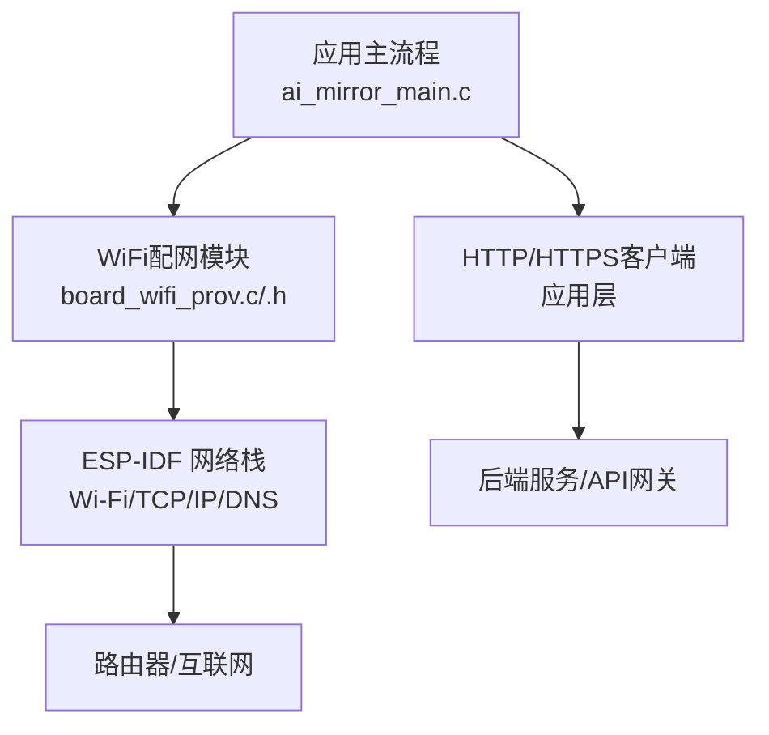
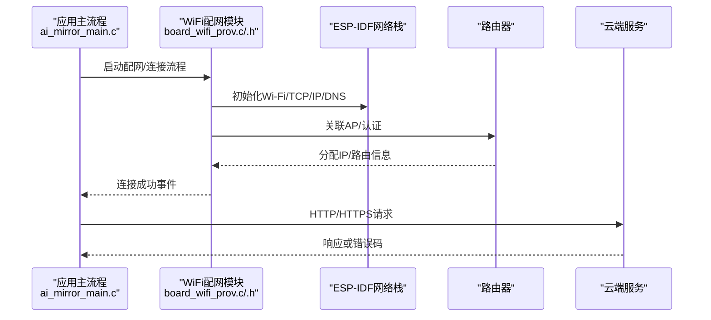
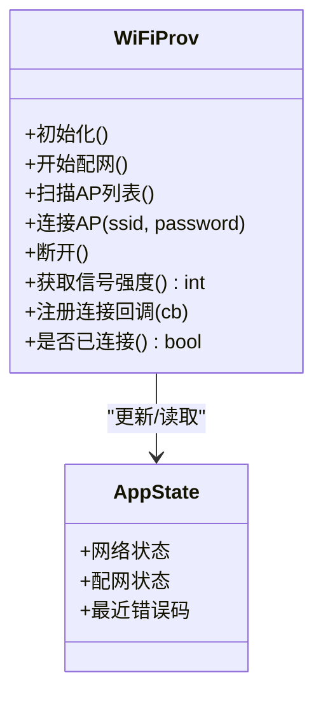
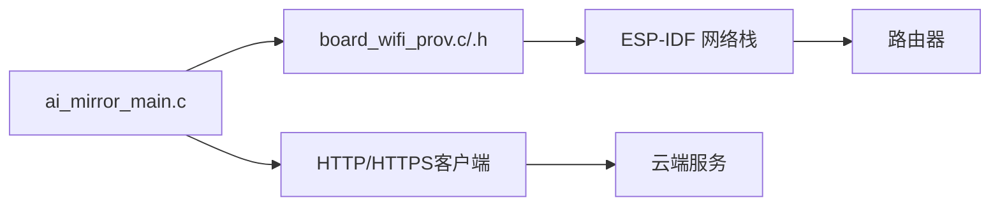

# 网络故障排除

<cite>
**本文引用的文件**   
- [Firmware/esp32_ai_mirror/main/board_wifi_prov.c](file://Firmware/esp32_ai_mirror/main/board_wifi_prov.c)
- [Firmware/esp32_ai_mirror/main/board_wifi_prov.h](file://Firmware/esp32_ai_mirror/main/board_wifi_prov.h)
- [Firmware/esp32_ai_mirror/main/ai_mirror_main.c](file://Firmware/esp32_ai_mirror/main/ai_mirror_main.c)
- [Firmware/esp32_ai_mirror/WiFi配网功能计划书.md](file://Firmware/esp32_ai_mirror/WiFi配网功能计划书.md)
</cite>

## 目录
1. [简介](#简介)
2. [项目结构](#项目结构)
3. [核心组件](#核心组件)
4. [架构总览](#架构总览)
5. [详细组件分析](#详细组件分析)
6. [依赖关系分析](#依赖关系分析)
7. [性能考虑](#性能考虑)
8. [故障排除指南](#故障排除指南)
9. [结论](#结论)
10. [附录](#附录)

## 简介
本指南面向AI镜子项目的网络问题诊断与修复，覆盖WiFi连接、配网失败、网络连接超时等常见场景。内容包含信号强度检测、路由器配置检查、DNS解析排查、HTTP请求失败与API调用错误定位、数据同步异常处理，以及网络安全与防火墙相关问题的排查建议。读者可据此快速定位并解决设备联网与应用层通信问题。

## 项目结构
本项目基于ESP-IDF构建，网络与配网能力集中在main模块的WiFi配网实现中，应用主流程在ai_mirror_main.c中启动并协调各子系统。关键文件如下：
- board_wifi_prov.c/.h：WiFi配网逻辑与状态管理
- ai_mirror_main.c：系统初始化、任务调度与网络事件协调
- WiFi配网功能计划书.md：配网流程设计与交互约定

图表来源
- [Firmware/esp32_ai_mirror/main/ai_mirror_main.c](file://Firmware/esp32_ai_mirror/main/ai_mirror_main.c)
- [Firmware/esp32_ai_mirror/main/board_wifi_prov.c](file://Firmware/esp32_ai_mirror/main/board_wifi_prov.c)
- [Firmware/esp32_ai_mirror/main/board_wifi_prov.h](file://Firmware/esp32_ai_mirror/main/board_wifi_prov.h)

章节来源
- [Firmware/esp32_ai_mirror/main/ai_mirror_main.c](file://Firmware/esp32_ai_mirror/main/ai_mirror_main.c)
- [Firmware/esp32_ai_mirror/main/board_wifi_prov.c](file://Firmware/esp32_ai_mirror/main/board_wifi_prov.c)
- [Firmware/esp32_ai_mirror/main/board_wifi_prov.h](file://Firmware/esp32_ai_mirror/main/board_wifi_prov.h)
- [Firmware/esp32_ai_mirror/WiFi配网功能计划书.md](file://Firmware/esp32_ai_mirror/WiFi配网功能计划书.md)

## 核心组件
- WiFi配网模块（board_wifi_prov.c/.h）
  - 负责扫描、连接、重连、配网入口与状态上报
  - 提供信号强度查询接口与连接事件回调
- 应用主流程（ai_mirror_main.c）
  - 初始化网络栈、启动配网任务、协调HTTP/HTTPS请求与数据同步
- 外部依赖
  - ESP-IDF Wi-Fi/TCP/IP/DNS栈
  - 路由器与云端服务

章节来源
- [Firmware/esp32_ai_mirror/main/board_wifi_prov.c](file://Firmware/esp32_ai_mirror/main/board_wifi_prov.c)
- [Firmware/esp32_ai_mirror/main/board_wifi_prov.h](file://Firmware/esp32_ai_mirror/main/board_wifi_prov.h)
- [Firmware/esp32_ai_mirror/main/ai_mirror_main.c](file://Firmware/esp32_ai_mirror/main/ai_mirror_main.c)

## 架构总览
下图展示了从设备到云端的典型数据流与关键节点，便于理解网络问题发生的位置与影响范围。

图表来源
- [Firmware/esp32_ai_mirror/main/ai_mirror_main.c](file://Firmware/esp32_ai_mirror/main/ai_mirror_main.c)
- [Firmware/esp32_ai_mirror/main/board_wifi_prov.c](file://Firmware/esp32_ai_mirror/main/board_wifi_prov.c)
- [Firmware/esp32_ai_mirror/main/board_wifi_prov.h](file://Firmware/esp32_ai_mirror/main/board_wifi_prov.h)

## 详细组件分析

### WiFi配网模块（board_wifi_prov.c/.h）
- 职责
  - 提供配网入口、AP扫描与连接、断线重连、信号强度获取
  - 向上层暴露连接状态与事件回调
- 关键点
  - 连接生命周期：初始化→扫描→连接→获取IP→就绪
  - 错误分类：认证失败、DHCP失败、DNS不可用、TLS握手失败等
  - 重试策略：指数退避、最大重试次数、弱信号阈值判断

图表来源
- [Firmware/esp32_ai_mirror/main/board_wifi_prov.c](file://Firmware/esp32_ai_mirror/main/board_wifi_prov.c)
- [Firmware/esp32_ai_mirror/main/board_wifi_prov.h](file://Firmware/esp32_ai_mirror/main/board_wifi_prov.h)

章节来源
- [Firmware/esp32_ai_mirror/main/board_wifi_prov.c](file://Firmware/esp32_ai_mirror/main/board_wifi_prov.c)
- [Firmware/esp32_ai_mirror/main/board_wifi_prov.h](file://Firmware/esp32_ai_mirror/main/board_wifi_prov.h)

### 应用主流程（ai_mirror_main.c）
- 职责
  - 初始化系统资源、启动配网任务、协调HTTP/HTTPS请求与数据同步
  - 监听网络事件，触发重连与业务恢复
- 关键点
  - 任务间通信：网络就绪事件→业务任务唤醒
  - 超时与重试：请求超时、连接超时、DNS解析超时的统一处理
  - 日志与诊断：记录关键阶段耗时与错误码

章节来源
- [Firmware/esp32_ai_mirror/main/ai_mirror_main.c](file://Firmware/esp32_ai_mirror/main/ai_mirror_main.c)

### 配网流程设计（WiFi配网功能计划书.md）
- 目标
  - 明确配网交互时序、错误码定义、用户提示策略
- 要点
  - 支持多种配网方式（如扫码/热点配网）
  - 失败分支与回退策略
  - 与上层UI的状态同步

章节来源
- [Firmware/esp32_ai_mirror/WiFi配网功能计划书.md](file://Firmware/esp32_ai_mirror/WiFi配网功能计划书.md)

## 依赖关系分析
- 模块耦合
  - ai_mirror_main.c依赖board_wifi_prov.c提供的连接状态与事件
  - board_wifi_prov.c依赖ESP-IDF网络栈（Wi-Fi、TCP/IP、DNS、TLS）
- 外部集成点
  - 路由器（AP认证、DHCP、NAT、防火墙规则）
  - 云端服务（域名解析、端口可达性、证书校验）

图表来源
- [Firmware/esp32_ai_mirror/main/ai_mirror_main.c](file://Firmware/esp32_ai_mirror/main/ai_mirror_main.c)
- [Firmware/esp32_ai_mirror/main/board_wifi_prov.c](file://Firmware/esp32_ai_mirror/main/board_wifi_prov.c)
- [Firmware/esp32_ai_mirror/main/board_wifi_prov.h](file://Firmware/esp32_ai_mirror/main/board_wifi_prov.h)

## 性能考虑
- 连接与重连
  - 合理设置扫描间隔与重连退避，避免频繁扫描导致功耗上升
  - 弱信号阈值下主动降级或提示用户靠近路由器
- DNS与HTTP
  - 启用DNS缓存，减少解析延迟
  - 设置合理的请求超时与重试上限，避免阻塞任务
- 内存与CPU
  - 控制并发请求数量，避免内存抖动
  - 将网络I/O放入独立任务，降低主循环压力

## 故障排除指南

### 一、WiFi连接问题
- 现象
  - 无法扫描到AP、连接失败、频繁断线、信号弱
- 排查步骤
  - 确认路由器SSID与密码正确，未开启MAC白名单限制
  - 检查信道与频段（2.4G/5G），确保设备支持当前频段
  - 使用板载工具或串口输出查看信号强度（RSSI）与连接状态
  - 尝试重启路由器与设备，观察是否恢复
- 解决方法
  - 调整路由器发射功率与信道，避免同频干扰
  - 关闭“无线隔离”“访客网络”等限制功能
  - 若信号弱，缩短设备与路由器距离或增加中继/AP

章节来源
- [Firmware/esp32_ai_mirror/main/board_wifi_prov.c](file://Firmware/esp32_ai_mirror/main/board_wifi_prov.c)
- [Firmware/esp32_ai_mirror/main/board_wifi_prov.h](file://Firmware/esp32_ai_mirror/main/board_wifi_prov.h)

### 二、配网失败
- 现象
  - 配网入口无响应、二维码无效、热点配网超时
- 排查步骤
  - 确认手机与设备在同一局域网或热点可用
  - 检查配网服务器可达性与域名解析是否正常
  - 查看配网日志中的错误码（如认证失败、DHCP失败、DNS解析失败）
- 解决方法
  - 重置设备后重新配网
  - 更换配网方式（如从热点配网切换为扫码配网）
  - 检查路由器是否拦截了配网端口或限制了UDP广播

章节来源
- [Firmware/esp32_ai_mirror/WiFi配网功能计划书.md](file://Firmware/esp32_ai_mirror/WiFi配网功能计划书.md)
- [Firmware/esp32_ai_mirror/main/board_wifi_prov.c](file://Firmware/esp32_ai_mirror/main/board_wifi_prov.c)

### 三、网络连接超时
- 现象
  - TCP连接超时、HTTP请求超时、DNS解析超时
- 排查步骤
  - ping测试路由器与云端域名，验证基础连通性
  - 检查DNS解析结果是否正确（nslookup/dig）
  - 使用端口扫描工具确认目标端口开放
- 解决方法
  - 调整路由器防火墙规则，放行必要端口
  - 更换DNS服务器（如公共DNS）
  - 优化应用层超时与重试策略

章节来源
- [Firmware/esp32_ai_mirror/main/ai_mirror_main.c](file://Firmware/esp32_ai_mirror/main/ai_mirror_main.c)

### 四、DNS解析问题
- 现象
  - 域名无法解析、解析结果错误或间歇性失败
- 排查步骤
  - 在设备上执行DNS解析测试，对比不同DNS服务器结果
  - 检查路由器是否启用了DNS劫持或过滤
- 解决方法
  - 配置可靠的DNS服务器
  - 禁用路由器可疑的DNS转发或劫持功能

章节来源
- [Firmware/esp32_ai_mirror/main/ai_mirror_main.c](file://Firmware/esp32_ai_mirror/main/ai_mirror_main.c)

### 五、HTTP请求失败与API调用错误
- 现象
  - 4xx/5xx错误、SSL握手失败、响应体为空
- 排查步骤
  - 抓包分析TLS握手与HTTP报文
  - 检查服务端证书链与时间同步
  - 核对请求头、签名与参数格式
- 解决方法
  - 更新根证书或信任链
  - 修正请求参数与鉴权信息
  - 与服务端联调，确认接口版本兼容

章节来源
- [Firmware/esp32_ai_mirror/main/ai_mirror_main.c](file://Firmware/esp32_ai_mirror/main/ai_mirror_main.c)

### 六、数据同步问题
- 现象
  - 数据上传失败、增量同步不一致、冲突未解决
- 排查步骤
  - 检查本地队列与网络状态，确认是否有丢包或中断
  - 比对服务端返回的ETag/版本号
- 解决方法
  - 引入幂等键与冲突合并策略
  - 增强断点续传与重试机制

章节来源
- [Firmware/esp32_ai_mirror/main/ai_mirror_main.c](file://Firmware/esp32_ai_mirror/main/ai_mirror_main.c)

### 七、网络安全与防火墙设置
- 现象
  - 端口被拦截、TLS握手失败、访问受限
- 排查步骤
  - 检查路由器与企业级防火墙规则
  - 确认出口策略放行所需协议与端口
- 解决方法
  - 添加必要的入站/出站规则
  - 关闭不必要的端口映射与UPnP风险

章节来源
- [Firmware/esp32_ai_mirror/main/board_wifi_prov.c](file://Firmware/esp32_ai_mirror/main/board_wifi_prov.c)

### 八、网络调试工具使用方法
- ping测试
  - 目的：验证基础连通性与延迟
  - 用法：对路由器与云端域名分别ping，观察丢包与RTT
- 端口扫描
  - 目的：确认目标端口开放情况
  - 用法：使用nmap或telnet探测常用端口（如80/443）
- 网络抓包分析
  - 目的：定位握手失败、报文丢失、协议错误
  - 用法：在路由器或中间设备上抓包，过滤TCP/HTTP/TLS关键字段

章节来源
- [Firmware/esp32_ai_mirror/main/ai_mirror_main.c](file://Firmware/esp32_ai_mirror/main/ai_mirror_main.c)

### 九、常见问题速查表
- 无法扫描AP
  - 检查频段与信道、路由器隐藏SSID、设备驱动初始化
- 连接成功但无网络
  - 检查DHCP、DNS、路由器NAT与防火墙
- TLS握手失败
  - 检查证书链、系统时间、加密套件兼容性
- 间歇性断线
  - 检查信号强度、路由器负载、信道干扰

章节来源
- [Firmware/esp32_ai_mirror/main/board_wifi_prov.c](file://Firmware/esp32_ai_mirror/main/board_wifi_prov.c)
- [Firmware/esp32_ai_mirror/main/board_wifi_prov.h](file://Firmware/esp32_ai_mirror/main/board_wifi_prov.h)

## 结论
通过分层排查（物理链路→AP连接→IP/DNS→HTTP/TLS→应用逻辑），结合信号强度检测、路由器配置检查与抓包分析，可高效定位并解决AI镜子的网络问题。建议在设备侧完善日志与诊断接口，提升现场排障效率。

## 附录
- 建议的日志字段
  - 连接阶段、错误码、RSSI、DNS解析耗时、HTTP状态码、TLS错误码
- 建议的重试策略
  - 指数退避、最大重试次数、弱信号阈值触发重连