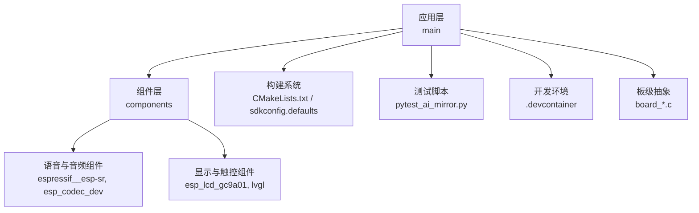
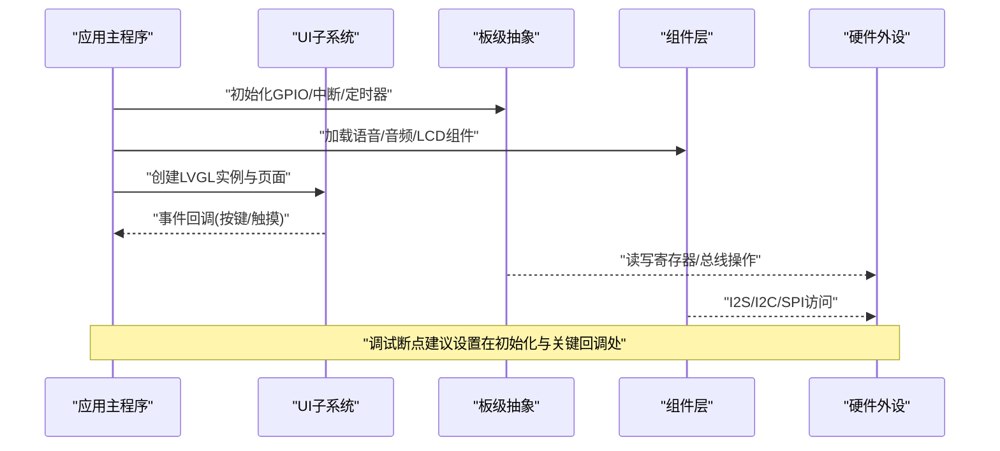
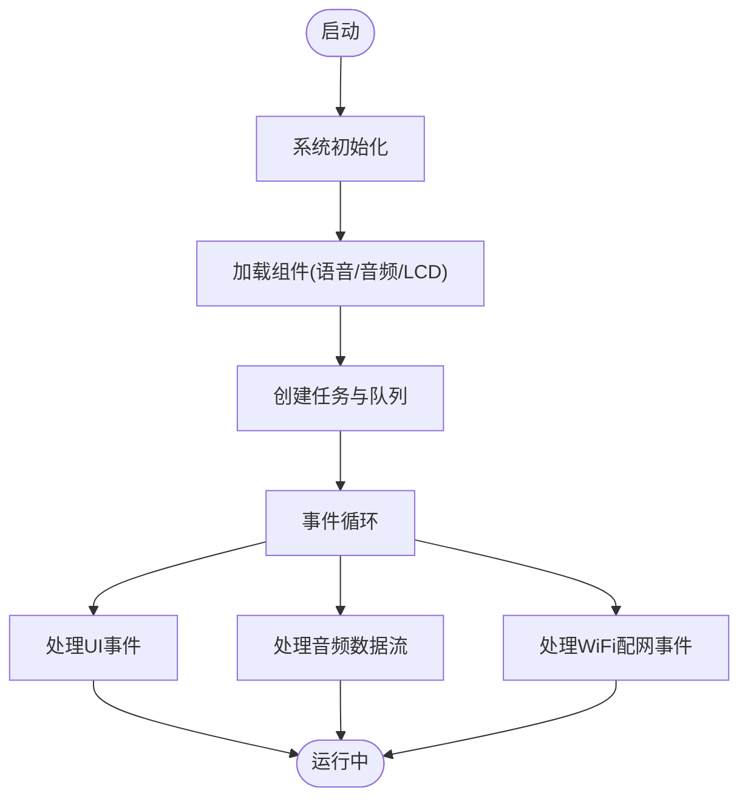
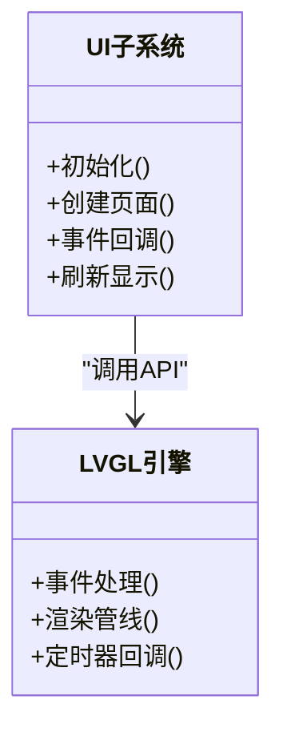
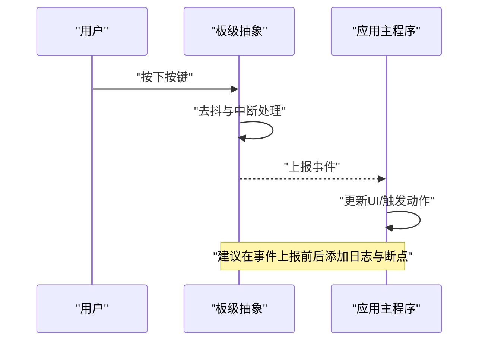
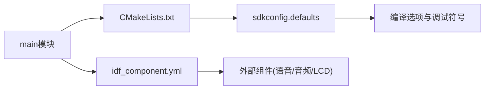

# 调试工具和技巧

<cite>
**本文引用的文件**   
- [README.md](file://Firmware/esp32_ai_mirror/README.md)
- [CMakeLists.txt](file://Firmware/esp32_ai_mirror/CMakeLists.txt)
- [sdkconfig.defaults](file://Firmware/esp32_ai_mirror/sdkconfig.defaults)
- [pytest_ai_mirror.py](file://Firmware/esp32_ai_mirror/pytest_ai_mirror.py)
- [ai_mirror_main.c](file://Firmware/esp32_ai_mirror/main/ai_mirror_main.c)
- [ai_mirror_ui.c](file://Firmware/esp32_ai_mirror/main/ai_mirror_ui.c)
- [board_buttons.c](file://Firmware/esp32_ai_mirror/main/board_buttons.c)
- [board_rgb.c](file://Firmware/esp32_ai_mirror/main/board_rgb.c)
- [board_wifi_prov.c](file://Firmware/esp32_ai_mirror/main/board_wifi_prov.c)
- [idf_component.yml](file://Firmware/esp32_ai_mirror/main/idf_component.yml)
- [devcontainer.json](file://Firmware/esp32_ai_mirror/.devcontainer/devcontainer.json)
- [Dockerfile](file://Firmware/esp32_ai_mirror/.devcontainer/Dockerfile)
</cite>

## 目录
1. [简介](#简介)
2. [项目结构](#项目结构)
3. [核心组件](#核心组件)
4. [架构总览](#架构总览)
5. [详细组件分析](#详细组件分析)
6. [依赖关系分析](#依赖关系分析)
7. [性能与内存分析](#性能与内存分析)
8. [故障排查指南](#故障排查指南)
9. [结论](#结论)
10. [附录](#附录)

## 简介
本指南面向AI镜子项目的开发与维护人员，聚焦于ESP-IDF环境下的调试工具与技巧。内容涵盖：
- ESP-IDF调试环境搭建与配置（含VS Code集成、GDB调试器使用）
- 串口调试输出与日志级别管理
- 断点设置、变量监视与调用栈分析
- pytest单元测试框架的使用（用例编写、自动化执行、结果分析）
- 性能分析与内存分析的高级技巧
- 多环境远程调试与问题复现方法

## 项目结构
本项目基于ESP-IDF构建，采用组件化组织方式。关键目录与文件包括：
- main：应用主逻辑、UI交互、板级驱动封装（按键、RGB、WiFi配网等）
- components：第三方或厂商组件（如语音识别、LCD驱动、编解码器等）
- .devcontainer：容器化开发环境定义，便于统一调试环境
- CMakeLists.txt与sdkconfig.defaults：构建系统与默认配置
- pytest_ai_mirror.py：顶层测试入口与脚本

**图表来源** 
- [CMakeLists.txt](file://Firmware/esp32_ai_mirror/CMakeLists.txt)
- [sdkconfig.defaults](file://Firmware/esp32_ai_mirror/sdkconfig.defaults)
- [pytest_ai_mirror.py](file://Firmware/esp32_ai_mirror/pytest_ai_mirror.py)
- [devcontainer.json](file://Firmware/esp32_ai_mirror/.devcontainer/devcontainer.json)
- [Dockerfile](file://Firmware/esp32_ai_mirror/.devcontainer/Dockerfile)

**章节来源**
- [README.md](file://Firmware/esp32_ai_mirror/README.md)
- [CMakeLists.txt](file://Firmware/esp32_ai_mirror/CMakeLists.txt)
- [sdkconfig.defaults](file://Firmware/esp32_ai_mirror/sdkconfig.defaults)

## 核心组件
- 应用主循环与任务调度：位于main模块，负责初始化外设、启动任务与事件处理。
- UI子系统：基于LVGL的图形界面，处理用户交互与显示刷新。
- 板级抽象：按键输入、RGB指示灯、WiFi配网流程等。
- 组件依赖：语音识别、音频编解码、LCD驱动等通过idf_component.yml声明。

调试要点：
- 在main入口设置断点，观察初始化顺序与任务创建。
- 对UI渲染路径与事件回调设置条件断点，避免频繁中断。
- 对板级驱动进行最小化验证（如仅点亮LED、读取按键）。

**章节来源**
- [ai_mirror_main.c](file://Firmware/esp32_ai_mirror/main/ai_mirror_main.c)
- [ai_mirror_ui.c](file://Firmware/esp32_ai_mirror/main/ai_mirror_ui.c)
- [board_buttons.c](file://Firmware/esp32_ai_mirror/main/board_buttons.c)
- [board_rgb.c](file://Firmware/esp32_ai_mirror/main/board_rgb.c)
- [board_wifi_prov.c](file://Firmware/esp32_ai_mirror/main/board_wifi_prov.c)
- [idf_component.yml](file://Firmware/esp32_ai_mirror/main/idf_component.yml)

## 架构总览
下图展示从应用到组件与硬件抽象的调用关系，以及调试切入点。

**图表来源** 
- [ai_mirror_main.c](file://Firmware/esp32_ai_mirror/main/ai_mirror_main.c)
- [ai_mirror_ui.c](file://Firmware/esp32_ai_mirror/main/ai_mirror_ui.c)
- [board_buttons.c](file://Firmware/esp32_ai_mirror/main/board_buttons.c)
- [board_rgb.c](file://Firmware/esp32_ai_mirror/main/board_rgb.c)
- [board_wifi_prov.c](file://Firmware/esp32_ai_mirror/main/board_wifi_prov.c)

## 详细组件分析

### 应用主程序与任务流
- 职责：系统初始化、组件加载、任务创建、事件分发。
- 调试建议：
  - 在初始化阶段设置断点，检查各外设句柄是否成功创建。
  - 对任务创建函数设置断点，确认优先级与堆栈分配。
  - 使用GDB查看任务状态与CPU占用。

**图表来源** 
- [ai_mirror_main.c](file://Firmware/esp32_ai_mirror/main/ai_mirror_main.c)

**章节来源**
- [ai_mirror_main.c](file://Firmware/esp32_ai_mirror/main/ai_mirror_main.c)

### UI子系统与交互
- 职责：LVGL初始化、页面绘制、事件响应。
- 调试建议：
  - 在页面切换与重绘回调设置断点，观察渲染耗时。
  - 使用变量监视关注UI对象指针与状态标志。
  - 结合串口打印关键事件序列，定位时序问题。

**图表来源** 
- [ai_mirror_ui.c](file://Firmware/esp32_ai_mirror/main/ai_mirror_ui.c)

**章节来源**
- [ai_mirror_ui.c](file://Firmware/esp32_ai_mirror/main/ai_mirror_ui.c)

### 板级抽象（按键、RGB、WiFi配网）
- 职责：封装硬件相关操作，提供稳定接口给上层。
- 调试建议：
  - 对按键中断与去抖逻辑设置断点，确认触发时机。
  - 对RGB控制函数设置断点，验证颜色与亮度参数。
  - WiFi配网流程中，在关键状态机跳转处设置断点，观察失败原因。

**图表来源** 
- [board_buttons.c](file://Firmware/esp32_ai_mirror/main/board_buttons.c)
- [board_rgb.c](file://Firmware/esp32_ai_mirror/main/board_rgb.c)
- [board_wifi_prov.c](file://Firmware/esp32_ai_mirror/main/board_wifi_prov.c)

**章节来源**
- [board_buttons.c](file://Firmware/esp32_ai_mirror/main/board_buttons.c)
- [board_rgb.c](file://Firmware/esp32_ai_mirror/main/board_rgb.c)
- [board_wifi_prov.c](file://Firmware/esp32_ai_mirror/main/board_wifi_prov.c)

## 依赖关系分析
- 组件声明：通过idf_component.yml集中管理，确保构建时正确链接。
- 构建配置：CMakeLists.txt定义目标与源文件集合；sdkconfig.defaults提供默认编译选项。
- 调试影响：组件版本与配置差异可能导致行为不一致，需在CI与本地保持一致。

**图表来源** 
- [idf_component.yml](file://Firmware/esp32_ai_mirror/main/idf_component.yml)
- [CMakeLists.txt](file://Firmware/esp32_ai_mirror/CMakeLists.txt)
- [sdkconfig.defaults](file://Firmware/esp32_ai_mirror/sdkconfig.defaults)

**章节来源**
- [idf_component.yml](file://Firmware/esp32_ai_mirror/main/idf_component.yml)
- [CMakeLists.txt](file://Firmware/esp32_ai_mirror/CMakeLists.txt)
- [sdkconfig.defaults](file://Firmware/esp32_ai_mirror/sdkconfig.defaults)

## 性能与内存分析
- 性能分析：
  - 启用ESP-IDF性能统计，记录任务CPU占用与中断延迟。
  - 在UI渲染与音频数据处理路径插入时间戳，计算耗时分布。
  - 使用GDB的统计功能分析热点函数。
- 内存分析：
  - 开启内存泄漏检测，捕获未释放资源。
  - 监控堆栈使用，避免溢出风险。
  - 分析组件内存池与静态分配，优化碎片化。

**章节来源**
- [sdkconfig.defaults](file://Firmware/esp32_ai_mirror/sdkconfig.defaults)
- [CMakeLists.txt](file://Firmware/esp32_ai_mirror/CMakeLists.txt)

## 故障排查指南
- 串口调试输出：
  - 确认波特率与端口配置，避免乱码。
  - 分级打印日志，区分INFO/WARN/ERROR。
  - 在关键路径添加上下文信息（任务ID、时间戳）。
- GDB调试：
  - 设置断点与条件断点，减少干扰。
  - 使用bt命令查看调用栈，定位崩溃位置。
  - 监视变量变化，验证逻辑分支。
- 单元测试（pytest）：
  - 编写用例覆盖边界条件与异常路径。
  - 自动化执行并生成报告，持续集成反馈。
  - 分析失败用例，复现场景并修复。

**章节来源**
- [pytest_ai_mirror.py](file://Firmware/esp32_ai_mirror/pytest_ai_mirror.py)

## 结论
通过合理的ESP-IDF环境配置、GDB调试技巧、串口日志管理与pytest单元测试，可显著提升AI镜子项目的调试效率与质量。建议在日常开发中建立标准化的调试流程与最佳实践，确保问题快速定位与修复。

## 附录
- 开发环境容器化：使用.devcontainer统一IDE与工具链，避免环境差异。
- 远程调试：通过网络连接设备，使用GDB Server进行远程会话。
- 问题复现：记录环境版本、配置项与操作步骤，便于他人复现。

**章节来源**
- [devcontainer.json](file://Firmware/esp32_ai_mirror/.devcontainer/devcontainer.json)
- [Dockerfile](file://Firmware/esp32_ai_mirror/.devcontainer/Dockerfile)