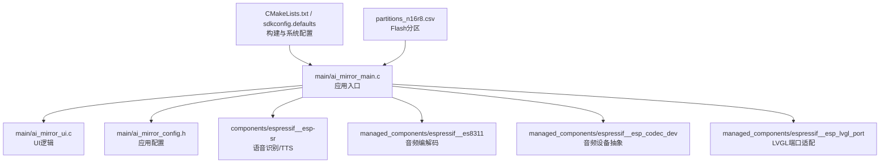
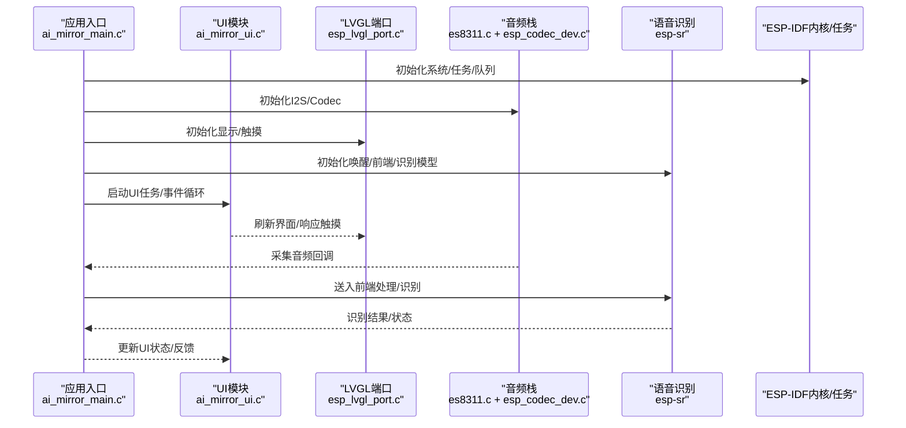
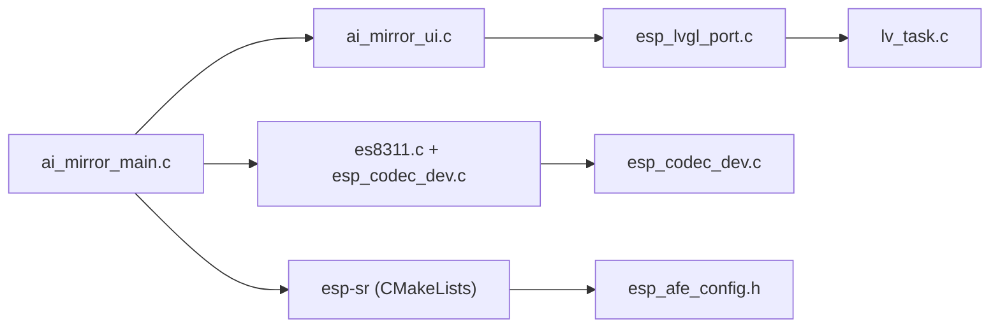

# 软件故障排除

<cite>
**本文引用的文件**   
- [Firmware/esp32_ai_mirror/main/ai_mirror_main.c](file://Firmware/esp32_ai_mirror/main/ai_mirror_main.c)
- [Firmware/esp32_ai_mirror/main/ai_mirror_ui.c](file://Firmware/esp32_ai_mirror/main/ai_mirror_ui.c)
- [Firmware/esp32_ai_mirror/main/ai_mirror_config.h](file://Firmware/esp32_ai_mirror/main/ai_mirror_config.h)
- [Firmware/esp32_ai_mirror/main/CMakeLists.txt](file://Firmware/esp32_ai_mirror/main/CMakeLists.txt)
- [Firmware/esp32_ai_mirror/CMakeLists.txt](file://Firmware/esp32_ai_mirror/CMakeLists.txt)
- [Firmware/esp32_ai_mirror/sdkconfig.defaults](file://Firmware/esp32_ai_mirror/sdkconfig.defaults)
- [Firmware/esp32_ai_mirror/partitions_n16r8.csv](file://Firmware/esp32_ai_mirror/partitions_n16r8.csv)
- [Firmware/esp32_ai_mirror/components/espressif__esp-sr/CMakeLists.txt](file://Firmware/esp32_ai_mirror/components/espressif__esp-sr/CMakeLists.txt)
- [Firmware/esp32_ai_mirror/components/espressif__esp-sr/src/esp_process_sdkconfig.c](file://Firmware/esp32_ai_mirror/components/espressif__esp-sr/src/esp_process_sdkconfig.c)
- [Firmware/esp32_ai_mirror/components/espressif__esp-sr/include/esp32/esp_afe_config.h](file://Firmware/esp32_ai_mirror/components/espressif__esp-sr/include/esp32/esp_afe_config.h)
- [Firmware/esp32_ai_mirror/components/espressif__esp-sr/model/multinet_model/mn4_cn/CMakeLists.txt](file://Firmware/esp32_ai_mirror/components/espressif__esp-sr/model/multinet_model/mn4_cn/CMakeLists.txt)
- [Firmware/esp32_ai_mirror/managed_components/espressif__es8311/es8311.c](file://Firmware/esp32_ai_mirror/managed_components/espressif__es8311/es8311.c)
- [Firmware/esp32_ai_mirror/managed_components/espressif__esp_codec_dev/esp_codec_dev.c](file://Firmware/esp32_ai_mirror/managed_components/espressif__esp_codec_dev/esp_codec_dev.c)
- [Firmware/esp32_ai_mirror/managed_components/espressif__esp_lvgl_port/esp_lvgl_port.c](file://Firmware/esp32_ai_mirror/managed_components/espressif__esp_lvgl_port/esp_lvgl_port.c)
- [Firmware/esp32_ai_mirror/managed_components/lvgl__lvgl/src/core/lv_task.c](file://Firmware/esp32_ai_mirror/managed_components/lvgl__lvgl/src/core/lv_task.c)
- [Firmware/esp32_ai_mirror/pytest_ai_mirror.py](file://Firmware/esp32_ai_mirror/pytest_ai_mirror.py)
</cite>

## 目录
1. [简介](#简介)
2. [项目结构](#项目结构)
3. [核心组件](#核心组件)
4. [架构总览](#架构总览)
5. [详细组件分析](#详细组件分析)
6. [依赖关系分析](#依赖关系分析)
7. [性能与内存注意事项](#性能与内存注意事项)
8. [故障排除指南](#故障排除指南)
9. [结论](#结论)
10. [附录：常用调试命令与技巧](#附录常用调试命令与技巧)

## 简介
本指南面向AI镜子项目的开发与维护人员，聚焦于编译错误、运行时异常、内存泄漏、任务死锁等常见问题的诊断与修复。内容覆盖ESP-IDF框架相关问题（组件加载失败、库版本冲突、配置参数错误）、日志分析方法（ESP_LOG宏使用、调试输出配置、性能分析工具），以及UI界面问题、语音识别失败、音频播放异常等具体场景的排查步骤与最佳实践。

## 项目结构
本项目基于ESP-IDF构建，采用“主应用 + 组件”的分层组织方式：
- main：应用入口、UI、板级驱动封装、WiFi配网等
- components：语音识别与TTS相关组件（esp-sr）
- managed_components：第三方或官方组件（LVGL、LCD/Touch、Codec、ESP-DSP等）
- 构建与配置：CMakeLists、sdkconfig.defaults、分区表等

图表来源
- [Firmware/esp32_ai_mirror/main/ai_mirror_main.c](file://Firmware/esp32_ai_mirror/main/ai_mirror_main.c)
- [Firmware/esp32_ai_mirror/main/ai_mirror_ui.c](file://Firmware/esp32_ai_mirror/main/ai_mirror_ui.c)
- [Firmware/esp32_ai_mirror/main/ai_mirror_config.h](file://Firmware/esp32_ai_mirror/main/ai_mirror_config.h)
- [Firmware/esp32_ai_mirror/components/espressif__esp-sr/CMakeLists.txt](file://Firmware/esp32_ai_mirror/components/espressif__esp-sr/CMakeLists.txt)
- [Firmware/esp32_ai_mirror/managed_components/espressif__es8311/es8311.c](file://Firmware/esp32_ai_mirror/managed_components/espressif__es8311/es8311.c)
- [Firmware/esp32_ai_mirror/managed_components/espressif__esp_codec_dev/esp_codec_dev.c](file://Firmware/esp32_ai_mirror/managed_components/espressif__esp_codec_dev/esp_codec_dev.c)
- [Firmware/esp32_ai_mirror/managed_components/espressif__esp_lvgl_port/esp_lvgl_port.c](file://Firmware/esp32_ai_mirror/managed_components/espressif__esp_lvgl_port/esp_lvgl_port.c)
- [Firmware/esp32_ai_mirror/CMakeLists.txt](file://Firmware/esp32_ai_mirror/CMakeLists.txt)
- [Firmware/esp32_ai_mirror/sdkconfig.defaults](file://Firmware/esp32_ai_mirror/sdkconfig.defaults)
- [Firmware/esp32_ai_mirror/partitions_n16r8.csv](file://Firmware/esp32_ai_mirror/partitions_n16r8.csv)

章节来源
- [Firmware/esp32_ai_mirror/CMakeLists.txt](file://Firmware/esp32_ai_mirror/CMakeLists.txt)
- [Firmware/esp32_ai_mirror/main/CMakeLists.txt](file://Firmware/esp32_ai_mirror/main/CMakeLists.txt)
- [Firmware/esp32_ai_mirror/sdkconfig.defaults](file://Firmware/esp32_ai_mirror/sdkconfig.defaults)
- [Firmware/esp32_ai_mirror/partitions_n16r8.csv](file://Firmware/esp32_ai_mirror/partitions_n16r8.csv)

## 核心组件
- 应用入口与任务调度：负责初始化各子系统、创建任务与事件循环、协调UI与语音流程
- UI子系统：基于LVGL，负责界面绘制、触摸交互与动画
- 音频子系统：I2S + ES8311 + esp_codec_dev，负责录音与播放
- 语音识别：esp-sr（唤醒、前端处理、多模态识别模型）
- 构建与配置：CMake、Kconfig、sdkconfig、分区表

章节来源
- [Firmware/esp32_ai_mirror/main/ai_mirror_main.c](file://Firmware/esp32_ai_mirror/main/ai_mirror_main.c)
- [Firmware/esp32_ai_mirror/main/ai_mirror_ui.c](file://Firmware/esp32_ai_mirror/main/ai_mirror_ui.c)
- [Firmware/esp32_ai_mirror/main/ai_mirror_config.h](file://Firmware/esp32_ai_mirror/main/ai_mirror_config.h)
- [Firmware/esp32_ai_mirror/components/espressif__esp-sr/CMakeLists.txt](file://Firmware/esp32_ai_mirror/components/espressif__esp-sr/CMakeLists.txt)
- [Firmware/esp32_ai_mirror/managed_components/espressif__es8311/es8311.c](file://Firmware/esp32_ai_mirror/managed_components/espressif__es8311/es8311.c)
- [Firmware/esp32_ai_mirror/managed_components/espressif__esp_codec_dev/esp_codec_dev.c](file://Firmware/esp32_ai_mirror/managed_components/espressif__esp_codec_dev/esp_codec_dev.c)
- [Firmware/esp32_ai_mirror/managed_components/espressif__esp_lvgl_port/esp_lvgl_port.c](file://Firmware/esp32_ai_mirror/managed_components/espressif__esp_lvgl_port/esp_lvgl_port.c)

## 架构总览
下图展示从应用入口到各子系统的调用关系与数据流，便于定位问题边界。

图表来源
- [Firmware/esp32_ai_mirror/main/ai_mirror_main.c](file://Firmware/esp32_ai_mirror/main/ai_mirror_main.c)
- [Firmware/esp32_ai_mirror/main/ai_mirror_ui.c](file://Firmware/esp32_ai_mirror/main/ai_mirror_ui.c)
- [Firmware/esp32_ai_mirror/managed_components/espressif__esp_lvgl_port/esp_lvgl_port.c](file://Firmware/esp32_ai_mirror/managed_components/espressif__esp_lvgl_port/esp_lvgl_port.c)
- [Firmware/esp32_ai_mirror/managed_components/espressif__es8311/es8311.c](file://Firmware/esp32_ai_mirror/managed_components/espressif__es8311/es8311.c)
- [Firmware/esp32_ai_mirror/managed_components/espressif__esp_codec_dev/esp_codec_dev.c](file://Firmware/esp32_ai_mirror/managed_components/espressif__esp_codec_dev/esp_codec_dev.c)
- [Firmware/esp32_ai_mirror/components/espressif__esp-sr/CMakeLists.txt](file://Firmware/esp32_ai_mirror/components/espressif__esp-sr/CMakeLists.txt)

## 详细组件分析

### 应用入口与任务管理
- 职责：初始化硬件（I2S、LCD、Touch）、加载语音模型、创建任务与队列、协调UI与语音流程
- 常见问题：任务优先级不当导致UI卡顿；队列满/空未处理；资源初始化顺序错误
- 建议：在关键路径添加ESP_LOG日志，记录初始化返回值与任务创建结果

章节来源
- [Firmware/esp32_ai_mirror/main/ai_mirror_main.c](file://Firmware/esp32_ai_mirror/main/ai_mirror_main.c)

### UI子系统（LVGL）
- 职责：界面渲染、事件分发、动画与页面切换
- 常见问题：LVGL任务阻塞、刷新频率过低、内存不足导致崩溃
- 建议：监控lv_task执行耗时，避免在事件回调中做重计算；合理设置刷新周期

章节来源
- [Firmware/esp32_ai_mirror/main/ai_mirror_ui.c](file://Firmware/esp32_ai_mirror/main/ai_mirror_ui.c)
- [Firmware/esp32_ai_mirror/managed_components/espressif__esp_lvgl_port/esp_lvgl_port.c](file://Firmware/esp32_ai_mirror/managed_components/espressif__esp_lvgl_port/esp_lvgl_port.c)
- [Firmware/esp32_ai_mirror/managed_components/lvgl__lvgl/src/core/lv_task.c](file://Firmware/esp32_ai_mirror/managed_components/lvgl__lvgl/src/core/lv_task.c)

### 音频子系统（I2S + ES8311 + esp_codec_dev）
- 职责：录音与播放、音量控制、采样率/位深配置
- 常见问题：I2S时钟配置错误、Codec寄存器写入失败、缓冲区溢出
- 建议：检查I2C总线通信、确认ES8311地址与寄存器默认值；在回调中打印缓冲状态

章节来源
- [Firmware/esp32_ai_mirror/managed_components/espressif__es8311/es8311.c](file://Firmware/esp32_ai_mirror/managed_components/espressif__es8311/es8311.c)
- [Firmware/esp32_ai_mirror/managed_components/espressif__esp_codec_dev/esp_codec_dev.c](file://Firmware/esp32_ai_mirror/managed_components/espressif__esp_codec_dev/esp_codec_dev.c)

### 语音识别（esp-sr）
- 职责：唤醒检测、音频前端（降噪/AGC/AEC）、多模态识别模型推理
- 常见问题：模型加载失败、AEC/NS配置不匹配、内存不足导致推理失败
- 建议：核对AEC/NS模型与硬件通道数；检查Flash分区是否足够存放模型；启用组件内部日志

章节来源
- [Firmware/esp32_ai_mirror/components/espressif__esp-sr/CMakeLists.txt](file://Firmware/esp32_ai_mirror/components/espressif__esp-sr/CMakeLists.txt)
- [Firmware/esp32_ai_mirror/components/espressif__esp-sr/src/esp_process_sdkconfig.c](file://Firmware/esp32_ai_mirror/components/espressif__esp-sr/src/esp_process_sdkconfig.c)
- [Firmware/esp32_ai_mirror/components/espressif__esp-sr/include/esp32/esp_afe_config.h](file://Firmware/esp32_ai_mirror/components/espressif__esp-sr/include/esp32/esp_afe_config.h)
- [Firmware/esp32_ai_mirror/components/espressif__esp-sr/model/multinet_model/mn4_cn/CMakeLists.txt](file://Firmware/esp32_ai_mirror/components/espressif__esp-sr/model/multinet_model/mn4_cn/CMakeLists.txt)

### 构建与配置（CMake/Kconfig/sdkconfig/分区表）
- 职责：组件依赖解析、编译选项、运行时配置、Flash布局
- 常见问题：组件版本冲突、Kconfig未生效、分区表过小导致模型无法烧录
- 建议：统一idf_component.yml版本；核对sdkconfig.defaults与目标板型；确保分区表包含模型分区

章节来源
- [Firmware/esp32_ai_mirror/CMakeLists.txt](file://Firmware/esp32_ai_mirror/CMakeLists.txt)
- [Firmware/esp32_ai_mirror/main/CMakeLists.txt](file://Firmware/esp32_ai_mirror/main/CMakeLists.txt)
- [Firmware/esp32_ai_mirror/sdkconfig.defaults](file://Firmware/esp32_ai_mirror/sdkconfig.defaults)
- [Firmware/esp32_ai_mirror/partitions_n16r8.csv](file://Firmware/esp32_ai_mirror/partitions_n16r8.csv)

## 依赖关系分析
- 组件耦合：应用入口依赖UI、音频、语音识别；LVGL与UI强耦合；音频栈依赖Codec与I2S
- 外部依赖：LVGL、esp-sr、esp_codec_dev、es8311等通过idf_component.yml管理
- 潜在环依赖：应避免在初始化阶段互相调用；使用事件/队列解耦

图表来源
- [Firmware/esp32_ai_mirror/main/ai_mirror_main.c](file://Firmware/esp32_ai_mirror/main/ai_mirror_main.c)
- [Firmware/esp32_ai_mirror/main/ai_mirror_ui.c](file://Firmware/esp32_ai_mirror/main/ai_mirror_ui.c)
- [Firmware/esp32_ai_mirror/managed_components/espressif__es8311/es8311.c](file://Firmware/esp32_ai_mirror/managed_components/espressif__es8311/es8311.c)
- [Firmware/esp32_ai_mirror/managed_components/espressif__esp_codec_dev/esp_codec_dev.c](file://Firmware/esp32_ai_mirror/managed_components/espressif__esp_codec_dev/esp_codec_dev.c)
- [Firmware/esp32_ai_mirror/components/espressif__esp-sr/CMakeLists.txt](file://Firmware/esp32_ai_mirror/components/espressif__esp-sr/CMakeLists.txt)
- [Firmware/esp32_ai_mirror/components/espressif__esp-sr/include/esp32/esp_afe_config.h](file://Firmware/esp32_ai_mirror/components/espressif__esp-sr/include/esp32/esp_afe_config.h)
- [Firmware/esp32_ai_mirror/managed_components/espressif__esp_lvgl_port/esp_lvgl_port.c](file://Firmware/esp32_ai_mirror/managed_components/espressif__esp_lvgl_port/esp_lvgl_port.c)
- [Firmware/esp32_ai_mirror/managed_components/lvgl__lvgl/src/core/lv_task.c](file://Firmware/esp32_ai_mirror/managed_components/lvgl__lvgl/src/core/lv_task.c)

章节来源
- [Firmware/esp32_ai_mirror/CMakeLists.txt](file://Firmware/esp32_ai_mirror/CMakeLists.txt)
- [Firmware/esp32_ai_mirror/main/CMakeLists.txt](file://Firmware/esp32_ai_mirror/main/CMakeLists.txt)

## 性能与内存注意事项
- LVGL任务：避免长耗时操作阻塞事件循环；使用异步刷新与增量更新
- 音频缓冲：合理设置I2S缓冲区大小，防止溢出或欠载；在回调中统计丢帧
- 语音推理：选择合适模型尺寸；关闭不必要的AEC/NS以提升性能
- 内存分配：避免频繁malloc/free；复用缓冲区；监控堆碎片

[本节为通用指导，无需特定文件引用]

## 故障排除指南

### 编译错误排查
- 现象：链接失败、符号未定义、组件版本冲突
- 步骤：
  - 检查CMakeLists与idf_component.yml中的组件版本是否一致
  - 清理build目录后重新构建
  - 查看esp-sr与esp_codec_dev的依赖树，确认无环依赖
  - 核对Kconfig选项是否与目标板匹配
- 参考文件
  - [Firmware/esp32_ai_mirror/CMakeLists.txt](file://Firmware/esp32_ai_mirror/CMakeLists.txt)
  - [Firmware/esp32_ai_mirror/main/CMakeLists.txt](file://Firmware/esp32_ai_mirror/main/CMakeLists.txt)
  - [Firmware/esp32_ai_mirror/components/espressif__esp-sr/CMakeLists.txt](file://Firmware/esp32_ai_mirror/components/espressif__esp-sr/CMakeLists.txt)

章节来源
- [Firmware/esp32_ai_mirror/CMakeLists.txt](file://Firmware/esp32_ai_mirror/CMakeLists.txt)
- [Firmware/esp32_ai_mirror/main/CMakeLists.txt](file://Firmware/esp32_ai_mirror/main/CMakeLists.txt)
- [Firmware/esp32_ai_mirror/components/espressif__esp-sr/CMakeLists.txt](file://Firmware/esp32_ai_mirror/components/espressif__esp-sr/CMakeLists.txt)

### 运行时异常与崩溃
- 现象：看门狗复位、非法指令、断言失败
- 步骤：
  - 启用ESP_LOG与异常回溯，捕获PC/EXCVADDR信息
  - 缩小复现场景，逐步禁用非关键功能
  - 检查任务栈大小与优先级，避免栈溢出
  - 使用coredump与gdb定位崩溃点
- 参考文件
  - [Firmware/esp32_ai_mirror/main/ai_mirror_main.c](file://Firmware/esp32_ai_mirror/main/ai_mirror_main.c)

章节来源
- [Firmware/esp32_ai_mirror/main/ai_mirror_main.c](file://Firmware/esp32_ai_mirror/main/ai_mirror_main.c)

### 内存泄漏与堆耗尽
- 现象：运行一段时间后崩溃、UI卡顿、语音识别失败
- 步骤：
  - 启用内存监控与堆统计，观察剩余堆与最大碎片
  - 使用memprof或heap trace定位泄漏点
  - 检查LVGL对象生命周期与释放时机
  - 音频缓冲与语音模型缓存是否重复分配
- 参考文件
  - [Firmware/esp32_ai_mirror/managed_components/espressif__esp_lvgl_port/esp_lvgl_port.c](file://Firmware/esp32_ai_mirror/managed_components/espressif__esp_lvgl_port/esp_lvgl_port.c)
  - [Firmware/esp32_ai_mirror/managed_components/espressif__es8311/es8311.c](file://Firmware/esp32_ai_mirror/managed_components/espressif__es8311/es8311.c)

章节来源
- [Firmware/esp32_ai_mirror/managed_components/espressif__esp_lvgl_port/esp_lvgl_port.c](file://Firmware/esp32_ai_mirror/managed_components/espressif__esp_lvgl_port/esp_lvgl_port.c)
- [Firmware/esp32_ai_mirror/managed_components/espressif__es8311/es8311.c](file://Firmware/esp32_ai_mirror/managed_components/espressif__es8311/es8311.c)

### 任务死锁与竞态条件
- 现象：某任务长期挂起、UI无响应、音频中断丢失
- 步骤：
  - 检查互斥量/信号量/队列的使用是否正确（获取/释放成对）
  - 避免在中断上下文进行阻塞调用
  - 降低任务优先级，观察是否因高优先级抢占导致低优先级饥饿
  - 使用FreeRTOS任务状态查看器定位卡住的任务
- 参考文件
  - [Firmware/esp32_ai_mirror/managed_components/lvgl__lvgl/src/core/lv_task.c](file://Firmware/esp32_ai_mirror/managed_components/lvgl__lvgl/src/core/lv_task.c)

章节来源
- [Firmware/esp32_ai_mirror/managed_components/lvgl__lvgl/src/core/lv_task.c](file://Firmware/esp32_ai_mirror/managed_components/lvgl__lvgl/src/core/lv_task.c)

### ESP-IDF组件加载失败
- 现象：组件初始化返回错误、功能不可用
- 步骤：
  - 检查idf_component.yml与sdkconfig.defaults中的组件开关
  - 确认组件路径与版本号正确，必要时锁定版本
  - 查看组件内部日志，定位初始化失败的具体阶段
- 参考文件
  - [Firmware/esp32_ai_mirror/components/espressif__esp-sr/CMakeLists.txt](file://Firmware/esp32_ai_mirror/components/espressif__esp-sr/CMakeLists.txt)
  - [Firmware/esp32_ai_mirror/sdkconfig.defaults](file://Firmware/esp32_ai_mirror/sdkconfig.defaults)

章节来源
- [Firmware/esp32_ai_mirror/components/espressif__esp-sr/CMakeLists.txt](file://Firmware/esp32_ai_mirror/components/espressif__esp-sr/CMakeLists.txt)
- [Firmware/esp32_ai_mirror/sdkconfig.defaults](file://Firmware/esp32_ai_mirror/sdkconfig.defaults)

### 库版本冲突
- 现象：链接时报符号冲突、运行时行为异常
- 步骤：
  - 使用idf_component_manager查看依赖树，发现冲突版本
  - 在idf_component.yml中显式指定兼容版本
  - 清理并重建，确保二进制与头文件一致
- 参考文件
  - [Firmware/esp32_ai_mirror/CMakeLists.txt](file://Firmware/esp32_ai_mirror/CMakeLists.txt)
  - [Firmware/esp32_ai_mirror/main/CMakeLists.txt](file://Firmware/esp32_ai_mirror/main/CMakeLists.txt)

章节来源
- [Firmware/esp32_ai_mirror/CMakeLists.txt](file://Firmware/esp32_ai_mirror/CMakeLists.txt)
- [Firmware/esp32_ai_mirror/main/CMakeLists.txt](file://Firmware/esp32_ai_mirror/main/CMakeLists.txt)

### 配置参数错误（Kconfig/sdkconfig）
- 现象：功能未按预期工作、性能下降
- 步骤：
  - 核对sdkconfig.defaults与目标板配置是否一致
  - 检查esp-sr的AEC/NS模型与硬件通道数匹配
  - 调整LVGL刷新频率与缓冲区大小
- 参考文件
  - [Firmware/esp32_ai_mirror/sdkconfig.defaults](file://Firmware/esp32_ai_mirror/sdkconfig.defaults)
  - [Firmware/esp32_ai_mirror/components/espressif__esp-sr/include/esp32/esp_afe_config.h](file://Firmware/esp32_ai_mirror/components/espressif__esp-sr/include/esp32/esp_afe_config.h)
  - [Firmware/esp32_ai_mirror/managed_components/espressif__esp_lvgl_port/esp_lvgl_port.c](file://Firmware/esp32_ai_mirror/managed_components/espressif__esp_lvgl_port/esp_lvgl_port.c)

章节来源
- [Firmware/esp32_ai_mirror/sdkconfig.defaults](file://Firmware/esp32_ai_mirror/sdkconfig.defaults)
- [Firmware/esp32_ai_mirror/components/espressif__esp-sr/include/esp32/esp_afe_config.h](file://Firmware/esp32_ai_mirror/components/espressif__esp-sr/include/esp32/esp_afe_config.h)
- [Firmware/esp32_ai_mirror/managed_components/espressif__esp_lvgl_port/esp_lvgl_port.c](file://Firmware/esp32_ai_mirror/managed_components/espressif__esp_lvgl_port/esp_lvgl_port.c)

### 日志分析方法（ESP_LOG与调试输出）
- 方法：
  - 在关键路径添加ESP_LOG，按级别输出（INFO/WARN/ERROR）
  - 开启串口日志与时间戳，便于时序分析
  - 结合coredump与gdb进行崩溃定位
- 参考文件
  - [Firmware/esp32_ai_mirror/main/ai_mirror_main.c](file://Firmware/esp32_ai_mirror/main/ai_mirror_main.c)

章节来源
- [Firmware/esp32_ai_mirror/main/ai_mirror_main.c](file://Firmware/esp32_ai_mirror/main/ai_mirror_main.c)

### UI界面问题
- 现象：界面不刷新、触摸无响应、动画卡顿
- 步骤：
  - 检查LVGL任务是否被阻塞；减少事件回调中的耗时操作
  - 验证LCD与Touch初始化成功；检查SPI/I2C通信
  - 调整刷新频率与双缓冲策略
- 参考文件
  - [Firmware/esp32_ai_mirror/main/ai_mirror_ui.c](file://Firmware/esp32_ai_mirror/main/ai_mirror_ui.c)
  - [Firmware/esp32_ai_mirror/managed_components/espressif__esp_lvgl_port/esp_lvgl_port.c](file://Firmware/esp32_ai_mirror/managed_components/espressif__esp_lvgl_port/esp_lvgl_port.c)

章节来源
- [Firmware/esp32_ai_mirror/main/ai_mirror_ui.c](file://Firmware/esp32_ai_mirror/main/ai_mirror_ui.c)
- [Firmware/esp32_ai_mirror/managed_components/espressif__esp_lvgl_port/esp_lvgl_port.c](file://Firmware/esp32_ai_mirror/managed_components/espressif__esp_lvgl_port/esp_lvgl_port.c)

### 语音识别失败
- 现象：唤醒无效、识别结果为空、误触发
- 步骤：
  - 检查AEC/NS模型与硬件通道数匹配；确认麦克风输入正常
  - 核对Flash分区是否包含所需模型；检查模型加载日志
  - 调整VAD阈值与识别窗口长度
- 参考文件
  - [Firmware/esp32_ai_mirror/components/espressif__esp-sr/src/esp_process_sdkconfig.c](file://Firmware/esp32_ai_mirror/components/espressif__esp-sr/src/esp_process_sdkconfig.c)
  - [Firmware/esp32_ai_mirror/components/espressif__esp-sr/model/multinet_model/mn4_cn/CMakeLists.txt](file://Firmware/esp32_ai_mirror/components/espressif__esp-sr/model/multinet_model/mn4_cn/CMakeLists.txt)

章节来源
- [Firmware/esp32_ai_mirror/components/espressif__esp-sr/src/esp_process_sdkconfig.c](file://Firmware/esp32_ai_mirror/components/espressif__esp-sr/src/esp_process_sdkconfig.c)
- [Firmware/esp32_ai_mirror/components/espressif__esp-sr/model/multinet_model/mn4_cn/CMakeLists.txt](file://Firmware/esp32_ai_mirror/components/espressif__esp-sr/model/multinet_model/mn4_cn/CMakeLists.txt)

### 音频播放异常
- 现象：无声、杂音、卡顿
- 步骤：
  - 检查I2S时钟与采样率配置；确认ES8311寄存器写入成功
  - 增大音频缓冲区，避免欠载；检查音量与静音状态
  - 使用示波器或音频分析仪定位硬件链路问题
- 参考文件
  - [Firmware/esp32_ai_mirror/managed_components/espressif__es8311/es8311.c](file://Firmware/esp32_ai_mirror/managed_components/espressif__es8311/es8311.c)
  - [Firmware/esp32_ai_mirror/managed_components/espressif__esp_codec_dev/esp_codec_dev.c](file://Firmware/esp32_ai_mirror/managed_components/espressif__esp_codec_dev/esp_codec_dev.c)

章节来源
- [Firmware/esp32_ai_mirror/managed_components/espressif__es8311/es8311.c](file://Firmware/esp32_ai_mirror/managed_components/espressif__es8311/es8311.c)
- [Firmware/esp32_ai_mirror/managed_components/espressif__esp_codec_dev/esp_codec_dev.c](file://Firmware/esp32_ai_mirror/managed_components/espressif__esp_codec_dev/esp_codec_dev.c)

### 分区表与模型烧录问题
- 现象：模型无法加载、OTA失败
- 步骤：
  - 检查partitions_n16r8.csv中模型分区大小是否足够
  - 确认模型文件路径与分区偏移一致
  - 使用分区校验工具验证分区表合法性
- 参考文件
  - [Firmware/esp32_ai_mirror/partitions_n16r8.csv](file://Firmware/esp32_ai_mirror/partitions_n16r8.csv)

章节来源
- [Firmware/esp32_ai_mirror/partitions_n16r8.csv](file://Firmware/esp32_ai_mirror/partitions_n16r8.csv)

## 结论
通过系统化地梳理应用入口、UI、音频、语音识别与构建配置的依赖关系，并结合日志分析与性能监控，可高效定位与解决编译错误、运行时异常、内存泄漏与任务死锁等问题。针对ESP-IDF组件加载失败、库版本冲突与配置参数错误，应优先核对构建与配置一致性，再逐步缩小问题范围。对于UI、语音与音频等具体场景，建议以“最小复现+分层隔离”的方式快速定位根因。

[本节为总结性内容，无需特定文件引用]

## 附录：常用调试命令与技巧
- 构建与清理
  - 清理构建目录后重新构建，避免中间产物污染
  - 使用idf_component_manager查看依赖树与版本冲突
- 日志与追踪
  - 启用ESP_LOG与串口时间戳，结合coredump与gdb定位崩溃
  - 使用FreeRTOS任务状态查看器与内存监控工具
- 性能分析
  - 监控LVGL任务执行时间与刷新频率
  - 统计音频缓冲占用与丢帧率，优化缓冲区大小
- 测试与回归
  - 使用pytest脚本进行自动化测试与回归验证
- 参考文件
  - [Firmware/esp32_ai_mirror/pytest_ai_mirror.py](file://Firmware/esp32_ai_mirror/pytest_ai_mirror.py)

章节来源
- [Firmware/esp32_ai_mirror/pytest_ai_mirror.py](file://Firmware/esp32_ai_mirror/pytest_ai_mirror.py)