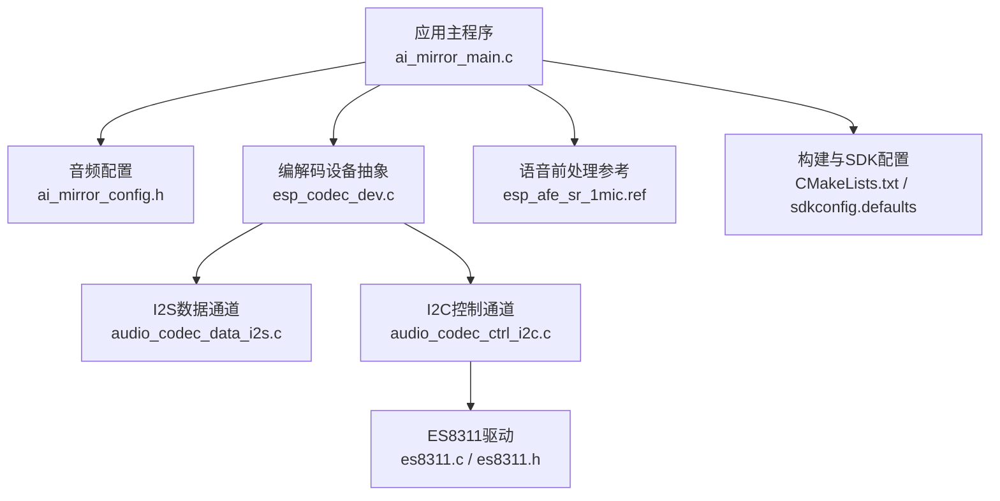
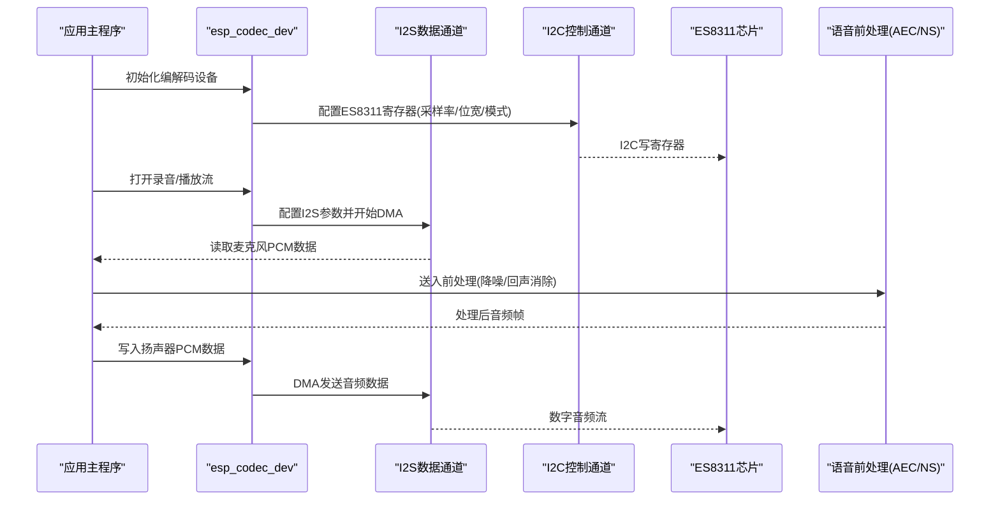
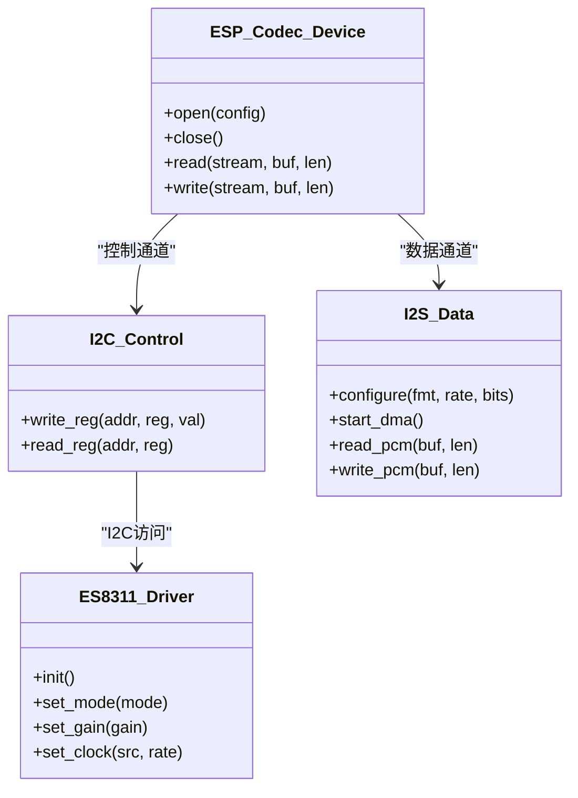
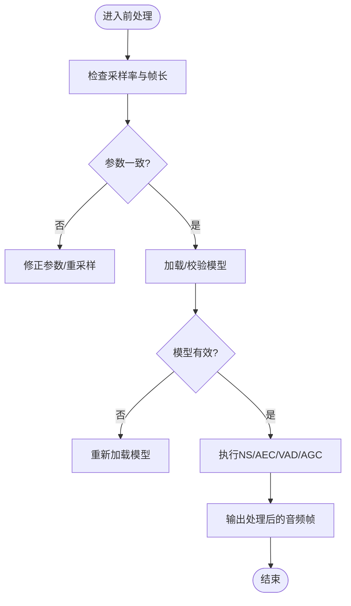
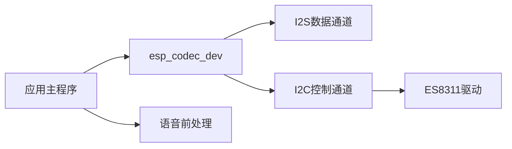

# 音频故障排除

<cite>
**本文引用的文件**   
- [ai_mirror_main.c](file://Firmware/esp32_ai_mirror/main/ai_mirror_main.c)
- [ai_mirror_config.h](file://Firmware/esp32_ai_mirror/main/ai_mirror_config.h)
- [es8311.c](file://Firmware/esp32_ai_mirror/managed_components/espressif__es8311/es8311.c)
- [es8311.h](file://Firmware/esp32_ai_mirror/managed_components/espressif__es8311/include/es8311.h)
- [es8311_reg.h](file://Firmware/esp32_ai_mirror/managed_components/espressif__es8311/priv_include/es8311_reg.h)
- [audio_codec_data_i2s.c](file://Firmware/esp32_ai_mirror/managed_components/espressif__esp_codec_dev/platform/audio_codec_data_i2s.c)
- [audio_codec_ctrl_i2c.c](file://Firmware/esp32_ai_mirror/managed_components/espressif__esp_codec_dev/platform/audio_codec_ctrl_i2c.c)
- [esp_codec_dev.c](file://Firmware/esp32_ai_mirror/managed_components/espressif__esp_codec_dev/esp_codec_dev.c)
- [esp_afe_sr_1mic.ref](file://Firmware/esp32_ai_mirror/components/espressif__esp-sr/src/esp_afe_sr_1mic.ref)
- [CMakeLists.txt](file://Firmware/esp32_ai_mirror/CMakeLists.txt)
- [sdkconfig.defaults](file://Firmware/esp32_ai_mirror/sdkconfig.defaults)
</cite>

## 目录
1. [简介](#简介)
2. [项目结构](#项目结构)
3. [核心组件](#核心组件)
4. [架构总览](#架构总览)
5. [详细组件分析](#详细组件分析)
6. [依赖关系分析](#依赖关系分析)
7. [性能与稳定性考量](#性能与稳定性考量)
8. [故障排除指南](#故障排除指南)
9. [结论](#结论)
10. [附录](#附录)

## 简介
本指南面向AI镜子项目的音频子系统，聚焦于麦克风输入、扬声器输出、音频编解码器、I2S通信、ES8311芯片配置、缓冲区溢出、语音识别预处理、回声消除与噪声抑制等问题的诊断与修复。文档以代码级为依据，提供可操作的排查步骤、测试方法与调试技巧，帮助快速定位并解决音频问题。

## 项目结构
本项目基于ESP-IDF构建，音频相关的关键路径包括：
- 应用层主程序与配置：main/ai_mirror_main.c、main/ai_mirror_config.h
- ES8311驱动：managed_components/espressif__es8311（含头文件与实现）
- 编解码设备抽象与I2S平台实现：managed_components/espressif__esp_codec_dev（esp_codec_dev与platform/i2s）
- 语音前处理参考：components/espressif__esp-sr/src/esp_afe_sr_1mic.ref
- 构建与SDK配置：CMakeLists.txt、sdkconfig.defaults

图表来源 
- [ai_mirror_main.c](file://Firmware/esp32_ai_mirror/main/ai_mirror_main.c)
- [ai_mirror_config.h](file://Firmware/esp32_ai_mirror/main/ai_mirror_config.h)
- [esp_codec_dev.c](file://Firmware/esp32_ai_mirror/managed_components/espressif__esp_codec_dev/esp_codec_dev.c)
- [audio_codec_data_i2s.c](file://Firmware/esp32_ai_mirror/managed_components/espressif__esp_codec_dev/platform/audio_codec_data_i2s.c)
- [audio_codec_ctrl_i2c.c](file://Firmware/esp32_ai_mirror/managed_components/espressif__esp_codec_dev/platform/audio_codec_ctrl_i2c.c)
- [es8311.c](file://Firmware/esp32_ai_mirror/managed_components/espressif__es8311/es8311.c)
- [es8311.h](file://Firmware/esp32_ai_mirror/managed_components/espressif__es8311/include/es8311.h)
- [esp_afe_sr_1mic.ref](file://Firmware/esp32_ai_mirror/components/espressif__esp-sr/src/esp_afe_sr_1mic.ref)
- [CMakeLists.txt](file://Firmware/esp32_ai_mirror/CMakeLists.txt)
- [sdkconfig.defaults](file://Firmware/esp32_ai_mirror/sdkconfig.defaults)

章节来源
- [CMakeLists.txt](file://Firmware/esp32_ai_mirror/CMakeLists.txt)
- [sdkconfig.defaults](file://Firmware/esp32_ai_mirror/sdkconfig.defaults)

## 核心组件
- 应用主程序与音频初始化流程：负责启动I2S、ES8311、编解码设备以及语音前处理模块的初始化与运行调度。
- ES8311音频编解码器：通过I2C进行寄存器配置，通过I2S传输PCM数据。
- esp_codec_dev：统一编解码设备接口，封装I2S数据通道与I2C控制通道，向上提供一致的API。
- 语音前处理（AEC/NS/VAD/AGC）：基于esp-sr的前处理管线，用于提升语音识别质量。

章节来源
- [ai_mirror_main.c](file://Firmware/esp32_ai_mirror/main/ai_mirror_main.c)
- [ai_mirror_config.h](file://Firmware/esp32_ai_mirror/main/ai_mirror_config.h)
- [es8311.c](file://Firmware/esp32_ai_mirror/managed_components/espressif__es8311/es8311.c)
- [esp_codec_dev.c](file://Firmware/esp32_ai_mirror/managed_components/espressif__esp_codec_dev/esp_codec_dev.c)
- [audio_codec_data_i2s.c](file://Firmware/esp32_ai_mirror/managed_components/espressif__esp_codec_dev/platform/audio_codec_data_i2s.c)
- [audio_codec_ctrl_i2c.c](file://Firmware/esp32_ai_mirror/managed_components/espressif__esp_codec_dev/platform/audio_codec_ctrl_i2c.c)

## 架构总览
下图展示了从应用到硬件的音频数据与控制流，涵盖I2S数据通道、I2C控制通道与ES8311芯片交互。

图表来源 
- [ai_mirror_main.c](file://Firmware/esp32_ai_mirror/main/ai_mirror_main.c)
- [esp_codec_dev.c](file://Firmware/esp32_ai_mirror/managed_components/espressif__esp_codec_dev/esp_codec_dev.c)
- [audio_codec_data_i2s.c](file://Firmware/esp32_ai_mirror/managed_components/espressif__esp_codec_dev/platform/audio_codec_data_i2s.c)
- [audio_codec_ctrl_i2c.c](file://Firmware/esp32_ai_mirror/managed_components/espressif__esp_codec_dev/platform/audio_codec_ctrl_i2c.c)
- [es8311.c](file://Firmware/esp32_ai_mirror/managed_components/espressif__es8311/es8311.c)

## 详细组件分析

### ES8311驱动与I2C/I2S集成
- ES8311通过I2C进行寄存器配置（如ADC/DAC增益、时钟源、工作模式），通过I2S传输PCM数据。
- esp_codec_dev将I2C控制与I2S数据解耦，提供统一的open/close/read/write接口。
- 常见故障点：I2C地址错误、寄存器值不匹配、I2S时钟/位相配置不一致、DMA缓冲不足导致溢出。

图表来源 
- [es8311.c](file://Firmware/esp32_ai_mirror/managed_components/espressif__es8311/es8311.c)
- [es8311.h](file://Firmware/esp32_ai_mirror/managed_components/espressif__es8311/include/es8311.h)
- [audio_codec_ctrl_i2c.c](file://Firmware/esp32_ai_mirror/managed_components/espressif__esp_codec_dev/platform/audio_codec_ctrl_i2c.c)
- [audio_codec_data_i2s.c](file://Firmware/esp32_ai_mirror/managed_components/espressif__esp_codec_dev/platform/audio_codec_data_i2s.c)
- [esp_codec_dev.c](file://Firmware/esp32_ai_mirror/managed_components/espressif__esp_codec_dev/esp_codec_dev.c)

章节来源
- [es8311.c](file://Firmware/esp32_ai_mirror/managed_components/espressif__es8311/es8311.c)
- [es8311.h](file://Firmware/esp32_ai_mirror/managed_components/espressif__es8311/include/es8311.h)
- [audio_codec_ctrl_i2c.c](file://Firmware/esp32_ai_mirror/managed_components/espressif__esp_codec_dev/platform/audio_codec_ctrl_i2c.c)
- [audio_codec_data_i2s.c](file://Firmware/esp32_ai_mirror/managed_components/espressif__esp_codec_dev/platform/audio_codec_data_i2s.c)
- [esp_codec_dev.c](file://Firmware/esp32_ai_mirror/managed_components/espressif__esp_codec_dev/esp_codec_dev.c)

### 语音前处理管线（AEC/NS/VAD/AGC）
- 语音前处理模块对原始麦克风数据进行降噪、回声消除、静音检测与自动增益控制，以提升识别准确率。
- 关键参数：采样率一致性、帧长度、延迟对齐、模型选择与权重加载。
- 常见问题：参数不匹配导致失真、内存不足导致丢帧、模型未正确加载导致功能失效。

图表来源 
- [esp_afe_sr_1mic.ref](file://Firmware/esp32_ai_mirror/components/espressif__esp-sr/src/esp_afe_sr_1mic.ref)

章节来源
- [esp_afe_sr_1mic.ref](file://Firmware/esp32_ai_mirror/components/espressif__esp-sr/src/esp_afe_sr_1mic.ref)

## 依赖关系分析
- 应用主程序依赖esp_codec_dev提供的统一接口，间接依赖I2S与I2C平台实现。
- ES8311驱动依赖I2C控制器；音频数据依赖I2S控制器与DMA。
- 语音前处理依赖稳定的音频帧输入与正确的参数配置。

图表来源 
- [ai_mirror_main.c](file://Firmware/esp32_ai_mirror/main/ai_mirror_main.c)
- [esp_codec_dev.c](file://Firmware/esp32_ai_mirror/managed_components/espressif__esp_codec_dev/esp_codec_dev.c)
- [audio_codec_data_i2s.c](file://Firmware/esp32_ai_mirror/managed_components/espressif__esp_codec_dev/platform/audio_codec_data_i2s.c)
- [audio_codec_ctrl_i2c.c](file://Firmware/esp32_ai_mirror/managed_components/espressif__esp_codec_dev/platform/audio_codec_ctrl_i2c.c)
- [es8311.c](file://Firmware/esp32_ai_mirror/managed_components/espressif__es8311/es8311.c)

章节来源
- [CMakeLists.txt](file://Firmware/esp32_ai_mirror/CMakeLists.txt)
- [sdkconfig.defaults](file://Firmware/esp32_ai_mirror/sdkconfig.defaults)

## 性能与稳定性考量
- I2S DMA缓冲大小需匹配CPU负载与网络/识别线程速度，避免溢出或欠载。
- 采样率与位宽必须与ES8311配置一致，防止时钟漂移与数据错位。
- 语音前处理模块需要足够的内存与合理的帧长，避免实时性抖动。
- 建议启用日志与统计指标（如丢帧计数、缓冲区水位）以便监控。

[本节为通用指导，无需引用具体文件]

## 故障排除指南

### 一、麦克风输入问题
- 现象：无声音、音量极低、杂音大、断续。
- 排查步骤：
  - 确认I2S配置（采样率、位宽、时钟极性）与ES8311一致。
  - 检查I2C是否能成功写入ES8311寄存器（ADC使能、增益、通道选择）。
  - 验证DMA缓冲是否足够，是否存在读超时或空数据。
  - 使用最小化测试（仅录音不处理）隔离前处理模块影响。
- 常见原因：
  - I2C地址或引脚定义错误。
  - ADC通道未启用或增益过低。
  - I2S时钟相位设置不当导致数据错位。
- 修复建议：
  - 核对引脚映射与时钟配置。
  - 调整ADC增益与通道选择。
  - 增大I2S DMA缓冲并增加重试机制。

章节来源
- [audio_codec_data_i2s.c](file://Firmware/esp32_ai_mirror/managed_components/espressif__esp_codec_dev/platform/audio_codec_data_i2s.c)
- [audio_codec_ctrl_i2c.c](file://Firmware/esp32_ai_mirror/managed_components/espressif__esp_codec_dev/platform/audio_codec_ctrl_i2c.c)
- [es8311.c](file://Firmware/esp32_ai_mirror/managed_components/espressif__es8311/es8311.c)

### 二、扬声器输出异常
- 现象：无声、破音、左右声道错乱、延迟过大。
- 排查步骤：
  - 检查DAC输出使能与音量设置。
  - 确认I2S数据格式与ES8311 DAC模式匹配。
  - 验证播放线程写入频率与DMA消费速率匹配。
- 常见原因：
  - DAC未启用或音量设置为零。
  - I2S位序或时钟极性与芯片期望不符。
  - 写入过快/过慢导致缓冲区溢出或欠载。
- 修复建议：
  - 启用DAC并设置合理音量。
  - 校准I2S格式与时钟。
  - 调整写入策略与缓冲大小，加入背压控制。

章节来源
- [audio_codec_data_i2s.c](file://Firmware/esp32_ai_mirror/managed_components/espressif__esp_codec_dev/platform/audio_codec_data_i2s.c)
- [es8311.c](file://Firmware/esp32_ai_mirror/managed_components/espressif__es8311/es8311.c)

### 三、音频编解码器故障（esp_codec_dev）
- 现象：open失败、读写返回错误、数据乱码。
- 排查步骤：
  - 检查设备句柄创建与参数合法性。
  - 验证I2C/I2S底层驱动初始化顺序与状态。
  - 查看错误码与日志定位失败阶段。
- 常见原因：
  - 参数不合法（采样率、位宽、通道数）。
  - 底层驱动未就绪或资源冲突。
- 修复建议：
  - 修正参数与初始化顺序。
  - 增加资源检查与错误回退逻辑。

章节来源
- [esp_codec_dev.c](file://Firmware/esp32_ai_mirror/managed_components/espressif__esp_codec_dev/esp_codec_dev.c)

### 四、ES8311芯片配置问题
- 现象：无法识别、寄存器读写失败、音频模式异常。
- 排查步骤：
  - 使用I2C扫描工具确认设备地址与响应。
  - 逐项校验关键寄存器（电源、时钟、ADC/DAC使能、增益）。
  - 对比官方示例配置表。
- 常见原因：
  - I2C总线异常或上拉电阻缺失。
  - 寄存器值与硬件版本不匹配。
- 修复建议：
  - 检查I2C电气特性与布线。
  - 更新驱动或适配寄存器表。

章节来源
- [es8311.c](file://Firmware/esp32_ai_mirror/managed_components/espressif__es8311/es8311.c)
- [es8311_reg.h](file://Firmware/esp32_ai_mirror/managed_components/espressif__es8311/priv_include/es8311_reg.h)

### 五、I2S通信故障
- 现象：数据丢失、噪声、时钟不同步。
- 排查步骤：
  - 用示波器观察BCLK、LRCK、SDIN/SDOUT波形。
  - 核对I2S格式（MSB/LSB、相位、位宽）。
  - 检查DMA队列与中断优先级。
- 常见原因：
  - 时钟极性/相位设置错误。
  - DMA缓冲过小或任务抢占严重。
- 修复建议：
  - 校正I2S参数与引脚复用。
  - 优化任务调度与中断优先级。

章节来源
- [audio_codec_data_i2s.c](file://Firmware/esp32_ai_mirror/managed_components/espressif__esp_codec_dev/platform/audio_codec_data_i2s.c)

### 六、音频缓冲区溢出
- 现象：爆音、卡顿、识别失败。
- 排查步骤：
  - 监控缓冲区水位与丢帧计数。
  - 分析生产者/消费者速率差异。
  - 检查内存分配与碎片情况。
- 常见原因：
  - 生产过快或消费过慢。
  - 内存不足导致分配失败。
- 修复建议：
  - 调整缓冲大小与阈值。
  - 引入背压与降级策略。

章节来源
- [audio_codec_data_i2s.c](file://Firmware/esp32_ai_mirror/managed_components/espressif__esp_codec_dev/platform/audio_codec_data_i2s.c)

### 七、语音识别音频预处理问题
- 现象：识别率低、误唤醒、背景噪音干扰。
- 排查步骤：
  - 校验采样率、帧长、延迟对齐。
  - 检查NS/AEC/VAD/AGC参数与模型有效性。
  - 记录原始与处理后音频进行对比分析。
- 常见原因：
  - 参数不匹配导致失真。
  - 模型未加载或权重损坏。
- 修复建议：
  - 统一参数与对齐策略。
  - 重新加载模型并校验完整性。

章节来源
- [esp_afe_sr_1mic.ref](file://Firmware/esp32_ai_mirror/components/espressif__esp-sr/src/esp_afe_sr_1mic.ref)

### 八、回声消除失效
- 现象：回声明显、对话不清。
- 排查步骤：
  - 确认AEC通道与参考信号接入正确。
  - 检查AEC延迟估计与收敛时间。
  - 验证环境声学条件（混响、距离）。
- 常见原因：
  - 参考信号缺失或质量差。
  - 参数未针对环境调优。
- 修复建议：
  - 增强参考信号路径与滤波。
  - 动态调整AEC参数与环境自适应。

章节来源
- [esp_afe_sr_1mic.ref](file://Firmware/esp32_ai_mirror/components/espressif__esp-sr/src/esp_afe_sr_1mic.ref)

### 九、噪声抑制异常
- 现象：人声被削弱、底噪仍高。
- 排查步骤：
  - 检查NS滤波器参数与带宽设置。
  - 分析频谱图定位噪声频段。
  - 评估AGC增益曲线是否合理。
- 常见原因：
  - NS参数过于激进或不足。
  - AGC导致动态范围压缩过度。
- 修复建议：
  - 调整NS强度与频带划分。
  - 优化AGC阈值与压缩比。

章节来源
- [esp_afe_sr_1mic.ref](file://Firmware/esp32_ai_mirror/components/espressif__esp-sr/src/esp_afe_sr_1mic.ref)

### 十、音频设备驱动安装与配置问题
- 现象：编译失败、运行时找不到设备、权限错误。
- 排查步骤：
  - 检查idf_component.yml与CMakeLists中组件声明。
  - 确认sdkconfig中对应选项已启用。
  - 验证引脚定义与硬件版本匹配。
- 常见原因：
  - 组件未正确包含或版本不兼容。
  - SDK配置项缺失或错误。
- 修复建议：
  - 更新组件依赖与版本号。
  - 修正sdkconfig与引脚映射。

章节来源
- [CMakeLists.txt](file://Firmware/esp32_ai_mirror/CMakeLists.txt)
- [sdkconfig.defaults](file://Firmware/esp32_ai_mirror/sdkconfig.defaults)

## 结论
通过对ES8311驱动、esp_codec_dev抽象、I2S/I2C通道与语音前处理管线的系统分析，本文提供了从底层硬件到上层应用的完整音频故障排除方法。建议在实际工程中结合日志与测量工具，逐步缩小问题范围，优先保证I2S与I2C链路稳定，再优化语音前处理参数以获得最佳体验。

[本节为总结性内容，无需引用具体文件]

## 附录
- 音频质量测试方法：
  - 使用标准正弦波与白噪声生成测试信号，测量信噪比与失真。
  - 录制环境语音并主观评价清晰度与回声残留。
- 音频流调试技巧：
  - 启用I2S DMA统计与缓冲区水位监控。
  - 记录原始与处理后音频片段进行频谱对比。
  - 使用逻辑分析仪抓取I2C/I2S波形验证时序。

[本节为通用指导，无需引用具体文件]