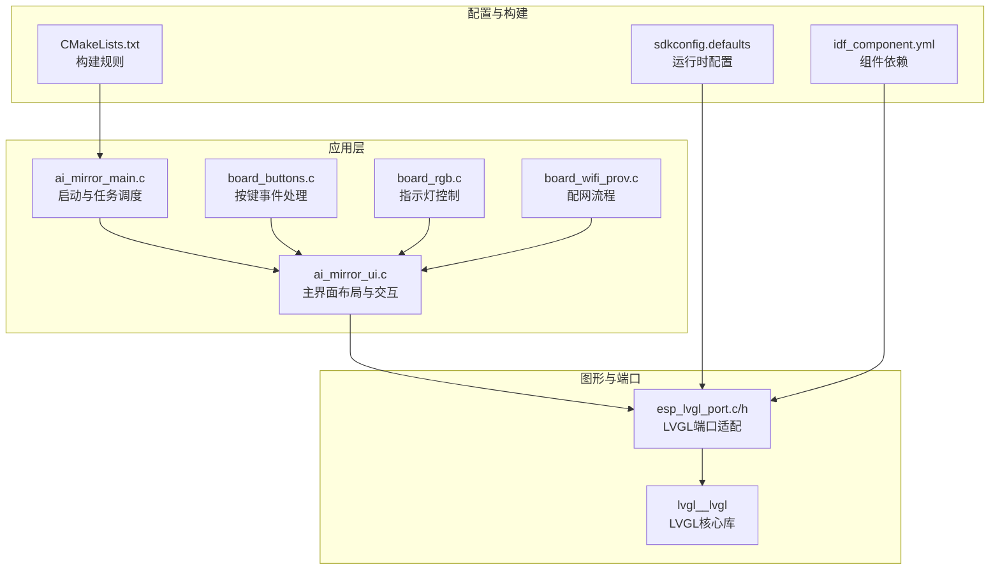
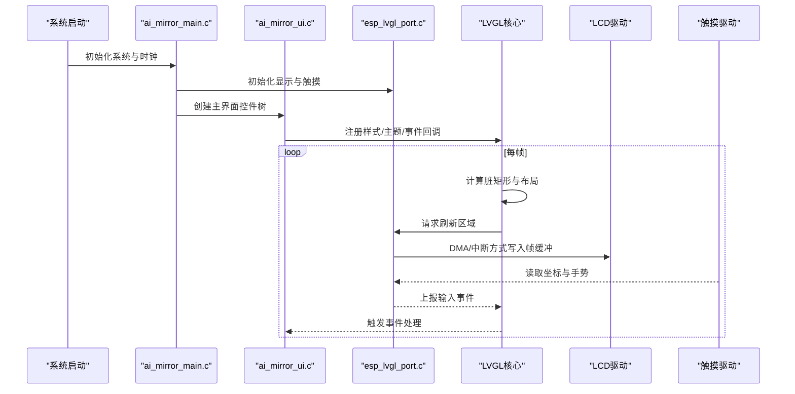
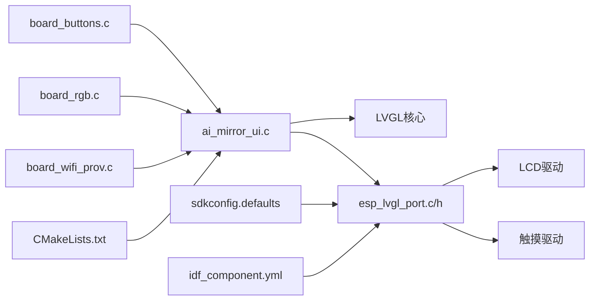

# 主界面布局设计

<cite>
**本文引用的文件**   
- [ai_mirror_main.c](file://Firmware/esp32_ai_mirror/main/ai_mirror_main.c)
- [ai_mirror_ui.c](file://Firmware/esp32_ai_mirror/main/ai_mirror_ui.c)
- [board_buttons.c](file://Firmware/esp32_ai_mirror/main/board_buttons.c)
- [board_buttons.h](file://Firmware/esp32_ai_mirror/main/board_buttons.h)
- [board_rgb.c](file://Firmware/esp32_ai_mirror/main/board_rgb.c)
- [board_wifi_prov.c](file://Firmware/esp32_ai_mirror/main/board_wifi_prov.c)
- [CMakeLists.txt](file://Firmware/esp32_ai_mirror/main/CMakeLists.txt)
- [Kconfig.projbuild](file://Firmware/esp32_ai_mirror/main/Kconfig.projbuild)
- [idf_component.yml](file://Firmware/esp32_ai_mirror/main/idf_component.yml)
- [sdkconfig.defaults](file://Firmware/esp32_ai_mirror/sdkconfig.defaults)
- [README.md](file://Firmware/esp32_ai_mirror/README.md)
- [esp_lvgl_port.c](file://Firmware/esp32_ai_mirror/managed_components/espressif__esp_lvgl_port/esp_lvgl_port.c)
- [esp_lvgl_port.h](file://Firmware/esp32_ai_mirror/managed_components/espressif__esp_lvgl_port/include/esp_lvgl_port.h)
- [performance.md](file://Firmware/esp32_ai_mirror/managed_components/espressif__esp_lvgl_port/docs/performance.md)
- [lv_conf_template.h](file://Firmware/esp32_ai_mirror/managed_components/lvgl__lvgl/lv_conf_template.h)
- [display_rotation](file://Firmware/esp32_ai_mirror/managed_components/espressif__esp-box/examples/display_rotation)
</cite>

## 目录
1. [简介](#简介)
2. [项目结构](#项目结构)
3. [核心组件](#核心组件)
4. [架构总览](#架构总览)
5. [详细组件分析](#详细组件分析)
6. [依赖关系分析](#依赖关系分析)
7. [性能与内存优化](#性能与内存优化)
8. [故障排查指南](#故障排查指南)
9. [结论](#结论)
10. [附录](#附录)

## 简介
本文件聚焦于ESP32 AI镜像项目的主界面布局设计，围绕LVGL在ESP32上的实现，系统阐述屏幕分区结构、组件定位策略、响应式布局方案、旋转适配、内存与渲染优化、调试工具与可视化配置方法，以及自定义布局组件的开发指南与最佳实践。文档面向不同技术背景的读者，力求以循序渐进的方式呈现从架构到落地的完整知识体系。

## 项目结构
本项目采用分层组织：应用层（main）负责UI构建与业务逻辑；组件层（managed_components）提供LVGL图形库与ESP-LVGL端口适配；BSP与外设驱动位于其他组件中。主界面布局由应用层UI模块通过LVGL API创建控件树，并通过esp_lvgl_port桥接显示与触摸输入。

图表来源
- [ai_mirror_main.c](file://Firmware/esp32_ai_mirror/main/ai_mirror_main.c)
- [ai_mirror_ui.c](file://Firmware/esp32_ai_mirror/main/ai_mirror_ui.c)
- [esp_lvgl_port.c](file://Firmware/esp32_ai_mirror/managed_components/espressif__esp_lvgl_port/esp_lvgl_port.c)
- [esp_lvgl_port.h](file://Firmware/esp32_ai_mirror/managed_components/espressif__esp_lvgl_port/include/esp_lvgl_port.h)
- [sdkconfig.defaults](file://Firmware/esp32_ai_mirror/sdkconfig.defaults)
- [idf_component.yml](file://Firmware/esp32_ai_mirror/main/idf_component.yml)
- [CMakeLists.txt](file://Firmware/esp32_ai_mirror/main/CMakeLists.txt)

章节来源
- [README.md](file://Firmware/esp32_ai_mirror/README.md)
- [idf_component.yml](file://Firmware/esp32_ai_mirror/main/idf_component.yml)
- [CMakeLists.txt](file://Firmware/esp32_ai_mirror/main/CMakeLists.txt)

## 核心组件
- 应用入口与任务管理：负责初始化系统、外设、LVGL与UI，并调度主循环与后台任务。
- UI布局与交互：基于LVGL构建主界面控件树，处理页面切换、动画与用户输入。
- 输入与事件：按键、触摸事件采集与分发，联动UI状态更新。
- LVGL端口适配：封装显示刷新、帧缓冲、触摸读取等底层接口，向上暴露统一API。
- 配置与构建：通过sdkconfig与idf_component管理编译选项、组件依赖与运行时参数。

章节来源
- [ai_mirror_main.c](file://Firmware/esp32_ai_mirror/main/ai_mirror_main.c)
- [ai_mirror_ui.c](file://Firmware/esp32_ai_mirror/main/ai_mirror_ui.c)
- [board_buttons.c](file://Firmware/esp32_ai_mirror/main/board_buttons.c)
- [board_buttons.h](file://Firmware/esp32_ai_mirror/main/board_buttons.h)
- [esp_lvgl_port.c](file://Firmware/esp32_ai_mirror/managed_components/espressif__esp_lvgl_port/esp_lvgl_port.c)
- [esp_lvgl_port.h](file://Firmware/esp32_ai_mirror/managed_components/espressif__esp_lvgl_port/include/esp_lvgl_port.h)

## 架构总览
下图展示主界面从启动到渲染的端到端流程，包括LVGL对象树构建、显示刷新与触摸输入闭环。

图表来源
- [ai_mirror_main.c](file://Firmware/esp32_ai_mirror/main/ai_mirror_main.c)
- [ai_mirror_ui.c](file://Firmware/esp32_ai_mirror/main/ai_mirror_ui.c)
- [esp_lvgl_port.c](file://Firmware/esp32_ai_mirror/managed_components/espressif__esp_lvgl_port/esp_lvgl_port.c)
- [esp_lvgl_port.h](file://Firmware/esp32_ai_mirror/managed_components/espressif__esp_lvgl_port/include/esp_lvgl_port.h)

## 详细组件分析

### 主界面布局与分区结构
- 屏幕分区策略
  - 顶部信息区：时间、网络状态、电量等关键信息常驻。
  - 中部内容区：主要交互与数据展示区域，支持滚动与分页。
  - 底部操作区：常用功能按钮与快捷入口。
  - 侧边或浮动面板：设置、日志、调试信息等按需展开。
- 组件定位策略
  - 使用LVGL的布局管理器（如flex/grid）进行自适应排列，避免硬编码坐标。
  - 通过对齐与间距属性保证在不同分辨率下的视觉一致性。
  - 对动态内容区域设置最小尺寸与最大滚动范围，防止溢出。
- 响应式布局实现
  - 根据屏幕宽高比与可用空间动态调整控件尺寸与排版。
  - 针对横竖屏切换，提供两套布局模板或统一的约束布局。
  - 文本与图标按DPI缩放，确保可读性与美观性。

章节来源
- [ai_mirror_ui.c](file://Firmware/esp32_ai_mirror/main/ai_mirror_ui.c)
- [lv_conf_template.h](file://Firmware/esp32_ai_mirror/managed_components/lvgl__lvgl/lv_conf_template.h)

### 屏幕旋转支持与多分辨率适配
- 旋转支持
  - 通过LVGL与端口配置启用旋转，并在显示初始化时设置方向。
  - 事件坐标系随旋转同步变换，保证触摸与手势正确映射。
- 多分辨率适配
  - 定义基准分辨率与缩放因子，按比例换算控件尺寸与字体大小。
  - 使用LVGL的主题与样式系统集中管理颜色、边框与阴影。
  - 图片资源按分辨率提供多套，或在运行时进行裁剪与缩放。

章节来源
- [esp_lvgl_port.c](file://Firmware/esp32_ai_mirror/managed_components/espressif__esp_lvgl_port/esp_lvgl_port.c)
- [esp_lvgl_port.h](file://Firmware/esp32_ai_mirror/managed_components/espressif__esp_lvgl_port/include/esp_lvgl_port.h)
- [display_rotation](file://Firmware/esp32_ai_mirror/managed_components/espressif__esp-box/examples/display_rotation)

### 输入事件与交互流程
- 按键与触摸
  - 按键事件通过board_buttons采集并转换为LVGL事件。
  - 触摸事件经端口适配后上报给LVGL，支持点击、滑动、长按等手势。
- 事件分发与处理
  - UI层注册事件回调，根据控件ID与事件类型执行相应逻辑。
  - 对于复杂交互，采用状态机管理页面与子界面切换。

章节来源
- [board_buttons.c](file://Firmware/esp32_ai_mirror/main/board_buttons.c)
- [board_buttons.h](file://Firmware/esp32_ai_mirror/main/board_buttons.h)
- [ai_mirror_ui.c](file://Firmware/esp32_ai_mirror/main/ai_mirror_ui.c)

### 显示刷新与渲染管线
- 帧缓冲与DMA
  - 使用双缓冲或行缓冲减少撕裂与卡顿。
  - 通过DMA批量传输像素数据，降低CPU占用。
- 脏矩形与增量刷新
  - LVGL自动计算需要重绘的区域，仅刷新变化部分。
  - 合理划分控件层级与背景，减少不必要的重绘。
- 动画与过渡
  - 使用LVGL内置动画API实现平滑过渡，避免频繁全量刷新。

章节来源
- [esp_lvgl_port.c](file://Firmware/esp32_ai_mirror/managed_components/espressif__esp_lvgl_port/esp_lvgl_port.c)
- [performance.md](file://Firmware/esp32_ai_mirror/managed_components/espressif__esp_lvgl_port/docs/performance.md)

### 配置与构建
- sdkconfig.defaults
  - 配置LVGL版本、缓冲区大小、刷新频率与特性开关。
- idf_component.yml
  - 声明LVGL与端口组件依赖，锁定版本以确保可重复构建。
- CMakeLists.txt
  - 定义源文件集合、包含路径与链接选项。

章节来源
- [sdkconfig.defaults](file://Firmware/esp32_ai_mirror/sdkconfig.defaults)
- [idf_component.yml](file://Firmware/esp32_ai_mirror/main/idf_component.yml)
- [CMakeLists.txt](file://Firmware/esp32_ai_mirror/main/CMakeLists.txt)

## 依赖关系分析
下图展示主界面相关模块之间的依赖关系，强调UI与端口、输入与显示的耦合点。

图表来源
- [ai_mirror_ui.c](file://Firmware/esp32_ai_mirror/main/ai_mirror_ui.c)
- [esp_lvgl_port.c](file://Firmware/esp32_ai_mirror/managed_components/espressif__esp_lvgl_port/esp_lvgl_port.c)
- [esp_lvgl_port.h](file://Firmware/esp32_ai_mirror/managed_components/espressif__esp_lvgl_port/include/esp_lvgl_port.h)
- [board_buttons.c](file://Firmware/esp32_ai_mirror/main/board_buttons.c)
- [board_rgb.c](file://Firmware/esp32_ai_mirror/main/board_rgb.c)
- [board_wifi_prov.c](file://Firmware/esp32_ai_mirror/main/board_wifi_prov.c)
- [sdkconfig.defaults](file://Firmware/esp32_ai_mirror/sdkconfig.defaults)
- [idf_component.yml](file://Firmware/esp32_ai_mirror/main/idf_component.yml)
- [CMakeLists.txt](file://Firmware/esp32_ai_mirror/main/CMakeLists.txt)

章节来源
- [idf_component.yml](file://Firmware/esp32_ai_mirror/main/idf_component.yml)
- [CMakeLists.txt](file://Firmware/esp32_ai_mirror/main/CMakeLists.txt)

## 性能与内存优化
- 内存管理
  - 合理设置LVGL缓冲区大小，平衡内存占用与刷新性能。
  - 使用静态分配与对象池减少碎片化，避免频繁malloc/free。
  - 图片资源压缩与按需加载，降低Flash与RAM压力。
- 渲染优化
  - 启用增量刷新与脏矩形，减少无效绘制。
  - 合并相邻控件的背景绘制，降低调用开销。
  - 限制动画频率与复杂度，避免阻塞主循环。
- 输入与事件
  - 去抖与节流处理，减少高频事件带来的抖动与重绘。
  - 将耗时操作放入后台任务，保持UI流畅。
- 调试与测量
  - 使用LVGL性能统计与端口日志定位瓶颈。
  - 通过示波器或逻辑分析仪观察DMA与中断时序。

章节来源
- [performance.md](file://Firmware/esp32_ai_mirror/managed_components/espressif__esp_lvgl_port/docs/performance.md)
- [esp_lvgl_port.c](file://Firmware/esp32_ai_mirror/managed_components/espressif__esp_lvgl_port/esp_lvgl_port.c)
- [sdkconfig.defaults](file://Firmware/esp32_ai_mirror/sdkconfig.defaults)

## 故障排查指南
- 常见问题
  - 显示花屏或撕裂：检查帧缓冲配置与DMA传输参数。
  - 触摸漂移或无响应：校准触摸坐标与事件映射。
  - 界面卡顿：分析LVGL刷新统计，减少重绘区域与动画复杂度。
  - 内存不足：调整缓冲区大小，释放未使用的资源。
- 调试工具
  - 启用LVGL调试输出与性能计数器。
  - 使用串口日志记录关键事件与状态。
  - 借助IDE的断点与变量监视定位问题。
- 恢复策略
  - 提供复位与回退页面，保障用户体验。
  - 异常捕获与优雅降级，避免崩溃。

章节来源
- [esp_lvgl_port.c](file://Firmware/esp32_ai_mirror/managed_components/espressif__esp_lvgl_port/esp_lvgl_port.c)
- [performance.md](file://Firmware/esp32_ai_mirror/managed_components/espressif__esp_lvgl_port/docs/performance.md)

## 结论
通过对主界面布局的系统化设计与优化，项目在ESP32平台上实现了稳定、流畅且可维护的LVGL界面。合理的分区与定位策略、完善的旋转与分辨率适配、高效的内存与渲染优化，以及完善的调试与故障排查手段，共同保障了用户体验与开发效率。后续可进一步引入可视化配置工具与自动化测试，提升迭代速度与质量。

## 附录
- 自定义布局组件开发指南
  - 继承LVGL基础控件，扩展属性与方法。
  - 使用LVGL的事件机制与样式系统，确保一致性与可复用性。
  - 提供配置接口与默认值，便于在不同场景下快速集成。
- 可视化配置方法
  - 使用LVGL官方或第三方可视化工具生成控件树与样式。
  - 将生成的代码纳入构建流程，结合版本管理进行协作。
- 最佳实践
  - 优先使用布局管理器而非绝对坐标。
  - 集中管理主题与样式，避免分散修改。
  - 对大图与大字体进行资源管理与缓存策略优化。

[本节为概念性内容，不直接分析具体文件]