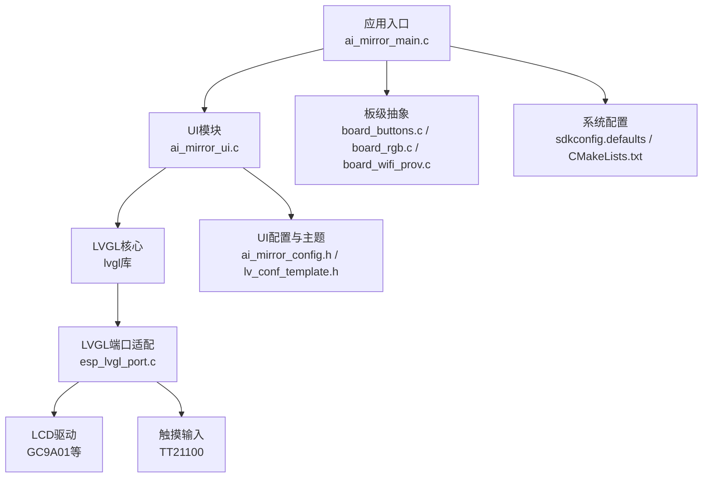
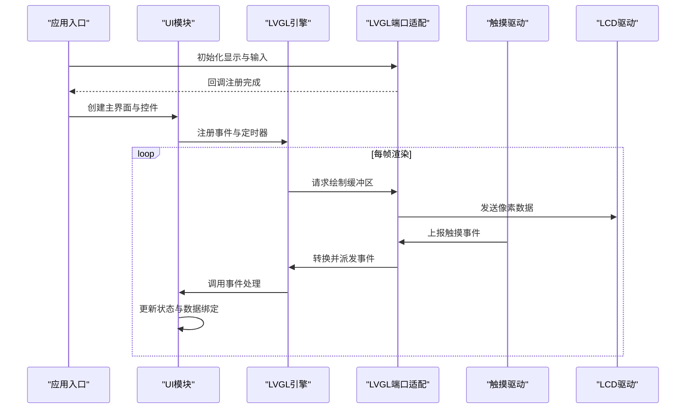
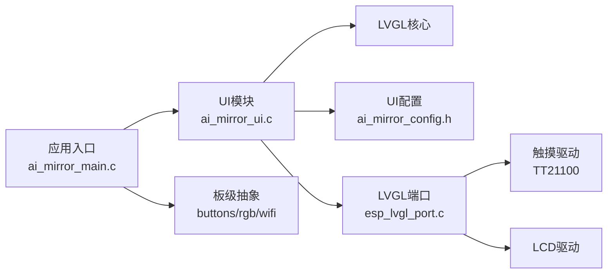

# 主界面设计

<cite>
**本文引用的文件**   
- [ai_mirror_main.c](file://Firmware/esp32_ai_mirror/main/ai_mirror_main.c)
- [ai_mirror_ui.c](file://Firmware/esp32_ai_mirror/main/ai_mirror_ui.c)
- [ai_mirror_config.h](file://Firmware/esp32_ai_mirror/main/ai_mirror_config.h)
- [board_buttons.c](file://Firmware/esp32_ai_mirror/main/board_buttons.c)
- [board_buttons.h](file://Firmware/esp32_ai_mirror/main/board_buttons.h)
- [board_rgb.c](file://Firmware/esp32_ai_mirror/main/board_rgb.c)
- [board_rgb.h](file://Firmware/esp32_ai_mirror/main/board_rgb.h)
- [board_wifi_prov.c](file://Firmware/esp32_ai_mirror/main/board_wifi_prov.c)
- [board_wifi_prov.h](file://Firmware/esp32_ai_mirror/main/board_wifi_prov.h)
- [CMakeLists.txt](file://Firmware/esp32_ai_mirror/CMakeLists.txt)
- [sdkconfig.defaults](file://Firmware/esp32_ai_mirror/sdkconfig.defaults)
- [lv_conf_template.h](file://Firmware/esp32_ai_mirror/managed_components/lvgl__lvgl/lv_conf_template.h)
- [esp_lvgl_port.c](file://Firmware/esp32_ai_mirror/managed_components/espressif__esp_lvgl_port/esp_lvgl_port.c)
- [esp_lcd_touch_tt21100.c](file://Firmware/esp32_ai_mirror/managed_components/espressif__esp_lcd_touch_tt21100/esp_lcd_touch_tt21100.c)
- [README.md](file://Firmware/esp32_ai_mirror/README.md)
</cite>

## 目录
1. [简介](#简介)
2. [项目结构](#项目结构)
3. [核心组件](#核心组件)
4. [架构总览](#架构总览)
5. [详细组件分析](#详细组件分析)
6. [依赖关系分析](#依赖关系分析)
7. [性能考虑](#性能考虑)
8. [故障排查指南](#故障排查指南)
9. [结论](#结论)
10. [附录](#附录)

## 简介
本文件面向AI镜子设备的主界面设计与实现，聚焦于主屏幕的布局、关键视觉元素（时间显示、天气信息、用户头像等）、状态管理与数据绑定机制、触摸交互与反馈、主题与颜色配置、多语言文本与字体渲染优化，以及性能优化与内存管理策略。文档以代码级为依据，结合LVGL图形框架与ESP-IDF平台特性，提供从高层到细节的系统化说明，帮助开发者快速理解并扩展主界面功能。

## 项目结构
本项目基于ESP-IDF构建，UI层采用LVGL并通过esp_lvgl_port进行端口适配，输入由触摸驱动（如TT21100）提供，系统初始化与任务调度在main中完成，UI逻辑集中在ui模块，板级外设（按键、RGB灯、WiFi配网）通过board_*模块封装。

图表来源
- [ai_mirror_main.c](file://Firmware/esp32_ai_mirror/main/ai_mirror_main.c)
- [ai_mirror_ui.c](file://Firmware/esp32_ai_mirror/main/ai_mirror_ui.c)
- [esp_lvgl_port.c](file://Firmware/esp32_ai_mirror/managed_components/espressif__esp_lvgl_port/esp_lvgl_port.c)
- [esp_lcd_touch_tt21100.c](file://Firmware/esp32_ai_mirror/managed_components/espressif__esp_lcd_touch_tt21100/esp_lcd_touch_tt21100.c)
- [sdkconfig.defaults](file://Firmware/esp32_ai_mirror/sdkconfig.defaults)
- [CMakeLists.txt](file://Firmware/esp32_ai_mirror/CMakeLists.txt)

章节来源
- [README.md](file://Firmware/esp32_ai_mirror/README.md)
- [CMakeLists.txt](file://Firmware/esp32_ai_mirror/CMakeLists.txt)
- [sdkconfig.defaults](file://Firmware/esp32_ai_mirror/sdkconfig.defaults)

## 核心组件
- 应用入口与任务调度：负责系统初始化、LVGL初始化、任务创建与事件循环。
- UI模块：负责主界面布局、控件创建、数据绑定、动画与页面切换。
- 板级抽象：封装按键、RGB指示灯、WiFi配网流程，为上层提供统一接口。
- LVGL与端口适配：提供GUI引擎、渲染管线、事件分发；esp_lvgl_port桥接LVGL与ESP-IDF HAL。
- 输入子系统：触摸驱动采集坐标与手势，转换为LVGL事件。
- 配置与主题：集中管理分辨率、刷新率、颜色深度、字体、主题色等。

章节来源
- [ai_mirror_main.c](file://Firmware/esp32_ai_mirror/main/ai_mirror_main.c)
- [ai_mirror_ui.c](file://Firmware/esp32_ai_mirror/main/ai_mirror_ui.c)
- [board_buttons.c](file://Firmware/esp32_ai_mirror/main/board_buttons.c)
- [board_rgb.c](file://Firmware/esp32_ai_mirror/main/board_rgb.c)
- [board_wifi_prov.c](file://Firmware/esp32_ai_mirror/main/board_wifi_prov.c)
- [esp_lvgl_port.c](file://Firmware/esp32_ai_mirror/managed_components/espressif__esp_lvgl_port/esp_lvgl_port.c)
- [esp_lcd_touch_tt21100.c](file://Firmware/esp32_ai_mirror/managed_components/espressif__esp_lcd_touch_tt21100/esp_lcd_touch_tt21100.c)

## 架构总览
主界面运行在LVGL之上，通过esp_lvgl_port将LVGL的事件模型与ESP-IDF的输入/输出驱动对接。UI模块维护界面状态与数据源，定时任务更新时间与天气，触摸事件触发交互逻辑，板级抽象提供硬件能力。

图表来源
- [ai_mirror_main.c](file://Firmware/esp32_ai_mirror/main/ai_mirror_main.c)
- [ai_mirror_ui.c](file://Firmware/esp32_ai_mirror/main/ai_mirror_ui.c)
- [esp_lvgl_port.c](file://Firmware/esp32_ai_mirror/managed_components/espressif__esp_lvgl_port/esp_lvgl_port.c)
- [esp_lcd_touch_tt21100.c](file://Firmware/esp32_ai_mirror/managed_components/espressif__esp_lcd_touch_tt21100/esp_lcd_touch_tt21100.c)

## 详细组件分析

### 主界面布局与视觉元素
- 布局策略：采用LVGL的容器与布局管理器（如列/行布局、网格），将时间、天气、头像、快捷操作等区域划分清晰，保证在不同分辨率下自适应。
- 时间显示：使用文本控件或数字时钟样式，按秒级定时器刷新，支持12/24小时制与本地化格式。
- 天气信息：通过网络服务获取后，以图标+文字形式展示，包含温度、天气状况、空气质量等字段。
- 用户头像：圆形裁剪图像控件，支持默认头像与用户自定义图片加载，缓存避免重复解码。
- 其他元素：底部导航栏、状态栏（电量、信号）、通知提示等。

章节来源
- [ai_mirror_ui.c](file://Firmware/esp32_ai_mirror/main/ai_mirror_ui.c)
- [ai_mirror_config.h](file://Firmware/esp32_ai_mirror/main/ai_mirror_config.h)

### 时间显示实现
- 数据源：系统时间或NTP同步，周期性更新。
- 刷新机制：LVGL定时器或任务回调，避免阻塞UI线程。
- 格式化：根据地区设置选择日期与时间格式，支持多语言字符串。
- 性能：仅更新变化部分，减少重绘区域。

章节来源
- [ai_mirror_ui.c](file://Firmware/esp32_ai_mirror/main/ai_mirror_ui.c)
- [sdkconfig.defaults](file://Firmware/esp32_ai_mirror/sdkconfig.defaults)

### 天气信息实现
- 数据来源：HTTP请求或MQTT订阅，解析JSON后映射到UI字段。
- 缓存策略：本地缓存最近一次结果，失败时回退到上次有效值。
- 错误处理：网络异常时显示占位符或重试按钮。
- 更新频率：合理间隔拉取，避免频繁请求。

章节来源
- [ai_mirror_ui.c](file://Firmware/esp32_ai_mirror/main/ai_mirror_ui.c)
- [board_wifi_prov.c](file://Firmware/esp32_ai_mirror/main/board_wifi_prov.c)

### 用户头像实现
- 资源管理：预置默认头像，用户头像下载后缓存至SPIFFS/LittleFS。
- 解码优化：使用JPEG/PNG解码器，按需缩放至目标尺寸。
- 显示优化：启用LVGL图像缓存，避免重复解码。
- 隐私保护：敏感信息不持久化，退出时清理临时缓冲。

章节来源
- [ai_mirror_ui.c](file://Firmware/esp32_ai_mirror/main/ai_mirror_ui.c)
- [ai_mirror_config.h](file://Firmware/esp32_ai_mirror/main/ai_mirror_config.h)

### 界面状态管理与数据绑定
- 状态模型：定义界面状态枚举（空闲、加载中、错误、对话中等），由UI模块维护。
- 数据绑定：控件属性与数据源解耦，通过观察者模式或回调更新。
- 事务性更新：批量更新避免闪烁，必要时使用双缓冲。
- 持久化：关键状态（如主题、语言）保存至非易失存储。

章节来源
- [ai_mirror_ui.c](file://Firmware/esp32_ai_mirror/main/ai_mirror_ui.c)
- [ai_mirror_config.h](file://Firmware/esp32_ai_mirror/main/ai_mirror_config.h)

### 触摸交互逻辑与用户反馈
- 事件捕获：触摸驱动上报坐标与手势，经端口适配转为LVGL事件。
- 交互响应：点击、长按、滑动等事件映射到业务逻辑。
- 反馈效果：按钮高亮、动画过渡、RGB灯提示音或震动（若可用）。
- 防抖与过滤：去抖动、边界检测、多点触控处理。

章节来源
- [board_buttons.c](file://Firmware/esp32_ai_mirror/main/board_buttons.c)
- [board_rgb.c](file://Firmware/esp32_ai_mirror/main/board_rgb.c)
- [esp_lcd_touch_tt21100.c](file://Firmware/esp32_ai_mirror/managed_components/espressif__esp_lcd_touch_tt21100/esp_lcd_touch_tt21100.c)
- [esp_lvgl_port.c](file://Firmware/esp32_ai_mirror/managed_components/espressif__esp_lvgl_port/esp_lvgl_port.c)

### 主题定制与颜色配置
- 主题结构：定义浅色/深色主题，包含背景、前景、强调色、阴影等。
- 动态切换：运行时切换主题，全局更新样式表。
- 配置来源：配置文件或用户设置，支持导入导出。
- 兼容性：确保对比度符合无障碍标准。

章节来源
- [ai_mirror_config.h](file://Firmware/esp32_ai_mirror/main/ai_mirror_config.h)
- [lv_conf_template.h](file://Firmware/esp32_ai_mirror/managed_components/lvgl__lvgl/lv_conf_template.h)

### 多语言文本与字体渲染优化
- 多语言：字符串资源按语言分文件，运行时切换语言包。
- 字体优化：按需加载字符集，合并常用字以减少内存占用。
- 渲染优化：启用子像素渲染、抗锯齿、字体缓存。
- 国际化：日期、时间、数字格式本地化。

章节来源
- [ai_mirror_ui.c](file://Firmware/esp32_ai_mirror/main/ai_mirror_ui.c)
- [lv_conf_template.h](file://Firmware/esp32_ai_mirror/managed_components/lvgl__lvgl/lv_conf_template.h)

### 性能优化技巧与内存管理策略
- 渲染优化：启用双缓冲、增量更新、裁剪区域。
- 内存管理：对象池复用、图像缓存限制、及时释放临时缓冲。
- 任务调度：UI与后台任务分离，避免阻塞。
- 功耗优化：休眠唤醒、降低刷新率、关闭非必要动画。

章节来源
- [esp_lvgl_port.c](file://Firmware/esp32_ai_mirror/managed_components/espressif__esp_lvgl_port/esp_lvgl_port.c)
- [sdkconfig.defaults](file://Firmware/esp32_ai_mirror/sdkconfig.defaults)

## 依赖关系分析
UI模块依赖LVGL与端口适配，输入依赖触摸驱动，系统配置影响行为与性能。

图表来源
- [ai_mirror_ui.c](file://Firmware/esp32_ai_mirror/main/ai_mirror_ui.c)
- [ai_mirror_main.c](file://Firmware/esp32_ai_mirror/main/ai_mirror_main.c)
- [esp_lvgl_port.c](file://Firmware/esp32_ai_mirror/managed_components/espressif__esp_lvgl_port/esp_lvgl_port.c)
- [esp_lcd_touch_tt21100.c](file://Firmware/esp32_ai_mirror/managed_components/espressif__esp_lcd_touch_tt21100/esp_lcd_touch_tt21100.c)

章节来源
- [CMakeLists.txt](file://Firmware/esp32_ai_mirror/CMakeLists.txt)
- [sdkconfig.defaults](file://Firmware/esp32_ai_mirror/sdkconfig.defaults)

## 性能考虑
- 渲染路径：确保LVGL缓冲区大小与分辨率匹配，启用硬件加速（若可用）。
- 事件处理：避免在事件回调中进行耗时操作，使用队列异步处理。
- 资源加载：延迟加载大图与字体，使用压缩格式。
- 监控与调试：添加性能计数器与日志，定位瓶颈。

[本节为通用指导，无需特定文件引用]

## 故障排查指南
- 显示异常：检查LCD驱动初始化、缓冲区配置、刷新回调。
- 触摸无响应：确认触摸驱动初始化、中断配置、事件映射。
- 界面卡顿：分析CPU占用、内存碎片、渲染频率。
- 主题失效：验证样式表加载、颜色常量定义、运行时切换逻辑。
- 多语言错乱：检查语言包完整性、字符集覆盖、本地化格式。

章节来源
- [board_buttons.c](file://Firmware/esp32_ai_mirror/main/board_buttons.c)
- [board_rgb.c](file://Firmware/esp32_ai_mirror/main/board_rgb.c)
- [board_wifi_prov.c](file://Firmware/esp32_ai_mirror/main/board_wifi_prov.c)
- [esp_lvgl_port.c](file://Firmware/esp32_ai_mirror/managed_components/espressif__esp_lvgl_port/esp_lvgl_port.c)

## 结论
AI镜子主界面以LVGL为核心，结合ESP-IDF平台能力，实现了时间、天气、头像等关键功能的稳定展示与交互。通过合理的状态管理、数据绑定、触摸事件处理与主题定制，提供了良好的用户体验。性能优化与内存管理策略确保了在资源受限环境下的流畅运行。未来可进一步扩展个性化设置、更多可视化组件与智能交互能力。

[本节为总结性内容，无需特定文件引用]

## 附录
- 配置项参考：查看sdkconfig.defaults与lv_conf_template.h中的关键选项。
- 构建与部署：参考CMakeLists.txt与项目根目录README。
- 扩展开发：在ai_mirror_ui.c中添加新控件与逻辑，遵循现有模块化结构。

章节来源
- [sdkconfig.defaults](file://Firmware/esp32_ai_mirror/sdkconfig.defaults)
- [lv_conf_template.h](file://Firmware/esp32_ai_mirror/managed_components/lvgl__lvgl/lv_conf_template.h)
- [CMakeLists.txt](file://Firmware/esp32_ai_mirror/CMakeLists.txt)
- [README.md](file://Firmware/esp32_ai_mirror/README.md)