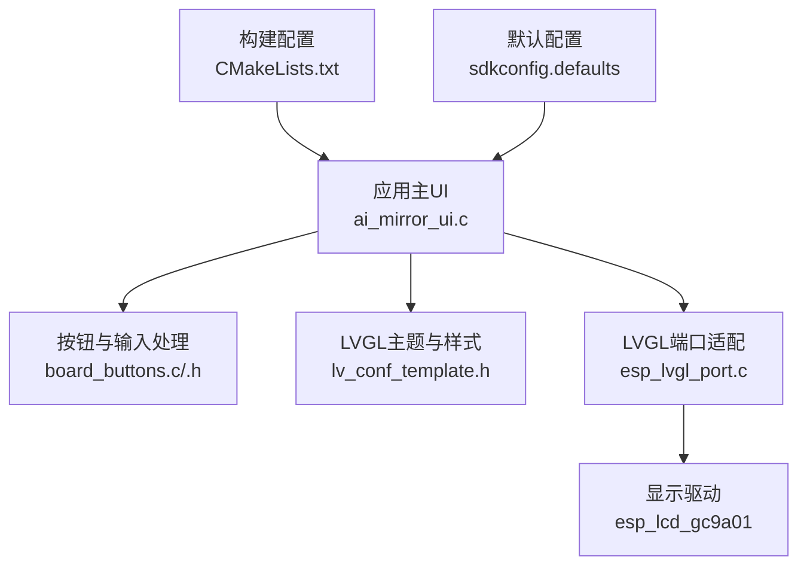
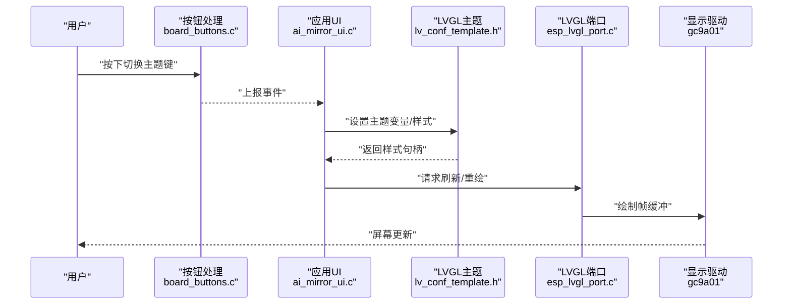
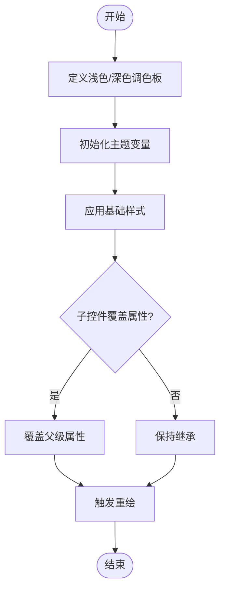
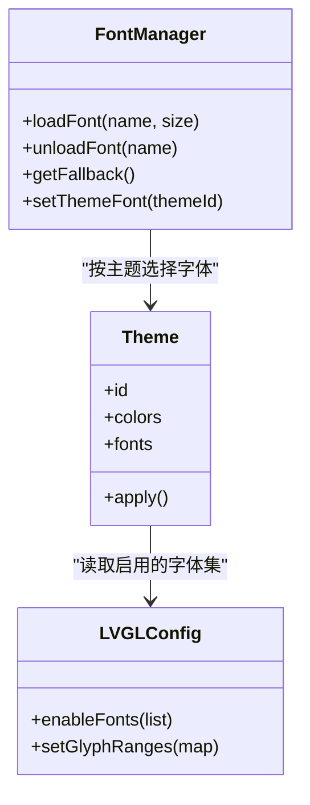
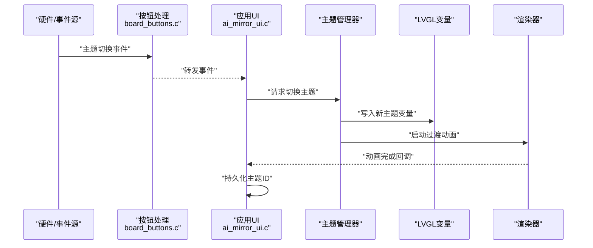
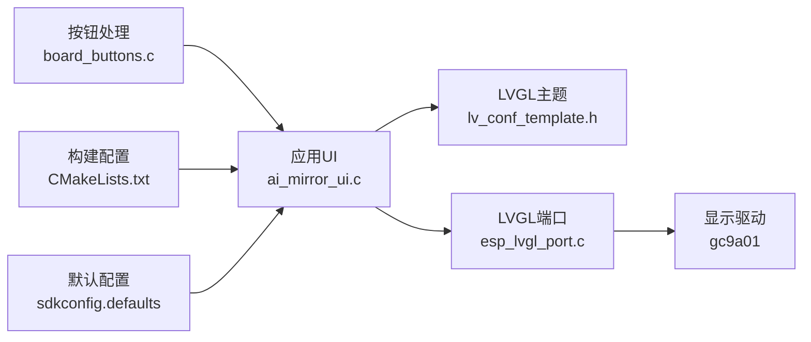

# 主题定制系统

<cite>
**本文引用的文件**   
- [ai_mirror_ui.c](file://Firmware/esp32_ai_mirror/main/ai_mirror_ui.c)
- [ai_mirror_config.h](file://Firmware/esp32_ai_mirror/main/ai_mirror_config.h)
- [board_buttons.c](file://Firmware/esp32_ai_mirror/main/board_buttons.c)
- [board_buttons.h](file://Firmware/esp32_ai_mirror/main/board_buttons.h)
- [lv_conf_template.h](file://Firmware/esp32_ai_mirror/managed_components/lvgl__lvgl/lv_conf_template.h)
- [esp_lvgl_port.c](file://Firmware/esp32_ai_mirror/managed_components/espressif__esp_lvgl_port/esp_lvgl_port.c)
- [CMakeLists.txt](file://Firmware/esp32_ai_mirror/CMakeLists.txt)
- [sdkconfig.defaults](file://Firmware/esp32_ai_mirror/sdkconfig.defaults)
</cite>

## 目录
1. [简介](#简介)
2. [项目结构](#项目结构)
3. [核心组件](#核心组件)
4. [架构总览](#架构总览)
5. [详细组件分析](#详细组件分析)
6. [依赖关系分析](#依赖关系分析)
7. [性能考虑](#性能考虑)
8. [故障排查指南](#故障排查指南)
9. [结论](#结论)
10. [附录](#附录)

## 简介
本文件面向ESP32 AI镜像项目的主题定制系统，围绕颜色方案定义、字体配置与样式继承机制展开，说明深色/浅色模式切换逻辑、主题资源组织与管理策略、动态切换与平滑过渡实现方法，并提供自定义主题创建指南、样式模板建议以及兼容性测试与回退机制。文档力求在嵌入式LVGL环境下，帮助开发者快速搭建可维护、可扩展的主题体系。

## 项目结构
本项目基于ESP-IDF与LVGL构建UI层，主题相关能力主要分布在以下位置：
- 应用主UI模块：负责界面初始化、主题变量设置、事件处理与刷新
- 配置头文件：集中管理显示、输入、编译选项等，便于按目标板型裁剪
- LVGL库与端口适配：提供主题API、样式系统与显示驱动桥接
- 构建与默认配置：通过CMake与sdkconfig控制是否启用主题特性与字体资源

图表来源
- [ai_mirror_ui.c](file://Firmware/esp32_ai_mirror/main/ai_mirror_ui.c)
- [board_buttons.c](file://Firmware/esp32_ai_mirror/main/board_buttons.c)
- [board_buttons.h](file://Firmware/esp32_ai_mirror/main/board_buttons.h)
- [lv_conf_template.h](file://Firmware/esp32_ai_mirror/managed_components/lvgl__lvgl/lv_conf_template.h)
- [esp_lvgl_port.c](file://Firmware/esp32_ai_mirror/managed_components/espressif__esp_lvgl_port/esp_lvgl_port.c)

章节来源
- [CMakeLists.txt](file://Firmware/esp32_ai_mirror/CMakeLists.txt)
- [sdkconfig.defaults](file://Firmware/esp32_ai_mirror/sdkconfig.defaults)

## 核心组件
- 主题变量与样式表
  - 使用LVGL的“主题变量”机制（如背景色、文本色、边框色、阴影、圆角）统一控制外观
  - 通过“样式继承链”让基础样式向子控件传递，减少重复定义
- 字体配置
  - 在LVGL配置中按需启用字体集，避免占用过多Flash/内存
  - 为不同语言与字号准备多套字体，运行时根据主题选择加载
- 颜色方案
  - 定义浅色/深色两套调色板，包含背景、前景、强调、禁用态等语义化颜色
  - 通过变量映射到控件样式，确保一致性
- 主题切换
  - 监听用户输入或系统事件，切换当前主题ID并触发重绘
  - 结合动画与过渡时间实现平滑切换

章节来源
- [ai_mirror_ui.c](file://Firmware/esp32_ai_mirror/main/ai_mirror_ui.c)
- [lv_conf_template.h](file://Firmware/esp32_ai_mirror/managed_components/lvgl__lvgl/lv_conf_template.h)

## 架构总览
下图展示主题系统在应用中的调用路径与数据流：从输入事件到主题切换，再到样式更新与渲染。

图表来源
- [board_buttons.c](file://Firmware/esp32_ai_mirror/main/board_buttons.c)
- [ai_mirror_ui.c](file://Firmware/esp32_ai_mirror/main/ai_mirror_ui.c)
- [lv_conf_template.h](file://Firmware/esp32_ai_mirror/managed_components/lvgl__lvgl/lv_conf_template.h)
- [esp_lvgl_port.c](file://Firmware/esp32_ai_mirror/managed_components/espressif__esp_lvgl_port/esp_lvgl_port.c)

## 详细组件分析

### 颜色方案与样式继承
- 颜色方案定义
  - 将颜色抽象为语义化名称（如“背景”“文本”“强调”“禁用”），分别对应浅色与深色两套值
  - 在主题初始化时，将颜色写入LVGL全局或局部主题变量
- 样式继承机制
  - 定义基础样式（如容器、卡片、按钮基类），子控件自动继承未覆盖的属性
  - 通过层级覆盖实现差异化，避免全量重写

图表来源
- [ai_mirror_ui.c](file://Firmware/esp32_ai_mirror/main/ai_mirror_ui.c)
- [lv_conf_template.h](file://Firmware/esp32_ai_mirror/managed_components/lvgl__lvgl/lv_conf_template.h)

章节来源
- [ai_mirror_ui.c](file://Firmware/esp32_ai_mirror/main/ai_mirror_ui.c)
- [lv_conf_template.h](file://Firmware/esp32_ai_mirror/managed_components/lvgl__lvgl/lv_conf_template.h)

### 字体配置与加载策略
- 字体资源组织
  - 按语言与字号拆分字体文件，仅在需要时加载，降低内存占用
  - 在LVGL配置中启用所需字符集，避免全量引入
- 运行时选择
  - 主题切换时可更换字体族或字号，保证可读性与风格一致
  - 对不支持的字形提供回退字体

图表来源
- [lv_conf_template.h](file://Firmware/esp32_ai_mirror/managed_components/lvgl__lvgl/lv_conf_template.h)
- [ai_mirror_ui.c](file://Firmware/esp32_ai_mirror/main/ai_mirror_ui.c)

章节来源
- [lv_conf_template.h](file://Firmware/esp32_ai_mirror/managed_components/lvgl__lvgl/lv_conf_template.h)
- [ai_mirror_ui.c](file://Firmware/esp32_ai_mirror/main/ai_mirror_ui.c)

### 深色/浅色模式切换逻辑
- 状态存储
  - 使用持久化存储保存当前主题ID，重启后恢复
- 切换流程
  - 接收按键或菜单事件，计算新主题ID
  - 更新主题变量与样式，触发界面刷新
- 平滑过渡
  - 使用LVGL动画接口对关键属性（如背景色、透明度）进行渐变
  - 控制过渡时长与缓动函数，提升体验

图表来源
- [board_buttons.c](file://Firmware/esp32_ai_mirror/main/board_buttons.c)
- [ai_mirror_ui.c](file://Firmware/esp32_ai_mirror/main/ai_mirror_ui.c)
- [lv_conf_template.h](file://Firmware/esp32_ai_mirror/managed_components/lvgl__lvgl/lv_conf_template.h)

章节来源
- [board_buttons.c](file://Firmware/esp32_ai_mirror/main/board_buttons.c)
- [board_buttons.h](file://Firmware/esp32_ai_mirror/main/board_buttons.h)
- [ai_mirror_ui.c](file://Firmware/esp32_ai_mirror/main/ai_mirror_ui.c)

### 主题资源的组织结构与管理策略
- 资源分类
  - 颜色：以语义化命名组织，区分明暗主题
  - 字体：按语言与尺寸分目录，按需加载
  - 图标与图片：按用途分组，支持压缩格式
- 版本与兼容
  - 为每个主题分配版本号，升级时检查兼容性
  - 提供回退主题，确保旧版本仍可运行
- 构建集成
  - 通过CMake将主题资源打包进固件
  - 使用sdkconfig控制可选资源，减小体积

章节来源
- [CMakeLists.txt](file://Firmware/esp32_ai_mirror/CMakeLists.txt)
- [sdkconfig.defaults](file://Firmware/esp32_ai_mirror/sdkconfig.defaults)

### 动态主题切换与平滑过渡实现
- 动态切换
  - 在事件循环中响应主题变更，避免阻塞任务
  - 使用队列或标志位协调UI线程与渲染线程
- 平滑过渡
  - 对背景、文本、边框等关键属性设置动画
  - 合理设置动画时长与插值函数，避免闪烁

章节来源
- [ai_mirror_ui.c](file://Firmware/esp32_ai_mirror/main/ai_mirror_ui.c)
- [lv_conf_template.h](file://Firmware/esp32_ai_mirror/managed_components/lvgl__lvgl/lv_conf_template.h)

### 自定义主题创建指南与样式模板
- 步骤
  - 复制现有主题作为起点，修改颜色与字体
  - 在主题初始化中注册新主题ID与变量映射
  - 添加必要的图标与图片资源
- 模板建议
  - 提供基础样式模板（容器、按钮、列表项）
  - 定义常用布局与间距规范
- 验证
  - 在多种控件组合下预览主题效果
  - 检查对比度与可读性

章节来源
- [ai_mirror_ui.c](file://Firmware/esp32_ai_mirror/main/ai_mirror_ui.c)
- [lv_conf_template.h](file://Firmware/esp32_ai_mirror/managed_components/lvgl__lvgl/lv_conf_template.h)

### 主题兼容性测试与回退机制
- 兼容性测试
  - 在不同分辨率与像素密度设备上验证
  - 检查字体缺失与图片缩放问题
- 回退机制
  - 当新主题加载失败时，自动回退到上一可用主题
  - 记录错误日志以便定位问题

章节来源
- [ai_mirror_ui.c](file://Firmware/esp32_ai_mirror/main/ai_mirror_ui.c)
- [esp_lvgl_port.c](file://Firmware/esp32_ai_mirror/managed_components/espressif__esp_lvgl_port/esp_lvgl_port.c)

## 依赖关系分析
主题系统依赖LVGL主题API与端口适配，同时与应用UI和输入处理紧密耦合。构建配置决定资源是否被包含。

图表来源
- [ai_mirror_ui.c](file://Firmware/esp32_ai_mirror/main/ai_mirror_ui.c)
- [board_buttons.c](file://Firmware/esp32_ai_mirror/main/board_buttons.c)
- [lv_conf_template.h](file://Firmware/esp32_ai_mirror/managed_components/lvgl__lvgl/lv_conf_template.h)
- [esp_lvgl_port.c](file://Firmware/esp32_ai_mirror/managed_components/espressif__esp_lvgl_port/esp_lvgl_port.c)
- [CMakeLists.txt](file://Firmware/esp32_ai_mirror/CMakeLists.txt)
- [sdkconfig.defaults](file://Firmware/esp32_ai_mirror/sdkconfig.defaults)

章节来源
- [CMakeLists.txt](file://Firmware/esp32_ai_mirror/CMakeLists.txt)
- [sdkconfig.defaults](file://Firmware/esp32_ai_mirror/sdkconfig.defaults)

## 性能考虑
- 资源裁剪
  - 仅启用必要字体与图片，减少Flash与RAM占用
- 渲染优化
  - 批量更新主题变量，减少多次重绘
  - 使用部分刷新区域，降低带宽压力
- 动画控制
  - 限制动画数量与时长，避免卡顿
  - 在低电量模式下禁用复杂动画

## 故障排查指南
- 常见问题
  - 主题切换无效：检查事件处理与主题变量写入
  - 字体缺失：确认LVGL配置中启用了相应字符集
  - 颜色异常：核对调色板映射与控件样式覆盖
- 调试手段
  - 打印主题ID与变量值，确认状态正确
  - 逐步禁用动画，定位渲染问题
  - 使用最小化界面复现问题

章节来源
- [ai_mirror_ui.c](file://Firmware/esp32_ai_mirror/main/ai_mirror_ui.c)
- [lv_conf_template.h](file://Firmware/esp32_ai_mirror/managed_components/lvgl__lvgl/lv_conf_template.h)

## 结论
通过语义化的颜色方案、清晰的样式继承与灵活的字体管理，主题定制系统能够在嵌入式环境中提供一致的视觉体验。结合动态切换与平滑过渡，用户可在深色与浅色模式间无缝转换。合理的资源组织、构建集成与回退机制确保了系统的可维护性与鲁棒性。

## 附录
- 最佳实践
  - 使用语义化颜色名，避免硬编码十六进制值
  - 为每种控件定义最小样式集，最大化继承
  - 在主题升级时保持向后兼容
- 参考路径
  - 主题初始化与变量设置：[ai_mirror_ui.c](file://Firmware/esp32_ai_mirror/main/ai_mirror_ui.c)
  - LVGL主题与字体配置：[lv_conf_template.h](file://Firmware/esp32_ai_mirror/managed_components/lvgl__lvgl/lv_conf_template.h)
  - 输入事件与主题切换：[board_buttons.c](file://Firmware/esp32_ai_mirror/main/board_buttons.c), [board_buttons.h](file://Firmware/esp32_ai_mirror/main/board_buttons.h)
  - 构建与默认配置：[CMakeLists.txt](file://Firmware/esp32_ai_mirror/CMakeLists.txt), [sdkconfig.defaults](file://Firmware/esp32_ai_mirror/sdkconfig.defaults)