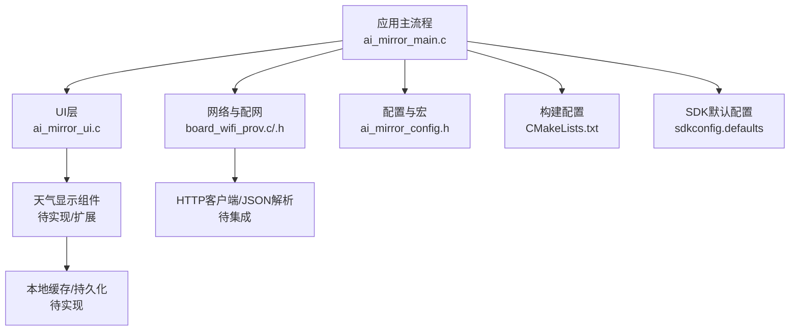
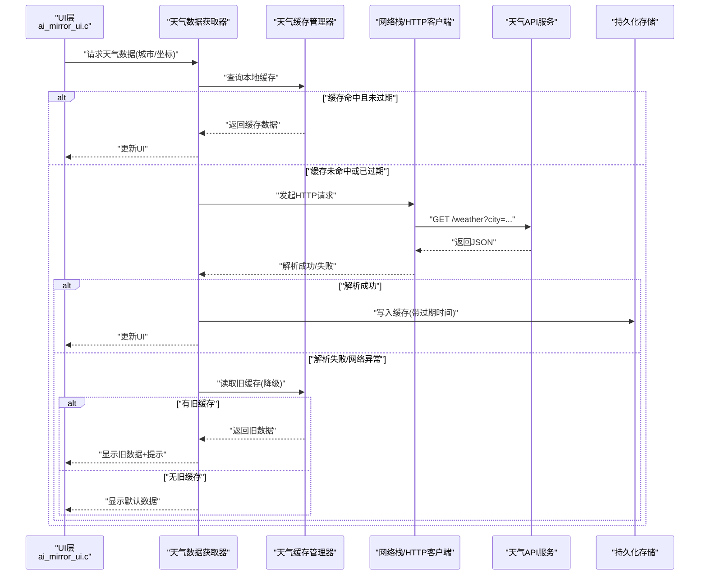
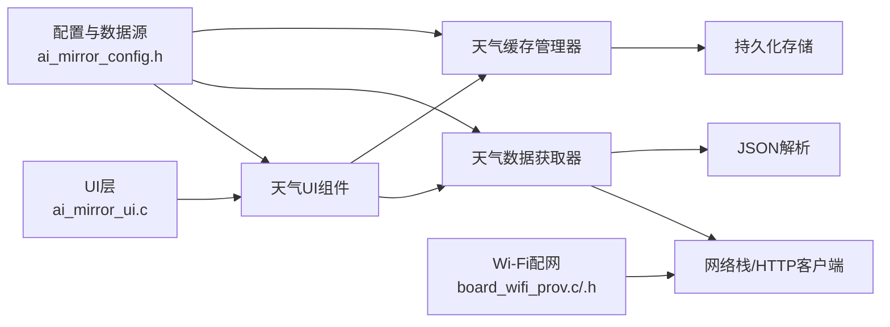

# 天气信息显示

<cite>
**本文引用的文件**   
- [ai_mirror_main.c](file://Firmware/esp32_ai_mirror/main/ai_mirror_main.c)
- [ai_mirror_ui.c](file://Firmware/esp32_ai_mirror/main/ai_mirror_ui.c)
- [ai_mirror_config.h](file://Firmware/esp32_ai_mirror/main/ai_mirror_config.h)
- [board_wifi_prov.c](file://Firmware/esp32_ai_mirror/main/board_wifi_prov.c)
- [board_wifi_prov.h](file://Firmware/esp32_ai_mirror/main/board_wifi_prov.h)
- [CMakeLists.txt](file://Firmware/esp32_ai_mirror/main/CMakeLists.txt)
- [sdkconfig.defaults](file://Firmware/esp32_ai_mirror/sdkconfig.defaults)
</cite>

## 目录
1. [简介](#简介)
2. [项目结构](#项目结构)
3. [核心组件](#核心组件)
4. [架构总览](#架构总览)
5. [详细组件分析](#详细组件分析)
6. [依赖关系分析](#依赖关系分析)
7. [性能考虑](#性能考虑)
8. [故障排查指南](#故障排查指南)
9. [结论](#结论)
10. [附录](#附录)

## 简介
本文件为“天气信息显示”组件的技术文档，面向ESP32 AI镜像项目中的天气功能。内容覆盖：
- 天气数据的网络获取、缓存策略与错误处理机制
- 天气图标系统、温度显示格式与单位切换
- 地理位置服务与城市搜索功能的实现思路
- 离线模式下的默认数据显示与降级策略
- 天气API集成配置与数据源管理
- 自动刷新机制与电池优化建议

说明：当前仓库未包含具体的天气模块源码，本文基于项目结构与常见嵌入式实现范式给出可落地的设计与集成指引，并标注了与本仓库现有文件的关联位置，便于后续扩展与落地。

## 项目结构
本项目采用ESP-IDF工程组织方式，主程序位于 main 目录，UI与硬件抽象通过组件化方式引入（如LVGL、LCD驱动等）。与天气功能相关的入口和配置通常集中在以下文件：
- ai_mirror_main.c：应用启动、任务调度与子系统初始化
- ai_mirror_ui.c：界面渲染与交互逻辑（含天气UI）
- ai_mirror_config.h：编译期配置项（如是否启用天气、默认城市、刷新间隔等）
- board_wifi_prov.c/.h：Wi-Fi配网与联网能力（天气数据获取的前提）
- CMakeLists.txt：构建配置（组件链接、宏定义）
- sdkconfig.defaults：默认SDK配置（网络栈、内存、功耗相关）

图表来源
- [ai_mirror_main.c](file://Firmware/esp32_ai_mirror/main/ai_mirror_main.c)
- [ai_mirror_ui.c](file://Firmware/esp32_ai_mirror/main/ai_mirror_ui.c)
- [board_wifi_prov.c](file://Firmware/esp32_ai_mirror/main/board_wifi_prov.c)
- [board_wifi_prov.h](file://Firmware/esp32_ai_mirror/main/board_wifi_prov.h)
- [ai_mirror_config.h](file://Firmware/esp32_ai_mirror/main/ai_mirror_config.h)
- [CMakeLists.txt](file://Firmware/esp32_ai_mirror/main/CMakeLists.txt)
- [sdkconfig.defaults](file://Firmware/esp32_ai_mirror/sdkconfig.defaults)

章节来源
- [ai_mirror_main.c](file://Firmware/esp32_ai_mirror/main/ai_mirror_main.c)
- [ai_mirror_ui.c](file://Firmware/esp32_ai_mirror/main/ai_mirror_ui.c)
- [ai_mirror_config.h](file://Firmware/esp32_ai_mirror/main/ai_mirror_config.h)
- [board_wifi_prov.c](file://Firmware/esp32_ai_mirror/main/board_wifi_prov.c)
- [board_wifi_prov.h](file://Firmware/esp32_ai_mirror/main/board_wifi_prov.h)
- [CMakeLists.txt](file://Firmware/esp32_ai_mirror/main/CMakeLists.txt)
- [sdkconfig.defaults](file://Firmware/esp32_ai_mirror/sdkconfig.defaults)

## 核心组件
围绕天气信息展示，建议拆分为以下组件（可在后续开发中逐步落地）：
- 天气数据获取器（NetworkWeatherFetcher）
  - 负责HTTP请求、JSON解析、错误重试与超时控制
- 天气缓存管理器（WeatherCacheManager）
  - 负责本地缓存读写、过期策略、降级回退
- 天气UI组件（WeatherWidget）
  - 负责图标渲染、温度格式化、单位切换、动画与刷新
- 定位与城市搜索（LocationService & CitySearch）
  - 负责IP定位或GPS定位（若可用）、城市名称解析与搜索
- 配置与数据源管理（WeatherConfig & DataSourceManager）
  - 负责API密钥、端点、刷新周期、默认城市、单位制式等

章节来源
- [ai_mirror_ui.c](file://Firmware/esp32_ai_mirror/main/ai_mirror_ui.c)
- [ai_mirror_config.h](file://Firmware/esp32_ai_mirror/main/ai_mirror_config.h)
- [board_wifi_prov.c](file://Firmware/esp32_ai_mirror/main/board_wifi_prov.c)

## 架构总览
下图展示了天气功能在系统中的整体架构与数据流。

图表来源
- [ai_mirror_ui.c](file://Firmware/esp32_ai_mirror/main/ai_mirror_ui.c)
- [board_wifi_prov.c](file://Firmware/esp32_ai_mirror/main/board_wifi_prov.c)
- [ai_mirror_config.h](file://Firmware/esp32_ai_mirror/main/ai_mirror_config.h)

## 详细组件分析

### 天气数据获取器（NetworkWeatherFetcher）
职责
- 根据城市名或经纬度构造请求URL
- 处理HTTP连接、超时、重试与错误码
- 解析JSON响应，提取温度、体感、湿度、风速、天气状况、更新时间等字段
- 将结果转换为内部数据结构供UI与缓存使用

关键流程
- 构建请求参数（城市/坐标、单位制式、语言、API Key）
- 发送请求并处理网络异常（断网、DNS失败、超时）
- 校验响应状态码与JSON结构
- 失败时触发重试（指数退避）
- 成功后返回结构化数据

错误处理
- 网络不可用：回退到缓存或默认数据
- JSON解析失败：记录日志并尝试降级
- 服务端错误：按策略重试或回退

性能要点
- 合理设置超时与重试次数
- 避免频繁请求，结合缓存与刷新周期

章节来源
- [board_wifi_prov.c](file://Firmware/esp32_ai_mirror/main/board_wifi_prov.c)
- [ai_mirror_config.h](file://Firmware/esp32_ai_mirror/main/ai_mirror_config.h)

### 天气缓存管理器（WeatherCacheManager）
职责
- 提供本地缓存的读写接口
- 维护缓存键（城市/坐标）与过期时间
- 支持多份缓存（最近N个城市）
- 提供降级读取接口（优先最新有效缓存）

缓存策略
- 键设计：城市名或经纬度哈希
- 过期策略：TTL（例如15-30分钟），可按天气变化频率调整
- 容量限制：LRU淘汰最久未使用的条目
- 持久化：SPIFFS/LittleFS或NVS（视资源而定）

章节来源
- [ai_mirror_config.h](file://Firmware/esp32_ai_mirror/main/ai_mirror_config.h)

### 天气UI组件（WeatherWidget）
职责
- 渲染天气图标、温度、湿度、风速、更新时间
- 支持温度单位切换（摄氏度/华氏度）
- 处理加载态、错误态、离线态的UI反馈
- 与刷新机制联动（定时/手动）

显示格式
- 温度：整数或一位小数，单位符号随切换变化
- 天气状况：文本+图标映射
- 更新时间：相对时间（如“5分钟前”）

图标系统
- 使用内嵌SVG或位图资源
- 根据天气代码映射到具体图标
- 支持动态主题（白天/夜间）

章节来源
- [ai_mirror_ui.c](file://Firmware/esp32_ai_mirror/main/ai_mirror_ui.c)

### 定位与城市搜索（LocationService & CitySearch）
职责
- 获取当前位置（IP定位或GPS）
- 将坐标反解为城市名
- 支持用户输入的城市搜索与选择

实现要点
- IP定位：通过HTTP请求公共API（需联网）
- GPS：若设备具备，则直接读取坐标
- 城市搜索：调用搜索引擎或内置词库

章节来源
- [board_wifi_prov.c](file://Firmware/esp32_ai_mirror/main/board_wifi_prov.c)
- [ai_mirror_config.h](file://Firmware/esp32_ai_mirror/main/ai_mirror_config.h)

### 配置与数据源管理（WeatherConfig & DataSourceManager）
职责
- 集中管理天气API配置（端点、Key、单位制式、刷新周期）
- 支持运行时切换数据源（多供应商容灾）
- 提供默认值与校验

配置项示例
- 默认城市/坐标
- 刷新间隔（秒）
- 单位制式（公制/英制）
- 超时与重试次数
- 缓存TTL

章节来源
- [ai_mirror_config.h](file://Firmware/esp32_ai_mirror/main/ai_mirror_config.h)
- [CMakeLists.txt](file://Firmware/esp32_ai_mirror/main/CMakeLists.txt)
- [sdkconfig.defaults](file://Firmware/esp32_ai_mirror/sdkconfig.defaults)

### 自动刷新机制与电池优化
刷新机制
- 定时器触发：周期性拉取（如每15分钟）
- 事件触发：页面进入前台、用户手动刷新
- 条件刷新：网络恢复后延迟刷新

电池优化
- 降低刷新频率（后台/低电量模式）
- 合并请求与批量更新
- 使用低功耗网络唤醒策略

章节来源
- [ai_mirror_main.c](file://Firmware/esp32_ai_mirror/main/ai_mirror_main.c)
- [sdkconfig.defaults](file://Firmware/esp32_ai_mirror/sdkconfig.defaults)

## 依赖关系分析
天气功能依赖网络、UI、配置与存储等子系统。下图展示主要依赖关系。

图表来源
- [ai_mirror_ui.c](file://Firmware/esp32_ai_mirror/main/ai_mirror_ui.c)
- [ai_mirror_config.h](file://Firmware/esp32_ai_mirror/main/ai_mirror_config.h)
- [board_wifi_prov.c](file://Firmware/esp32_ai_mirror/main/board_wifi_prov.c)
- [board_wifi_prov.h](file://Firmware/esp32_ai_mirror/main/board_wifi_prov.h)

章节来源
- [ai_mirror_ui.c](file://Firmware/esp32_ai_mirror/main/ai_mirror_ui.c)
- [ai_mirror_config.h](file://Firmware/esp32_ai_mirror/main/ai_mirror_config.h)
- [board_wifi_prov.c](file://Firmware/esp32_ai_mirror/main/board_wifi_prov.c)
- [board_wifi_prov.h](file://Firmware/esp32_ai_mirror/main/board_wifi_prov.h)

## 性能考虑
- 网络请求节流：避免重复请求，结合缓存TTL
- JSON解析优化：按需解析字段，减少内存分配
- UI渲染优化：增量更新，避免整屏重绘
- 存储I/O：批量写入，减少Flash擦写
- 功耗管理：合理休眠与唤醒，降低CPU占用

## 故障排查指南
常见问题与定位
- 无法联网：检查Wi-Fi配网与网络栈配置
- 请求超时：确认API端点与Key有效性，增加超时与重试
- JSON解析失败：核对字段映射与版本差异
- 缓存不生效：检查TTL与存储路径权限
- UI不更新：确认刷新触发与事件回调链路

排查步骤
- 启用调试日志（网络、解析、缓存、UI）
- 模拟网络异常与错误响应
- 验证缓存读写与过期行为
- 逐步隔离问题（网络→解析→缓存→UI）

章节来源
- [ai_mirror_main.c](file://Firmware/esp32_ai_mirror/main/ai_mirror_main.c)
- [ai_mirror_ui.c](file://Firmware/esp32_ai_mirror/main/ai_mirror_ui.c)
- [ai_mirror_config.h](file://Firmware/esp32_ai_mirror/main/ai_mirror_config.h)

## 结论
本文给出了ESP32 AI镜像项目中天气信息显示组件的完整设计方案与集成指引。尽管当前仓库未包含具体实现，但通过明确的数据流、组件边界与错误处理策略，可为后续开发提供清晰蓝图。建议在实现时优先保障网络健壮性与缓存降级，再逐步完善UI与定位搜索能力。

## 附录
- 天气API集成建议
  - 选择稳定可靠的免费/付费天气服务
  - 统一封装请求与解析接口，便于替换数据源
  - 配置项集中管理，支持热更新
- 数据模型建议
  - 温度（数值+单位）
  - 体感温度
  - 湿度、风速、风向
  - 天气代码与描述
  - 更新时间戳
- 安全与隐私
  - 保护API Key（加密存储）
  - 最小化收集定位信息
  - 合规使用用户数据