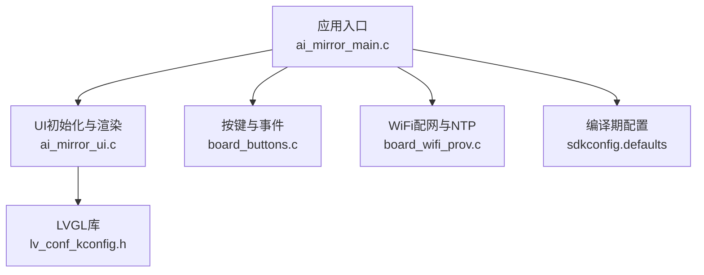
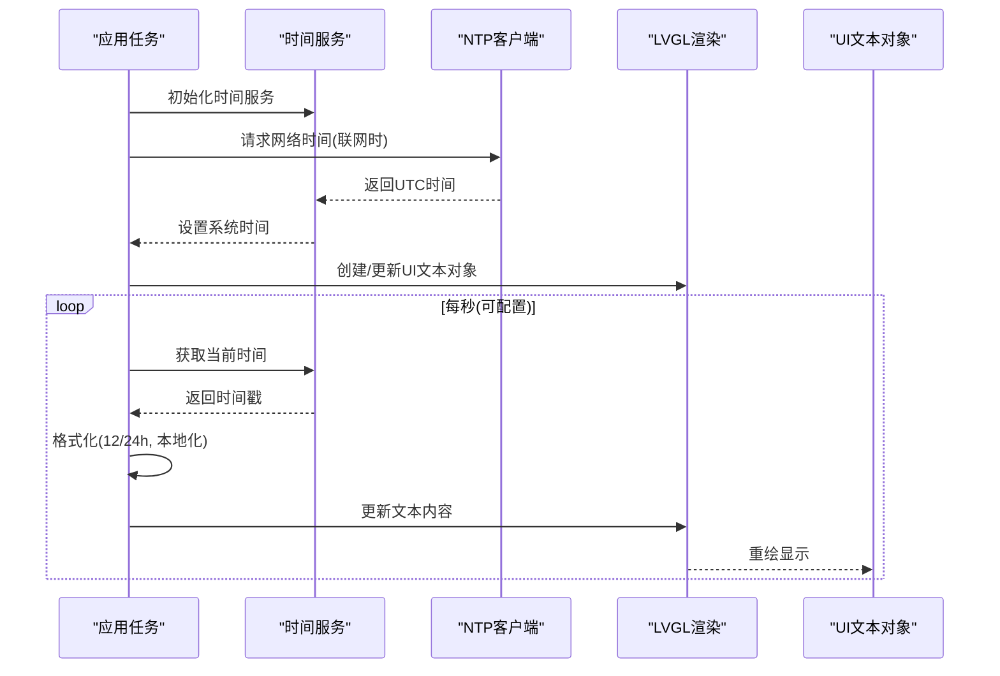
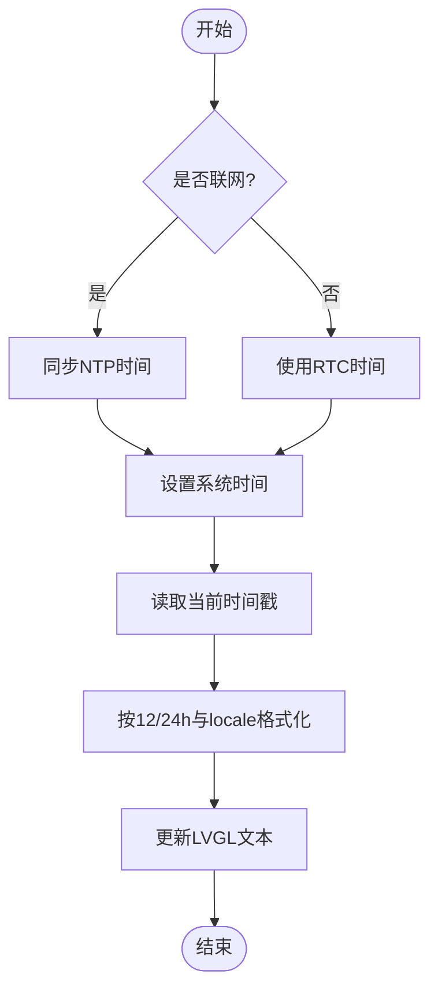
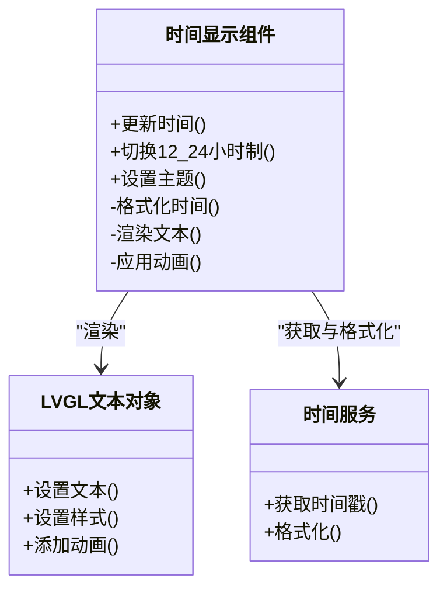
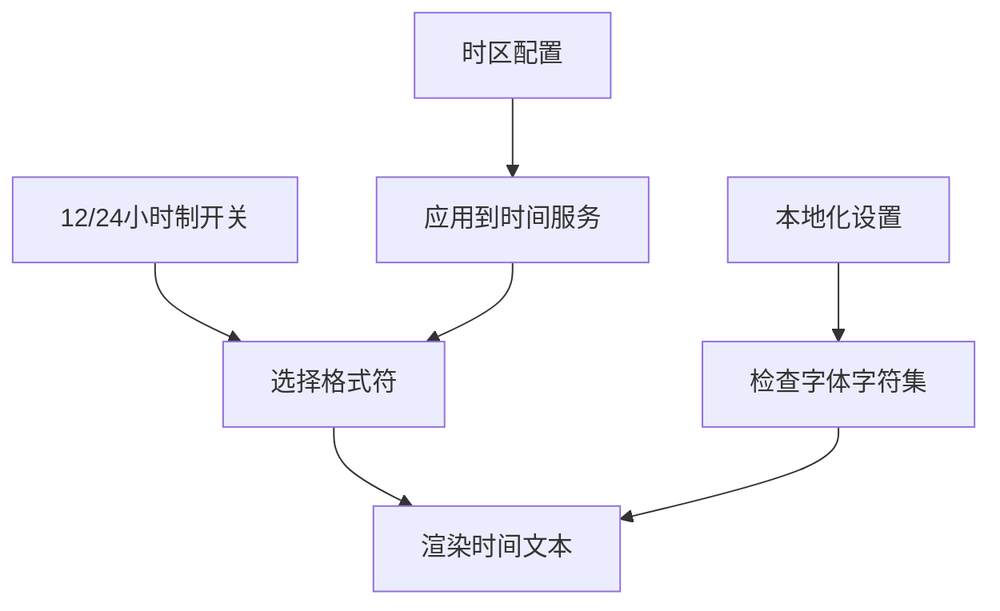
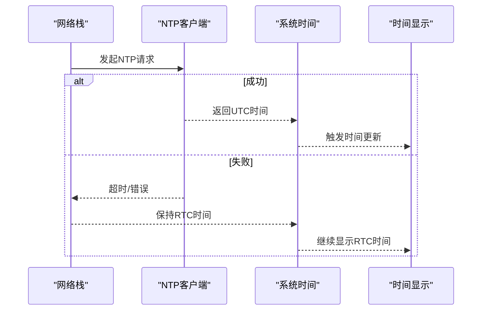
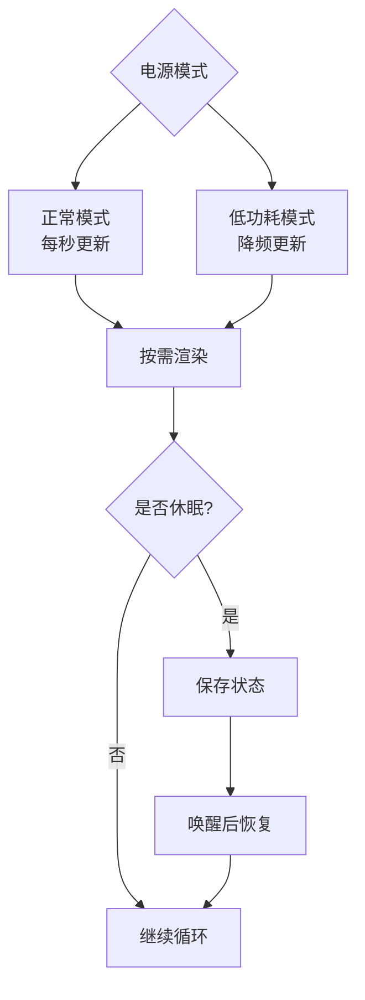
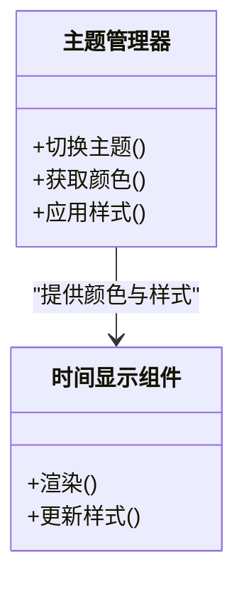
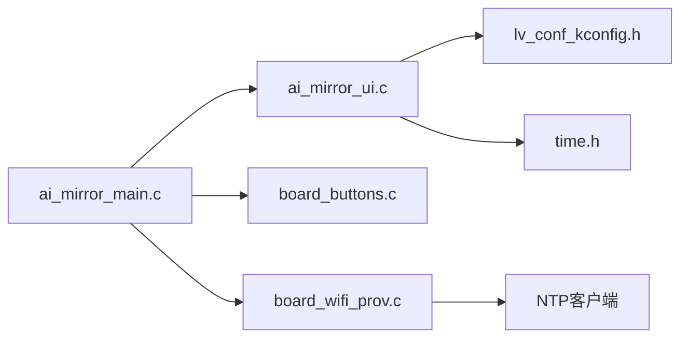

# 时间显示组件

<cite>
**本文引用的文件**   
- [ai_mirror_main.c](file://Firmware/esp32_ai_mirror/main/ai_mirror_main.c)
- [ai_mirror_ui.c](file://Firmware/esp32_ai_mirror/main/ai_mirror_ui.c)
- [ai_mirror_config.h](file://Firmware/esp32_ai_mirror/main/ai_mirror_config.h)
- [board_buttons.c](file://Firmware/esp32_ai_mirror/main/board_buttons.c)
- [board_wifi_prov.c](file://Firmware/esp32_ai_mirror/main/board_wifi_prov.c)
- [lv_conf_kconfig.h](file://Firmware/esp32_ai_mirror/managed_components/lvgl__lvgl/src/lv_conf_kconfig.h)
- [sdkconfig.defaults](file://Firmware/esp32_ai_mirror/sdkconfig.defaults)
</cite>

## 目录
1. [简介](#简介)
2. [项目结构](#项目结构)
3. [核心组件](#核心组件)
4. [架构总览](#架构总览)
5. [详细组件分析](#详细组件分析)
6. [依赖关系分析](#依赖关系分析)
7. [性能考虑](#性能考虑)
8. [故障排查指南](#故障排查指南)
9. [结论](#结论)
10. [附录](#附录)

## 简介
本文件面向ESP32 AI镜像项目中的“时间显示组件”，系统性说明时间数据的获取、格式化与实时更新机制；数字时钟的字体选择、颜色配置与动画效果；时区设置、12/24小时制切换与本地化支持；时间同步策略与网络时间协议（NTP）集成；以及低功耗模式下的更新优化与主题适配方法。文档以代码级分析与可视化图表为主，兼顾非技术读者的可读性。

## 项目结构
本项目基于ESP-IDF构建，UI层采用LVGL，时间显示功能位于应用主循环与UI渲染之间：
- 应用入口与任务调度：main 模块负责初始化系统、外设与UI框架，并启动时间相关任务。
- UI 渲染：通过 LVGL 绘制数字时钟文本，处理字体、颜色与动画。
- 配置项：通过 Kconfig/SDKConfig 管理编译期选项（如是否启用 NTP、时区、12/24小时制等）。
- 网络与时间源：WiFi 配网后通过 NTP 同步系统时间，作为 LVGL 时间显示的来源。

**图示来源** 
- [ai_mirror_main.c](file://Firmware/esp32_ai_mirror/main/ai_mirror_main.c)
- [ai_mirror_ui.c](file://Firmware/esp32_ai_mirror/main/ai_mirror_ui.c)
- [board_buttons.c](file://Firmware/esp32_ai_mirror/main/board_buttons.c)
- [board_wifi_prov.c](file://Firmware/esp32_ai_mirror/main/board_wifi_prov.c)
- [lv_conf_kconfig.h](file://Firmware/esp32_ai_mirror/managed_components/lvgl__lvgl/src/lv_conf_kconfig.h)
- [sdkconfig.defaults](file://Firmware/esp32_ai_mirror/sdkconfig.defaults)

**章节来源**
- [ai_mirror_main.c](file://Firmware/esp32_ai_mirror/main/ai_mirror_main.c)
- [ai_mirror_ui.c](file://Firmware/esp32_ai_mirror/main/ai_mirror_ui.c)
- [ai_mirror_config.h](file://Firmware/esp32_ai_mirror/main/ai_mirror_config.h)
- [sdkconfig.defaults](file://Firmware/esp32_ai_mirror/sdkconfig.defaults)

## 核心组件
- 时间数据源
  - 系统时间：由 ESP-IDF 的 time.h 提供，通常经 NTP 校准。
  - 可选硬件RTC：在断网或省电场景下回退至 RTC 计时。
- 时间格式化
  - 使用标准库 strftime 进行本地化格式化，支持 12/24 小时制与区域语言。
- UI 渲染
  - LVGL 文本控件显示时间字符串，支持自定义字体、颜色与动画。
- 配置与开关
  - Kconfig/SDKConfig 控制是否启用 NTP、时区偏移、12/24小时制、刷新频率等。

**章节来源**
- [ai_mirror_config.h](file://Firmware/esp32_ai_mirror/main/ai_mirror_config.h)
- [sdkconfig.defaults](file://Firmware/esp32_ai_mirror/sdkconfig.defaults)

## 架构总览
时间显示组件的整体流程如下：
- 启动阶段：初始化 WiFi/NTP，获取系统时间；初始化 LVGL 与 UI。
- 运行阶段：周期性读取系统时间，格式化后更新 LVGL 文本对象；根据用户交互切换 12/24 小时制与主题。
- 同步策略：联网优先使用 NTP 校准；断网时使用 RTC 维持走时；可配置自动重同步周期。
- 低功耗：在休眠或低亮度模式下降低刷新频率，必要时暂停渲染。

**图示来源** 
- [ai_mirror_main.c](file://Firmware/esp32_ai_mirror/main/ai_mirror_main.c)
- [ai_mirror_ui.c](file://Firmware/esp32_ai_mirror/main/ai_mirror_ui.c)
- [board_wifi_prov.c](file://Firmware/esp32_ai_mirror/main/board_wifi_prov.c)

## 详细组件分析

### 时间数据获取与格式化
- 数据源优先级
  - 联网可用：NTP 校准系统时间，保证高精度。
  - 断网可用：使用 RTC 作为后备时间源。
- 格式化策略
  - 使用标准库函数按区域设置生成时间字符串。
  - 支持 12/24 小时制切换，影响格式符与 AM/PM 标识。
  - 本地化支持取决于系统 locale 与 LVGL 字体字符集。

**图示来源** 
- [ai_mirror_ui.c](file://Firmware/esp32_ai_mirror/main/ai_mirror_ui.c)
- [board_wifi_prov.c](file://Firmware/esp32_ai_mirror/main/board_wifi_prov.c)

**章节来源**
- [ai_mirror_ui.c](file://Firmware/esp32_ai_mirror/main/ai_mirror_ui.c)
- [board_wifi_prov.c](file://Firmware/esp32_ai_mirror/main/board_wifi_prov.c)

### 数字时钟的字体、颜色与动画
- 字体选择
  - 使用 LVGL 内置或自定义字体，确保包含所需字符集（数字、冒号、AM/PM、本地化字符）。
  - 可通过 Kconfig 或运行时加载不同字号与字重。
- 颜色配置
  - 文本前景色、背景色与高亮色可在主题中定义，支持明暗主题切换。
- 动画效果
  - 秒针闪烁、冒号闪烁、数字切换过渡等，通过 LVGL 动画 API 实现。
  - 动画帧率与时长可配置，避免频繁重绘导致功耗上升。

**图示来源** 
- [ai_mirror_ui.c](file://Firmware/esp32_ai_mirror/main/ai_mirror_ui.c)
- [lv_conf_kconfig.h](file://Firmware/esp32_ai_mirror/managed_components/lvgl__lvgl/src/lv_conf_kconfig.h)

**章节来源**
- [ai_mirror_ui.c](file://Firmware/esp32_ai_mirror/main/ai_mirror_ui.c)
- [lv_conf_kconfig.h](file://Firmware/esp32_ai_mirror/managed_components/lvgl__lvgl/src/lv_conf_kconfig.h)

### 时区设置、12/24小时制与本地化
- 时区设置
  - 通过环境变量或 SDKConfig 指定时区偏移与夏令时规则。
  - 联网时 NTP 返回 UTC，应用层按配置的时区转换。
- 12/24小时制切换
  - 运行时切换格式符，影响输出字符串与 AM/PM 显示。
  - 切换触发 UI 重绘与可能的动画。
- 本地化支持
  - 依赖系统 locale 与 LVGL 字体字符集。
  - 若字体缺失字符，需替换为包含所需字符集的字体。

**图示来源** 
- [ai_mirror_config.h](file://Firmware/esp32_ai_mirror/main/ai_mirror_config.h)
- [sdkconfig.defaults](file://Firmware/esp32_ai_mirror/sdkconfig.defaults)

**章节来源**
- [ai_mirror_config.h](file://Firmware/esp32_ai_mirror/main/ai_mirror_config.h)
- [sdkconfig.defaults](file://Firmware/esp32_ai_mirror/sdkconfig.defaults)

### 时间同步策略与NTP集成
- 同步策略
  - 首次联网立即同步；之后按周期或事件触发重同步。
  - 断网时回退到 RTC，保持走时连续性。
- NTP 集成
  - 使用 ESP-IDF 的 NTP 客户端接口，设置服务器列表与超时重试。
  - 成功同步后更新系统时间，并通知 UI 刷新。
- 错误处理
  - 网络不可达或超时：记录日志，延迟重试。
  - 时间跳变：平滑过渡，避免 UI 抖动。

**图示来源** 
- [board_wifi_prov.c](file://Firmware/esp32_ai_mirror/main/board_wifi_prov.c)

**章节来源**
- [board_wifi_prov.c](file://Firmware/esp32_ai_mirror/main/board_wifi_prov.c)

### 低功耗模式下的时间更新优化
- 刷新频率自适应
  - 正常模式：每秒更新一次。
  - 低功耗模式：降低到每数秒或每分钟更新，减少 CPU 唤醒与屏幕刷新。
- 渲染优化
  - 仅在时间变化时更新文本，避免全屏重绘。
  - 关闭不必要的动画与阴影效果。
- 休眠策略
  - 进入深度睡眠前保存状态；唤醒后按需恢复时间显示。
  - 使用定时器中断触发最低频次的更新时间点。

**图示来源** 
- [ai_mirror_main.c](file://Firmware/esp32_ai_mirror/main/ai_mirror_main.c)
- [ai_mirror_ui.c](file://Firmware/esp32_ai_mirror/main/ai_mirror_ui.c)

**章节来源**
- [ai_mirror_main.c](file://Firmware/esp32_ai_mirror/main/ai_mirror_main.c)
- [ai_mirror_ui.c](file://Firmware/esp32_ai_mirror/main/ai_mirror_ui.c)

### 主题适配与样式定制
- 主题定义
  - 明/暗主题分别定义文本颜色、背景色与高亮色。
  - 支持运行时切换主题，触发 UI 重绘。
- 样式定制
  - 通过 LVGL 样式 API 设置字体大小、行距、对齐方式。
  - 针对数字时钟优化冒号与数字间距，提升可读性。
- 国际化扩展
  - 新增语言时，确保字体包含对应字符集。
  - 调整布局以适应更长或更短的日期/时间字符串。

**图示来源** 
- [ai_mirror_ui.c](file://Firmware/esp32_ai_mirror/main/ai_mirror_ui.c)

**章节来源**
- [ai_mirror_ui.c](file://Firmware/esp32_ai_mirror/main/ai_mirror_ui.c)

## 依赖关系分析
- 内部依赖
  - ai_mirror_main.c 负责任务调度与初始化，调用 ai_mirror_ui.c 进行 UI 渲染。
  - board_wifi_prov.c 提供网络与 NTP 能力，供时间服务使用。
  - lv_conf_kconfig.h 控制 LVGL 特性与性能参数。
- 外部依赖
  - ESP-IDF 的 time.h、NTP 客户端、RTC 驱动。
  - LVGL 文本渲染与动画引擎。

**图示来源** 
- [ai_mirror_main.c](file://Firmware/esp32_ai_mirror/main/ai_mirror_main.c)
- [ai_mirror_ui.c](file://Firmware/esp32_ai_mirror/main/ai_mirror_ui.c)
- [board_wifi_prov.c](file://Firmware/esp32_ai_mirror/main/board_wifi_prov.c)
- [lv_conf_kconfig.h](file://Firmware/esp32_ai_mirror/managed_components/lvgl__lvgl/src/lv_conf_kconfig.h)

**章节来源**
- [ai_mirror_main.c](file://Firmware/esp32_ai_mirror/main/ai_mirror_main.c)
- [ai_mirror_ui.c](file://Firmware/esp32_ai_mirror/main/ai_mirror_ui.c)
- [board_wifi_prov.c](file://Firmware/esp32_ai_mirror/main/board_wifi_prov.c)
- [lv_conf_kconfig.h](file://Firmware/esp32_ai_mirror/managed_components/lvgl__lvgl/src/lv_conf_kconfig.h)

## 性能考虑
- 渲染优化
  - 仅更新变化的文本区域，避免全屏重绘。
  - 禁用不必要的动画与阴影，降低 GPU/CPU 负载。
- 刷新频率
  - 根据功耗与需求动态调整刷新间隔。
  - 在低功耗模式下降低频率，延长电池寿命。
- 内存与字体
  - 选择合适的字体文件大小，平衡显示质量与存储占用。
  - 预加载常用字符集，减少运行时开销。

[本节为通用指导，不直接分析具体文件]

## 故障排查指南
- 时间不准
  - 检查 NTP 服务器可达性与网络状态。
  - 确认时区与夏令时配置正确。
- 显示异常
  - 验证 LVGL 字体是否包含所需字符。
  - 检查样式与主题是否正确应用。
- 功耗过高
  - 降低刷新频率，关闭动画。
  - 启用休眠与低功耗模式。

**章节来源**
- [board_wifi_prov.c](file://Firmware/esp32_ai_mirror/main/board_wifi_prov.c)
- [ai_mirror_ui.c](file://Firmware/esp32_ai_mirror/main/ai_mirror_ui.c)

## 结论
时间显示组件在 ESP32 AI 镜像项目中通过 NTP 与 RTC 协同工作，结合 LVGL 实现高质量的时间渲染与主题适配。通过合理的刷新策略与动画优化，可在保证用户体验的同时降低功耗。建议在生产环境中完善错误处理与监控，确保时间准确性与稳定性。

[本节为总结，不直接分析具体文件]

## 附录
- 关键配置项
  - 是否启用 NTP、时区偏移、12/24小时制、刷新频率、字体选择等。
- 参考文件
  - 应用入口与 UI：ai_mirror_main.c、ai_mirror_ui.c
  - 网络与时间：board_wifi_prov.c
  - 配置与 LVGL：ai_mirror_config.h、lv_conf_kconfig.h、sdkconfig.defaults

**章节来源**
- [ai_mirror_main.c](file://Firmware/esp32_ai_mirror/main/ai_mirror_main.c)
- [ai_mirror_ui.c](file://Firmware/esp32_ai_mirror/main/ai_mirror_ui.c)
- [board_wifi_prov.c](file://Firmware/esp32_ai_mirror/main/board_wifi_prov.c)
- [ai_mirror_config.h](file://Firmware/esp32_ai_mirror/main/ai_mirror_config.h)
- [lv_conf_kconfig.h](file://Firmware/esp32_ai_mirror/managed_components/lvgl__lvgl/src/lv_conf_kconfig.h)
- [sdkconfig.defaults](file://Firmware/esp32_ai_mirror/sdkconfig.defaults)