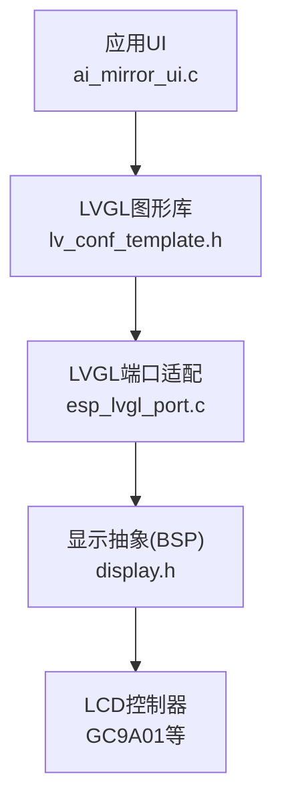
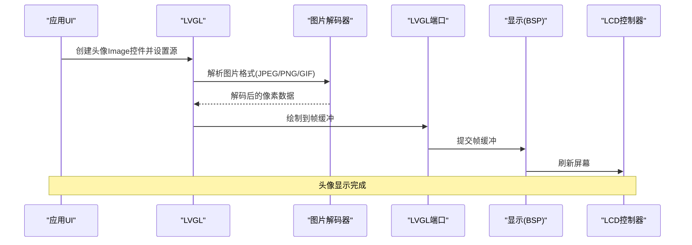
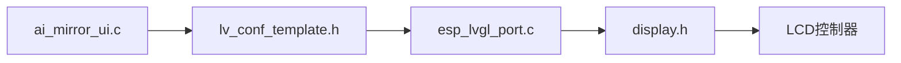

# 用户头像显示

<cite>
**本文引用的文件**   
- [ai_mirror_ui.c](file://Firmware/esp32_ai_mirror/main/ai_mirror_ui.c)
- [ai_mirror_config.h](file://Firmware/esp32_ai_mirror/main/ai_mirror_config.h)
- [lv_conf_template.h](file://Firmware/esp32_ai_mirror/managed_components/lvgl__lvgl/lv_conf_template.h)
- [esp_lvgl_port.c](file://Firmware/esp32_ai_mirror/managed_components/espressif__esp_lvgl_port/esp_lvgl_port.c)
- [display.h](file://Firmware/esp32_ai_mirror/managed_components/espressif__esp-box/include/bsp/display.h)
- [README.md](file://README.md)
</cite>

## 目录
1. [简介](#简介)
2. [项目结构](#项目结构)
3. [核心组件](#核心组件)
4. [架构总览](#架构总览)
5. [详细组件分析](#详细组件分析)
6. [依赖关系分析](#依赖关系分析)
7. [性能考量](#性能考量)
8. [故障排查指南](#故障排查指南)
9. [结论](#结论)
10. [附录](#附录)

## 简介
本文件面向“用户头像显示”功能，系统性说明图片资源的加载、缓存与内存管理策略；解释支持的图片格式、尺寸适配与质量优化；描述默认头像生成逻辑与用户自定义头像上传流程；给出图片解码器配置与性能调优建议；并提供头像显示效果的定制方法与动画过渡方案。同时涵盖大图片的渐进加载与内存限制处理，帮助在嵌入式环境下稳定高效地展示用户头像。

## 项目结构
本项目基于 ESP-IDF 与 LVGL 构建，UI 层通过 esp_lvgl_port 桥接到底层 LCD 驱动（如 GC9A01），并通过 BSP 封装 display 接口。头像显示相关的代码主要位于 main 应用层与 LVGL 图形库中：
- 应用 UI 入口与界面初始化：main/ai_mirror_ui.c
- 系统配置与编译选项：main/ai_mirror_config.h
- LVGL 配置模板（含图像解码器开关）：managed_components/lvgl__lvgl/lv_conf_template.h
- LVGL 端口适配（帧缓冲、刷新等）：managed_components/espressif__esp_lvgl_port/esp_lvgl_port.c
- 屏幕显示抽象（BSP）：managed_components/espressif__esp-box/include/bsp/display.h

图表来源 
- [ai_mirror_ui.c](file://Firmware/esp32_ai_mirror/main/ai_mirror_ui.c)
- [lv_conf_template.h](file://Firmware/esp32_ai_mirror/managed_components/lvgl__lvgl/lv_conf_template.h)
- [esp_lvgl_port.c](file://Firmware/esp32_ai_mirror/managed_components/espressif__esp_lvgl_port/esp_lvgl_port.c)
- [display.h](file://Firmware/esp32_ai_mirror/managed_components/espressif__esp-box/include/bsp/display.h)

章节来源
- [README.md](file://README.md)

## 核心组件
- 头像显示控件：使用 LVGL 的 image 控件承载头像资源，支持本地二进制数据或外部路径加载。
- 图片解码器：由 LVGL 的 image decoder 子系统提供，可启用 JPEG/PNG/GIF 等解码能力。
- 帧缓冲与渲染：通过 esp_lvgl_port 将 LVGL 渲染结果写入 LCD 帧缓冲，再由 BSP display 接口输出到屏幕。
- 资源管理：LVGL 内部维护对象与缓冲区生命周期，结合 LVGL 配置中的内存池与缓存参数进行控制。

章节来源
- [ai_mirror_ui.c](file://Firmware/esp32_ai_mirror/main/ai_mirror_ui.c)
- [lv_conf_template.h](file://Firmware/esp32_ai_mirror/managed_components/lvgl__lvgl/lv_conf_template.h)
- [esp_lvgl_port.c](file://Firmware/esp32_ai_mirror/managed_components/espressif__esp_lvgl_port/esp_lvgl_port.c)
- [display.h](file://Firmware/esp32_ai_mirror/managed_components/espressif__esp-box/include/bsp/display.h)

## 架构总览
下图展示了从应用层到显示层的头像显示数据流与控制流：

图表来源 
- [ai_mirror_ui.c](file://Firmware/esp32_ai_mirror/main/ai_mirror_ui.c)
- [lv_conf_template.h](file://Firmware/esp32_ai_mirror/managed_components/lvgl__lvgl/lv_conf_template.h)
- [esp_lvgl_port.c](file://Firmware/esp32_ai_mirror/managed_components/espressif__esp_lvgl_port/esp_lvgl_port.c)
- [display.h](file://Firmware/esp32_ai_mirror/managed_components/espressif__esp-box/include/bsp/display.h)

## 详细组件分析

### 图片资源加载与缓存
- 加载方式
  - 本地二进制数据：将图片以 C 数组形式嵌入固件，直接作为 LVGL Image 源，避免运行时 I/O。
  - 外部路径：通过文件系统路径加载，适合较大或动态更新的头像。
- 缓存策略
  - LVGL 内部对解码后的位图进行缓存，减少重复解码开销。
  - 可通过 LVGL 配置调整缓存大小与淘汰策略，平衡内存占用与命中率。
- 内存管理
  - 使用 LVGL 的内存分配器与内存池，合理设置最大内存与块大小，避免碎片化。
  - 释放不再使用的 Image 对象，及时回收解码缓冲。

章节来源
- [lv_conf_template.h](file://Firmware/esp32_ai_mirror/managed_components/lvgl__lvgl/lv_conf_template.h)
- [esp_lvgl_port.c](file://Firmware/esp32_ai_mirror/managed_components/espressif__esp_lvgl_port/esp_lvgl_port.c)

### 图片格式支持与解码器配置
- 支持格式
  - JPEG：适合照片类头像，体积较小，需启用 JPEG 解码器。
  - PNG：支持透明通道，适合带阴影或圆角效果的头像，需启用 PNG 解码器。
  - GIF：如需动图头像，需启用 GIF 解码器。
- 解码器配置
  - 在 LVGL 配置中开启对应解码器宏，确保编译时包含相应解码实现。
  - 根据目标平台 CPU 能力选择合适的质量与速度权衡。

章节来源
- [lv_conf_template.h](file://Firmware/esp32_ai_mirror/managed_components/lvgl__lvgl/lv_conf_template.h)

### 尺寸适配与质量优化
- 尺寸适配
  - 使用 LVGL 的缩放与裁剪功能，按控件尺寸自适应头像比例。
  - 推荐预缩放到常用尺寸（如 64x64、128x128），减少运行时缩放开销。
- 质量优化
  - 针对 JPEG 调整采样与量化表，平衡清晰度与体积。
  - 对于 PNG，尽量使用索引色或减少透明度层级以降低内存占用。

章节来源
- [ai_mirror_ui.c](file://Firmware/esp32_ai_mirror/main/ai_mirror_ui.c)
- [lv_conf_template.h](file://Firmware/esp32_ai_mirror/managed_components/lvgl__lvgl/lv_conf_template.h)

### 默认头像生成逻辑
- 生成策略
  - 当用户未设置头像时，使用内置默认头像（C 数组或占位图）。
  - 可根据用户名首字母或哈希值生成个性化占位图，提升识别度。
- 切换逻辑
  - 检测到新头像后，平滑替换默认头像，保持界面一致性。

章节来源
- [ai_mirror_ui.c](file://Firmware/esp32_ai_mirror/main/ai_mirror_ui.c)

### 用户自定义头像上传流程
- 上传入口
  - 通过 UI 触发选择图片或拍照，获取原始数据。
- 预处理
  - 校验格式与大小，必要时进行压缩与缩放。
- 存储与更新
  - 将处理后的头像保存到文件系统或 SPIFFS/LittleFS。
  - 更新 LVGL Image 源，刷新显示。

章节来源
- [ai_mirror_ui.c](file://Firmware/esp32_ai_mirror/main/ai_mirror_ui.c)

### 图片解码器的配置与性能调优
- 解码器开关
  - 在 LVGL 配置中启用 JPEG/PNG/GIF 解码器，按需裁剪以减少固件体积。
- 内存与缓存
  - 调整 LVGL 内存池大小与缓存上限，避免解码时 OOM。
  - 合理设置解码线程优先级，避免阻塞 UI 主循环。
- 渲染优化
  - 启用硬件加速（若可用），减少 CPU 负载。
  - 使用双缓冲或半屏刷新降低撕裂与卡顿。

章节来源
- [lv_conf_template.h](file://Firmware/esp32_ai_mirror/managed_components/lvgl__lvgl/lv_conf_template.h)
- [esp_lvgl_port.c](file://Firmware/esp32_ai_mirror/managed_components/espressif__esp_lvgl_port/esp_lvgl_port.c)

### 头像显示效果定制与动画过渡
- 样式定制
  - 使用 LVGL 样式 API 设置圆角、边框、阴影与背景色。
  - 通过遮罩实现圆形头像或椭圆头像。
- 动画过渡
  - 使用淡入淡出、缩放或滑动动画，提升用户体验。
  - 控制动画时长与缓动函数，避免影响交互流畅性。

章节来源
- [ai_mirror_ui.c](file://Firmware/esp32_ai_mirror/main/ai_mirror_ui.c)

### 大图片的渐进加载与内存限制处理
- 渐进加载
  - 先显示低分辨率占位图，再逐步加载高分辨率版本。
  - 分块解码与渲染，避免一次性占用大量内存。
- 内存限制
  - 监控 LVGL 内存使用，超过阈值时降级为小图或关闭解码缓存。
  - 及时释放临时缓冲与未使用的 Image 对象。

章节来源
- [lv_conf_template.h](file://Firmware/esp32_ai_mirror/managed_components/lvgl__lvgl/lv_conf_template.h)
- [esp_lvgl_port.c](file://Firmware/esp32_ai_mirror/managed_components/espressif__esp_lvgl_port/esp_lvgl_port.c)

## 依赖关系分析
头像显示功能依赖以下关键模块：
- LVGL：提供 UI 控件、图片解码与渲染管线。
- esp_lvgl_port：桥接 LVGL 与底层显示驱动，管理帧缓冲。
- BSP display：抽象屏幕操作，屏蔽具体 LCD 控制器差异。
- 文件系统（可选）：用于加载外部头像资源。

图表来源 
- [ai_mirror_ui.c](file://Firmware/esp32_ai_mirror/main/ai_mirror_ui.c)
- [lv_conf_template.h](file://Firmware/esp32_ai_mirror/managed_components/lvgl__lvgl/lv_conf_template.h)
- [esp_lvgl_port.c](file://Firmware/esp32_ai_mirror/managed_components/espressif__esp_lvgl_port/esp_lvgl_port.c)
- [display.h](file://Firmware/esp32_ai_mirror/managed_components/espressif__esp-box/include/bsp/display.h)

章节来源
- [ai_mirror_ui.c](file://Firmware/esp32_ai_mirror/main/ai_mirror_ui.c)
- [lv_conf_template.h](file://Firmware/esp32_ai_mirror/managed_components/lvgl__lvgl/lv_conf_template.h)
- [esp_lvgl_port.c](file://Firmware/esp32_ai_mirror/managed_components/espressif__esp_lvgl_port/esp_lvgl_port.c)
- [display.h](file://Firmware/esp32_ai_mirror/managed_components/espressif__esp-box/include/bsp/display.h)

## 性能考量
- 解码性能
  - 优先使用硬件解码或 SIMD 指令集加速。
  - 避免频繁切换解码器，批量处理图片。
- 内存占用
  - 限制单张图片最大尺寸，采用多分辨率资源。
  - 启用 LVGL 缓存但设置上限，防止内存泄漏。
- 渲染效率
  - 使用双缓冲与部分刷新，减少全屏重绘。
  - 合理设置刷新频率，避免过度刷新导致卡顿。

[本节为通用指导，不直接分析具体文件]

## 故障排查指南
- 常见问题
  - 图片无法显示：检查解码器是否启用、路径是否正确、权限是否足够。
  - 内存不足：降低图片尺寸、关闭不必要的解码器、增加 LVGL 内存池。
  - 显示异常：确认帧缓冲大小与屏幕分辨率匹配，检查 BSP display 配置。
- 调试方法
  - 启用 LVGL 日志，观察解码与渲染过程。
  - 使用内存分析工具定位泄漏或峰值占用。
  - 逐步替换资源（默认图 vs 自定义图）定位问题范围。

章节来源
- [lv_conf_template.h](file://Firmware/esp32_ai_mirror/managed_components/lvgl__lvgl/lv_conf_template.h)
- [esp_lvgl_port.c](file://Firmware/esp32_ai_mirror/managed_components/espressif__esp_lvgl_port/esp_lvgl_port.c)

## 结论
通过在 LVGL 框架下合理配置图片解码器、优化内存与缓存策略，并结合 BSP 显示抽象，可以在嵌入式设备上稳定高效地展示用户头像。遵循本文的尺寸适配、质量优化、渐进加载与动画过渡建议，能够显著提升用户体验与系统稳定性。

[本节为总结性内容，不直接分析具体文件]

## 附录
- 相关配置项参考
  - LVGL 图像解码器开关与内存池参数：见 lv_conf_template.h
  - LVGL 端口帧缓冲与刷新参数：见 esp_lvgl_port.c
  - BSP display 接口定义：见 display.h
  - 应用 UI 初始化与控件创建：见 ai_mirror_ui.c

章节来源
- [lv_conf_template.h](file://Firmware/esp32_ai_mirror/managed_components/lvgl__lvgl/lv_conf_template.h)
- [esp_lvgl_port.c](file://Firmware/esp32_ai_mirror/managed_components/espressif__esp_lvgl_port/esp_lvgl_port.c)
- [display.h](file://Firmware/esp32_ai_mirror/managed_components/espressif__esp-box/include/bsp/display.h)
- [ai_mirror_ui.c](file://Firmware/esp32_ai_mirror/main/ai_mirror_ui.c)