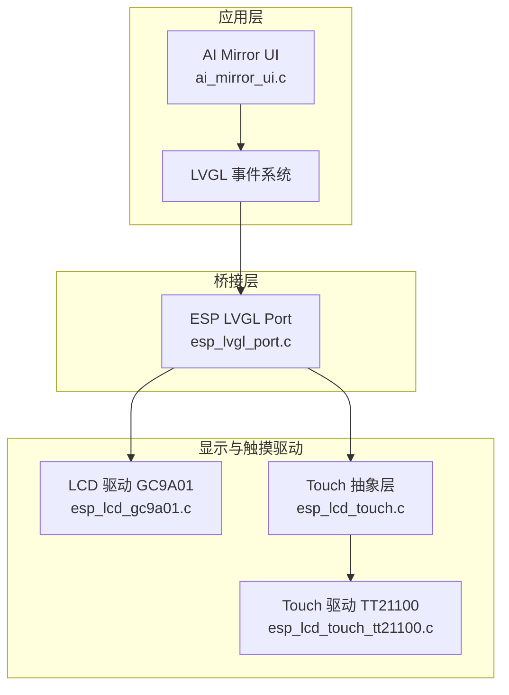
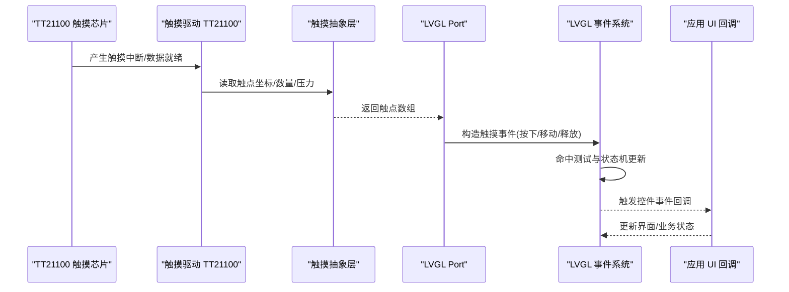
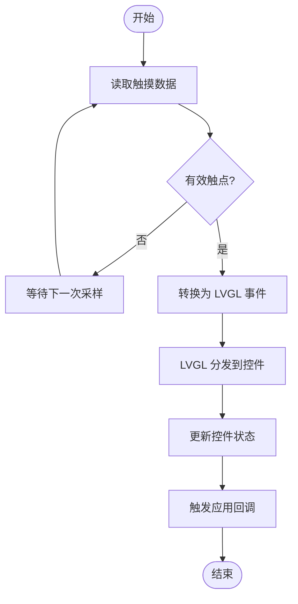
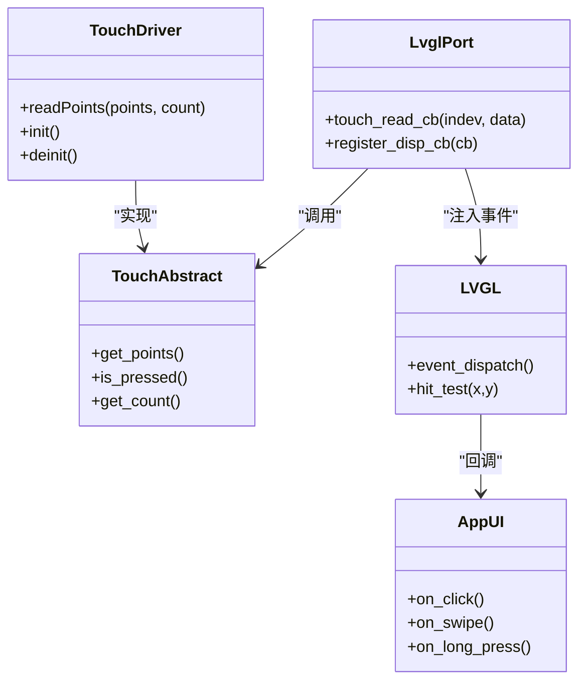
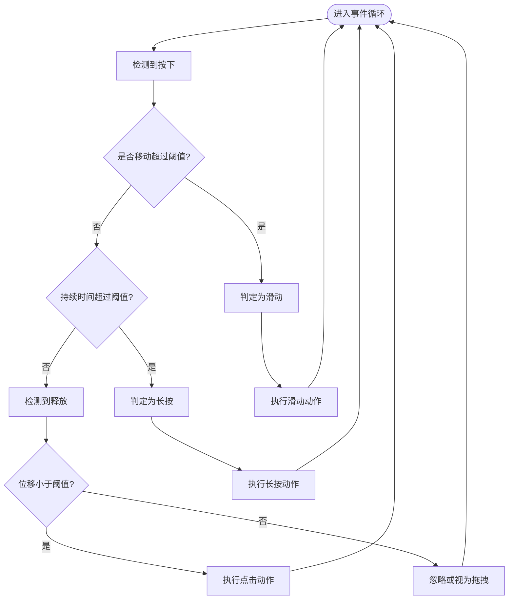
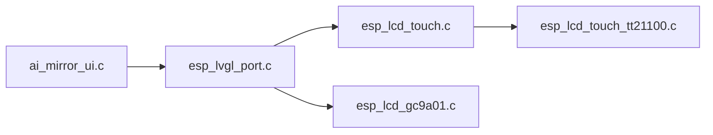

# 触摸交互逻辑

<cite>
**本文引用的文件**   
- [ai_mirror_ui.c](file://Firmware/esp32_ai_mirror/main/ai_mirror_ui.c)
- [board_buttons.c](file://Firmware/esp32_ai_mirror/main/board_buttons.c)
- [board_buttons.h](file://Firmware/esp32_ai_mirror/main/board_buttons.h)
- [esp_lvgl_port.c](file://Firmware/esp32_ai_mirror/managed_components/espressif__esp_lvgl_port/esp_lvgl_port.c)
- [esp_lcd_touch.c](file://Firmware/esp32_ai_mirror/managed_components/espressif__esp_lcd_touch/esp_lcd_touch.c)
- [esp_lcd_touch_tt21100.c](file://Firmware/esp32_ai_mirror/managed_components/espressif__esp_lcd_touch_tt21100/esp_lcd_touch_tt21100.c)
- [esp_lcd_gc9a01.c](file://Firmware/esp32_ai_mirror/managed_components/espressif__esp_lcd_gc9a01/esp_lcd_gc9a01.c)
- [sdkconfig.defaults](file://Firmware/esp32_ai_mirror/sdkconfig.defaults)
</cite>

## 目录
1. [简介](#简介)
2. [项目结构](#项目结构)
3. [核心组件](#核心组件)
4. [架构总览](#架构总览)
5. [详细组件分析](#详细组件分析)
6. [依赖关系分析](#依赖关系分析)
7. [性能考虑](#性能考虑)
8. [故障排查指南](#故障排查指南)
9. [结论](#结论)
10. [附录](#附录)

## 简介
本文件围绕 AI 镜像项目的触摸交互逻辑进行系统化说明，覆盖触摸事件处理流程、手势识别与多点触控支持、按钮点击/滑动/长按检测机制、触摸反馈与视觉状态变化、触摸校准与精度优化、自定义手势识别开发指南、事件监听器配置、触摸延迟优化与防误触策略等。文档面向开发者与产品工程师，既提供高层架构概览，也深入到具体实现位置与调用链，便于快速定位与二次开发。

## 项目结构
本项目采用分层架构：应用层 UI（LVGL）通过 esp_lvgl_port 桥接底层 LCD 与 Touch 驱动；触摸硬件由 TT21100 控制器驱动，LCD 面板为 GC9A01。按键与板级资源在 board_buttons 中抽象。触摸输入经 LVGL 事件系统分发到控件，完成点击、滑动、长按等交互。

图表来源
- [ai_mirror_ui.c](file://Firmware/esp32_ai_mirror/main/ai_mirror_ui.c)
- [esp_lvgl_port.c](file://Firmware/esp32_ai_mirror/managed_components/espressif__esp_lvgl_port/esp_lvgl_port.c)
- [esp_lcd_gc9a01.c](file://Firmware/esp32_ai_mirror/managed_components/espressif__esp_lcd_gc9a01/esp_lcd_gc9a01.c)
- [esp_lcd_touch.c](file://Firmware/esp32_ai_mirror/managed_components/espressif__esp_lcd_touch/esp_lcd_touch.c)
- [esp_lcd_touch_tt21100.c](file://Firmware/esp32_ai_mirror/managed_components/espressif__esp_lcd_touch_tt21100/esp_lcd_touch_tt21100.c)

章节来源
- [ai_mirror_ui.c](file://Firmware/esp32_ai_mirror/main/ai_mirror_ui.c)
- [esp_lvgl_port.c](file://Firmware/esp32_ai_mirror/managed_components/espressif__esp_lvgl_port/esp_lvgl_port.c)
- [esp_lcd_touch.c](file://Firmware/esp32_ai_mirror/managed_components/espressif__esp_lcd_touch/esp_lcd_touch.c)
- [esp_lcd_touch_tt21100.c](file://Firmware/esp32_ai_mirror/managed_components/espressif__esp_lcd_touch_tt21100/esp_lcd_touch_tt21100.c)
- [esp_lcd_gc9a01.c](file://Firmware/esp32_ai_mirror/managed_components/espressif__esp_lcd_gc9a01/esp_lcd_gc9a01.c)

## 核心组件
- 触摸输入抽象与驱动
  - esp_lcd_touch.c：定义触摸设备抽象接口与通用读取流程，向上暴露坐标、压力、点数等能力。
  - esp_lcd_touch_tt21100.c：TT21100 的具体驱动实现，负责 I2C/SPI 通信、点数据解析、中断或轮询读取。
- 显示驱动
  - esp_lcd_gc9a01.c：GC9A01 面板驱动，负责初始化、刷新帧缓冲、旋转与像素写入。
- LVGL 集成
  - esp_lvgl_port.c：将 LVGL 的 disp/touch/indev 适配到 ESP-IDF 框架，注册刷新回调与触摸读取回调。
- 应用 UI
  - ai_mirror_ui.c：构建界面、注册控件事件回调、处理业务逻辑与状态切换。
- 板级按键
  - board_buttons.c/.h：封装板载按键与 LED 等，用于辅助交互与调试。

章节来源
- [esp_lcd_touch.c](file://Firmware/esp32_ai_mirror/managed_components/espressif__esp_lcd_touch/esp_lcd_touch.c)
- [esp_lcd_touch_tt21100.c](file://Firmware/esp32_ai_mirror/managed_components/espressif__esp_lcd_touch_tt21100/esp_lcd_touch_tt21100.c)
- [esp_lcd_gc9a01.c](file://Firmware/esp32_ai_mirror/managed_components/espressif__esp_lcd_gc9a01/esp_lcd_gc9a01.c)
- [esp_lvgl_port.c](file://Firmware/esp32_ai_mirror/managed_components/espressif__esp_lvgl_port/esp_lvgl_port.c)
- [ai_mirror_ui.c](file://Firmware/esp32_ai_mirror/main/ai_mirror_ui.c)
- [board_buttons.c](file://Firmware/esp32_ai_mirror/main/board_buttons.c)
- [board_buttons.h](file://Firmware/esp32_ai_mirror/main/board_buttons.h)

## 架构总览
触摸事件从硬件到 UI 的完整链路如下：
- TT21100 驱动采集触点坐标与数量，上报至 esp_lcd_touch 抽象层。
- esp_lvgl_port 在 LVGL 输入设备读取回调中调用触摸抽象层获取最新触点信息，转换为 LVGL 事件。
- LVGL 根据事件类型（按下、移动、释放、滚动、长按等）更新控件状态并触发用户回调。
- 应用层在 ai_mirror_ui.c 中注册回调，执行业务逻辑（如播放、暂停、切歌、设置等）。

图表来源
- [esp_lcd_touch_tt21100.c](file://Firmware/esp32_ai_mirror/managed_components/espressif__esp_lcd_touch_tt21100/esp_lcd_touch_tt21100.c)
- [esp_lcd_touch.c](file://Firmware/esp32_ai_mirror/managed_components/espressif__esp_lcd_touch/esp_lcd_touch.c)
- [esp_lvgl_port.c](file://Firmware/esp32_ai_mirror/managed_components/espressif__esp_lvgl_port/esp_lvgl_port.c)
- [ai_mirror_ui.c](file://Firmware/esp32_ai_mirror/main/ai_mirror_ui.c)

## 详细组件分析

### 触摸事件处理流程
- 数据采集
  - TT21100 驱动负责周期性或中断式读取触点数据，包含坐标、接触面积、压力等。
  - 抽象层统一数据结构，屏蔽不同触摸芯片差异。
- 事件转换
  - LVGL Port 在输入读取回调中聚合多触点，转换为 LVGL 的 touchpad 事件序列。
  - 事件包括按下、移动、释放、滚轮（若存在）、多点触控等。
- 事件分发
  - LVGL 内部命中测试确定目标控件，更新控件状态（按下态、焦点、滚动等）。
  - 触发用户注册的回调函数，应用层据此执行业务逻辑。

图表来源
- [esp_lcd_touch_tt21100.c](file://Firmware/esp32_ai_mirror/managed_components/espressif__esp_lcd_touch_tt21100/esp_lcd_touch_tt21100.c)
- [esp_lcd_touch.c](file://Firmware/esp32_ai_mirror/managed_components/espressif__esp_lcd_touch/esp_lcd_touch.c)
- [esp_lvgl_port.c](file://Firmware/esp32_ai_mirror/managed_components/espressif__esp_lvgl_port/esp_lvgl_port.c)

章节来源
- [esp_lcd_touch_tt21100.c](file://Firmware/esp32_ai_mirror/managed_components/espressif__esp_lcd_touch_tt21100/esp_lcd_touch_tt21100.c)
- [esp_lcd_touch.c](file://Firmware/esp32_ai_mirror/managed_components/espressif__esp_lcd_touch/esp_lcd_touch.c)
- [esp_lvgl_port.c](file://Firmware/esp32_ai_mirror/managed_components/espressif__esp_lvgl_port/esp_lvgl_port.c)

### 手势识别与多点触控
- 多点触控
  - TT21100 支持多点触控，抽象层与 LVGL 均能处理多个触点，分别映射为独立的事件流。
  - 常见用法：双指缩放、双指平移、三指截图等。
- 手势识别
  - LVGL 内置基础手势：单击、双击、长按、滑动、拖拽、滚动。
  - 高级手势可通过组合事件与时间/距离阈值判定，或在应用层实现状态机。
- 事件监听器配置
  - 在 ai_mirror_ui.c 中为控件注册事件回调，处理 lv_event_type_t 的不同阶段。
  - 可结合 lv_indev_get_point() 获取当前触点坐标，计算位移与速度。

图表来源
- [esp_lcd_touch_tt21100.c](file://Firmware/esp32_ai_mirror/managed_components/espressif__esp_lcd_touch_tt21100/esp_lcd_touch_tt21100.c)
- [esp_lcd_touch.c](file://Firmware/esp32_ai_mirror/managed_components/espressif__esp_lcd_touch/esp_lcd_touch.c)
- [esp_lvgl_port.c](file://Firmware/esp32_ai_mirror/managed_components/espressif__esp_lvgl_port/esp_lvgl_port.c)
- [ai_mirror_ui.c](file://Firmware/esp32_ai_mirror/main/ai_mirror_ui.c)

章节来源
- [esp_lcd_touch_tt21100.c](file://Firmware/esp32_ai_mirror/managed_components/espressif__esp_lcd_touch_tt21100/esp_lcd_touch_tt21100.c)
- [esp_lcd_touch.c](file://Firmware/esp32_ai_mirror/managed_components/espressif__esp_lcd_touch/esp_lcd_touch.c)
- [esp_lvgl_port.c](file://Firmware/esp32_ai_mirror/managed_components/espressif__esp_lvgl_port/esp_lvgl_port.c)
- [ai_mirror_ui.c](file://Firmware/esp32_ai_mirror/main/ai_mirror_ui.c)

### 按钮点击、滑动与长按检测
- 点击检测
  - LVGL 在按下与释放之间无显著位移时判定为点击；应用层在点击回调中执行操作。
- 滑动检测
  - 基于移动事件的位移与方向阈值判断；可区分水平/垂直滑动。
- 长按检测
  - LVGL 提供长按事件；也可在应用层维护计时器与状态机，实现自定义长按行为。
- 视觉反馈
  - 使用 LVGL 样式切换（按下态、禁用态、聚焦态），或通过动画增强反馈。

图表来源
- [ai_mirror_ui.c](file://Firmware/esp32_ai_mirror/main/ai_mirror_ui.c)
- [esp_lvgl_port.c](file://Firmware/esp32_ai_mirror/managed_components/espressif__esp_lvgl_port/esp_lvgl_port.c)

章节来源
- [ai_mirror_ui.c](file://Firmware/esp32_ai_mirror/main/ai_mirror_ui.c)
- [esp_lvgl_port.c](file://Firmware/esp32_ai_mirror/managed_components/espressif__esp_lvgl_port/esp_lvgl_port.c)

### 触摸反馈与视觉状态变化
- 样式与动画
  - 通过 LVGL 样式 API 切换背景色、边框、阴影、透明度等，形成按下态、禁用态、聚焦态。
  - 使用动画过渡提升用户体验，避免突兀的状态切换。
- 触觉反馈
  - 可在点击/长按时触发振动马达或蜂鸣器，增强确认感。
- 屏幕刷新
  - 确保 LVGL 刷新频率与触摸采样率匹配，避免画面撕裂与卡顿。

章节来源
- [ai_mirror_ui.c](file://Firmware/esp32_ai_mirror/main/ai_mirror_ui.c)
- [esp_lvgl_port.c](file://Firmware/esp32_ai_mirror/managed_components/espressif__esp_lvgl_port/esp_lvgl_port.c)

### 触摸校准与精度优化
- 校准流程
  - 启动后显示若干校准点，记录屏幕坐标与触摸坐标的映射关系，生成校正矩阵。
  - 将校正参数持久化存储，下次启动直接加载。
- 精度优化
  - 调整触摸采样率与去抖阈值，平衡响应速度与稳定性。
  - 对边缘区域做特殊处理，减少误触。
  - 针对手套/湿手场景，提高灵敏度阈值。

章节来源
- [esp_lcd_touch_tt21100.c](file://Firmware/esp32_ai_mirror/managed_components/espressif__esp_lcd_touch_tt21100/esp_lcd_touch_tt21100.c)
- [esp_lcd_touch.c](file://Firmware/esp32_ai_mirror/managed_components/espressif__esp_lcd_touch/esp_lcd_touch.c)
- [sdkconfig.defaults](file://Firmware/esp32_ai_mirror/sdkconfig.defaults)

### 自定义手势识别开发指南
- 事件监听器配置
  - 在 ai_mirror_ui.c 中为控件注册事件回调，捕获 lv_event_type_t 的各个阶段。
  - 使用 lv_indev_get_point() 获取触点坐标，累计位移与时间戳。
- 状态机设计
  - 定义初始状态（空闲）、按下、移动、释放等状态，依据事件与阈值转移。
  - 支持复合手势（如“上滑+长按”）的组合判定。
- 性能与安全
  - 避免在回调中进行耗时操作，必要时使用队列异步处理。
  - 对异常输入进行过滤与限流，防止抖动与误判。

章节来源
- [ai_mirror_ui.c](file://Firmware/esp32_ai_mirror/main/ai_mirror_ui.c)
- [esp_lvgl_port.c](file://Firmware/esp32_ai_mirror/managed_components/espressif__esp_lvgl_port/esp_lvgl_port.c)

### 触摸延迟优化与防误触策略
- 延迟优化
  - 提高触摸采样率，降低 LVGL 刷新周期，减少端到端延迟。
  - 使用 DMA 传输与帧缓冲，减少 CPU 占用。
- 防误触
  - 设置最小位移阈值与时间窗口，过滤微小抖动。
  - 对边缘区域增加安全区，避免误触导航栏或侧边栏。
  - 在多任务场景下，优先处理前台控件的触摸事件。

章节来源
- [esp_lvgl_port.c](file://Firmware/esp32_ai_mirror/managed_components/espressif__esp_lvgl_port/esp_lvgl_port.c)
- [sdkconfig.defaults](file://Firmware/esp32_ai_mirror/sdkconfig.defaults)

## 依赖关系分析
- 组件耦合
  - ai_mirror_ui.c 依赖 LVGL 事件系统与控件 API。
  - esp_lvgl_port.c 依赖触摸抽象层与显示驱动。
  - esp_lcd_touch.c 依赖具体触摸驱动（TT21100）。
  - esp_lcd_gc9a01.c 为显示后端，与 LVGL Port 协作刷新画面。
- 外部依赖
  - ESP-IDF 框架与 FreeRTOS（任务调度、队列、信号量）。
  - I2C/SPI 总线驱动用于触摸与 LCD 通信。
- 潜在循环依赖
  - 通过抽象层与回调机制解耦，避免直接循环引用。

图表来源
- [ai_mirror_ui.c](file://Firmware/esp32_ai_mirror/main/ai_mirror_ui.c)
- [esp_lvgl_port.c](file://Firmware/esp32_ai_mirror/managed_components/espressif__esp_lvgl_port/esp_lvgl_port.c)
- [esp_lcd_touch.c](file://Firmware/esp32_ai_mirror/managed_components/espressif__esp_lcd_touch/esp_lcd_touch.c)
- [esp_lcd_touch_tt21100.c](file://Firmware/esp32_ai_mirror/managed_components/espressif__esp_lcd_touch_tt21100/esp_lcd_touch_tt21100.c)
- [esp_lcd_gc9a01.c](file://Firmware/esp32_ai_mirror/managed_components/espressif__esp_lcd_gc9a01/esp_lcd_gc9a01.c)

章节来源
- [ai_mirror_ui.c](file://Firmware/esp32_ai_mirror/main/ai_mirror_ui.c)
- [esp_lvgl_port.c](file://Firmware/esp32_ai_mirror/managed_components/espressif__esp_lvgl_port/esp_lvgl_port.c)
- [esp_lcd_touch.c](file://Firmware/esp32_ai_mirror/managed_components/espressif__esp_lcd_touch/esp_lcd_touch.c)
- [esp_lcd_touch_tt21100.c](file://Firmware/esp32_ai_mirror/managed_components/espressif__esp_lcd_touch_tt21100/esp_lcd_touch_tt21100.c)
- [esp_lcd_gc9a01.c](file://Firmware/esp32_ai_mirror/managed_components/espressif__esp_lcd_gc9a01/esp_lcd_gc9a01.c)

## 性能考虑
- 采样与刷新
  - 合理设置触摸采样率与 LVGL 刷新频率，避免过高导致 CPU 过载或过低影响体验。
- 内存与缓存
  - 使用帧缓冲与 DMA 传输，减少内存拷贝与中断开销。
- 事件处理
  - 在回调中避免阻塞操作，使用队列或任务异步处理耗时逻辑。
- 功耗管理
  - 在无触摸活动时降低采样率或进入低功耗模式。

[本节为通用指导，不直接分析具体文件]

## 故障排查指南
- 触摸无响应
  - 检查 TT21100 驱动初始化与 I2C/SPI 通信是否正常。
  - 确认 LVGL Port 的触摸读取回调已正确注册。
- 点击不准
  - 重新执行触摸校准，检查校正矩阵是否正确加载。
  - 调整去抖阈值与最小位移阈值。
- 滑动卡顿
  - 优化 LVGL 刷新频率与帧缓冲大小。
  - 减少回调中的耗时操作。
- 误触频繁
  - 增大安全区与位移阈值，过滤边缘抖动。
  - 针对特定场景（如手套）调整灵敏度。

章节来源
- [esp_lcd_touch_tt21100.c](file://Firmware/esp32_ai_mirror/managed_components/espressif__esp_lcd_touch_tt21100/esp_lcd_touch_tt21100.c)
- [esp_lcd_touch.c](file://Firmware/esp32_ai_mirror/managed_components/espressif__esp_lcd_touch/esp_lcd_touch.c)
- [esp_lvgl_port.c](file://Firmware/esp32_ai_mirror/managed_components/espressif__esp_lvgl_port/esp_lvgl_port.c)
- [sdkconfig.defaults](file://Firmware/esp32_ai_mirror/sdkconfig.defaults)

## 结论
本项目通过清晰的层次结构与成熟的 LVGL 生态，实现了稳定高效的触摸交互。触摸事件从 TT21100 驱动到 LVGL 事件系统再到应用回调，链路清晰、扩展性强。通过合理的校准、阈值配置与性能优化，可获得良好的用户体验。建议在实际项目中结合场景需求定制手势识别与反馈效果，持续提升交互质量。

[本节为总结性内容，不直接分析具体文件]

## 附录
- 关键实现位置参考
  - 触摸驱动与抽象层：esp_lcd_touch_tt21100.c、esp_lcd_touch.c
  - LVGL 集成：esp_lvgl_port.c
  - 应用 UI 与事件回调：ai_mirror_ui.c
  - 显示驱动：esp_lcd_gc9a01.c
  - 配置项：sdkconfig.defaults

[本节为索引性内容，不直接分析具体文件]