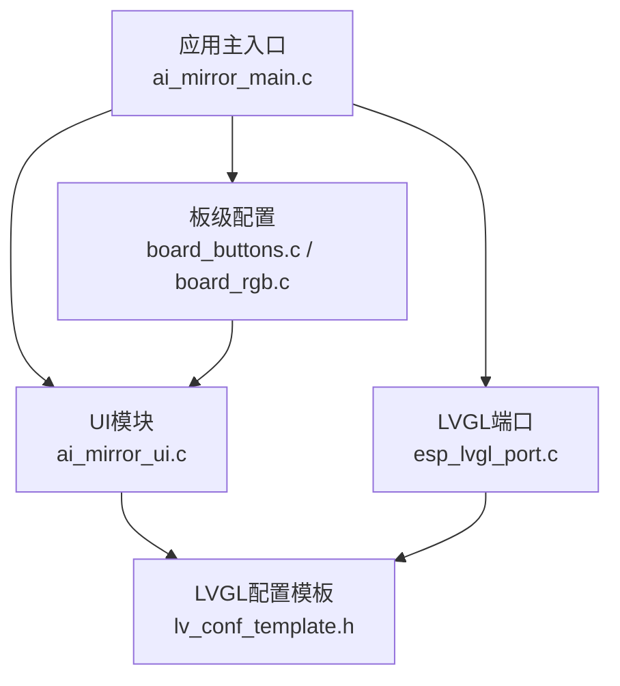
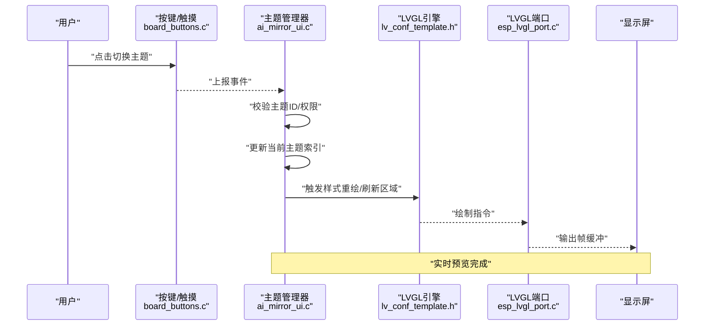
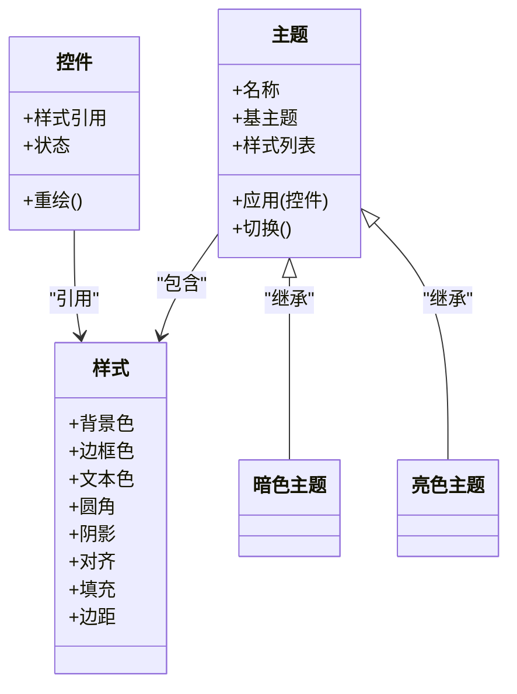
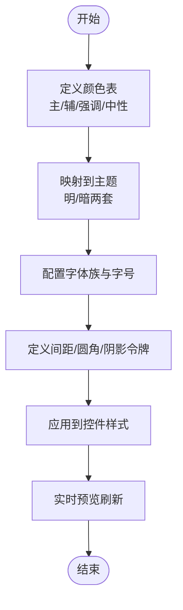
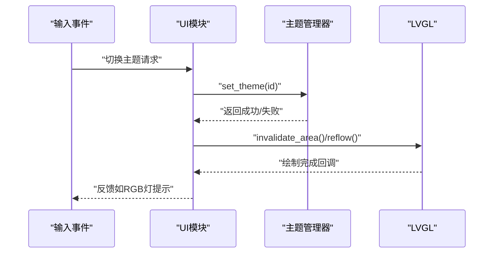
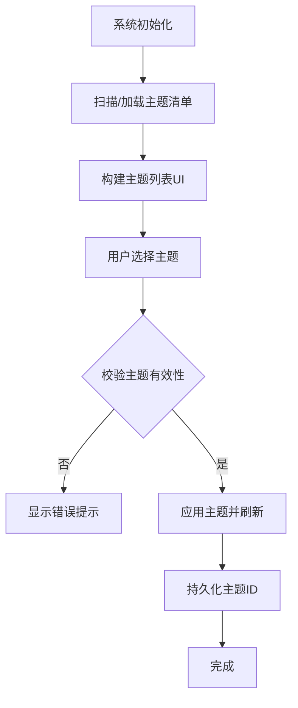
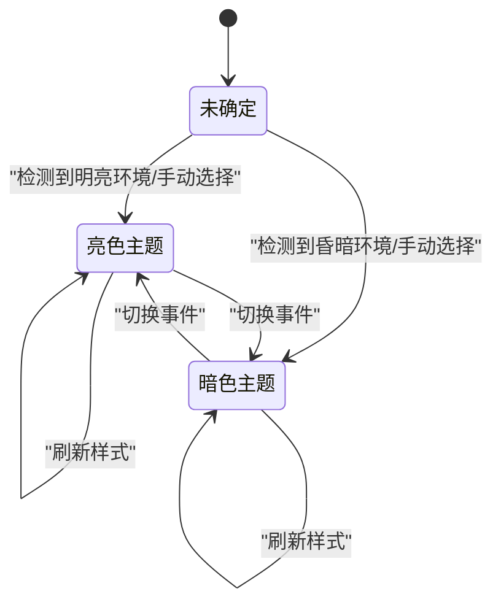
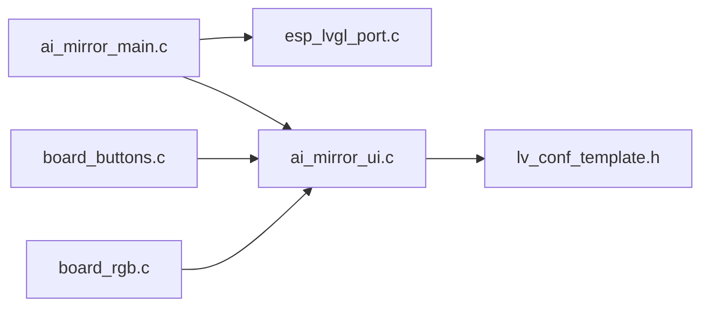

# 主题定制系统

<cite>
**本文引用的文件**   
- [ai_mirror_main.c](file://Firmware/esp32_ai_mirror/main/ai_mirror_main.c)
- [ai_mirror_ui.c](file://Firmware/esp32_ai_mirror/main/ai_mirror_ui.c)
- [ai_mirror_config.h](file://Firmware/esp32_ai_mirror/main/ai_mirror_config.h)
- [board_buttons.c](file://Firmware/esp32_ai_mirror/main/board_buttons.c)
- [board_buttons.h](file://Firmware/esp32_ai_mirror/main/board_buttons.h)
- [board_rgb.c](file://Firmware/esp32_ai_mirror/main/board_rgb.c)
- [board_rgb.h](file://Firmware/esp32_ai_mirror/main/board_rgb.h)
- [esp_lvgl_port.c](file://Firmware/esp32_ai_mirror/managed_components/espressif__esp_lvgl_port/esp_lvgl_port.c)
- [lv_conf_template.h](file://Firmware/esp32_ai_mirror/managed_components/lvgl__lvgl/lv_conf_template.h)
- [README.md](file://README.md)
</cite>

## 目录
1. [简介](#简介)
2. [项目结构](#项目结构)
3. [核心组件](#核心组件)
4. [架构总览](#架构总览)
5. [详细组件分析](#详细组件分析)
6. [依赖关系分析](#依赖关系分析)
7. [性能考虑](#性能考虑)
8. [故障排查指南](#故障排查指南)
9. [结论](#结论)
10. [附录](#附录)

## 简介
本文件面向AI镜子主题定制系统，聚焦LVGL主题架构与样式继承机制，系统性说明颜色方案、字体配置与间距设置定义方法；阐述动态主题切换与实时预览的实现思路；给出预设主题管理与扩展机制；提供自定义主题的创建指南；并总结资源优化与内存使用策略，以及暗色模式与自适应主题的实现要点。文档以代码级分析与可视化图示为主，帮助读者快速掌握主题系统的整体设计与落地实践。

## 项目结构
本项目基于ESP-IDF构建，UI层采用LVGL并通过esp_lvgl_port进行端口适配。主题相关能力集中在应用主入口、UI初始化模块、板级配置与LVGL配置模板中：
- 应用主入口负责系统初始化、显示与触摸驱动、LVGL任务调度与主题加载。
- UI模块负责界面布局、控件样式、主题切换逻辑与实时预览刷新。
- 板级配置包含按键、RGB灯等交互与反馈，用于触发主题切换或预览。
- LVGL配置模板定义了全局样式、字体、颜色、动画与内存策略。
- esp_lvgl_port封装了LVGL与底层显示/触摸驱动的桥接。

图表来源
- [ai_mirror_main.c](file://Firmware/esp32_ai_mirror/main/ai_mirror_main.c)
- [ai_mirror_ui.c](file://Firmware/esp32_ai_mirror/main/ai_mirror_ui.c)
- [esp_lvgl_port.c](file://Firmware/esp32_ai_mirror/managed_components/espressif__esp_lvgl_port/esp_lvgl_port.c)
- [board_buttons.c](file://Firmware/esp32_ai_mirror/main/board_buttons.c)
- [board_rgb.c](file://Firmware/esp32_ai_mirror/main/board_rgb.c)
- [lv_conf_template.h](file://Firmware/esp32_ai_mirror/managed_components/lvgl__lvgl/lv_conf_template.h)

章节来源
- [README.md](file://README.md)

## 核心组件
- 主题管理器（概念）：集中管理主题集合、当前主题索引、主题切换API与事件回调。
- 样式工厂（概念）：按LVGL样式体系生成默认样式、状态样式（按下、聚焦、禁用等）、组件样式（按钮、标签、滑块等）。
- 颜色与字体库（概念）：维护颜色表、明暗主题映射、字体族与字号映射。
- 运行时渲染管线（概念）：监听主题变更事件，批量重绘受影响控件，支持实时预览。
- 持久化存储（概念）：保存用户选择的主题ID、偏好（如是否启用暗色模式、字体大小）。

章节来源
- [ai_mirror_ui.c](file://Firmware/esp32_ai_mirror/main/ai_mirror_ui.c)
- [ai_mirror_config.h](file://Firmware/esp32_ai_mirror/main/ai_mirror_config.h)

## 架构总览
下图展示主题系统在运行时的关键交互：输入事件触发主题切换请求，主题管理器更新当前主题并广播事件，UI模块根据事件批量刷新控件样式，最终通过LVGL渲染到屏幕。

图表来源
- [board_buttons.c](file://Firmware/esp32_ai_mirror/main/board_buttons.c)
- [ai_mirror_ui.c](file://Firmware/esp32_ai_mirror/main/ai_mirror_ui.c)
- [lv_conf_template.h](file://Firmware/esp32_ai_mirror/managed_components/lvgl__lvgl/lv_conf_template.h)
- [esp_lvgl_port.c](file://Firmware/esp32_ai_mirror/managed_components/espressif__esp_lvgl_port/esp_lvgl_port.c)

## 详细组件分析

### LVGL主题架构与样式继承机制
- 主题对象模型：LVGL以“主题”为单位组织样式，主题内包含多个“样式”，每个样式可应用于一个或多个控件实例。
- 继承链：LVGL样式支持继承，子样式覆盖父样式属性；主题也可作为基主题被其他主题继承，便于复用公共样式。
- 状态样式：同一控件在不同状态下（默认、按下、聚焦、禁用等）可拥有独立样式，主题需为常用状态提供完整样式集。
- 样式优先级：具体控件的本地样式优先于主题样式，主题样式优先于全局默认样式。

图表来源
- [lv_conf_template.h](file://Firmware/esp32_ai_mirror/managed_components/lvgl__lvgl/lv_conf_template.h)
- [ai_mirror_ui.c](file://Firmware/esp32_ai_mirror/main/ai_mirror_ui.c)

章节来源
- [lv_conf_template.h](file://Firmware/esp32_ai_mirror/managed_components/lvgl__lvgl/lv_conf_template.h)
- [ai_mirror_ui.c](file://Firmware/esp32_ai_mirror/main/ai_mirror_ui.c)

### 颜色方案、字体配置与间距设置
- 颜色方案：建议以主题为单位定义颜色表（主色、辅色、强调色、中性色），并提供明暗两套映射；控件样式从颜色表中取值，避免硬编码。
- 字体配置：在LVGL配置中启用所需字体，主题中为不同字号层级指定字体族与字号；中文场景需确保中文字体可用且体积可控。
- 间距设置：统一使用设计令牌（如间距、圆角、阴影强度），在主题中集中定义，保证一致性与可维护性。

章节来源
- [ai_mirror_config.h](file://Firmware/esp32_ai_mirror/main/ai_mirror_config.h)
- [lv_conf_template.h](file://Firmware/esp32_ai_mirror/managed_components/lvgl__lvgl/lv_conf_template.h)

### 动态主题切换与实时预览
- 切换流程：接收事件→校验主题→更新主题上下文→触发LVGL刷新→可选动画过渡。
- 实时预览：对受影响的控件区域进行增量刷新，减少全屏重绘开销；必要时使用双缓冲提升流畅度。
- 事件源：按键、触摸、定时器或外部信号均可触发切换。

图表来源
- [board_buttons.c](file://Firmware/esp32_ai_mirror/main/board_buttons.c)
- [board_rgb.c](file://Firmware/esp32_ai_mirror/main/board_rgb.c)
- [ai_mirror_ui.c](file://Firmware/esp32_ai_mirror/main/ai_mirror_ui.c)
- [esp_lvgl_port.c](file://Firmware/esp32_ai_mirror/managed_components/espressif__esp_lvgl_port/esp_lvgl_port.c)

章节来源
- [ai_mirror_ui.c](file://Firmware/esp32_ai_mirror/main/ai_mirror_ui.c)
- [board_buttons.c](file://Firmware/esp32_ai_mirror/main/board_buttons.c)
- [board_rgb.c](file://Firmware/esp32_ai_mirror/main/board_rgb.c)

### 预设主题的管理与扩展机制
- 主题注册：启动时扫描或静态注册主题元数据（名称、描述、图标、是否暗色）。
- 主题选择：提供主题列表界面，支持搜索、预览、收藏与恢复默认。
- 扩展方式：新增主题只需实现样式集与元数据，无需改动核心逻辑；支持热插拔（若文件系统可用）。

章节来源
- [ai_mirror_ui.c](file://Firmware/esp32_ai_mirror/main/ai_mirror_ui.c)
- [ai_mirror_config.h](file://Firmware/esp32_ai_mirror/main/ai_mirror_config.h)

### 自定义主题的创建指南
- 步骤概览：
  1) 定义主题元数据（名称、版本、作者、是否暗色）。
  2) 建立颜色表与字体映射，确保明暗两套。
  3) 为常用控件（按钮、标签、滑块、列表、卡片）编写样式。
  4) 在主题切换时验证样式完整性，缺失项回退到基主题。
  5) 提供预览图与说明，便于用户选择。
- 最佳实践：
  - 使用设计令牌而非硬编码数值。
  - 保持样式粒度适中，避免过度细分导致内存占用过高。
  - 对复杂控件拆分样式，提高复用率。

章节来源
- [ai_mirror_ui.c](file://Firmware/esp32_ai_mirror/main/ai_mirror_ui.c)
- [lv_conf_template.h](file://Firmware/esp32_ai_mirror/managed_components/lvgl__lvgl/lv_conf_template.h)

### 暗色模式与自适应主题
- 暗色模式：提供独立的暗色主题，颜色对比度符合无障碍标准；文本与背景色需满足可读性要求。
- 自适应主题：依据环境光传感器或系统时间自动切换明暗主题；支持用户覆盖自动策略。
- 平滑过渡：切换时使用淡入淡出动画，避免视觉闪烁。

章节来源
- [ai_mirror_ui.c](file://Firmware/esp32_ai_mirror/main/ai_mirror_ui.c)
- [ai_mirror_config.h](file://Firmware/esp32_ai_mirror/main/ai_mirror_config.h)

## 依赖关系分析
- 应用主入口依赖LVGL端口与UI模块，负责生命周期与任务调度。
- UI模块依赖LVGL配置与主题样式，处理交互与刷新。
- 板级模块（按键、RGB）与UI模块解耦，通过事件总线或回调通信。
- LVGL配置模板影响内存分配、字体、动画与渲染策略。

图表来源
- [ai_mirror_main.c](file://Firmware/esp32_ai_mirror/main/ai_mirror_main.c)
- [esp_lvgl_port.c](file://Firmware/esp32_ai_mirror/managed_components/espressif__esp_lvgl_port/esp_lvgl_port.c)
- [ai_mirror_ui.c](file://Firmware/esp32_ai_mirror/main/ai_mirror_ui.c)
- [lv_conf_template.h](file://Firmware/esp32_ai_mirror/managed_components/lvgl__lvgl/lv_conf_template.h)
- [board_buttons.c](file://Firmware/esp32_ai_mirror/main/board_buttons.c)
- [board_rgb.c](file://Firmware/esp32_ai_mirror/main/board_rgb.c)

章节来源
- [ai_mirror_main.c](file://Firmware/esp32_ai_mirror/main/ai_mirror_main.c)
- [esp_lvgl_port.c](file://Firmware/esp32_ai_mirror/managed_components/espressif__esp_lvgl_port/esp_lvgl_port.c)
- [ai_mirror_ui.c](file://Firmware/esp32_ai_mirror/main/ai_mirror_ui.c)
- [lv_conf_template.h](file://Firmware/esp32_ai_mirror/managed_components/lvgl__lvgl/lv_conf_template.h)
- [board_buttons.c](file://Firmware/esp32_ai_mirror/main/board_buttons.c)
- [board_rgb.c](file://Firmware/esp32_ai_mirror/main/board_rgb.c)

## 性能考虑
- 内存优化：
  - 合理配置LVGL内存池与缓存大小，避免频繁分配释放。
  - 字体按需加载，仅启用必要字符集，控制字库体积。
  - 图片资源压缩与格式优化（如SJPEG），减少RAM占用。
- 渲染优化：
  - 使用增量刷新与脏矩形，避免全屏重绘。
  - 开启双缓冲，降低撕裂与卡顿。
  - 控制动画复杂度与帧率，平衡视觉效果与功耗。
- 主题切换优化：
  - 批量更新样式，减少多次无效刷新。
  - 预计算常用样式，避免重复计算。
  - 切换时暂停非关键任务，保证流畅度。

[本节为通用指导，不直接分析具体文件]

## 故障排查指南
- 主题无法切换：
  - 检查主题ID有效性与权限校验逻辑。
  - 确认样式完整性，缺失样式应回退到基主题。
  - 查看LVGL刷新回调是否正常触发。
- 预览卡顿：
  - 评估刷新区域大小与动画复杂度。
  - 调整LVGL内存与缓存参数。
  - 检查是否存在阻塞式操作（如I/O）。
- 暗色模式异常：
  - 验证颜色对比度与可读性。
  - 检查环境光检测阈值与切换策略。
  - 确认用户覆盖设置是否生效。

章节来源
- [ai_mirror_ui.c](file://Firmware/esp32_ai_mirror/main/ai_mirror_ui.c)
- [board_buttons.c](file://Firmware/esp32_ai_mirror/main/board_buttons.c)
- [board_rgb.c](file://Firmware/esp32_ai_mirror/main/board_rgb.c)
- [lv_conf_template.h](file://Firmware/esp32_ai_mirror/managed_components/lvgl__lvgl/lv_conf_template.h)

## 结论
本主题定制系统围绕LVGL的主题与样式体系构建，通过统一的颜色、字体与间距令牌管理，实现了可扩展的主题生态。动态切换与实时预览保障了用户体验，预设主题管理与自定义主题创建降低了开发门槛。结合内存与渲染优化策略，系统在嵌入式平台上具备良好性能与稳定性。未来可进一步引入更多自适应能力与在线主题市场，提升个性化与可维护性。

[本节为总结性内容，不直接分析具体文件]

## 附录
- 术语表：
  - 主题：一组样式的集合，可被控件引用。
  - 样式：控件外观属性的集合，支持状态与继承。
  - 令牌：设计变量的抽象，如颜色、间距、圆角等。
- 参考路径：
  - 主题与UI逻辑：[ai_mirror_ui.c](file://Firmware/esp32_ai_mirror/main/ai_mirror_ui.c)
  - 系统入口与任务调度：[ai_mirror_main.c](file://Firmware/esp32_ai_mirror/main/ai_mirror_main.c)
  - LVGL配置与渲染策略：[lv_conf_template.h](file://Firmware/esp32_ai_mirror/managed_components/lvgl__lvgl/lv_conf_template.h)
  - LVGL端口与驱动桥接：[esp_lvgl_port.c](file://Firmware/esp32_ai_mirror/managed_components/espressif__esp_lvgl_port/esp_lvgl_port.c)
  - 板级交互与反馈：[board_buttons.c](file://Firmware/esp32_ai_mirror/main/board_buttons.c)、[board_rgb.c](file://Firmware/esp32_ai_mirror/main/board_rgb.c)

[本节为补充信息，不直接分析具体文件]