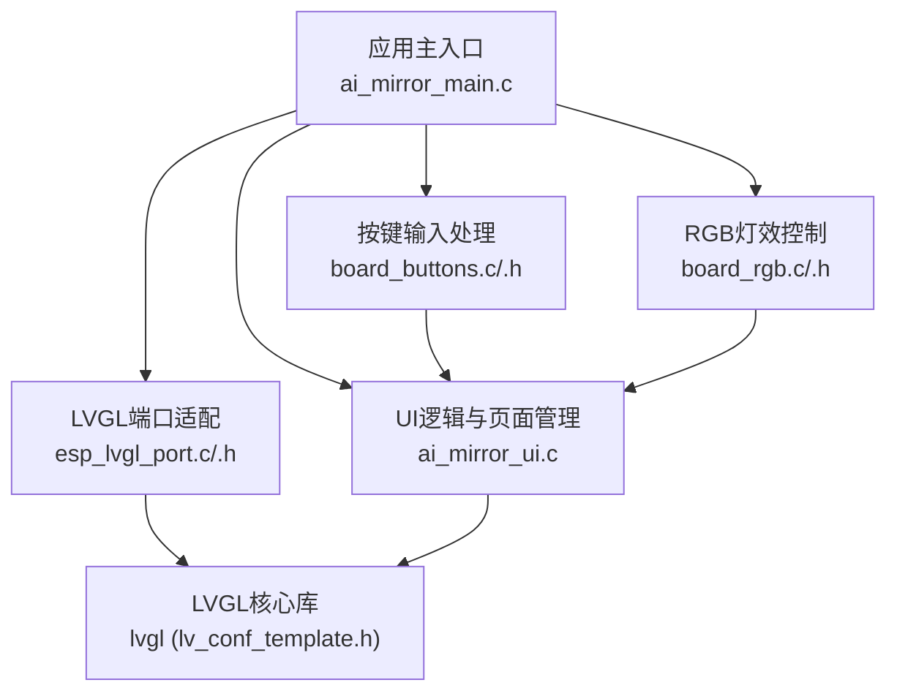
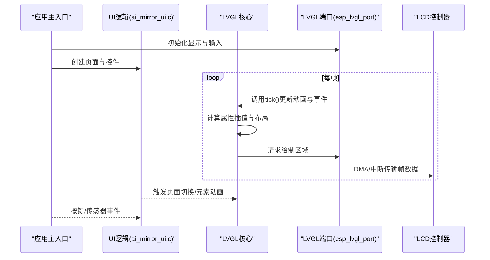
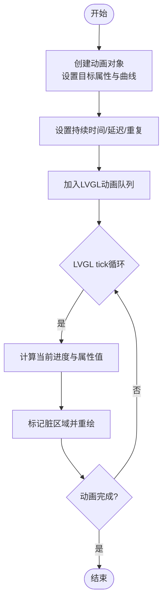
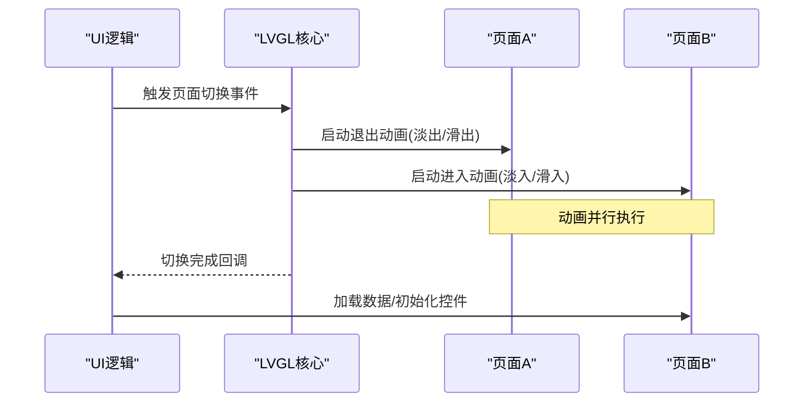
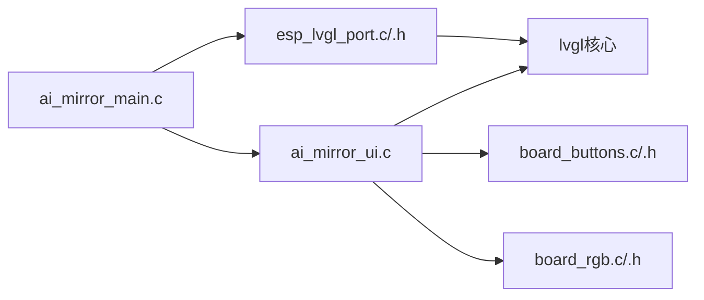

# 动画效果系统

<cite>
**本文档引用的文件**   
- [ai_mirror_main.c](file://Firmware/esp32_ai_mirror/main/ai_mirror_main.c)
- [ai_mirror_ui.c](file://Firmware/esp32_ai_mirror/main/ai_mirror_ui.c)
- [ai_mirror_config.h](file://Firmware/esp32_ai_mirror/main/ai_mirror_config.h)
- [board_buttons.c](file://Firmware/esp32_ai_mirror/main/board_buttons.c)
- [board_buttons.h](file://Firmware/esp32_ai_mirror/main/board_buttons.h)
- [board_rgb.c](file://Firmware/esp32_ai_mirror/main/board_rgb.c)
- [board_rgb.h](file://Firmware/esp32_ai_mirror/main/board_rgb.h)
- [esp_lvgl_port.c](file://Firmware/esp32_ai_mirror/managed_components/espressif__esp_lvgl_port/esp_lvgl_port.c)
- [esp_lvgl_port.h](file://Firmware/esp32_ai_mirror/managed_components/espressif__esp_lvgl_port/include/esp_lvgl_port.h)
- [lv_conf_template.h](file://Firmware/esp32_ai_mirror/managed_components/lvgl__lvgl/lv_conf_template.h)
- [README.md](file://Firmware/esp32_ai_mirror/README.md)
</cite>

## 目录
1. [简介](#简介)
2. [项目结构](#项目结构)
3. [核心组件](#核心组件)
4. [架构总览](#架构总览)
5. [详细组件分析](#详细组件分析)
6. [依赖关系分析](#依赖关系分析)
7. [性能考虑](#性能考虑)
8. [故障排查指南](#故障排查指南)
9. [结论](#结论)
10. [附录](#附录)

## 简介
本文件面向AI镜子动画效果系统，聚焦LVGL动画框架与定时器机制在ESP32平台上的集成与应用。文档涵盖页面切换动画、元素出现/消失动画、过渡效果的实现方式；说明动画曲线配置与时间控制；提供自定义动画效果的创建方法；给出动画性能优化与帧率控制策略；并包含调试与测试工具使用指南以及硬件加速/GPU优化的配置要点。

## 项目结构
本项目基于ESP-IDF构建，UI层采用LVGL并通过esp_lvgl_port进行端口适配。主程序入口负责初始化显示、触摸、音频等外设，并在LVGL任务中驱动界面渲染与动画更新。UI逻辑集中在ai_mirror_ui.c中，用于组织页面、控件与交互事件，从而触发各类动画与过渡。

图表来源
- [ai_mirror_main.c](file://Firmware/esp32_ai_mirror/main/ai_mirror_main.c)
- [esp_lvgl_port.c](file://Firmware/esp32_ai_mirror/managed_components/espressif__esp_lvgl_port/esp_lvgl_port.c)
- [esp_lvgl_port.h](file://Firmware/esp32_ai_mirror/managed_components/espressif__esp_lvgl_port/include/esp_lvgl_port.h)
- [ai_mirror_ui.c](file://Firmware/esp32_ai_mirror/main/ai_mirror_ui.c)
- [board_buttons.c](file://Firmware/esp32_ai_mirror/main/board_buttons.c)
- [board_buttons.h](file://Firmware/esp32_ai_mirror/main/board_buttons.h)
- [board_rgb.c](file://Firmware/esp32_ai_mirror/main/board_rgb.c)
- [board_rgb.h](file://Firmware/esp32_ai_mirror/main/board_rgb.h)
- [lv_conf_template.h](file://Firmware/esp32_ai_mirror/managed_components/lvgl__lvgl/lv_conf_template.h)

章节来源
- [README.md](file://Firmware/esp32_ai_mirror/README.md)

## 核心组件
- LVGL动画框架：通过对象属性插值（位置、大小、透明度、旋转等）与动画队列实现平滑过渡。支持多种内置曲线与自定义曲线回调。
- 定时器机制：LVGL内部维护定时器以驱动动画步进；同时可通过外部定时器或RTOS任务周期触发UI状态变更，确保动画时序稳定。
- 页面切换与过渡：通过容器/屏幕切换与淡入淡出、滑入滑出等组合动画实现流畅的页面导航。
- 元素出现/消失：对控件执行缩放、透明度、位移等动画，常用于提示、加载态与反馈。
- 动画曲线与时间控制：可配置缓动函数（如线性、缓入、缓出、弹性等），并设置持续时间与延迟。
- 自定义动画：通过回调函数定义属性变化规则，结合LVGL动画API实现复杂效果。
- 性能优化：减少重绘区域、批量更新、禁用不必要的阴影/渐变、合理设置刷新频率与双缓冲。
- 调试与测试：利用LVGL内置统计信息、打印日志与仿真环境验证动画时序与性能。
- 硬件加速/GPU：启用LVGL绘制后端与显存优化，配合LCD控制器DMA传输提升帧率。

章节来源
- [lv_conf_template.h](file://Firmware/esp32_ai_mirror/managed_components/lvgl__lvgl/lv_conf_template.h)
- [esp_lvgl_port.c](file://Firmware/esp32_ai_mirror/managed_components/espressif__esp_lvgl_port/esp_lvgl_port.c)
- [esp_lvgl_port.h](file://Firmware/esp32_ai_mirror/managed_components/espressif__esp_lvgl_port/include/esp_lvgl_port.h)
- [ai_mirror_ui.c](file://Firmware/esp32_ai_mirror/main/ai_mirror_ui.c)

## 架构总览
下图展示从应用主入口到LVGL渲染管线的关键路径，包括输入事件、UI逻辑、动画调度与显示输出。

图表来源
- [ai_mirror_main.c](file://Firmware/esp32_ai_mirror/main/ai_mirror_main.c)
- [ai_mirror_ui.c](file://Firmware/esp32_ai_mirror/main/ai_mirror_ui.c)
- [esp_lvgl_port.c](file://Firmware/esp32_ai_mirror/managed_components/espressif__esp_lvgl_port/esp_lvgl_port.c)
- [esp_lvgl_port.h](file://Firmware/esp32_ai_mirror/managed_components/espressif__esp_lvgl_port/include/esp_lvgl_port.h)

## 详细组件分析

### LVGL动画框架与定时器机制
- 动画对象与队列：每个动画绑定目标对象与属性变化规则，按时间步长推进，直至完成或中断。
- 定时器驱动：LVGL内部tick循环驱动动画步进；外部可通过定时器回调触发UI状态变更，保证动画与业务逻辑解耦。
- 曲线与时间：支持内置曲线与自定义回调；可设置持续时间、延迟、重复次数与结束回调。
- 并发与优先级：动画更新与渲染分离，避免阻塞；高优先级事件可打断低优先级动画。

图表来源
- [lv_conf_template.h](file://Firmware/esp32_ai_mirror/managed_components/lvgl__lvgl/lv_conf_template.h)
- [esp_lvgl_port.c](file://Firmware/esp32_ai_mirror/managed_components/espressif__esp_lvgl_port/esp_lvgl_port.c)

章节来源
- [lv_conf_template.h](file://Firmware/esp32_ai_mirror/managed_components/lvgl__lvgl/lv_conf_template.h)
- [esp_lvgl_port.c](file://Firmware/esp32_ai_mirror/managed_components/espressif__esp_lvgl_port/esp_lvgl_port.c)

### 页面切换动画与过渡效果
- 切换模式：淡入淡出、滑入滑出、缩放过渡等，可组合使用。
- 实现要点：
  - 使用容器/屏幕作为页面载体，切换时先隐藏旧页面再显示新页面。
  - 通过动画队列编排多个属性的同步变化，确保视觉连贯。
  - 在切换前后插入回调以清理资源或加载数据。
- 时序控制：根据页面复杂度调整持续时间，避免卡顿；必要时分帧加载内容。

图表来源
- [ai_mirror_ui.c](file://Firmware/esp32_ai_mirror/main/ai_mirror_ui.c)

章节来源
- [ai_mirror_ui.c](file://Firmware/esp32_ai_mirror/main/ai_mirror_ui.c)

### 元素出现/消失动画
- 常见效果：缩放、透明度渐变、位移、旋转等。
- 使用场景：提示框、加载指示器、列表项入场/离场。
- 最佳实践：
  - 批量更新以减少重绘次数。
  - 对频繁出现的元素预创建实例，复用动画参数。
  - 避免在动画期间进行昂贵操作（如网络请求）。

章节来源
- [ai_mirror_ui.c](file://Firmware/esp32_ai_mirror/main/ai_mirror_ui.c)

### 动画曲线配置与时间控制
- 内置曲线：线性、缓入、缓出、弹性、回弹等。
- 自定义曲线：通过回调函数定义进度映射，实现特殊节奏。
- 时间控制：持续时间、延迟、重复次数、结束回调；可动态修改进行中动画的时间参数。

章节来源
- [lv_conf_template.h](file://Firmware/esp32_ai_mirror/managed_components/lvgl__lvgl/lv_conf_template.h)

### 自定义动画效果的创建方法
- 步骤概览：
  - 定义目标对象与属性范围。
  - 选择或实现曲线函数。
  - 设置持续时间与重复策略。
  - 注册开始/结束回调以处理资源与状态。
- 注意事项：
  - 避免在回调中进行阻塞操作。
  - 合理使用动画优先级，防止相互干扰。
  - 对复杂效果拆分多个简单动画组合。

章节来源
- [lv_conf_template.h](file://Firmware/esp32_ai_mirror/managed_components/lvgl__lvgl/lv_conf_template.h)

### 动画性能优化与帧率控制
- 渲染优化：
  - 启用双缓冲与部分刷新，减少全屏重绘。
  - 合并相邻脏区域，降低总线压力。
  - 禁用不必要的阴影、渐变与透明叠加。
- CPU/GPU平衡：
  - 将复杂计算移至后台线程，避免阻塞UI线程。
  - 利用DMA传输与LCD控制器特性提升吞吐。
- 帧率控制：
  - 设置合适的LVGL tick频率，匹配显示器刷新率。
  - 监控帧耗时，动态调整动画时长与复杂度。

章节来源
- [esp_lvgl_port.c](file://Firmware/esp32_ai_mirror/managed_components/espressif__esp_lvgl_port/esp_lvgl_port.c)
- [lv_conf_template.h](file://Firmware/esp32_ai_mirror/managed_components/lvgl__lvgl/lv_conf_template.h)

### 动画调试与测试工具使用指南
- 运行时统计：启用LVGL统计信息，观察帧率、CPU占用与内存使用。
- 日志输出：在动画关键节点添加日志，追踪时序与异常。
- 仿真环境：使用LVGL模拟器快速验证动画效果与曲线。
- 自动化测试：编写用例覆盖页面切换、元素动画与边界条件。

章节来源
- [lv_conf_template.h](file://Firmware/esp32_ai_mirror/managed_components/lvgl__lvgl/lv_conf_template.h)

### 硬件加速与GPU优化配置
- 显示后端：配置LVGL绘制后端为硬件加速（如DMA、GPU）。
- 显存优化：启用图像缓存与像素格式转换优化。
- 刷新策略：设置合理的刷新模式（全刷/部分刷）与刷新频率。
- 外设协同：与LCD控制器、触摸控制器协同工作，减少冲突。

章节来源
- [esp_lvgl_port.c](file://Firmware/esp32_ai_mirror/managed_components/espressif__esp_lvgl_port/esp_lvgl_port.c)
- [esp_lvgl_port.h](file://Firmware/esp32_ai_mirror/managed_components/espressif__esp_lvgl_port/include/esp_lvgl_port.h)
- [lv_conf_template.h](file://Firmware/esp32_ai_mirror/managed_components/lvgl__lvgl/lv_conf_template.h)

## 依赖关系分析
- 应用主入口依赖LVGL端口与UI逻辑模块。
- UI逻辑依赖LVGL核心库与输入/输出抽象。
- 按键与RGB灯效模块为UI提供交互与反馈。
- LVGL端口屏蔽底层差异，向上提供统一接口。

图表来源
- [ai_mirror_main.c](file://Firmware/esp32_ai_mirror/main/ai_mirror_main.c)
- [esp_lvgl_port.c](file://Firmware/esp32_ai_mirror/managed_components/espressif__esp_lvgl_port/esp_lvgl_port.c)
- [esp_lvgl_port.h](file://Firmware/esp32_ai_mirror/managed_components/espressif__esp_lvgl_port/include/esp_lvgl_port.h)
- [ai_mirror_ui.c](file://Firmware/esp32_ai_mirror/main/ai_mirror_ui.c)
- [board_buttons.c](file://Firmware/esp32_ai_mirror/main/board_buttons.c)
- [board_buttons.h](file://Firmware/esp32_ai_mirror/main/board_buttons.h)
- [board_rgb.c](file://Firmware/esp32_ai_mirror/main/board_rgb.c)
- [board_rgb.h](file://Firmware/esp32_ai_mirror/main/board_rgb.h)

章节来源
- [ai_mirror_main.c](file://Firmware/esp32_ai_mirror/main/ai_mirror_main.c)
- [ai_mirror_ui.c](file://Firmware/esp32_ai_mirror/main/ai_mirror_ui.c)
- [esp_lvgl_port.c](file://Firmware/esp32_ai_mirror/managed_components/espressif__esp_lvgl_port/esp_lvgl_port.c)
- [esp_lvgl_port.h](file://Firmware/esp32_ai_mirror/managed_components/espressif__esp_lvgl_port/include/esp_lvgl_port.h)

## 性能考虑
- 动画复杂度：限制同时运行的动画数量，优先保证关键路径流畅。
- 渲染开销：减少透明叠加与阴影，使用纯色背景与简单样式。
- 内存使用：预分配常用控件与图像，避免运行时频繁分配。
- 刷新策略：根据内容变化范围选择局部刷新，降低总线负载。
- 帧率监控：持续跟踪帧耗时与CPU占用，动态调整动画参数。

[本节为通用指导，不直接分析具体文件]

## 故障排查指南
- 动画卡顿：检查LVGL tick频率与渲染任务优先级；确认是否存在阻塞操作。
- 画面撕裂：调整刷新模式与双缓冲配置；确保DMA传输完整。
- 内存不足：减少图像尺寸与控件数量；启用内存池与缓存。
- 输入冲突：协调触摸与按键事件处理顺序，避免误触发。
- 日志定位：在动画回调与事件处理中添加详细日志，逐步缩小问题范围。

章节来源
- [lv_conf_template.h](file://Firmware/esp32_ai_mirror/managed_components/lvgl__lvgl/lv_conf_template.h)
- [esp_lvgl_port.c](file://Firmware/esp32_ai_mirror/managed_components/espressif__esp_lvgl_port/esp_lvgl_port.c)

## 结论
AI镜子动画效果系统基于LVGL与ESP-IDF生态，通过合理的架构设计与性能优化，实现了流畅的页面切换与元素动画。借助定时器机制与曲线配置，开发者可灵活定制动画行为；结合硬件加速与调试工具，可进一步提升用户体验与开发效率。建议在实际项目中持续监控性能指标，按需调整动画策略与资源配置。

[本节为总结性内容，不直接分析具体文件]

## 附录
- 参考文件：
  - [ai_mirror_main.c](file://Firmware/esp32_ai_mirror/main/ai_mirror_main.c)
  - [ai_mirror_ui.c](file://Firmware/esp32_ai_mirror/main/ai_mirror_ui.c)
  - [ai_mirror_config.h](file://Firmware/esp32_ai_mirror/main/ai_mirror_config.h)
  - [board_buttons.c](file://Firmware/esp32_ai_mirror/main/board_buttons.c)
  - [board_buttons.h](file://Firmware/esp32_ai_mirror/main/board_buttons.h)
  - [board_rgb.c](file://Firmware/esp32_ai_mirror/main/board_rgb.c)
  - [board_rgb.h](file://Firmware/esp32_ai_mirror/main/board_rgb.h)
  - [esp_lvgl_port.c](file://Firmware/esp32_ai_mirror/managed_components/espressif__esp_lvgl_port/esp_lvgl_port.c)
  - [esp_lvgl_port.h](file://Firmware/esp32_ai_mirror/managed_components/espressif__esp_lvgl_port/include/esp_lvgl_port.h)
  - [lv_conf_template.h](file://Firmware/esp32_ai_mirror/managed_components/lvgl__lvgl/lv_conf_template.h)
  - [README.md](file://Firmware/esp32_ai_mirror/README.md)

[本节为附录，不直接分析具体文件]