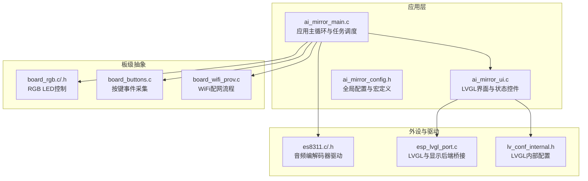
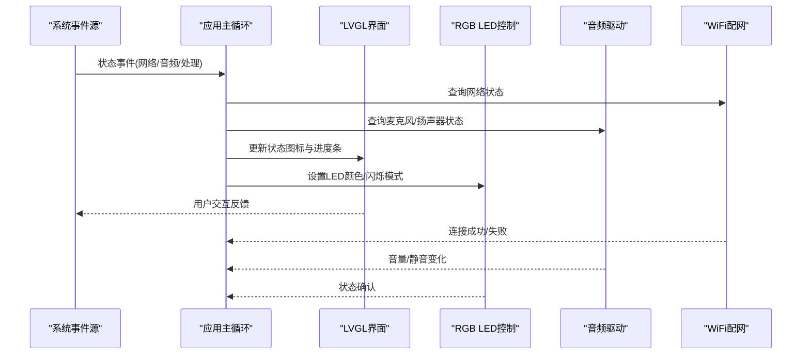
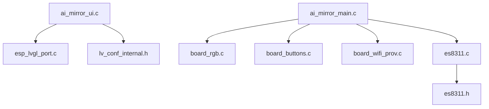

# 状态显示系统

<cite>
**本文引用的文件**   
- [ai_mirror_main.c](file://Firmware/esp32_ai_mirror/main/ai_mirror_main.c)
- [ai_mirror_ui.c](file://Firmware/esp32_ai_mirror/main/ai_mirror_ui.c)
- [board_rgb.c](file://Firmware/esp32_ai_mirror/main/board_rgb.c)
- [board_rgb.h](file://Firmware/esp32_ai_mirror/main/board_rgb.h)
- [board_buttons.c](file://Firmware/esp32_ai_mirror/main/board_buttons.c)
- [board_wifi_prov.c](file://Firmware/esp32_ai_mirror/main/board_wifi_prov.c)
- [ai_mirror_config.h](file://Firmware/esp32_ai_mirror/main/ai_mirror_config.h)
- [es8311.c](file://Firmware/esp32_ai_mirror/managed_components/espressif__es8311/es8311.c)
- [es8311.h](file://Firmware/esp32_ai_mirror/managed_components/espressif__es8311/include/es8311.h)
- [esp_lvgl_port.c](file://Firmware/esp32_ai_mirror/managed_components/espressif__esp_lvgl_port/esp_lvgl_port.c)
- [lv_conf_internal.h](file://Firmware/esp32_ai_mirror/managed_components/lvgl__lvgl/src/lv_conf_internal.h)
</cite>

## 目录
1. [简介](#简介)
2. [项目结构](#项目结构)
3. [核心组件](#核心组件)
4. [架构总览](#架构总览)
5. [详细组件分析](#详细组件分析)
6. [依赖关系分析](#依赖关系分析)
7. [性能考虑](#性能考虑)
8. [故障排查指南](#故障排查指南)
9. [结论](#结论)
10. [附录](#附录)

## 简介
本文件面向AI镜子状态显示系统，系统性说明网络、麦克风、扬声器、处理等状态指示器的实现与交互机制。文档涵盖进度条、指示灯与状态图标的UI实现，实时数据更新与动态显示机制，RGB LED状态控制与视觉效果，状态消息的显示与隐藏逻辑，以及自定义状态指示器的扩展方法与状态同步一致性保证策略。读者无需深入底层即可理解整体设计，同时为开发者提供可落地的扩展路径。

## 项目结构
本项目基于ESP-IDF构建，使用LVGL作为图形界面库，结合板级驱动（音频编解码器、WiFi配网、RGB LED）完成状态显示与交互。关键目录与职责如下：
- main：应用入口、UI渲染、板级功能封装（RGB、按键、WiFi配网）、配置头文件
- managed_components：第三方组件（LVGL、ESP-LVGL端口、ES8311音频编解码器、触摸与LCD驱动等）
- components：语音识别与TTS相关组件（与本状态显示系统间接相关）

图表来源
- [ai_mirror_main.c](file://Firmware/esp32_ai_mirror/main/ai_mirror_main.c)
- [ai_mirror_ui.c](file://Firmware/esp32_ai_mirror/main/ai_mirror_ui.c)
- [board_rgb.c](file://Firmware/esp32_ai_mirror/main/board_rgb.c)
- [board_buttons.c](file://Firmware/esp32_ai_mirror/main/board_buttons.c)
- [board_wifi_prov.c](file://Firmware/esp32_ai_mirror/main/board_wifi_prov.c)
- [es8311.c](file://Firmware/esp32_ai_mirror/managed_components/espressif__es8311/es8311.c)
- [esp_lvgl_port.c](file://Firmware/esp32_ai_mirror/managed_components/espressif__esp_lvgl_port/esp_lvgl_port.c)
- [lv_conf_internal.h](file://Firmware/esp32_ai_mirror/managed_components/lvgl__lvgl/src/lv_conf_internal.h)

章节来源
- [ai_mirror_main.c](file://Firmware/esp32_ai_mirror/main/ai_mirror_main.c)
- [ai_mirror_ui.c](file://Firmware/esp32_ai_mirror/main/ai_mirror_ui.c)
- [ai_mirror_config.h](file://Firmware/esp32_ai_mirror/main/ai_mirror_config.h)

## 核心组件
- UI与状态控件：基于LVGL构建的状态图标、进度条、指示灯与消息提示区域，负责将系统状态映射到可视化元素。
- 板级RGB控制：通过board_rgb模块统一控制RGB LED颜色与闪烁模式，用于快速指示设备状态（如连接中、错误、空闲）。
- 音频子系统：通过es8311驱动管理麦克风和扬声器的初始化、音量与静音状态，UI据此更新麦克风/扬声器状态图标。
- WiFi配网与网络状态：board_wifi_prov负责配网流程与连接状态上报，UI根据连接结果更新网络状态指示。
- 任务与事件总线：应用主循环收集各子系统事件，分发至UI线程进行安全刷新，确保跨线程一致性与流畅度。

章节来源
- [ai_mirror_ui.c](file://Firmware/esp32_ai_mirror/main/ai_mirror_ui.c)
- [board_rgb.c](file://Firmware/esp32_ai_mirror/main/board_rgb.c)
- [board_rgb.h](file://Firmware/esp32_ai_mirror/main/board_rgb.h)
- [es8311.c](file://Firmware/esp32_ai_mirror/managed_components/espressif__es8311/es8311.c)
- [board_wifi_prov.c](file://Firmware/esp32_ai_mirror/main/board_wifi_prov.c)

## 架构总览
状态显示系统采用“事件驱动 + LVGL UI”的架构：各子系统产生状态事件，应用层聚合并转换为UI更新指令，由LVGL在独立刷新周期内渲染。

图表来源
- [ai_mirror_main.c](file://Firmware/esp32_ai_mirror/main/ai_mirror_main.c)
- [ai_mirror_ui.c](file://Firmware/esp32_ai_mirror/main/ai_mirror_ui.c)
- [board_rgb.c](file://Firmware/esp32_ai_mirror/main/board_rgb.c)
- [es8311.c](file://Firmware/esp32_ai_mirror/managed_components/espressif__es8311/es8311.c)
- [board_wifi_prov.c](file://Firmware/esp32_ai_mirror/main/board_wifi_prov.c)

## 详细组件分析

### 网络连接状态指示
- 数据来源：WiFi配网模块返回的连接状态（搜索、连接中、已连接、断开、认证失败等）。
- UI表现：网络图标颜色或动画变化；进度条展示连接阶段；消息区显示错误原因。
- 更新机制：事件触发后，应用层调用UI更新接口，避免直接跨线程操作LVGL对象。
- 一致性保证：状态变更集中派发，UI侧去抖与合并更新，防止频繁重绘。

章节来源
- [board_wifi_prov.c](file://Firmware/esp32_ai_mirror/main/board_wifi_prov.c)
- [ai_mirror_ui.c](file://Firmware/esp32_ai_mirror/main/ai_mirror_ui.c)

### 麦克风状态指示
- 数据来源：音频驱动初始化结果、输入通道启用/禁用、静音状态。
- UI表现：麦克风图标高亮/灰化；录音时增加脉冲动画；错误时显示警告图标。
- 更新机制：音频回调或状态查询后，通过事件队列通知UI刷新。
- 一致性保证：状态变量加锁保护，UI仅在LVGL线程内更新。

章节来源
- [es8311.c](file://Firmware/esp32_ai_mirror/managed_components/espressif__es8311/es8311.c)
- [ai_mirror_ui.c](file://Firmware/esp32_ai_mirror/main/ai_mirror_ui.c)

### 扬声器状态指示
- 数据来源：音频输出通道状态、音量值、静音标志。
- UI表现：扬声器图标随音量变化；播放时显示波形或进度；静音时图标变灰。
- 更新机制：音量调节事件与播放状态事件驱动UI更新。
- 一致性保证：音量与静音状态原子更新，UI批量刷新减少闪烁。

章节来源
- [es8311.c](file://Firmware/esp32_ai_mirror/managed_components/espressif__es8311/es8311.c)
- [ai_mirror_ui.c](file://Firmware/esp32_ai_mirror/main/ai_mirror_ui.c)

### 处理状态指示
- 数据来源：语音识别、TTS合成、网络请求等处理阶段的进度与结果。
- UI表现：环形进度条或线性进度条；处理中显示旋转动画；完成或失败切换图标。
- 更新机制：处理任务周期性上报进度，UI按阈值增量更新，降低刷新频率。
- 一致性保证：进度值单调递增校验，异常中断恢复默认状态。

章节来源
- [ai_mirror_ui.c](file://Firmware/esp32_ai_mirror/main/ai_mirror_ui.c)
- [ai_mirror_main.c](file://Firmware/esp32_ai_mirror/main/ai_mirror_main.c)

### 进度条、指示灯与状态图标实现
- 进度条：使用LVGL进度条控件，支持线性与环形样式；通过事件回调绑定数据源。
- 指示灯：使用LVGL指示灯或自定义圆形控件，颜色与透明度反映状态等级。
- 状态图标：预置SVG或位图资源，按状态切换图标实例；支持动画过渡提升体验。
- 动态显示：基于LVGL定时器与事件循环，确保UI线程安全与低延迟。

章节来源
- [ai_mirror_ui.c](file://Firmware/esp32_ai_mirror/main/ai_mirror_ui.c)
- [esp_lvgl_port.c](file://Firmware/esp32_ai_mirror/managed_components/espressif__esp_lvgl_port/esp_lvgl_port.c)
- [lv_conf_internal.h](file://Firmware/esp32_ai_mirror/managed_components/lvgl__lvgl/src/lv_conf_internal.h)

### RGB LED状态控制与视觉效果
- 控制接口：board_rgb提供统一API设置颜色、亮度与闪烁模式。
- 视觉语义：不同颜色代表不同状态（如绿色表示正常，红色表示错误，蓝色表示连接中）。
- 效果策略：静态颜色、呼吸灯、快闪/慢闪组合表达忙/错/等待等状态。
- 同步机制：LED状态与UI状态保持一致，避免冲突显示。

章节来源
- [board_rgb.c](file://Firmware/esp32_ai_mirror/main/board_rgb.c)
- [board_rgb.h](file://Firmware/esp32_ai_mirror/main/board_rgb.h)
- [ai_mirror_ui.c](file://Firmware/esp32_ai_mirror/main/ai_mirror_ui.c)

### 状态消息的显示与隐藏逻辑
- 显示条件：错误、警告、提示类事件触发时，消息区显示对应文本与图标。
- 自动隐藏：超时后自动消失；用户交互（点击/滑动）可提前关闭。
- 优先级：多条消息按优先级排队显示，避免覆盖重要信息。
- 动画：淡入淡出与滑入滑出增强可读性。

章节来源
- [ai_mirror_ui.c](file://Firmware/esp32_ai_mirror/main/ai_mirror_ui.c)

### 实时数据更新与动态显示机制
- 事件队列：各子系统通过队列发送状态事件，应用层消费并分发。
- 刷新节流：UI更新设置最小间隔与阈值，避免高频重绘。
- 增量更新：仅更新变化部分，减少LVGL绘制开销。
- 线程安全：所有LVGL对象修改在UI线程执行，其他线程仅投递事件。

章节来源
- [ai_mirror_main.c](file://Firmware/esp32_ai_mirror/main/ai_mirror_main.c)
- [ai_mirror_ui.c](file://Firmware/esp32_ai_mirror/main/ai_mirror_ui.c)
- [esp_lvgl_port.c](file://Firmware/esp32_ai_mirror/managed_components/espressif__esp_lvgl_port/esp_lvgl_port.c)

### 自定义状态指示器的扩展方法
- 新增状态类型：在配置头文件中定义新状态枚举与显示规则。
- UI控件扩展：在UI模块中添加对应控件与样式，绑定事件回调。
- 事件接入：在各子系统事件中注册新状态的触发条件与参数。
- 测试验证：编写用例覆盖状态切换、动画与一致性检查。

章节来源
- [ai_mirror_config.h](file://Firmware/esp32_ai_mirror/main/ai_mirror_config.h)
- [ai_mirror_ui.c](file://Firmware/esp32_ai_mirror/main/ai_mirror_ui.c)

### 状态同步与一致性保证机制
- 单一事实源：每个状态有唯一的数据持有者，UI只读该状态。
- 事件去重：相同状态短时间内重复事件合并，避免抖动。
- 回退策略：当数据源不可用时，UI显示“未知”或保持上一有效状态。
- 日志追踪：关键状态变更记录日志，便于问题定位。

章节来源
- [ai_mirror_main.c](file://Firmware/esp32_ai_mirror/main/ai_mirror_main.c)
- [ai_mirror_ui.c](file://Firmware/esp32_ai_mirror/main/ai_mirror_ui.c)

## 依赖关系分析
状态显示系统的依赖关系清晰分层：应用层依赖板级抽象与驱动，UI层依赖LVGL与端口适配。

图表来源
- [ai_mirror_ui.c](file://Firmware/esp32_ai_mirror/main/ai_mirror_ui.c)
- [esp_lvgl_port.c](file://Firmware/esp32_ai_mirror/managed_components/espressif__esp_lvgl_port/esp_lvgl_port.c)
- [lv_conf_internal.h](file://Firmware/esp32_ai_mirror/managed_components/lvgl__lvgl/src/lv_conf_internal.h)
- [ai_mirror_main.c](file://Firmware/esp32_ai_mirror/main/ai_mirror_main.c)
- [board_rgb.c](file://Firmware/esp32_ai_mirror/main/board_rgb.c)
- [board_buttons.c](file://Firmware/esp32_ai_mirror/main/board_buttons.c)
- [board_wifi_prov.c](file://Firmware/esp32_ai_mirror/main/board_wifi_prov.c)
- [es8311.c](file://Firmware/esp32_ai_mirror/managed_components/espressif__es8311/es8311.c)
- [es8311.h](file://Firmware/esp32_ai_mirror/managed_components/espressif__es8311/include/es8311.h)

章节来源
- [ai_mirror_main.c](file://Firmware/esp32_ai_mirror/main/ai_mirror_main.c)
- [ai_mirror_ui.c](file://Firmware/esp32_ai_mirror/main/ai_mirror_ui.c)
- [board_rgb.c](file://Firmware/esp32_ai_mirror/main/board_rgb.c)
- [board_wifi_prov.c](file://Firmware/esp32_ai_mirror/main/board_wifi_prov.c)
- [es8311.c](file://Firmware/esp32_ai_mirror/managed_components/espressif__es8311/es8311.c)

## 性能考虑
- UI刷新节流：限制LVGL更新频率，合并多次状态变更，降低CPU占用。
- 增量绘制：仅更新变化控件，避免全量重绘。
- 事件批处理：将多个事件合并为一次UI更新，减少上下文切换。
- 资源优化：预加载常用图标与样式，减少运行时分配。
- 内存管理：避免频繁创建销毁对象，复用控件实例。

[本节为通用指导，不直接分析具体文件]

## 故障排查指南
- 网络状态异常：检查WiFi配网流程返回值与重试策略；查看消息区错误码；确认路由器与SSID配置。
- 麦克风无输入：验证音频驱动初始化是否成功；检查输入通道与静音状态；确认硬件连接。
- 扬声器无声：检查输出通道与音量设置；确认静音标志；验证音频数据流是否正常。
- UI卡顿：观察LVGL刷新频率；检查是否有阻塞调用；评估事件队列长度。
- RGB LED异常：核对颜色与闪烁模式配置；检查GPIO与PWM配置；确认状态同步逻辑。

章节来源
- [board_wifi_prov.c](file://Firmware/esp32_ai_mirror/main/board_wifi_prov.c)
- [es8311.c](file://Firmware/esp32_ai_mirror/managed_components/espressif__es8311/es8311.c)
- [ai_mirror_ui.c](file://Firmware/esp32_ai_mirror/main/ai_mirror_ui.c)
- [board_rgb.c](file://Firmware/esp32_ai_mirror/main/board_rgb.c)

## 结论
AI镜子状态显示系统以事件驱动为核心，结合LVGL与板级驱动实现了稳定、直观的状态可视化。通过统一的更新机制与一致性保障，系统在复杂场景下仍能保持流畅与可靠。未来可通过扩展自定义状态指示器与优化刷新策略进一步提升用户体验。

[本节为总结，不直接分析具体文件]

## 附录
- 状态语义建议：
  - 网络：绿=已连接，蓝=连接中，红=断开/错误
  - 麦克风：亮=可用，灰=禁用，脉冲=录音中
  - 扬声器：亮=播放，灰=静音，波形=音量变化
  - 处理：旋转=进行中，完成=对勾，失败=叉号
- 扩展步骤清单：
  - 定义新状态枚举与显示规则
  - 在UI模块添加控件与样式
  - 接入事件源并绑定回调
  - 编写测试用例验证一致性

[本节为补充信息，不直接分析具体文件]